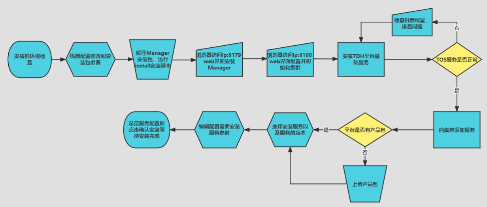
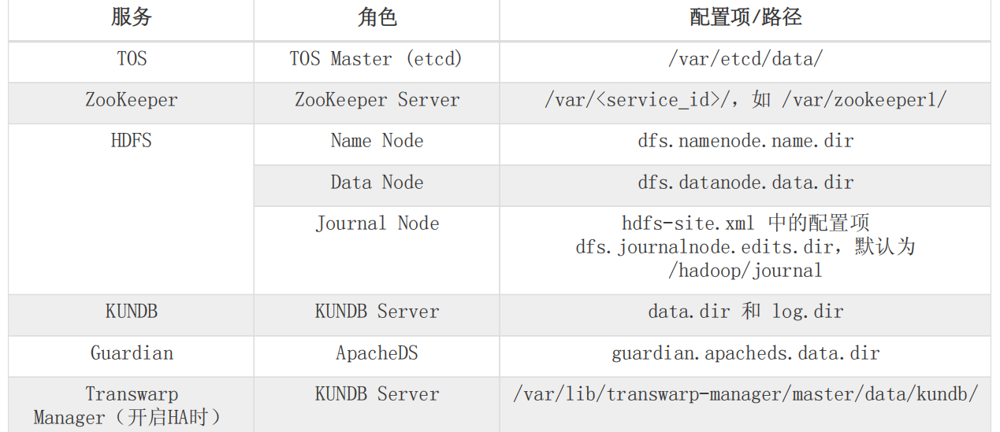
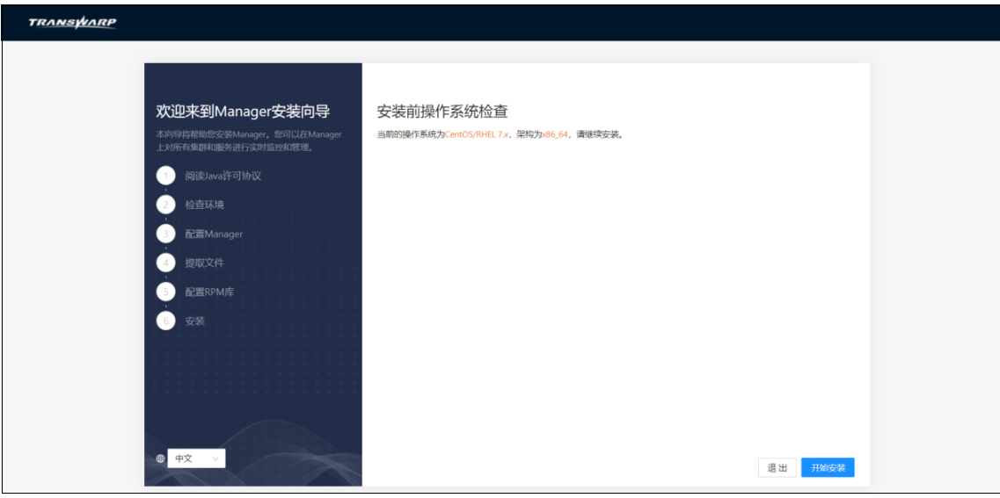
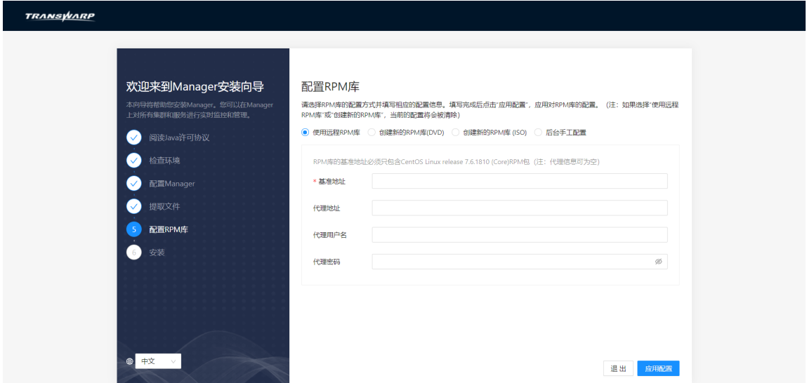

# 安装流程



## 硬件环境要求

是3台以上物理服务器组成

• 2颗6核心或以上带超线程x86指令集或ARM指令集CPU的服务器

• 64GB以上内存

• 2个300G以上的硬盘做RAID1，作为系统盘

• 4个以上的300GB容量以上的 硬盘作为数据存放硬盘

• 2个千兆以上网卡

检查方法：

```
# 查看CPU详细信息
cat /proc/cpuinfo
# 查看CPU核心数（物理核心）
lscpu | grep "Core(s) per socket"
# 查看CPU线程数（核心数×超线程）
lscpu | grep "CPU(s):"
# 查看CPU架构（x86或ARM）
lscpu | grep "Architecture"
# 查看具体指令集
lscpu | grep "Flags"

# 查看总内存（以GB为单位）
free -h
# 或
cat /proc/meminfo | grep MemTotal
# 详细内存信息
dmidecode -t memory | grep -A16 "Memory Device"

# 查看所有磁盘信息
lsblk -o NAME,SIZE,TYPE,MOUNTPOINT,ROTA

# 查看RAID信息
cat /proc/mdstat  # 软件RAID
lspci | grep -i raid  # RAID卡
# 检查分区和挂载
df -hT
# 查看硬盘详细信息
sudo fdisk -l
# 或
lsblk -d -o NAME,SIZE,TYPE,ROTA,MODEL

# 查找根分区所在磁盘
df / | grep -o "^/dev/[a-z]*"
# 查看该磁盘大小
lsblk /dev/sda  # 替换为你的根分区磁盘
# 检查RAID1（系统盘应该是两个相同大小的磁盘做RAID1）
mdadm --detail /dev/md0  # 如果有软件RAID

# 查看所有网卡
ip link show
# 查看网卡详细信息
lspci | grep -i ethernet
# 查看网卡速度
ethtool eth0  # 替换为你的网卡名
ethtool eth1
# 检查网卡是否启用
ip addr show
```


```
#!/bin/bash
echo "=========== 硬件配置检查 ==========="
echo

echo "1. CPU检查："
echo "----------------------------------"
lscpu | grep -E "Architecture:|CPU\(s\):|Core\(s\) per socket:|Thread\(s\) per core:|Model name:"
echo

echo "2. 内存检查："
echo "----------------------------------"
echo "总内存："
free -h | grep Mem
echo

echo "3. 磁盘检查："
echo "----------------------------------"
echo "磁盘列表："
lsblk -o NAME,SIZE,TYPE,MOUNTPOINT,ROTA | grep -v loop
echo
echo "RAID状态："
if [ -f /proc/mdstat ]; then
    cat /proc/mdstat
else
    echo "未检测到软件RAID"
fi
echo

echo "4. 网卡检查："
echo "----------------------------------"
echo "网卡列表："
ip link show | grep -E "^[0-9]+:" | awk '{print $2}'
echo
echo "网卡数量：" $(ip link show | grep -E "^[0-9]+:" | wc -l)
echo

echo "5. 分区使用情况："
echo "----------------------------------"
df -hT
echo

echo "=========== 配置验证 ==========="
echo

# 验证CPU
CPU_COUNT=$(lscpu | grep "^CPU(s):" | awk '{print $2}')
CPU_CORES=$(lscpu | grep "Core(s) per socket" | awk '{print $4}')
CPU_SOCKETS=$(lscpu | grep "Socket(s):" | awk '{print $2}')
TOTAL_CORES=$((CPU_CORES * CPU_SOCKETS))

echo "CPU验证："
echo "- 总CPU数: $CPU_COUNT"
echo "- 物理核心数: $TOTAL_CORES"
echo "- 要求: 2颗×6核=12核心以上"
if [ $TOTAL_CORES -ge 12 ]; then
    echo "✓ 符合要求"
else
    echo "✗ 不符合要求"
fi
echo

# 验证内存
MEM_TOTAL_KB=$(grep MemTotal /proc/meminfo | awk '{print $2}')
MEM_TOTAL_GB=$((MEM_TOTAL_KB / 1024 / 1024))
echo "内存验证："
echo "- 总内存: $MEM_TOTAL_GB GB"
echo "- 要求: ≥ 64GB"
if [ $MEM_TOTAL_GB -ge 64 ]; then
    echo "✓ 符合要求"
else
    echo "✗ 不符合要求"
fi
echo

# 验证磁盘数量
DISK_COUNT=$(lsblk -d -o NAME,TYPE | grep disk | wc -l)
echo "磁盘数量验证："
echo "- 检测到磁盘数: $DISK_COUNT"
echo "- 要求: ≥ 6 (2系统盘RAID1 + 4数据盘)"
if [ $DISK_COUNT -ge 6 ]; then
    echo "✓ 符合要求"
else
    echo "✗ 不符合要求（注意：虚拟磁盘可能被合并）"
fi
echo

# 验证网卡
NIC_COUNT=$(ip link show | grep -E "^[0-9]+:" | wc -l)
echo "网卡数量验证："
echo "- 检测到网卡数: $NIC_COUNT"
echo "- 要求: ≥ 2"
if [ $NIC_COUNT -ge 2 ]; then
    echo "✓ 符合要求"
else
    echo "✗ 不符合要求"
fi
```

## 软件系统类型

检查操作系统类型

```
# 方法1：查看/etc/os-release（最标准）
cat /etc/os-release

# 方法2：查看内核和发行版信息
uname -a
hostnamectl

# 方法3：查看发行版信息文件
cat /etc/*-release
cat /etc/issue
```

Java环境要求

```
TDH目前支持以下JDK版本：
• Oracle JDK 1.8
```

## 安装前的检查

系统安装和运行需要占用硬盘空间，在安装前操作系统硬盘必须留出300GB空间。对磁盘进行分区时需要遵守

以下几点要求：

• 至少要分出swap和加载于“/”的系统分区。

• 推荐系统分区大小为200GB~300GB，并将该分区挂载到/目录。

• 请在某数据盘上为Kundb预留不小于200GB的空间，并将Kundb的data dir设置为该数据盘的某个目录（例如 /mnt/disk1/kundb）。

• 推荐把每个物理磁盘挂载在 /mnt/disknn(nn为1至2位的数字) 上不同的挂载点。建议使用EXT4文件系统。每个这样的目录会被管理节点自动配置为HDFS DataNode的数据目录。

• HDFS DataNode的数据目录不能放在系统分区，以避免空间不足和IO竞争。同时也建议不要将数据分区和系统分区放在同一块磁盘上以避免IO竞争。除非整个HDFS规划空间不足，否则不要在系统分区所在磁盘上创建数据分区。

• 为了保证Docker运行的稳定性，需要专门给Docker分配一个磁盘分区，推荐分区大小为100~300GB。同时为了保障高可用，推荐 在非Docker所在磁盘预留一个同样大小的空分区作为备用分区，以便在Docker所在磁盘发生故障时快速恢复服务。

• 为了保证流畅运行，请尽量把Docker卷组划分在数据盘下。如果数据盘较多且存储空间过剩，建议使用单独一块数据盘作为Docker分区。否则，建议将一块数据盘的一个分区作为Docker分区。

RedHat或者CentOS系统，Docker分区 必须 使用XFS文件系统。其他磁盘或分区 推荐 使用EXT4文件系统

```
直接看：哪个盘 → 挂在哪个目录 → 用了多少空间
mount
有哪些盘：
lsblk
盘挂在哪：
df -h
```

在安装之前需要对docker分区进行格式化处理：

Redhat/CentOS

在Redhat/CentOS上，docker分区必须采用XFS格式，实现的步骤如下：

```
创建目录/var/lib/docker

mkdir -p /var/lib/docker
```

2. 对分区进行xfs格式化

```
mkfs.xfs -f -n ftype=1 /dev/<p_name>
```

3. 挂载分区

```
mount /dev/<p_name> /var/lib/docker
```

4. 进行验证，检查是否格式化成功

   ```
   xfs_info /dev/<p_name> | grep ftype=1
   ```

如果该语句返回结果中有ftype=1字样，则说明格式化成功。

5. 配置/etc/fstab

执行语句下述命令查看UUID：

```
blkid /dev/<p_name>
```

将查到的UUID值<UUID>添加在/etc/fstab中：

```
UUID=<UUID> /var/lib/docker xfs defaults,uquota,pquota 0 0
```

**SUSE**

在SUSE上，docker分区应采用ext4格式，处理实现的步骤如下：

1. 创建目录/var/lib/docker

```
mkdir -p /var/lib/docker
```

2. 对分区进行ext4格式化

```
mkfs.ext4 /dev/<p_name>
```

3. 挂载分区

```
mount /dev/<p_name> /var/lib/docker
```

4. 配置/etc/fstab

执行语句下述命令查看UUID：

```
blkid /dev/<p_name>
```

将查到的UUID值<UUID>添加在/etc/fstab中：

```
UUID=<UUID> /var/lib/docker ext4 defaults 0 0
```

### 磁盘目录规划要求



### NTP服务设置

进行时间同步

### 安全设置

禁掉SELinux和iptables（Transwarp Manager会自动禁掉SELinux和iptables）

### 系统的推荐设置

以下推荐配置可帮助确保TDH集群的性能优化和可管理性。

• 节点的主机名解析。注意，主机名只能由英文、数字和“-”组成，否则之后的安装会出现问题。

• 要同时添加一组节点到集群中。

• 要减少网络延迟，集群中的所有节点都必须属于同一子网。

• 每个节点应配置一块10GE的网卡，用于节点间的通信和执行集群中需要网络连接的任务。

• 如果节点没有使用10GE的网卡，则可使用网卡绑定以便将多个网卡组合在一起以提升网络流量。绑定的网卡必须使用工作模式6。

• 每个节点推荐最小的系统分区，至少有300GB的磁盘空间。

• 每个节点应至少有6T的可用磁盘空间用于HDFS。

• 集群中应至少有5个DataNode。

• 如果可能，避免将物理磁盘分为多个逻辑分区。除了系统分区外，每个物理磁盘应当仅有一个分区，且该分区包含整个物理磁盘。

• 仅使用物理机器，不要使用虚拟机器。虚拟机可能会明显导致HDFS I/O的缓慢。

• 节点所在的单个或多个子网不允许有其他机器。

• 集群中不能同时有物理机器和虚拟机器。

• 要确保集群中的机器不成为性能和I/O的瓶颈，所有机器必须有相似的硬件和软件配置，包括RAM、CPU和磁盘空间。

• 每个节点应至少有64GB的内存。

• 由于服务可能生成大量日志，推荐将/var/log放置在其他逻辑分区。这可保证日志不会占满根分区的空间。

• 要加快对本地文件系统的读取，可使用noatime选项挂载磁盘，这表示文件访问时间不会被写回。

# 安装前系统配置改动

1、/etc/hosts文件配置映射关系表，确保该文件包含所有节点的hostname和IP地址的映射关系列表，

```
172.16.2.124 tw-manager
172.16.2.125 tw-node2125
172.16.2.126 tw-node2126
```

注意每一台机器都写上

2、安装介质

TDH共提供以下三个压缩包：

```
Manager安装包
TDH-Platform-Transwarp-9.1.0-X86_64-final.tar.gz （9.1版本）
TDH除Discover外所有产品的产品包
TDH-Image-Registry-Transwarp-9.0-final.tar.gz
```

# 安装Manager

1. 解压Manager安装包。在安装包所在的服务器上运行以下命令：

   ```
   # 解压出安装目录
   tar xvzf <manager-install-pkg>
   # 进入解压后的transwarp目录
   cd transwarp
   #执行install二进制文件
   ./install
   ```

<manager-install-pkg>为Manager安装包的名称，通常为 TDH-Platform-Transwarp-version.tar.gz，

2. 通过浏览器访问管理节点，进入Web Installer界面。



3. 不断确认

系统首先需要您阅读Java许可。阅读完毕，点击“同意”进入下一步。

系统将自动检查管理节点的环境配置，主要包括时间、日期、时区及主机名信息并显示在屏幕上，请确认。

注意点：到了选择网卡阶段-->取决于管理节点上的网卡数量，您需要进行如下操作：

​     如果管理节点上只有一块网卡，安装结束后，您会被要求设置Transwarp Manager端口，推荐默认端口“8180”。

​    如果管理节点上有多块网卡，系统会要求您从中选择一块网卡，用于Transwarp Manager和集群中其他节点通信。在这一步，您应该选择用于集群内部通信的网卡。

等待安装

4、安装Manager需要一个包含对应版本操作系统的资源库（repo）。如果您的操作系统为CentOS或者RedHat，您会看到如下提示：



Kylin10 无外网 本地 ISO 源配置（复制粘贴版）

上传 Kylin V10 安装 ISO 到服务器

例如放在：

```
/root/Kylin-10-Server-x86_64.iso
```

执行以下命令

```
mkdir -p /mnt/cdrom
mount -o loop /root/Kylin-10-Server-x86_64.iso /mnt/cdrom

cd /etc/yum.repos.d
mkdir backup
mv *.repo backup/
```

创建本地源

```
vi /etc/yum.repos.d/local.repo
```

```
[local]
name=local
baseurl=file:///mnt/cdrom/AppStream
      file:///mnt/cdrom/BaseOS
enabled=1
gpgcheck=0
```

测试生效

```
dnf clean all
dnf makecache
```

5、资源库缓存清理完毕后，系统会自动开始安装和配置Transwarp Manager。安装程序会自动安装必需的软件包，全程静默安装，安装配置完成后自动跳转到下一步。

6、Manager安装完成，可以访问提示的安装地址并使用默认的用户名/密码（admin/admin）去登录管理界面继续接下来的配置。

端口8180

