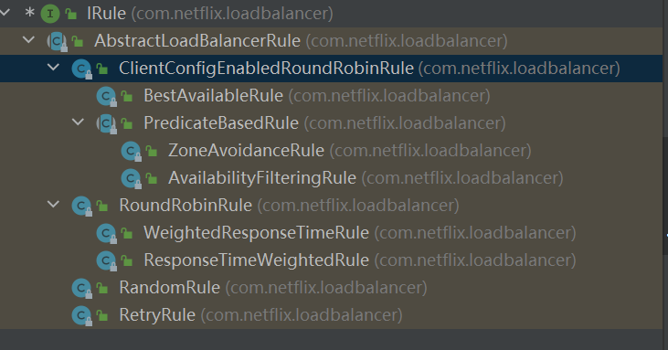

# 微服务远程调用  
类似于浏览器的Ajax方法，通过构造请求指令来从服务器获取数据。微服务的远程调用也还会通过发送请求的方式从另一个服务器获取数据。  
利用 RestTemplate 可以实现这个功能  

角色：  
提供者与消费者，这两者是一个相对的概念。一个服务既可以是提供者也可以消费者，这取决于具体的业务。

# Eureka注册中心  

服务调用出现的问题：  
服务消费者如何获取服务提供者的地址信息？  
服务者启动时向eureka注册自己的信息  
eureka保存这些信息  
消费者根据服务名称向eureka拉取提供者信息  

如果有多个服务提供者，消费者该如何选择？  
利用负载均衡算法，从服务列表中挑选一个  

消费者如何得知服务提供者的健康状态？  
服务者每30秒会向EurekaServer发送心跳请求，报告健康状态  
eureka会更新服务列表信息，心跳不正常会被剔除  
消费者可以拉取到最新信息。  

## Eureka的作用  

EurekaServer：注册中心  
       记录服务信息  
       心跳监控  

EurekaClient  
       Provider：服务提供者  
           注册自己的信息到EurekaSerer  
           每30秒向EurekaServer发送心跳  
       Consumer：服务消费者  
           根据服务名称从EurekaServer 拉去服务列表  
           基于服务列表做负载均衡算法，选取一个微服务后做远程调用。  

  

服务调用关系：  
       服务提供者：暴露接口给其它微服务调用  
       服务消费者：调用其它微服务提供的接口  
       服务者与提供者的角色是相对的  

## Eureka服务搭建  

首先，需要学会搭建一个 SpringBoot环境 的环境，继续搭建一个 SpringCloud 环境  

直接导入用 idea 打开   
file->project structure..->Modules  
  
将服务导入即可  

注意：  
maven在完成阿里云配置后需要在idea里生效，不然还是龟速  
  

安装Lombok  
菜单栏File -> Settings -> Plugins，在中间Marketplace下面输入Lombok搜索后进行安装，安装后会提示重启IDEA。  

搭建Eureka  

1、 新建Moudle  
  
  
  

2、引入依赖  
```xml  
<dependency>  
    <groupId>org.springframework.cloud</groupId>  
    <artifactId>spring-cloud-starter-netflix-eureka-server</artifactId>  
</dependency>  
```
3、编写启动类
给eureka-server服务编写一个启动类，一定要添加一个@EnableEurekaServer注解，开启eureka的注册中心功能：
```
package cn.itcast.eureka;

import org.springframework.boot.SpringApplication;
import org.springframework.boot.autoconfigure.SpringBootApplication;
import org.springframework.cloud.netflix.eureka.server.EnableEurekaServer;

@SpringBootApplication
@EnableEurekaServer
public class EurekaApplication {
    public static void main(String[] args) {
        SpringApplication.run(EurekaApplication.class, args);
    }
}
```
4、编写application.yml配置文件
```
server:
  port: 10086
spring:
  application:
    name: eureka-server
eureka:
  client:
    service-url: 
      defaultZone: http://127.0.0.1:10086/eureka
```
5、启动服务
进入启动类，启动main()
6、访问


## 服务注册
6、将服务类注册到eureka  
（1）引入依赖  
```
        <dependency>
            <groupId>org.springframework.cloud</groupId>
            <artifactId>spring-cloud-starter-netflix-eureka-client</artifactId>
        </dependency>
```
（2）编写配置文件  

7、多个用户数实现场景


8、实现结果


## 远程调用
调用订单服务

user 为 null，而我们需要通过用户服务调用查询用户。
修改order-service中的根据id查询订单业务，要求在查询订单的同时，根据订单中包含的userId查询出用户信息，一起返回。
因此，我们需要在order-service中 向user-service发起一个http的请求，调用http://localhost:8081/user/{userId}这个接口。
大概的步骤是这样的：
注册一个RestTemplate的实例到Spring容器

```
package cn.itcast.order;

import org.mybatis.spring.annotation.MapperScan;
import org.springframework.boot.SpringApplication;
import org.springframework.boot.autoconfigure.SpringBootApplication;
import org.springframework.context.annotation.Bean;
import org.springframework.web.client.RestTemplate;

@MapperScan("cn.itcast.order.mapper")
@SpringBootApplication
public class OrderApplication {

    public static void main(String[] args) {
        SpringApplication.run(OrderApplication.class, args);
    }
    @Bean
    public RestTemplate restTemplate() {
        return new RestTemplate();
    }

}
```
修改order-service服务中的OrderService类中的queryOrderById方法，根据Order对象中的userId查询User
将查询的User填充到Order对象，一起返回
```
package cn.itcast.order.service;

import cn.itcast.order.mapper.OrderMapper;
import cn.itcast.order.pojo.Order;
import cn.itcast.order.pojo.User;
import org.springframework.beans.factory.annotation.Autowired;
import org.springframework.stereotype.Service;
import org.springframework.web.client.RestTemplate;

@Service
public class OrderService {

    @Autowired
    private OrderMapper orderMapper;

    @Autowired
    private RestTemplate restTemplate;
    public Order queryOrderById(Long orderId) {
        // 1.查询订单
        Order order = orderMapper.findById(orderId);
        // 2.远程查询user
        // 2.1 设置查询url
        String url = "http://localhost:8081/user/"+order.getUserId();
        // 2.2 获取User
        User user = restTemplate.getForObject(url, User.class);
        // 3 封装user到order
        order.setUser(user);
        // 4.返回
        return order;
    }
}

```
结果：
<p>服务发现</p>
<p>我们将order-service的逻辑修改：向eureka-server拉取user-service的信息，实现服务发现。</p>
<p>在完成上述操作的基础上进一步进一步修改两个位置，配置加上 @LoadBalanced 注解，意味着负载均衡</p>


<p>在服务中直接利用 userservice 代替 localhost:8081 或者 local host:8082</p>


## 负载均衡
### 负载均衡原理
SpringCloud底层其实是利用了一个名为Ribbon的组件，来实现负载均衡功能的。  

1、发起请求，  

在这格代码中 @LoadBalanced 是一个负载均衡的标记，意味着经过 RestTemplated 的请求要被  拦截和处理   

2、通过`ClientHttpResponse)this.loadBalancer.execute(serviceName, this.requestFactory.createRequest(request, body, execution))`根据负载均衡规则与 serviceName 获取具体的服务信息。  


### 负载均衡策略


#### RoundRobinRule	  
简单轮询服务列表来选择服务器。它是Ribbon默认的负载均衡规则。  
#### AvailabilityFilteringRule	  
对以下两种服务器进行忽略： （1）在默认情况下，这台服务器如果3次连接失败，这台服务器就会被设置为“短路”状态。短路状态将持续30秒，如果再次连接失败，短路的持续时间就会几何级地增加。 （2）并发数过高的服务器。如果一个服务器的并发连接数过高，配置了AvailabilityFilteringRule规则的客户端也会将其忽略。并发连接数的上限，可以由客户端的..ActiveConnectionsLimit属性进行配置。  
#### WeightedResponseTimeRule	  
为每一个服务器赋予一个权重值。服务器响应时间越长，这个服务器的权重就越小。这个规则会随机选择服务器，这个权重值会影响服务器的选择。  
#### ZoneAvoidanceRule	  
以区域可用的服务器为基础进行服务器的选择。使用Zone对服务器进行分类，这个Zone可以理解为一个机房、一个机架等。而后再对Zone内的多个服务做轮询。  
#### BestAvailableRule	
忽略那些短路的服务器，并选择并发数较低的服务器。 
#### RandomRule	
随机选择一个可用的服务器。  
#### RetryRule	
重试机制的选择逻辑  
### 自定义负载均衡策略  
通过定义IRule实现可以修改负载均衡规则，有两种方式：  
1、代码方式（全局配置）：在order-service中的OrderApplication类中，定义一个新的IRule：  
```
@Bean
public IRule randomRule(){ 
    return new RandomRule();
}
```
2、配置文件方式（服务配置）：在order-service的application.yml文件中，添加新的配置也可以修改规则：  
```
userservice: # 给某个微服务配置负载均衡规则，这里是userservice服务  
  ribbon:
    NFLoadBalancerRuleClassName: com.netflix.loadbalancer.RandomRule # 负载均衡规则   
```
注意，一般用默认的负载均衡规则，不做修改。
## nacos注册中心
### 安装
Nacos文档:https://nacos.io/zh-cn/docs/deployment.html  
Nacos1.4.0下载地址:https://github.com/alibaba/nacos/releases/tag/1.4.0  
1.首先通过cmd进入到nacos文件夹里面bin目录  
2.然后输入命令startup.cmd -m standalone 这里是将nacos以单机模式运行  
启动成功  

访问：
http://192.168.0.109:8848/nacos/index.html  
账户密码都是nacos

### 加入依赖
父工程的pom文件中的<dependencyManagement>中引入SpringCloudAlibaba的依赖：  
```
<dependency>
    <groupId>com.alibaba.cloud</groupId>
    <artifactId>spring-cloud-alibaba-dependencies</artifactId>
    <version>2.2.6.RELEASE</version>
    <type>pom</type>
    <scope>import</scope>
</dependency>
```
在user-service和order-service中的pom文件中引入nacos-discovery依赖（不能与eureka共存）  
```
<dependency>
    <groupId>com.alibaba.cloud</groupId>
    <artifactId>spring-cloud-starter-alibaba-nacos-discovery</artifactId>
</dependency>
```
启动项目后


### 服务分级存储模型
一级为服务，如 user-service
二级为集群，如 HZ
三级为服务，如 UserApplication
Nacos就将同一机房内的实例 划分为一个集群。  
也就是说，user-service是服务，一个服务可以包含多个集群，如杭州、上海，每个集群下可以有多个实例，形成分级模型，如图：


微服务互相访问时，应该尽可能访问同集群实例，因为本地访问速度更快。当本集群内不可用时，才访问其它集群  
集群配置  
```
spring:
  cloud:
    nacos:
      server-addr: localhost:8848
      discovery:
        cluster-name: HZ # 集群名称
```
会失败：  
原因: 修改全局的编码方式为utf-8  
创建集群图示  


### 设置同位置集群访问规则  
1）给order-service配置集群信息  
修改order-service的application.yml文件，添加集群配置：  
```
spring:
  cloud:
    nacos:
      server-addr: localhost:8848
      discovery:
        cluster-name: HZ # 集群名称
```
2)规则设置  
修改order-service的application.yml文件，修改负载均衡规则：  
```
userservice:
  ribbon:
    NFLoadBalancerRuleClassName: com.alibaba.cloud.nacos.ribbon.NacosRule # 负载均衡规则   
```
有限访问同集群位置的服务，如果没有则会访问不同集群位置的服务  

### 服务的权重配置  
实际部署中会出现这样的场景：  
服务器设备性能有差异，部分实例所在机器性能较好，另一些较差，我们希望性能好的机器承担更多的用户请求。  
但默认情况下NacosRule是同集群内随机挑选，不会考虑机器的性能问题。  
因此，Nacos提供了权重配置来控制访问频率，权重越大则访问频率越高。  
在nacos控制台，找到user-service的实例列表，点击编辑，即可修改权重  
权重值为0-1之间的  


### 环境隔离
nacos中可以有多个namespace  
namespace下可以有group、service等  
不同namespace之间相互隔离，例如不同namespace的服务互相不可见  
新建一个命名空间为 dev


复制 id

给服务配置命名空间
```
spring：
  cloud:
    nacos:
      discovery:
        namespace: a07e015e-aff7-4618-8089-3c4767816284
```
结果


此时访问 order 不会成功，因为服务已经隔离了


