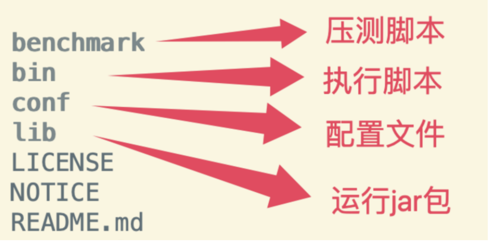

## RocketMQ快速实战

### 1、快速搭建RocketMQ服务

RocketMQ的官⽹地址： http://rocketmq.apache.org 。在下载⻚⾯可以获取RocketMQ的源码包以及运⾏

包。下载⻚⾯地址：https://rocketmq.apache.org/download。关于RocketMQ的版本： 我们这⾥采⽤最新的5.3.0版本。

解压后⼏个重要的⽬录如下:



默认情况下，RocketMQ建议的运⾏环境需要⾄少12G的内存，这是⽣产环境⽐较理想的资源配置。但是，学

习阶段，如果你的服务器没有这么⼤的内存空间，那么就需要做⼀下调整。进⼊bin⽬录，对其中的

runserver.sh和runbroker.sh两个脚本进⾏⼀下修改。

使⽤vi runserver.sh指令，编辑这个脚本，找到下⾯的⼀⾏配置，调整Java进程的内存⼤⼩。

```
JAVA_OPT="${JAVA_OPT} -server -Xms1g -Xmx1g -Xmn512m -XX:MetaspaceSize=128m -

XX:MaxMetaspaceSize=320m"
```

接下来，同样调整runbroker.sh中的内存⼤⼩。

```
JAVA_OPT="${JAVA_OPT} -server -Xms8g -Xmx8g"
```

修改为：

```
JAVA_OPT="${JAVA_OPT} -server -Xms2g -Xmx2g"
```

修改配置时，注意要根据你的JDK版本调整对应的配置⾏。RocketMQ是⼀个典型的Java应⽤，所以需要

提前安装JDK。我们这⾥采⽤的是1.8版本。JDK的安装过程略。

⽣产环境不建议调整。这⼀系列参数实际上就是RocketMQ的JVM调优结果。

RocketMQ的后端服务分为nameserver和broker两个服务，关于他们的作⽤，后⾯会给你分享。接下来我们

先将这两个服务启动起来。

#### 第⼀步：启动nameserver服务。

```
cd /app/rocketmq/rocketmq-all-5.3.0-bin-release
nohup bin/mqnamesrv &
```

指令执⾏后，会⽣成⼀个nohup.out的⽇志⽂件。在这个⽇志⽂件⾥如果看到下⾯这⼀条关键⽇志，就表示

nameserver服务启动成功了。

```
Java HotSpot(TM) 64-Bit Server VM warning: Using the DefNew young collector with the CMS
collector is deprecated and will likely be removed in a future release
Java HotSpot(TM) 64-Bit Server VM warning: UseCMSCompactAtFullCollection is deprecated and
will likely be removed in a future release.
The Name Server boot success. serializeType=JSON, address 0.0.0.0:9876
```

接下来，可以通过jsp指令进⾏验证。使⽤jps指令后，可以看到有⼀个NamesrvStartup的进程运⾏，也表示

nameserver服务启动完成。

#### 第⼆步：启动broker服务

broker也是⼀个Java服务，只需要调整conf⽬录下的broker.conf⽂件，进⾏⼀些定制。然后就可以启动了。

具体配置项参⻅官⽅⽂档，这⾥尽量⾛默认配置。

如果你的服务器配置了多张⽹卡，建议配置brokerIP1属性。⽐如阿⾥云，腾讯云这样的云服务器，他们

通常有内⽹⽹卡和外⽹⽹卡两张⽹卡，那么需要增加配置brokerIP1属性，指向服务器的外⽹IP 地址，这

样才能确保从其他服务器上访问到RocketMQ 服务。

在启动broker服务前，需要先指定NameServer的服务地址。RocketMQ可以使⽤⼀个NAMESRV_ADDR的环

境变量指定NameServer服务地址。通过vi ~/.bash_profile添加以下配置。然后使⽤source ~/.bash_profile让配置⽣效。

```
export NAMESRV_ADDR='localhost:9876'
```

9876是nameserver的默认服务端⼝。

然后也可以⽤之前的⽅式启动broker服务。启动broker服务的指令是mqbroker。

```
cd /app/rocketmq/rocketmq-all-5.3.0-bin-release
nohup bin/mqbroker &
```

启动完成后，同样检查nohup.out⽇志⽂件，有如下⼀条关键⽇志，就表示broker服务启动正常了。

```
The broker[xxxxx] boot success. serializeType=JSON and name server is localhost:9876
```

注：1、在实际服务部署时，通常会将RocketMQ的部署地址添加到环境变量当中。例如使⽤vi

~/.bash_profile指令，添加以下内容。

```
export ROCKETMQ_HOME=/app/rocketmq/rocketmq-all-5.3.0-bin-release
PATH=$ROCKETMQ_HOME/bin:$PATH
export PATH
```

这样就不必每次进⼊RocketMQ的安装⽬录了。直接可以使⽤mqnamesrv 和mqbroker指令。

2、停⽌RocketMQ服务可以通过mqshutdown指令进⾏

```
mqshutdown namesrv # 关闭nameserver服务
mqshutdown broker # 关闭broker服务
```

同样使⽤jps指令可以检查服务的启动状态。使⽤jps指令后，可以看到⼀个名为BrokerStartup的进程，则表示

broker服务启动完成。

### 2、快速实现消息收发

RocketMQ后端服务启动完成后，就可以启动客户端的消息⽣产者和消息消费者进⾏消息转发了。接下来，我

们会先通过RocketMQ提供的命令⾏⼯具快速体验⼀下RocketMQ消息收发的功能。然后，再动⼿搭建⼀个

Maven项⽬，在项⽬中使⽤RocketMQ进⾏消息收发。

1、命令⾏快速实现消息收发

1：通过指令启动RocketMQ的消息⽣产者发送消息。

```
cd /app/rocketmq/rocketmq-all-5.3.0-bin-release
bin/tools.sh org.apache.rocketmq.example.quickstart.Producer
```

这个指令会默认往RocketMQ中发送1000条消息。在命令⾏窗⼝可以看到发送消息的⽇志：

```
SendResult [sendStatus=SEND_OK, msgId=C0A841708122246B179D98C9E31103E6,
offsetMsgId=C0A8417000002A9F000000000003AEFE, messageQueue=MessageQueue [topic=TopicTest,
brokerName=192-168-65-112, queueId=1], queueOffset=249]
SendResult [sendStatus=SEND_OK, msgId=C0A841708122246B179D98C9E31203E7,
offsetMsgId=C0A8417000002A9F000000000003AFF0, messageQueue=MessageQueue [topic=TopicTest,
brokerName=192-168-65-112, queueId=2], queueOffset=249]
```

这部分⽇志中，并没有打印出发送了什么消息。上⾯SendResult开头部分是消息发送到Broker后的结果。最

后两⾏⽇志表示消息⽣产者发完消息后，服务正常关闭了。

2：可以启动消息消费者接收之前发送的消息

```
bin/tools.sh org.apache.rocketmq.example.quickstart.Consumer
```

消费者启动完成后，可以看到消费到的消息

```
ConsumeMessageThread_please_rename_unique_group_name_4_18 Receive New Messages:
[MessageExt [brokerName=192-168-65-112, queueId=1, storeSize=242, queueOffset=211,
sysFlag=0, bornTimestamp=1725004967502, bornHost=/192.168.65.112:52748,
storeTimestamp=1725004967502, storeHost=/192.168.65.112:10911,
msgId=C0A8417000002A9F0000000000031F4E, commitLogOffset=204622, bodyCRC=47888112,
reconsumeTimes=0, preparedTransactionOffset=0, toString()=Message{topic='TopicTest',
flag=0, properties={CONSUME_START_TIME=1725005058184, MSG_REGION=DefaultRegion,
UNIQ_KEY=C0A841708122246B179D98C9E24E034E, CLUSTER=DefaultCluster, MIN_OFFSET=0,
TAGS=TagA, WAIT=true, TRACE_ON=true, MAX_OFFSET=250}, body=[72, 101, 108, 108, 111, 32,
82, 111, 99, 107, 101, 116, 77, 81, 32, 56, 52, 54], transactionId='null'}]]
```

每⼀条这样的⽇志信息就表示消费者接收到了⼀条消息。

这个Consumer消费者的指令并不会主动结束，他会继续挂起，等待消费新的消息。我们可以使⽤CTRL+C停

⽌该进程。

注：在RocketMQ提供的这个简单示例中并没有打印出传递的消息内容，⽽是打印出了消息相关的很多重

要的属性。

其中有⼏个⽐较重要的属性： brokerId,brokerName,queueId,msgId,topic,cluster。这些属性的作⽤会在

后续⼀起分享，这⾥你不妨先找⼀下这些属性是什么，消费者与⽣产者之间有什么样的对应关系。

