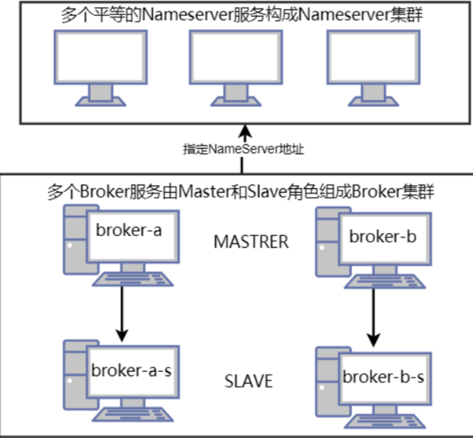

## 分布式集群

### 架构

单机环境的nameserver服务或者broker服务出现了问题，整个RocketMQ就⽆法正常⼯作。

⽽且更严重的是，如果服务器出现了问题，⽐如磁盘坏了，那么存储在磁盘上的数据就会丢失。这时

RocketMQ暂存到磁盘上的消息也会跟着丢失，这个问题就⾮常严重了。因此，我们需要搭建⼀个分布式的

RocketMQ服务集群，来防⽌单点故障问题。

RocketMQ的分布式集群基于主从架构搭建。在多个服务器组成的集群中，指定⼀部分节点作为Master节点，

负责响应客户端的请求。指令另⼀部分节点作为Slave节点，负责备份Master节点上的数据，这样，当Master

节点出现故障时，在Slave节点上可以保留有数据备份，⾄少保证数据不会丢失。

整个集群⽅案如下图所示：



接下来我们准备三台相同的Linux服务器，搭建⼀下RocketMQ的分布式集群。为了更清晰的描述这三台服务

器上的操作，我们给每个服务器指定⼀个机器名。

cat /etc/hosts

192.168.65.112 worker1

192.168.65.170 worker2

192.168.65.193 worker3

为了便于观察，我们这次搭建⼀个2主2从的RocketMQ集群，并将主节点和节点都分别部署在不同的服务器

上。预备的集群规划情况如下：

```
机器名   nameServer服务部署  broker服务部署
worker1 nameServer
worker2 nameServer        broker-a,broker-b-s
worker3 nameServer        broker-a-s,broker-b
```

### 第⼀步：部署nameServer服务。

nameServer服务不需要做特别的配置，按照之前的步骤，在三台服务器上都分别部署nameServer服务即可。

### 第⼆步：对Broker服务进⾏集群配置。

这⾥需要修改RocketMQ的配置⽂件，对broker服务做⼀些集群相关的参数部署。这些配置⽂件并不需要我们

⼿动进⾏创建，在RocketMQ运⾏包的conf⽬录下，提供了多种集群的部署配置⽂件模板。

2m-noslave: 2主⽆从的集群参考配置。这种集群存在单点故障。

2m-2s-async和2m-2s-sync: 2主2从的集群参考配置。其中async和sync表示主节点与从节点之间是同步

同步还是异步同步。关于这两个概念，会在后续章节详细介绍

dledger: 具备主从切换功能的⾼可⽤集群。集群中的节点会基于Raft协议随机选举出⼀个Leader，其作⽤

类似于Master节点。其他的节点都是follower，其作⽤类似于Slave节点。

#### 1> 配置第⼀组broker-a服务

在worker2机器上配置broker-a的MASTER服务，需要修改conf/2m-2s-async/broker-a.properties。示例配

置如下：

```
#所属集群名字，名字⼀样的节点就在同⼀个集群内
brokerClusterName=rocketmq-cluster
#broker名字，名字⼀样的节点就是⼀组主从节点。
brokerName=broker-a
#brokerid,0就表示是Master，>0的都是表示 Slave
brokerId=0
#nameServer地址，分号分割
namesrvAddr=worker1:9876;worker2:9876;worker3:9876
deleteWhen=04
fileReservedTime=120
#存储路径
storePathRootDir=/app/rocketmq/store
storePathCommitLog=/app/rocketmq/store/commitlog
storePathConsumeQueue=/app/rocketmq/store/consumequeue
storePathIndex=/app/rocketmq/store/index
storeCheckpoint=/app/rocketmq/store/checkpoint
abortFile=/app/rocketmq/store/abort
#Broker 的⻆⾊
brokerRole=ASYNC_MASTER
flushDiskType=ASYNC_FLUSH
#Broker 对外服务的监听端⼝
listenPort=10911
```

这⾥对⼏个需要重点关注的属性，做下简单介绍：

- brokerClusterName: 集群名。RocketMQ会将同⼀个局域⽹下所有brokerClusterName相同的服务⾃动组

成⼀个集群，这个集群可以作为⼀个整体对外提供服务

- brokerName: Broker服务名。同⼀个RocketMQ集群当中，brokerName相同的多个服务会有⼀套相同的

数据副本。同⼀个RocketMQ集群中，是可以将消息分散存储到多个不同的brokerName服务上的。

- brokerId: RocketMQ中对每个服务的唯⼀标识。RocketMQ对brokerId定义了⼀套简单的规则，master节

点需要固定配置为0，负责响应客户端的请求。slave节点配置成其他任意数字，负责备份master上的消

息。

- brokerRole: 服务的⻆⾊。这个属性有三个可选项：ASYNC_MASTER，SYNC_MASTER和SLAVE。其

中，ASYNC_MASTER和SYNC_MASTER表示当前节点是master节点，⽬前暂时不⽤关⼼他们的区别。

SLAVE则表示从节点。

- namesrvAddr: nameserver服务的地址。nameserver服务默认占⽤9876端⼝。多个nameserver地址⽤；

隔开。

接下来在worekr3上配置broker-a的SLAVE服务。需要修改conf/2m-2s-async/broker-a-s.properties。示例

配置如下：

```
#所属集群名字，名字⼀样的节点就在同⼀个集群内
brokerClusterName=rocketmq-cluster
#broker名字，名字⼀样的节点就是⼀组主从节点。
brokerName=broker-a
#brokerid,0就表示是Master，>0的都是表示 Slave
brokerId=1
#nameServer地址，分号分割
namesrvAddr=worker1:9876;worker2:9876;worker3:9876
deleteWhen=04
fileReservedTime=120
#存储路径
storePathRootDir=/app/rocketmq/storeSlave
storePathCommitLog=/app/rocketmq/storeSlave/commitlog
storePathConsumeQueue=/app/rocketmq/storeSlave/consumequeue
storePathIndex=/app/rocketmq/storeSlave/index
storeCheckpoint=/app/rocketmq/storeSlave/checkpoint
abortFile=/app/rocketmq/storeSlave/abort
#Broker 的⻆⾊
brokerRole=SLAVE
flushDiskType=ASYNC_FLUSH
#Broker 对外服务的监听端⼝
listenPort=11011
```

其中关键是brokerClusterName和brokerName两个参数需要与worker2上对应的broker-a.properties配置匹

配。brokerId配置0以为的数字。然后brokerRole配置为SLAVE。

这样，第⼀组broker服务就配置好了。

#### 2> 配置第⼆组borker-b服务

与第⼀组broker-a服务的配置⽅式类似，在worker3上配置broker-b的MASTER服务。需要修改conf/2m-2s

async/broker-b.properties⽂件，配置示例如下：

```
#所属集群名字，名字⼀样的节点就在同⼀个集群内
brokerClusterName=rocketmq-cluster
#broker名字，名字⼀样的节点就是⼀组主从节点。
brokerName=broker-b
#brokerid,0就表示是Master，>0的都是表示 Slave
brokerId=0
#nameServer地址，分号分割
namesrvAddr=worker1:9876;worker2:9876;worker3:9876
deleteWhen=04
fileReservedTime=120
#存储路径
storePathRootDir=/app/rocketmq/store
storePathCommitLog=/app/rocketmq/store/commitlog
storePathConsumeQueue=/app/rocketmq/store/consumequeue
storePathIndex=/app/rocketmq/store/index
storeCheckpoint=/app/rocketmq/store/checkpoint
abortFile=/app/rocketmq/store/abort
#Broker 的⻆⾊
brokerRole=ASYNC_MASTER
flushDiskType=ASYNC_FLUSH
#Broker 对外服务的监听端⼝
listenPort=10911
```

在worker2上配置broker-b的SLAVE服务。需要修改conf/2m-2s-async/broker-b-s.properties⽂件，配置示

例如下：

```
#所属集群名字，名字⼀样的节点就在同⼀个集群内
brokerClusterName=rocketmq-cluster
#broker名字，名字⼀样的节点就是⼀组主从节点。
brokerName=broker-b
#brokerid,0就表示是Master，>0的都是表示 Slave
brokerId=1
#nameServer地址，分号分割
namesrvAddr=worker1:9876;worker2:9876;worker3:9876
deleteWhen=04
fileReservedTime=120
#存储路径
storePathRootDir=/app/rocketmq/storeSlave
storePathCommitLog=/app/rocketmq/storeSlave/commitlog
storePathConsumeQueue=/app/rocketmq/storeSlave/consumequeue
storePathIndex=/app/rocketmq/storeSlave/index
storeCheckpoint=/app/rocketmq/storeSlave/checkpoint
abortFile=/app/rocketmq/storeSlave/abort
#Broker 的⻆⾊
brokerRole=SLAVE
flushDiskType=ASYNC_FLUSH
#Broker 对外服务的监听端⼝
listenPort=11011
```

这样就完成了2主2从集群的配置。配置过程汇总有⼏个需要注意的配置项：

- store开头的⼀系列配置：表示RocketMQ的存盘⽂件地址。在同⼀个机器上需要部署多个Broker服务时，

不同服务的存储⽬录不能相同。

- listenPort：表示Broker对外提供服务的端⼝。这个端⼝默认是10911。在同⼀个机器上部署多个Broker服

务时，不同服务占⽤的端⼝也不能相同。

如果你使⽤的是多⽹卡的服务器，⽐如阿⾥云上的云服务器，那么就需要在配置⽂件中增加配置⼀个

- brokerIP1属性，指向所在机器的外⽹⽹卡地址。

### 第三步：启动Broker服务

集群配置完成后，需要启动Broker服务。与之前启动broker服务稍有不同，启动时需要增加-c参数，指向我们

修改的配置⽂件。

在worker2上启动broker-a的master服务和broker-b的slave服务

```
cd /app/rocketmq/rocketmq-all-5.3.0-bin-release
nohup bin/mqbroker -c ./conf/2m-2s-async/broker-a.properties &
nohup bin/mqbroker -c ./conf/2m-2s-async/broker-b-s.properties &
```

在worker3上启动broker-b的master服务和broker-a的slave服务：

```
cd /app/rocketmq/rocketmq-all-5.3.0-bin-release
nohup bin/mqbroker -c ./conf/2m-2s-async/broker-b.properties &
nohup bin/mqbroker -c ./conf/2m-2s-async/broker-a-s.properties &
```

### 第四步：检查集群服务状态

对于服务的启动状态，我们依然可以⽤之前介绍的jps指令以及nohup.out⽇志⽂件进⾏跟踪。不过，在

RocketMQ的bin⽬录下，也提供了mqadmin指令，可以通过命令⾏的⽅式管理RocketMQ集群。

例如下⾯的指令可以查看集群broker集群状态。通过这个指令可以及时了解集群的运⾏状态。

```
[root@192-168-65-112 app]# cd rocketmq/rocketmq-all-5.3.0-bin-release/
[root@192-168-65-112 rocketmq-all-5.3.0-bin-release]# bin/mqadmin clusterList
#Cluster Name #Broker Name #BID #Addr #Version
#InTPS(LOAD) #OutTPS(LOAD) #Timer(Progress) #PCWait(ms) #Hour #SPACE
#ACTIVATED
rocketmq-cluster broker-a 0 192.168.65.170:10911 V5_3_0
0.00(0,0ms) 0.00(0,0ms) 0-0(0.0w, 0.0, 0.0) 0 479168.95 0.1100
true
rocketmq-cluster broker-a 1 192.168.65.193:11011 V5_3_0
0.00(0,0ms) 0.00(0,0ms) 3-0(0.0w, 0.0, 0.0) 0 479168.95 0.1100
false
rocketmq-cluster broker-b 0 192.168.65.193:10911 V5_3_0
0.00(0,0ms) 0.00(0,0ms) 0-0(0.0w, 0.0, 0.0) 0 479168.95 0.1100
true
rocketmq-cluster broker-b 1 192.168.65.170:11011 V5_3_0
0.00(0,0ms) 0.00(0,0ms) 2-0(0.0w, 0.0, 0.0) 0 479168.95 0.1100
false
```

mqadmin指令还提供了⾮常丰富的管理功能。你可以尝试直接使⽤mqadmin指令，就会列出mqadmin⽀持的

所有管理指令。如果对某⼀个指令不会使⽤，还可以使⽤mqadmin help 指令查看帮助。

另外，之前搭建的dashboard也是集群服务状态的很好的⼯具。只需要在之前搭建Dashboard时创建的配置⽂

件中增加指定nameserver地址即可。

```
rocketmq:
config:
namesrvAddrs:
- worker1:9876
- worker2:9876
- worker3:9876
```

启动完成后，在集群菜单⻚就可以看到集群的运⾏情况

## 升级Dledger⾼可⽤集群

### 解决的问题

主从架构的RocketMQ集群，由于给每个broker服务配置了⼀个或多个slave备份服务，可以保证当broker服务

出现问题时，broker上的消息不会丢失。但是，这种主从架构的集群却也有⼀个不⾜的地⽅，那就是不具备服

务⾼可⽤。

这⾥所说的服务⾼可⽤，并不是并不是指整个RocketMQ集群就不能对外提供服务了，⽽是指集群中的消息就

不完整了。实际上，当RocketMQ集群中的broker宕机后，整个集群会⾃动进⾏broker状态感知。后续客户端

的各种请求，依然可以转发到其他正常的broker上。只不过，原本保存在当前broker上的消息，就⽆法正常读

取了，需要等到当前broker服务重启后，才能重新被消息消费者读取。

当⼀个broker上的服务宕机后，我们可以从对应的slave服务上找到broker上所有的消息。但是很可惜，主从

架构中各个服务的⻆⾊都是固定了的，slave服务虽然拥有全部的数据，但是它没办法升级成为master服务去

响应客户端的请求，依然只是傻傻等待master服务重启后，继续做它的数据备份⼯作。

这时，我们⾃然就希望这个slave服务可以升级成为master服务，继续响应客户端的各种请求，这样整个集群

的消息服务就不会有任何中断。⽽RocketMQ提供的Dledger集群，就是具备⻆⾊⾃动转换功能的⾼可⽤集

群。

### 架构

整个集群结构如下图所示：


在Dledger集群中，就不再单独指定各个broker的服务，⽽是由这些broker服务⾃⾏进⾏选举，产⽣⼀个

Leader⻆⾊的服务，响应客户端的各种请求。⽽其他的broker服务，就作为Follower⻆⾊，负责对Leader上的

数据进⾏备份。当然，Follower所要负责的事情，⽐主从架构中的SLAVE⻆⾊会要复杂⼀点，因为这种节点选

举是在后端不断进⾏的，他们需要随时做好升级成Leader的准备。

Dledger集群的选举是通过Raft协议进⾏的，Raft协议是⼀种多数同意机制。也就是每次选举需要有集群中超

过半数的节点确认，才能形成整个集群的共同决定。同时，这也意味着在Dledger集群中，只要有超过半数的

节点能够正常⼯作，那么整个集群就能正常⼯作。因此，在部署Dledger集群时，通常都是部署奇数台服务，

这样可以让集群的容错性达到最⼤。

接下来，我们就⽤之前准备的3台服务器，搭建⼀个3个节点的Dledger集群。在这个集群中，只需要有2台

Broker服务正常运⾏，这个集群就能正常⼯作。

### 第⼀步：部署nameserver

这⼀步和之前部署主从集群没有区别，不需要做过多的配置，直接在三台服务器上启动nameserver服务即

可。

实际上，如果你是从上⼀个主从架构开始搭建起来的话，那么nameserver集群都不需要重新启动，

nameserver会⾃动感知到broker的变化。

### 第⼆步：对Broker服务进⾏集群配置。

对于Dledger集群的配置，RocketMQ依然贴⼼的给出了完整的示例，不需要强⾏记忆。

在conf/dledger⽬录下，RocketMQ默认给出了三个配置⽂件，这三个配置⽂件可以在单机情况下直接部署成

⼀个具有三个broker服务的Dledger集群，我们只需要按照这个配置进⾏修改即可。

```
注：在RocketMQ运⾏包的bin/dledger⽬录下，RocketMQ还提供了⼀个fast-try.sh脚本。这个脚本会指
定conf/deldger⽬录下的配置⽂件，直接启动有三个broker服务的Dledger集群。每个集群指定的内存⼤
⼩占⽤1G。
```

接下来我们可以在三台机器的conf/dledger⽬录下，都创建⼀个broker.conf⽂件，对每个broker服务进⾏配

置。

worker1的broker.conf配置示例

```
brokerClusterName = RaftCluster
brokerName=RaftNode00
listenPort=30911
namesrvAddr=worker1:9876;worker2:9876;worker3:9876
storePathRootDir=/app/rocketmq/storeDledger/
storePathCommitLog=/app/rocketmq/storeDledger/commitlog
storePathConsumeQueue=/app/rocketmq/storeDledger/consumequeue
storePathIndex=/app/rocketmq/storeDledger/index
storeCheckpoint=/app/rocketmq/storeDledger/checkpoint
abortFile=/app/rocketmq/storeDledger/abort
enableDLegerCommitLog=true
dLegerGroup=RaftNode00
dLegerPeers=n0-worker1:40911;n1-worker2:40911;n2-worker3:40911
## must be unique
dLegerSelfId=n0
sendMessageThreadPoolNums=16
```

worker2的broker.conf配置示例：

```
brokerClusterName = RaftCluster
brokerName=RaftNode00
listenPort=30911
namesrvAddr=worker1:9876;worker2:9876;worker3:9876
storePathRootDir=/app/rocketmq/storeDledger/
storePathCommitLog=/app/rocketmq/storeDledger/commitlog
storePathConsumeQueue=/app/rocketmq/storeDledger/consumequeue
storePathIndex=/app/rocketmq/storeDledger/index
storeCheckpoint=/app/rocketmq/storeDledger/checkpoint
abortFile=/app/rocketmq/storeDledger/abort
enableDLegerCommitLog=true
dLegerGroup=RaftNode00
dLegerPeers=n0-worker1:40911;n1-worker2:40911;n2-worker3:40911
## must be unique
dLegerSelfId=n1
sendMessageThreadPoolNums=16
```

worker3的broker.conf配置示例：

```
brokerClusterName = RaftCluster
brokerName=RaftNode00
listenPort=30911
namesrvAddr=worker1:9876;worker2:9876;worker3:9876
storePathRootDir=/app/rocketmq/storeDledger/
storePathCommitLog=/app/rocketmq/storeDledger/commitlog
storePathConsumeQueue=/app/rocketmq/storeDledger/consumequeue
storePathIndex=/app/rocketmq/storeDledger/index
storeCheckpoint=/app/rocketmq/storeDledger/checkpoint
abortFile=/app/rocketmq/storeDledger/abort
enableDLegerCommitLog=true
dLegerGroup=RaftNode00
dLegerPeers=n0-worker1:40911;n1-worker2:40911;n2-worker3:40911
## must be unique
dLegerSelfId=n2
sendMessageThreadPoolNums=16
```

这⾥对⼏个需要重点关注的配置项，做下介绍：

- enableDLegerCommitLog: 是否启动Dledger。true表示启动

- namesrvAddr: 指定nameserver地址

- dLedgerGroup: Dledger Raft Group的名字，建议跟brokerName保持⼀致。

- dLedgerPeers: Dledger Group内各个服务节点的地址及端⼝信息。同⼀个Group内的各个节点配置必须

要保持⼀致。

- dLedgerSelfId: Dledger节点ID，必须属于dLedgerPeers中的⼀个。同⼀个Group内的各个节点必须不能

重复。

- sendMessageThreadPoolNums：dLedger内部发送消息的线程数，建议配置成cpu核⼼数。

- store开头的⼀系列配置： 这些是配置dLedger集群的消息存盘⽬录。如果你是从主从架构升级成为

- dLedger架构，那么这个地址可以指向之前搭建住主从架构的地址。dLedger集群会兼容主从架构集群的

消息格式，只不过主从架构的消息⽆法享受dLedger集群的两阶段同步功能。

### 第三步：启动broker服务

和启动主从架构的broker服务⼀样，我们只需要在启动broker服务时，指定配置⽂件即可。在三台服务器上分

别执⾏以下指令，启动broker服务。

```
cd /app/rocketmq/rocketmq-all-5.3.0-bin-release/
nohup bin/mqbroker -c conf/dledger/broker.conf &
```

### 第四步：补充

我们可以在Dashboard控制台的集群菜单⻚看到Dledger集群的运⾏状况。

Dledger集群机制是RocketMQ⾃4.5版本开始⽀持的⼀个重要特性。他其实是由OpenMessage组织带⼊

RocketMQ的⼀个系列框架。他是⼀个为⾼可⽤、⾼性能、⾼可靠的分布式存储系统提供基础⽀持的组件。他

做的事情主要有两个，⼀是在集群中选举产⽣master节点。RocketMQ集群需要⽤这个master节点响应客户端

的各种请求。⼆是在各种复杂的分布式场景下，保证CommitLog⽇志⽂件在集群中的强⼀致性。

其背后的核⼼就是Raft协议。这是⼀种强⼤的分布式选举算法，其核⼼是只要集群中超过半数的节点作出的共

同决议，就认为是集群最终的共同决议。

Raft协议通过投票机制保持数据⼀致性。详细的细节，我们这⾥不做过多讨论，只是给你介绍⼀下Raft协议⼀

个很强⼤的地⽅，就是他解决了分布式集群中的脑裂问题。

关于脑裂问题，这是在集群选举过程中⼀个出现概率不⾼，但是让很多⼈头疼的问题。在分布式集群内，有可

能会由于⽹络波动或者其他⼀些不稳定因素，造成集群内节点之间短时间通信不畅通。这时就容易在集群内形

成多个包含多个节点的⼩集合。这些集合就会独⽴进⾏选举，各⾃产⽣新的Master节点。当⽹络恢复畅通后，

集群中就有了多个Master节点。当集群中出现多个Master节点后，其他节点就不知道要听从谁的指令了，从⽽

造成集群整体⼯作瘫痪。也就是俗话说的“⼀⼭不容⼆⻁”。脑裂问题在以Zookeeper为代表的早前⼀代分布式

⼀致性产品中，是⼀个⾮常头疼的问题。⽽Raft协议对于脑裂问题，会采⽤随机休眠的机制，彻底解决脑裂问

题。RocketMQ是Raft协议的⼀个重要的成功示例。Kafka也在之后基于Raft协议，⾃⾏实现了Kraft集群机制。

同样，附上ChatGPT对于脑裂问题的介绍，供你参考：

> [!CAUTION]
>
> 问题：Dledger集群如何防⽌集群脑裂问题？
>
> DLedger集群通过使⽤Raft协议来防⽌集群脑裂（split-brain）问题。脑裂问题是指在分布式系统中，由
>
> 于⽹络分区或其他原因导致集群被分割成两个或多个⼦集群，各⾃独⽴运⾏且⽆法感知到其他⼦集群的存
>
> 在。这可能导致数据不⼀致和错误决策。Raft协议采⽤了⼀系列措施来避免脑裂问题的发⽣：
>
> 1. 选举机制：Raft协议的基础是选举出⼀个领导者（Leader），其他节点（Follower）都从领导者获取
>
> 数据。选举过程要求候选⼈必须获得集群中⼤多数节点的⽀持才能成为领导者。这确保了集群中只能
>
> 有⼀个领导者，从⽽避免了脑裂问题。
>
> 2. 任期（Term）：Raft协议为每个选举周期设置了⼀个递增的任期编号。任期编号⽤于标识当前的领
>
> 导者，确保旧的领导者不会再次被选为领导者。如果⼀个节点发现⾃⼰的任期⼩于其他节点，那么它
>
> 会停⽌当前的⼯作并更新⾃⼰的任期。
>
> 3. ⼼跳机制：领导者会定期向其他节点发送⼼跳消息，以保持与Follower节点的连接。当⼀个节点⻓时
>
> 间未收到领导者的⼼跳时，它会认为当前领导者失效，并启动新⼀轮选举。这确保了当领导者出现故
>
> 障时，系统能够快速地选出新的领导者。
>
> 4. ⽇志复制：领导者负责将数据更新（⽇志条⽬）复制到其他节点。Follower节点只有在收到领导者的
>
> ⽇志条⽬并将其写⼊本地⽇志后，才会响应客户端的请求。这确保了在发⽣脑裂情况下，不会出现多
>
> 个节点试图同时修改同⼀份数据的情况。
>
> 通过以上措施，DLedger集群利⽤Raft协议避免了脑裂问题的发⽣，保证了系统的⾼可⽤性和数据⼀致
>
> 性。

注：Dledger集群由于会接管RocketMQ原⽣的⽂件写⼊，所以，Dledger集群的⽂件写⼊速度⽐RocketMQ的

原⽣写⼊⽅式是要慢⼀点的。这会对RocketMQ的性能产⽣⼀些影响。所以，当前版本的Dledger集群在企业

中⽤得并不是太多。5.0版本对Dledger集群抽出了⼀种Dledger Controller模式，也就是只⽤Dledger集群的选

举功能，⽽不⽤他的Commit⽂件写⼊功能，这样性能可以得到⼀定的提升。