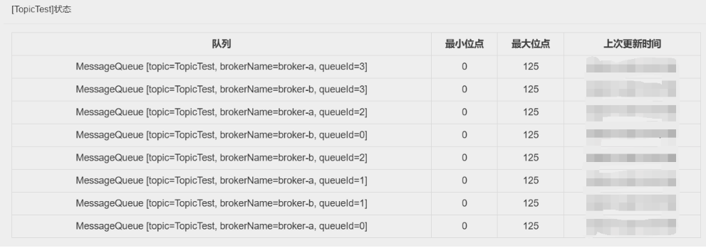
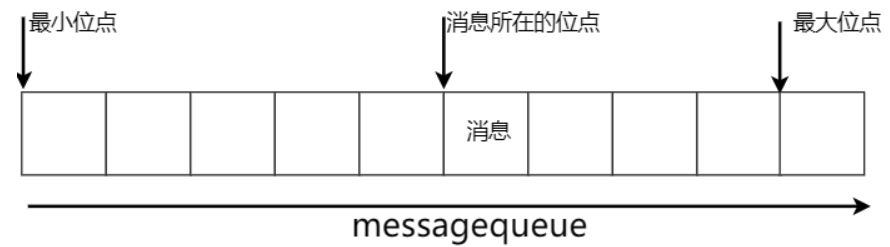
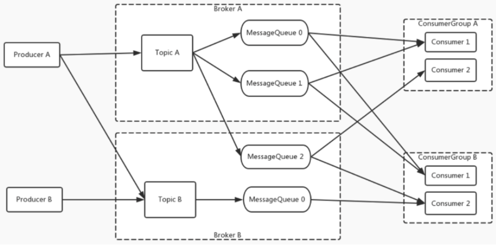

下图是RocketMQ运⾏时的整体架构：


**1、nameServer 命名服务**

在我们之前的实验过程中，你会发现，nameServer不依赖于任何其他的服务，⾃⼰独⽴就能启动。并且，不

管是broker还是客户端，都需要明确指定nameServer的服务地址。以⼀台电脑为例，nameServer可以理解为

是整个RocketMQ的CPU，整个RocketMQ集群都要在CPU的协调下才能正常⼯作。

**2、broker 核⼼服务**

从之前的实验过程中你会发现，broker是RocketMQ中最为娇贵的⼀个组件。RockeMQ提供了各种各样的重

要设计来保护broker的安全。同时broker也是RocketMQ中配置最为繁琐的部分。同样以电脑为例，broker就

是整个RocketMQ中的硬盘、显卡这⼀类的核⼼硬件。RocketMQ最核⼼的消息存储、传递、查询等功能都要

由broker提供。

**3、client 客户端**

Client包括消息⽣产者和消息消费者。同样以电脑为例，Client可以认为是RocketMQ中的键盘、⿏标、显示器

这类的输⼊输出设备。⿏标、键盘输⼊的数据需要传输到硬盘、显卡等硬件才能进⾏处理。但是键盘、⿏标是

不能直接将数据输⼊到硬盘、显卡的，这就需要CPU进⾏协调。通过CPU，⿏标、键盘就可以将输⼊的数据最

终传输到核⼼的硬件设备中。经过硬件设备处理完成后，再通过CPU协调，显示器这样的输出设备就能最终从

核⼼硬件设备中获取到输出的数据。

## 理解RocketMQ的消息模型

⾸先：我们先来尝试往RocketMQ中发送⼀批消息。

在上⼀章节提到，RocketMQ提供了⼀个测试脚本tools.sh，⽤于快速测试RocketMQ的客户端。

在服务器上配置了⼀个NAMESRV_ADDR环境变量后，就可以直接使⽤RocketMQ提供的tools.sh脚本，调⽤

RocketMQ提供的Producer示例。

tools.sh org.apache.rocketmq.example.quickstart.Producer

这⾥调⽤的Producer示例实际上是在RocketMQ安装⽬录下的lib/rocketmq-example-5.3.0.jar中包含的⼀个

测试类。tools.sh脚本则是提供Producer类的运⾏环境。

Producer这个测试类，会往RocketMQ中发送⼀千条测试消息。发送消息后，我们可以在控制台看到很多如下

的⽇志信息。

```
SendResult [sendStatus=SEND_OK, msgId=7F000001426E28A418FC6545DFD803E7,
offsetMsgId=C0A8E88100002A9F0000000000B4F6E5, messageQueue=MessageQueue [topic=TopicTest,
brokerName=broker-a, queueId=2], queueOffset=124]
```

这是RocketMQ的Broker服务端给消息⽣产者的响应。这个响应信息代表的是Broker服务端已经正常接收并保

存了消息⽣产者发送的消息。这⾥⾯提到了很多topic、messageQueue等概念，这些是什么意思呢？我们不

妨先去RocketMQ的DashBoard控制台看⼀下RocketMQ的Broker是如何保存这些消息的。

访问DashBoard上的“主题”菜单，可以看到多了⼀个名为TopicTest的主题。



从这⾥可以看到，TopicTest这个话题下，分配了⼋个MessageQueue。这⾥的MessageQueue就是⼀个典型

的具有FIFO（先进先出）特性的消息集合。这⼋个MessageQueue均匀的分布在了集群中的两个Broker服务

上。每个MesasgeQueue都记录了⼀个最⼩位点和最⼤位点。这⾥的位点代表每个MessageQueue上存储的消

息的索引，也称为offset(偏移量)。每⼀条新记录的消息，都按照当前最⼤位点往后分配⼀个新的位点。这个位

点就记录了这⼀条消息的存储位置。

从Dashboard就能看到，每⼀个MessageQueue，当前都记录了125条消息。也就是说，我们之前使⽤

Producer示例往RocketMQ中发送的⼀千条消息，就被均匀的分配到了这⼋个MessageQueue上。

这是，再回头来看之前⽇志中打印的SendResult的信息。⽇志中的MessageQueue就代表这⼀条消息存在哪

个队列上了。⽽queueOffset就表示这条消息记录在MessageQueue的哪个位置。



然后：我们尝试启动⼀个消费者来消费消息我们同样可以使⽤tools.sh来启动⼀个消费者示例。

```
tools.sh org.apache.rocketmq.example.quickstart.Consumer
```

这个Consumer同样是RocketMQ下的lib/rocketmq-example-5.3.0.jar中提供的消费者示例。Consumer启动

完成后，我们可以在控制台看到很多类似这样的⽇志：

```
ConsumeMessageThread_3 Receive New Messages: [MessageExt [brokerName=broker-b, queueId=0,
storeSize=194, queueOffset=95, sysFlag=0, bornTimestamp=1666252677571,
bornHost=/192.168.65.112:38414, storeTimestamp=1666252678510,
storeHost=/192.168.65.112:10911, msgId=C0A8E88200002A9F0000000000B4ADD2,
commitLogOffset=11840978, bodyCRC=634652396, reconsumeTimes=0,
preparedTransactionOffset=0, toString()=Message{topic='TopicTest', flag=0, properties=
{MIN_OFFSET=0, MAX_OFFSET=125, CONSUME_START_TIME=1666257428525,
UNIQ_KEY=7F000001426E28A418FC6545DDC302F9, CLUSTER=rocketmq-cluster, TAGS=TagA}, body=[72,
101, 108, 108, 111, 32, 82, 111, 99, 107, 101, 116, 77, 81, 32, 55, 54, 49],
transactionId='null'}]]
```

这⾥⾯也打印出了⼀些我们刚刚熟悉的brokerName，queueId，queueOffset这些属性。其中queueOffset属

性就表示这⼀条消息在MessageQueue上的存储位点。通过记录每⼀个消息的Offset偏移量，RocketMQ就可

以快速的定位到这⼀条消息具体的存储位置，继⽽正确读取到消息的内容。

接下来，我们还是可以到DashBoard上印证⼀下消息消费的情况。

在DashBoard的“主题”⻚⾯，选择对应主题后的“CONSUMER管理”功能，就能看到消费者的消费情况。


从这⾥可以看到，刚才的Comsumer示例启动了⼀个叫做please_rename_unique_group_name_4的消费者

组。然后这个消费者从⼋个队列中都消费了数据。后⾯的代理者位点记录的是当前MessageQueue上记录的最

⼤消息偏移量。⽽消费者位点记录的是当前消费者组在MessageQueue上消费的最⼤消息偏移量。其中的差值

就表示当前消费者组没有处理完的消息。

并且，从这⾥还可以看出，RocketMQ记录消费者的消费进度时，都是以“订阅组”为单位的。我们也可以使⽤

上⼀章节的示例，⾃⼰另外定义⼀个新的消费者组来消费TopicTest上的消息。这时，RocketMQ就会单独记录

新消费者组的消费进度。⽽新的消费者组，也能消费到TopicTest下的所有消息。

接下来：我们就可以梳理出RocketMQ的消息记录⽅式

对之前的实验过程进⾏梳理，我们就能抽象出RocketMQ的消息模型。如下图所示：



⽣产者和消费者都可以指定⼀个Topic发送消息或者拉取消息。⽽Topic是⼀个逻辑概念。Topic中的消息会分

布在后⾯多个MessageQueue当中。这些MessageQueue会分布到⼀个或者多个broker中。

在RocketMQ的这个消息模型当中，最为核⼼的就是Topic。对于客户端，Topic代表了⼀类有相同业务规则的

消息。对于Broker，Topic则代表了系统中⼀系列存储消息的资源。所以，RocketMQ对于Topic是需要做严格

管理的。如果任由客户端随意创建Topic，那么服务端的资源管理压⼒就会⾮常⼤。默认情况下，Topic都需要

由管理员在RocketMQ的服务端⼿动进⾏创建，然后才能给客户端使⽤的。⽽我们之前在broker.conf中⼿动添

加的autoCreateTopic=true，就是表示可以由客户端⾃⾏创建Topic。这种配置⽅式显然只适⽤于测试环境，

在⽣产环境不建议打开这个配置项。如果需要创建 Topic，可以交由运维⼈员提前创建 Topic。

⽽对于业务来说，最为重要的就是消息Message了。⽣产者发送到某⼀个Topic下的消息，最终会保存在Topic

下的某⼀个MessageQueue中。⽽消费者来消费消息时，RocketMQ会在Broker端给每个消费者组记录⼀个消

息的消费位点Offset。通过Offset控制每个消费者组的消息处理进度。这样，每⼀条消息，在⼀个消费者组当

中只被处理⼀次。

```

```

> [!NOTE]
>
> 从逻辑层⾯来看，RocketMQ 的消息模型和Kafka的消息模型是很相似的。没错，早期 RocketMQ 就是借
>
> 鉴Kafka设计出来的。但是，在后续的发展过程中，RocketMQ 在Kafka的基础上，做了⾮常⼤的调整。
>
> 所以，对于RocketMQ，你也不妨回顾下Kafka，与Kafka对⽐着进⾏学习。
>
> 例如，在Kafka当中，如果Topic过多，会造成消息吞吐量下降。但是在RocketMQ中，对Topic的⽀持已
>
> 经得到很⼤的加强。Topic过多⼏乎不会影响整体性能。RocketMQ是怎么设计的？另外，之前Kafka课程
>
> 中也分析过，Leader选举的过程中，Kafka优先保证服务可⽤性，⽽⼀定程度上牺牲了消息的安全性，那
>
> 么 RocketMQ 是怎么做的呢？保留这些问题，后续我们⼀⼀解决。

