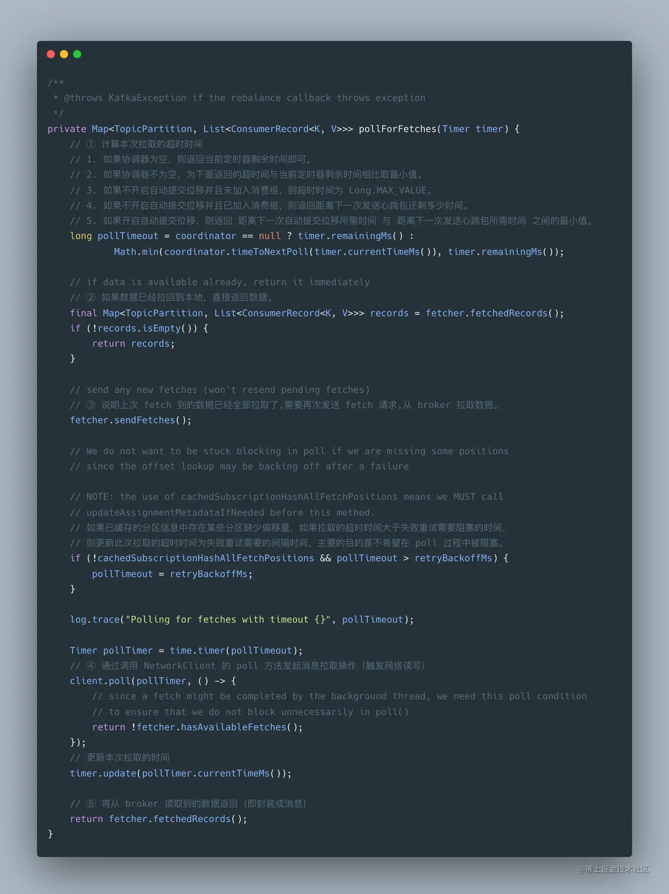
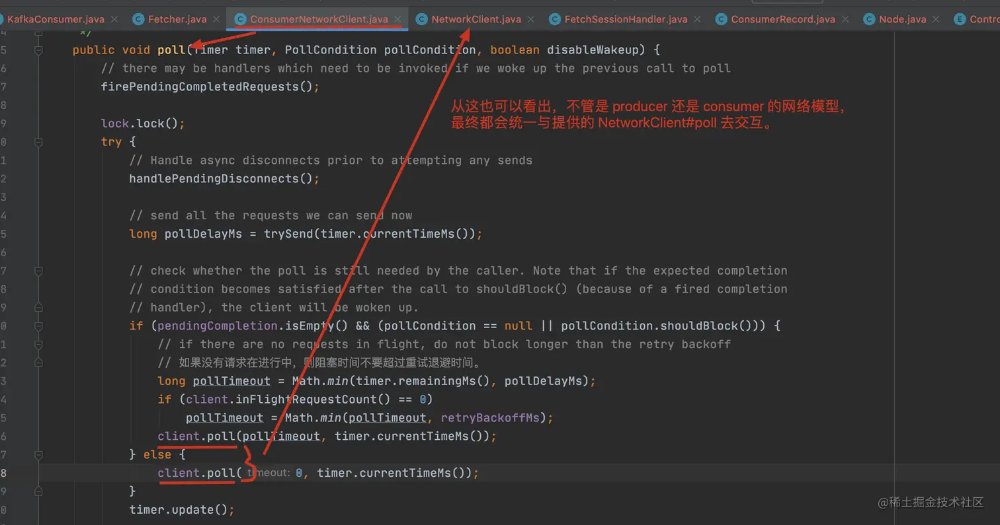

## 1、Consumer 的示例

```java

public class KafkaConsumerTest {
    public static void main(String[] args) {
        Properties props = new Properties();

        // kafka地址,列表格式为host1:port1,host2:port2,...，无需添加所有的集群地址，kafka会根据提供的地址发现其他的地址(建议多提供几个，以防提供的服务器关闭) 必须设置
        props.put("bootstrap.servers", "localhost:9092");
        // key序列化方式 必须设置
        props.put("key.serializer", "org.apache.kafka.common.serialization.StringSerializer");
        // value序列化方式 必须设置
        props.put("value.serializer", "org.apache.kafka.common.serialization.StringSerializer");
        props.put("group.id", "consumer_riemann_test");

        KafkaConsumer<String, String> consumer = new KafkaConsumer<>(props);
        // 可消费多个topic,组成一个list
        String topic = "riemann_kafka_test";
        consumer.subscribe(Arrays.asList(topic));

        while (true) {
            ConsumerRecords<String, String> records = consumer.poll(Duration.ofMillis(100));
            for (ConsumerRecord<String, String> record : records) {
                System.out.printf("offset = %d, key = %s, value = %s \n", record.offset(), record.key(), record.value());
                try {
                    Thread.sleep(100);
                } catch (InterruptedException e) {
                    e.printStackTrace();
                }
            }
        }
    }
}

```

不难看出，上面 Consumer 拉取消息的主要几个步骤：

- 构造 Consumer 的相关 Properties 配置
- 创建 KafkaConsumer 的对象 consumer
- 订阅相应的 topic 列表
- 调用 consumer 的 poll 方法拉取订阅的消息

前面三个步骤只是创建了一个 consumer 对象并订阅了 topic 主题，真正的逻辑是在第四步，也就是 poll 方法，这一步是理解 consumer 设计的关键所在。

## 2、poll 的网络模型

### 2.1 consumer poll

当一个 consumer 对象创建之后，只有 poll 方法调用时，consumer 才会真正去连接 kafka 集群，进行相关的操作，其 poll 方法具体实现如下：


consumer poll 主要做了如下几件事情：

- ① 检查这个 consumer 是否可以拉取消息
- ② 检查这个 consumer 是否订阅了相应的 topic-partition
- ③ 调用 pollForFetches 方法获取相应的 records
- ④ 在返回获取的 records 前，发送下一次的 fetch 请求，避免用户在下次请求时线程 block 在 pollForFetches 方法中。
- ⑤ 如果在给定的时间内（notExpired）获取不到可用的 records，返回空数据。

#### 2.1.1 ①


#### 2.1.2 ②


#### 2.1.3 ③



pollForFetches 方法主要做了以下几个事情：

- ① 计算本次拉取的超时时间
- ② 如果数据已经拉回到本地，直接返回数据。
- ③ 说明上次 fetch 到的数据已经全部拉取了,需要再次发送 fetch 请求,从 broker 拉取数据。
- ④ 通过调用 NetworkClient 的 poll 方法发起消息拉取操作（触发网络读写）
- ⑤ 将从 broker 读取到的数据返回（即封装成消息）

##### 2.3.1.1 ①


##### 2.1.3.2 ②

 

重点看下 CompletedFetch 是 completedFetches 处理后的类型或者是 initializeCompletedFetch 初始化后的类型，几个重要的成员变量如下：

 consumer 的 Fetcher 处理从 server 获取的 fetch response 大致分为以下几个过程：

- 通过 completedFetches.peek() 获取已经成功的 fetch response（在 fetcher.sendFetches() 方法中会把成功的结果放在这个集合中，是拆分为 topic-partition 的粒度放进去的）
- 获取下一个要处理的 nextInLineFetch，判断 CompletedFetch 是否未初始化，没有的话，则初始化。
- 通过 fetchRecords(nextInLineFetch, recordsRemaining) 方法处理 CompletedFetch 对象，在这个里面会去验证 nextFetchOffset 是否能对得上，只有 nextFetchOffset 是一致的情况下才会去处理相应的数据，并更新 the fetch offset 的信息，如果 nextFetchOffset 不一致，这里就不会处理，the fetch offset 就不会更新，下次 fetch 请求时是会接着 the fetch offset 的位置去请求相应的数据。
- 返回相应的 ConsumerRecord 数据。

##### 2.1.3.3 ③

说明上次 fetch 到的数据已经全部拉取了,需要再次发送 fetch 请求,从 broker 拉取数据。


在发送的 fetch 的过程中，总共分为以下两步：

- `prepareFetchRequests()`：为订阅的所有 topic-partition list 创建 fetch 请求（只要该 topic-partition 没有还在处理的请求），创建的 fetch 请求依然是按照 node 级别创建的。
- `client.send(fetchTarget, request)`：发送 fetch 请求，并设置相应的 Listener，请求处理成功的话，就加入到 completedFetches 中，在加入这个 completedFetches 集合时，是按照 topic-partition 级别去加入，这样也就方便了后续的处理。

从这里可以看出，在每次发送 fetch 请求时，都会向所有可发送的 topic-partition 发送 fetch 请求，调用一次 fetcher.sendFetches()，拉取到的数据，可需要多次 pollForFetches 循环才能处理完，因为 Fetcher 线程是在后台运行，这也保证了尽可能少地阻塞用户的处理线程，因为如果 Fetcher 中没有可处理的数据，用户的线程是会阻塞在 poll 方法中的。

##### 2.1.3.4 ④

调用底层 NetworkClient 提供的接口去发送相应的请求，可以看这一篇：[聊聊 Kafka： Producer 的网络模型](https://link.juejin.cn?target=https%3A%2F%2Friemann.blog.csdn.net%2Farticle%2Fdetails%2F121217620)，只不过之前写的是关于 Producer 的网络模型，现在的是 Consumer 的 poll 模型，最终都会统一与提供的 NetworkClient#poll 进行交互。



##### 2.1.3.5 ⑤

拉取器提供已经拉取到的记录集给 KafkaConsumer 调用，并更新 the consumed position。

#### 2.1.4 ④

如果拉取到的消息集合不为空，再返回该批消息之前，如果还有积压的拉取请求，可以继续发送拉取请求，但此时会禁用 wakeup，主要的目的是用户在处理消息时，KafkaConsumer 还可以继续向 broker 拉取消息。


#### 2.1.5 ⑤


## 3、总结

相信大家跟着老周上面的思路及源码分析，对 Consumer 的 poll 模型应该有个清晰的认识了。下面这张图代表了 Consumer 的整体网络模型的封装，我们把主要的一些组件了解后，再从整体到局部，我相信你会喜欢这样一层层剥洋葱的感觉的。


## 转载

作者：老周聊架构
链接：https://juejin.cn/post/7124316981435727879

