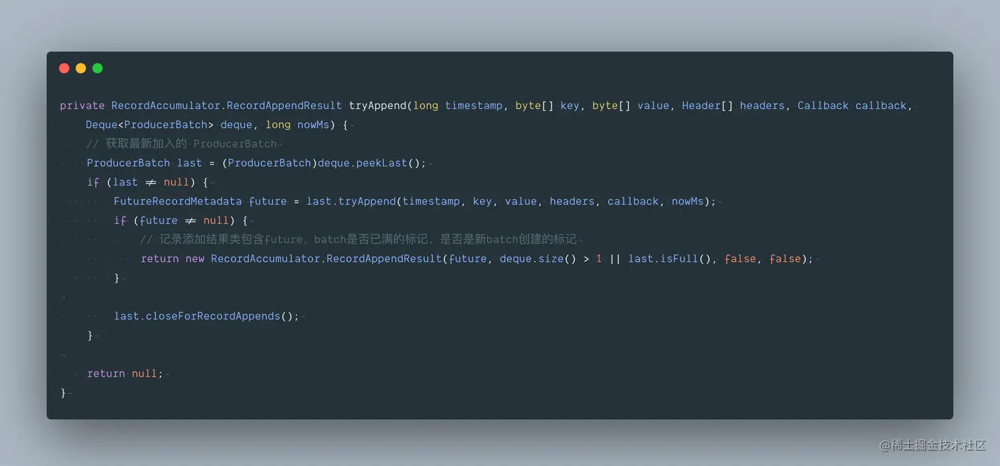
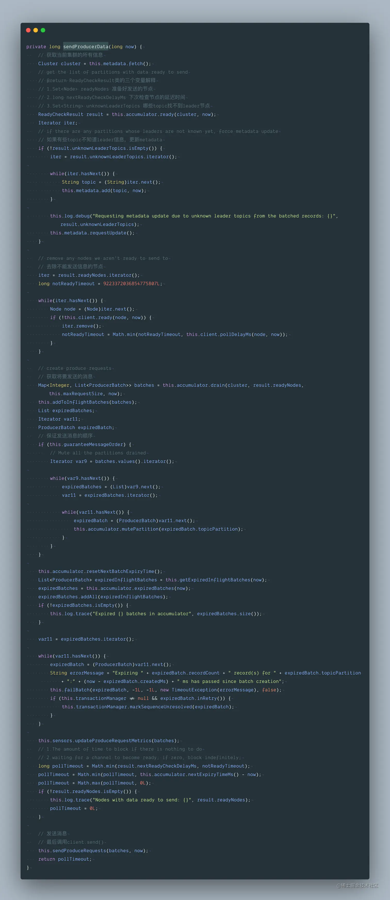

## 一、前言

我们这用的 Kafka 版本是 2.7.0，其 Client 端是由 Java 实现，Server 端是由 Scala 来实现的，在使用 Kafka 时，Client 是用户最先接触到的部分，因此，我们从 Client 端开始，会先从 Producer 端开始，今天我们就来对 Producer 源码解析一番。

## 二、Producer 使用

首先我们先通过一段代码来展示 KafkaProducer 的使用方法。在下面的示例中，我们使用 KafkaProducer 实现向 Kafka 发送消息的功能。在示例程序中，首先将 KafkaProduce 使用的配置写入 到 Properties 中，每项配置的具体含义在注释中进行解释。之后以此 Properties 对象为参数构造 KafkaProducer 对象，最后通过 send 方法完成发送，代码中包含同步发送、异步发送两种情况。

## 二、Producer 使用

首先我们先通过一段代码来展示 KafkaProducer 的使用方法。在下面的示例中，我们使用 KafkaProducer 实现向 Kafka 发送消息的功能。在示例程序中，首先将 KafkaProduce 使用的配置写入 到 Properties 中，每项配置的具体含义在注释中进行解释。之后以此 Properties 对象为参数构造 KafkaProducer 对象，最后通过 send 方法完成发送，代码中包含同步发送、异步发送两种情况。


从上面的代码可以看出 Kafka 为用户提供了非常简洁方便的 API，在使用时，只需要如下两步：

- 初始化 KafkaProducer 实例
- 调用 send 接口发送数据

本文主要是围绕着初始化 KafkaProducer 实例与如何实现 send 接口发送数据而展开的。

## 三、KafkaProducer 实例化

了解了 KafkaProducer 的基本使用，然后我们来深入了解下方法核心逻辑：

```java
public KafkaProducer(Properties properties) {
    this(Utils.propsToMap(properties), (Serializer)null, (Serializer)null, (ProducerMetadata)null, (KafkaClient)null, (ProducerInterceptors)null, Time.SYSTEM);
}
```


## 四、消息发送过程

用户是直接使用 producer.send() 发送的数据，先看一下 send() 接口的实现

```java
// 异步向一个 topic 发送数据
public Future<RecordMetadata> send(ProducerRecord<K, V> record) {
    return this.send(record, (Callback)null);
}

// 向 topic 异步地发送数据，当发送确认后唤起回调函数
public Future<RecordMetadata> send(ProducerRecord<K, V> record, Callback callback) {
    ProducerRecord<K, V> interceptedRecord = this.interceptors.onSend(record);
    return this.doSend(interceptedRecord, callback);
}
```

数据发送的最终实现还是调用了 Producer 的 doSend() 接口。

**4.1 拦截器**

首先方法会先入拦截器集合 ProducerInterceptors ， onSend 方法是遍历拦截器 onSend 方 法，拦截器的目的是将数据处理加工， Kafka 本身并没有给出默认的拦截器的实现。如果需要使用拦截器功能，必须自己实现接口。

**4.1.1 拦截器代码**

 **4.1.2 拦截器核心逻辑**  ProducerInterceptor 接口包括三个方法：

- `onSend(ProducerRecord<K, V> var1)`：该方法封装进 KafkaProducer.send 方法中，即它运行在用户主线程中的。 确保在消息被序列化以计算分区前调用该方法。用户可以在该方法中对消息做任何操作，但最好保证不要修改消息所属的 topic 和分区，否则会影响目标分区的计算。
- `onAcknowledgement(RecordMetadata var1, Exception var2)`：该方法会在消息被应答之前或消息发送失败时调用，并且通常都是在 producer 回调逻辑触发之前。onAcknowledgement 运行在 producer 的 IO 线程中，因此不要在该方法中放入很重的逻辑，否则会拖慢 producer 的消息发送效率。
- `close()`：关闭 interceptor，主要用于执行一些资源清理工作。

拦截器可能被运行在多个线程中，因此在具体实现时用户需要自行确保线程安全。另外倘若指定了多个 interceptor，则 producer 将按照指定顺序调用它们，并仅仅是捕获每个 interceptor 可能抛出的异常记录到错误日志中而非在向上传递。

**4.2 Producer 的 doSend 实现**

下面是 doSend() 的具体实现：

 在 doSend() 方法的实现上，一条 Record 数据的发送，主要分为以下五步：

- 确认数据要发送到的 topic 的 metadata 是可用的（如果该 partition 的 leader 存在则是可用的，如果开启权限时，client 有相应的权限），如果没有 topic 的 metadata 信息，就需要获取相应的 metadata；
- 序列化 record 的 key 和 value；
- 获取该 record 要发送到的 partition（可以指定，也可以根据算法计算）；
- 向 accumulator 中追加 record 数据，数据会先进行缓存；
- 如果追加完数据后，对应的 RecordBatch 已经达到了 batch.size 的大小（或者 batch 的剩余空间不足以添加下一条 Record），则唤醒 sender 线程发送数据。

数据的发送过程，可以简单总结为以上五点，下面会这几部分的具体实现进行详细分析。

## 五、消息发送过程

**5.1 获取 topic 的 metadata 信息**

Producer 通过 waitOnMetadata() 方法来获取对应 topic 的 metadata 信息，这块内容我下一篇再来讲。

**5.2 key 和 value 的序列化**

Producer 端对 record 的 key 和 value 值进行序列化操作，在 Consumer 端再进行相应的反序列化，Kafka 内部提供的序列化和反序列化算法如下图所示： 

 当然我们也是可以自定义序列化的具体实

**5.3 获取该 record 要发送到的 partition**

获取 partition 值，具体分为下面三种情况：

- 指明 partition 的情况下，直接将指明的值直接作为 partiton 值；
- 没有指明 partition 值但有 key 的情况下，将 key 的 hash 值与 topic 的 partition 数进行取余得到 partition 值；
- 既没有 partition 值又没有 key 值的情况下，第一次调用时随机生成一个整数（后面每次调用在这个整数上自增），将这个值与 topic 可用的 partition 总数取余得到 partition 值，也就是常说的 round-robin 算法。

```java
// 当 record 中有 partition 值时，直接返回，没有的情况下调用 partitioner 的类的 partition 方法去计算（KafkaProducer.class）
private int partition(ProducerRecord<K, V> record, byte[] serializedKey, byte[] serializedValue, Cluster cluster) {
    Integer partition = record.partition();
    return partition != null ? partition : this.partitioner.partition(record.topic(), record.key(), serializedKey, record.value(), serializedValue, cluster);
}

```

Producer 默认使用的 partitioner 是 org.apache.kafka.clients.producer.internals.DefaultPartitioner，用户也可以自定义 partition 的策略，下面是默认分区策略具体实现：

```java
public int partition(String topic, Object key, byte[] keyBytes, Object value, byte[] valueBytes, Cluster cluster) {
    return this.partition(topic, key, keyBytes, value, valueBytes, cluster, cluster.partitionsForTopic(topic).size());
}

public int partition(String topic, Object key, byte[] keyBytes, Object value, byte[] valueBytes, Cluster cluster, int numPartitions) {
    return keyBytes == null ? this.stickyPartitionCache.partition(topic, cluster) : Utils.toPositive(Utils.murmur2(keyBytes)) % numPartitions;
}

```


上面这个默认算法核心就是粘着分区缓存

**5.4 向 RecordAccmulator 中追加 record 数据**

我们讲 RecordAccumulator 之前先看这张图，这样的话会对整个发送流程有个大局观。

 RecordAccmulator 承担了缓冲区的角色。默认是 32 MB。

在 Kafka Producer 中，消息不是一条一条发给 broker 的，而是多条消息组成一个 ProducerBatch，然后由 Sender 一次性发出去，这里的 batch.size 并不是消息的条数（凑满多少条即发送），而是一个大小。默认是 16 KB，可以根据具体情况来进行优化。

在 RecordAccumulator 中，最核心的参数就是：

```
private final ConcurrentMap<TopicPartition, Deque<ProducerBatch>> batches;
```

它是一个 ConcurrentMap，key 是 TopicPartition 类，代表一个 topic 的一个 partition。value 是一个包含 ProducerBatch 的双端队列。等待 Sender 线程发送给 broker。画张图来看下：

 

 上面的代码不知道大家有没有疑问？分配内存的代码为啥不在 synchronized 同步块中分配？导致下面的 synchronized 同步块中还要 tryAppend 一下。

因为这时候可能其他线程已经创建好 RecordBatch 了，造成多余的内存申请。

如果把分配内存放在 synchronized 同步块会有什么问题？

内存申请不到线程会一直等待，如果放在同步块中会造成一直不释放 Deque 队列的锁，那其他线程将无法对 Deque 队列进行线程安全的同步操作。

再跟下 tryAppend() 方法，这就比较简单了。

 以上代码见图解：

 **5.5 唤醒 sender 线程发送 RecordBatch**

当 record 写入成功后，如果发现 RecordBatch 已满足发送的条件（通常是 queue 中有多个 batch，那么最先添加的那些 batch 肯定是可以发送了），那么就会唤醒 sender 线程，发送 RecordBatch。

sender 线程对 RecordBatch 的处理是在 run() 方法中进行的，该方法具体实现如下：  

其中比较核心的方法是 run() 方法中的 org.apache.kafka.clients.producer.internals.Sender#sendProducerData

其中 pollTimeout 意思是最长阻塞到至少有一个通道在你注册的事件就绪了。返回 0 则表示走起发车了。

 我们继续跟下：org.apache.kafka.clients.producer.internals.RecordAccumulator#ready 

 最后再来看下里面这个方法 org.apache.kafka.clients.producer.internals.RecordAccumulator#drain，从accumulator 缓冲区获取要发送的数据，最大一次性发 max.request.size 大小的数据。

 

## 六、总结

最后为了让你对 Kafka Producer 有个宏观的架构理解，请看下图：

 简要说明：

- new KafkaProducer() 后创建一个后台线程 KafkaThread (实际运行线程是 Sender，KafkaThread 是对 Sender 的封装) 扫描 RecordAccumulator 中是否有消息。
- 调用 KafkaProducer.send() 发送消息，实际是将消息保存到 RecordAccumulator 中，实际上就是保存到一个 Map 中 (ConcurrentMap<TopicPartition, Deque>)，这条消息会被记录到同一个记录批次 (相同主题相同分区算同一个批次) 里面，这个批次的所有消息会被发送到相同的主题和分区上。
- 后台的独立线程扫描到 RecordAccumulator 中有消息后，会将消息发送到 Kafka 集群中 (不是一有消息就发送，而是要看消息是否 ready)
- 如果发送成功 (消息成功写入 Kafka), 就返回一个 RecordMetaData 对象，它包括了主题和分区信息，以及记录在分区里的偏移量。
- 如果写入失败，就会返回一个错误，生产者在收到错误之后会尝试重新发送消息 (如果允许的话，此时会将消息在保存到 RecordAccumulator 中)，几次之后如果还是失败就返回错误消息。

好了，本文对 Kafka Producer 源码进行了解析，下一篇文章将会详细介绍 metadata 的内容以及在 Producer 端 metadata 的更新机制。敬请期待~


链接：https://juejin.cn/post/7005598649421922318

