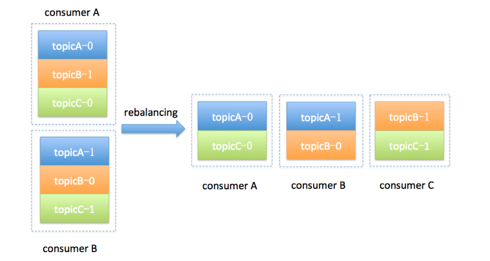

Consumer Group 端大名鼎鼎的重平衡，也就是所谓的 Rebalance 过程。我形容其为“大名鼎鼎”，从某种程度上来说其实也是“臭名昭著”，因为有关它的 bug 真可谓是此起彼伏，从未间断。这里我先卖个关子，后面我会解释它“遭人恨”的地方。我们先来了解一下什么是 Rebalance。

**Rebalance 本质上是一种协议，规定了一个 Consumer Group 下的所有 Consumer 如何达成一致，来分配订阅 Topic 的每个分区**。比如某个 Group 下有 20 个 Consumer 实例，它订阅了一个具有 100 个分区的 Topic。正常情况下，Kafka 平均会为每个 Consumer 分配 5 个分区。这个分配的过程就叫 Rebalance。

那么 Consumer Group 何时进行 Rebalance 呢？Rebalance 的触发条件有 3 个。

1. 组成员数发生变更。比如有新的 Consumer 实例加入组或者离开组，抑或是有 Consumer 实例崩溃被“踢出”组。
2. 订阅主题数发生变更。Consumer Group 可以使用正则表达式的方式订阅主题，比如 consumer.subscribe(Pattern.compile(“t.*c”)) 就表明该 Group 订阅所有以字母 t 开头、字母 c 结尾的主题。在 Consumer Group 的运行过程中，你新创建了一个满足这样条件的主题，那么该 Group 就会发生 Rebalance。
3. 订阅主题的分区数发生变更。Kafka 当前只能允许增加一个主题的分区数。当分区数增加时，就会触发订阅该主题的所有 Group 开启 Rebalance。

Rebalance 发生时，Group 下所有的 Consumer 实例都会协调在一起共同参与。你可能会问，每个 Consumer 实例怎么知道应该消费订阅主题的哪些分区呢？这就需要分配策略的协助了。

当前 Kafka 默认提供了 3 种分配策略，每种策略都有一定的优势和劣势，我们今天就不展开讨论了，你只需要记住社区会不断地完善这些策略，保证提供最公平的分配策略，即每个 Consumer 实例都能够得到较为平均的分区数。比如一个 Group 内有 10 个 Consumer 实例，要消费 100 个分区，理想的分配策略自然是每个实例平均得到 10 个分区。这就叫公平的分配策略。如果出现了严重的分配倾斜，势必会出现这种情况：有的实例会“闲死”，而有的实例则会“忙死”。

我们举个简单的例子来说明一下 Consumer Group 发生 Rebalance 的过程。假设目前某个 Consumer Group 下有两个 Consumer，比如 A 和 B，当第三个成员 C 加入时，Kafka 会触发 Rebalance，并根据默认的分配策略重新为 A、B 和 C 分配分区，如下图所示：‘

显然，Rebalance 之后的分配依然是公平的，即每个 Consumer 实例都获得了 3 个分区的消费权。这是我们希望出现的情形。

讲完了 Rebalance，现在我来说说它“遭人恨”的地方。

首先，Rebalance 过程对 Consumer Group 消费过程有极大的影响。如果你了解 JVM 的垃圾回收机制，你一定听过万物静止的收集方式，即著名的 stop the world，简称 STW。在 STW 期间，所有应用线程都会停止工作，表现为整个应用程序僵在那边一动不动。Rebalance 过程也和这个类似，在 Rebalance 过程中，所有 Consumer 实例都会停止消费，等待 Rebalance 完成。这是 Rebalance 为人诟病的一个方面。

其次，目前 Rebalance 的设计是所有 Consumer 实例共同参与，全部重新分配所有分区。其实更高效的做法是尽量减少分配方案的变动。例如实例 A 之前负责消费分区 1、2、3，那么 Rebalance 之后，如果可能的话，最好还是让实例 A 继续消费分区 1、2、3，而不是被重新分配其他的分区。这样的话，实例 A 连接这些分区所在 Broker 的 TCP 连接就可以继续用，不用重新创建连接其他 Broker 的 Socket 资源。

最后，Rebalance 实在是太慢了。曾经，有个国外用户的 Group 内有几百个 Consumer 实例，成功 Rebalance 一次要几个小时！这完全是不能忍受的。最悲剧的是，目前社区对此无能为力，至少现在还没有特别好的解决方案。所谓“本事大不如不摊上”，也许最好的解决方案就是避免 Rebalance 的发生吧。

​	**在真实的业务场景中，很多 Rebalance 都是计划外的或者说是不必要的**。我们应用的 TPS 大多是被这类 Rebalance 拖慢的，因此避免这类 Rebalance 就显得很有必要了。下面我们就来说说如何避免 Rebalance。

我们一定要避免因为各种参数或逻辑不合理而导致的组成员意外离组或退出的情形，与之相关的主要参数有：

- session.timeout.ms
- heartbeat.interval.ms
- max.poll.interval.ms
- GC 参数

按照我们今天所说的内容，恰当地设置这些参数，你一定能够大幅度地降低生产环境中的 Rebalance 数量，从而整体提升 Consumer 端 TPS。

**第一类非必要 Rebalance 是因为未能及时发送心跳，导致 Consumer 被“踢出”Group 而引发的**。因此，你需要仔细地设置**session.timeout.ms 和 heartbeat.interval.ms**的值。我在这里给出一些推荐数值，你可以“无脑”地应用在你的生产环境中。

- 设置 session.timeout.ms = 6s。
- 设置 heartbeat.interval.ms = 2s。
- 要保证 Consumer 实例在被判定为“dead”之前，能够发送至少 3 轮的心跳请求，即 session.timeout.ms >= 3 * heartbeat.interval.ms。

将 session.timeout.ms 设置成 6s 主要是为了让 Coordinator 能够更快地定位已经挂掉的 Consumer。毕竟，我们还是希望能尽快揪出那些“尸位素餐”的 Consumer，早日把它们踢出 Group。希望这份配置能够较好地帮助你规避第一类“不必要”的 Rebalance。

**第二类非必要 Rebalance 是 Consumer 消费时间过长导致的**。我之前有一个客户，在他们的场景中，Consumer 消费数据时需要将消息处理之后写入到 MongoDB。显然，这是一个很重的消费逻辑。MongoDB 的一丁点不稳定都会导致 Consumer 程序消费时长的增加。此时，**max.poll.interval.ms**参数值的设置显得尤为关键。如果要避免非预期的 Rebalance，你最好将该参数值设置得大一点，比你的下游最大处理时间稍长一点。就拿 MongoDB 这个例子来说，如果写 MongoDB 的最长时间是 7 分钟，那么你可以将该参数设置为 8 分钟左右。

总之，你要为你的业务处理逻辑留下充足的时间。这样，Consumer 就不会因为处理这些消息的时间太长而引发 Rebalance 了。

如果你按照上面的推荐数值恰当地设置了这几个参数，却发现还是出现了 Rebalance，那么我建议你去排查一下**Consumer 端的 GC 表现**，比如是否出现了频繁的 Full GC 导致的长时间停顿，从而引发了 Rebalance。为什么特意说 GC？那是因为在实际场景中，我见过太多因为 GC 设置不合理导致程序频发 Full GC 而引发的非预期 Rebalance 了。

、

账号:6212264402085482374;开户行:中国工商银行;开户姓名:王培鹏;网点号:2260;银行机构代码:102651022602;网点名称:成都高新石油路支行;网点地址:四川省成都市成华区府青路一段19号附2号、附3号、附4号、附5号;联系电话:028-83397274