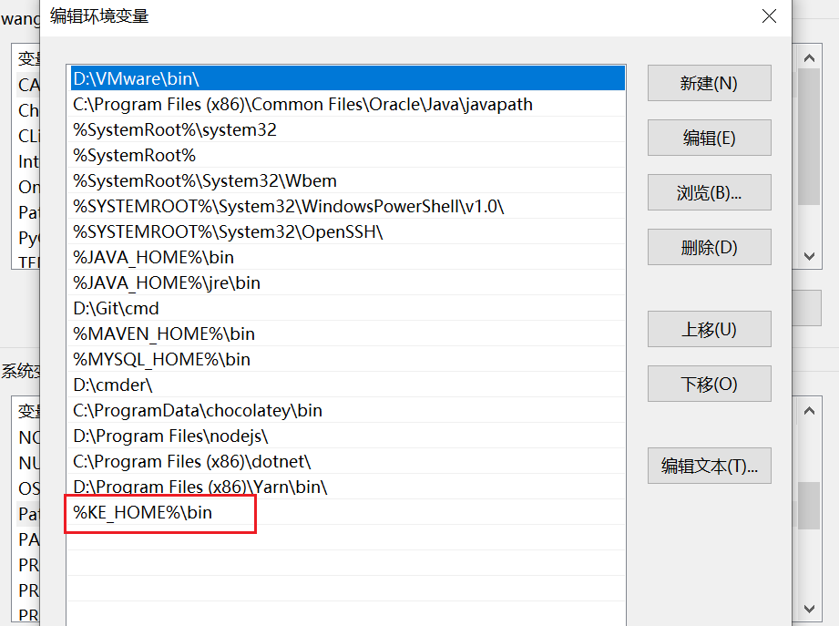

# 前言

windows安装mysql和kafka eagle，linux部署kafka集群

# 下载

官网地址：https://www.kafka-eagle.org/

注意，在我安装过程中，先安装的3.0.0，Mysql用的5.7，一直在报兼容性问题

因此，使用的是kafka eagle2.0.0

# 二、安装Kafka-Eagle

## 1、开启Kafka JMX端口

JMX(Java Management Extensions)是一个为应用程序植入管理功能的框架。JMX是一套标准的代理和服务，实际上，用户可以在任何Java应用程序中使用这些代理和服务实现管理。很多的一些软件都提供了JMX接口，来实现一些管理、监控功能。

- 开启Kafka JMX
  在启动Kafka的脚本前（bin/kafka-run-class.sh ），添加： 

  ```
  export KAFKA_JMX_OPTS="-Dcom.sun.management.jmxremote \
                         -Dcom.sun.management.jmxremote.authenticate=false \
                         -Dcom.sun.management.jmxremote.ssl=false \
                         -Dcom.sun.management.jmxremote.port=9999 \
                         -Djava.rmi.server.hostname=43.143.251.77"
  
  ```

  

注意点：

1、先开启zookeeper再添加，添加完成后再启动kafka，不然会端口冲突。

2、设置防火墙

这个测试也比较简单

在windos控制台打开jconsole.exe（需要已经安装jdk）


这样就可以了。

## 2、安装Kafka-Eagle

### 1）、 安装JDK，并配置好JAVA_HOME。

### 2）、安装Mysql，建立库ke（可以自己起名，注意修改配置文件的名称）

## 3）、将kafka_eagle解压

### 4）、配置 kafka_eagle 环境变量




```

D:\eagle\kafka-eagle-bin-2.0.0\kafka-eagle-bin-2.0.0\kafka-eagle-web-2.0.0
```

### 5）、 配置 kafka_eagle文件

使用vi打开conf目录下的system-config.properties

设置好jdbc和cluster还有cluster1.kafka.eagle.jmx.uri

```
######################################
# multi zookeeper & kafka cluster list
# 配置kafka集群信息,多个集群可进行多次配置 参考官网安装指南  配置hostname需要在/etc/hosts配置主机hostname和ip映射关系
######################################
kafka.eagle.zk.cluster.alias=cluster1
cluster1.zk.list=43.143.251.77:2181

######################################
# zookeeper enable acl
# kafka acl 没有开启给值false即可
######################################
cluster1.zk.acl.enable=false
cluster1.zk.acl.schema=digest
cluster1.zk.acl.username=test
cluster1.zk.acl.password=test123

######################################
# broker size online list
######################################
cluster1.kafka.eagle.broker.size=20

######################################
# zk client thread limit
# zk 线程数量
######################################
kafka.zk.limit.size=25

######################################
# kafka eagle webui port
######################################
kafka.eagle.webui.port=8048

######################################
# kafka jmx acl and ssl authenticate
# jmx的acl控制
######################################
cluster1.kafka.eagle.jmx.acl=false
cluster1.kafka.eagle.jmx.user=keadmin
cluster1.kafka.eagle.jmx.password=keadmin123
cluster1.kafka.eagle.jmx.ssl=false
cluster1.kafka.eagle.jmx.truststore.location=/Users/dengjie/workspace/ssl/certificates/kafka.truststore
cluster1.kafka.eagle.jmx.truststore.password=ke123456

######################################
# kafka offset storage 
# Kafka offsets stored in kafka. kafka自身管理offset
######################################
cluster1.kafka.eagle.offset.storage=kafka

######################################
# kafka jmx uri
######################################
cluster1.kafka.eagle.jmx.uri=service:jmx:rmi:///jndi/rmi://43.143.251.77:9999/jmxrmi

######################################
# kafka metrics, 15 days by default
# 指标是否开启  指标保留时间/天
######################################
kafka.eagle.metrics.charts=true
kafka.eagle.metrics.retain=15

######################################
# kafka sql topic records max
# sql最大记录数  是否自动修复sql错误
######################################
kafka.eagle.sql.topic.records.max=5000
kafka.eagle.sql.fix.error=false

######################################
# delete kafka topic token
# 删除topic时的token密钥
######################################
kafka.eagle.topic.token=keadmin

######################################
# kafka sasl authenticate
# kafka sasl是否开启以及相关配置
######################################
cluster1.kafka.eagle.sasl.enable=false
cluster1.kafka.eagle.sasl.protocol=SASL_PLAINTEXT
cluster1.kafka.eagle.sasl.mechanism=PLAIN
cluster1.kafka.eagle.sasl.jaas.config=org.apache.kafka.common.security.scram.ScramLoginModule required username="kafka" password="kafka-eagle";
cluster1.kafka.eagle.sasl.client.id=
cluster1.kafka.eagle.blacklist.topics=
cluster1.kafka.eagle.sasl.cgroup.enable=false
cluster1.kafka.eagle.sasl.cgroup.topics=

######################################
# kafka mysql jdbc driver address
# 数据存储数据配置  mysql/sqlite 以下为mysql配置
######################################
kafka.eagle.driver=com.mysql.jdbc.Driver
kafka.eagle.url=jdbc:mysql://127.0.0.1:3306/ke?useUnicode=true&characterEncoding=UTF-8&useTimezone=true&autoReconnect=true&serverTimezone=Asia/Shanghai&rewriteBatchedStatements=true
kafka.eagle.username=root
kafka.eagle.password=123456

```

### 5）、启动

双击bin目录下的ke.bat就可以启动了


# 三、验证

浏览器中输入地址：http://localhost:8048

账号admin

密码123456