# SpringBoot中@KafkaListener原理


先上流程图：

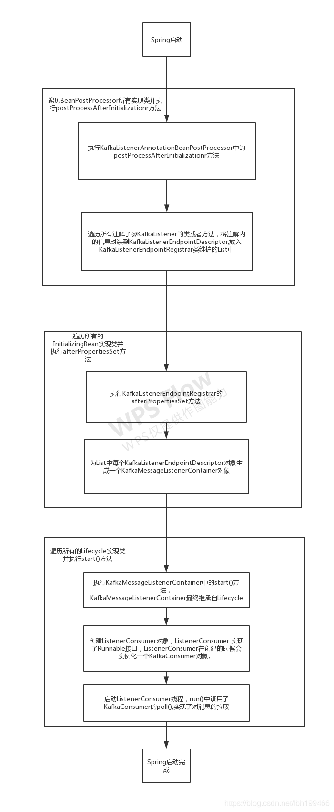

在我们的SpringBoot工程中，只需在方法中注解
@KafkaListener(topics = {”demo_topic_01“})
即可实现对该topic的监听

我们知道，kafka的consumer端通过从broker poll消息，然后处理

我们通过正向理解 + 结果反推 来分析

代码最终肯定会调用KafkaConsumer的poll()方法，可以通过方法栈来确定调用来源

在Listener打一个断点：
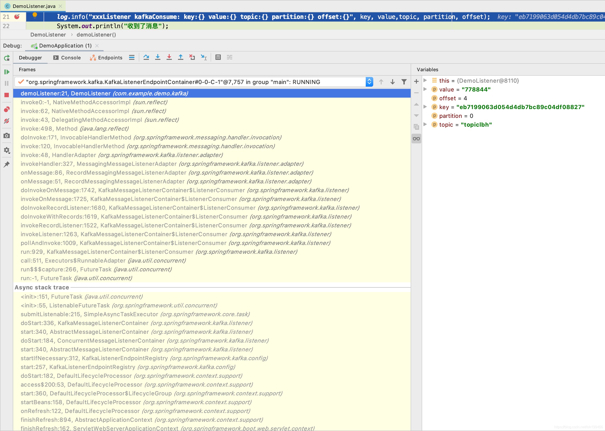

查看poll的调用路径

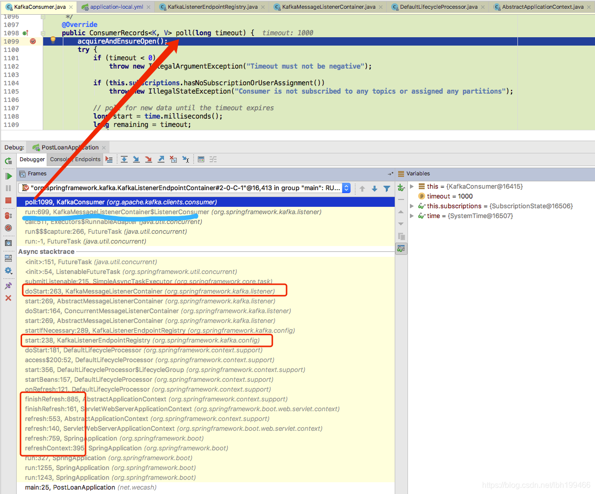

由调用知，KafkaMessageListenerContainer的内部类ListenerConsumer 实现了Runnable接口，里面调用了consumer的poll方法

观察Async stacktrace可知调用的起始位置
KafkaListenerEndpointRegistry的start()方法

```java
@Override
	public void start() {
		for (MessageListenerContainer listenerContainer : getListenerContainers()) {
			startIfNecessary(listenerContainer);
		}
	}

```

最终调到了
KafkaMessageListenerContainer的doStart方法
这个方法 创建了一个新的KafkaConsumer对象
可以理解成一个topic的监听器 就会创建一个对应的KafkaConsumer对象，只监听对应的topic消息

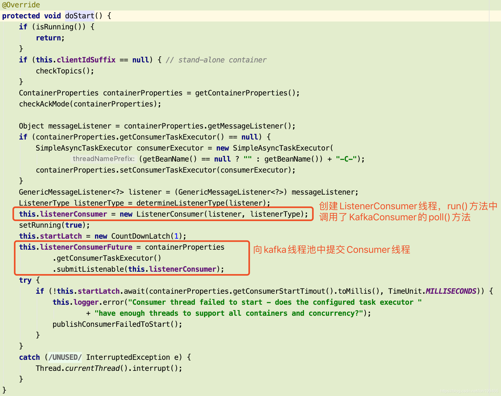


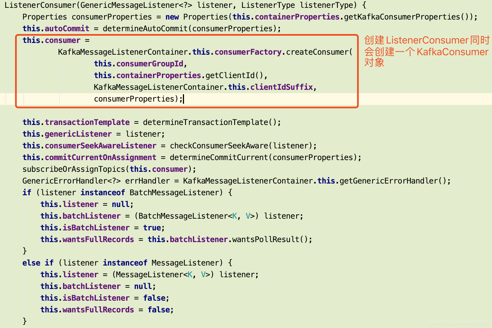

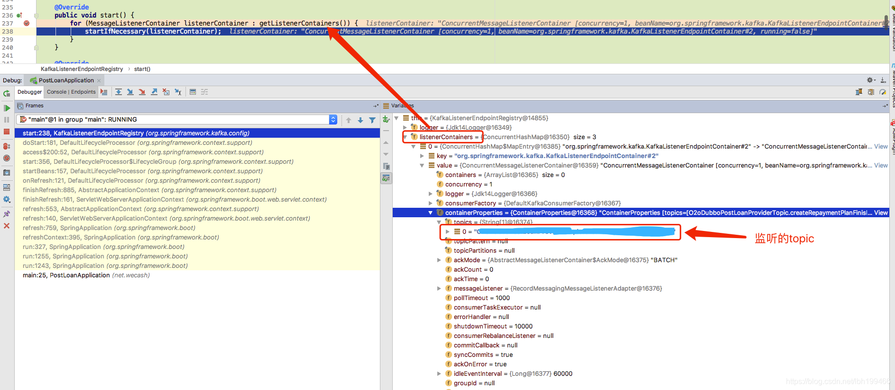

list里面包含了这个工程定义的所有的监听topic listener

这样整个流程就串起来了

@KafkaListener 到 KafkaConsumer 流程
KafkaMessageListenerContainer中创建了一个线程，这个线程new一个KafkaConsumer对象并执行poll方法。

每个注解了@KafkaListener的方法都会在KafkaListenerAnnotationBeanPostProcessor中，随之Spring的启动，创建相应的KafkaMessageListenerContainer。

看到BeanPostProcessor我们应该很熟悉，Spring初始化的过程中，会执行所有实现了BeanPostProcessor接口的postProcessBeforeInitialization、postProcessAfterInitializationr方法

@KafkaListener注释：
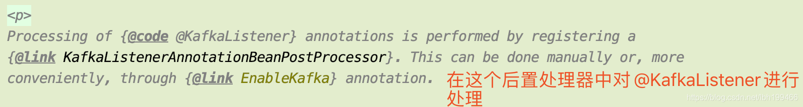

KafkaListenerAnnotationBeanPostProcessor关键代码：

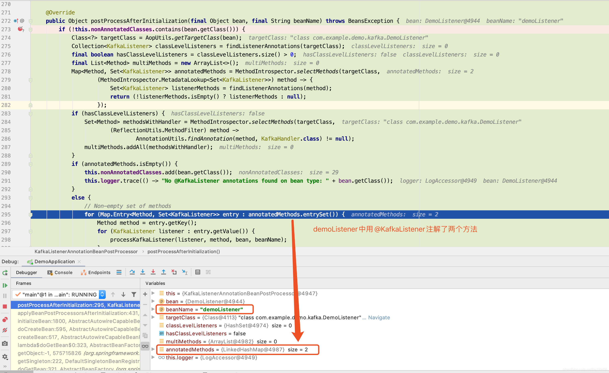

后置处理器中，默认情况下只是将注解中的相关信息放入了一个List中，真正创建MessageListenerContainer的地方是在KafkaListenerEndpointRegistry中

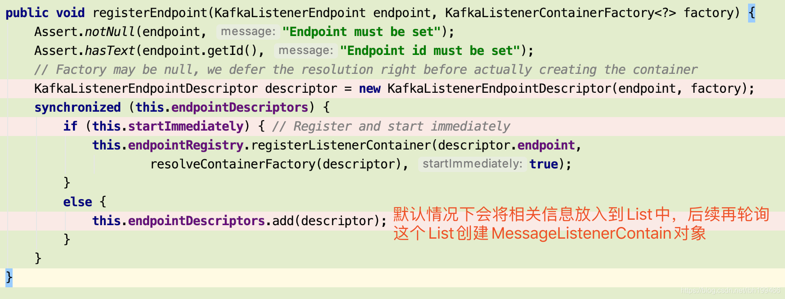

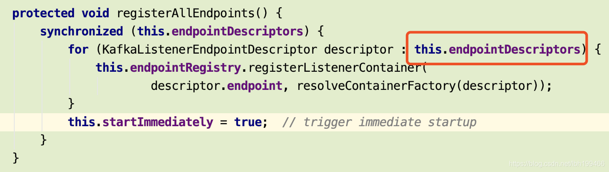

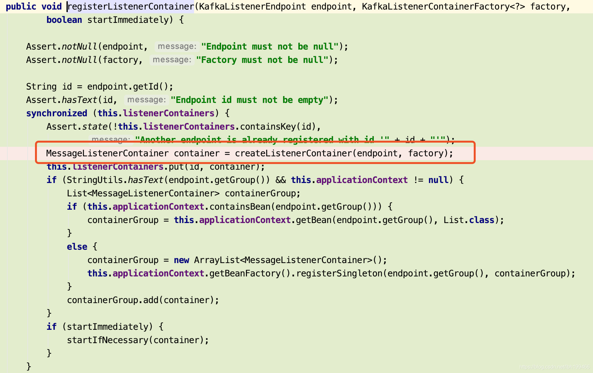

### 总结

这样，由@KafkaListener开始 ->生成KafkaMessageListenerContainer->创建KafkaConsumer对象->拉取消息，就串起来了~