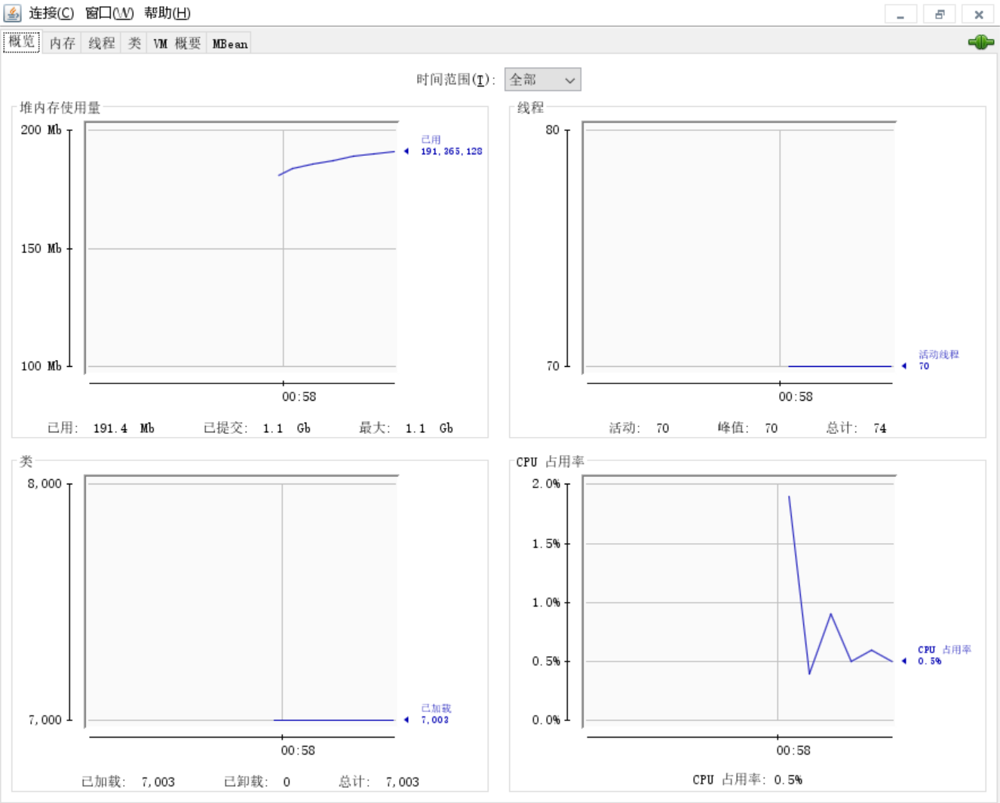

```
 vi bin/kafka-run-class.sh 
```

首行加上

```
export KAFKA_JMX_OPTS="-Dcom.sun.management.jmxremote \
                       -Dcom.sun.management.jmxremote.authenticate=false \
                       -Dcom.sun.management.jmxremote.ssl=false \
                       -Dcom.sun.management.jmxremote.port=9999 \
                       -Djava.rmi.server.hostname=43.143.251.77"
```


重启kafka，看到如下

```
 netstat -an | grep 9999
tcp6       0      0 :::9999                 :::*                    LISTEN  
```


本地启动 jconsole.exe

直接输入远程连接43.143.251.77.9999

