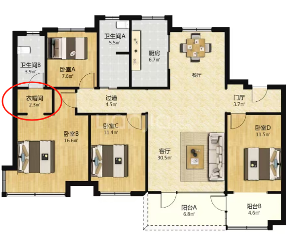

# 看过的

## 注意事项

是否占用户口

是否占用上学名额

槽钢层之类的层分布

### 春来风华  

容积率2.2  一梯两户

4楼 洋房  东户  185万（包含高税）不包则178w  115平（套内95） 毛胚 南侧无遮挡  三室两厅两卫  双阳台  厨房在北边的南北通透  三叶草户型  绿城物业  飞跃大道南边  2024年4月交房

10楼 中间西户（光照度不如4楼） 洋房 189w（包商贷高税）公积金商税约6w 折合195w 116平（96平）毛胚  三室两厅两卫 双阳台 南北通透 三叶草户型

### 万科龙湖紫郡

一梯两户

2019年交付（待定） 8楼 小高（总高18） 精装修  195w （无高税） 三室两厅两卫  客厅是瓷砖 房间是木地板  未住过 鲍山学校书包 万科物业 126.78平（套内待定） 单阳台  距离鲍山站 878m  一梯两户

靠近飞跃大道（噪声因素待确定） 容积率2.2    

###  万科城市之光（南区）

容积率2.5

7号楼 8楼 三室两厅两卫  126平  小高（总高18） 住过人 全屋木地板  双阳台（能穿阻断）客厅也可以穿阻断   前面不太干净  阳台目前半包  万科物业 绿化好  在飞跃大道北边 报价200w  

还有一个195w 但是无法看，跟上面了类似 

8号楼 16楼 小高（总高18） 四室两厅两卫 144平 223w（可以谈到215w） 双阳台  全无木地板  墙面相对干净（只需要部分清理）主卧衣帽间之间有点问题（如下图） 

## 评分标准

房价200w为基准：1w1分

装修（重装）：以20w为基准

楼高： 洋房+10 小高+0

楼层： 最好跟差的差距5分

学校：待定

交通： 2~3

位置：2分

物业：万科+5

流通性：待定

是否住过：未住过+12

容积率：2.2则+1

边户位置：东（+5）>西（+3）>中（0）  

阳台是否双阳台：双阳台+5

其他不利因素：噪音（待定） 龙湖紫郡（+0）和城市之光（+2）春来风华（+4）   产业（待调查）

其他有利因素： 

南北通透类型（边上厨房>北边厨房）+2

是否四室： +10

面积：以90平为基准（套内）

医疗： 待调查

房子年限：5年以内（5+分）

| 小区           |                                                              | 春来风华4楼        | 评分 | 春来风华10楼     | 评分 | 龙湖紫郡8楼         | 评分 | 龙湖城市之光16楼 | 评分 |
| -------------- | ------------------------------------------------------------ | ------------------ | ---- | ---------------- | ---- | ------------------- | ---- | ---------------- | ---- |
| 项目           | 评分标准                                                     |                    |      |                  |      |                     |      |                  |      |
| 房价           | 以 200w 为基准，1w1 分                                       | 185w               | 15   | （价格还没谈过） | 5    |                     | 5    |                  | -15  |
| 装修（重装）   | 以 20w 为基准                                                | 毛胚               | 0    |                  | 0    |                     | 18   |                  | 16   |
| 楼高           | 洋房 + 10，小高 + 0                                          | 洋房               | 10   |                  | 10   |                     | 0    |                  | 0    |
| 楼层           | 最好跟差的差距 5 分                                          | 楼层（采光性较好） | 2    |                  | 5    |                     | 2    |                  | 5    |
| 学校           | 待定                                                         | 历城二中           | 0    |                  | 0    | 鲍山学校            |      |                  | 0    |
| 交通           | 2~3 分                                                       | 待确定             | 0    |                  | 0    |                     | 3    |                  | 0    |
| 位置           | 2 分                                                         | 雪山飞跃大道南边   | 1    |                  | 1    |                     | 2    |                  | 0    |
| 物业           | 万科 + 5                                                     | 绿城物业           | 0    |                  | 0    |                     | 5    |                  | 5    |
| 流通性         | 待定                                                         | 待定               | 0    |                  | 0    |                     |      |                  | 0    |
| 是否住过       | 未住过 + 12                                                  | 未住过             | 12   |                  | 12   |                     | 12   |                  | 0    |
| 容积率         | 2.2 则 + 1                                                   | 容积率2.2          | 1    |                  | 1    |                     | 1    |                  | 0    |
| 边户位置       | 东（+5）> 西（+3）> 中（0）                                  | 东                 | 5    |                  | 0    | 忘记了              | 0    |                  | 0    |
| 阳台是否双阳台 | 双阳台 + 5                                                   | 双阳台             | 5    |                  | 5    |                     | 0    |                  | 5    |
| 其他不利因素   | 噪音（待定），龙湖紫郡（+0），城市之光（+2），春来风华（+4），产业（待调查） | 待确定             | 4    |                  | 4    |                     |      |                  | 2    |
| 其他有利因素   | 南北通透类型（边上厨房 > 北边厨房）+2                        | 北边厨房           | 0    |                  | 0    |                     |      |                  | 2    |
| 是否四室       | 是否四室+10                                                  | 否                 | 0    |                  | 0    |                     |      | 是               | 10   |
| 面积           | 以 90 平为基准（套内，2平1分）                               | 面积               | 2.5  |                  | 3    | 忘记了（按照100算） | 5    |                  | 13.6 |
| 医疗           | 待调查                                                       | 待确定             | 0    |                  | 0    |                     | 0    |                  | 0    |
| 房子年限       | 5 年以内（5 + 分）                                           | 1年                | 5    |                  | 5    |                     | 0    |                  | 2    |
|                |                                                              |                    | 62.5 |                  | 51   |                     | 53   |                  | 45.6 |