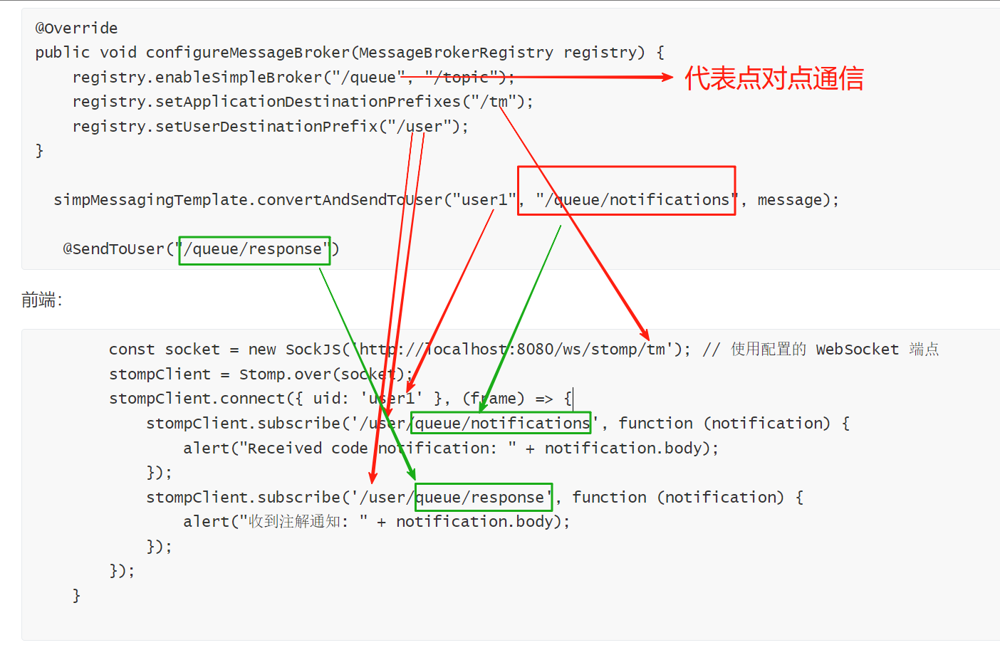

```
@Override
public void configureMessageBroker(MessageBrokerRegistry registry) {
    registry.enableSimpleBroker("/queue", "/topic");
    registry.setApplicationDestinationPrefixes("/tm");
    registry.setUserDestinationPrefix("/user");
}

  simpMessagingTemplate.convertAndSendToUser("user1", "/queue/notifications", message);
  
   @SendToUser("/queue/response")
```

前端：

```
        const socket = new SockJS('http://localhost:8080/ws/stomp/tm'); // 使用配置的 WebSocket 端点
        stompClient = Stomp.over(socket);
        stompClient.connect({ uid: 'user1' }, (frame) => {
            stompClient.subscribe('/user/queue/notifications', function (notification) {
                alert("Received code notification: " + notification.body);
            });
            stompClient.subscribe('/user/queue/response', function (notification) {
                alert("收到注解通知: " + notification.body);
            });
        });
    }

```



需要注意的是uid中的user1就代表着 simpMessagingTemplate.convertAndSendToUser("user1", "/queue/notifications", message);

中的第一个参数

第二个参数/queue/notifications与注册过程中的setUserDestinationPrefix的前缀拼接而成就是前端的订阅。