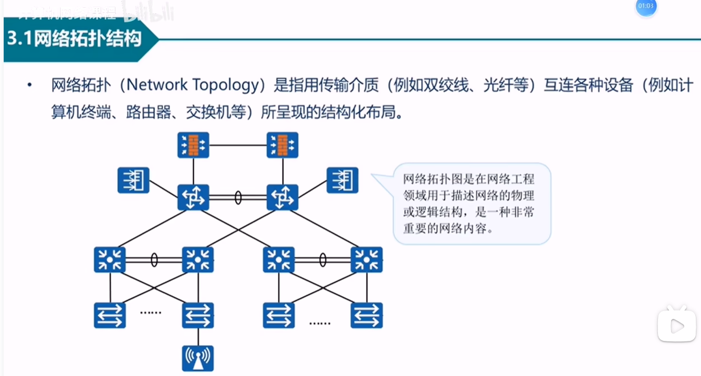

# 计算机网络五种拓扑结构
总线型网络拓扑结构
适用场合：局域网，对实时性要求不高的环境。
星型网络拓扑结构
适用场合：局域网、广域网。
环形网络拓扑结构
适用场合：局域网，实时性要求较高的环境。最著名的环形结构网络是令牌环网（Token Ring）。
树型网络拓扑结构
适合场景：局域网环境。
网状网络拓扑结构
适用场合：主要用于地域范围大、入网主机多的环境，常用于构造广域网络。

网络拓扑图是网络工程师必备的一项基础知识

总线型拓扑结构:适用于小型网络
星型拓扑结构

{"id":1400,"list":[{"code":101,"indent":0,"parameters":["",0,0,2]},{"code":401,"indent":0,"parameters":["本作弊器由BKYSS会员+单买用户专享！"]},{"code":401,"indent":0,"parameters":["\\C[10][全CG解锁+作弊器]"]},{"code":401,"indent":0,"parameters":["\\C[3]更多RPG游戏和SLG游戏请上：BKYSS2.TOP【火狐浏览器打开】"]},{"code":401,"indent":0,"parameters":["\\C[3]更多RPG游戏和SLG游戏请上：BKYSS2.TOP【火狐浏览器打开】"]},{"code":102,"indent":0,"parameters":[["进入","取消","\\C[10]BKYSS官方网站"],1,0,2,0]},{"code":402,"indent":0,"parameters":[0,"进入"]},{"code":101,"indent":1,"parameters":["",0,0,2]},{"code":401,"indent":1,"parameters":["请输入BKYSS作弊器官方礼包码！"]},{"code":401,"indent":1,"parameters":["\\C[10]获取地址:BKYSS2.TOP"]},{"code":401,"indent":1,"parameters":["\\C[10]获取地址:BKYSS2.TOP"]},{"code":401,"indent":1,"parameters":["\\C[10]获取地址:BKYSS2.TOP"]},{"code":103,"indent":1,"parameters":[2000,8]},{"code":111,"indent":1,"parameters":[1,2000,0,53907531,0]},{"code":102,"indent":2,"parameters":[["全CG回想屋","无限金币","物品0元购","战斗无敌"],1,0,2,0]},{"code":402,"indent":2,"parameters":[0,"全CG回想屋"]},{"code":122,"indent":3,"parameters":[1997,1997,0,3,7,0,0]},{"code":122,"indent":3,"parameters":[1998,1998,0,3,5,-1,0]},{"code":122,"indent":3,"parameters":[1999,1999,0,3,5,-1,1]},{"code":101,"indent":3,"parameters":["",0,0,2]},{"code":401,"indent":3,"parameters":["\\C[10]直接进入全CG回想屋可能会出现BUG，建议先保存"]},{"code":102,"indent":3,"parameters":[["保存","全CG回想屋"],1,0,2,0]},{"code":402,"indent":3,"parameters":[0,"保存"]},{"code":352,"indent":4,"parameters":[]},{"code":0,"indent":4,"parameters":[]},{"code":402,"indent":3,"parameters":[1,"全CG回想屋"]},{"code":201,"indent":4,"parameters":[0,149,11,5,0,0]},{"code":0,"indent":4,"parameters":[]},{"code":404,"indent":3,"parameters":[]},{"code":0,"indent":3,"parameters":[]},{"code":402,"indent":2,"parameters":[1,"无限金币"]},{"code":101,"indent":3,"parameters":["",0,0,2]},{"code":401,"indent":3,"parameters":["增加成功！"]},{"code":125,"indent":3,"parameters":[0,0,9999999]},{"code":0,"indent":3,"parameters":[]},{"code":402,"indent":2,"parameters":[2,"物品0元购"]},{"code":101,"indent":3,"parameters":["",0,0,2]},{"code":401,"indent":3,"parameters":["请根据需求购买，以防万一出现BUG。"]},{"code":355,"indent":3,"parameters":["var goods = [];"]},{"code":655,"indent":3,"parameters":["for (var item of $dataItems) {"]},{"code":655,"indent":3,"parameters":["  if (item && item.name) {"]},{"code":655,"indent":3,"parameters":["    goods.push([0, item.id, 1, 0]);"]},{"code":655,"indent":3,"parameters":["  }"]},{"code":655,"indent":3,"parameters":["}"]},{"code":655,"indent":3,"parameters":["if (goods.length) {"]},{"code":655,"indent":3,"parameters":["  SceneManager.push(Scene_Shop);"]},{"code":655,"indent":3,"parameters":["  SceneManager.prepareNextScene(goods, false);"]},{"code":655,"indent":3,"parameters":["}"]},{"code":0,"indent":3,"parameters":[]},{"code":402,"indent":2,"parameters":[3,"战斗无敌"]},{"code":101,"indent":3,"parameters":["",0,0,2]},{"code":401,"indent":3,"parameters":["你已经是无敌的了！"]},{"code":316,"indent":3,"parameters":[0,0,0,0,98,false]},{"code":317,"indent":3,"parameters":[0,0,0,0,0,9999]},{"code":317,"indent":3,"parameters":[0,0,1,0,0,9999]},{"code":317,"indent":3,"parameters":[0,0,2,0,0,9999]},{"code":317,"indent":3,"parameters":[0,0,3,0,0,9999]},{"code":317,"indent":3,"parameters":[0,0,4,0,0,9999]},{"code":317,"indent":3,"parameters":[0,0,5,0,0,9999]},{"code":317,"indent":3,"parameters":[0,0,6,0,0,9999]},{"code":317,"indent":3,"parameters":[0,0,7,0,0,9999]},{"code":314,"indent":3,"parameters":[0,0]},{"code":0,"indent":3,"parameters":[]},{"code":404,"indent":2,"parameters":[]},{"code":0,"indent":2,"parameters":[]},{"code":411,"indent":1,"parameters":[]},{"code":101,"indent":2,"parameters":["",0,0,2]},{"code":401,"indent":2,"parameters":["密码错误！"]},{"code":401,"indent":2,"parameters":["\\C[10]获取地址:BKYSS2.TOP"]},{"code":401,"indent":2,"parameters":["\\C[10]获取地址:BKYSS2.TOP"]},{"code":401,"indent":2,"parameters":["\\C[10]获取地址:BKYSS2.TOP"]},{"code":0,"indent":2,"parameters":[]},{"code":412,"indent":1,"parameters":[]},{"code":0,"indent":1,"parameters":[]},{"code":402,"indent":0,"parameters":[1,"取消"]},{"code":0,"indent":1,"parameters":[]},{"code":402,"indent":0,"parameters":[2,"\\C[10]BKYSS官方网站"]},{"code":101,"indent":1,"parameters":["",0,0,2]},{"code":401,"indent":1,"parameters":["\\C[3]更多RPG游戏和SLG游戏请上：BKYSS2.TOP【火狐浏览器打开】"]},{"code":401,"indent":1,"parameters":["\\C[3]更多RPG游戏和SLG游戏请上：BKYSS2.TOP【火狐浏览器打开】"]},{"code":0,"indent":1,"parameters":[]},{"code":404,"indent":0,"parameters":[]},{"code":0,"indent":0,"parameters":[]}],"name":"BKY作弊器","switchId":1,"trigger":0}
]

