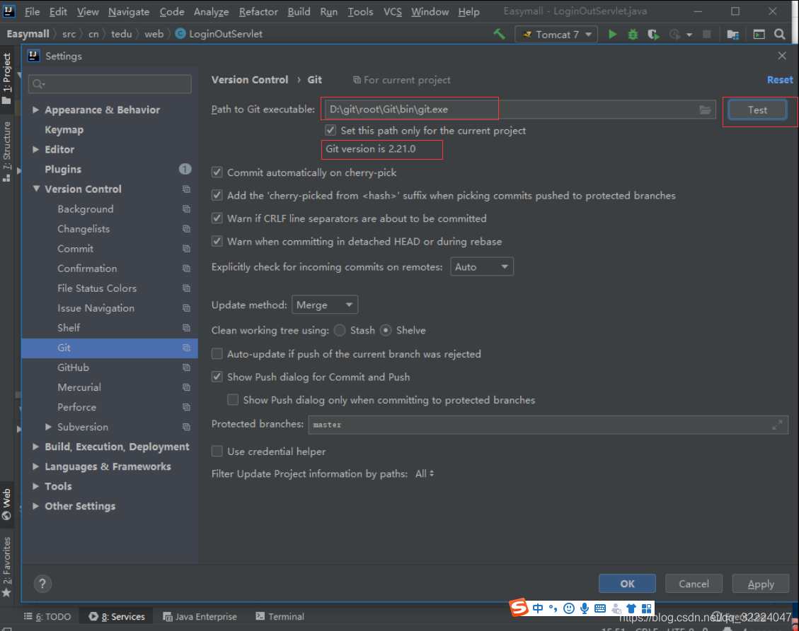
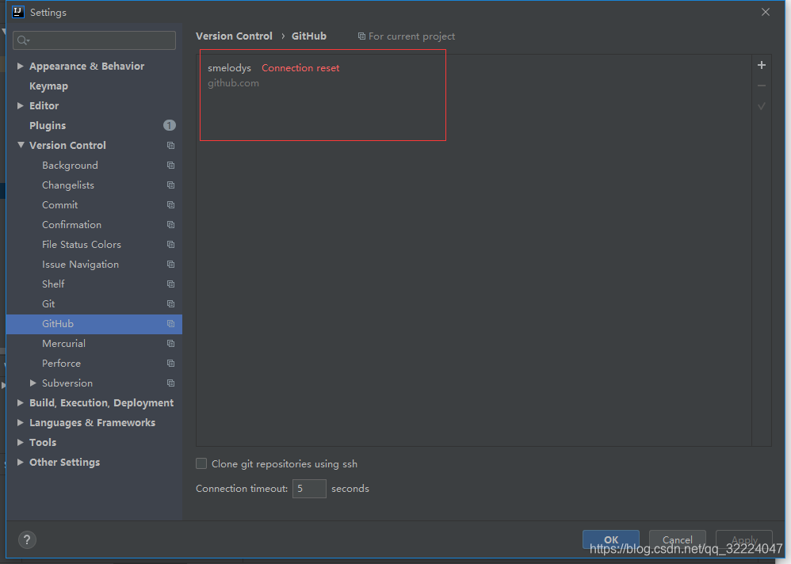
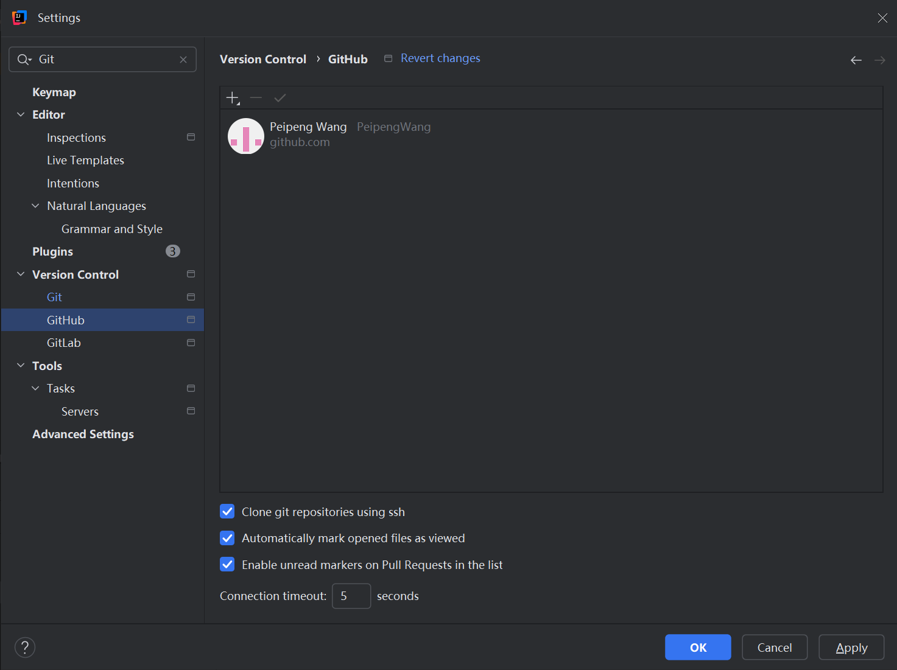
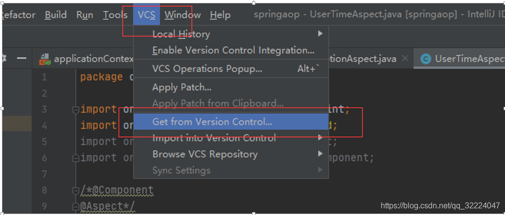
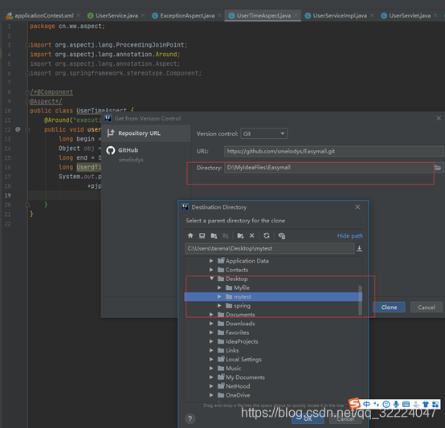
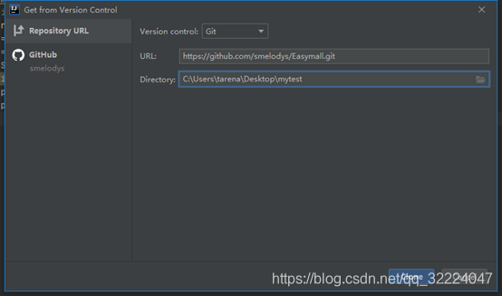
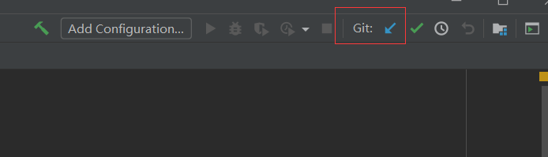

### 在git bash 中通过命令 配置全局邮箱和用户名

> ```html
> //配置邮箱
> git config --global user.email "wangpeipeng123@163.com"
> //配置全局用户名
> git config --global user.name "PeipengWang"
> ```

### 查看已经配置的用户名和邮箱

> //查看已经配置的全局用户名
>
> git config user.name
>
> //查看已经配置的全局邮箱
>
> $ git config user.email

### 配置idea

#### 在IDEA中设置Git

在File-->Setting->Version Control-->Git-->Path to Git executable选择你的git安装后的git.exe文件，然后点击Test，测试是否设置成功，可以查看到git版本，apply --ok 即可



#### 在IDEA中设置GitHub

   File-->Setting->Version Control-->GibHub

　　Host：github.com

　　Token：点击Create API Token，输入在github中注册的用户名和密码生成token

　　点击Test，测试是否连接成功，成功会显示如下,可以看到自己的头像，昵称等






### 项目导入

#### 选择VCS---Get from Version Control...



#### 进入后输入远程仓库的地址，选择项目需要导入的路径



#### 选择完毕后点击Clone按钮即可



### 项目修改提交到本地仓库

#### 更新

***项目在提交前一定先更新一下本地文件，防止发生冲突\***

点击右上角更新按钮



在弹出框选择Merge in... 然后点击OK(这里的选择根据需要自行选择，非强制)

