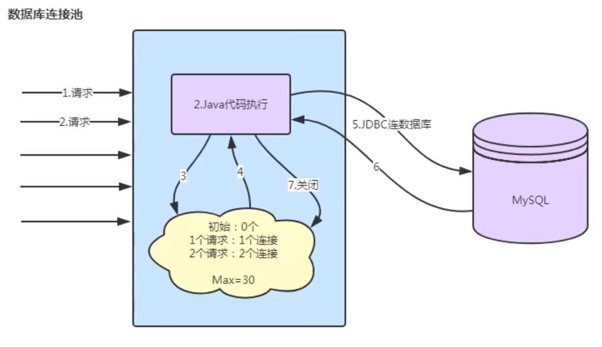

# 手写数据库连接池
数据库连接是一种昂贵的资源，创建数据库连接是一个耗时的操作，在多线程并发条件下尤为突出，对数据库连接的高效管理能影响到程序的性能指标，数据库连接池正是针对这个问题提出 来的。数据库连接池负责分配、管理和释放数据库连接，它允许应用程序重复使用一个现有的数据库连接，而不是再重新建立一个新连接，利用数据库连接池将明显提高对数据库操作的性能 ；本课程带你如何优雅设计与手写实现一个自己的数据库连接池；

有很多的技术解决方案：  
3P0  
DBCP  
Proxool  
Tomcat JDBC Pool  
BoneCP  
Druid  
HikariCP  
很多领域也有池化技术：http访问，redis连接池、线程池等  

