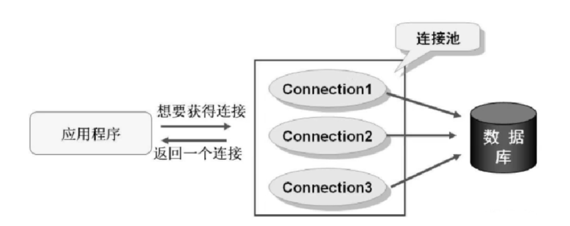

# 数据库连接池

## 概念与规范
每次需要连接的时候从集合中取即可，用完之后归还即可  

java为连接池提供了一个公共接口javax.sql.DataSource，各个厂商需要让自己的连接实现这个接口。这样方便应用程序可以方便的切换不同厂商的连接池。  
## 需求分析
1、实现DataSource接口，重写getConnection方法。  
2、定义一个list，用来添加移除Connection  
3、初始化连接池n个  
4、如果需要则从list中获取连接，为了保证一个连接只能由一个线程使用，则需要移除连接  
5、当前用户执行完成，不close，而是归还的list。  
