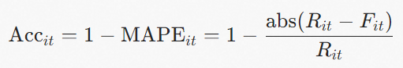
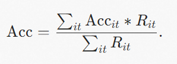

本文以**ETDataset电力变压器数据集**为例，介绍如何使用历史协变量提高时序预测的准确性。

## 背景信息

时序数据中的协变量可以分为以下三种：

-   未来协变量 ：指在预测时已知的未来量测值，例如天气预报。
-   历史协变量 ：指历史中采集到的量测值，例如测量的温度、湿度。
-   静态协变量 ：指不随时间变化的数据源特征值（即TAG），例如传感器设备的ID。

通常情况下，提供除**预测目标变量**以外的信息作为辅助信息，有助于提高时序预测的准确性。

## 前提条件

-   时序引擎为3.4.26及以上版本。如何查看或升级当前版本，请参见[时序引擎版本说明](https://help.aliyun.com/zh/lindorm/product-overview/release-notes-of-lindormtsdb#concept-2119016)和[升级小版本](https://help.aliyun.com/zh/lindorm/user-guide/upgrade-the-minor-engine-version-of-an-apsaradb-for-lindorm-instance#concept-2557610)。
-   已通过Lindorm-cli连接时序引擎。具体操作，请参见[通过Lindorm-cli连接并使用Lindorm时序引擎](https://help.aliyun.com/zh/lindorm/user-guide/connect-through-lindorm-cli#18fe127063p5b)。

## 示例数据集

变压器的油温可以有效反映电力变压器的工作情况。因此，预测变压器的油温并根据预测结果制定维护策略可以有效保障变压器的安全运行，有助于延长变压器的使用寿命，避免不必要的浪费。

电力变压器数据集ETDataset常用于长时间序列相关的研究。目前已开源的部分含有2个电力变压器的数据，包括负载和油温，时间范围为2016年7月至2018年7月。本文示例采用小时级别粒度表，每个数据点均包含记录日期、变压器ID、预测值“油温”以及6个不同类型的外部负载值特征。

数据集以CSV格式存储，第一行为数据头，包括高有效负载（HUFL）、高无效负载（HULL）、中有效负载（MUFL）、中无效负载（MULL）、低有效负载（LUFL）、低无效负载（LULL）、油温（OT）和变压器ID（transformers\_id）。示例数据如下：

| date                      | HUFL        | HULL        | MUFL        | MULL        | LUFL        | LULL        | OT          | transformers\\_id |
| ------------------------- | ----------- | ----------- | ----------- | ----------- | ----------- | ----------- | ----------- | ----------------- |
| 2018-05-25T00:00:00+08:00 | 15.80700016 | 6.09499979  | 10.80300045 | 4.19299984  | 4.538000107 | 1.309999943 | 8.722999573 | ETTh1             |
| 2018-05-25T01:00:00+08:00 | 15.47200012 | 6.631000042 | 11.47799969 | 4.014999866 | 4.507999897 | 1.491999984 | 8.512000084 | ETTh1             |
| 2018-05-25T02:00:00+08:00 | 15.8739996  | 15.8739996  | 11.15799999 | 3.872999907 | 4.416999817 | 1.401000023 | 8.652999878 | ETTh1             |
| 2018-05-25T03:00:00+08:00 | 16.1420002  | 6.429999828 | 11.54899979 | 4.477000237 | 4.355999947 | 1.340000033 | 7.737999916 | ETTh1             |

## 准备工作

创建表etth并导入示例数据集中的数据。

```
CREATE TABLE `etth` (
  `transformers_id` VARCHAR TAG,
  `date` TIMESTAMP,
  `OT` double,
  `HUFL` DOUBLE,
  `HULL` DOUBLE,
  `LUFL` DOUBLE,
  `LULL` DOUBLE,
  `MUFL` DOUBLE,
  `MULL` DOUBLE,
  PRIMARY KEY (`transformers_id`));
```

## 时序预测

### 模型训练

创建指定历史协变量的模型和未指定历史协变量的对照模型。

1.  创建模型`etth_tft_historical`并通过feat\_dynamic\_historical\_columns参数指定历史协变量为HUFL、HULL、MUFL、MULL、LUFL和LULL。
    
    ```
    CREATE MODEL etth_tft_historical
    FROM (select * from etth where `date`<'2018-05-26T00:00:00+08:00')
    TARGET OT
    TASK time_series_forecast
    ALGORITHM tft
    SETTINGS
    (
      time_column 'date',
      group_columns 'transformers_id',
      feat_dynamic_historical_columns 'HUFL,HULL,MUFL,MULL,LUFL,LULL',
      context_length '96',
      prediction_length '24',
      epochs '5',
      freq '1h'
    );
    ```
    
2.  创建对照模型`etth_tft`，不指定历史协变量。
    
    ```
    CREATE MODEL etth_tft
    FROM (select * from etth where `date`<'2018-05-26T00:00:00+08:00')
    TARGET OT
    TASK time_series_forecast
    ALGORITHM tft
    SETTINGS
    (
      time_column 'date',
      group_columns 'transformers_id',
      context_length '96',
      prediction_length '24',
      epochs '5',
      freq '1h'
    );
    ```
    

### 模型推理

分别使用模型`etth_tft_historical`和对照模型`etth_tft`进行模型推理。

1.  使用`etth_tft_historical`模型对etth表中指定变压器在指定时间范围内的油温进行模型推理。
    
    ```
     SELECT `date` AS `time`, transformers_id, forecast(OT, 'etth_tft_historical') AS OT_PRED FROM etth WHERE
    `date`>='2018-05-26T00:00:00+08:00' and transformers_id='ETTh2' SAMPLE BY 0;
    ```
    
    返回结果如下：
    
    ```
    +---------------------------+-----------------+--------------------+
    |           time            | transformers_id |       OT_PRED      |
    +---------------------------+-----------------+--------------------+
    | 2018-05-26T00:00:00+08:00 | ETTh2           | 26.496824264526367 |
    | 2018-05-26T01:00:00+08:00 | ETTh2           | 26.43282699584961  |
    | 2018-05-26T02:00:00+08:00 | ETTh2           | 26.340181350708008 |
    | 2018-05-26T03:00:00+08:00 | ETTh2           | 26.323070526123047 |
    | 2018-05-26T04:00:00+08:00 | ETTh2           | 26.380788803100586 |
    | 2018-05-26T05:00:00+08:00 | ETTh2           | 26.50444221496582  |
    | 2018-05-26T06:00:00+08:00 | ETTh2           | 26.69524383544922  |
    | 2018-05-26T07:00:00+08:00 | ETTh2           | 26.969533920288086 |
    | 2018-05-26T08:00:00+08:00 | ETTh2           | 27.36551284790039  |
    |                             ...........                          |
    | 2018-05-26T23:00:00+08:00 | ETTh2           | 29.57206153869629  |
    +---------------------------+-----------------+--------------------+
    ```
    
2.  使用`etth_tft`模型对同一变压器在同一时间范围内（上文`etth_tft_historical`模型推理时指定的变压器和时间范围）的油温进行模型推理。
    
    ```
    SELECT `date` AS `time`, transformers_id, forecast(OT, 'etth_tft') AS OT_PRED FROM etth WHERE
    `date`>='2018-05-26T00:00:00+08:00' and transformers_id='ETTh2' SAMPLE BY 0;
    ```
    
    返回结果如下：
    
    ```
    +---------------------------+-----------------+--------------------+
    |           time            | transformers_id |       OT_PRED      |
    +---------------------------+-----------------+--------------------+
    | 2018-05-26T00:00:00+08:00 | ETTh2           | 23.885906219482422 |
    | 2018-05-26T01:00:00+08:00 | ETTh2           | 23.847227096557617 |
    | 2018-05-26T02:00:00+08:00 | ETTh2           | 24.067214965820312 |
    | 2018-05-26T03:00:00+08:00 | ETTh2           | 24.487728118896484 |
    | 2018-05-26T04:00:00+08:00 | ETTh2           | 25.00792121887207  |
    | 2018-05-26T05:00:00+08:00 | ETTh2           | 25.532398223876953 |
    | 2018-05-26T06:00:00+08:00 | ETTh2           | 26.014699935913086 |
    | 2018-05-26T07:00:00+08:00 | ETTh2           | 26.46392059326172  |
    | 2018-05-26T08:00:00+08:00 | ETTh2           | 26.93277359008789  |
    |                             ...........                          |
    | 2018-05-26T23:00:00+08:00 | ETTh2           | 32.09087371826172  |
    +---------------------------+-----------------+--------------------+
    ```
    

## 准确率计算

变压器油温预测场景涉及到多条时间线同时预测，通常以汇总的1-wMAPE准确率衡量算法的综合准确率。假设变压器i在t天的真实油温是Rit，预测值是Fit，那么每台变压器每天的1-MAPE准确率为：

以真实值Rit为权重加权平均计算总体准确率，汇总到各个维度计算出1-wMAPE准确率为：

在预测结果中，使用`etth_tft_historical`模型的1-wMAPE准确率为94.4%，使用`etth_tft`模型的1-wMAPE准确率为90.5%，说明使用历史协变量的情况下时序预测的准确性得到了提升。