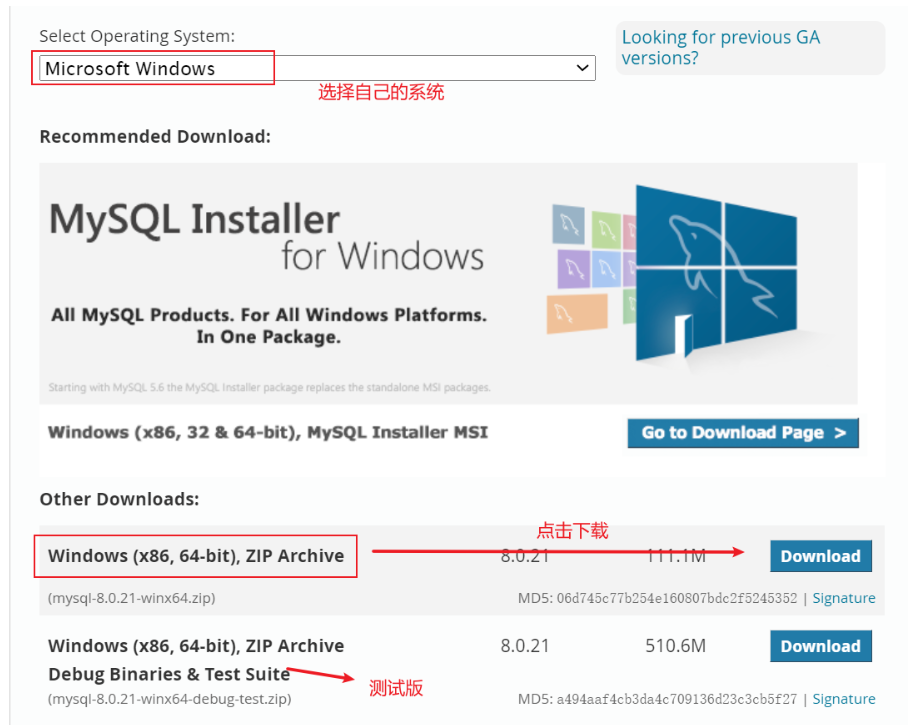

　**官网地址：https://www.mysql.com/**

　　**安装建议**：尽量不要用.exe进行安装，用压缩包安装，对日后的卸载更为方便

　　**下载地址**：https://dev.mysql.com/downloads/mysql/

1、下载得到zip压缩包



 2、解压到要安装的目录

　　我这里是：D:\Program File\MySQL\mysql-8.0.21-winx64，增加了data目录


3、添加环境变量

　　我的电脑–>属性–>高级–>环境变量

　　选择path添加：mysql安装目录下的bin文件夹地址：D:\Program File\MySQL\mysql-8.0.21-winx64\bin

　　这种方式就无需加%MySQL_HOME%的变量


4、新建mysql 配置文件

　　在你的mysql安装目录下，新建**my.ini**文件，编辑 **my.ini**文件，注意**替换路径位置**

```
[mysqld]
basedir=D:\Program File\MySQL\mysql-8.0.21-winx64\
datadir=D:\Program File\MySQL\mysql-8.0.21-winx64\data\
port=3306
```

　　上面新加的data目录

5、安装mysql服务

　　启动**管理员模式**下的cmd，并将路径切换至mysql安装目录下的bin目录，输入以下命令

```
cd \d D:\Program File\MySQL\mysql-8.0.21-winx64\bin
mysqld -install
```

　　注意一定要是管理员模式才行

6、初始化数据文件

　　输入以下命令：`mysqld --initialize-insecure --user=mysql`

7、启动mysql：`net start mysql`

8、进入mysql管理界面修改密码（第一次输入密码回车即可）

　　输入以下第一条命令进入管理界面（p后面没有空格！！）

　　在输入第二条命令修改密码（最后一定要有分号）

```
mysql -u root -p    #让你输入密码时直接回车即可
ALTER USER 'root'@'localhost' IDENTIFIED WITH mysql_native_password BY '你的密码';
```

　　注意第2条命令一定得有分号。出现如下结果即成功


9、重启mysql即可正常使用

[](javascript:void(0);)

```
#退出mysql管理界面
exit
#停止mysql服务
net stop mysql
#开始mysql服务
net start mysql
```