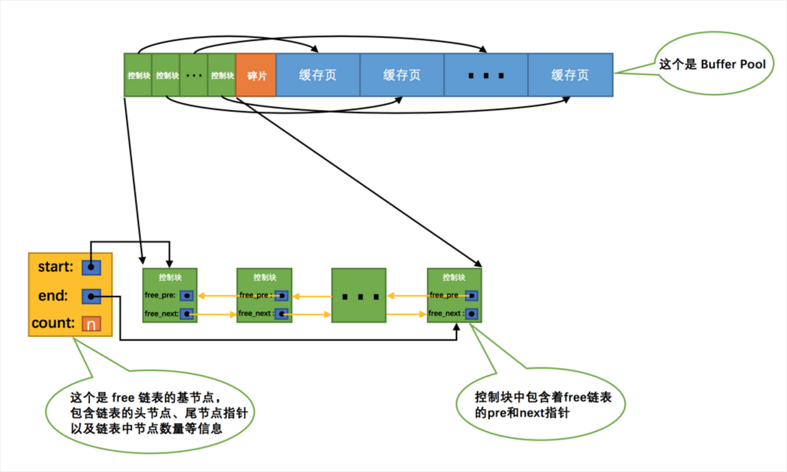

# Mysql的BufferPool

Mysql是一个存储数据到磁盘的进程，但是磁盘的速度难以与CPU相比，所以InnoDB存储引擎在处理客户端的请求时，当需要访问某个页的数据时，就会把完整的页的数据全部加载到内存中。将整个页加载到内存中后就可以进行读写访问了，在进行完读写访问之后并不着急把该页对应的内存空间释放掉，而是将其缓存起来，这样将来有请求再次访问该页面时，就可以省去磁盘IO的开销了。  
设计InnoDB的大佬为了缓存磁盘中的页，在MySQL服务器启动的时候就向操作系统申请了一片连续的内存，他们给这片内存起了个名，叫做Buffer Pool（中文名是缓冲池）  
可以用如下参数设置大小：  
```
[server]
innodb_buffer_pool_size = 268435456
```
其中，268435456的单位是字节，也就是我指定Buffer Pool的大小为256M。需要注意的是，Buffer Pool也不能太小，最小值为5M(当小于该值时会自动设置成5M)。  
## BufferPool的内部组成  
Buffer Pool中默认的缓存页大小和在磁盘上默认的页大小是一样的，都是16KB。为了更好的管理这些在Buffer Pool中的缓存页，设计InnoDB的大佬为每一个缓存页都创建了一些所谓的控制信息，这些控制信息包括该页所属的表空间编号、页号、缓存页在Buffer Pool中的地址、链表节点信息、一些锁信息以及LSN信息（锁和LSN我们之后会具体介绍，现在可以先忽略），当然还有一些别的控制信息  
每个缓存页对应的控制信息占用的内存大小是相同的，我们就把每个页对应的控制信息占用的一块内存称为一个控制块吧，控制块和缓存页是一一对应的，它们都被存放到 Buffer Pool 中，其中控制块被存放到 Buffer Pool 的前面，缓存页被存放到 Buffer Pool 后边，所以整个Buffer Pool对应的内存空间看起来就是这样的：  


## free链表的管理
当我们最初启动MySQL服务器的时候，需要完成对Buffer Pool的初始化过程，就是先向操作系统申请Buffer Pool的内存空间，然后把它划分成若干对控制块和缓存页。   
那么问题来了，从磁盘上读取一个页到Buffer Pool中的时候该放到哪个缓存页的位置呢？或者说怎么区分Buffer Pool中哪些缓存页是空闲的，哪些已经被使用了呢？我们最好在某个地方记录一下Buffer Pool中哪些缓存页是可用的，这个时候缓存页对应的控制块就派上大用场了，我们可以把所有空闲的缓存页对应的控制块作为一个节点放到一个链表中，这个链表也可以被称作free链表（或者说空闲链表）。刚刚完成初始化的Buffer Pool中所有的缓存页都是空闲的，所以每一个缓存页对应的控制块都会被加入到free链表中，假设该Buffer Pool中可容纳的缓存页数量为n，那增加了free链表的效果图就是这样的：  


每当需要从磁盘中加载一个页到Buffer Pool中时，就从free链表中取一个空闲的缓存页，并且把该缓存页对应的控制块的信息填上（就是该页所在的表空间、页号之类的信息），然后把该缓存页对应的free链表节点从链表中移除，表示该缓存页已经被使用了～  
## 缓存页的哈希处理  
当我们需要访问某个页中的数据时，就会把该页从磁盘加载到Buffer Pool中，如果该页已经在Buffer Pool中的话直接使用就可以了。那么问题也就来了，我们怎么知道该页在不在Buffer Pool中呢？难不成需要依次遍历Buffer Pool中各个缓存页么？  
，我们其实是根据表空间号 + 页号来定位一个页的，也就相当于表空间号 + 页号是一个key，缓存页就是对应的value，怎么通过一个key来快速找着一个value呢？ 所以我们可以用表空间号 + 页号作为key，缓存页作为value创建一个哈希表，在需要访问某个页的数据时，先从哈希表中根据表空间号 + 页号看看有没有对应的缓存页，如果有，直接使用该缓存页就好，如果没有，那就从free链表中选一个空闲的缓存页，然后把磁盘中对应的页加载到该缓存页的位置。  
## flush链表的管理  
如果我们修改了Buffer Pool中某个缓存页的数据，那它就和磁盘上的页不一致了，这样的缓存页也被称为脏页（英文名：dirty page）。  
最简单的做法就是每发生一次修改就立即同步到磁盘上对应的页上，但是频繁的往磁盘中写数据会严重的影响程序的性能（毕竟磁盘慢的像乌龟一样）。所以每次修改缓存页后，我们并不着急立即把修改同步到磁盘上，而是在未来的某个时间点进行同步。  
但是如果不立即同步到磁盘的话，那之后再同步的时候我们怎么知道Buffer Pool中哪些页是脏页，哪些页从来没被修改过呢？总不能把所有的缓存页都同步到磁盘上吧，假如Buffer Pool被设置的很大，比方说300G，那一次性同步这么多数据岂不是要慢死！所以，我们不得不再创建一个存储脏页的链表，凡是修改过的缓存页对应的控制块都会作为一个节点加入到一个链表中，因为这个链表节点对应的缓存页都是需要被刷新到磁盘上的，所以也叫flush链表。链表的构造和free链表差不多，  


## LRU链表的管理
### 缓存不够的窘境
如果free链表都被占满了的情况怎么办？  
可以采用最近最少使用的原则去淘汰缓存页（LRU）。  
* 如果该页不在Buffer Pool中，在把该页从磁盘加载到Buffer Pool中的缓存页时，就把该缓存页对应的控制块作为节点塞到链表的头部。   
* 如果该页已经缓存在Buffer Pool中，则直接把该页对应的控制块移动到LRU链表的头部。   
也就是说：只要我们使用到某个缓存页，就把该缓存页调整到LRU链表的头部，这样LRU链表尾部就是最近最少使用的缓存页喽～ 所以当Buffer Pool中的空闲缓存页使用完时，到LRU链表的尾部找些缓存页淘汰就OK啦。  
### 划分区域的LRU链表
下面两种情况很容易触发空间占满的情形：  
* 情况一：InnoDB提供了一个看起来比较贴心的服务——预读  
* 情况二：有的小伙伴可能会写一些需要扫描全表的查询语句（比如没有建立合适的索引或者压根儿没有WHERE子句的查询）。  
这两种情况会产生如下两种问题  
* 加载到Buffer Pool中的页不一定被用到。  
* 如果非常多的使用频率偏低的页被同时加载到Buffer Pool时，可能会把那些使用频率非常高的页从Buffer Pool中淘汰掉。  
总体而言会大大降低了缓存命中率。  
因为有这两种情况的存在，所以设计InnoDB的大佬把这个LRU链表按照一定比例分成两截，分别是：  
* 一部分存储使用频率非常高的缓存页，所以这一部分链表也叫做热数据，或者称young区域。  
* 另一部分存储使用频率不是很高的缓存页，所以这一部分链表也叫做冷数据，或者称old区域。  
们可以通过查看系统变量innodb_old_blocks_pct的值来确定old区域在LRU链表中所占的比例  
```
SHOW VARIABLES LIKE 'innodb_old_blocks_pct';
+-----------------------+-------+
| Variable_name         | Value |
+-----------------------+-------+
| innodb_old_blocks_pct | 37    |
+-----------------------+-------+
1 row in set (0.01 sec)
```
 从结果可以看出来，默认情况下，old区域在LRU链表中所占的比例是37%，也就是说old区域大约占LRU链表的3/8。这个比例我们是可以设置的，我们可以在启动时修改innodb_old_blocks_pct参数来控制old区域在LRU链表中所占的比例，比方说这样修改配置文件：  
```
 [server]
innodb_old_blocks_pct = 40
```
或者修改  
```
SET GLOBAL innodb_old_blocks_pct = 40;
```
* 针对预读的页面可能不进行后续访情况的优化  
设计InnoDB的大佬规定，当磁盘上的某个页面在初次加载到Buffer Pool中的某个缓存页时，该缓存页对应的控制块会被放到old区域的头部。这样针对预读到Buffer Pool却不进行后续访问的页面就会被逐渐从old区域逐出，而不会影响young区域中被使用比较频繁的缓存页。  
* 针对全表扫描时，短时间内访问大量使用频率非常低的页面情况的优化
在对某个处在old区域的缓存页进行第一次访问时就在它对应的控制块中记录下来这个访问时间，如果后续的访问时间与第一次访问的时间在某个时间间隔内，那么该页面就不会被从old区域移动到young区域的头部，否则将它移动到young区域的头部。上述的这个间隔时间是由系统变量 innodb_old_blocks_time控制的，你看：
```
mysql> SHOW VARIABLES LIKE 'innodb_old_blocks_time';
+------------------------+-------+
| Variable_name          | Value |
+------------------------+-------+
| innodb_old_blocks_time | 1000  |
+------------------------+-------+
1 row in set (0.01 sec)
```
## 刷新脏页到磁盘  
后台有专门的线程每隔一段时间负责把脏页刷新到磁盘，这样可以不影响用户线程处理正常的请求。主要有两种刷新路径：  
从LRU链表的冷数据中刷新一部分页面到磁盘。  
  后台线程会定时从LRU链表尾部开始扫描一些页面，扫描的页面数量可以通过系统变量innodb_lru_scan_depth来指定，如果从里边儿发现脏页，会把它们刷新到磁盘。这种刷新页面的方式被称之为BUF_FLUSH_LRU。  
从flush链表中刷新一部分页面到磁盘。  
      后台线程也会定时从flush链表中刷新一部分页面到磁盘，刷新的速率取决于当时系统是不是很繁忙。这种刷新页面的方式被称之为 
 BUF_FLUSH_LIST。  
 这里还需要看redolog来补充  
 https://time.geekbang.org/column/article/68633  
 https://relph1119.github.io/mysql-learning-notes/#/mysql/20-%E8%AF%B4%E8%BF%87%E7%9A%84%E8%AF%9D%E5%B0%B1%E4%B8%80%E5%AE%9A%E8%A6%81%E5%8A%9E%E5%88%B0-redo%E6%97%A5%E5%BF%97%EF%BC%88%E4%B8%8A%EF%BC%89  
## 多个Buffer Pool实例  
Buffer Pool本质是InnoDB向操作系统申请的一块连续的内存空间，在多线程环境下，访问Buffer Pool中的各种链表都需要加锁处理什么的，在Buffer Pool特别大而且多线程并发访问特别高的情况下，单一的Buffer Pool可能会影响请求的处理速度。所以在Buffer Pool特别大的时候，我们可以把它们拆分成若干个小的Buffer Pool，每个Buffer Pool都称为一个实例，它们都是独立的，独立的去申请内存空间，独立的管理各种链表，独立的等等，所以在多线程并发访问时并不会相互影响，从而提高并发处理能力。我们可以在服务器启动的时候通过设置innodb_buffer_pool_instances的值来修改Buffer Pool实例的个数，比方说这样：  
```
[server]
innodb_buffer_pool_instances = 2
```


## 总结
1. 磁盘太慢，用内存作为缓存很有必要。  
2.  Buffer Pool本质上是InnoDB向操作系统申请的一段连续的内存空间，可以通过innodb_buffer_pool_size来调整它的大小。  
3. Buffer Pool向操作系统申请的连续内存由控制块和缓存页组成，每个控制块和缓存页都是一一对应的，在填充足够多的控制块和缓存页的组合后，Buffer Pool剩余的空间可能产生不够填充一组控制块和缓存页，这部分空间不能被使用，也被称为碎片。  
4. InnoDB使用了许多链表来管理Buffer Pool。  
5. free链表中每一个节点都代表一个空闲的缓存页，在将磁盘中的页加载到Buffer Pool时，会从free链表中寻找空闲的缓存页。  
6. 为了快速定位某个页是否被加载到Buffer Pool，使用表空间号 + 页号作为key，缓存页作为value，建立哈希表。  
7. 在Buffer Pool中被修改的页称为脏页，脏页并不是立即刷新，而是被加入到flush链表中，待之后的某个时刻同步到磁盘上。  
8. LRU链表分为young和old两个区域，可以通过innodb_old_blocks_pct来调节old区域所占的比例。首次从磁盘上加载到Buffer Pool的页会被放到old区域的头部，在innodb_old_blocks_time间隔时间内访问该页不会把它移动到young区域头部。在Buffer Pool没有可用的空闲缓存页时，会首先淘汰掉old区域的一些页。  
9. 我们可以通过指定innodb_buffer_pool_instances来控制Buffer Pool实例的个数，每个Buffer Pool实例中都有各自独立的链表，互不干扰。  
10. 自MySQL 5.7.5版本之后，可以在服务器运行过程中调整Buffer Pool大小。每个Buffer Pool实例由若干个chunk组成，每个chunk的大小可以在服务器启动时通过启动参数调整。  
11. 可以用下面的命令查看Buffer Pool的状态信息：  
```
SHOW ENGINE INNODB STATUS\G
```


参考：
[InnoDB的Buffer Pool](https://relph1119.github.io/mysql-learning-notes/#/mysql/18-调节磁盘和CPU的矛盾-InnoDB的Buffer%20Pool)

