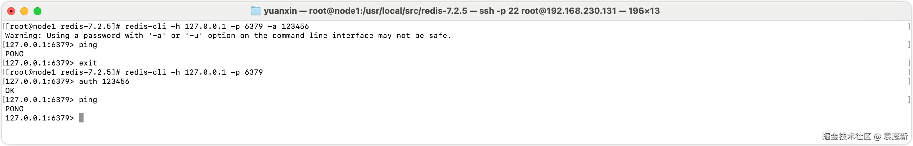
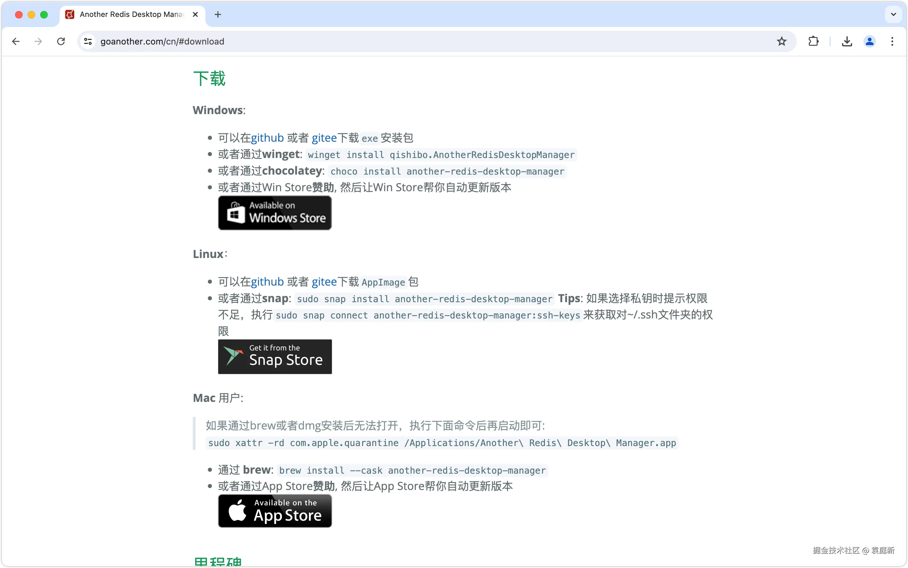
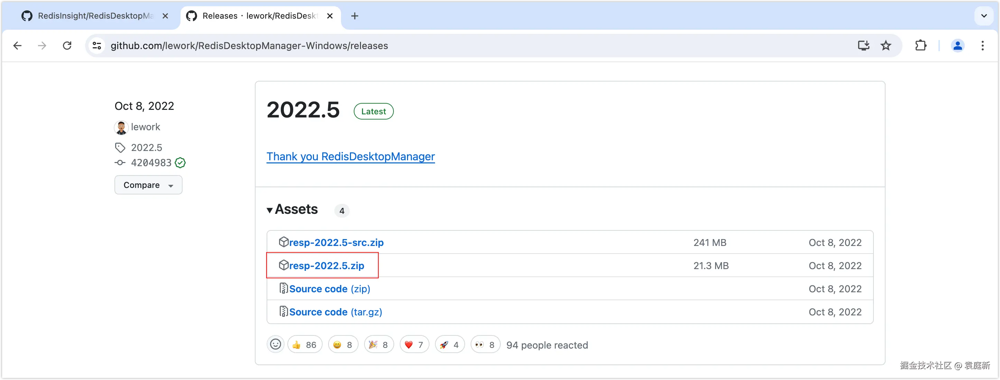
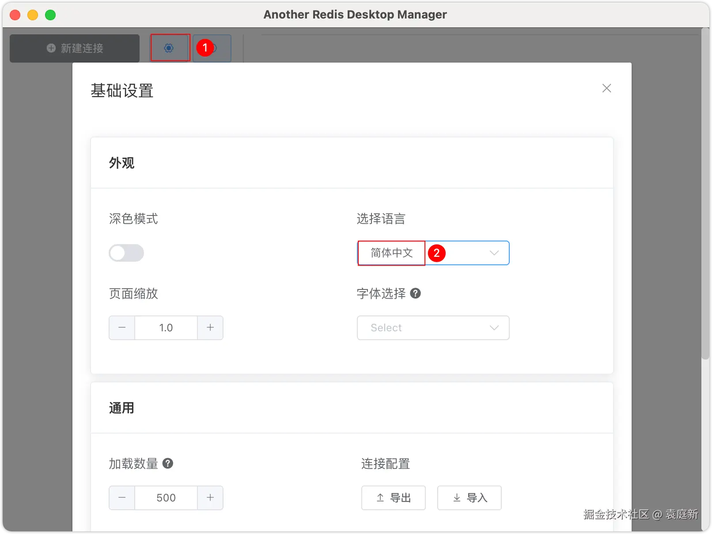
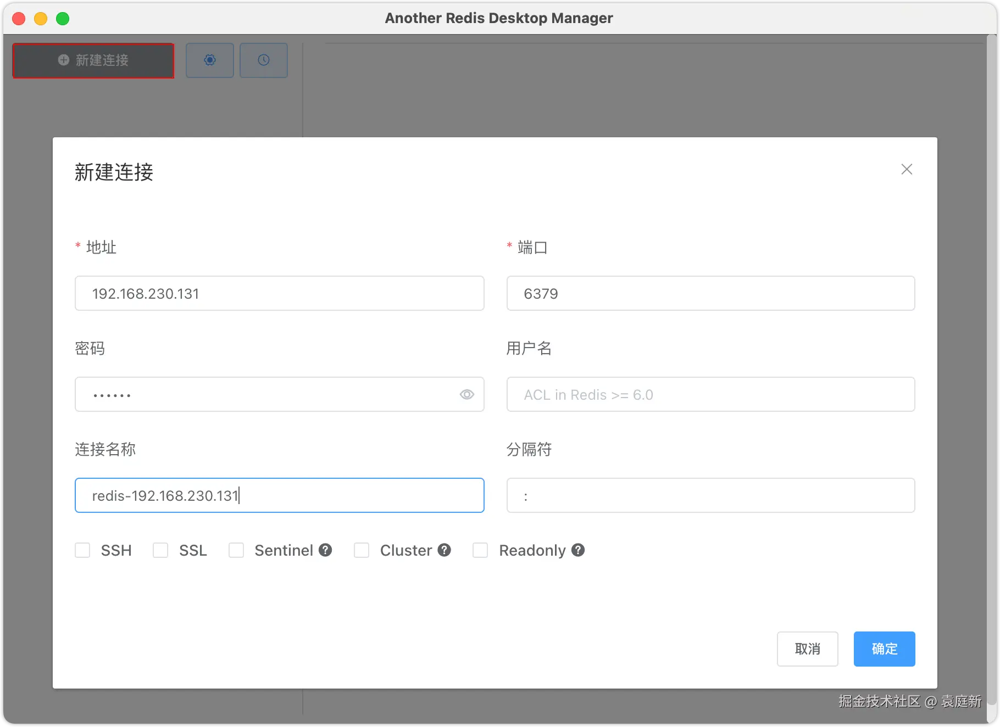
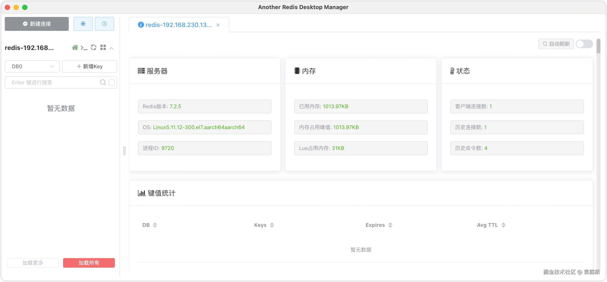
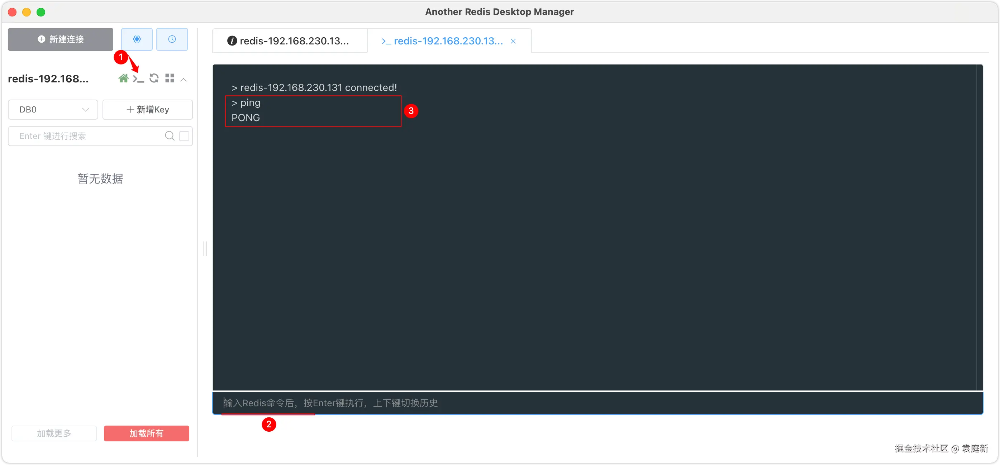

# Redis 7.x的安装与配置

2024-12-171,911阅读9分钟

## 1 Redis下载与安装

使用非关系型数据库Redis必须先进行安装配置并开启Redis服务，然后使用对应客户端连接使用。Redis支持多种方式的安装配置，例如Linux系统安装、Docker镜像安装等，不同安装方式的安装过程也不相同。

### 1.1 Redis下载

Redis版本号采用国际标准惯例，即“主版本号.副版本号.补丁级别”。

1.通过访问Redis的官方下载地址[download.redis.io/releases/](https://link.juejin.cn/?target=https%3A%2F%2Fdownload.redis.io%2Freleases%2F)进行Redis的下载

2.也可以通过访问国内镜像进行下载，以华为云镜像为例。访问华为云镜像地址[mirrors.huaweicloud.com/home](https://link.juejin.cn/?target=https%3A%2F%2Fmirrors.huaweicloud.com%2Fhome)，直接打开访问即可。在打开的网页中输入“Redis”关键词搜索对应的镜像，然后选择对应的版本进行下载即可。

3.同时还可以通过wget命令进行Redis的下载，在终端输入如下的命令。

```ruby
wget https://github.com/redis/redis/archive/7.2.5.tar.gz
```

### 1.2 Redis安装

Redis官方网站没有提供Windows版的安装包，可以通过访问GitHub的[github.com/tporadowski…](https://link.juejin.cn/?target=https%3A%2F%2Fgithub.com%2Ftporadowski%2Fredis%2Freleases)地址来下载Windows版的Redis安装包，但官方不推荐。大多数企业都是基于Linux服务器来部署项目，因此课程中我们会基于Linux系统来安装Redis，此处选择的Linux版本为CentOS 7。

1.安装gcc。Redis是基于C语言编写的，因此首先需要先安装Redis所需要的gcc依赖。Linux系统必须处于连网的状态下。

```
yum install -y gcc tcl
```

2.忘记是否安装过，可以使用`gcc -v`命令查看gcc版本，如果没有安装过，会提示命令不存在。

```
gcc -v
```

3.拷贝redis-7.2.5.tar.gz到Linux的/usr/local/src目录下。

```ruby
scp /Users/yuanxin/Downloads/redis-7.2.5.tar.gz root@192.168.230.131:/usr/local/src
```

4.将redis-7.2.5.tar.gz解压到//usr/local/src目录下。

```
tar -zxvf redis-7.2.5.tar.gz
```

5.先进入到Redis的安装目录redis-7.2.5中，然后进行编译。

```go
make
```

6.编译完成后，开始安装。如果没有出错，就表示安装成功了。

```go
make install
```

7.默认Redis的安装路径是在/usr/local/bin目录下。

```sql
[root@node1 redis-7.2.5]# ll /usr/local/bin
总用量 30184
-rwxr-xr-x. 1 root root  7155936 7月  10 09:35 redis-benchmark
lrwxrwxrwx. 1 root root       12 7月  10 09:35 redis-check-aof -> redis-server
lrwxrwxrwx. 1 root root       12 7月  10 09:35 redis-check-rdb -> redis-server
-rwxr-xr-x. 1 root root  7811392 7月  10 09:35 redis-cli
lrwxrwxrwx. 1 root root       12 7月  10 09:35 redis-sentinel -> redis-server
-rwxr-xr-x. 1 root root 15933144 7月  10 09:35 redis-server
```

该目录已经默认配置到环境变量，因此可以在任意目录下运行这些命令。对该目录下的文件如下的说明。

| 文件           | 作用                      |
| -------------- | ------------------------- |
| redis-cli      | 是Redis提供的命令行客户端 |
| redis-server   | 是Redis的服务端启动脚本   |
| redis-sentinel | 是Redis的哨兵模式启动脚本 |

## 2 启动Redis

Redis的启动方式有很多种方式，常见使用的有：默认启动、指定配置启动、开机自启。

### 2.1 默认启动

Redis安装完成后，在任意目录输入redis-server命令即可启动Redis服务。这种情况下，默认启动的配置文件是redis.conf。

```vbscript
redis-server
```

这种启动属于前台启动，会阻塞整个会话窗口，窗口关闭或者按下“CTRL + C”则Redis服务停止，因此不推荐使用。

Redis的端口为什么是6379？6379在是手机按键上MERZ对应的号码，而MERZ取自意大利歌女Alessia Merz的名字。MERZ长期以来被antirez（Redis作者）及其朋友当作愚蠢的代名词。

### 2.2 指定配置启动

Redis默认不会使用后台运行，如果你需要将Redis配成后台运行，需要在redis.conf文件中进行修改，就在我们之前解压的Redis安装包下（/usr/local/src/redis-7.2.5）。当你后台服务启动的时候，会写成一个进程文件运行。

1.实际开发当中，不要直接修改redis.conf文件，我们先将这个配置文件备份一份。

```csharp
[root@node1 redis-7.2.5]# cp redis.conf redis.conf.backup
```

2.编辑redis.conf文件。然后修改redis.conf文件中的一些配置（在redis.conf文件中配置Redis为后台运行），如下所示。

```shell
# 允许访问的地址，默认是“bind 127.0.0.1 -::1”，会导致只能在本地访问。修改为“bind 0.0.0.0 -::1”则可以在任意IP访问，生产环境不要设置为“bind 0.0.0.0 -::1”
bind 0.0.0.0 -::1
# 守护进程，修改为yes后即可后台运行，默认值为no
daemonize yes 
# 密码，设置后redis-cli访问必须输入密码，默认没有配置密码
requirepass 123456
```

在默认情况下requirepass参数值为空的，表示无需通过密码验证就可以连接到Redis服务。

3.其他的有关Redis的常见配置，以下参数非必要配置。

```bash
# 监听的端口
port 6379
# 客户端空闲N秒后关闭连接（0表示禁用）
timeout 0
# 工作目录，默认是当前目录，也就是运行redis-server时的命令，日志、持久化等文件会保存在这个目录
dir ./
# 设置Redis实例中数据库数量，默认有16个库，编号0~15
databases 16
# 设置Redis能够使用的最大内存，默认没有配置
maxmemory 512mb
# 日志文件，默认为空，不记录日志，可以指定日志文件名
logfile "redis.log"
```

4.以配置文件的方式启动Redis。使用redis-server指令启动Redis服务的时候，可以在指令后添加Redis配置文件的路径，以设置Redis是以何种配置进⾏启动。

```csharp
# 进入Redis安装目录 
[root@node1 ～]# cd /usr/local/src/redis-7.2.5
# 指定配置文件启动redis服务
[root@node1 redis-7.2.5]# redis-server redis.conf
```

5.检测6379端口是否在监听。

```ruby
[root@node1 redis-7.2.5]# netstat -lntp | grep 6379
tcp        0      0 0.0.0.0:6379            0.0.0.0:*               LISTEN      8925/redis-server 0 
tcp6       0      0 ::1:6379                :::*                    LISTEN      8925/redis-server 0 
```

6.停止Redis服务。利用redis-cli来执行shutdown命令，即可停止Redis服务。需要注意的是，如果Redis实例没有设置访问密码以及修改默认端口号，则这里的参数"-a"和"-p"可省略不写。

```csharp
# 因为之前配置了密码，因此需要通过-u来指定密码
[root@node1 redis-7.2.5]# redis-cli -a 123456 -p 6379 shutdown
```

### 2.3 开机自启

我们也可以通过配置来实现Redis的开机自启动。

1.首先，需新建一个系统服务文件。

```bash
vim /etc/systemd/system/redis.service
```

2.将以下的内容复制放在redis.service文件中。

```ini
[Unit]
Description=redis-server
After=network.target

[Service]
Type=forking
ExecStart=/usr/local/bin/redis-server /usr/local/src/redis-7.2.5/redis.conf
PrivateTmp=true

[Install]
WantedBy=multi-user.target
```

3.然后重载系统服务。

```
systemctl daemon-reload
```

4.现在，我们可以用下面这组命令来操作Redis服务了。

```bash
# 启动
systemctl start redis
# 停止
systemctl stop redis
# 重启
systemctl restart redis
# 查看状态
systemctl status redis
```

5.执行下面的命令，可以让Redis开机自启。

```bash
systemctl enable redis
```

## 3 Redis客户端

安装完成Redis后，我们就可以操作Redis数据库来实现数据的CRUD操作了。这就需要用到Redis客户端，包括命令行客户端、图形化桌面客户端、编程客户端。

### 3.1 Redis命令行客户端

Redis安装完成后就自带了Redis命令行客户端redis-cli，通过该客户端可以运行Redis命令，用于在Redis服务上执行操作。

#### 3.1.1 连接本地Redis服务

如果需要连接本地Redis服务，Redis客户端的基本语法为：

```ruby
$ redis-cli
```

启动Redis服务器后，打开终端并输入命令redis-cli，该命令会连接本地的Redis 服务。

```ruby
$ redis-cli
127.0.0.1:6379> PING
PONG
```

通过执行PING命令，用于检测Redis服务器是否启动；如果响应结果为PONG，说明已经成功连接到了Redis服务器。

#### 3.1.2 连接远程Redis服务

如果需要在远程Redis服务上执行命令，同样我们使用的也是redis-cli命令。语法格式如下。

```css
$ redis-cli -h host -p port -a password
```

对上述命令中的参数做如下的说明。

| 参数        | 作用                                                         |
| ----------- | ------------------------------------------------------------ |
| -h host     | 用于指定远程Redis服务器的IP地址，默认是127.0.0.1。           |
| -p port     | 用于指定Redis远程服务器的端口号，默认是6379。                |
| -a password | 指定Redis的访问密码，即redis.conf文件中的requirepass参数处填写的密码。可选参数，若远程服务器设置了密码则需要输入。 |

下面示例展示了如何连接到远程Redis服务器。

```ruby
[root@node1 redis-7.2.5]# redis-cli -h 127.0.0.1 -p 6379 -a 123456
Warning: Using a password with '-a' or '-u' option on the command line interface may not be safe.
127.0.0.1:6379> PING
PONG
127.0.0.1:6379> EXIT
```

#### 3.1.3 Redis连接命令

Redis连接命令主要是用于连接Redis服务。只有当Redis客户端与服务器正常连接后才能够实现彼此的交互、通信。Redis 通过“Redis序列化协议”（简称RESP），实现客户端与服务端之间的连接通信，该协议主要包括两个部分：网络模型和序列化协议。其中，网络模型主要负责数据交互的组织方式，序列化协议则实现了数据的序列化。

由此可知，Redis客户端与服务端交互的数据是以序列后的协议数据进行传输的。

下表罗列了常用的Redis连接命令：

| 命令          | 描述                 |
| ------------- | -------------------- |
| AUTH password | 验证密码是否正确。   |
| ECHO message  | 打印字符串。         |
| PING          | 查看服务是否运行。   |
| QUIT          | 关闭当前连接。       |
| SELECT index  | 切换到指定的数据库。 |

以下示例演示了客户端如何通过密码验证连接到Redis服务，并检测服务是否在运行，以及Redis其他连接命令的使用。

```ruby
# 进入控制台后，通过auth命令来指定密码
[root@node1 redis-7.2.5]# redis-cli -h 127.0.0.1 -p 6379
127.0.0.1:6379> AUTH 123456
OK
127.0.0.1:6379> PING
PONG
127.0.0.1:6379> ECHO "Hello Redis"
"Hello Redis"
192.168.230.131:6379> QUIT
```

执行上述命令后，终端的结果如下图所示。



### 3.2 Redis图形化桌面客户端

Redis有许多第三方可视化工具，可以让你更加直观形象地的操作Redis数据库，常见的Redis GUI工具有Redis Desktop Manager（又称RDM）、Another Redis DeskTop Manager及FastoRedis。

#### 3.2.1 AnotherRedisDesktopManager

Another Redis Desktop Manager是一个更快、更好、更稳定的Redis桌面（GUI）管理客户端工具，兼容Windows、Mac、Linux，性能出众，轻松加载海量键值。

Another Redis Desktop Manager支持哨兵、集群、ssh通道、ssl认证、stream、subscribe订阅、树状视图、命令行，以及暗黑模式；多种格式化方式，甚至能够自定义格式化脚本，满足你的一切需求。

Another Redis Desktop Manager官网下载地址[goanother.com/cn](https://link.juejin.cn/?target=https%3A%2F%2Fgoanother.com%2Fcn)，而且完全开源免费。



#### 3.2.2 Redis Insight

Redis Insight是由Redis官方提供的免费图形化桌面客户端工具。Redis Insight是一个功能强大的桌面用户界面，可帮助你可视化和优化Redis和Redis Stack的数据。此外，它还支持在功能齐全的桌面UI客户端中进行CLI交互。

Redis Insight官网下载地址[redis.io/insight](https://link.juejin.cn/?target=https%3A%2F%2Fredis.io%2Finsight)，而且完全开源免费。


#### 3.2.3 RedisDesktopManager

Redis Desktop Manager（简称RDM）是一个跨平台Redis桌面管理软件，支持Windows、Liunx和macOS。该工具为用户提供了易于使用的Redis可视化操作，同时支持SSL/TLS加密，以及SSH隧道技术和云Redis实例，例如Amazon ElastiCache，Microsoft Azure Redis Cache和Redis Labs。

GitHub上的大神编写了Redis的图形化桌面客户端，下载地址是[github.com/uglide/Redi…](https://link.juejin.cn/?target=https%3A%2F%2Fgithub.com%2Fuglide%2FRedisDesktopManager)。不过该仓库提供的是RedisDesktopManager的源码，并未提供Windows安装包（此工具付费）。

我们可以访问[github.com/lework/Redi…](https://link.juejin.cn/?target=https%3A%2F%2Fgithub.com%2Flework%2FRedisDesktopManager-Windows%2Freleases)这个仓库找到RDM的安装包（此工具免费）。



Redis的图形化界面工具只是辅助操作，可根据喜好进行选择性下载。我人个推荐使用前两种，因为开源免费，且对不同的操作系统提供了版本支持。本教程我使用的是AnotherRedisDesktopManager客户端工具。

### 3.3 桌面客户端连接Redis

由于Redis的图形化桌面客户端工具安装都非常简单，傻瓜式安装即可，因此关于工具的安装这里将不再展开介绍。下面我们以AnotherRedisDesktopManager工具为例，介绍如何连接Redis数据库。

1.防火墙相关操作命令，在使用Redis的图形化桌面客户端连接Redis服务之前，一定要先关闭Linux的防火墙，否则未来在连接Redis服务时可能会提示" Client On Error: Error: connect ECONNREFUSED 192.168.230.131:6379 Config right?"的错误。

```shell
# 查询防火墙状态
$ systemctl status firewalld
# 启动防火墙
$ systemctl start firewalld
# 重启防火墙
$ systemctl restart firewalld
# 关闭防火墙
$ systemctl stop firewalld
# 禁用防火墙(禁止开机启动) 
$ systemctl disable firewalld
# 开启6379端口（暂时开通）
$ /sbin/iptables -I INPUT -p tcp --dport 6379 -j ACCEPT
```

2.完成AnotherRedisDesktopManager安装后，双击图标即可运行。为了操作方便，可以在打开的窗口中点击左上角的设置按钮，将语言设置为简体中文的格式。



3.点击窗口左上角的“新建连接”按钮，在弹出的窗口中填写Redis服务信息，如下图所示。



在Redis连接配置窗口中填写对应的连接地址（Redis服务地址）、连接端口（Redis默认端口为6379）、密码（Redis认证密码）、连接名称（自定义），而用户名和分隔符选项，可以不用配置；然后，单击【确认】按钮进行连接，如果连接失败，则需要重新检查服务启动情况或者连接配置信息，如果连接成功，将进入客户端管理页面。

4.然后点击“确定”按钮，会打开如下图所示的窗口，此时表明Redis服务连接成功。同时我们会发现，在左侧菜单会出现这个一个连接。



5.使用命令行工具。在控制台左侧菜单可以点击“>_”按钮，将会打开下图所示的窗口，在这里可以使用Redis的命令进行操作。



Redis默认有16个仓库，编号从0至15。通过配置文件可以设置仓库数量，但是不超过16，并且不能自定义仓库名称。如果是基于redis-cli连接Redis服务，可以通过select命令来选择数据库。

## 4 总结

首先介绍了Redis的下载途径，包括通过官方下载地址、国内镜像以及wget命令进行下载。随后，详细阐述了在Linux系统下，特别是CentOS 7版本中，Redis的安装步骤，从安装gcc依赖、拷贝解压安装包、编译安装，到最后的安装路径说明，每一步都进行了清晰的指导。

在安装完成后，文件还介绍了启动Redis服务的多种方式，如默认启动、指定配置启动和开机自启，并详细说明了每种方式的操作步骤和注意事项。最后，还介绍了Redis客户端的连接方法，包括命令行客户端和图形化桌面客户端，为用户提供了多种选择。