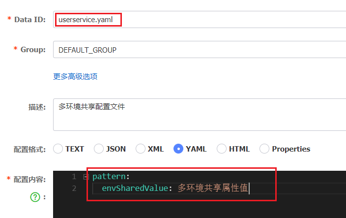
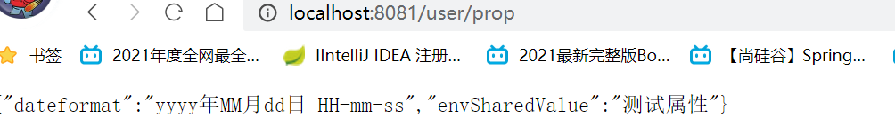
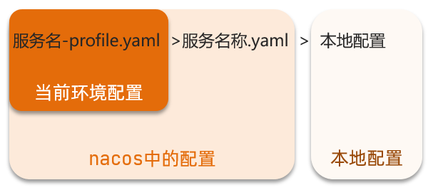

# Nacos配置管理
## 统一配置管理
1、首先在 nacos 中配置服务


微服务要拉取nacos中管理的配置，并且与本地的application.yml配置合并，才能完成项目启动。
但如果尚未读取application.yml，又如何得知nacos地址呢？
因此spring引入了一种新的配置文件：bootstrap.yaml文件，会在application.yml之前被读取，流程如下：

2、引入nacos-config依赖
```
<!--nacos配置管理依赖-->
<dependency>
    <groupId>com.alibaba.cloud</groupId>
    <artifactId>spring-cloud-starter-alibaba-nacos-config</artifactId>
</dependency>
```
3、 添加bootstrap.yaml
然后，在user-service中添加一个bootstrap.yaml文件，内容如下
```
spring:
  application:
    name: userservice # 服务名称
  profiles:
    active: dev #开发环境，这里是dev 
  cloud:
    nacos:
      server-addr: localhost:8848 # Nacos地址
      config:
        file-extension: yaml # 文件后缀名
```
这里会根据spring.cloud.nacos.server-addr获取nacos地址，再根据
${spring.application.name}-${spring.profiles.active}.${spring.cloud.nacos.config.file-extension}作为文件id，来读取配置。
4、读取nacos配置
在user-service中的UserController中添加业务逻辑，读取pattern.dateformat配置：
```
package cn.itcast.user.web;

import cn.itcast.user.pojo.User;
import cn.itcast.user.service.UserService;
import lombok.extern.slf4j.Slf4j;
import org.springframework.beans.factory.annotation.Autowired;
import org.springframework.beans.factory.annotation.Value;
import org.springframework.web.bind.annotation.*;

import java.time.LocalDateTime;
import java.time.format.DateTimeFormatter;

@Slf4j
@RestController
@RequestMapping("/user")
public class UserController {

    @Autowired
    private UserService userService;

    @Value("${pattern.dateformat}")
    private String dateformat;

    @GetMapping("now")
    public String now(){
        return LocalDateTime.now().format(DateTimeFormatter.ofPattern(dateformat));
    }
    // ...略
}
```
## 配置热更新
方式一：

方式二：
使用@ConfigurationProperties注解代替@Value注解。
在user-service服务中，添加一个类，读取patterrn.dateformat属性：
```
package cn.itcast.user.config;

import lombok.Data;
import org.springframework.boot.context.properties.ConfigurationProperties;
import org.springframework.stereotype.Component;

@Component
@Data
@ConfigurationProperties(prefix = "pattern")
public class PatternProperties {
    private String dateformat;
}
```

需要注意：bootstrap.yml
在nacos建立的时yaml
两者后缀不一样
## 配置共享
其实微服务启动时，会去nacos读取多个配置文件，例如：
[spring.application.name]-[spring.profiles.active].yaml，例如：userservice-dev.yaml
[spring.application.name].yaml，例如：userservice.yaml
而[spring.application.name].yaml不包含环境，因此可以被多个环境共享。
1）添加一个环境共享配置


2）在user-service中读取共享配置
```
package cn.itcast.user.config;

import lombok.Data;
import org.springframework.boot.context.properties.ConfigurationProperties;
import org.springframework.stereotype.Component;

@Data
@Component
@ConfigurationProperties(prefix = "pattern")
public class PatternProperties {
    private String dateformat;
    private String envSharedValue;
}

```
3）在user-service服务中，修改UserController，添加一个方法：
```

@Slf4j
@RestController
@RequestMapping("/user")
//@RefreshScope
public class UserController {

    @Autowired
    private UserService userService;

//    @Value("${pattern.dateformat}")
//    private String dateformat;

    @Autowired
    PatternProperties patternProperties;

    @GetMapping("prop")
    public PatternProperties patternProperties(){
        return patternProperties;
```
4）运行两个UserApplication，使用不同的profile


这样，UserApplication(8081)使用的profile是dev，UserApplication2(8082)使用的profile是test。
启动UserApplication和UserApplication2
分别得到结果：


可以看出来，不管是dev，还是test环境，都读取到了envSharedValue这个属性的值。
5）配置共享的优先级
当nacos、服务本地同时出现相同属性时，优先级有高低之分：


## 搭建Nacos集群

### 搭建集群的基本步骤：
搭建数据库，初始化数据库表结构
下载nacos安装包
配置nacos
启动nacos集群
nginx反向代理
#### 下载nacos
nacos在GitHub上有下载地址：https://github.com/alibaba/nacos/tags，可以选择任意版本下载。
#### 配置Nacos
将这个包解压到任意非中文目录下，如图：
image-20210402161843337
目录说明：
bin：启动脚本
conf：配置文件
进入nacos的conf目录，修改配置文件cluster.conf.example，重命名为cluster.conf：
然后添加内容：
```
127.0.0.1:8845
127.0.0.1.8846
127.0.0.1.8847
```
然后修改application.properties文件，添加数据库配置
```
spring.datasource.platform=mysql
db.num=1
db.url.0=jdbc:mysql://127.0.0.1:3306/nacos?characterEncoding=utf8&connectTimeout=1000&socketTimeout=3000&autoReconnect=true&useUnicode=true&useSSL=false&serverTimezone=UTC
db.user.0=root
db.password.0=123
```
#### 启动
将nacos文件夹复制三份，分别命名为：nacos1、nacos2、nacos3
然后分别修改三个文件夹中的application.properties，

nacos1:
```
server.port=8845
```
nacos2:
```
server.port=8846
```
nacos3:
```
server.port=8847
```
然后分别启动三个nacos节点：
```
startup.cmd
```
#### nginx反向代理
解压nginx安装包：
修改conf/nginx.conf文件，配置如下：

```
upstream nacos-cluster {
    server 127.0.0.1:8845;
    server 127.0.0.1:8846;
    server 127.0.0.1:8847;
}

server {
    listen       80;
    server_name  localhost;

    location /nacos {
        proxy_pass http://nacos-cluster;
    }
}
```
而后在浏览器访问：http://localhost/nacos即可。
代码中application.yml文件配置如下：
```
spring:
  cloud:
    nacos:
      server-addr: localhost:80 # Nacos地址

```
#### 优化
实际部署时，需要给做反向代理的nginx服务器设置一个域名，这样后续如果有服务器迁移nacos的客户端也无需更改配置.
Nacos的各个节点应该部署到多个不同服务器，做好容灾和隔离
