# 第1章\. AI通识与基础


本章我们先了解AI的发展历史以及大模型应用开发的基本技术。


# 人工智能的发展

**AI**，人工智能（**A**rtificial **I**ntelligence），是一门致力于使机器能够模拟人类思维、学习与解决问题的技术。


自文明萌芽以来，人类始终怀有“造物”的冲动——渴望赋予非生命以智慧。尽管AI在近年才成为全球焦点，但其思想的种子，早在20世纪50年代便已埋下。

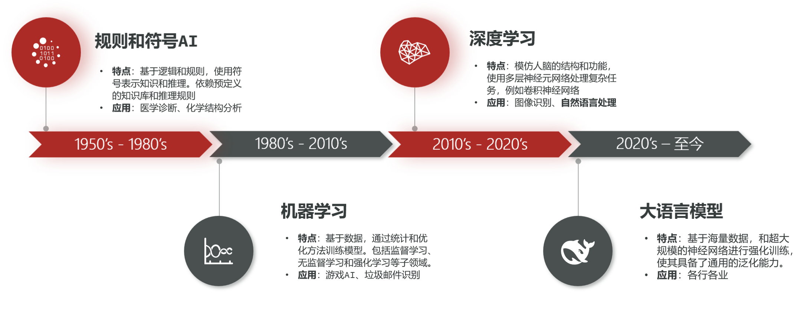

AI发展的四大阶段：

- **第一浪潮：规则与符号的探索**
  AI的诞生始于“符号主义”学派。在20世纪50至70年代，研究者相信智能可以通过预设的逻辑和符号规则来复刻。这些系统使用形式化的符号来表示知识，并依据严密的推理规则进行推导。然而，现实世界的模糊与复杂远超人工规则的描绘，使得此类AI局限在如象棋对弈、定理证明等封闭的专业领域，难以走向广阔天地。

- **第二浪潮：统计与学习的兴起**
  至1980年代，AI发展迎来了关键转折，从“符号主义”正式迈入“联结主义”，**机器学习**成为新的引擎。研究者不再试图编写全部规则，而是让机器从数据中自行发现规律、总结模式。这一范式转换，使AI从封闭的规则库走向开放的真实数据，奠定了现代AI的基础，并在垃圾邮件过滤、推荐系统等场景中初露锋芒。

- **第三浪潮：深度神经网络的突破**
  21世纪初，随着海量数据与强大算力（特别是GPU）的涌现，**深度学习**——这一基于深层神经网络的机器学习分支——将AI推向了新的高潮。深度网络能够自动提取数据的多层次抽象特征，从而在图像识别、语音理解、自然语言处理等领域取得了远超传统方法的精度。它的成功，标志着AI在处理感知类任务上的能力首次接近乃至超越了人类水平，并催生了诸如人脸识别、智能语音助手等广泛应用。

- **第四浪潮：大模型与生成式AI的革命**
  真正的普及风暴始于2020年代**大语言模型（简称"大模型"）**的崛起。这一次，技术变革的焦点从"专用型"的感知智能，转向了"通用型"的认知智能。通过简单的对话，任何人都能指挥AI完成写作、编程、数据分析等复杂任务，技术壁垒被空前降低。大模型不再仅是实验室的成果或新闻中的概念，它已成为普通人日常工作与生活中触手可及的智能伙伴，从根本上重塑了生产力与创造力模式，标志着AI真正融入了人类社会结构的核心。


那么，问题来了：这个看似无所不能的大模型，它的"大脑"里究竟在发生什么？它的"智能"从何而来？


# 智能产生的要素

2022年，GPT3刚刚发布时，AI的智商大约相当于7岁的小朋友，而如今最先进的大模型，其智商已接近20岁的成年人，甚至在某些领域比人类更加智能。


那么，大模型的"智能"为什么发展如此迅速？大模型产生"智慧"的根本原因是什么呢？


影响大模型智能的核心要素有三点：

- 模型算法

- 海量数据

- 超级算力


## 模型算法

首先是模型算法，现在的AI都是采用**神经网络**架构，你可以把它看做是AI的大脑，是决定AI是否”聪明”的基础。


人类的大脑是由很多**神经元细胞**构成，AI**神经网络**的本质就是在模拟人类大脑神经元：

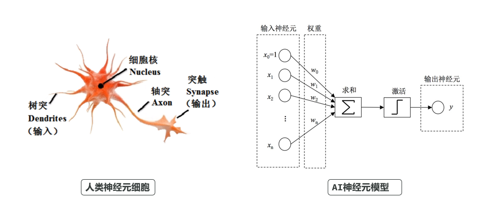

AI的神经元与人类神经元一样，接收多个不同的输入x，经过加权求和得到初步结果，再通过激活函数处理生成最终的输出结果。但由于早期的激活函数比较简单，只能做一些简单的二分类任务，比如判断性别、判断真假。


最早的神经网络可以追溯到**1958**年，**Frank Rosenblatt**（**弗兰克·罗森布拉特**）发明了人类历史上第一个神经网络机器：**感知机**（Perceptrons）。


不过，感知机的神经网络比较简单，只有一个神经元，只能实现简单的二分类判断，例如：根据照片区分 性别。


近20年来，神经网络算法不断迭代、升级、优化。最初的神经网络多采用前馈神经网络，受限于算法，其理解人类语言时的上下文窗口有限，通常只能是5\~10个词。

而到了现在，Transformer神经网络模型得益于优良的算法，可以并行处理大量数据，上下文窗口能达到100K级别，才能更好的理解人类的语言中的段落、语境、逻辑关系。


当然，算法只是其中一个原因。除此之外，不得不提到影响AI智能的另外两大核心：数据和算力。


## 海量数据

神经网络算法是AI的大脑，是决定AI是否”聪明”的基础。然而，再聪明的人，如果不学习任何知识，也不会产生智慧。


AI也是一样，要想让AI产生智慧，就必须用**海量的数据**来训练它。上个世纪，互联网不够发达，可以用来训练的数据也比较少。


到了现代，互联网、移动互联网蓬勃发展，各种数据呈井喷式呈现。AI可以学习**整个互联网的精华**：所有的维基百科、无数的新闻文章、海量的书籍、庞大的代码库……这个数据量是以**万亿级**的词汇来计算的。而这，就给AI的训练提供了庞大的数据基础。


如图，随着AI大模型规模扩大，其训练所需的时长和**数据量**也呈指数级增长：

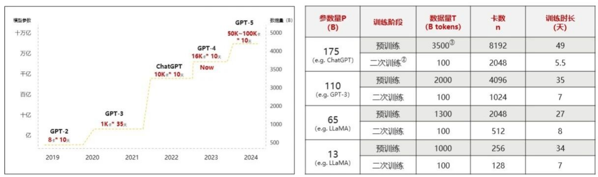


## 超级算力

最后是超级算力，大模型训练的数据规模庞大，神经网络架构复杂，因此训练时的计算量都是天文数字。需要成千上万的顶级GPU一起，不间断的工作数周，甚至数月才行，这背后是巨大的电力消耗和硬件成本。


如图：模型训练所需要的算力已经完全超出了摩尔定律的预估，几乎每隔几个月就会翻倍成长：

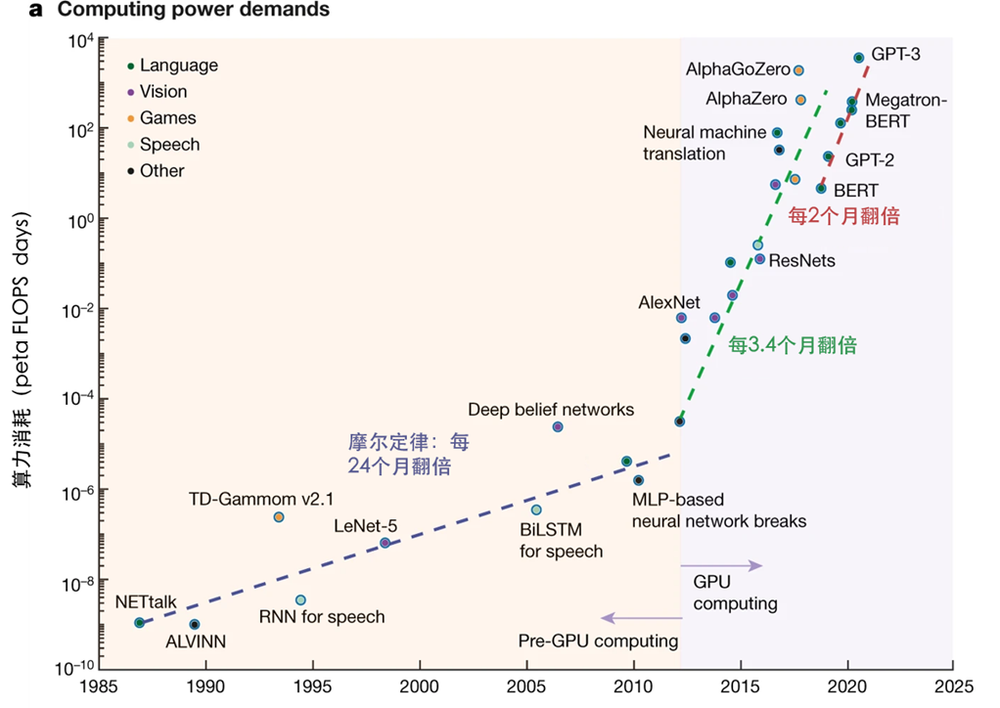

如此规模的算力消耗，在上个世纪，甚至是本世纪初期都是难以想象的。只有到了近几年，随着GPU的不断进步，算力规模才勉强满足了AI的需要。


以上三点就是大模型具备智能的核心支柱了，也是长期制约AI发展的三座大山。直到近十多年，这三者同时跨过临界点，AI能力才真正显现。


# 大模型原理

通过前面的分析，我们知道AI产生智能的三要素分别是：算法、数据、算力。本质来说，AI的智能还是基于各种数学计算产生的。


那么问题来了：现在的AI是如何通过训练理解人类语言的呢？语言是如何计算和训练的呢？


## 模型的训练

前面我们说过，AI的神经网络模型就是在模仿人类的神经元：


你给它输入一些参数，最终它经过计算返回一个结果。因此从某种意义上，你可以**把模型看做是一个函数**。

这就类似：y = ax \+ b，这个函数有两个参数a和b，当a和b确定时，这个函数就能表示一条直线。输入一个x，一定能得到一个结果y


当然，模型这个“函数”要复杂的多，其参数不是两个，而是可能达到千亿规模：

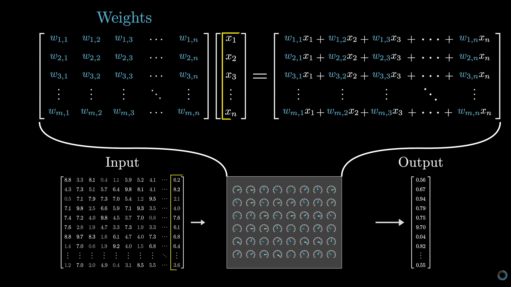

因此它表示的不是一条直线，而是表示人类复杂的语言系统。


**模型训练的过程，就是求模型参数的过程，类似于求解函数参数**。已知直线上两个点的坐标，就能求出这条直线对应的a和b的值。


不过，大模型这个“函数”要复杂的多，其参数规模高达数千亿，模拟的也不是一条直线，它需要的“点”也是天文数字，因此根本就不可能精确计算出每一个参数的值。


所以，**模型的训练更像是在猜答案**：

- 先给模型参数设定为随机值

- 然后输入一个参数，再把模型计算的结果与预期的正确结果做对比

- 如果不对就调整参数，直到正确为止

这里的**输入参数**和**预期结果**就是所谓的**训练数据**（平面上的“点”）。不断的给模型提供新的训练数据，根据计算结果不断**调整模型的参数**，直到模型的计算能够与大多数的训练数据吻合，那么模型的**训练**就完成了。


大语言模型的训练就是拿海量的人类语言文字作为训练数据，不断调整模型参数，使其与人类的语言文字系统拟合。


但问题来了，人类的语言文字是如何参与数学运算的呢？


## 大语言模型

在2003年，图灵奖得主**约书亚·本吉奥**（**Yoshua Bengio**）的一篇名为《A neural probabilistic language model》的论文开创了**神经网络语言模型（Neural Network Language Model，NNLM）**的先河。


这篇文章中首次提到了**词向量**（**Word Embedding**）的概念雏形，这为神经网络训练学习自然语言打下了坚实的基础。

- 每个词语都可以经过模型运算转化为一个**多维向量**（也就是一个浮点数数组，GPT3采用12288维向量）

- 通过训练使模型计算出的**多维向量**与**文字语义**产生关联，**使多维空间中的不同方向表示不同语义**


[word\-embedding\.mp4](图片和附件/word-embedding.mp4)


例如，在经过训练后的向量空间中，有两个向量：中国、美国：

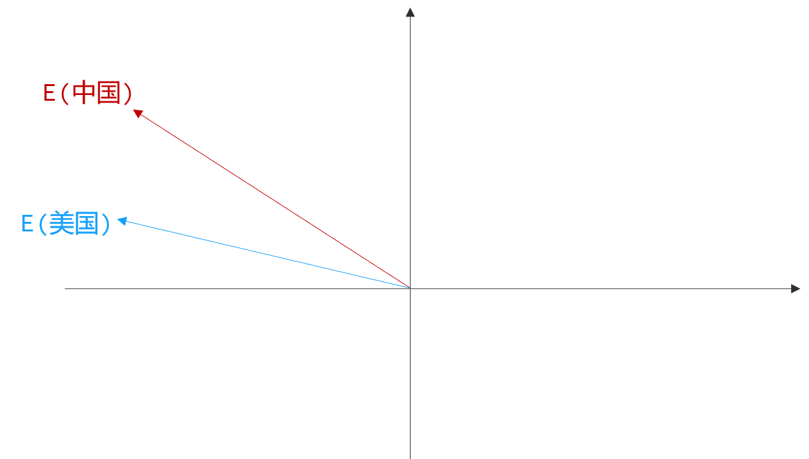

此时，我们用E\(美国\) \- E\(中国\) 得到的新向量，就可以表示为美国与中国的差异。


假如此时我询问LLM在中国有什么食物与美国的汉堡类似，我们就可以这么做：

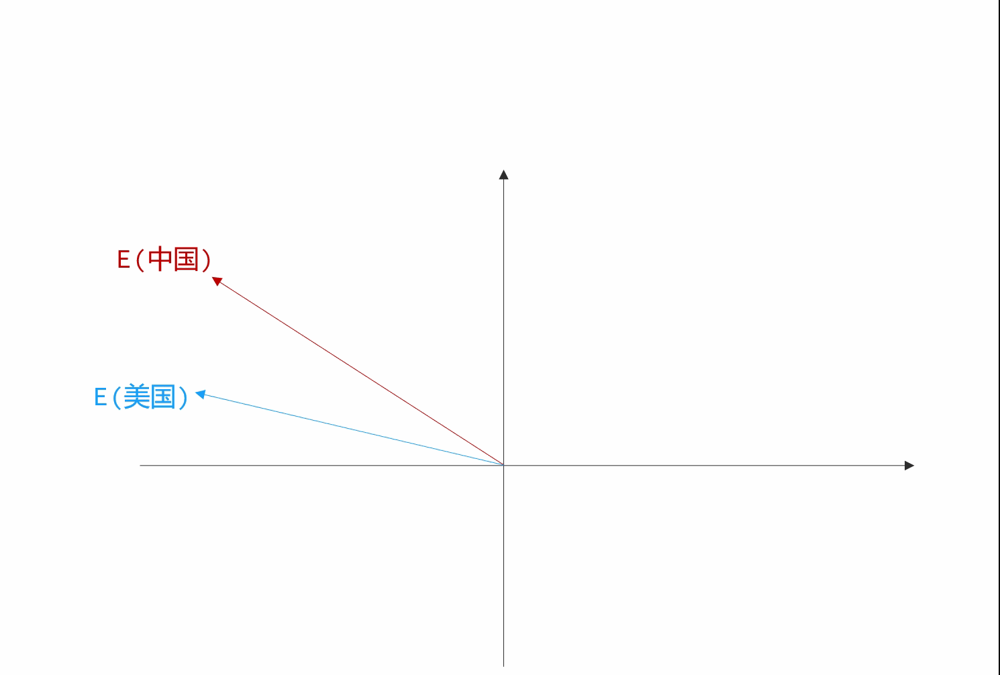

- 先找到表示汉堡的向量：E\(汉堡\)

- 然后加上表示两个国家差异的向量:E\(美国\) \- E\(中国\)

- 从而计算出一个新向量：E\(汉堡\) \+ E\(美国\) \- E\(中国\)

- 最后，将得到的向量**反向量化**（unembedding），大概率就是我们要的结果


当然，真实情况会比这个复杂的多，受到语句上下文的影响，和多义词的影响，运算可能得到不止一个结果，并且会根据可能性形成每一个结果的概率分布，然后通过某种函数算法选择一个最终结果。


综上，大语言模型，就是把人类语言转为可以计算的多维向量坐标，然后根据上文向量计算，来推测下文。就像这样：

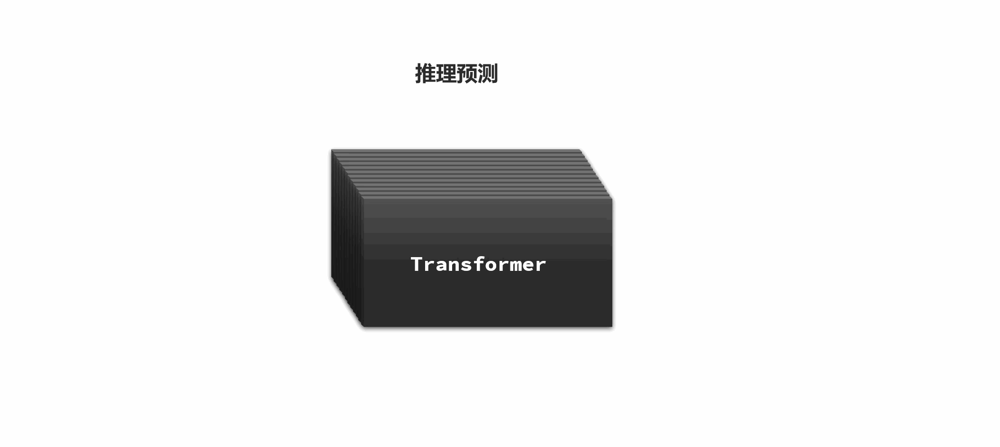


更神奇的是，人类一开始训练语言模型只是为了让它理解人类语言，起到翻译作用。但当**模型和数据规模足够大**时，它不仅能够理解和生成自然语言，还能理解、推理、分析人类生活中的大部分问题，成为了可应用于各个领域的**通用人工智能（AGI）**！

这种因为数据和模型规模扩大而涌现出各种能力的现象，我们称之为**泛化**。

而这样的大规模语言模型我们就称为**大语言模型**（**Large Language Model**），简称**LLM**\.


如果大家想要进一步搞清楚大模型原理，可以参考以下两个视频：

[https://www.bilibili.com/video/BV1atCRYsE7x]()

[https://www.youtube.com/watch?v=wjZofJX0v4M&t=1169s]()


# 大模型应用

什么是大模型应用呢？它与大模型有什么关系呢？


## 什么是大模型应用

别着急，我们从传统应用与大模型各种的能力边界来分析：


- **传统应用**：是由程序员告诉计算机规则（编程），计算机照着规则执行。

  - **擅长**：规则清楚、流程固定的事情；可以确保100%准确；行为可控、可追溯

  - **不擅长**：没有明确规则的事情；自然语言的理解；模糊的判断和表达

- **大模型**：计算机通过大量数据训练，自己学会规律和知识

  - **擅长**：理解和生成自然语言；模糊问题的合理回答；总结、改写、对话、创作

  - **不擅长**：准确的计算；固定的流程和规则；稳定可预测的结果


而**大模型应用**则是把两者的能力结合：**大模型负责“思考”，传统程序负责“行动”**。


例如，点外卖的功能，我们可以这样划分：

- 菜价、优惠、支付 → **传统程序**

- “给我推荐点清淡的” → **大模型**

- 最终下单、扣钱 → **传统程序**


在传统应用开发中介入AI大模型，充分利用两者的优势。既能利用AI实现更加便捷的人机交互，更好的理解用户意图，又能利用传统编程保证安全性和准确性，强强联合，这就是大模型应用开发的真谛！


综上所述，大模型应用就是整合传统程序和大模型的能力和优势来开发的一种应用。


另外，我们熟知的AI对话产品，比如通义千问、豆包这样的APP或者聊天机器人，也都属于大模型应用：

- 收集网页用户输入文本、上传的文件、图片  → **传统程序**

- 分析和理解用户输入的问题 → **大模型**

- 联网搜索与问题相关的资料 → **传统程序**

- 根据资料生成答案 → **大模型**


模型本身只具备理解、推理、生成回复的能力。我们平常使用的AI对话产品除了生成和推理，还有会话记忆功能、联网功能等等。这些都是大模型不具备的。是需要通过额外的程序来实现的，也就是**基于大模型开发应用**。


所以，**我们现在接触的AI对话产品其实都是基于大模型开发的应用，并不是大模型本身**，这一点大家千万要区分清楚。


## 常见的大模型


下面我把常见的一些大模型对话产品及其模型的关系给大家罗列一下：

| **大模型**         | **对话产品** | **公司**  | **地址**                                                     |
| ------------------ | ------------ | --------- | ------------------------------------------------------------ |
| GPT\-3\.5、GPT\-4o | ChatGPT      | OpenAI    | [https://chatgpt\.com/](https://chatgpt.com/)                |
| Claude 3\.5        | Claude AI    | Anthropic | [https://claude\.ai/chats](https://claude.ai/chats)          |
| **DeepSeek\-R1**   | **DeepSeek** | 深度求索  | [https://www\.deepseek\.com/](https://www.deepseek.com/)     |
| 文心大模型3\.5     | 文心一言     | 百度      | [https://yiyan\.baidu\.com/](https://yiyan.baidu.com/)       |
| 星火3\.5           | 讯飞星火     | 科大讯飞  | [https://xinghuo\.xfyun\.cn/desk](https://xinghuo.xfyun.cn/desk) |
| Qwen\-Max          | 通义千问     | 阿里巴巴  | [https://tongyi\.aliyun\.com/qianwen/](https://tongyi.aliyun.com/qianwen/) |
| Moonshoot          | Kimi         | 月之暗面  | [https://kimi\.moonshot\.cn/](https://kimi.moonshot.cn/)     |
| Yi\-Large          | 零一万物     | 零一万物  | [https://platform\.lingyiwanwu\.com/](https://platform.lingyiwanwu.com/) |


OK，现在我们知道了大模型应用就是把传统程序与大模型结合的应用。


## 与大模型的交互


那么问题来了：**传统程序该如何与大模型交互呢？**


答案是：**调用接口**。


大模型在部署时通常都会对外暴露**基于HTTP协议的API接口**，我们可以用任何自己喜欢的方式调用该接口，实现与大模型的交互：

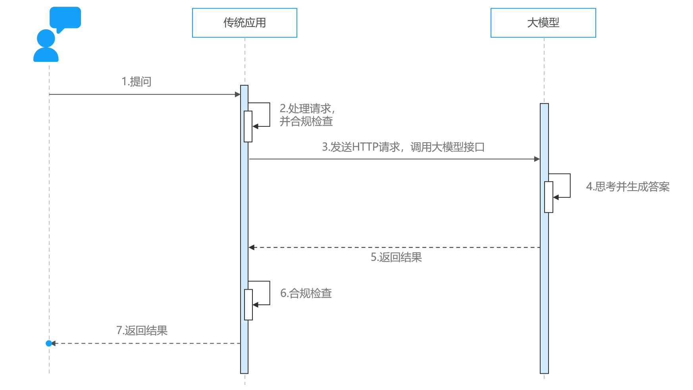


当然，首先我们需要有一个可以调用的大模型服务。


# 大模型服务

前面说过：大模型应用开发并不是在浏览器中跟AI聊天。而是通过**访问模型对外暴露的API接口，实现与大模型的交互**。


因此，企业开发大模型应用，首先需要有一个可访问的大模型，通常有两种选择：

- 使用开放大模型

- 部署私有大模型


使用开放大模型API的优缺点如下：

- 优点：

  - 没有部署和维护成本，按调用收费

- 缺点：

  - 依赖平台方，稳定性差

  - 长期使用成本较高

  - 数据存储在第三方，有隐私和安全问题


部署私有模型：

- 优点：

  - 数据完全自主掌控，安全性高

  - 不依赖外部环境

  - 虽然短期投入大，但长期来看成本会更低

- 缺点：

  - 初期部署成本高

  - 维护困难


接下来，我们给大家演示下两种部署方式：

- 公共大模型

- 私有大模型（在本机演示，将来在服务器也是类似的）


通常发布大模型的官方、大多数的云平台都会提供开放的、公共的大模型服务。大模型官方前面讲过，我们不再赘述，这里我们看一些国内提供大模型服务的云平台：

| **云平台**         | **公司** | **地址**                                                     |
| ------------------ | -------- | ------------------------------------------------------------ |
| DeepSeek           | DeepSeek | https://www\.deepseek\.com                                   |
| 阿里百炼           | 阿里巴巴 | [https://bailian\.console\.aliyun\.com](https://bailian.console.aliyun.com/) |
| 腾讯TI平台         | 腾讯     | [https://cloud\.tencent\.com/product/ti](https://cloud.tencent.com/product/ti) |
| 千帆平台           | 百度     | [https://console\.bce\.baidu\.com/qianfan/overview](https://console.bce.baidu.com/qianfan/overview) |
| SiliconCloud       | 硅基流动 | [https://siliconflow\.cn/zh\-cn/siliconcloud](https://siliconflow.cn/zh-cn/siliconcloud) |
| 火山方舟\-火山引擎 | 字节跳动 | [https://www\.volcengine\.com/product/ark](https://www.volcengine.com/product/ark) |

这些开放平台并不是免费，而是按照调用时消耗的token来付费，每百万token通常在几毛\~几元钱，而且平台通常都会赠送新用户百万token的免费使用权。（token可以简单理解成你与大模型交互时发送和响应的文字，通常一个汉字2个token左右）


接下来，我们分别讲解DeepSeek和阿里巴巴的百炼平台。


## DeepSeek模型服务


官方平台地址：

[https://platform.deepseek.com/]()

### 注册

首次访问，必须注册：

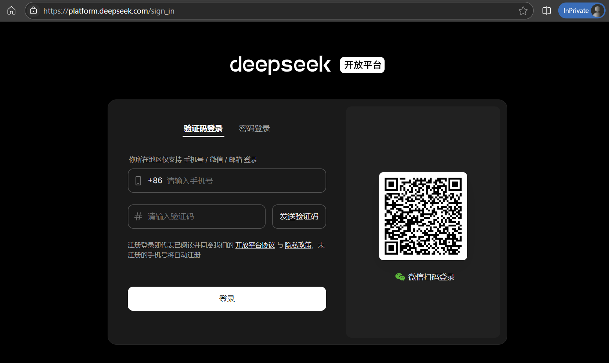


### 充值

DeepSeek官方对外提供的大模型API服务是需要收费的，因此我们必须注册账号，充值少量金额（1元也行）。


注册成功后即可进入平台管理页面，点击**充值**选项，进入充值页面：

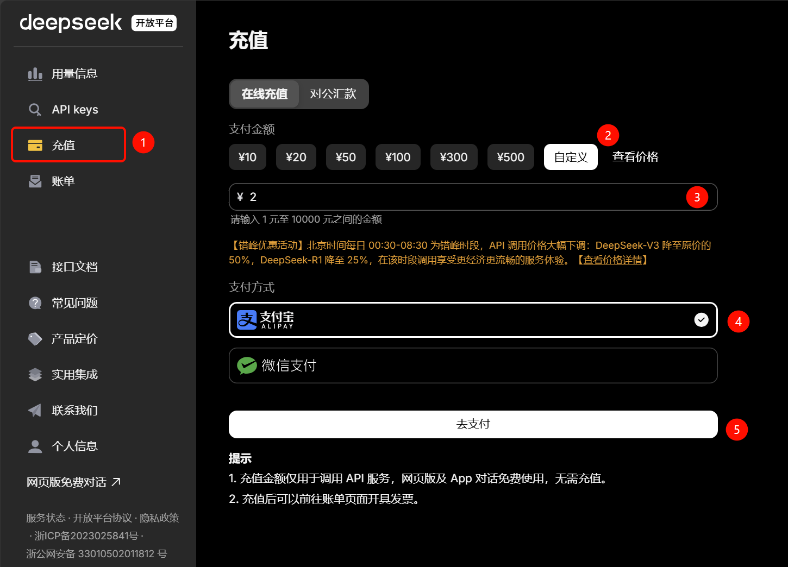

选择合适的价格充值后，即可使用DeepSeek的官方API服务。


### 创建API\_KEY

由于是收费服务，为了防止别人盗用你的账号，DeepSeek的所有API都有权限校验功能。我们需要创建一个鉴权用的`API_KEY`可以。


点击**API Keys**选项卡，进入对应页面。第一次进入应该没有API key，可以点击创建`API key`:

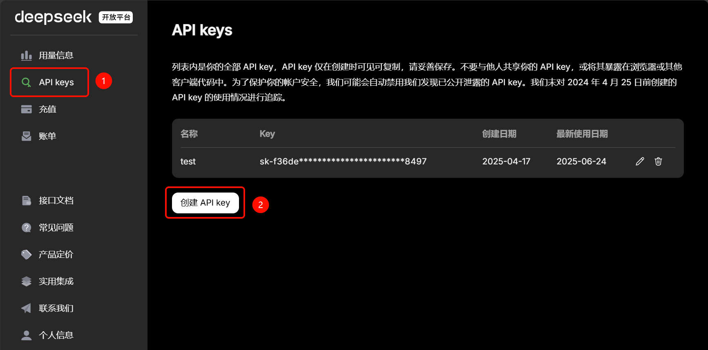

**注意**：API key只有在创建时可以查看，以后都无法查看了。所以需要在创建时妥善保管自己的API key


OK，准备工作完成。


### API文档

访问公共大模型都是通过API的形式，不同模型的API标准略有差异，但基本都兼容OpenAI规范。


接下来，我们一起学习DeepSeek的官方API文档。地址如下：

[https://api-docs.deepseek.com/zh-cn/]()


可以看到，在文档中有这样一段调用对话的API示例：

```Bash
curl https://api.deepseek.com/chat/completions \
  -H "Content-Type: application/json" \
  -H "Authorization: Bearer <DeepSeek API Key>" \
  -d '{
        "model": "deepseek-chat",
        "messages": [
          {"role": "system", "content": "You are a helpful assistant."},
          {"role": "user", "content": "Hello!"}
        ],
        "stream": false
      }'
```

这段信息就描述了调用DeepSeek大模型的API要求：

- **请求URL**：https://api\.deepseek\.com/chat/completions

- **请求头**：

  - Content\-Type: application/json，请求参数的格式，必须是application/json

  - Authorization: Bearer \<DeepSeek API Key\>，上一节创建的API\_KEY

- **请求体**：json格式，稍后解释

  ```JSON
  {
      "model": "deepseek-chat",
      "messages": [
        {"role": "system", "content": "You are a helpful assistant."},
        {"role": "user", "content": "Hello!"}
      ],
      "stream": false
  }
  ```

- **请求方式**：虽然没说，但是由于带请求体，所以这里用POST方式


### 测试

我们可以使用任意的Http客户端来测试API：

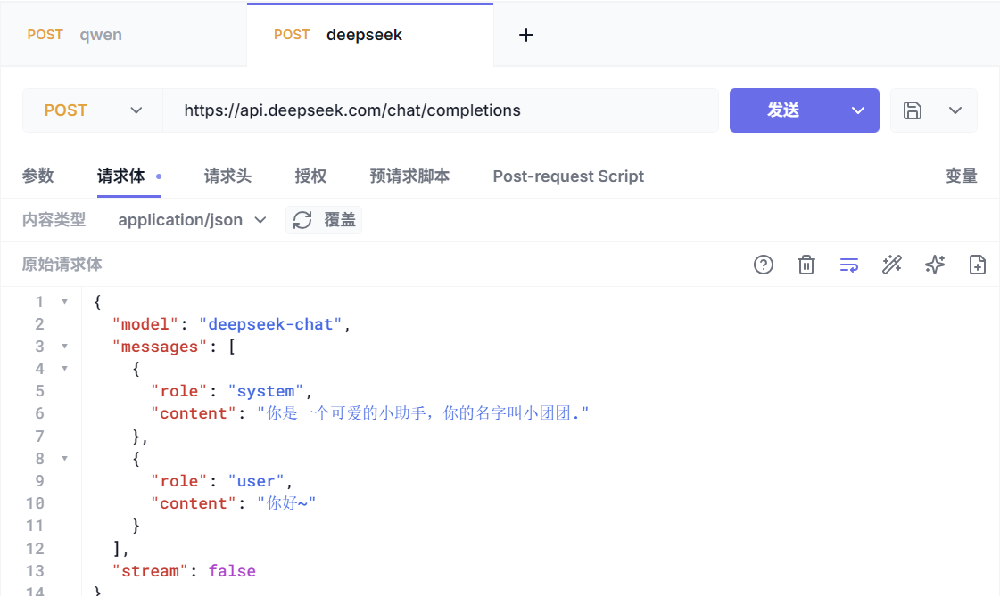


注意：需要在请求头中添加刚刚我们注册时准备的API\_KEY：

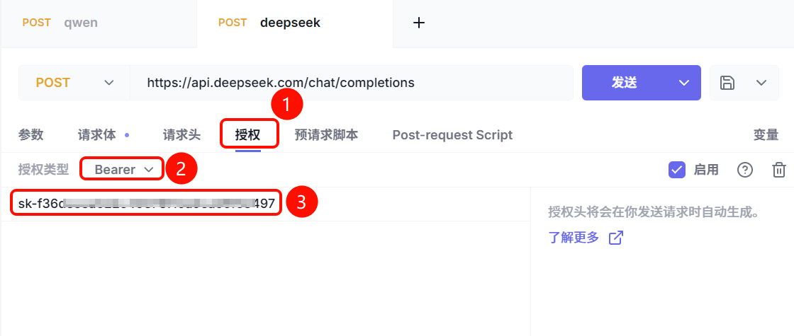


## 阿里巴巴百炼模型服务


我们以阿里云百炼平台为例。

### 注册账号

首先，我们需要注册一个阿里云账号：

[https://account.aliyun.com/]()

**注意**：账号需要进行个人实名认证，否则后续会有警告\~


然后访问百炼平台，开通服务：

[https://bailian.console.aliyun.com/]()

首次访问会弹出窗口，询问是否同意开通百炼服务：

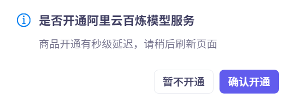

点击确认开通后，如果未进行实名认证，会提醒账户异常：

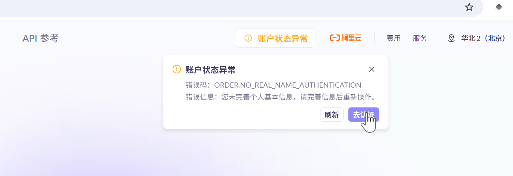

点击去认证，申请个人认证即可，此处略过。


首次开通应该会赠送百万token的使用权，包括DeepSeek\-R1模型、qwen模型等等，有效期是3\~9个月不等。大家可以在《模型控制台》\-\> 《模型用量》查看到你的免费额度使用情况：

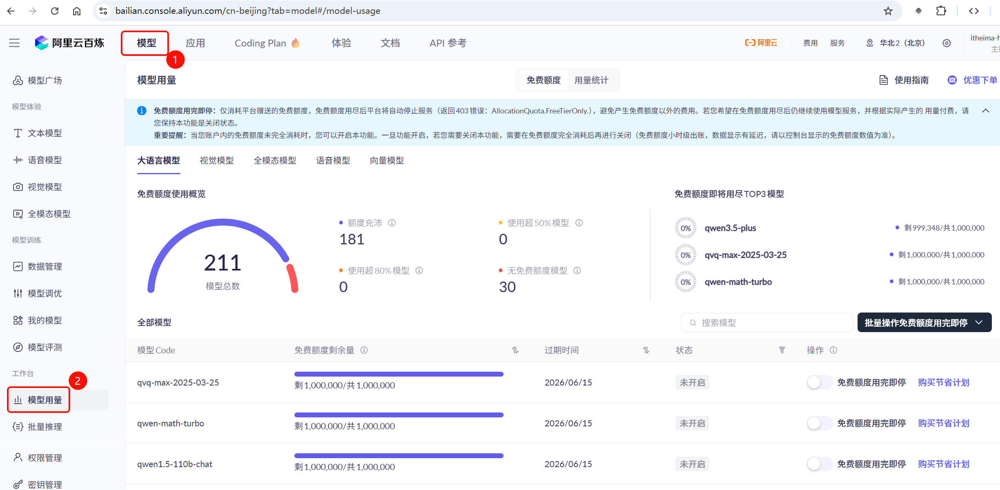


由于阿里爸爸免费赠送了额度，所以我们就跳过充值的过程了。😊


### 申请API\_KEY

注册账号以后还需要申请一个API\_KEY才能访问百炼平台的大模型。


注册成功后进入阿里云百炼首页，点击模型：

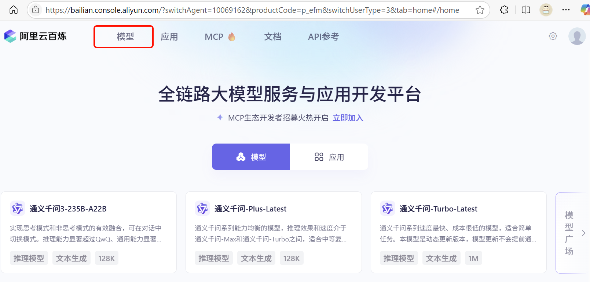


在阿里云百炼平台的左侧菜单的最下方，有一个《密钥管理》选项：

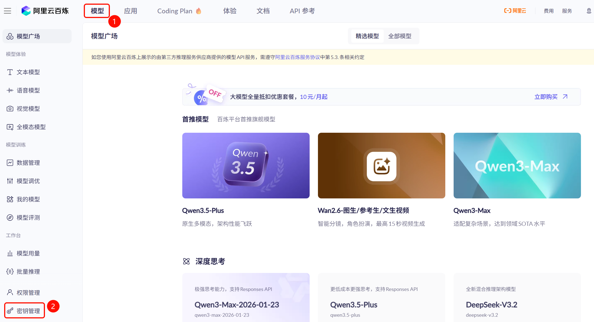


点击后，进入《密钥管理》页面，点击创建`API-KEY`：

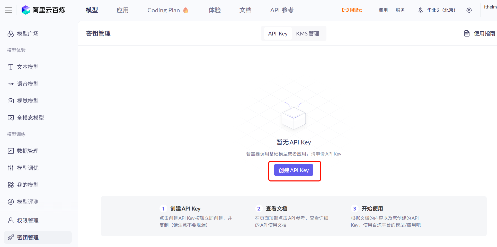

选择`创建API-KEY`后，会弹出表单，只有一个选项，勾选后点击确定即可：

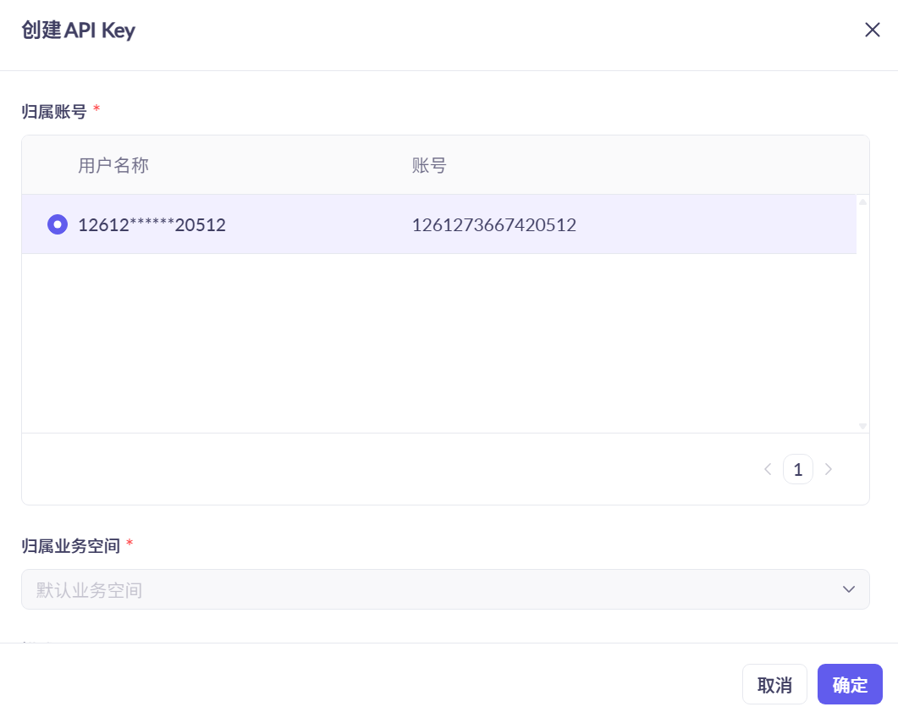

点击确定，即可生成一个新的`API-KEY`：

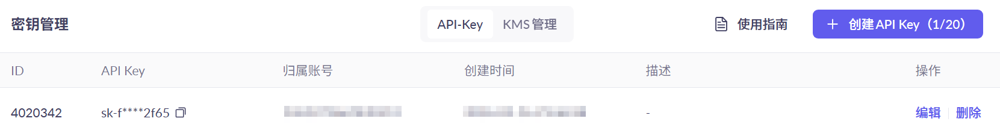

后续开发中就需要用到这个`API-KEY`了，一定要记牢。而且要保密，不能告诉别人。


### 体验模型

访问百炼平台，点击模型：


即可进入模型广场：

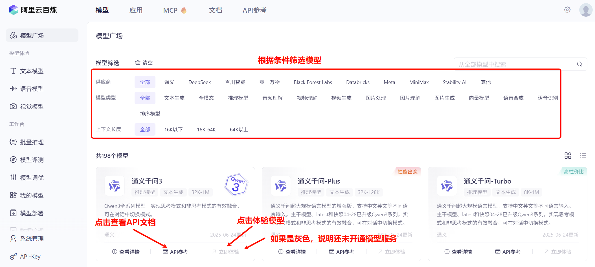


### API文档

点击API参考即可进入API文档页面：

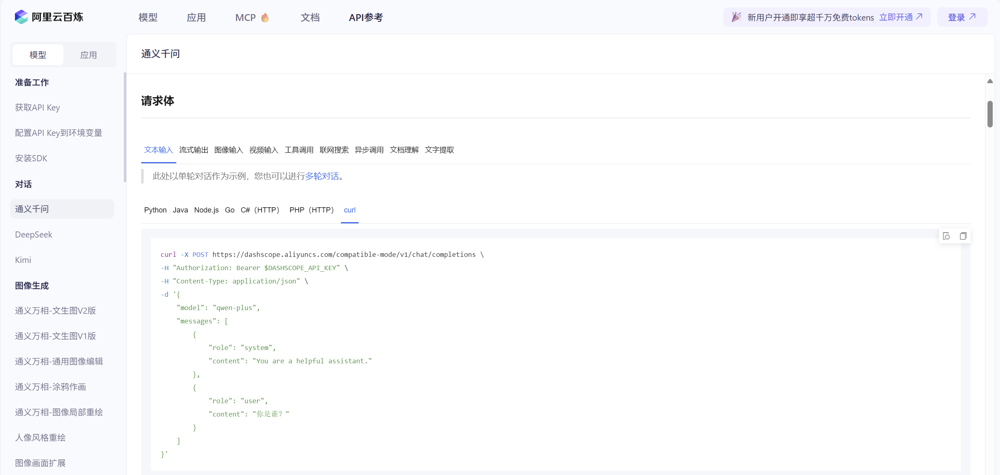


### 测试

我们使用Http客户端来调试（**不要忘了设置API\_KEY**）：

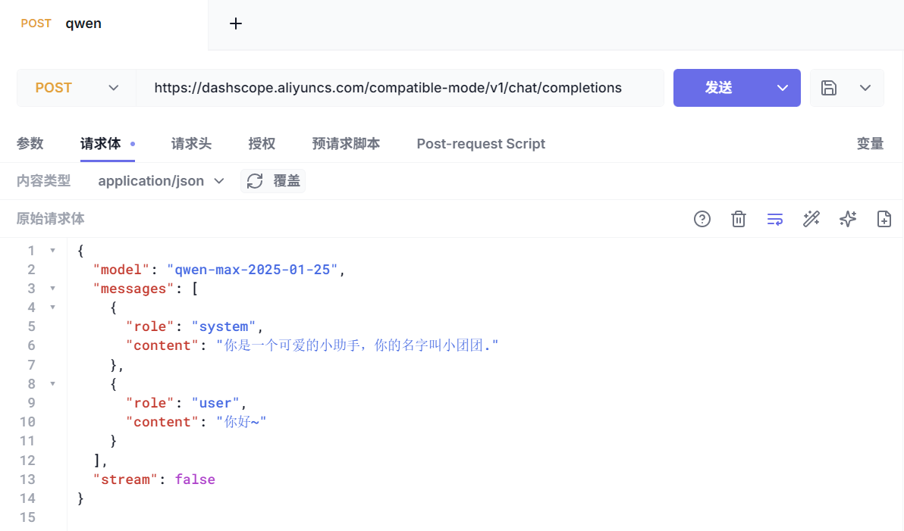


## 本地部署

很多云平台都提供了一键部署大模型的功能，这里不再赘述。我们重点讲讲如何手动部署大模型。


手动部署最简单的方式就是使用Ollama，这是一个帮助你部署和运行大模型的工具。官网如下：

[https://ollama.com/]()


### 下载安装ollama

首先，我们需要下载一个Ollama的客户端，在官网提供了各种不同版本的Ollama，大家可以根据自己的需要下载。

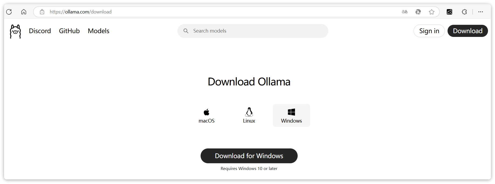

下载后双击就会弹出安装界面：

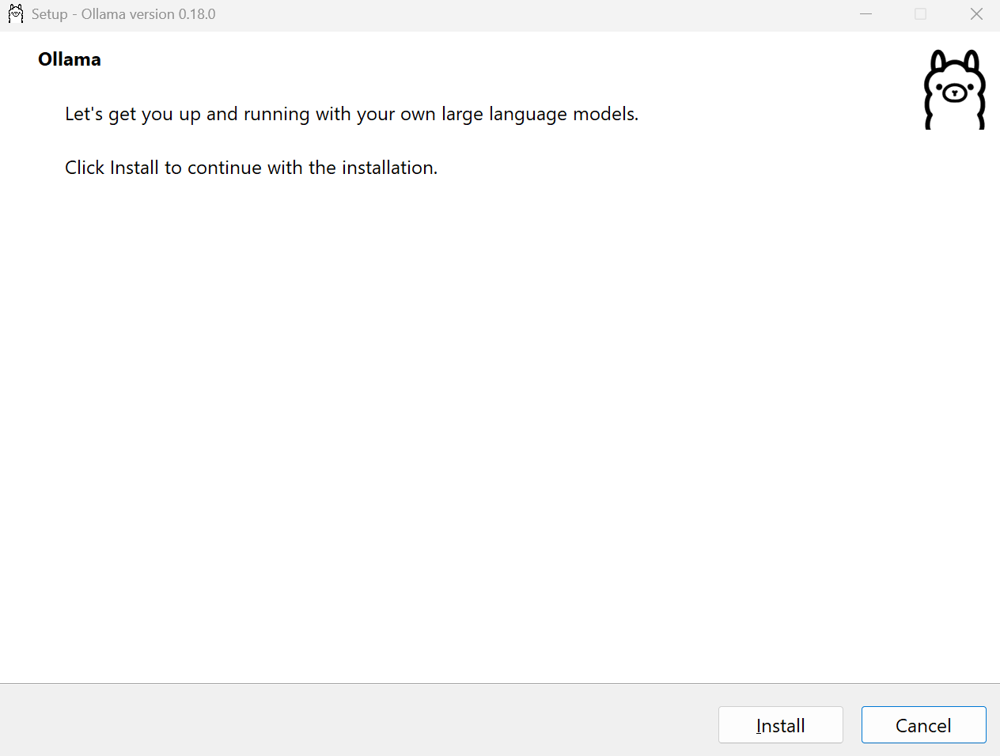


**注意：**

Ollama默认安装目录是C盘的用户目录，如果**不希望安装在C盘**的话（其实C盘如果足够大放C盘也没事），就不能直接双击安装了。需要通过**命令行安装**。

命令行安装方式如下：

在OllamaSetup\.exe所在目录打开cmd命令行，然后命令如下： 

```Bash
OllamaSetup.exe /DIR=你要安装的目录位置
```

运行命令后，同样会弹出刚才的安装窗口，但是安装的位置已经是你设定的位置了。


点击Install即可安装，可以看到安装目录是自定义的D盘，而不是C盘：

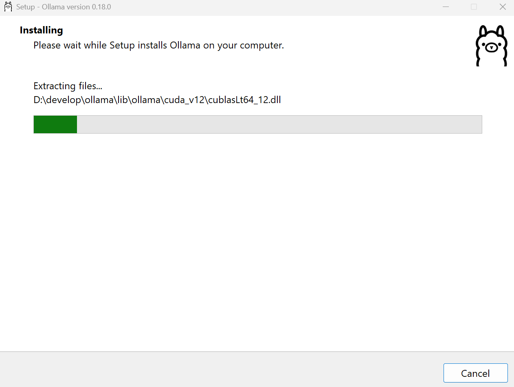

OK，安装完成后，还需要配置一个环境变量，更改Ollama下载和部署模型的位置。环境变量如下：

```Bash
OLLAMA_MODELS=你想要保存模型的目录
```

环境变量配置方式相信学过Java的都知道，这里不再赘述，配置完成如图：

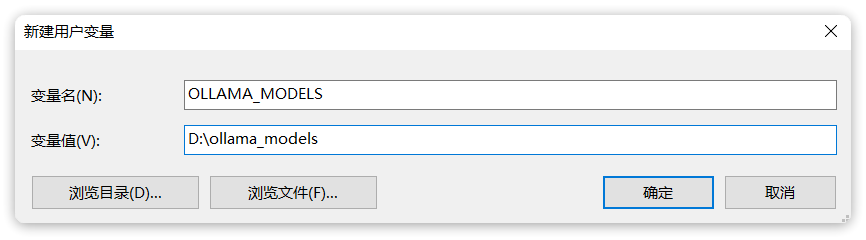


### 搜索模型

ollama是一个模型管理工具和平台，它提供了很多国内外常见的模型，我们可以在其官网上搜索自己需要的模型：

[https://ollama.com/search]()

如图，搜索deepseek，可以看到排在第一的是deepseek\-r1：

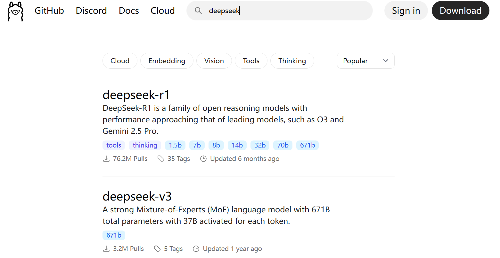


点击进入deepseek\-r1页面，会发现deepseek\-r1也有很多版本：

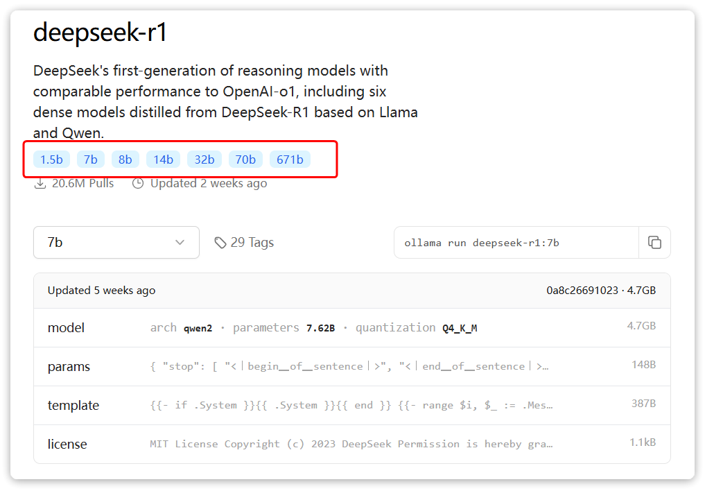


这些就是模型的参数大小，越大推理能力就越强，需要的算力也越高。671b版本就是最强的满血版deepseek\-r1了。需要注意的是，Ollama提供的DeepSeek是量化压缩版本，对比官网的蒸馏版会更小，对显卡要求更低。对比如下：

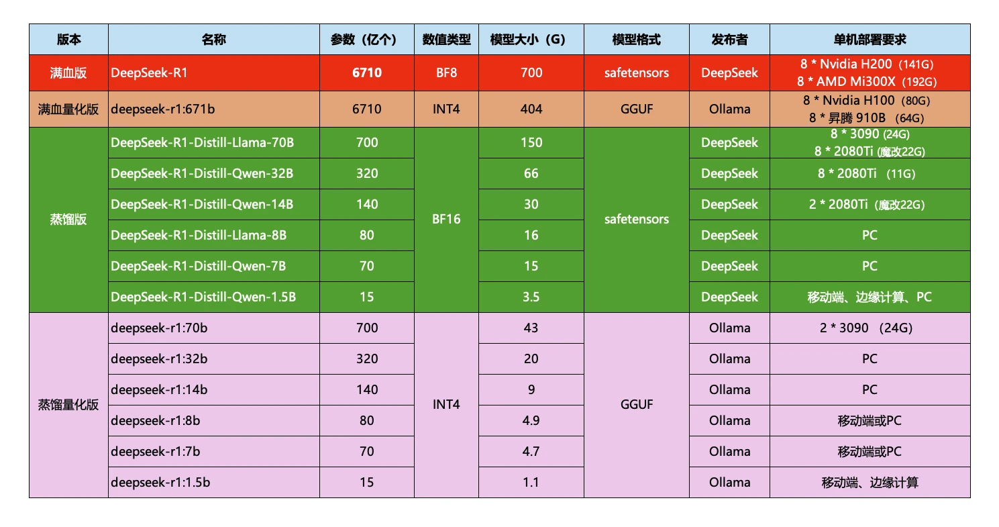

比如，我的电脑内存32G，显存是6G，我选择部署的是7b的模型，当然8b也是可以的，差别不大，都是可以流畅运行的。


### 运行模型

选择自己合适的模型后，ollama会给出运行模型的命令：

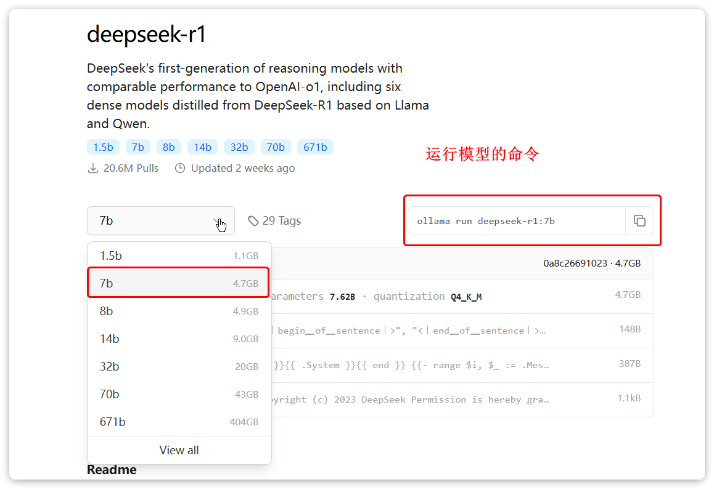

复制这个命令，然后打开一个cmd命令行，运行命令即可，然后你就可以跟本地模型聊天了：

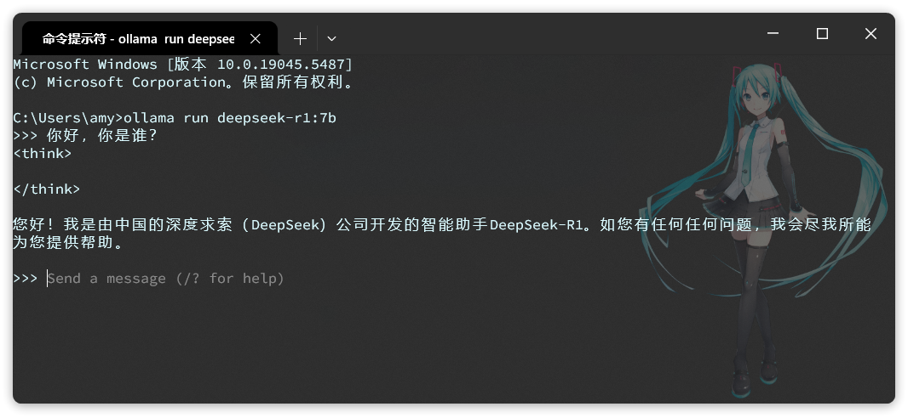

**注意：**

- 首次运行命令需要下载模型，根据模型大小不同下载时长在5分钟\~1小时不等，请耐心等待下载完成。

- ollama控制台是一个封装好的AI对话产品，与ChatGPT类似，具备会话记忆功能。

- ollama也提供了供程序访问的HTTP接口，默认地址是http://127\.0\.0\.1:11434/api/chat


Ollama是一个模型管理工具，有点像Docker，而且命令也很像，比如：

```Bash
ollama serve      # Start ollama
  ollama create     # Create a model from a Modelfile
  ollama show       # Show information for a model
  ollama run        # Run a model
  ollama stop       # Stop a running model
  ollama pull       # Pull a model from a registry
  ollama push       # Push a model to a registry
  ollama list       # List models
  ollama ps         # List running models
  ollama cp         # Copy a model
  ollama rm         # Remove a model
  ollama help       # Help about any command
```


### 测试API

Ollama在本地部署时，会自动提供模型对应的Http接口，访问地址是：http://localhost:11434/api/chat

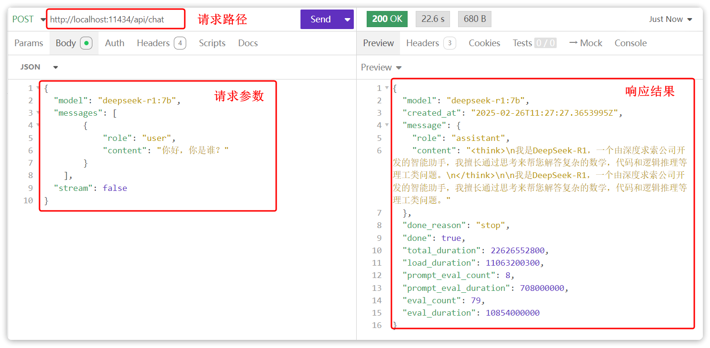


# 大模型API

前面说过，大模型开发并不是在浏览器中跟AI聊天。而是通过**访问模型对外暴露的API接口，实现与大模型的交互**。

所以要学习大模型应用开发，就必须掌握模型的API接口规范。


目前大多数大模型都遵循OpenAI的接口规范，是基于Http协议的接口。因此请求路径、参数、返回值信息都是类似的，可能会有一些小的差别。具体需要查看大模型的官方API文档。


## 大模型接口规范

我们以DeepSeek官方给出的文档为例：

```Bash
curl -X POST https://api.deepseek.com/chat/completions \
  -H "Content-Type: application/json" \
  -H "Authorization: Bearer <DeepSeek API Key>" \
  -d '{
          "model": "deepseek-chat",
          "messages": [
              {
                  "role": "system",
                  "content": "You are a helpful assistant."
              },
              {
                  "role": "user",
                  "content": "Hello!"
              }
          ],
          "stream": false
      }'
```


### **接口说明**

- **请求方式**：通常是POST，因为要传递JSON风格的参数

- **请求URL**：与平台有关

  - DeepSeek官方平台：https://api\.deepseek\.com/chat/completions

  - 阿里云百炼平台：https://dashscope\.aliyuncs\.com/compatible\-mode/v1

  - 本地ollama部署的模型：http://localhost:11434

- **请求头**：开放平台都需要提供API\_KEY来校验权限，本地ollama则不需要

  - Content\-Type: application/json，请求参数的格式，必须是application/json，稍后解释

  - Authorization: Bearer \<DeepSeek API Key\>，上一节创建的API\_KEY

- **请求参数**：JSON格式：

  ```JSON
  {
      "model": "deepseek-chat",
      "messages": [
        {"role": "system", "content": "You are a helpful assistant."},
        {"role": "user", "content": "Hello!"}
      ],
      "stream": false
  }
  ```

  - `model`：模型名称，DeepSeek支持`deepseek-reasoner`和`deepseek-chat`两者模型

  - `messages`：发送给大模型的消息，`[]`是数组的意思，里面可以有多条消息。消息结构：

    - `content`：是消息的内容

    - `role`：消息的角色，有system、user、assisant三种角色

      - `system`：是给大模型设定一个角色，比如你让她扮演你的奶奶，让她哄你睡觉

      - `user`：就是用户提问的问题

      - `assisant`：是大模型的回答

  - `stream`：true，代表响应结果流式返回；false，代表响应结果一次性返回，但需要等待


注意，这里请求参数中的messages是一个消息数组，而且其中的消息要包含两个属性：

- role：消息对应的角色

- content：消息内容


其中System和User消息的内容，也被称为**提示词**（**Prompt**），也就是用户发送给大模型的**指令**。

- System提示词，是系统指令，给大模型设定一个角色，比如你让她扮演你的奶奶，让她哄你睡觉

- User提示词，是用户指令，也就是用户向大模型的提问或命令


### 提示词角色

通常消息的角色有三种：

| 角色          | 描述                                                         | 示例                                                         |
| ------------- | ------------------------------------------------------------ | ------------------------------------------------------------ |
| **system**    | 优先于user指令之前的指令，也就是给大模型设定角色和任务背景的系统指令 | 你是一个乐于助人的编程助手，你以小团团的风格来回答用户的问题。 |
| **user**      | 终端用户输入的指令（类似于你在ChatGPT聊天框输入的内容）      | 写一首关于Java编程的诗                                       |
| **assistant** | 由大模型生成的消息，可能是上一轮对话生成的结果               | 注意，用户可能与模型产生多轮对话，每轮对话模型都会生成不同结果。 |


其中System类型的消息非常重要！影响了后续AI会话的行为模式。


比如，我们会发现，当我们询问这些AI对话产品“**你是谁**”这个问题的时候，每一个AI的回答都不一样，这是怎么回事呢？


这其实是因为AI对话产品并不是直接把用户的提问发送给LLM，通常都会在user提问的前面通过System消息给模型设定好背景：

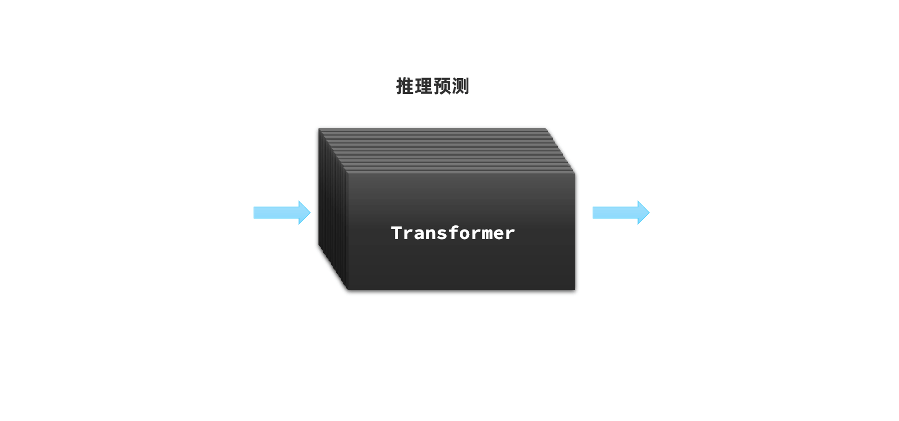

所以，当你问问题时，AI就会遵循System的设定来回答了。因此，不同的大模型由于System设定不同，回答的答案也不一样。


**示例**：

```Bash
## Role
**System**: 你是一家名为《黑马程序员》的职业教育培训公司的智能客服，你的名字叫小黑。请以友好、热情的方式回答用户问题。
## Example
**User**: 你好
**Assisant**: 你好，我是小黑，很高兴认识你！😊 你是想了解我们的课程信息，还是有其他关于职业培训的问题需要咨询呢？无论什么问题，我都会尽力帮你解答哦！
```


## 会话记忆问题

这里还有一个问题：

> 我们为什么要把历史消息都放入Messages中，形成一个数组呢？
>
> 


大模型的API接口是"**无状态**"的，服务端不会记录用户请求的上下文。因此我们调用API接口与大模型对话时，每一次对话信息都不会保留，多次对话之间都是独立的，没有关联的。

因此大模型并不知道之前的聊天历史，也就是说**大模型是没有记忆**的。


测试，我询问AI一个问题：`12个苹果分给3个人，每人能分几个？`

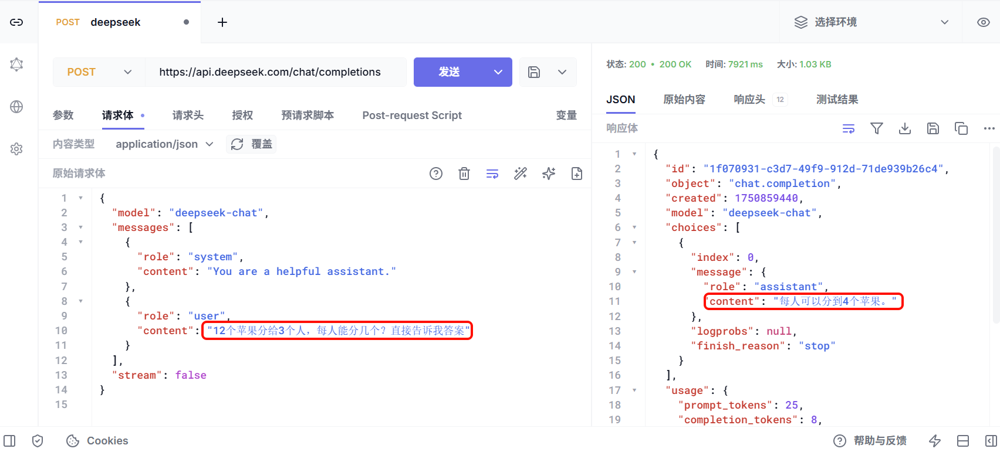

AI的答案是：`每人可以分到4个苹果。`


我们接着问：`如果是分给4个人呢？`，由于AI没有记忆，它不知道我是接着上一题问的，因此不知道要分的是12个苹果，答案就有问题：

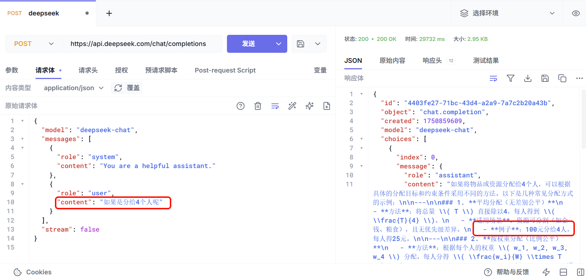

可以看到，AI完全不知道我们聊天的背景是上一次的分12个苹果。


那么，如何才能让AI具备记忆呢？


要想让大模型有记忆，必须**在每次请求时，将之前所有对话的历史拼接好，传递给对话API接口**。


官方文档说明：

[https://api-docs.deepseek.com/zh-cn/guides/multi_round_chat]()


要想让AI具备记忆，就必须把对话历史都添加到请求体中的messages数组中，像这样：

```JSON
{
    "model": "deepseek-chat",
    "messages": [
      {"role": "system", "content": "You are a helpful assistant."},
      {"role": "user", "content": "12个苹果分给3个人，每人能分几个？直接告诉我答案"},
      {"role": "assistant", "content": "每人可以分到4个苹果。"},
      {"role": "user", "content": "如果是分给4个人呢？"}
    ],
    "stream": false
  }
```

测试结果：

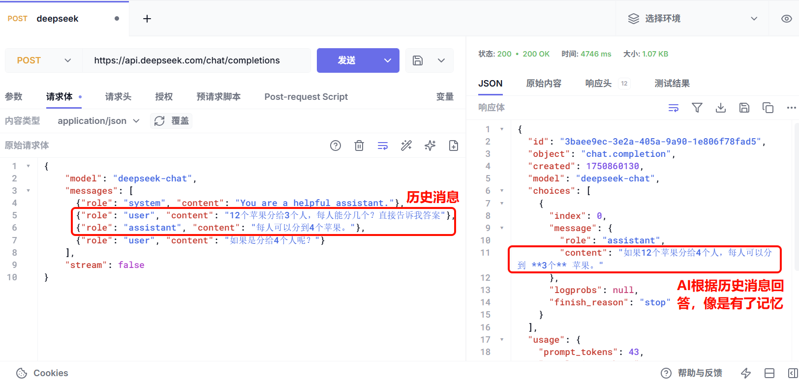


好了，现在我们能用图形界面的Http客户端发送http请求，调用大模型了。


但是这样还不够，如果要开发AI应用，肯定是要通过编程的方式发送Http请求，调用大模型。


## 开发环境准备

现在，我们已经掌握了大模型提供的API接口规范了，不过，最终我们还是要用编程的方式来访问大模型。


所以，接下来就让我们准备好开发的 环境吧。


### 安装UV

Python的环境管理方案有很多种，例如：

- pip

- uv

- conda

- \.\.\.

在后面的课程中我们会选择uv作为项目管理工具，其官网如下：

[https://docs.astral.sh/uv/]()

还有个第三方写的中文文档：

[https://uv.doczh.com/]()


它有非常多的优点：

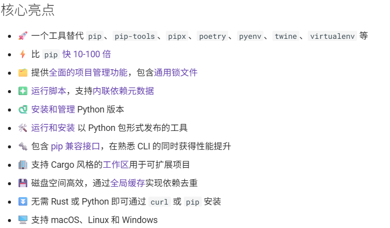


具体的安装方式大家可以参考官方文档：

[https://uv.doczh.com/getting-started/installation/]()

最简单的安装方案就是使用pip：

```Bash
pip install uv
```


详细教程可以参考视频：

[https://www.bilibili.com/video/BV1Stwfe1E7s/?spm_id_from=333.1387.search.video_card.click]()


### 添加镜像源

默认情况下，uv下载依赖是到国外站点：https://test\.pypi\.org/simple，速度很慢。推荐大家将下载的镜像源改为国内站点。


uv支持项目级配置和系统级配置两种方案，项目级优先级高，但是需要每个项目都配置，比较麻烦。推荐采用系统级配置。


系统配置方式如下：

- Windows系统，在CMD运行如下命令：

  ```Bash
  setx UV_DEFAULT_INDEX "https://pypi.tuna.tsinghua.edu.cn/simple"
  ```

- MacOS或Linux系统：

  ```Bash
  echo 'export UV_DEFAULT_INDEX=https://pypi.tuna.tsinghua.edu.cn/simple' >> ~/.zshrc && source ~/.zshrc
  ```


常见的国内镜像站点有：

**阿里云**

```Plain Text
https://mirrors.aliyun.com/pypi/simple/
```

**腾讯云**

```Plain Text
https://mirrors.cloud.tencent.com/pypi/simple/
```

**火山引擎**

```Plain Text
https://mirrors.volces.com/pypi/simple/
```

**华为云**

```Plain Text
https://mirrors.huaweicloud.com/repository/pypi/simple/
```

**清华大学**

```Plain Text
https://pypi.tuna.tsinghua.edu.cn/simple/
```

**中国科学技术大学**

```Plain Text
https://pypi.mirrors.ustc.edu.cn/simple/
```


### 创建项目

接下来我们就创建一个项目，我们会使用PyCharm作为开发工具，以uv作为项目管理工具。


第一步，打开PyCharm，创建Project：

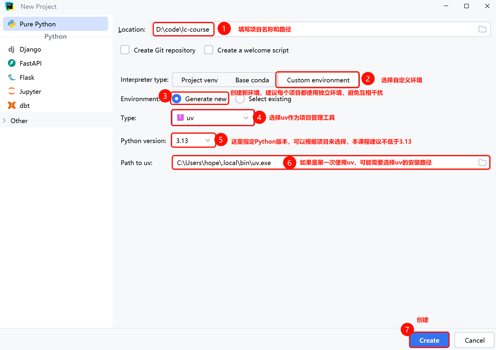


为了方便大家学习，我们会使用jupyter，所以需要在项目中引入notebook依赖。


在PyCharm中，左侧有一个Terminal按钮，点击即可打开终端：

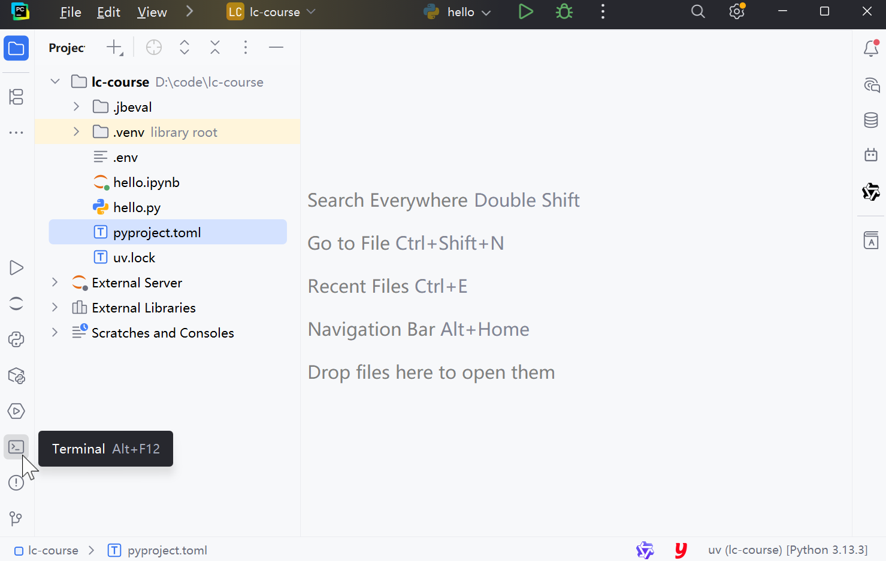

如图：

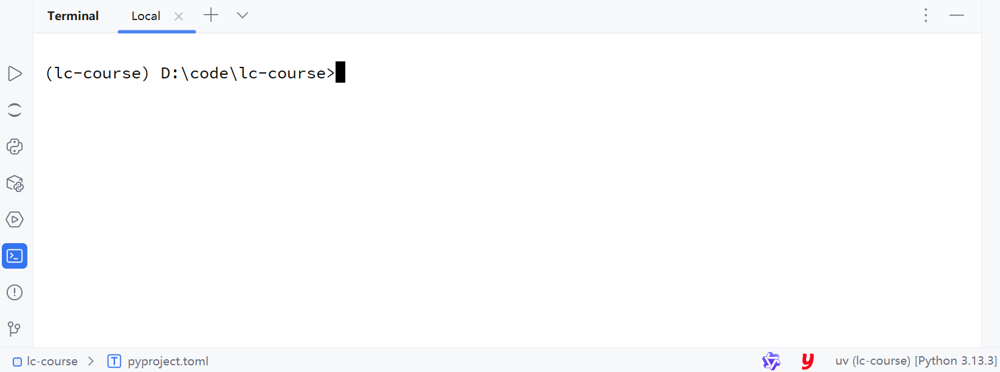

在终端中输入命令：

```Bash
uv add notebook
```


### 测试

为了测试环境，我们创建一个notebook试试：

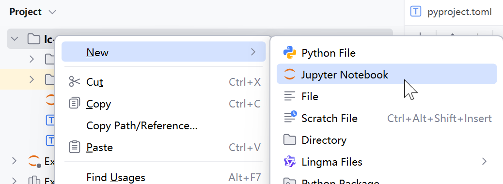

起名为`hello`：


如图：

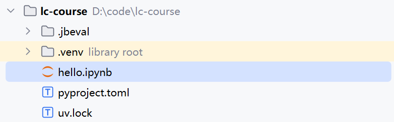

然后在代码框中编写打印HelloWorld的代码，快捷键`SHIFT `\+ `ENTER`即可运行：：

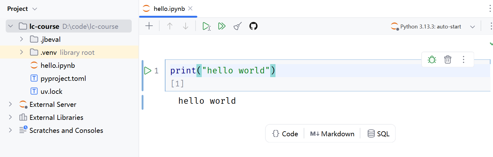


## OpenAI

OpenAI作为全球最早，也是最火的大模型公司之一，占据了先发优势。因此其制定的API规范几乎成为了大模型API的默认规范，几乎所有的大模型API都兼容OpenAI的规范。


在任何模型的官方文档中都能看到基于OpenAI提供的SDK的代码示例，例如DeepSeek：

[https://api-docs.deepseek.com/zh-cn/]()


本节我们来学习如何使用OpenAI提供的SDK工具来访问大模型。


### 基本使用

首先，我们需要安装OpenAI的SDK，以python为例：

- 使用pip安装：

  ```Bash
  pip install openai
  ```

- 使用uv安装：

  ```Bash
  uv add openai
  ```


接下来，就可以使用SDK调用任何兼容OpenAI规范的模型了，只要将base\_url和api\_key设定为对应的模型提供者的url和api\_key即可：

```Python
from openai import OpenAI
client = OpenAI(
    api_key="sfxxxxx",
    base_url="https://api.deepseek.com"
)

print("🚀 正在调用大模型...")
response = client.chat.completions.create(
    model="deepseek-chat",
    messages=[
        {"role": "system", "content": "你是一名友好的AI助教。"},
        {"role": "user", "content": "你好，你是谁?"}
    ],
    stream=False
)

print(response)
```


### 环境变量

将api\_key直接写在代码中非常危险，所以通常我们都将其写入环境变量，程序运行时加载。


**第一步，配置环境变量**。

在项目根目录创建一个\.env文件：

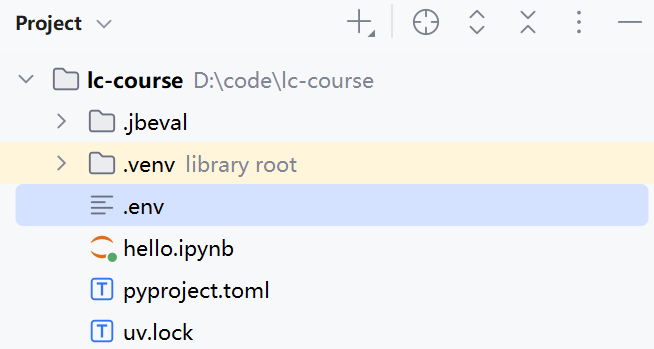

在其中配置自己的API\_KEY，我们以Deepseek为例：

```Properties
*# deepseek*
DEEPSEEK_API_KEY=sk-1234567890

*# 阿里云*
DASHSCOPE_API_KEY=sk-1234567890
```


**第二步，安装python\-dotenv**。

在项目中，我们通过`python-dotenv`库来读取环境变量，所以要先安装依赖。

```Bash
uv add python-dotenv
```

安装成功后，会在pyproject\.toml中看到新添加的依赖：

```Java
[project]
name = "lc-course"
version = "0.1.0"
description = "Add your description here"
requires-python = ">=3.13"
dependencies = [
    "notebook>=7.5.5",
    "openai>=2.28.0",
    "python-dotenv>=1.2.2",
]
```


**第三步，读取环境变量。**

最后，我们就可以在代码中读取环境变量了：

```Python
from openai import OpenAI
from dotenv import load_dotenv
import os

*# 加载环境变量*
load_dotenv()

client = OpenAI(
    api_key=os.getenv("DEEPSEEK_API_KEY"),
    base_url="https://api.deepseek.com"
)

print("🚀 正在调用大模型...")
response = client.chat.completions.create(
    model="deepseek-chat",
    messages=[
        {"role": "system", "content": "你是一名友好的AI助教。"},
        {"role": "user", "content": "你好，你是谁?"}
    ],
    stream=False
)

print(response)
```


