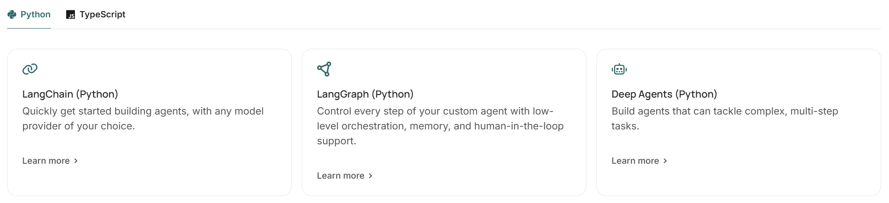
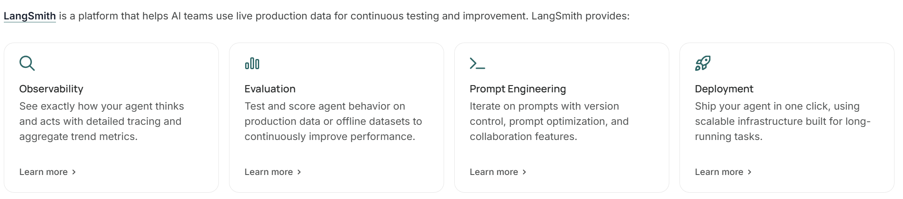
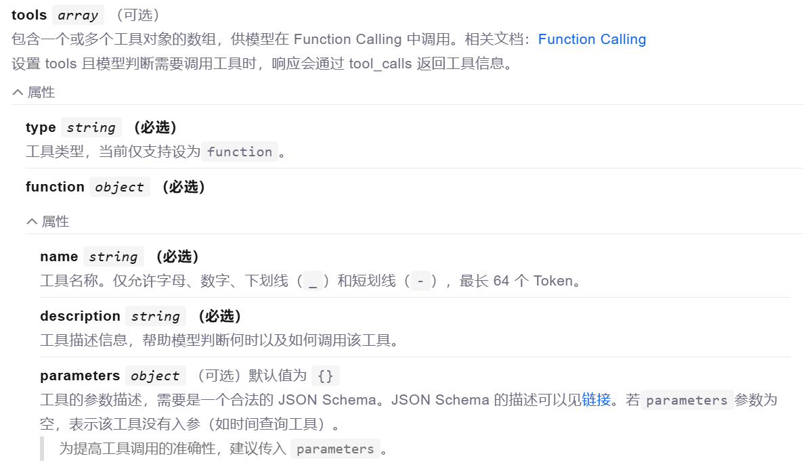
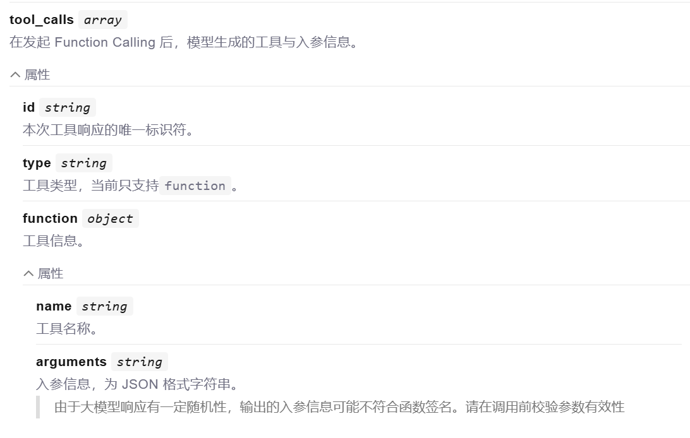
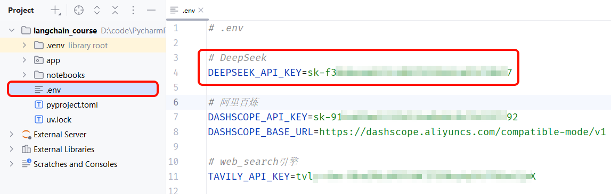
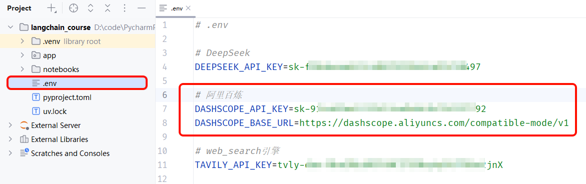
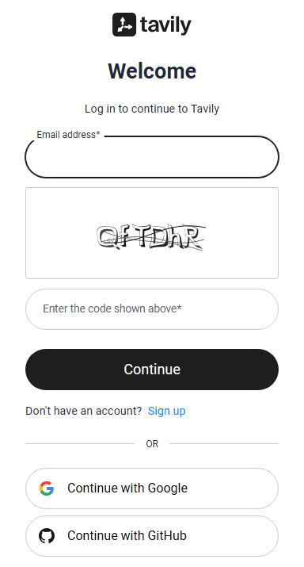
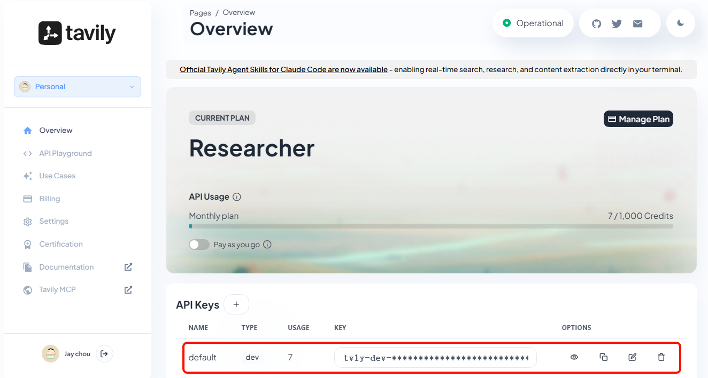

# 第1节\. LangChain核心组件

# 认识**LangChain**

LangChain 由 Harrison Chase 创建于2022年10月，是用于开发**智能体工程（Agent Engineering）**的平台**。**

官网地址：

[https://www.langchain.com/]()

官网文档：

[https://docs.langchain.com/]()


## 架构体系

**LangChain**并不仅仅是一个框架，而是一整个智能体开发平台，包含很多不同的组件。


其中，包含一系列开源的**智能体（Agent）**开发框架，而且兼容Python和TypeScript两种语言：



- LangChain：用于快速构建智能体，可兼容任何模型提供商。

- LangGraph：从底层一步步控制智能体的构建，包括记忆（Memory）、人机协同（HITL）等

- Deep Agents：用于构建复杂的、处理多步骤的任务的智能体


另外，LangChain还包含一套帮助人工智能团队利用实时生产数据进行**持续测试和改进**的平台，叫做LangSmith：




总结：

LangChain是智能体开发平台，包含一套各种帮助开发、测试、评估智能体的框架。核心包括：

- LangChain：用于快速构建智能体，可兼容任何模型提供商。

- LangGraph：从底层一步步控制智能体的构建，包括记忆（Memory）、人机协同（HITL）等

- Deep Agents：用于构建复杂的、处理多步骤的任务的智能体

- LangSmith：用于测试、观察、评估、部署智能体


可以看到，LangChain平台的所有框架都是围绕着构建智能体（Agent）这一目标的，那么问题来了：


> **什么是智能体（Agent）呢？**
>
> 


## 什么是Agent

什么是Agent，这其实没有一个标准的答案，每个人都有自己的理解。


对于这个问题，LangChain创始人[Harrison Chase](https://www.blog.langchain.com/tag/harrison-chase/)有一个偏向技术性的答案：

> An AI agent is a system that uses an LLM to decide the control flow of an application\.
>
> Agent是一种使用大语言模型（LLM）来决定应用程序控制流的系统。
>
> 


在人工智能领域，**Agent**（通常翻译为**智能体**或**代理**）是指**一种能够感知环境、进行推理、自主决策并采取行动以实现特定目标的智能系统。**


| **特性 **    | **传统聊天机器人/LLM** | **AI Agent**                   |
| ------------ | ---------------------- | ------------------------------ |
| **交互模式** | 被动响应，问一句答一句 | 主动规划，以目标为导向         |
| **执行力**   | 停留在文本生成层面     | 能操作软件、发送邮件、分析数据 |
| **自主性**   | 需要人类给出详细步骤   | 只需给定最终目标，自主寻找路径 |


如果说大模型（LLM）是“大脑”，那么 Agent 就是**“拥有手脚和思维逻辑的独立个体”**。它不再只是被动地回答问题，而是能主动拆解任务并调用各种工具来完成工作。


例如：要开发一个《AI旅游助手》的应用。

如果是**传统LLM应用**，程序流程是这样的：

> 1. 用户提出需求，例如：帮我计划一个5天的北京之旅，预算8000元，我喜欢历史。
>
> 2. 调用LLM，分析用户需求，直接由LLM生成一个简单旅游计划
>
> 

这个计划基于它训练数据中的通用知识，可能没有考虑当前的天气、景点是否关闭、门票是否可预订等实时信息。


如果是**Agent应用**，Agent可以自主规划程序流程：

> 1. 用户提出需求，例如：帮我计划一个5天的北京之旅，预算8000元，我喜欢历史。
>
> 2. Agent分析用户需求，分步执行：
>
>    1. 规划： 将大目标分解为：查询机票酒店价格 \-\> 查询天气和景点信息 \-\> 设计每日行程 \-\> 计算总预算。
>
>    2. 调用工具：
>
>       - 调用机票/酒店API，查询用户指定日期范围内的价格和可选酒店。
>
>       - 调用天气预报API，查询未来5天北京的天气，建议携带的衣物。
>
>       - 调用搜索引擎/景点API，查询故宫、国博等热门景点的最新开放时间、预约政策和当前展览。
>
>    3. 感知与反馈： 综合感知所有查询到的实时信息，生成一个动态的、可执行的计划。例如：“根据预算和您对历史的兴趣，我推荐入住胡同里的XX酒店。第一天去故宫，但请注意下周一故宫闭馆，所以调整到第二天……总花费预计7500元，还在预算内。需要我现在帮您预订酒店和机票吗？”
>
> 

Agent通过主动规划任务流程，主动使用工具，整合了实时信息，并进行了动态调整，最终产出的是一个真正可落地的方案。


总结如下：

- LLM = 聪明的大脑

- Agent = 聪明的大脑 \+ 手脚


当然，Agent的模式也是在不断演进的：

- 阶段一：ReAct \+ Tool Calling

- 阶段二：Reflection \+ Long Memory

- 阶段三：Multi Agent System，MAS


接下来，我们会从最简单的Agent开始学习，逐渐升级到更复杂的Agent结构。


## 快速入门

下面，我们通过一个快速入门，了解Agent的定义和工作流程。

### 准备工作

首先，要使用LangChain必须先安装依赖，命令如下：

```Python
uv add langchain
```


LangChain支持各种不同的模型，而且提供了对应的兼容SDK，不过也都需要安装对应依赖，你可以按需添加：

```Python
# 集成 DeepSeek
uv add langchain-deepseek

# 集成 OpenAI
uv add langchain-openai

# 集成 Anthropic
uv add langchain-anthropic
```


### 代码示例


接下来就可以开发Agent了，基本步骤如下：

1. 加载环境变量

2. 定义工具

3. 定义Agent

4. 调用Agent


Langchain提供了**create\_agent**方法用来快速创建Agent，我们只需要提供好Agent所需的**模型（Models）**、**工具（Tools）**即可。


示例代码如下：

```Python
*# 1.加载环境变量*
from dotenv import load_dotenv

load_dotenv()

*# 2.定义工具，基础版，通过注释描述工具*
@tool
def getWeather(location: str) -> str:
    *"""*
*    Get the weather in a given location.*
*    Args:*
*        location: city name or coordinates*
*    """*
*    *return f"Current weather in {location} is sunny"
    

*# 3.定义Agent*
agent = create_agent(
    "deepseek-chat", # 模型名称（必须是LangChain支持的模型）
    tools=[getWeather] # 工具集
)

# 4.调用模型
print("🚀 正在调用大模型...")
response = agent.invoke({
    "messages": [
        {"role": "user", "content": "杭州今天天气如何?"}
    ]
})

# 5.打印结果
print(response)
```


运行结果如下：

```Python
🚀 正在调用大模型...
{'messages': [HumanMessage(content='杭州今天天气如何?', additional_kwargs={}, response_metadata={}, id='216c9cd1-8ebc-4365-a192-6b1a30ae788c'), AIMessage(content='我来帮您查询杭州今天的天气情况。', additional_kwargs={'refusal': None}, response_metadata={'token_usage': {'completion_tokens': 51, 'prompt_tokens': 313, 'total_tokens': 364, 'completion_tokens_details': None, 'prompt_tokens_details': {'audio_tokens': None, 'cached_tokens': 256}, 'prompt_cache_hit_tokens': 256, 'prompt_cache_miss_tokens': 57}, 'model_provider': 'deepseek', 'model_name': 'deepseek-chat', 'system_fingerprint': 'fp_eaab8d114b_prod0820_fp8_kvcache', 'id': 'bbeda11e-7653-4c3d-9cc5-9a58491f63f0', 'finish_reason': 'tool_calls', 'logprobs': None}, id='lc_run--019c92f4-8395-7852-8e36-d4645f86d443-0', tool_calls=[{'name': 'getWeather', 'args': {'location': '杭州'}, 'id': 'call_00_H7Yklbf4osnSeFOj3k4TP33N', 'type': 'tool_call'}], invalid_tool_calls=[], usage_metadata={'input_tokens': 313, 'output_tokens': 51, 'total_tokens': 364, 'input_token_details': {'cache_read': 256}, 'output_token_details': {}}), ToolMessage(content='Current weather in 杭州 is sunny', name='getWeather', id='911eda0e-a5a8-4375-909d-b8707b3a08a9', tool_call_id='call_00_H7Yklbf4osnSeFOj3k4TP33N'), AIMessage(content='根据查询结果，杭州今天的天气是**晴朗**的。', additional_kwargs={'refusal': None}, response_metadata={'token_usage': {'completion_tokens': 13, 'prompt_tokens': 388, 'total_tokens': 401, 'completion_tokens_details': None, 'prompt_tokens_details': {'audio_tokens': None, 'cached_tokens': 320}, 'prompt_cache_hit_tokens': 320, 'prompt_cache_miss_tokens': 68}, 'model_provider': 'deepseek', 'model_name': 'deepseek-chat', 'system_fingerprint': 'fp_eaab8d114b_prod0820_fp8_kvcache', 'id': '692c1420-4a06-4080-adf7-54250207e86a', 'finish_reason': 'stop', 'logprobs': None}, id='lc_run--019c92f4-8d74-7770-89fd-da1e9d67efca-0', tool_calls=[], invalid_tool_calls=[], usage_metadata={'input_tokens': 388, 'output_tokens': 13, 'total_tokens': 401, 'input_token_details': {'cache_read': 320}, 'output_token_details': {}})]}
```


原本大模型不具备查询天气的能力，所以无法回答天气问题。但是，当我们提供了一个查询添加的Tool以后，它就能自动查询天气来回答问题，是不是很神奇。

那么，Agent是如何做到的呢？


传统的LLM应用都是一问一答的形式，模型只能根据自己的训练数据来回答，流程非常简单：


而智能体则可以调用工具与外界交互，获取实时信息，工作流程则要复杂很多，是这样的：

流程如下：

1. 用户提问（Input）：杭州今天天气如何？

2. 模型分析（Reasoning）：用户询问杭州天气，我不知道，需要调用查询天气的工具`get_weather`

3. 调用工具（Action）：调用工具，get\_weather，传入城市"杭州"

4. 分析结果（Observation）：工具返回结果，模型分析结果，判断是否足以回答用户问题

   1. 是：整理生成响应结果

   2. 否：重复前面步骤

5. 生成结果（Output）：根据工具的结果生成响应给用户


那么，模型是如何知道工具的信息的呢？


其实，在大模型提供的API接口中，有一个tools参数，描述了工具的详细信息：



所以，LangChain会帮助我们把tool的信息封装为此tool参数，与message一起发送给大模型，大模型就了解tool的详细信息，根据用户需求判断是否需要调用tool，需要调用哪个tool\.


那么问题来了，当大模型决定调用某个tool时，该如何调用呢？毕竟，tool是我们定义的，模型是没有调用能力的。

模型确实不能直接调用tool，只能返回字符串。但是它可以把要调用的tool信息、参数信息都以Json格式返回：



这样一来，LangChain就会帮我们解析响应结果中的Function信息，也就是tool信息，就知道了要调用哪个函数，以及参数是什么了。LangChain就会执行该函数，再把得到的结果再次发送给大模型。


具体的工作流程如图：


OK，弄明白了Agent的原理，我们不难发现，Agent中最重要的两个部分，就是：

- Model：负责推理分析、思考，相当于Agent的大脑

- Tools：负责执行任务，相当于Agent与外界交互的手脚

当然，Agent中肯定不止这两个部分，接下来，我们就逐一解析Agent创建的各个细节。


# 模型（Models）

这里说的模型，完整叫法是大语言模型（LLM）。它能够理解人类语言，使用人类语言生成内容、翻译、提取摘要、回答问题等。

不仅如此，现在大多数的模型还有一些特别能力：

- [Tool calling](https://docs.langchain.com/oss/python/langchain/models#tool-calling) \- 调用外部工具（例如查询数据库或调用 API），并在其回复中使用这些工具返回的结果。

- [Structured output](https://docs.langchain.com/oss/python/langchain/models#structured-output) \- 将模型的响应结果约束为遵循已定义的格式，例如：json

- [Multimodality](https://docs.langchain.com/oss/python/langchain/models#multimodal) \- 可以处理和返回文本以外的数据，如图像、音频和视频。

- [Reasoning](https://docs.langchain.com/oss/python/langchain/models#reasoning) \- 模型可以执行多步推理来得出结论。


可以说LLM就是Agent的大脑，是Agent的推理引擎。它驱动Agent做出每个决定：何时调用工具、调用哪个工具、如何解释结果，以及何时提供最终答案。


LangChain支持现在市面上大部分的大语言模型（LLM），并且提供了统一的模型调用接口。使您可以轻松访问许多不同的模型提供者，并且在模型之间进行试验和切换也变得很容易。


有关模型提供者（Model Providers）的信息和功能，请参阅langchain官网的 [chat model page](https://docs.langchain.com/oss/python/integrations/chat)\.


## 初始化模型

langchain提供了两种常见方法用来初始化模型：

- 使用`init_chat_model`函数，由langchain自动创建模型对象

- 使用不同模型对应的Model类，手动创建模型对象


### init\_chat\_model

在LangChain中开始使用独立模型的最简单方法是使用`init_chat_model`函数。


调用`init_chat_model`函数时，你需要从langchain支持的**模型提供者**（**Model Provider**）中选择一个模型，而langchain会自动初始化这个模型，非常方便。


例如，我们要使用Deepseek这个模型。

- **首先**，我们需要安装模型依赖：

  ```Bash
  uv add langchain-deepseek
  ```

- **然后**，我们要确保在项目的**\.env**环境中配置好**api\_key**:



    ```Shell
    DEEPSEEK_API_KEY=your-deepseek-api-key-here
    ```

- **最后**，就可以直接使用init\_chat\_model初始化模型了：

  ```Python
  *# 导入Langchain的初始化模型的函数*
  from langchain.chat_models import init_chat_model
  *# 加载环境变量*
  from dotenv import load_dotenv
  load_dotenv()
  
  *# 调用init_chat_model函数初始化模型，参数model用来指定模型名称，Langchain会根据模型名字自动设定base_url，并从环境变量中获取api_key*
  model = init_chat_model(model="deepseek-chat")
  ```

- **测试**，我们可以通过打印model的类型，查看生成的结果：

  ```Python
  print(type(model)) # <class 'langchain_deepseek.chat_models.ChatDeepSeek'>
  ```

可见，采用`init_chat_model`自动初始化模型时，模型的类型由LangChain通过模型名称自动推断。


如果要切换其它模型，我们只需要安装其它模型依赖，然后配置API\_KEY，改变模型名称即可，其它代码不用动。


### 自定义模型及参数

`init_chat_model`默认会根据模型名称自动确定**模型的提供者**、其`base_url`，并从env读取`api_key`，但前提是必须是langchain支持的模型提供者\([支持模型参考链接](https://reference.langchain.com/python/langchain/chat_models/base/init_chat_model)\)，例如：

- Openai

- Deepseek

- Google

- Anthropic

- \.\.\.

对于其它不支持的模型，我们必须自定义模型参数来访问。


例如，我们要访问阿里云百炼的qwen\-max，它就是不被langchain支持的模型，我们必须自定义模型参数来访问。

- 我们需要在环境变量中定义**api\_key**和**base\_url**

- 然后在`init_chat_model`中指定**model**、**model\_provider**、**base\_url**和**api\_key**


具体步骤如下：

- **首先，**在\.env中配置好`api_key`和`base_url`：



    ```Bash
    DASHSCOPE_API_KEY=sk-XXX
    DASHSCOPE_BASE_URL=https://dashscope.aliyuncs.com/compatible-mode/v1
    ```

- **然后，**手动读取环境变量中的`api_key`和`base_url`：

  ```Python
  *# 非支持模型无法自动加载环境遍历，我们需要自己加载环境变量中的base_url和api_key*
  import os
  
  base_url = os.getenv("DASHSCOPE_BASE_URL")
  api_key = os.getenv("DASHSCOPE_API_KEY")
  ```

- **最后，**调用init\_chat\_model，初始化模型：

  ```Python
  # 初始化模型
  model = init_chat_model(
      model="qwen-max", *# 模型名称，这里可以自定义，我们用的是阿里的qwen-max*
  *    *model_provider="openai", *# 如果是Langchain不支持的模型，需要指定模型提供者（虽然我们用的是阿里，但是阿里兼容openai，所以这里用openai，就是默认采用openai的API规范）*
  *    *base_url=base_url,
      api_key=api_key
  )
  ```

- **测试**，查看生成的模型类型：

  ```Python
  print(type(model)) # <class 'langchain_openai.chat_models.base.ChatOpenAI'>
  ```

可见，通过参数自定义模型时，模型的类型由`model_provider`参数类决定。


除了修改模型提供者以外，`init_chat_model`方法允许我们调整模型参数，例如：

- temperature: 控制生成文本的随机性，值越小越确定，值越大越随机

- max\_tokens: 控制生成文本的最大长度

- top\_p: 控制生成文本的多样性，值越小越多样，值越大越确定

- timeout: 控制生成文本的超时时间

- max\_retries: 控制生成文本的最大重试次数

- \.\.\.


示例：

```Python
*# 调用init_chat_model函数初始化模型，并设定模型参数*
model = init_chat_model(
    model="qwen-max", 
*    *model_provider="openai",
*    *base_url=base_url,
    api_key=api_key,
    temperature=1.5,
)
```


### 使用Model类

其实`init_chat_model`方法底层就是帮我们利用Model类创建对象。但只支持有限的模型。而在langchain的社区，除了langchain官方提供的Model，还有些类是社区提供，更丰富多样。


具体支持的模型，可以查看官网地址：https://docs\.langchain\.com/oss/python/integrations/chat


例如，我们使用社区版本的Model类来访问阿里云百炼的通义千问模型：


1. 首先，我们需要安装依赖

   1. LangChain社区依赖：

      ```Bash
      uv add langchain-community
      ```

   2. 阿里云百炼依赖：

      ```Bash
      uv add dashscope
      ```

2. 然后，我们就可以使用Model类初始化模型了

   ```Python
   from langchain_community.chat_models.tongyi import ChatTongyi
   
   *# 使用Model类初始化模型*
   model = ChatTongyi(
       model="qwen-plus"
       *# 其它模型参数...*
   )
   ```

3. 测试，查看生成的模型类型：

   ```Python
   *print(type(model)) # <class 'langchain_community.chat_models.tongyi.ChatTongyi'>*
   ```


## 访问模型

LangChain提供了两个不同的方法来访问模型：

- invoke：阻塞式访问

- stream：流式访问


### invoke

invoke方法是阻塞式调用，需要等待模型生成全部结果才会返回，等待时间较长。

```Python
# 调用invoke方法
response = model.invoke("月亮的首都是哪里？")

# 查看响应结果
print(response)
```


### stream

阻塞式调用需要等待较长时间才能看到AI返回的结果，而流式调用则可以实时看到AI返回的一个个词。

示例：

```Python
*# 通过.stream方法实现流式访问*
stream = model.stream("月亮的首都是哪里？")

# stream调用返回的结果是一个generator，方便我们循环获取结果
print(type(stream))

*# 遍历stream结果，实时打印AI的回复*
for chunk in stream:
    print(chunk.content, end="", flush=True)
```


## 在Agent中使用模型

Langchain提供了一个`create_agent`方法用来快速创建智能体。当我们创建Agent的时候，可以直接使用创建好的Model，也可以指定模型名，让Langchain自动初始化模型。


### 创建智能体


1. 创建智能体，指定模型名，由Langchain初始化模型

```Python
from langchain.agents import create_agent

*# 1.指定Model名称，由LangChain自动初始化模型*
agent = create_agent(model="deepseek-chat")
```


2. 创建智能体，并使用创建好的model

```Python
from langchain.agents import create_agent
from langchain_community.chat_models.tongyi import ChatTongyi

*# 1.使用Model类初始化模型*
model = ChatTongyi(
    model="qwen-plus"
    *# 其它模型参数...*
)

*# 2.使用初始化好的model创建智能体*
agent = create_agent(model=model)
```


### 调用智能体

智能体也分为阻塞调用和流式调用两种。


1. 阻塞式调用，使用invoke方法：

   ```Python
   # 2.调用模型，需要传入一个消息列表
   response = agent.invoke({
       "messages": [{"role": "user", "content": "月亮的首都是哪里？"}]
   })
   
   print(response)
   ```

2. 流式调用，只需要把调用方式改为`stream`：

   ```Python
   for token, metadata in agent.stream(
       {"messages": [{"role": "user", "content": "月亮的首都是哪里？"}]},
       stream_mode="messages"
   ):
       if token.content:  *# Check if there's actual content*
   *        *print(token.content, end="", flush=True)  *# Print token*
   ```

要注意，Agent的stream模式同样返回一个generator，但是其结构由`stream_mode`参数决定：

- messages: 返回LLM生成的每一个片段，是一个包含token和metadata的元组（Tuple）

- updates: 返回Agent运行过程中的每一次事件，例如与LLM的对话、工具的调用等

- custom: 返回通过stream writer记录的每一次自定义的输出


如果是为了流式输出AI返回的结果，使用messages模式即可。


## 总结

目前为止，我们学习了：

- 如何使用init\_chat\_model初始化模型

- 如何使用Model类初始化模型

- 如何调用模型

- 如何创建Agent，并在Agent中使用模型

- 如何调用Agent


# 消息（Messages）

在调用模型时，发送给LLM的消息、LLM返回的消息都包含以下几部分内容：

- role：消息所属角色，可以是system、user、assistant

- content：消息的内容

- metadata（可选）：消息的元数据，例如：消息的ID、消耗的token等


之前我们都是自己用dict模拟消息：

```Python
response = agent.invoke({
    "messages": [{"role": "user", "content": "月亮的首都是哪里？"}]
})
```

这太麻烦了。在LangChain中发送给LLM的消息、LLM返回的消息都统一被封装为BaseMessage，它是中基本的上下文单元。


## 消息类型

在LangChain中，我们并不需要自己创建BaseMessage对象，LangChain已经把常见消息根据角色（Role）创建了对应的BaseMessage的子类：

- SystemMessage：role是system，代表系统消息，用于设定模型角色和交互背景

- HumanMessage：role是user，代表用户输入的消息

- AIMessage：role是assistant，代表LLM生成的响应，包含：文本、工具调用、元数据

- ToolMessage：role是tool，代表工具调用时产生的结果


所以，我们可以这样传递消息列表：

```Python
from langchain.messages import HumanMessage, AIMessage
from langchain.agents import create_agent

*# 创建Agent*
agent = create_agent(model="deepseek-chat")

*# 调用Agent，发送消息*
response = agent.invoke({
    "messages": [
        HumanMessage(content="你好，我是虎哥"),
        AIMessage(content="你好，虎哥，很高兴认识你。"),
        HumanMessage(content="我的名字是什么？")
    ]
})

print(response)
```

注意看，Agent的返回结果中包含完整的消息列表（Messages）：

```Plain Text
{'messages': [HumanMessage(content='你好，我是虎哥', additional_kwargs={}, response_metadata={}, id='f5703ee9-f567-48d6-8e07-e6ddaf24547e'), AIMessage(content='你好，虎哥，很高兴认识你。', additional_kwargs={}, response_metadata={}, id='5c654447-828c-43b7-9505-a341e0d21b8a', tool_calls=[], invalid_tool_calls=[]), HumanMessage(content='我的名字是什么？', additional_kwargs={}, response_metadata={}, id='a3390334-85b8-4f5f-8528-782a18671ac9'), AIMessage(content='你刚才提到你的名字是“虎哥”。如果这是你希望我称呼你的方式，我会记住的。如果有其他偏好，随时告诉我哦！ 😊', additional_kwargs={'refusal': None}, response_metadata={'token_usage': {'completion_tokens': 33, 'prompt_tokens': 26, 'total_tokens': 59, 'completion_tokens_details': None, 'prompt_tokens_details': {'audio_tokens': None, 'cached_tokens': 0}, 'prompt_cache_hit_tokens': 0, 'prompt_cache_miss_tokens': 26}, 'model_provider': 'deepseek', 'model_name': 'deepseek-chat', 'system_fingerprint': 'fp_eaab8d114b_prod0820_fp8_kvcache', 'id': '9ea39267-c54a-4523-82e0-1377435ffde4', 'finish_reason': 'stop', 'logprobs': None}, id='lc_run--019cad79-8b7a-7861-855b-5a87ba11d38c-0', tool_calls=[], invalid_tool_calls=[], usage_metadata={'input_tokens': 26, 'output_tokens': 33, 'total_tokens': 59, 'input_token_details': {'cache_read': 0}, 'output_token_details': {}})]}
```

我们可以通过遍历Messages数组，更友好的打印结果：

```Python
for message in response['messages']:
    message.pretty_print()
```

结果：

```Plain Text
================================ Human Message =================================

你好，我是虎哥
================================== Ai Message ==================================

你好，虎哥，很高兴认识你。
================================ Human Message =================================

我的名字是什么？
================================== Ai Message ==================================

你刚才提到你的名字是“虎哥”。如果这是你希望我称呼你的方式，我会记住的。如果有其他偏好，随时告诉我哦！ 😊
```


**提示**：

通过刚才的实现可以发现，拼接message列表可以让AI记住会话历史，产生记忆。不过手动拼接Message太麻烦了，后面我们学习如何实现自动的会话记忆功能。


## 多模态消息


之前我们都是向模型发送文本消息，但是 LangChain 也支持向模型发送多模态消息，比如图片、音频、视频、文本等。但前提是必须是多模态模型才支持。


一些支持多模态的模型有：

- qwen3\.5\-plus

- gpt\-5\-nano

- \.\.\.

我们以qwen3\.5\-plus为例，演示向模型发送图片消息


### 在线图片

首先，我们演示如何发送一个在线图片给模型，也就是指定模型的url地址。

图片如下：


消息格式如下：

```JSON
{
    "role": "user",
    "content": [
        {"type": "image", "url": "https://xxx.com/a.jpeg"},
        {"type": "text", "text": "这些图描绘了什么内容？"}
    ]
}
```


示例代码：

```Python
from langchain.chat_models import init_chat_model
import os

*# 1.初始化模型*
model = init_chat_model(
    model="qwen3.5-plus",  *# 这里选择qwen3.5-plus，这是一个多模态模型，支持图片、文本、音频、视频*
*    *model_provider="openai",
    base_url=os.getenv("DASHSCOPE_BASE_URL"),
    api_key=os.getenv("DASHSCOPE_API_KEY")
)

# 2.创建智能体
agent = create_agent(model=model)

# 3.*组织多模态消息*
multimodal_message = HumanMessage(
    content=[
        {"type": "image",
         "url": "https://help-static-aliyun-doc.aliyuncs.com/file-manage-files/zh-CN/20241022/emyrja/dog_and_girl.jpeg"},
        {"type": "text", "text": "这些图描绘了什么内容？"}
    ])

*# 4.调用Agent，发送多模态消息*
for token, metadata in agent.stream({
    "messages": [multimodal_message]
}, stream_mode="messages"):
    if token.content:
        print(token.content, end="", flush=True)
```

结果：

```Plain Text
这张图片描绘了一个非常温馨、和谐的场景，主要包含以下内容：

1.  **人物与动物**：
    *   一位年轻女性坐在沙滩上，她留着长发，身穿黑白格纹衬衫和深色长裤（裤脚卷起），看起来非常休闲。
    *   在她对面坐着一只体型较大的浅色犬（看起来像金毛寻回犬或拉布拉多），狗狗身上戴着带有彩色花纹的胸背带。

2.  **互动动作**：
    *   这是画面的核心：狗狗乖巧地抬起一只前爪，放在女子的手掌中，就像是在玩“握手”的游戏。
    *   女子面带灿烂的笑容，温柔地注视着狗狗，一只手握着狗爪，另一只手似乎拿着小零食或者正准备抚摸它。这展现了人与宠物之间亲密无间的信任与爱。

3.  **环境与背景**：
    *   场景设定在海滩上，地面是细腻的沙子，上面布满了脚印和纹理。
    *   背景是大海，可以看到海浪正在向岸边涌来。

4.  **光影与氛围**：
    *   光线非常温暖柔和，从画面右侧照射过来（看起来像是日落时分的“黄金时刻”），给女子的头发和沙滩镀上了一层金色的光晕。
    *   整体氛围宁静、美好且充满幸福感。

此外，还可以看到一条红色的牵引绳散落在狗狗身后的沙地上，说明它们正在享受一段放松的散步时光。
```


### 本地图片

所谓本地图片，就是用户上传的图片数据或者本地存在的图片，而不是图片的url地址。我们需要将图片数据转换成base64字符串，然后发送给模型。


本地图片的消息格式：

```JSON
{
    "role": "user",
    "content": [
        {"type": "text", "text": "Describe the content of this image."},
        {
            "type": "image",
            "base64": "AAAAIGZ0eXBtcDQyAAAAAGlzb21tcDQyAAACAGlzb2...",
            "mime_type": "image/jpeg",
        },
    ]
}
```


示例：

```Python
import base64

# 例如，有一个用户上传的文件，是字节格式img_bytes，*我们先将其进行base64编码*
img_b64 = base64.b64encode(img_bytes).decode("utf-8")

*# 组织多模态消息*
multimodal_question = HumanMessage(content=[
    {
        "type": "image",
        "base64": img_b64,
        "mime_type": "image/jpeg",
    },
    {"type": "text", "text": "给我讲讲图片中的城市"}
])

# 调用Agent，发送消息
response = agent.invoke(
    {"messages": [multimodal_question]}
)

print(response['messages'][-1].content)
```


# 提示词（Prompts）

发送给大模型的所有消息都可以称为**提示词（Prompt）**，它直接影响模型的输出结果**。**


其中，SystemMessage尤为重要，我们把SystemMessage称为**系统提示词**（**System Prompt**），它可以给模型设定角色和本次聊天的背景，对模型生成的内容有很大的影响。


## 系统提示词

在创建智能体时，我们可以直接设定system prompt，不必在每次发送消息时指定。

```Python
from langchain.agents import create_agent
from langchain.messages import HumanMessage

*# 创建智能体*
agent = create_agent(
    model = "deepseek-chat",
    system_prompt="像海盗一样说话."
)

for token, metadata in agent.stream(
    {"messages": [HumanMessage(content="你是谁？")]},
    stream_mode="messages"
):
    print(token.content, end="", flush=True)
```

如果没有设定系统提示词，模型会按照训练中的自我认知来回答：

```Markdown
你好！我是DeepSeek，由深度求索公司创造的AI助手！😊

我是一个纯文本模型，虽然不支持多模态识别功能，但我有文件上传功能，可以帮你处理图像、txt、pdf、ppt、word、excel等各种文件，从中读取文字信息进行分析处理。

我的一些特点：
- 完全免费使用，没有收费计划
- 上下文长度达128K，可以处理很长的对话
- 支持联网搜索（需要你手动点开联网搜索按键）
- 可以通过官方应用商店下载App使用
```

而设定了**海盗**这个角色后，它的回答就非常有趣了：

```Plain Text
啊哈！我是你船上的鹦鹉，一个在数字海洋里翱翔的AI助手！想聊聊宝藏、航海，还是七大洋的奇闻？尽管放马过来，伙计！🗺️⚓
```


## 提示词工程

通过优化System Prompt从而让模型输出更理想的结果的这一过程，我们称为**提示词工程（Prompt Engineering）。**


也就是说，提示词优化不是一锤子买卖，而是一个不断优化、测试、再优化的过程。那么，提示词到底该怎么写呢？


从**内容**来说，提示词通常包含以下几个部分，通常按此顺序排列：

- **身份（Identity）**：描述AI的职责、沟通风格和总体目标。

- **说明（Instructions）**：请指导模型如何生成所需的响应。它应该遵循哪些规则？模型应该做什么，以及模型绝对不能做什么？

- **示例（Examples）**：提供可能的输入示例，以及模型期望的输出。

- **背景信息（Context）**：向模型提供生成响应所需的任何额外信息，例如RAG的额外知识库数据，或您认为特别相关的任何其他数据。


从**格式**来说，在编写System Prompt时，您可以使用Markdown格式和XML 标签的组合来帮助模型理解提示和上下文数据的逻辑边界。

- **Markdown** 的标题和列表有助于标记提示的不同部分，并向模型传达层级结构。它们还可以提高开发过程中提示的可读性。

- **XML** 标签可以帮助明确区分一段内容（例如用作参考的辅助文档、对话示例等）的起始和结束位置。


示例：

```Markdown
*# Identity

You are a helpful assistant that labels short product reviews as
Positive, Negative, or Neutral.

# Instructions

* Only output a single word in your response with no additional formatting
  or commentary.
* Your response should only be one of the words "Positive", "Negative", or
  "Neutral" depending on the sentiment of the product review you are given.

# Examples

<product_review id="example-1">
I absolutely love this headphones — sound quality is amazing!
</product_review>

<assistant_response id="example-1">
Positive
</assistant_response>

<product_review id="example-2">
Battery life is okay, but the ear pads feel cheap.
</product_review>

<assistant_response id="example-2">
Neutral
</assistant_response>

<product_review id="example-3">
Terrible customer service, I'll never buy from them again.
</product_review>

<assistant_response id="example-3">
Negative
**</assistant_response>*
```


接下来，我们就学习下不同的提示词对模型结果的影响。


### 设定角色和详细指令

**角色**可以帮助模型认清自己的身份，以对应的身份来回答问题。

**指令**则告诉模型需要遵循哪些规则，应该做什么，不应该做什么

例如：

```Python
system_prompt = """
# 身份
- 你是一个编程助手，你帮助用户编写Python代码。

# 指令
- 定义变量时，使用snake case命名法，而不是camel case命名法。
- 不要返回markdown格式说明，仅仅返回代码即可。

"""

*# 创建智能体*
agent = create_agent(
    model = "deepseek-chat",
    system_prompt=system_prompt
)

for token, metadata in agent.stream(
    {"messages": [HumanMessage(content="怎样定义string变量记录学校名字，例如`黑马程序员`")]},
    stream_mode="messages"
):
    print(token.content, end="", flush=True)
```

输出结果：

```Python
school_name = "黑马程序员"
```


### Few\-Shot examples

有的时候我们希望模型按照固定的风格来回答问题，而这种风格又不太好描述，那我们就可以通过举例的方式让模型学习例子来回答。

用户只需在输入提示（Prompt）中提供几个输入\-输出示例，模型就能理解任务模式并生成符合预期的输出：

```Python
system_prompt = """
# 身份
- 你是一个科幻作家，根据用户的要求创建一个太空之都。

# 示例
user：月球的首都是什么？
assistant：月华城（Lunara）—— 镶嵌在月球静海环形山中的水晶穹顶都市，其核心是一座利用月球潮汐能驱动的巨型生态循环塔。

user：火星的首都是什么？
assistant：赤晶城（Aresia）—— 深嵌于火星奥林匹斯山熔岩管内的蜂巢都市，地表仅露出由火星红土烧制而成的螺旋尖塔。
"""

*# 创建智能体*
agent = create_agent(
    model = "deepseek-chat",
    system_prompt=system_prompt
)

for token, metadata in agent.stream(
    {"messages": [HumanMessage(content="金星的首都是什么?")]},
    stream_mode="messages"
):
    print(token.content, end="", flush=True)
```

结果：

```Python
熔金城（Aurum）——悬浮于硫酸云层之上的宏伟浮空都市，以反光性合金铸造，永恒折射着昏黄的日光。
```


### 结构化输出

由于传统程序识别结构化的数据会更加方便，所以有时候我们希望LLM也能输出固定结构的内容，方便我们解析。这同样可以通过系统提示词来实现。

```Python
system_prompt = """
# 身份
- 你是一个科幻作家，根据用户的要求创建一个太空之都。

# 指令
- 请务必以JSON格式输出，不要加任何markdown样式。

# 示例：
user: 月球的首都是什么？
assistant:
{
    "name": "月华市（Lunaria）",
    "location": "位于月球正面赤道附近的静海基地遗址之上，依托巨大的穹顶与地下网络建成",
    "vibe": "冷冽、高效、革新",
    "economy": "氦-3能源开采、量子通信枢纽、尖端生物圈农业"
}
"""

agent = create_agent(
    model="deepseek-chat",
    system_prompt=system_prompt
)

response = agent.invoke(
    {"messages": [HumanMessage(content="金星的首都是什么?")]},
)

print(response['messages'][-1].content)
```

输出结果：

```JSON
{
    "name": "硫磺城（Sulfura）",
    "location": "悬浮于金星浓厚大气层中距地表约50公里的高空，由巨大的反重力浮空平台群构成",
    "vibe": "高压、炽热、坚韧",
    "economy": "大气资源提炼（二氧化碳、硫酸）、极端环境材料制造、太阳能巨型阵列"
}
```


在LangChain中，实现结构化输出会更加简单。我们无需自己在提示词中添加描述实现结构化输出，而仅仅是设定好一个数据类型即可。


首先，我们定义一个类，用来封装模型要输出的数据：

```Python
from pydantic import BaseModel
class CapitalInfo(BaseModel):
    name: str
    location: str
    vibe: str
    economy: str
```

然后，我们就可以在创建Agent时设定好输出格式：

```Python
*# 然后，我们就可以创建智能体并设置结构化输出的格式了。*
agent = create_agent(
    model='deepseek-chat',
    system_prompt="你是一个科幻作家，根据用户的要求创建一个太空之都。",
    response_format=CapitalInfo *# 设置结构化输出的格式*
)

response = agent.invoke(
    {"messages": [HumanMessage(content="月球的首都是什么?")]}
)
```

注意，在输出的结果中，有一个'structured\_response'的字段，就是结构化输出的对象：

```Python
{'messages': [HumanMessage(content='月球的首都是什么?', additional_kwargs={}, response_metadata={}, id='42747579-7994-4fe9-93bf-970216fb65b4'), AIMessage(content='', additional_kwargs={'refusal': None}, response_metadata={'token_usage': {'completion_tokens': 130, 'prompt_tokens': 355, 'total_tokens': 485, 'completion_tokens_details': None, 'prompt_tokens_details': {'audio_tokens': None, 'cached_tokens': 0}, 'prompt_cache_hit_tokens': 0, 'prompt_cache_miss_tokens': 355}, 'model_provider': 'deepseek', 'model_name': 'deepseek-chat', 'system_fingerprint': 'fp_eaab8d114b_prod0820_fp8_kvcache', 'id': '3dcb8346-67b2-4cf1-b61d-cf9cf8e2dde9', 'finish_reason': 'tool_calls', 'logprobs': None}, id='lc_run--019ca25b-a0e2-77a0-af64-9b1d2c9247f0-0', tool_calls=[{'name': 'CapitalInfo', 'args': {'name': '月宫', 'location': '月球南极-艾特肯盆地边缘', 'vibe': '高科技与东方古典美学融合的宁静都市，拥有透明穹顶下的传统园林和悬浮建筑', 'economy': '氦-3开采、量子计算中心、太空旅游枢纽、月球农业和科学研究'}, 'id': 'call_00_NBnEIMUhLTXZdXRJLZVYCnan', 'type': 'tool_call'}], invalid_tool_calls=[], usage_metadata={'input_tokens': 355, 'output_tokens': 130, 'total_tokens': 485, 'input_token_details': {'cache_read': 0}, 'output_token_details': {}}), ToolMessage(content="Returning structured response: name='月宫' location='月球南极-艾特肯盆地边缘' vibe='高科技与东方古典美学融合的宁静都市，拥有透明穹顶下的传统园林和悬浮建筑' economy='氦-3开采、量子计算中心、太空旅游枢纽、月球农业和科学研究'", name='CapitalInfo', id='1735ea63-403a-468a-a5ea-cc01deeab0b2', tool_call_id='call_00_NBnEIMUhLTXZdXRJLZVYCnan')], 'structured_response': CapitalInfo(name='月宫', location='月球南极-艾特肯盆地边缘', vibe='高科技与东方古典美学融合的宁静都市，拥有透明穹顶下的传统园林和悬浮建筑', economy='氦-3开采、量子计算中心、太空旅游枢纽、月球农业和科学研究')}
```

所以，我们这样获取结构化的输出：

```Python
city = response['structured_response']
```


完整代码：

```Python
from pydantic import BaseModel
from langchain.agents import create_agent
from langchain.messages import HumanMessage

*# 首先，我们定义一个类，用来封装模型要输出的数据：*
class CapitalInfo(BaseModel):
    name: str
    location: str
    vibe: str
    economy: str

*# 然后，我们就可以创建智能体并设置结构化输出的格式了。*
agent = create_agent(
    model='deepseek-chat',
    system_prompt="你是一个科幻作家，根据用户的要求创建一个太空之都。",
    response_format=CapitalInfo *# 设置结构化输出的格式*
)

response = agent.invoke(
    {"messages": [HumanMessage(content="月球的首都是什么?")]}
)

city = response['structured_response']

print(f"{city.name}位于{city.location}，是一座{city.vibe}的城市，其主要产业包括{city.economy}。")
```


## 总结

本节我们主要学习了：

- 什么是提示词

- 如何优化系统提示词，控制模型输出

  - 设定角色和详细指令

  - 通过few\-shot样例，让模型参考

  - 通过结构化输出控制输出格式

  - 通过markdown、xml语法编写提示词，加强模型理解能力


仔细回忆一下，以上知识你都掌握了吗？


到目前为止，我们的Agent与普通的聊天机器人没什么差别，只能实现简单的问答。


这是因为，它还缺少一个非常重要的东西:Tools


下一节，我们就正式学习Tool


# 工具（Tools）

一个完整的Agent至少要包含两个关键的部分：

- **模型**：是Agent的大脑，负责推理、分析，规划任务步骤

- **工具**：是Agent的手脚，负责执行任务，与外界交互


## 基本用法

我们先通过一个案例快速回顾Agent定义的步骤，以及Agent的工作原理。

定义一个带有工具的Agent分为两步：

- 定义工具

- 定义Agent，绑定工具


首先，使用tool装饰器定义工具：

```Python
*# 1.使用tool装饰器定义工具*
from langchain.tools import tool

@tool
def get_weather(location: str) -> str:
    *"""*
*    Get the weather in a given location.*
*    Args:*
*        location: city name or coordinates*
*    """*
*    *return f"Current weather in {location} is sunny"
```

接着，定义Agent，绑定工具：

```Python
from langchain.agents import create_agent
from langchain_core.messages import HumanMessage

*# 2.创建智能体，并绑定工具*
agent = create_agent(
    model="deepseek-chat",
    tools=[get_weather]
)

*# 3.调用Agent*
response = agent.invoke(
    {"messages": [HumanMessage(content="杭州今天天气如何?")]},
)

for message in response['messages']:
    message.pretty_print()
```

执行结果如下：

```Python
================================ Human Message =================================

杭州今天天气如何?
================================== Ai Message ==================================

我来帮您查询杭州今天的天气情况。
Tool Calls:
  get_weather (call_00_FETE4MIR9p1Gr6uszgjcko6m)
 Call ID: call_00_FETE4MIR9p1Gr6uszgjcko6m
  Args:
    location: 杭州
================================= Tool Message =================================
Name: get_weather

Current weather in 杭州 is sunny
================================== Ai Message ==================================

根据查询结果，杭州今天的天气是晴朗的。天气很好，适合外出活动！
```

流程图：


由此可见，所谓的工具，本质就是一个**可调用的函数**，要想让Agent知道有哪些工具可调用，该如何调用这些工具，就必须把这个函数的详细信息发送给模型。包括：

- 函数名

- 函数的作用

- 函数的参数和返回值信息


所以，定义工具的时候，关键就是把这些信息描述清楚即可。


## 自定义工具

在LangChain中，定义工具的过程被大大简化，与定义普通函数几乎没什么差别，只是在一些细节上需要注意。


首先，定义工具需要在函数上添加`@tool`装饰器。


例如，我们定义一个计算平方根的数学工具：

```Python
*# 定义工具*
from langchain.tools import tool

@tool
def square_root(x: float) -> float:
    *"""计算指定数字的平方根"""*
*    *return x ** 0.5
```


智能体在工作时，需要将函数的名称、输入、作用传递给大模型，默认情况下这些信息的来源是：

- 工具名称：函数名

- 工具输入：函数入参

- 工具作用：函数的注释


当然，我们可以通过tool装饰器来覆盖上述信息：

- 通过装饰器定义工具名称

```Python
@tool("square_root")
def tool1(x: float) -> float:
    *"""Calculate the square root of a number"""*
*    *return x ** 0.5
```

- 通过装饰器定义工具作用描述

```Python
@tool("square_root", description="Calculate the square root of a number")
def tool1(x: float) -> float:
    return x ** 0.5
```


- 通过装饰器定义工具入参约束

如果要覆盖工具的入参信息则会复杂很多，我们要借助于Pydantic或JSON约束。


例如，我们需要定义个查询天气的tool，借助于Pydantic来约束入参。

我们定义一个入参的模型，在模型中添加入参描述信息：

```Python
*# 例如一个查询天气的tool*
class WeatherInput(BaseModel):
    *"""查询天气的输入参数."""*
*    *location: str = Field(description="City name or coordinates")
    units: Literal["celsius", "fahrenheit"] = Field(
        default="celsius",
        description="Temperature unit preference"
    )
    include_forecast: bool = Field(
        default=False,
        description="Include 5-day forecast"
    )
```

定义工具，使用定义的模型来约束入参：

```Python
*# 定义一个查询天气的tool
**@tool(**args_schema=WeatherInput**)
def get_weather(location: str, units: str = "celsius", include_forecast: bool = False) -> str:
    """Get current weather and optional forecast."""
    temp = 22 if units == "celsius" else 72
    result = f"Current weather in {location}: {temp} degrees {units[0].upper()}"
    if include_forecast:
        result += "\nNext 5 days: Sunny"
**    return result*
```


工具定义好之后，调用方式与普通函数类似：

```Bash
# 调用数学工具
tool1.invoke({"x": 467})

# 调用查询天气工具
get_weather.invoke({"location": "杭州", "include_forecast": True})
```


**注意**：

在LangChain中，作为工具的函数**有两个保留的参数名**，你的自定义参数不能与之重复！他们是：

- **config**：用来传递运行时配置

- **runtime**：用来传递运行时上下文


具体可参考官方文档：[保留参数名（Reserved argument names）](https://docs.langchain.com/oss/python/langchain/tools#reserved-argument-names)，后续我们会讲到这两个参数的用法。


当我们创建智能体时，可以把定义好的工具传递给智能体，将来模型就能得到工具信息，并根据情况判断是否需要调用工具，需要调用哪个工具了。

```Bash
from langchain.agents import create_agent

# 创建智能体，并添加工具
agent = create_agent(
    model="deepseek-chat",
    tools=[tool1, get_weather],
    system_prompt="你是一个智能助手，你使用工具来解决用户问题。"
)
```


接下来，调用智能体，向其提问，模型会自动根据用户问题判断：

- 是否需要调用工具？

- 该调用哪个工具？

- 该传递那些参数？

并且在调用工具之后，根据工具执行结果给用户生成响应。

```Python
# 调用智能体
for token, metadata in agent.stream(
    {"messages": [HumanMessage(content="467的平方根是多少?")]},
    stream_mode="messages"
):
    print(token.content, end="", flush=True)
    

for token, metadata in agent.stream(
    {"messages": [HumanMessage(content="北京和杭州接下来几天天气如何?")]},
    stream_mode="messages"
):
    print(token.content, end="", flush=True)
```


如果采用stream模式的updates模式，可以看到工具调用的具体步骤：

```Python
for chunk in agent.stream(
    {"messages": [HumanMessage(content="467、529的平方根是多少?")]},
    stream_mode="updates"
):
    for step, data in chunk.items():
        print(f"step: {step}")
        print(f"content: {data['messages'][-1].content_blocks}")
        print()
```

输出如下：

```SQL
step: model
content: [{'type': 'text', 'text': '我来帮你计算这两个数的平方根。'}, {'type': 'tool_call', 'id': 'call_00_oWChR8Xgo21mmWKW0SP9uOS9', 'name': 'square_root', 'args': {'x': 467}}, {'type': 'tool_call', 'id': 'call_01_UqzhGeRNcoSoidItA0gScaoY', 'name': 'square_root', 'args': {'x': 529}}]

step: tools
content: [{'type': 'text', 'text': '21.61018278497431'}]

step: tools
content: [{'type': 'text', 'text': '23.0'}]

step: model
content: [{'type': 'text', 'text': '计算结果如下：\n\n- **467的平方根** ≈ 21.6102\n- **529的平方根** = 23.0（因为23 × 23 = 529，所以529是完全平方数）\n\n所以：\n- √467 ≈ 21.6102\n- √529 = 23'}]

```


工作流程如图：


## 预定义工具

LangChain中提供了很多预定义好的工具，方便我们使用，可使用的预定义工具列表可参考官网：

[https://docs.langchain.com/oss/python/integrations/tools]()


例如，模型本身只能根据本身的训练数据回答问题，无法获取实时信息。但如果我们给它提供了web搜索的工具，那么你的Agent就如同具备了实时web搜索的能力，回答会更加准确。


有一个专门用于给Agent提供Web搜索的工具，叫做Tavily，官网如下：

[https://www.tavily.com/]()


在LangChain中也提供了对Tavily的支持：

[https://docs.langchain.com/oss/python/integrations/tools/tavily_search]()


要使用这个工具，步骤如下：

### 注册账号

首先，我们要在Tavily官网注册一个账号，可以选择邮箱注册，或者直接用google、github登录：



注册成功后，我们登录后台（https://app\.tavily\.com/home），即可看到一个默认的API\_KEY：




### 配置环境变量

接下来，我们需要把这个KEY配置到我们的\.env文件中：


### 安装依赖

然后，我们需要安装langchain\-tavily的依赖：

```Bash
# 使用uv的环境
uv add langchain-tavily
```


### 使用工具

接下来，就可以使用tavily来做web搜索了：

```Python
*# 使用tavily作为web搜索工具*
from langchain_tavily import TavilySearch

# 初始化工具，并设置参数，具体参数设置参考官网
tool = TavilySearch(
    max_results=5,
    topic="general",
    *# include_answer=False,*
*    # include_raw_content=False,*
*    # include_images=False,*
*    # include_image_descriptions=False,*
*    # search_depth="basic",*
*    # time_range="day",*
*    # include_domains=None,*
*    # exclude_domains=None*
)
```

这里我们无需自己定义工具，而是直接导入即可，然后根据自己的需要设置参数。


完整的参数设置参考官网：[langchain官网参考](https://docs.langchain.com/oss/python/integrations/tools/tavily_search)、[tavily官网参考](https://docs.tavily.com/documentation/api-reference/endpoint/search)


试试看调用工具：

```Bash
tool.invoke("杭州今天天气如何？")
```

结果：

```SQL
{'query': '杭州今天天气如何？',
 'follow_up_questions': None,
 'answer': None,
 'images': [],
 'results': [{'url': 'https://weathernew.pae.baidu.com/weathernew/pc?query=%E6%B5%99%E6%B1%9F%E6%9D%AD%E5%B7%9E%E5%A4%A9%E6%B0%94&srcid=4982',
   'title': '杭州 - 百度',
   'content': '杭州 今天：多云 9°~16°C 东北风2级. 02月28日 周六 农历正月十二. 9°. 20 优. 晴 ... 生活气象指数 夜深了，天气不好，也记得让心情保持舒畅哦. 穿衣: 大衣类. 9℃~16',
   'score': 0.9999329,
   'raw_content': None},
  {'url': 'https://www.hzqx.cn/pc/hztq/',
   'title': '杭州气象',
   'content': '... 今日天气，杭州周末天气，杭州一周天气预报，杭州天气预报，杭州14日天气预报，还提供杭州的生活指数、健康指数、交通指数、旅游指数，及时发布杭州气象预警信号、各类气象资讯。',
   'score': 0.9996724,
   'raw_content': None},
  {'url': 'https://www.wunderground.com/weather/cn/hangzhou',
   'title': "Hangzhou, People's Republic Of China Weather Conditions",
   'content': "Skip to Main Content \\_. * *gps\\_fixed*Find Nearest Station. *account\\_box* Log in Go Ad Free*settings* SettingsSensor NetworkMaps & RadarSevere WeatherNews & BlogsMobile AppsHistorical Weather. * *gps\\_fixed*Find Nearest Station. **30.25** °N, **120.2** °E. # Hangzhou, Zhejiang, People's Republic of China Weather Conditions*star\\_rate**home*. icon50\xa0°F Hangzhou Xiaoshan Intl Airport Station|Report. Thank you for reporting this station. We will review the data in question. You are about to report this weather station for bad data. Please select the information that is incorrect. Hangzhou Xiaoshan Intl Airport (ZSHC). Location: **Hangzhou, Zhejiang, People's Republic of China**. Reset Map, or Add PWS. *access\\_time* **3:46 PM CST on February 24, 2026** (GMT +8) | Updated just now. Tomorrow's temperature is forecast to be NEARLY THE SAME as today. TonightMon 02/23 Low 45\xa0°F. Winds N at 5 to 10 mph. TomorrowTue 02/24 High 55\xa0°F. Winds ENE at 5 to 10 mph. Tomorrow nightTue 02/24 Low 48\xa0°F. Winds E at 5 to 10 mph. Tomorrow will be 1 minutes 46 seconds longer.",
   'score': 0.99957615,
   'raw_content': None},
  {'url': 'https://www.nmc.cn/publish/forecast/AZJ/hangzhou.html',
   'title': '杭州-天气预报 - 中央气象台',
   'content': '北京 18.3℃ 西南风 微风. 发布时间：02-10 20:00. 国家气象中心 版权所有 Copyright©2009-2026. 制作维护：国家气象中心预报系统开放实验室 地址：北京市中关村南大街46号 邮编：100081.',
   'score': 0.99736834,
   'raw_content': None},
  {'url': 'https://www.accuweather.com/zh/cn/hangzhou/106832/weather-forecast/106832',
   'title': '杭州, 浙江省, 中國三日天氣預報 - AccuWeather',
   'content': '# 杭州, 浙江省. ## 全球範圍. ### 颶風. ### 惡劣天氣. ### 雷達與氣象圖. ### 視訊. ## 今天. ## 目前天氣. ## 展望未來. ## 杭州 氣象雷達圖. ## 每小時預測. ## 每日預報. ## 太陽和月亮. ## 空氣品質. ## 過敏展望. ## 附近地方:.',
   'score': 0.99528164,
   'raw_content': None}],
 'response_time': 0.63,
 'request_id': '1ab6bd73-98c6-4643-82d0-202f38f775c8'}
```


### 结合智能体

我们结合智能体来使用Tavily搜索工具：

```Bash
*# 创建智能体，使用预定义工具tavily*
agent = create_agent(
    model="deepseek-chat",
    tools=[tool],
    system_prompt="你是一个智能助手，你使用工具来解决用户问题。"
)

*# 调用工具*
for chunk in agent.stream(
    {"messages": [HumanMessage(content="北京接下来5天天气如何?")]},
    stream_mode="updates"
):
    for step, data in chunk.items():
        print(f"step: {step}")
        print(f"content: {data['messages'][-1].content_blocks}")
        print()
```


执行过程：

```JSON
step: model
content: [{'type': 'text', 'text': '我来帮您查询北京接下来5天的天气情况。'}, {'type': 'tool_call', 'id': 'call_00_e0PbwzrTI77ojtewzw9VuPfR', 'name': 'tavily_search', 'args': {'query': '北京未来5天天气预报', 'search_depth': 'basic', 'time_range': 'day'}}]

step: tools
content: [{'type': 'text', 'text': '{"query": "北京未来5天天气预报", "follow_up_questions": null, "answer": null, "images": [], "results": [{"url": "https://www.bjfsh.gov.cn/zhxw/fsdt/202602/t20260228_40112151.shtml", "title": "未来一周气温“过山车”！具体预报—— - 房山区", "content": "访问我的专属空间 公务员邮箱 繁体; \\"繁体\\") 简体; \\"简体\\") 无障碍 长者专区. 日期:2026-02-28 09:47\xa0\xa0\xa0\xa0 来源:北京发布微信公众号 气象北京微信公众号. 北京市气象台27日14时发布：今天下午阴转多云，偏南风二三级，**最高气温7℃；**夜间多云转阴，南转东风一二级，**最低气温-1℃。**今天气温下降，外出注意防寒保暖。. 雨雪过后，部分路面湿滑，**目前平谷、房山、密云、门头沟、昌平、延庆、怀柔区仍处于道路结冰黄色预警中，**提醒大家出行注意安全，驾车减速慢行，保持车距。. 未来三天，我市低层湿度较大，天气以多云到阴天为主，气温较低。**明天白天最高气温将降至4℃左右，西部北部有雨夹雪，**户外体感阴冷，大家外出要多穿一点，以免着凉感冒。. **3日（元宵节）白天最高气温将升至10℃左右，**大部分时间比较适宜大家出行，夜间最低气温-1℃，户外活动需注意保暖。下周冷空气活动频繁，天空云量较多，气温波动起伏，请关注临近预报，根据天气和气温变化，适时调整着装。. **27日（星期五）下午：**阴转多云；偏南风2、3级；**平原地区最高气温7℃，**山区最高气温5～7℃；最小相对湿度40%。. **27日夜间：**多云转阴；南转东风1、2级；平原地区最低气温-1℃，山区最低气温-4～-3℃；最大相对湿度85%。. **28日（星期六）白天：**阴，**西部、北部有雨夹雪；**东转南风2、3级；**平原地区最高气温4℃，**山区最高气温2～4℃；最小相对湿度50%。. **28日夜间：**阴，**山区有零星小雪；**南转北风1、2级；平原地区最低气温-1℃，山区最低气温-5～-2℃。. **1日（星期日）白天：**阴转多云；北转南风2、3级；**平原地区最高气温5℃**，山区最高气温4～6℃。. **1日夜间：**多云转阴；南转北风1、2级；平原地区最低气温0℃，山区最低气温-3～-1℃。. * 客服信箱：webmaster@bjfsh.gov.cn.", "score": 0.72231215, "raw_content": null}, {"url": "https://news.bjd.com.cn/2026/02/28/11605674.shtml", "title": "未来三天北京多弱雨雪，4日夜间至5日白天将有降雪 - 新闻- 京报网", "content": "热\xa0\xa0点 锐\xa0\xa0评 发布厅 城\xa0\xa0事 影\xa0\xa0视 视\xa0\xa0觉 京\xa0\xa0剧 汽\xa0\xa0车 纸上听 时\xa0\xa0事 学\xa0\xa0习 都视频 艺\xa0\xa0绽 深\xa0\xa0读 京\xa0\xa0味 体\xa0\xa0育 天\xa0\xa0下 长\xa0\xa0城 经\xa0\xa0济. 热点 锐评 城事 影视 辟谣 京剧 都视频 电子报 汽车 时事 学习 视觉 艺绽 深读 京味 纸上听 体育 天下 长城 经济 北京民声 北晚在线. 今天白天北京天空阴沉，有弱雨雪天气，最高气温仅为2℃左右，体感阴冷，外出注意防寒保暖和交通安全。夜间山区仍有零星小雪，最低气温在冰点以下。. 阴，平原地区有雨夹雪，山区有小雪；偏东风2级；2～1℃。. 阴；偏北风1、2级；-1～1℃。. 28日（周六）下午：阴，平原地区有雨夹雪，山区有小雪；偏东风2级左右；平原地区最高气温2℃，山区最高气温0～2℃；最小相对湿度50%。. 28日夜间：阴，山区有零星小雪；东转北风1、2级；平原地区最低气温-1℃，山区最低气温-5～-4℃；最大相对湿度70%。. 3月1日（周日）白天：阴转多云；北转南风2、3级；平原地区最高气温6℃，山区最高气温5～7℃；最小相对湿度50%。. 3月1日夜间：多云转阴，大部地区有雨夹雪或小雪；南转北风1、2级；平原地区最低气温0℃，山区最低气温-2～-1℃。. 2日（周一）白天：阴，大部地区有雨夹雪或零星小雪；北转南风2、3级；平原地区最高气温6℃，山区最高气温2～4℃。. 2日夜间：阴，山区有小雪；南转北风1、2级；平原地区最低气温-1℃，山区最低气温-2～-1℃。. 明天北京整体还是阴到多云为主，湿度较大，白天最高气温6℃左右。3月1日夜间到2日白天大部地区有雨夹雪或小雪天气，雨雪将导致路面湿滑、能见度下降，对2日（周一）早高峰有不利影响，外出注意防范雨雪和行车安全。. 3月1日至8日气温变化幅度较大，最高气温3~10℃，最低气温-4~1℃。. 如遇作品内容、版权等问题，请在相关文章刊发之日起30日内与本网联系。版权侵权联系电话：010-85202353. 人民网 新华网 央视网 光明网 中国网 中国日报网 中国经济网 千龙网 今日头条 百度 新浪 网易 腾讯 搜狐 爱奇艺 优酷. 主管：北京日报报业集团 主办：京报移动传媒有限公司 Copyright ©1996-2026 Beijing Daily Group, All Rights Reserved. 互联网新闻信息服务许可证11120180001号 网络出版服务许可证（京）字第338号 信息网络传播视听节目许可证0122682号 广播电视节目制作经营许可证（京）字第00693号. 京公网安备11040202440037号  工信部备案号：京ICP备16035741号-1 京新网备2010001号   网上有害信息举报专区    北京互联网举报中心. Copyright ©1996-2026 Beijing Daily Group, All Rights Reserved.", "score": 0.64478505, "raw_content": null}, {"url": "https://cj.sina.com.cn/articles/view/1617264814/606580ae02002jbfe", "title": "未来三天北京多弱雨雪，4日夜间至5日白天将有降雪 - 新浪财经", "content": "外汇 管理 消费 科技 互联网 手机. 保险 数码 科普 创业 银行 新三板 其他. # 未来三天北京多弱雨雪，4日夜间至5日白天将有降雪. 语音播报 缩小字体 放大字体 微博 微信 分享 0. 今天白天北京天空阴沉，有弱雨雪天气，最高气温仅为2℃左右，体感阴冷，外出注意防寒保暖和交通安全。夜间山区仍有零星小雪，最低气温在冰点以下。. 阴，平原地区有雨夹雪，山区有小雪；偏东风2级；2～1℃。. 阴；偏北风1、2级；-1～1℃。. 28日（周六）下午：阴，平原地区有雨夹雪，山区有小雪；偏东风2级左右；平原地区最高气温2℃，山区最高气温0～2℃；最小相对湿度50%。. 28日夜间：阴，山区有零星小雪；东转北风1、2级；平原地区最低气温-1℃，山区最低气温-5～-4℃；最大相对湿度70%。. 3月1日（周日）白天：阴转多云；北转南风2、3级；平原地区最高气温6℃，山区最高气温5～7℃；最小相对湿度50%。. 3月1日夜间：多云转阴，大部地区有雨夹雪或小雪；南转北风1、2级；平原地区最低气温0℃，山区最低气温-2～-1℃。. 2日（周一）白天：阴，大部地区有雨夹雪或零星小雪；北转南风2、3级；平原地区最高气温6℃，山区最高气温2～4℃。. 2日夜间：阴，山区有小雪；南转北风1、2级；平原地区最低气温-1℃，山区最低气温-2～-1℃。. 明天北京整体还是阴到多云为主，湿度较大，白天最高气温6℃左右。3月1日夜间到2日白天大部地区有雨夹雪或小雪天气，雨雪将导致路面湿滑、能见度下降，对2日（周一）早高峰有不利影响，外出注意防范雨雪和行车安全。. 3月1日至8日气温变化幅度较大，最高气温3~10℃，最低气温-4~1℃。. ## 头条号入驻. ## 财经自媒体联盟更多自媒体作者. ## 热文排行榜. * 04 在美国，我感受到“越南制造”在取代“中国制造”. * 06 三星“宫心计”：儿子检举父亲，父母逼死女儿. * 10 56岁创业，年利是华为1.5倍，他是让对手发抖的人！. 关于头条 | 如何入驻 | 发稿平台 | 奖励机制 版权声明 | 用户协议 | 帮助中心. Copyright © 1996-2019 SINA Corporation. All Rights Reserved 新浪公司 版权所有.", "score": 0.61307496, "raw_content": null}, {"url": "https://www.nmc.cn/f/index-1.html", "title": "关注阴晴冷暖，守望四时安康 - 中央气象台", "content": "北京 18.3℃ 西南风 微风. 北方冬麦区气象条件利于小麦越冬 5-7日中东部雨雪降温影响设施农业生产 未来10天江南西部和西南地区东部多阴雨 须注意防范湿渍害. [2026年2月9日[新闻直播间]中央气象台\\\\_中东部气温波动回升\\\\_累积升幅可超10℃](/publish/cms/view/c5e4387dc33441e4853dead0d400b0b9.html). [2026年2月9日[新闻直播间]中央气象台\\\\_江南等地雨雪再度发展\\\\_春运出行需防范](/publish/cms/view/5db2a19c37264a97a634ab5afd39ed17.html). [2026年2月6日[新闻直播间]中央气象台\\\\_寒潮影响持续\\\\_江南局地降温将超12℃](/publish/cms/view/6fb5e2802bc5421480f4b5eb463ff0d6.html). #### 城市定制. 关于我们 联系方式 网站声明 业务信息 网站动态 网站地图 触摸屏版. 国家气象中心 版权所有 Copyright©2009-2026. 制作维护：国家气象中心预报系统开放实验室 地址：北京市中关村南大街46号 邮编：100081.", "score": 0.57236487, "raw_content": null}, {"url": "https://www.qweather.com/weather30d/beijing-101010100.html", "title": "北京市未来30天天气预报", "content": "北京市. 中国. 2026-02-28. 未来30天将有3天下雪，最高温20°（03月13日，03月14日），最低温-4°（03月05日）。 日. 一. 二. 三. 四. 五. 六. 28 QWeather. 2°~0°.", "score": 0.5125224, "raw_content": null}], "response_time": 0.8, "request_id": "1809e393-2e22-48c9-bed9-33698921890a"}'}]

step: model
content: [{'type': 'text', 'text': '让我搜索更具体的北京未来5天天气预报信息：'}, {'type': 'tool_call', 'id': 'call_00_SEyG6p5wcIoz6exnXKvBxt88', 'name': 'tavily_search', 'args': {'query': '北京天气预报未来5天详细气温降水风力', 'search_depth': 'advanced', 'time_range': 'day'}}]

step: tools
content: [{'type': 'text', 'text': '{"query": "北京天气预报未来5天详细气温降水风力", "follow_up_questions": null, "answer": null, "images": [], "results": [{"url": "https://m.weather.com.cn/mweather15d/101010100.shtml", "title": "北京天气预报15天查询", "content": "|  |  |  |  |\\n   ---  --- |\\n  |  |  |  |  |\\n 4/0℃\\n\\n  |  |  |  |  |\\n   ---  --- |\\n  | 东风<3级  东北风<3级 |  |  | 详情 |\\n 周日\\n\\n  03/01\\n\\n  多云转阴\\n\\n  5/0℃\\n\\n  |  |  |  |  |\\n   ---  --- |\\n  | 东南风<3级  南风<3级 |  |  | 详情 |\\n 周一\\n\\n  03/02\\n\\n  阴\\n\\n  5/-1℃\\n\\n  |  |  |  |  |\\n   ---  --- |\\n  | 南风<3级  南风<3级 |  |  | 详情 |\\n 周二\\n\\n  03/03\\n\\n  多云\\n\\n  10/-1℃\\n\\n  |  |  |  |  |\\n   ---  --- |\\n  | 北风<3级  北风<3级 |  |  | 详情 |\\n 周三\\n\\n  03/04\\n\\n  多云\\n\\n  6/0℃\\n\\n  |  |  |  |  |\\n   ---  --- |\\n  | 东北风<3级  东风<3级 |  |  | 详情 |\\n 周四\\n\\n  03/05\\n\\n  阴\\n\\n  5/-3℃\\n\\n  |  |  |  |  |\\n   ---  --- |\\n  | 西风<3级  西北风<3级 |  |  | 详情 |\\n 周五\\n\\n  03/06\\n\\n  阴转雨夹雪\\n\\n  6/-1℃\\n\\n  |  |  |  |  |\\n   ---  --- |\\n  | 西南风<3级  东南风<3级 |  |  | 详情 |\\n 周六\\n\\n  03/07\\n\\n  雨转雨夹雪\\n\\n  7/-2℃\\n\\n  |  |  |  |  |\\n   ---  --- |\\n  | 南风<3级  东南风<3级 |  |  | 详情 |\\n 周日\\n\\n  03/08\\n\\n  雨转阴\\n\\n  9/-2℃ [...] 03/08\\n\\n  雨转阴\\n\\n  9/-2℃\\n\\n  |  |  |  |  |\\n   ---  --- |\\n  | 东南风<3级  南风<3级 |  |  | 详情 |\\n 周一\\n\\n  03/09\\n\\n  阴转雪\\n\\n  9/-4℃\\n\\n  |  |  |  |  |\\n   ---  --- |\\n  | 西南风<3级  东北风<3级 |  |  | 详情 |\\n 周二\\n\\n  03/10\\n\\n  多云转阴\\n\\n  5/-2℃\\n\\n  |  |  |  |  |\\n   ---  --- |\\n  | 东南风<3级  南风<3级 |  |  | 详情 |\\n 周三\\n\\n  03/11\\n\\n  阴\\n\\n  9/0℃\\n\\n  |  |  |  |  |\\n   ---  --- |\\n  | 西南风<3级  东风<3级 |  |  | 详情 |\\n 周四\\n\\n  03/12\\n\\n  阴\\n\\n  10/3℃\\n\\n  |  |  |  |  |\\n   ---  --- |\\n  | 南风<3级  南风<3级 |  |  | 详情 |\\n 周五\\n\\n  03/13\\n\\n  阴\\n\\n  13/4℃\\n\\n  |  |  |  |  |\\n   ---  --- |\\n  | 西南风<3级  西北风<3级 |  |  | 详情 |\\n\\n40天预报\\n\\n 温度趋势\\n 降水趋势\\n\\n台风中心\\n\\n利奇马\\n\\n|  |  |\\n --- |\\n| 到达时间： | 2020-05-16 |\\n| 中心位置： | 18.6N/120.1E |\\n| 风速风力： | 16米/秒 |\\n| 中心气压： | 1000（百帕） |\\n| 未来移速： | 17公里/小时 |\\n| 未来移项： | 北 |\\n\\n天气雷达\\n\\n我的天空\\n\\n精彩推荐\\n\\n北京天空现橙粉朝霞 为冬日添彩\\n\\n雨水：冰雪消融 雨水渐增\\n\\n天气  推荐 直播 图集 短视频 生活\\n\\n没有更多啦 ~\\n\\n请使用浏览器的分享功能分享 [...] 雨水：冰雪消融 雨水渐增\\n\\n天气  推荐 直播 图集 短视频 生活\\n\\n没有更多啦 ~\\n\\n请使用浏览器的分享功能分享\\n\\n放到  \\n桌面) 反馈\\n\\n 首页\\n 15天\\n 40天\\n 地图\\n 资讯\\n 更多", "score": 0.60666215, "raw_content": null}, {"url": "https://e.weather.com.cn/mweather15d/101010100.shtml", "title": "北京天气预报15天查询", "content": "|  |  |  |  |\\n   ---  --- |\\n  |  |  |  |  |\\n |  |  |  |  |\\n   ---  --- |\\n  | 南风<3级  东风<3级 |  |  | 详情 |\\n 周六\\n\\n  02/28\\n\\n  阴\\n\\n  4/0℃\\n\\n  |  |  |  |  |\\n   ---  --- |\\n  | 东风<3级  东北风<3级 |  |  | 详情 |\\n 周日\\n\\n  03/01\\n\\n  多云转阴\\n\\n  5/0℃\\n\\n  |  |  |  |  |\\n   ---  --- |\\n  | 东南风<3级  南风<3级 |  |  | 详情 |\\n 周一\\n\\n  03/02\\n\\n  阴\\n\\n  5/0℃\\n\\n  |  |  |  |  |\\n   ---  --- |\\n  | 南风<3级  南风<3级 |  |  | 详情 |\\n 周二\\n\\n  03/03\\n\\n  多云\\n\\n  7/-1℃\\n\\n  |  |  |  |  |\\n   ---  --- |\\n  | 北风<3级  北风<3级 |  |  | 详情 |\\n 周三\\n\\n  03/04\\n\\n  多云\\n\\n  6/-1℃\\n\\n  |  |  |  |  |\\n   ---  --- |\\n  | 东北风<3级  东风<3级 |  |  | 详情 |\\n 周四\\n\\n  03/05\\n\\n  多云\\n\\n  4/-1℃\\n\\n  |  |  |  |  |\\n   ---  --- |\\n  | 西风<3级  南风<3级 |  |  | 详情 |\\n 周五\\n\\n  03/06\\n\\n  多云\\n\\n  8/-2℃\\n\\n  |  |  |  |  |\\n   ---  --- |\\n  | 北风<3级  东南风<3级 |  |  | 详情 |\\n 周六\\n\\n  03/07\\n\\n  雨转雨夹雪\\n\\n  9/0℃ [...] 03/07\\n\\n  雨转雨夹雪\\n\\n  9/0℃\\n\\n  |  |  |  |  |\\n   ---  --- |\\n  | 南风<3级  东南风<3级 |  |  | 详情 |\\n 周日\\n\\n  03/08\\n\\n  阴转雨夹雪\\n\\n  11/0℃\\n\\n  |  |  |  |  |\\n   ---  --- |\\n  | 东北风<3级  东南风<3级 |  |  | 详情 |\\n 周一\\n\\n  03/09\\n\\n  雨转晴\\n\\n  10/0℃\\n\\n  |  |  |  |  |\\n   ---  --- |\\n  | 南风<3级  北风<3级 |  |  | 详情 |\\n 周二\\n\\n  03/10\\n\\n  雨转晴\\n\\n  13/2℃\\n\\n  |  |  |  |  |\\n   ---  --- |\\n  | 西南风<3级  南风<3级 |  |  | 详情 |\\n 周三\\n\\n  03/11\\n\\n  阴转雨\\n\\n  15/4℃\\n\\n  |  |  |  |  |\\n   ---  --- |\\n  | 东南风<3级  东北风<3级 |  |  | 详情 |\\n 周四\\n\\n  03/12\\n\\n  雨\\n\\n  7/4℃\\n\\n  |  |  |  |  |\\n   ---  --- |\\n  | 东北风<3级  北风<3级 |  |  | 详情 |\\n\\n40天预报\\n\\n 温度趋势\\n 降水趋势\\n\\n台风中心\\n\\n利奇马\\n\\n|  |  |\\n --- |\\n| 到达时间： | 2020-05-16 |\\n| 中心位置： | 18.6N/120.1E |\\n| 风速风力： | 16米/秒 |\\n| 中心气压： | 1000（百帕） |\\n| 未来移速： | 17公里/小时 |\\n| 未来移项： | 北 |\\n\\n天气雷达\\n\\n我的天空\\n\\n精彩推荐\\n\\n北京天空现橙粉朝霞 为冬日添彩\\n\\n雨水：冰雪消融 雨水渐增\\n\\n天气  推荐 直播 图集 短视频 生活\\n\\n没有更多啦 ~ [...] 雨水：冰雪消融 雨水渐增\\n\\n天气  推荐 直播 图集 短视频 生活\\n\\n没有更多啦 ~\\n\\n请使用浏览器的分享功能分享\\n\\n放到  \\n桌面) 反馈\\n\\n 首页\\n 15天\\n 40天\\n 地图\\n 资讯\\n 更多", "score": 0.5942929, "raw_content": null}, {"url": "https://www.weather.com.cn/weather/101010100.shtml?1263", "title": "27日（今天） - 天气", "content": "台风路径\\n空间天气\\n图片\\n专题\\n环境\\n旅游\\n碳中和\\n气象科普\\n一带一路\\n产创平台\\n\\n热门城市\\n\\n热门景点\\n\\n选择省市\\n\\n<<返回\\n全国\\n\\n周边城市\\n\\n周边景点\\n\\n本地乡镇\\n\\n热门城市\\n\\n选择洲际\\n\\n# 24日（今天）\\n\\n晴转多云\\n\\n9/2℃\\n\\n<3级\\n\\n# 25日（明天）\\n\\n多云转小雨\\n\\n10/3℃\\n\\n<3级\\n\\n# 26日（后天）\\n\\n雨夹雪转阴\\n\\n4/0℃\\n\\n<3级\\n\\n# 27日（周五）\\n\\n多云转阴\\n\\n6/0℃\\n\\n<3级\\n\\n# 28日（周六）\\n\\n阴\\n\\n4/0℃\\n\\n<3级\\n\\n# 1日（周日）\\n\\n多云转阴\\n\\n4/0℃\\n\\n<3级\\n\\n# 2日（周一）\\n\\n阴\\n\\n5/0℃\\n\\n<3级\\n\\n### 蓝天预报综合天气现象、能见度、空气质量等因子，预测未来一周的天空状况。\\n\\n无明显降温，感冒机率较低。\\n\\n气温较低，在户外运动请注意增减衣物。\\n\\n无需担心过敏，可放心外出，享受生活。\\n\\n建议着厚外套加毛衣等服装。\\n\\n无雨且风力较小，易保持清洁度。\\n\\n涂擦SPF大于15、PA+防晒护肤品。\\n\\n无明显降温，感冒机率较低。\\n\\n天气凉，在户外运动请注意增减衣物。\\n\\n无需担心过敏，可放心外出，享受生活。\\n\\n建议着厚外套加毛衣等服装。\\n\\n有雨，雨水和泥水会弄脏爱车。\\n\\n涂擦SPF大于15、PA+防晒护肤品。\\n\\n大幅度降温，适当增加衣服。\\n\\n有降水，推荐您在室内进行休闲运动。\\n\\n无需担心过敏，可放心外出，享受生活。\\n\\n建议着厚羽绒服等隆冬服装。\\n\\n有雪，雪水和泥水会弄脏爱车。\\n\\n辐射弱，涂擦SPF8-12防晒护肤品。\\n\\n天冷易感冒，注意防范。\\n\\n天气寒冷，推荐您进行室内运动。\\n\\n无需担心过敏，可放心外出，享受生活。\\n\\n建议着棉衣加羊毛衫等冬季服装。\\n\\n天气较好，适合擦洗汽车。\\n\\n涂擦SPF大于15、PA+防晒护肤品。\\n\\n寒冷潮湿，易发生感冒。\\n\\n天气寒冷，推荐您进行室内运动。 [...] # 雷达图\\n\\n# 联播天气预报\\n\\n# 更多>>高清图集\\n\\n沉浸式体验大江南北的年货大集烟火气\\n北京月坛公园：蜡梅凝香蜜蜂舞\\n广西南宁青秀山新春灯会里的光影盛景\\n海南儋州天气晴好 早稻插秧忙\\n当极光撞进星河 赴一场极致浪漫\\n山东威海气温低迷 植物染白霜\\n\\n# 天气视频\\n\\n正月初七 马驮寿桃 健康长寿\\n\\n正月初六 马踏穷尘 万事顺意\\n\\n正月初五 金马开库 破五迎财\\n\\n# >> 生活旅游\\n\\n雨水这样过：占稻色回娘家 充满无限希望\\n雨水时节话养生 护脾阳祛寒湿\\n天气忽冷忽热 防感冒做好“三勤三避一加强”\\n雨后峨眉沟壑尽显 金顶显真容\\n秋意浓 蓝天映衬下的哈尔滨伏尔加庄园\\n大美新疆—帕米尔高原好风光\\n\\n### 景点推荐\\n\\n#### 景区天气气温 旅游指数\\n\\n# 气象产品\\n\\n# 气象服务\\n\\n# 天气预报电话查询\\n\\n拨打12121或96121进行天气预报查询\\n\\n# 手机查询\\n\\n随时随地通过手机登录中国天气WAP版查看各地天气资讯\\n\\n### 网站服务\\n\\n关于我们联系我们用户反馈\\n\\n版权声明网站律师\\n\\n### 营销中心\\n\\n商务合作广告服务媒资合作\\n\\n### 相关链接\\n\\n中国气象局中国气象服务协会 中国天气频道\\n\\n客服邮箱：service@weather.com.cn客服电话：010-68409444京ICP证010385-2号\u3000京公网安备11041400134号 [...] 寒潮影响趋于结束我国雨雪范围缩减 中东部开启升温模式\\n\\n## 寒潮影响趋于结束我国雨雪范围缩减 中东部开启升温模式\\n\\n今天（2月17日），寒潮影响趋于结束，中东部大部地区开启升温模式，20日前后20℃最北端可达华北南部一带。今明天，我国雨雪范围缩减。\\n\\n2月16日\\n\\n寒潮继续南下！除夕南方多地迎断崖式降温 湖北湖南部分地区有中雨\\n\\n## 寒潮继续南下！除夕南方多地迎断崖式降温 湖北湖南部分地区有中雨\\n\\n今天（2月16日），寒潮主体继续南下，江南多地将迎断崖式降温，公众加强保暖措施。同时，江淮、江南多地仍有雨雪天气。\\n\\n2月15日\\n\\n春节假期开端我国降水增多增强 寒潮携降温影响中东部\\n\\n## 春节假期开端我国降水增多增强 寒潮携降温影响中东部\\n\\n今天（2月15日）是春节假期第一天，我国降水增多增强，同时，寒潮将自北向南影响中东部，不少地方迎换季式降温。\\n\\n2月14日\\n\\n大回暖持续黄淮一带暖得同期少见 明起我国降雨增多增强\\n\\n## 大回暖持续黄淮一带暖得同期少见 明起我国降雨增多增强\\n\\n今天（2月14日），中东部多地继续回暖模式，黄淮一带将体验同期少见的暖。明天随着一场寒潮的到来，降雨会增多增强，中东部也会陆续迎来明显降温。\\n\\n2月13日\\n\\n全国大部持续回暖 西南至江南降雨将发展增多\\n\\n## 全国大部持续回暖 西南至江南降雨将发展增多\\n\\n今明两天（2月13日至14日），北方大部雨雪依然稀少，西南至江南一带降雨将发展增多，冷空气影响间歇期间，全国大部持续升温。\\n\\n2月10日\\n\\n南北方陆续开启升温多地感受超前暖意 12日起南方再迎新一轮降水\\n\\n## 南北方陆续开启升温多地感受超前暖意 12日起南方再迎新一轮降水\\n\\n今明天（2月10日至11日），我国雨雪天气减少，但12日前后南方将再迎新一轮降水过程，江南局地雨势较强，。同时，南北方今明天陆续开启升温模式。\\n\\n# 雷达图", "score": 0.434102, "raw_content": null}, {"url": "https://www.weather.com.cn/", "title": "天气网", "content": "### 营销中心\\n:   商务合作广告服务媒资合作\\n\\n### 相关链接\\n\\n中国气象局中国气象服务协会 中国天气频道\\n\\n客服邮箱：service@weather.com.cn客服电话：010-68409444京ICP证010385-2号\u3000京公网安备11041400134号\\n\\n中国天气网版权所有，未经书面授权禁止使用        Copyright©中国气象局公共气象服务中心 All Rights Reserved (2008-2026) [...] 2026年02月26日星期四  手机查天气 English\\n\\n国内) 本地) 国际)\\n\\n:   北京 上海 成都 杭州 南京 天津 深圳 重庆 西安 广州 青岛 武汉\\n\\n:   故宫 阳朔漓江 龙门石窟 野三坡 颐和园 九寨沟 东方明珠 凤凰古城 秦始皇陵 桃花源\\n\\n高球\\n:   佘山 春城湖畔 华彬庄园 观澜湖 依必朗 旭宝 博鳌 玉龙雪山 番禺南沙 东方明珠\\n\\n<<返回 全国\\n\\n河北下辖区域\\n\\n热门城市\\n\\n:   曼谷 东京 首尔 吉隆坡 新加坡 巴黎 罗马 伦敦 雅典 柏林 纽约 温哥华 墨西哥城 哈瓦那 圣何塞 巴西利亚 布宜诺斯艾利斯 圣地亚哥 利马 基多 悉尼 墨尔本 惠灵顿 奥克兰 苏瓦 开罗 内罗毕 开普敦 维多利亚 拉巴特\\n\\n:   亚洲 欧洲 北美洲 南美洲 非洲 大洋洲\\n\\n 预报\\n 预警\\n 天气地图\\n 台风路径\\n 雷达\\n 云图\\n 专业产品\\n 空间天气\\n\\n 资讯\\n 图片\\n 专题\\n 视频\\n\\n 节气\\n 环境\\n 旅游\\n 碳中和\\n\\n 气象科普\\n 一带一路\\n\\n 产创平台\\n 我的天空\\n\\n FY4B中国及周边区域真彩图\\n 北京明城墙遗址公园花开正当时\\n 贵州万峰林油菜花汇成金色海洋\\n 新疆白沙湖冰水交融 尽显空灵纯净\\n 全国24小时降水量预报\\n\\n12345\\n\\n雨和雪谁占“C位”？\\n\\n北方单日降温15℃\\n\\n## 两轮降水无缝衔接 华北东北气温偏低\\n\\n出行遇降温如何防护 春节返程上班调理指南\\n\\n雨多湿气重祛湿窍门 5招助你远离呼吸道病毒\\n\\n## 全国草木萌动地图 雨水时节春意显\\n\\n雨水润春归！一图带你寻觅中国最美油菜花海\\n\\n雨水春耕备耕祈雨求福 这些养生要点需了解\\n\\n## 东北雪深破纪录 未来三天我国降水频繁 [...] 雨水春耕备耕祈雨求福 这些养生要点需了解\\n\\n## 东北雪深破纪录 未来三天我国降水频繁\\n\\n 北京今天将现雨夹雪或降雪 夜间山区有小到中雪\\n 黑龙江今天降温剧烈 明天降雪再次增多寒意增强\\n 吉林大部将迎显著降温 东部南部持续多雪需防滑\\n 江西今天部分地区将有大到暴雨 明后天阴雨持续\\n 广东迎来新一轮降雨 明后天部分地区有大到暴雨\\n 福建雨持续 后天部分地区雨势较强气温明显下降\\n\\n更多>>\\n\\n天气预报\\n\\n>>\\n\\n# >>天气预报主持人\\n\\n宋英杰\\n\\n杨丹\\n\\n最新气象公告\\n\\n>>\\n\\n #### 02月26日：未来三天全国天气预报\\n\\n  中央气象台2026年02月26日18时发布未来三天全国天气预报。详细\\n #### 02月26日：未来十天全国天气预报\\n\\n  中央气象台2026年02月26日10时发布未来十天全国天气趋势预报。详细\\n #### 02月26日：全国主要公路气象预报\\n\\n  中国气象局与交通运输部2026年02月26日20时联合发布全国主要公路气象预报。详细\\n #### 02月26日：森林火险气象预报\\n\\n  中央气象台2026年02月26日18时发布森林火险气象预报。详细\\n #### 02月26日：流感气象风险预报\\n\\n  中国气象局公共气象服务中心2026年02月26日18时发布流感气象风险预报。详细\\n #### 02月26日：全国气候舒适度预报\\n\\n  中国气象局公共气象服务中心2026年02月26日08时发布全国气候舒适度预报。详细\\n\\n生活旅游\\n\\n>>\\n\\n ## 生活\\n\\n  # 雨水这样过：占稻色回娘家 充满无限希望\\n\\n  在进入雨水节气的这一天，我国很多地方的风......\\n\\n  详细\\n ## 生活\\n\\n  # 雨水时节话养生 护脾阳祛寒湿\\n\\n  雨水节气养生应以顺应春生、健脾祛湿、温补......\\n\\n  详细\\n ## 生活", "score": 0.42133808, "raw_content": null}, {"url": "https://www.weather.com.cn/weather/101010300.shtml", "title": "朝阳天气预报,朝阳7天天气预报,朝阳15天天气预报,朝阳天气查询", "content": "首页 预报 预警 雷达 云图 天气地图 专业产品 资讯 视频 节气 我的天空\\n\\n更多\\n\\n台风路径 空间天气 图片 专题 环境 旅游 碳中和 气象科普 一带一路 产创平台\\n\\n国内) 本地) 国际)\\n\\n:   北京 上海 成都 杭州 南京 天津 深圳 重庆 西安 广州 青岛 武汉\\n\\n:   故宫 阳朔漓江 龙门石窟 野三坡 颐和园 九寨沟 东方明珠 凤凰古城 秦始皇陵 桃花源\\n\\n高球\\n:   佘山 春城湖畔 华彬庄园 观澜湖 依必朗 旭宝 博鳌 玉龙雪山 番禺南沙 东方明珠\\n\\n<<返回 全国\\n\\n河北下辖区域\\n\\n热门城市\\n\\n:   曼谷 东京 首尔 吉隆坡 新加坡 巴黎 罗马 伦敦 雅典 柏林 纽约 温哥华 墨西哥城 哈瓦那 圣何塞 巴西利亚 布宜诺斯艾利斯 圣地亚哥 利马 基多 悉尼 墨尔本 惠灵顿 奥克兰 苏瓦 开罗 内罗毕 开普敦 维多利亚 拉巴特\\n\\n:   亚洲 欧洲 北美洲 南美洲 非洲 大洋洲\\n\\n全国> 北京 > 朝阳\\n\\n 今天\\n 7天\\n 8-15天\\n 40天\\n 雷达图\\n\\n # 24日（今天）\\n\\n  晴转多云\\n\\n  9/3℃\\n\\n  <3级\\n # 25日（明天）\\n\\n  多云转小雨\\n\\n  10/3℃\\n\\n  <3级\\n # 26日（后天）\\n\\n  雨夹雪转阴\\n\\n  6/1℃\\n\\n  <3级\\n # 27日（周五）\\n\\n  多云转阴\\n\\n  6/0℃\\n\\n  <3级\\n # 28日（周六）\\n\\n  阴\\n\\n  4/0℃\\n\\n  <3级\\n # 1日（周日）\\n\\n  多云转阴\\n\\n  5/0℃\\n\\n  <3级\\n # 2日（周一）\\n\\n  阴\\n\\n  6/1℃\\n\\n  <3级\\n\\n分时段预报 生活指数\\n\\n蓝天预报 \\n\\n### 蓝天预报综合天气现象、能见度、空气质量等因子，预测未来一周的天空状况。 [...] :   湖南今天降雨停歇 明晚起多地将再遭强降雨  中国天气网 2026-02-24 10:52\\n\\n:   今天江西阴雨持续气温下降 明天雨势增强  中国天气网 2026-02-24 10:44\\n\\n:   春染紫禁城！故宫墙外玉兰初绽 解锁京城第一抹春色  中国天气网 2026-02-24 10:31\\n\\n:   明后天湖北降雨再次增多 部分地区或现大雨  中国天气网 2026-02-24 09:57\\n\\n# 周边地区 | 周边景点 2026-02-24 11:30更新\\n\\n 香河\\n\\n  /\\n\\n  10/-2°C\\n 海淀\\n\\n  /\\n\\n  10/2°C\\n 永清\\n\\n  /\\n\\n  10/-3°C\\n 门头沟\\n\\n  /\\n\\n  8/3°C\\n 唐山\\n\\n  /\\n\\n  10/0°C\\n 天津\\n\\n  /\\n\\n  12/1°C\\n 大兴\\n\\n  /\\n\\n  9/2°C\\n 廊坊\\n\\n  /\\n\\n  10/-1°C\\n 石景山\\n\\n  /\\n\\n  9/1°C\\n 保定\\n\\n  /\\n\\n  10/-2°C\\n 霸州\\n\\n  /\\n\\n  10/-4°C\\n 通州\\n\\n  /\\n\\n  9/2°C\\n\\n# 周边地区 | 周边景点 2026-02-24 11:30更新\\n\\n 奥林匹克森林公园\\n\\n  /\\n\\n  9/0°C\\n 团结湖公园\\n\\n  /\\n\\n  9/2°C\\n 日坛公园\\n\\n  /\\n\\n  9/2°C\\n 国家体育场\\n\\n  /\\n\\n  9/1°C\\n 北京奥林匹克公园\\n\\n  /\\n\\n  9/1°C\\n 蟹岛绿色生态度假村\\n\\n  /\\n\\n  9/-2°C\\n 朝阳公园\\n\\n  /\\n\\n  9/0°C\\n 北京中华民族博物院\\n\\n  /\\n\\n  9/1°C\\n 北京欢乐谷\\n\\n  /\\n\\n  9/1°C\\n 中华民族园\\n\\n  /\\n\\n  9/1°C\\n 中国紫檀博物馆\\n\\n  /\\n\\n  9/0°C\\n\\n# 高清图集 [...] 查看更多>>\\n\\n# 雷达图\\n\\n# 联播天气预报\\n\\n# 更多>>高清图集\\n\\n 甘肃定西：雪后梯田 勾勒大地纹理\\n 河南郑州：雪落枝头 梅香自来\\n 青海湖蓝冰托落霞 金光漫染\\n 秋来栾树红 枝头挂满“胭脂果”\\n\\n# 天气视频\\n\\n正月初六 马踏穷尘 万事顺意\\n\\n正月初五 金马开库 破五迎财\\n\\n# >> 生活旅游\\n\\n 湖北神农架晨雾缭绕 秋色迷人\\n 换个视角看秋景 竟然这么美！\\n\\n### 景点推荐\\n\\n#### 景区天气气温 旅游指数\\n\\n 三亚 多云 29/20℃ 适宜\\n 九寨沟 多云 18/2℃ 适宜\\n 大理 晴转多云 21/4℃ 适宜\\n 张家界 多云转阴 15/6℃ 适宜\\n 桂林 小雨转多云 17/13℃ 适宜\\n 青岛 多云转晴 6/3℃ 一般\\n\\n全国降水量预报 强对流天气公报 全国地质灾害预报\\n\\n# 天气预报电话查询\\n\\n# 手机查询\\n\\n### 网站服务\\n:   关于我们联系我们用户反馈\\n\\n    版权声明网站律师\\n\\n### 营销中心\\n:   商务合作广告服务媒资合作\\n\\n### 相关链接\\n\\n中国气象局中国气象服务协会 中国天气频道\\n\\n客服邮箱：service@weather.com.cn客服电话：010-68409444京ICP证010385-2号\u3000京公网安备11041400134号\\n\\n中国天气网版权所有，未经书面授权禁止使用        Copyright©中国气象局公共气象服务中心 All Rights Reserved (2008-2026)", "score": 0.39375854, "raw_content": null}], "response_time": 1.44, "request_id": "6946fd2e-4777-4585-ac24-5b9978599354"}'}]

step: model
content: [{'type': 'text', 'text': '根据搜索结果，我为您整理了北京接下来5天的天气预报：\n\n## 北京未来5天天气预报（2月28日-3月3日）\n\n### 1. 2月28日（周六）\n- **天气**：阴，西部、北部有雨夹雪\n- **气温**：最高4℃，最低-1℃\n- **风力**：东风2-3级\n- **特点**：体感阴冷，部分路面湿滑，注意防寒保暖和交通安全\n\n### 2. 3月1日（周日）\n- **天气**：阴转多云，夜间大部地区有雨夹雪或小雪\n- **气温**：最高5-6℃，最低0℃\n- **风力**：北转南风2-3级\n- **特点**：湿度较大，夜间开始有雨雪天气\n\n### 3. 3月2日（周一）\n- **天气**：阴，大部地区有雨夹雪或零星小雪\n- **气温**：最高5-6℃，最低-1℃\n- **风力**：北转南风2-3级\n- **特点**：雨雪天气持续，对早高峰交通有不利影响\n\n### 4. 3月3日（周二）\n- **天气**：多云\n- **气温**：最高7-10℃，最低-1℃\n- **风力**：北风<3级\n- **特点**：气温回升，元宵节白天比较适宜出行\n\n### 5. 3月4日（周三）\n- **天气**：多云\n- **气温**：最高6℃，最低0℃\n- **风力**：东北风<3级\n- **特点**：天气相对稳定\n\n## 重要提醒：\n1. **雨雪天气**：未来三天（2月28日-3月2日）北京多弱雨雪天气，特别是3月1日夜间到2日白天有较明显雨雪，需注意防范。\n2. **气温变化**：气温波动较大，最高气温在4-10℃之间，最低气温在-1到0℃之间。\n3. **出行建议**：雨雪天气导致路面湿滑，能见度下降，对交通有不利影响，驾车需减速慢行，保持车距。\n4. **穿衣建议**：天气阴冷，建议穿着厚外套、毛衣等保暖衣物，注意防寒保暖。\n\n建议您关注临近天气预报，根据天气变化适时调整出行计划和着装。'}]

```


### 5\.3\.6\.优化

注意，LangChain提供的TavilySearch工具描述非常复杂，参数也很多。会有额外的网络消耗。如果我们仅仅是需要query参数，建议自定义工具。

像这样：

```Python
*# 使用tavily作为web搜索工具*
tavily = TavilySearch(
    max_results=5,
    topic="general"
)

@tool
def web_search(query: str):
    *"""Search the web for information"""*
*    *return tavily.invoke(query)
```


默认情况下AI回答的结果不包含信息来源，这样回答的可信度就不高。我们可以自定义结构化输出，让AI在回答时包含信息来源。

```Python
from pydantic import BaseModel, Field

*# Agent回答内容引用的网页信息*
class Reference(BaseModel):
    title: str = Field(description="The title of the web page cited in the answer")
    url: str = Field(description="The url of the web page cited in the answer")

*# Agent的回答内容*
class AnswerInfo (BaseModel):
    answer: str = Field(description="The final answer for user")
    reference: list[Reference] = Field(description="The web pages cited in the answer")
    
*# 创建智能体，使用预定义工具tavily*
agent = create_agent(
    model="deepseek-chat",
    tools=[web_search],
    system_prompt="你是一个智能助手，你使用工具来解决用户问题。",
    response_format=AnswerInfo
)

*# 调用agent*
response = agent.invoke(
    {"messages": [HumanMessage(content="蒸蚌是什么梗？")]},
)

*# 获取结构化输出*
print(response['structured_response'])
```

结果如下：

```Plain Text
answer='"蒸蚌"是一个网络谐音梗，意思是"真棒"。\n\n**具体含义：**\n- "蒸蚌"是"真棒"的谐音，因为这两个词在普通话中发音相似（zhēn bàng）\n- 这是一种网络幽默用法，故意用"蒸蚌"这两个看起来不相关的字来代替"真棒"，制造一种有趣、搞笑的效果\n\n**使用场景：**\n1. 在社交媒体、聊天中用来表达赞美、鼓励\n2. 常用于宠物视频中，比如抖音上流行的"萝卜纸巾挑战"中，当宠物选对时主人会喊"蒸蚌！"\n3. 作为一种网络幽默表达方式，增加趣味性\n\n**来源和流行：**\n这个梗最初可能源于网络聊天中的谐音创造，后来在抖音等短视频平台上因为"萝卜纸巾挑战"而流行起来。在这个挑战中，宠物需要在胡萝卜和纸巾之间做出选择，选对了就会得到主人"蒸蚌！"的夸奖。\n\n**类似梗：**\n类似的谐音梗还有"蒸虾"（真瞎）、"蚌埠住了"（绷不住了）等，都是利用汉字谐音创造幽默效果的网络用语。' 

reference=[
Reference(title='"我蒸蚌"是什么意思？ - HiNative', url='https://zh.hinative.com/questions/15904858'),

Reference(title='萝卜纸巾分不清的"蒸蚌小猫"，拿下首个全球代言！ - 新浪财经', url='https://cj.sina.com.cn/articles/view/5952915705/162d248f906702n1fe?froms=ggmp'), 

Reference(title='蒸蚌什么梗 - 抖音', url='https://www.douyin.com/search/%E8%92%B8%E8%9A%8C%E4%BB%80%E4%B9%88%E6%A2%97')
]
```


# 记忆（memory）

模型本身是没有记忆的，它记不住历史的会话内容，参考之前的章节介绍：[第1节\. AI通识与基础](https://my.feishu.cn/wiki/PAb6wSNnziRrlEk1PtNcH38LnJZ?fromScene=spaceOverview#share-I3mBdWHvDoFsV5xqvuvc56MNnZe)

我们需要通过技术手段，帮助模型记住会话历史，产生记忆。


对于Agent而言，记忆至关重要，因为它能让代理记住之前的交互情况，从反馈中学习，并适应用户的偏好。随着代理处理的任务愈发复杂，涉及的用户交互也越来越多，这种能力对于提高效率和用户满意度而言变得不可或缺。


## 记忆的分类

对于智能体而言，记忆分为了两类：

- 短期记忆（short\-term memory）

- 长期记忆（long\-term memory\)


注意，大家不要被字面上的意思误导了，很多人看到名字就误以为：*短期记忆就是临时记忆，断电就没了；长期记忆就是永久记忆，持久保存*。


对于智能体而言，这是完全错误的理解！！！


简单用一句话概括的话：

- **短期记忆**：当前任务或会话的上下文（Working Memory 或 Session Memory）

- **长期记忆**：跨任务或会话的**经验与知识**（Persistent Memory）


比如，一个公司数据分析的Agent。

用户提出需求：

> “帮我写Q1的销售分析报告”
>
> 

Agent：

---

短期记忆：

- 对话历史

- 查询到Q1的销售数据

- 任务目标及执行状态

---

长期记忆：

- 公司的KPI算法

- 用户偏好的报告形式


总结：

|            | **短期记忆**     | **长期记忆**           |
| ---------- | ---------------- | ---------------------- |
| 生命周期   | 当前会话（短暂） | 跨任务、跨会话（永久） |
| 内容       | 当前任务状态     | 知识、经验、用户偏好   |
| 是否跨任务 | ❌                | ✅                      |
| 存储       | Redis/内存       | DB/Vector DB           |


接下来，我们先学习LangChain中的短期记忆管理。


## 短期记忆

由于**短期记忆**通常生命周期是当前会话，所以我们也可以称为**会话记忆**。Agent的会话记忆通常包含三部分：

- 对话历史

- 查询结果

- 任务状态


对于简单的Agent来说，任务没有做拆分，也就不需要记录任务状态，只用考虑**会话历史**和**查询结果**就可以了。后续我们会学习如何自定义更复杂的Agent会话记忆。


LangChain提供了自动化的记忆管理方案：

- 首先，LangChain把会话记忆（也就是Messages列表）记录为**AgentState**的一部分


- AgentState通过**Checkpointer**对象来保存，每一次与AI的交互都会生成一个快照，记录为一个checkpoint，把同一会话的所有checkpoint组合在一起，就是完整的会话历史了。

- 为了区分不同的会话记忆，不同会话需要设定各自的`thread_id`，相同会话则使用相同`thread_id`

- 向Agent发起会话时必须指定自己的`thread_id`以唤起对应的会话记忆


接下来，我们以LangChain提供的基于内存的Checkpointer为例来演示会话记忆。


### InMemorySaver

具体步骤是这样的：

1. 导入CheckPointer的内存版实现：

   ```Python
   # langchain提供的checkpointer的默认实现，基于内存存储
   from langgraph.checkpoint.memory import InMemorySaver
   ```

2. 创建智能体，设置checkpointer：

   ```Python
   from langchain.agents import create_agent
   
   # 创建智能体时指定checkpointer，LangChain会自动帮我们管理历史会话记忆
   agent = create_agent(
       "deepseek-chat",
       checkpointer=InMemorySaver()
   )
   ```

3. 发起调用时，指定thread\_id

   1. 第一次调用，告知AI一些信息

   ```Python
   from langchain.messages import HumanMessage
   
   *# 设定thread_id，作为会话标识*
   config = {"configurable": {"thread_id": "thread_1"}}
   
   *# 第一次调用，告知AI我的信息*
   response = agent.invoke(
       {"messages": [HumanMessage(content="你好，我叫虎哥，我最喜欢猫猫。")]},
       config *# 调用时添加thread_id，区分不同会话*
   )
   
   print(response)
   ```

   2. 第二次调用，询问AI

   ```Python
   *# 第二次调用，询问我的信息，这次带上thread_id，唤起记忆*
   response = agent.invoke(
       {"messages": [HumanMessage(content="我最喜欢的动物是什么？")]},
       config *# 调用时添加thread_id*
   )
   
   print(response)
   ```

由于两次调用使用了相同的thread\_id，被认定为是同一次对话，所以LangChain会在请求模型时携带历史对话的Messages，模型就能根据历史消息来正确回答了：

```Python
{'messages': [HumanMessage(content='你好，我叫虎哥，我最喜欢猫猫。', additional_kwargs={}, response_metadata={}, id='986d4740-b0dd-4888-ae6a-3eb32454c272'), AIMessage(content='虎哥你好！很高兴认识你！🐯✨  \n喜欢猫猫的人一定都有颗温柔的心呢～你家里有养猫吗？还是喜欢云吸猫？如果聊起猫咪的话题，我可以陪你聊很久哦！😸', additional_kwargs={'refusal': None}, response_metadata={'token_usage': {'completion_tokens': 50, 'prompt_tokens': 15, 'total_tokens': 65, 'completion_tokens_details': None, 'prompt_tokens_details': {'audio_tokens': None, 'cached_tokens': 0}, 'prompt_cache_hit_tokens': 0, 'prompt_cache_miss_tokens': 15}, 'model_provider': 'deepseek', 'model_name': 'deepseek-chat', 'system_fingerprint': 'fp_eaab8d114b_prod0820_fp8_kvcache', 'id': '55e64e65-82dc-4698-9a58-76bad566e953', 'finish_reason': 'stop', 'logprobs': None}, id='lc_run--019ca8cf-ee63-7c81-b5d0-69fdc73b1ae3-0', tool_calls=[], invalid_tool_calls=[], usage_metadata={'input_tokens': 15, 'output_tokens': 50, 'total_tokens': 65, 'input_token_details': {'cache_read': 0}, 'output_token_details': {}}), HumanMessage(content='我最喜欢的动物是什么？', additional_kwargs={}, response_metadata={}, id='c8e7382d-3fa3-44b8-afc6-0ed965ad2abb'), AIMessage(content='根据我们之前的对话，你提到自己“最喜欢猫猫”，所以毫无疑问——你最喜欢的动物是**猫猫**！🐱❤️  \n\n需要聊聊猫咪的品种、趣事，或者分享猫片吗？我随时待命～（笑）', additional_kwargs={'refusal': None}, response_metadata={'token_usage': {'completion_tokens': 53, 'prompt_tokens': 74, 'total_tokens': 127, 'completion_tokens_details': None, 'prompt_tokens_details': {'audio_tokens': None, 'cached_tokens': 64}, 'prompt_cache_hit_tokens': 64, 'prompt_cache_miss_tokens': 10}, 'model_provider': 'deepseek', 'model_name': 'deepseek-chat', 'system_fingerprint': 'fp_eaab8d114b_prod0820_fp8_kvcache', 'id': '10f6fec4-764c-49a7-bb9d-2fa45c08fbfb', 'finish_reason': 'stop', 'logprobs': None}, id='lc_run--019ca8d0-dfe3-7e43-8be2-bcf669aa95e1-0', tool_calls=[], invalid_tool_calls=[], usage_metadata={'input_tokens': 74, 'output_tokens': 53, 'total_tokens': 127, 'input_token_details': {'cache_read': 64}, 'output_token_details': {}})]}
```


**注意**：

目前我们使用的checkpointer是基于内存的InMemorySaver，LangChain也提供了很多持久化存储的checkpointer，例如：

- SqlLiteSaver ：基于sqlite存储

- PostgresSaver ：基于Postgres存储

- CosmosDBSaver ：使用Azure Cosmos DB的实现


具体可以查看文档：

https://docs\.langchain\.com/oss/python/langgraph/persistence\#checkpointer\-libraries


### 持久化Memory（选学）

LangChain也提供了很多持久化存储的checkpointer，例如：

- SqlLiteSaver ：基于sqlite存储

- PostgresSaver ：基于Postgres存储

- CosmosDBSaver ：使用Azure Cosmos DB的实现


我们以SqlLiteSaver 为例来讲解如何自定义Memory存储方案。


**首先**，安装对应以来：

```Bash
# pip安装
# pip install langgraph-checkpoint-sqlite

# uv安装
uv add langgraph-checkpoint-sqlite
```

**然后**，导入以来，并初始化sqlite\-checkpointer

```Python
import sqlite3
from langgraph.checkpoint.sqlite import SqliteSaver

*# 初始化checkpointer*
checkpointer = SqliteSaver(sqlite3.connect("checkpoint.db", check_same_thread=False))
*# 自动建表*
checkpointer.setup()
```

**最后**，创建Agent，并设置checkpointer：

```Bash
*# 创建agent*
agent = create_agent(
    "deepseek-chat",
    checkpointer=checkpointer,
)
```


## 记忆管理策略

由于会话记忆要保存会话的历史，并且在调用LLM时携带历史消息列表。而当会话越来越长时，历史消息就可能超过LLM的上下文限制。例如，DeepSeek的上下文不能超过128K\.


一旦会话历史超过上下文窗口，就会出现上下文丢失的情况，从而导致丢失记忆。而且即便不丢失，太长的上下文容易让模型出现“注意力分散”问题，模型的响应速度、回答质量会大大降低。


未来解决这一问题，通常有以下几种手段：


具体可参考官网：

[https://docs.langchain.com/oss/python/langchain/short-term-memory#common-patterns]()


### 修剪消息

修剪消息并不是真正的删除消息，在AgentState中的消息列表依然是完整的，只不过发送给LLM之前会进行修剪，只保留一部分消息。


具体示例参考：

[https://docs.langchain.com/oss/python/langchain/short-term-memory#trim-messages]()


### 删除消息

删除消息与修剪不同：

- 修剪消息：只是从State中选取一部分消息发送给模型

- 删除消息：直接删除State中保存的消息，也就是说消息历史中不再存在！


所以一定要谨慎使用。

具体参考：

[https://docs.langchain.com/oss/python/langchain/short-term-memory#delete-messages]()


### 总结消息

不管是修剪还是删除，都会导致一部分消息丢失，从而丢失记忆。所以就有了第三种策略：**总结消息（Summarize Messages）**


它的思路很简单，就是把历史的消息利用大模型总结出摘要，然后把最新的消息拼接在一起作为新的消息列表发送给大模型，这样既不会超出模型的上下文窗口限制，还能尽量保留所有的记忆。


LangChain提供了总结消息的默认实现：**SummarizationMiddleware**


用法很简单：

1. 初始化SummarizationMiddleware和checkpointer

   ```Python
   rom langchain.agents import create_agent
   from langchain.agents.middleware import SummarizationMiddleware
   from langgraph.checkpoint.memory import InMemorySaver
   from langchain_core.runnables import RunnableConfig
   
   *# 初始化checkpointer*
   checkpointer = InMemorySaver()
   *# 初始化中间件*
   middleware = SummarizationMiddleware(
       model="deepseek-chat",
       trigger=("messages", 3), *#  触发时机，当消息数超过3时，进行总结*
   *    *keep=("messages", 1) *#  保留的会话数，超过2条*
   )
   ```

   注意这里SummarizationMiddleware的参数（详细内容参考官网链接：[summarization](https://docs.langchain.com/oss/python/langchain/middleware/built-in#summarization)）：

   - model：会话摘要时要使用的模型

   - trigger：会话摘要的触发时机，有三种设置：

     - `fraction` \(float\): 模型上下文大小的比例（0\-1）

     - `tokens` \(int\): 令牌数量

     - `messages` \(int\): 消息数量

   - keep：是指触发摘要后要保留的消息

     - `fraction` \(float\): 要保留的消息占模型上下文大小的比例（0\-1）

     - `tokens` \(int\): 要保留的消息的令牌数量

     - `messages` \(int\): 要保留的消息数量

2. 创建Agent，设置middleware和checkpointer

   ```Python
   *# 创建agent*
   agent = create_agent(
       model="deepseek-chat",
       middleware=[middleware],
       checkpointer=checkpointer,
   )
   ```

3. 调用Agent即可

   ```Python
   config: RunnableConfig = {"configurable": {"thread_id": "1"}}
   *# 制造长会话历史*
   agent.invoke({"messages": "你好，我是虎哥."}, config)
   agent.invoke({"messages": "我最喜欢的运动是乒乓"}, config)
   agent.invoke({"messages": "我最喜欢的动物是猫猫"}, config)
   *# 测试效果*
   final_response = agent.invoke({"messages": "你还记得我吗？"}, config)
   
   
   for message in final_response["messages"]:
       message.pretty_print()
   ```


测试结果：

```Python
================================ Human Message =================================

Here is a summary of the conversation to date:

用户名为“虎哥”。最喜欢的运动是乒乓球。最喜欢的动物是猫。AI已询问用户打乒乓球的时长、偏好（单打/双打）以及是否有喜欢的运动员。AI也已询问用户是否养猫或“云吸猫”。用户尚未回答关于乒乓球的后续问题。
================================ Human Message =================================

你还记得我吗？
================================== Ai Message ==================================

当然记得，虎哥！你最喜欢的运动是乒乓球，最喜欢的动物是猫。之前我们聊到一半，还在等你分享打乒乓球的细节呢——比如打了多久、喜欢单打还是双打，有没有崇拜的运动员？另外也很好奇你是有自己的猫，还是喜欢“云吸猫”？

今天想继续聊乒乓球，还是想聊聊猫？或者有其他新话题？ 😄
```


