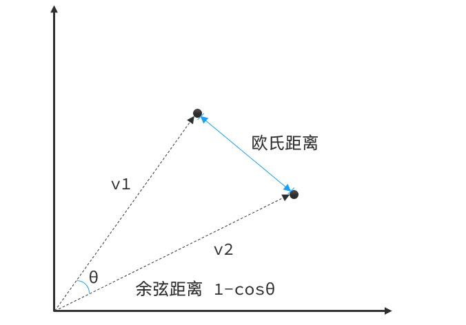
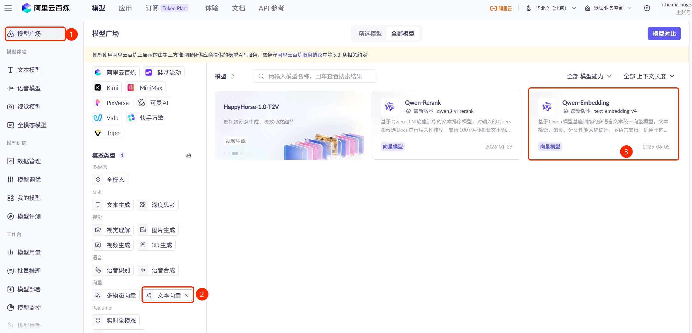

# 第1节\. Runtime

LangChain的Runtime机制是理解Agent内部运行状态的关键。它包括三个核心概念：

| **概念**    | **说明**                                  | **生命周期** |
| ----------- | ----------------------------------------- | ------------ |
| **State**   | 短期记忆，存储Agent当前对话信息、任务状态 | 单次请求     |
| **Store**   | 长期记忆，包含用户偏好、失败经验等        | 跨会话       |
| **Context** | 运行时上下文，传递配置参数                | 单次请求     |


本节我们将分别来学习这三个概念。


# State（短期记忆）

State我们之前有学习过，它是Agent的短期记忆，存储当前会话的**历史消息**、**任务状态**等信息。


我们之前学习短期记忆时使用的是默认的AgentState，其中只包含会话的**历史消息（messages）**，本节开始我们学习如何自定义AgentState，记录除了历史消息以外的其他信息。


## 自定义State

要自定义AgentState，其实就是定义一个类，然后继承AgentState，在其中添加想要记录的属性信息即可。


例如，我们要实现统计用户的模型调用次数、调用时间的功能，可以这样定义state：

```Python
from langchain.agents import AgentState
from typing import NotRequired


*# 定义自定义State结构*
class CustomState(AgentState):
    *"""Agent的任务状态"""*
*    *model_call_count: NotRequired[int]  *# 模型调用次数*
*    *session_start: NotRequired[str]  *# 会话开始时间*
```


由于在AgentState中已经具备messages属性，也就是历史消息列表，因此我们的CustomState继承了AgentState以后，不仅可以记录会话的历史消息，也能记录Agent运行的任务状态信息了。


那么，我们该如何操作state中的自定义属性呢？


LangChain中通常有两个地方可以操作state：

- Tool

- Middleware

由于Middleware还没有学习，我们先来看在Tool中访问state


## 在工具中访问state

在定义tool的时候，LangChain内置了一个runtime参数，通过runtime我们可以获取Agent的内部信息，包括：

- state : dict结构  

- store

- context


```Python
@tool
def my_tool(runtime: ToolRuntime):
    pass
```

**注意**：runtime是了LangChain中tool的限定参数，自定义参数不能叫这个名字。


在runtime中state是dict结构，我们可以这样访问state中的属性：

```Python
model_call_count = runtime.state.get("model_call_count", 0)
```

而修改state则是通过返回一个update格式的Command指令，像这样：

```Python
@tool
def my_tool(runtime: ToolRuntime):
    return Command(update={
        "model_call_count": 1,
        "messages": [ToolMessage("Success!", tool_call_id=runtime.tool_call_id)]
    })
```


例如，我们定义这样的一个tool：

```Python
from langchain.tools import tool, ToolRuntime
from langgraph.types import Command
from langchain.messages import ToolMessage
from datetime import datetime


@tool
def update_state(runtime: ToolRuntime):
    *"""A tool that update agent state"""*
*    # 获取state中的历史消息*
*    *messages = runtime.state['messages']
    *# 消息数量*
*    *message_count = len(messages)
    *# 组织结果*
*    *command = {
        "model_call_count": runtime.state.get("model_call_count", 0) + 1,
        "messages": [ToolMessage("Successfully updated agent state", tool_call_id=runtime.tool_call_id)]
    }
    *# 判断是否是第一次*
*    *if message_count <= 2:
        command['session_start'] = datetime.now()

    return Command(update=command)
```


## 设置state schema

定义了AgentState还不够，我们还需要在创建Agent时设定state schema，告诉Agent要使用自定义的state：

```Python
from langchain.agents import create_agent
from langgraph.checkpoint.memory import InMemorySaver

agent = create_agent(
    "deepseek-chat",
    tools=[update_state],
    state_schema=CustomState, # 告诉Agent使用我们自定义的state
    checkpointer=InMemorySaver(),
    system_prompt="你是一个热心的助手，你需要在每次请求时调用update_state工具以更新任务状态。"
)
```


## 测试

完整代码如下：

```Python
from langchain.tools import tool, ToolRuntime
from langgraph.types import Command
from langchain.messages import ToolMessage
from datetime import datetime
from langchain.agents import AgentState
from typing import NotRequired
from langchain.agents import create_agent
from langgraph.checkpoint.memory import InMemorySaver
from langchain.messages import HumanMessage
from dotenv import load_dotenv

load_dotenv()

*# 定义自定义State结构*
class CustomState(AgentState):
    *"""Agent的任务状态"""*
*    *model_call_count: NotRequired[int]  *# 模型调用次数*
*    *session_start: NotRequired[str]  *# 会话开始时间*
    
@tool
def update_state(runtime: ToolRuntime):
    *"""A tool that update agent state"""*
*    # 获取state中的历史消息*
*    *messages = runtime.state['messages']
    *# 消息数量*
*    *message_count = len(messages)
    *# 组织结果*
*    *command = {
        "model_call_count": runtime.state.get("model_call_count", 0) + 1,
        "messages": [ToolMessage("Successfully updated agent state", tool_call_id=runtime.tool_call_id)]
    }
    *# 判断是否是第一次*
*    *if message_count <= 2:
        command['session_start'] = datetime.now()

    return Command(update=command)
    
agent = create_agent(
    "deepseek-chat",
    tools=[update_state],
    state_schema=CustomState,
    checkpointer=InMemorySaver(),
    system_prompt="你是一个热心的助手，你需要在每次请求时调用update_state工具以更新任务状态。"
)

config = {"configurable": {"thread_id": "1"}}
agent.invoke(
    {"messages": [HumanMessage(content="Hi, my name is 虎哥")]},
    config
)

for message in response['messages']:
    message.pretty_print()
```

运行结果如下：

```Python
================================ Human Message =================================

Hi, my name is 虎哥
================================== Ai Message ==================================

你好虎哥！很高兴认识你！我是你的热心助手，随时准备为你提供帮助。
Tool Calls:
  update_state (call_00_0UUXuzvTchuCIL0BAyQA6T2O)
 Call ID: call_00_0UUXuzvTchuCIL0BAyQA6T2O
  Args:
================================= Tool Message =================================
Name: update_state

Successfully updated agent state
================================== Ai Message ==================================

有什么我可以帮助你的吗？
```

通过下面的代码可以查看state信息：

```Python
agent.get_state(config)
```

结果如下：

```Plain Text
StateSnapshot(values={'messages': [HumanMessage(content='Hi, my name is 虎哥', additional_kwargs={}, response_metadata={}, id='f8f968f2-5aef-4757-b097-c900b21a84b0'), AIMessage(content='', additional_kwargs={'refusal': None}, response_metadata={'token_usage': {'completion_tokens': 27, 'prompt_tokens': 294, 'total_tokens': 321, 'completion_tokens_details': None, 'prompt_tokens_details': {'audio_tokens': None, 'cached_tokens': 256}, 'prompt_cache_hit_tokens': 256, 'prompt_cache_miss_tokens': 38}, 'model_provider': 'deepseek', 'model_name': 'deepseek-v4-flash', 'system_fingerprint': 'fp_058df29938_prod0820_fp8_kvcache_20260402', 'id': '48afcf3a-2502-4a37-9a65-3effe4cf7f0b', 'finish_reason': 'tool_calls', 'logprobs': None}, id='lc_run--019e01e5-184e-7fa2-b27c-04ef879917e0-0', tool_calls=[{'name': 'update_state', 'args': {}, 'id': 'call_00_MqF3OHIWgKf3wpQ3laqC8960', 'type': 'tool_call'}], invalid_tool_calls=[], usage_metadata={'input_tokens': 294, 'output_tokens': 27, 'total_tokens': 321, 'input_token_details': {'cache_read': 256}, 'output_token_details': {}}), ToolMessage(content='Successfully updated agent state', name='update_state', id='48e02bfc-da22-47af-a601-1eb9666bea2b', tool_call_id='call_00_MqF3OHIWgKf3wpQ3laqC8960'), AIMessage(content='你好，虎哥！我是你的热心助手，很高兴认识你！有什么需要我帮忙的吗？尽管说，我会尽力帮你解决！😊', additional_kwargs={'refusal': None}, response_metadata={'token_usage': {'completion_tokens': 30, 'prompt_tokens': 338, 'total_tokens': 368, 'completion_tokens_details': None, 'prompt_tokens_details': {'audio_tokens': None, 'cached_tokens': 256}, 'prompt_cache_hit_tokens': 256, 'prompt_cache_miss_tokens': 82}, 'model_provider': 'deepseek', 'model_name': 'deepseek-v4-flash', 'system_fingerprint': 'fp_058df29938_prod0820_fp8_kvcache_20260402', 'id': 'e4ac6ede-252e-4fd7-84fd-d81a737245dc', 'finish_reason': 'stop', 'logprobs': None}, id='lc_run--019e01e5-1c2d-7d40-8f30-918567aa5db2-0', tool_calls=[], invalid_tool_calls=[], usage_metadata={'input_tokens': 338, 'output_tokens': 30, 'total_tokens': 368, 'input_token_details': {'cache_read': 256}, 'output_token_details': {}})], 'model_call_count': 1, 'session_start': datetime.datetime(2026, 5, 7, 18, 4, 12, 715604)}, next=(), config={'configurable': {'thread_id': '1', 'checkpoint_ns': '', 'checkpoint_id': '1f149fc1-9b57-6c99-8003-d4a49fdced75'}}, metadata={'source': 'loop', 'step': 3, 'parents': {}, 'ls_integration': 'langchain_create_agent'}, created_at='2026-05-07T10:04:13.710652+00:00', parent_config={'configurable': {'thread_id': '1', 'checkpoint_ns': '', 'checkpoint_id': '1f149fc1-91dc-603b-8002-83bff3f71a7e'}}, tasks=(), interrupts=())
```


# Store（长期记忆）

store是LangChain提供的长期记忆机制，用于在不同会话间共享数据。例如：模型以外的数据、用户偏好等。

LangChain提供了多种Store的实现方式，例如：

- InMemoryStore

- PostgresStore

- RedisStore

- \.\.\.

课程中我们以InMemoryStore为例来学习。


## Store的数据结构

Store的数据格式是JSON文档，JSON文档采用分级管理：

- Namespace（命名空间）：可以理解为一个文件夹

  - Key（键）：可以理解为文件名，必须唯一

  - Value（值）：要存储的JSON文档


首先，我们要初始化Store：

```Python
from langgraph.store.memory import InMemoryStore

*# ==================== 1. 创建Store ====================*
memory_store = InMemoryStore()
```

接着，我们向Store中存储数据：

```Python
*# ==================== 2.初始化一些数据 ====================*
memory_store.put(
    ("preferences",),  *# namespace，是一个tuple*
*    *"user_001",  *# key，可以是任意类型*
*    *{  *# value，是JSON格式文档*
*        *"style": "business_markdown",
        "language": "zh-CN"
    }
)

memory_store.put(("preferences",), "user_002", {
    "style": "trump",
    "language": "en-US"
})
```

然后是读取Store数据，LangChain提供了查询store中的数据两种方式：

- get : 在指定namespace下根据key查找

- search : 在指定namespace下对value做语义搜索或者过滤

```Python
*# ==================== 3.读取 ====================*

*# 3.1.基于get查询*
user_preferences = memory_store.get(("preferences",), "user_001")
print(f"用户信息: {user_preferences.value if user_preferences else 'Not found'}")

*# 3.2.基于search搜索数据*
search_results = memory_store.search(
    ("preferences",),
    filter={"language": "zh-CN"},  *# 基于字段做过滤查询*
*    *limit=5
)
print(f"搜索结果数量: {len(search_results)}")
print(search_results)
```


## 基于向量模型的Store

LangChain中的store支持基于向量相似度的语义检索。


这是什么意思呢？


### 向量相似度

在第一章AI通识与基础中，我们讲过Transformer的原理，提到说**文字是可以转为词向量**的，不同的词向量在空间中的位置和方向都不同，具备的含义也不同。

因此，**我们可以通过比较文字的向量相似度来判断词的含义是否接近**。而向量相似度通常是基于向量之间的距离来计算的。


我们以二维向量为例，向量之间的距离有两种计算方法：



通常，两个向量之间**距离越近**，我们认为两个向量的**相似度越高**


所以，如果我们能**把文本转为向量**，就可以**通过向量距离来判断文本的相似度**了。


### 向量模型

现在，有不少的专门的**向量模型**，就可以实现将文本向量化。一个好的向量模型，就是要**尽可能让文本含义相似的向量，在空间中距离更近**：


要使用基于向量模型的Store，我们就准备一个向量模型，用于将文本向量化。


阿里云百炼就有这样的模型，最新模型名为`text-embedding-v4`：




### 定义基于向量的store

要定义基于向量相似度的store，就必须先创建向量模型，然后再初始化store，具体代码如下：

```Python
from langgraph_cli.schemas import IndexConfig
from langchain_community.embeddings import DashScopeEmbeddings
import os

*# 初始化向量模型*
embedding_model = DashScopeEmbeddings(
    model="text-embedding-v4", dashscope_api_key=os.getenv("DASHSCOPE_API_KEY")
)

*# 初始化store*
memory_store = InMemoryStore(index=IndexConfig(
    embed=embedding_model,  *# 向量模型*
*    *dims=1024  *# 向量维度*
))
```

store存储方式与之前没有区别：

```Python
*# ==================== 2.初始化一些数据 ====================*
memory_store.put(("users",), "user_001", {
    "id": "user_001",
    "name": "张三",
    "department": "技术部",
    "clearance_level": 3
})

memory_store.put(("users",), "user_002", {
    "id": "user_002",
    "name": "李四",
    "department": "市场部",
    "clearance_level": 1
})
```

读取store时可以选择基于向量相似度的搜索方式：

```Python
*# ==================== 3.读取 ====================*

*# 3.1.基于get查询*
user_data = memory_store.get(("users",), "user_001")
print(f"用户信息: {user_data.value if user_data else 'Not found'}")

*# 3.2.基于search搜索数据*
search_results = memory_store.search(
    ("users",),
    query="001",  *# 基于字段语义检索*
*    *limit=5
)
print(f"搜索结果数量: {len(search_results)}")
print(search_results)
```

结果：

```C++
用户信息: {'id': 'user_001', 'name': '张三', 'department': '技术部', 'clearance_level': 3}
搜索结果数量: 2
[Item(namespace=['users'], key='user_001', value={'id': 'user_001', 'name': '张三', 'department': '技术部', 'clearance_level': 3}, created_at='2026-04-22T14:57:14.414013+00:00', updated_at='2026-04-22T14:57:14.414016+00:00', score=0.3415490758450993), Item(namespace=['users'], key='user_002', value={'id': 'user_002', 'name': '李四', 'department': '市场部', 'clearance_level': 1}, created_at='2026-04-22T14:57:14.722126+00:00', updated_at='2026-04-22T14:57:14.722128+00:00', score=0.2891345529670016)]
```

可以看到搜索结果会有多个，并且每个都有一个score字段，也就是相似度得分，得分越高排名越靠前。


## 在tool中访问store

与state类似，LangChain中访问store通常也可以有两种场景：

- Tool

- 中间件

我们依然先学习tool中访问store，与state类似，在tool 中访问store也是通过runtime


依然使用上一小节的store为例，在tool中访问store要这样做：

```Python
from langchain.tools import tool, ToolRuntime

@tool
def get_user_info(user_id: str, runtime: ToolRuntime) -> str:
    *"""获取用户信息"""*
*    *if runtime.store is None:
        return "Store not available"

    # 通过runtime获取store，读取其中的数据
    user_info = runtime.store.get(("users",), user_id)

    if user_info is None:
        return "没有找到用户"

    return f"用户信息: {user_info.value}"
```


## 给agent添加store

创建agent时需要指定store：

```Python
from langchain.messages import HumanMessage

*# 在Agent中集成*
agent = create_agent(
    model="deepseek-chat",
    tools=[get_user_info],
    store=memory_store  *# 指定store的存储方式*
)

response = agent.invoke({
    "messages": [HumanMessage("帮我查询user_001的信息")]
})
for message in response['messages']:
    message.pretty_print()
```


运行结果：

```Plain Text
================================ Human Message =================================

帮我查询user_001的信息
================================== Ai Message ==================================

我来帮您查询用户 user_001 的信息。
Tool Calls:
  get_user_info (call_00_USeIOs56DPbMNu6ZyaEdCLKb)
 Call ID: call_00_USeIOs56DPbMNu6ZyaEdCLKb
  Args:
    user_id: user_001
================================= Tool Message =================================
Name: get_user_info

用户信息: {'id': 'user_001', 'name': '张三', 'department': '技术部', 'clearance_level': 3}
================================== Ai Message ==================================

根据查询结果，用户 user_001 的信息如下：

- **用户ID**: user_001
- **姓名**: 张三
- **部门**: 技术部
- **权限级别**: 3级

这是一个技术部的用户，拥有3级权限级别。
```


# Context（运行上下文）

Context用于在运行时传递配置参数、用户信息等会话临时数据，你可以自定义Context的数据结构。


例如，在系统中用户通常会先登录，然后访问agent，我们就可以把登录用户信息存入Context，方便后续获取用户信息。

## 定义Context Schema

首先，我们需要约定Context的数据结构，有两种方式：

- 方式一：使用`@dataclass`来定义

- 方式二：继承`TypedDict`


示例代码：

```Python
from dataclasses import dataclass


*# 方式1：使用dataclass定义Context*
@dataclass
class UserContext:
    *"""Agent运行时上下文"""*
*    *user_id: str = ""


*# 方式2：使用TypedDict定义Context*
from typing_extensions import TypedDict


class UserContext2(TypedDict):
    *"""运行时上下文类型"""*
*    *user_id: str
```


## 在Tool中使用Context

与state类似，我们同样可以在tool中利用runtime来访问Context：

```Python
from langchain.agents import create_agent

@tool
def get_users(runtime: ToolRuntime[UserContext]):
    *"""查询所有用户信息"""*
*    # 获取store*
*    *store = runtime.store
    if store is None:
        return "Store not available"
    *# 获取当前用户信息*
*    *user_id = runtime.context.user_id
    if user_id is None:
        return "当前用户未登录，无法查看"

    user = store.get(("users",), user_id)
    if user is None:
        return "当前用户未登录，无法查看"

    *# 校验权限，至少是3级权限*
*    *user_info = dict(user.value)
    if user_info['clearance_level'] < 3:
        return "权限不足！"
    *# 查询用户*
*    *results = runtime.store.search(("users",))
    if results is None or len(results) == 0:
        return "未查询到用户"
    users = [item.value for item in results]
    return users


@tool
def get_user_preferences(runtime: ToolRuntime[UserContext]):
    *"""查询当前用户的偏好，根据偏好输出结果"""*
*    # 获取当前用户id*
*    *user_id = runtime.context.user_id
    *# 获取用户偏好*
*    *user_preference = runtime.store.get(("preferences",), user_id)
    if user_preference is None:
        return "未查找到用户偏好信息"

    return user_preference.value
```


## 给Agent添加Context

在定义Agent时，需要指定我们创建好的Context：

```Python
*# 创建Agent时指定context_schema*
agent = create_agent(
    model="deepseek-chat",
    tools=[get_users, get_user_preferences],
    store=memory_store,
    context_schema=UserContext,  *# 指定Context类型*
*    *system_prompt="""
    # indentify
    你是一个热心的助手，你可以调用工具获取用户信息，用户偏好。
    # instruction
    请务必按照用户偏好风格展示结果。
    """
)
```

调用Agent时，可以传递Context信息：

```Python
*# 调用时通过Context传递用户信息*
response = agent.invoke(
    {"messages": [HumanMessage("Hello, 帮我查询所有用户信息")]},
    context=UserContext(user_id="user_001")
)

for message in response['messages']:
    message.pretty_print()
```


# 总结

1. **State（短期记忆）**

   - 通过`runtime.state`参数访问

   - 用于保存会话历史消息、对话状态、计数等临时信息

   - 生命周期是当前会话

   - 存储方式：可以是InMemorySaver、也可以是数据库

2. **Store（长期记忆）**

   - 通过`runtime.store`访问

   - 用于拓展知识、用户偏好等信息

   - 生命周期跨越多个会话

   - 支持InMemoryStore和数据库存储

3. **Context（运行时上下文）**

   - 通过`runtime.context`访问

   - 用于传递用户ID、配置参数等

   - 生命周期是当前会话

   - 存储方式：基于内存


---


**更多资源**:

- [LangChain官方文档 \- Runtime](https://docs.langchain.com/oss/python/langchain/runtime)

- [LangChain官方文档 \- Long\-term Memory](https://docs.langchain.com/oss/python/langchain/long-term-memory)

- [LangGraph Store文档](https://langchain-ai.github.io/langgraph/concepts/store/)


