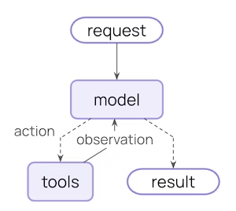
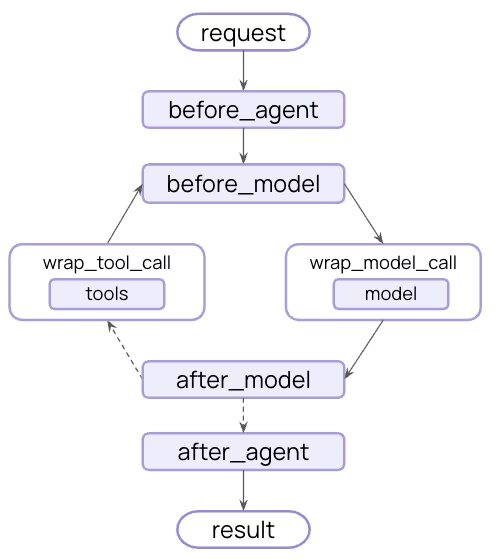
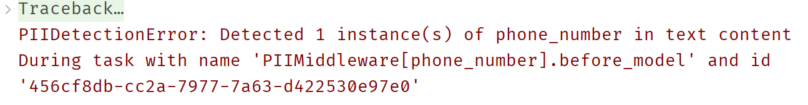

# 第2节\. Middleware


**Middleware**，也就是**中间件**是一种控制Agent内部运行过程的技术，它在智能体运行的各个过程中预留钩子（hook），方便我们嵌入自定义操作。


Agent的默认执行流程和中间件嵌入钩子的对比如图：





**Agent核心执行循环**




**Agent核心执行循环**


基于Middleware可以实现各种高级功能，比如：

- **拦截和修改请求** \- 在模型调用前后对输入输出进行处理

- **实现PII脱敏** \- 自动检测和脱敏敏感个人信息

- **会话摘要管理** \- 当对话过长时自动压缩历史消息

- **人工审核机制** \- 在执行危险操作前等待人工确认

- **动态模型选择** \- 根据运行时条件选择不同的模型

- **自定义状态管理** \- 扩展Agent状态以跟踪额外信息


Middleware可以自己定义，也可以使用LangChain预定义好的。


# 预定义中间件（Prebuilt Middleware）

LangChain提供了多种预置中间件，可以直接使用。完整内置Middleware列表可以参考官方文档：

[https://docs.langchain.com/oss/python/langchain/middleware/built-in]()


我们会以其中的3个为例来介绍预定义中间件的用法：

- PIIMiddleware

- ModelFallbackMiddleware

- HumanInTheLoopMiddleware


## PIIMiddleware \- 个人信息脱敏

PIIMiddleware是一种预定义的wrap\_model\_call中间件，可以在调用模型前后自动检测并脱敏输入、输出消息中的个人身份信息（PII），如邮箱、电话号码、身份证号等。

其中，PII的脱敏处理策略有四种：

- `'block'` \- 抛出异常

- `'redact'` \- 用 \[REDACTED\_\{PII\_TYPE\}\] 来替代

- `'mask'` \- 关键信息采用\*\*掩码 \(例如\., `****-****-****-1234`\)

- `'hash'` \- 用哈希值来替换


示例：

```Python
from langchain.agents.middleware import PIIMiddleware

*# =================1.定义PIIMiddleware==========================*
*# 也可以添加多个PII中间件来检测不同类型的敏感信息*
pii_middleware_email = PIIMiddleware(
    "email",
    strategy="redact",  *# mask*
*    *apply_to_input=False,
    apply_to_output=True
)

pii_middleware_phone = PIIMiddleware(
    "phone_number",
    *# 使用自定义正则表达式*
*    *detector=r"(?:\+?\d{1,3}[\s.-]?)?(?:\(?\d{2,4}\)?[\s.-]?)?\d{3,4}[\s.-]?\d{4}",
    strategy="block",
    apply_to_input=True
)

# ====================2.在Agent中注册PIIMiddleware================
agent_with_builtin_middleware = create_agent(
    model="deepseek-chat",
    middleware=[pii_middleware_email, pii_middleware_phone]
)

# ======================3.测试=================================
response = agent_with_builtin_middleware.invoke({
    "messages": [
        HumanMessage(
            "我的邮箱是: huge@itcast.cn,我的电话是13698023405,你要记住这些信息，后续要用到。如果记住了请确认一遍。")
    ]
})
for m in response['messages']:
    m.pretty_print()
```

由于手机号的处理策略是block，所以运行时会抛出异常：




## ModelFallbackMiddleware

ModelFallbackMiddleware的作用是在模型调用失败时给出降级处理方案。可以在创建时设置多个模型，如果主模型调用失败，会自动调用备用模型。

示例：

```Python
from langchain.agents.middleware import ModelFallbackMiddleware

# 1.Middleware，设置主模型和备用模型
model_fallback_middleware = ModelFallbackMiddleware(
    "gpt-4o-mini",  *# 默认模型*
*    *"deepseek-chat"  *#*
)

# 2.创建Agent，设置Middleware
agent_with_model_fallback = create_agent(
    model="deepseek-chat",
    middleware=[model_fallback_middleware]
)

# 3.测试
response = agent_with_builtin_middleware.invoke({
    "messages": [HumanMessage("你好")]
})
for m in response['messages']:
    m.pretty_print()
```

由于我们无法访问gpt模型，所以调用时会走备用模型deepseek\-chat

```Python
================================ Human Message =================================

你好
================================== Ai Message ==================================

你好！很高兴见到你！😊 我是DeepSeek，由深度求索公司创造的AI助手。无论你有什么问题、需要什么帮助，或者只是想聊聊天，我都很乐意为你提供支持！

我可以帮你处理各种任务，比如：
- 回答问题和解释概念
- 协助写作和翻译
- 分析和处理文档
- 编程和技术支持
- 创意思考和头脑风暴

有什么我可以为你做的吗？请随时告诉我你的需求！✨
```


## HumanInTheLoopMiddleware \- 人工审核

HumanInTheLoop，简称为**HITL**，其作用是让人工介入到Agent执行流程中，在执行工具调用前暂停，等待人工确认。

通常用于Agent执行敏感操作前的确认，例如：

- 发送邮件

- 转账

- 执行脚本

- 读写文件

- \.\.\.


### 创建带有HITL的Agent

假如我们有一个负责转账操作的智能体，示例代码如下：

**首先**，定义一个转账的tool：

```Python
# 1.定义工具
@tool
def transfer_money(amount: int, to: str):
    *"""向指定账户转账*
*    :arg*
*    amount: 金额*
*    to: 收款人*
*    """*
*    *return f"已向账户{to}转账{amount}元"
```

**然后**，定义Middleware，设置需要人工确认的tool，以及人工确认的可选操作：

```Python
from langchain.agents.middleware import HumanInTheLoopMiddleware

*# 2.创建人工审核中间件，设定需要人工审核的 tool，以及审核的可选操作*
human_in_loop_middleware = HumanInTheLoopMiddleware(
    interrupt_on={
        "transfer_money": {
            "description": "请确认转账操作",
            "allowed_decisions": ["approve", "reject", "edit"]
        }
    }
)
```

代码解读：

- interrupt\_on：就是需要人工确认的tool信息，可以设置多个

- transfer\_money：就是需要人工确认的tool名字

- description：是人工确认时的提示信息

- allowed\_decisions：是人工确认时的可选操作，包括三种：

  - approve：允许执行

  - reject：拒绝执行

  - edit：修改tool参数后执行 


**最后**，创建智能体，设置Middleware：

```Python
agent_with_hitl = create_agent(
    model="deepseek-chat",
    tools=[transfer_money],
    middleware=[human_in_loop_middleware],
    checkpointer=InMemorySaver(),
    system_prompt="你是一个账户管理助手，你可以调用工具帮助用户转账，用户提出明确需求后，不要重复向用户确认信息。"
)
```


接下来，测试一下：

```C++
config = {"configurable": {"thread_id": "3"}}
response = agent_with_hitl.invoke(
    {"messages": [HumanMessage("帮我转2000元给王小明(6123008415124395223)")]},
    config=config
)

for message in response['messages']:
    message.pretty_print()
```

会发现，AI会尝试调用工具，但工具并未执行：

```Plain Text
================================ Human Message =================================

帮我转2000元给王小明(6123008415124395223)
================================== Ai Message ==================================

我来帮您转账2000元给王小明。
Tool Calls:
  transfer_money (call_00_ttQGhF2bM9l4ZctZWtc9pFeU)
 Call ID: call_00_ttQGhF2bM9l4ZctZWtc9pFeU
  Args:
    amount: 2000
    to: 6123008415124395223
```

如果打印response，可以看到工具调用被中断了（Interrupt）：

```Plain Text
print(response)
```

```Python
{'messages': [HumanMessage(content='帮我转2000元给王小明(6123008415124395223)', additional_kwargs={}, response_metadata={}, id='18b33155-fec2-46fb-8bb4-2c0cd414a173'), AIMessage(content='我来帮您转账2000元给王小明。', additional_kwargs={'refusal': None}, response_metadata={'token_usage': {'completion_tokens': 77, 'prompt_tokens': 365, 'total_tokens': 442, 'completion_tokens_details': None, 'prompt_tokens_details': {'audio_tokens': None, 'cached_tokens': 0}, 'prompt_cache_hit_tokens': 0, 'prompt_cache_miss_tokens': 365}, 'model_provider': 'deepseek', 'model_name': 'deepseek-chat', 'system_fingerprint': 'fp_eaab8d114b_prod0820_fp8_kvcache_new_kvcache_20260410', 'id': '894be682-141b-4dbe-9370-80f858c05982', 'finish_reason': 'tool_calls', 'logprobs': None}, id='lc_run--019daf31-b706-71d1-8340-b42f16552abe-0', tool_calls=[{'name': 'transfer_money', 'args': {'amount': 2000, 'to': '6123008415124395223'}, 'id': 'call_00_ttQGhF2bM9l4ZctZWtc9pFeU', 'type': 'tool_call'}], invalid_tool_calls=[], usage_metadata={'input_tokens': 365, 'output_tokens': 77, 'total_tokens': 442, 'input_token_details': {'cache_read': 0}, 'output_token_details': {}})], '__interrupt__': [Interrupt(value={'action_requests': [{'name': 'transfer_money', 'args': {'amount': 2000, 'to': '6123008415124395223'}, 'description': '请确认转账操作'}], 'review_configs': [{'action_name': 'transfer_money', 'allowed_decisions': ['approve', 'reject', 'edit']}]}, id='45a5728b8faa4b84a62d59c8da0034db')]}
```


此时，如果Agent对接了前端，就应该在页面展示**需要人工确认的提示信息**：'请确认转账操作'，并给出approve、reject、edit这3个选项。

当用户选择一个操作后，将用户的选择告诉Agent。


那么问题来了，用户选择操作后，该如何将用户的选择告诉Agent呢？


### approve

如果用户拒绝Agent调用工具，我们需要再次调用Agent，并通过Command来告知Agent用户的选择是什么。

示例：

```Python
from langgraph.types import Command

response = agent_with_hitl.invoke(
    Command(
        resume={"decisions": [{"type": "approve"}]}
    ),
    config=config  *# Same thread ID to resume the paused conversation*
)

print(response)
```


### reject

reject是拒绝执行tool，我们需要把拒绝的原因告知AI

示例：

```Python
response = agent_with_hitl.invoke(
    Command(
        resume={
            "decisions": [
                {
                    "type": "reject",
                    *# 用户reject的原因告知给ai*
*                    *"message": "用户取消转账。"
                }
            ]
        }
    ),
    config=config
)

print(response)
```


### edit

edit是指需要人工对调用工具的参数做修改，所以要指定新的参数：

```Python
response = agent_with_hitl.invoke(
    Command(
        resume={
            "decisions": [
                {
                    "type": "edit",
                    *# Edited action with tool name and args*
*                    *"edited_action": {
                        *# Tool name to call.*
*                        # Will usually be the same as the original action.*
*                        *"name": "transfer_money",
                        *# Arguments to pass to the tool.*
*                        *"args": {"amount": 1000, "to": "王小明"},
                    }
                }
            ]
        }
    ),
    config=config  *# Same thread ID to resume the paused conversation*
)

pprint(response)
```


# 自定义中间件

除了使用预置中间件，我们还可以利用LangChain提供的hook创建完全自定义的中间件。


根据hook的种类，中间件可以分为两类：

- Node\-style hooks：在具体某个节点执行的中间件，包含：

  - before\_agent

  - before\_model

  - after\_model

  - after\_agent

- Wrap\-style hooks：环绕model或tool调用的中间件，包括：

  - wrap\_model\_call

  - wrap\_tool\_call

为了便于开发中间件，LangChain为每一种hook都提供了装饰器，我们只有定义函数并使用装饰器标记即可快速开发中间件。


## node\-style装饰器

- Node\-style hooks：在具体某个节点执行的中间件，包含：

  - before\_agent

  - before\_model

  - after\_model

  - after\_agent


例如，我们要实现模型调用计数功能，之前利用tool来统计增加了很多次tool调用，浪费token，而且也不太方便。利用中间件就优雅很多。我们可以在每次调用模型后\(**after\_model**\)记录模型调用次数。


做法是定义函数，并用`@after_model`装饰器来装饰该函数，但要注意，**函数的参数和返回值必须严格按照下面的示例**：

```Python
from langgraph.runtime import Runtime
from langchain.agents import AgentState
from typing import NotRequired, Any
from langchain.agents.middleware import after_model


*# 1.定义自定义state，记录模型调用次数*
class CustomAgentState(AgentState):
    *"""扩展Agent状态，添加自定义字段"""*
*    *model_call_count: NotRequired[int]  *# 模型调用次数*


*# 2.定义中间件*
@after_model(state_schema=CustomAgentState)
def increment_counter(state: CustomAgentState, runtime: Runtime) -> dict[str, Any]:
    *"""使用装饰器的after_model钩子 - 增加调用计数"""*
*    *current_count = state.get("model_call_count", 0)
    return {"model_call_count": current_count + 1}
```

测试：

```Python
*# 创建智能体，设置middleware*
agent = create_agent(
    model="deepseek-chat",
    middleware=[increment_counter],
    checkpointer=InMemorySaver()
)
config = {"configurable": {"thread_id": "1"}}

*# 调用智能体，并初始化state*
response = agent.invoke({
    "messages": [HumanMessage("Hello")],
    "model_call_count": 0,
}, config)

print(response)
```

结果：

```Python
{'messages': [HumanMessage(content='Hello', additional_kwargs={}, response_metadata={}, id='f333c2ff-d50b-452c-941b-adb1c69812f6'), AIMessage(content='你好！有什么可以帮你的吗？😊', additional_kwargs={'refusal': None}, response_metadata={'token_usage': {'completion_tokens': 10, 'prompt_tokens': 5, 'total_tokens': 15, 'completion_tokens_details': None, 'prompt_tokens_details': {'audio_tokens': None, 'cached_tokens': 0}, 'prompt_cache_hit_tokens': 0, 'prompt_cache_miss_tokens': 5}, 'model_provider': 'deepseek', 'model_name': 'deepseek-v4-flash', 'system_fingerprint': 'fp_058df29938_prod0820_fp8_kvcache_20260402', 'id': 'fc0a7204-aafb-44f2-89a0-c516096134b1', 'finish_reason': 'stop', 'logprobs': None}, id='lc_run--019dbe9e-f818-7b82-86ab-dd39577897b2-0', tool_calls=[], invalid_tool_calls=[], usage_metadata={'input_tokens': 5, 'output_tokens': 10, 'total_tokens': 15, 'input_token_details': {'cache_read': 0}, 'output_token_details': {}})], 'model_call_count': 1}
```


## wrap\-style装饰器

- Wrap\-style hooks：环绕model或tool调用的中间件，包括：

  - wrap\_model\_call

  - wrap\_tool\_call


例如，我们来定义一个可以在调用模型时失败重试的中间件，最大重试次数为3次。那就可以使用`@wrap_model_call`，在模型调用时做出判断，如果失败则重试，重试此时超过3次则结束。


同样的，被`@wrap_model_call`装饰的函数，其参数和返回值必须严格按照下面的格式：

```Python
from langchain.agents.middleware import (
    wrap_model_call,
    ModelRequest,
    ModelResponse,
)
from typing import Any, Callable


@wrap_model_call
def retry_model(
    request: ModelRequest,
    handler: Callable[[ModelRequest], ModelResponse],
) -> ModelResponse:
    for attempt in range(3):
        try:
            return handler(request) # 这一步就是调用模型
        except Exception as e:
            print(f"Retry {attempt + 1}/3 after error: {e}")
            if attempt == 2:
                raise
    return None


agent = create_agent(
    model="deepseek-chat",
    middleware=[retry_model]
)
```


测试：

```Python
config = {"configurable": {"thread_id": "1"}}

*# 调用智能体，并初始化state*
response = agent.invoke(
    {"messages": [HumanMessage("Hello")]},
    config,
)

print(response)
```


## 类装饰器

对于需要同时用到多个hooks的更复杂的中间件逻辑，我们还可以使用自定义类继承AgentMiddleware的方式来创建中间件。

例如，一个用来记录日志的中间件，要在模型调用、工具调用前后记录日志：

```Python
from langchain.agents.middleware import AgentMiddleware
from langchain.agents.middleware.types import ModelCallResult, ToolCallRequest
from langgraph.types import Command


class LoggingMiddleware(AgentMiddleware):

    def wrap_model_call(
        self,
        request: ModelRequest,
        handler: Callable[[ModelRequest], ModelResponse],
    ) -> ModelCallResult:
        try:
            print(f"\n=======About to call model with {len(request.messages)} messages=======")
            return handler(request)
        except Exception as e:
            print(f"\n=======[错误]: {str(e)}=======")
            return AIMessage("调用模型失败，请重试~")

    def wrap_tool_call(
        self,
        request: ToolCallRequest,
        handler: Callable[[ToolCallRequest], ToolMessage | Command],
    ) -> ToolMessage | Command:
        print(f"\n=======调用工具: {request.tool_call['name']}=======")
        print(f"\n=======参数: {request.tool_call['args']}=======")
        try:
            result = handler(request)
            print("\n=======工具调用成功！=======")
            return result
        except Exception as e:
            print(f"\n=======工具调用失败: {e}=======")
            raise


@tool
def get_weather(location: str):
    *"""查询指定城市的天气信息"""*
*    *return f"Current weather in {location} is sunny, 25℃."


agent = create_agent(
    model="deepseek-chat",
    middleware=[LoggingMiddleware()],
    tools=[get_weather],
)

for chunk, metadata in agent.stream(
    {"messages": [HumanMessage("杭州今天天气如何？")]},
    stream_mode="messages"
):
    if chunk and chunk.content:
        print(chunk.content, end="", flush=True)
```

运行结果：

```SQL
=======About to call model with 1 messages=======
好的，我来查询一下杭州今天的天气情况。
=======调用工具: get_weather=======

=======参数: {'location': '杭州'}=======

=======工具调用成功！=======
Current weather in 杭州 is sunny, 25℃.
=======About to call model with 3 messages=======
杭州今天天气晴朗，气温 **25℃**，非常适合外出活动哦！🌞 注意适当防晒～
```


# 高级用法

中间件除了利用hook做基本的信息记录和判断，还可以有一些高级的用法，例如：

- 动态修改请求：可以拦截发送给模型的请求，动态修改请求中使用的模型、工具、提示词等

- 条件跳转：在满足条件的情况下直接跳转到某个Agent执行的节点


## 动态修改请求参数

在wrap\_model\_call这个hook中，我们可以动态修改任意的request参数，包括：

- model

- tool

- system\_prompt

- \.\.\.

关键点是利用`request.``overide()`来覆盖原本的request参数。


例如，我们定义一个用来动态切换model的中间件，在每次模型调用前判断是采用推理模型还是普通模型。

```Python
*# 使用 @wrap_model_call 装饰器创建中间件*
*# 这种方式适合简单的请求修改*
from langchain.agents.middleware import wrap_model_call
from collections.abc import Callable
from pydantic.dataclasses import dataclass

*# 初始化不同的模型*
reasoning_model = init_chat_model(model="deepseek-reasoner")
chat_model = init_chat_model(model="deepseek-chat")


*# 定义一个context，记录用户是否使用推理模型*
@dataclass
class UserContext:
    reasoning: bool = False


@wrap_model_call
def dynamic_model_selector(
    request: ModelRequest,
    handler: Callable[[ModelRequest], ModelResponse]) -> ModelResponse:
    *"""*
*    根据context中的reasoning来选择模型：*
*    - True: 选择推理模型*
*    - False: 选择普通对话模型*
*    """*
*    # 获取上下文参数*
*    *is_reasoning = getattr(request.runtime.context, 'reasoning', False)

    *# 根据消息数量选择模型*
*    *selected_model = reasoning_model if is_reasoning else chat_model
    print(f"选择模型: {selected_model.model_name} (reasoning={is_reasoning})")

    *# 覆盖request中的model参数*
*    *modified_request = request.override(model=selected_model)
    return handler(modified_request)
```


测试：

```Python
*# 创建智能体，设置middleware*
agent = create_agent(
    model="deepseek-chat",
    middleware=[dynamic_model_selector],
    checkpointer=InMemorySaver(),
    context_schema=UserContext
)
config = {"configurable": {"thread_id": "1"}}

*# 调用智能体，并初始化state*
response = agent.invoke(
    {"messages": [HumanMessage("Hello")]},
    config,
    context=UserContext(reasoning=True) # 通过传递Context控制模型的类型
)

print(response)
```


## 条件跳转

在中间件使用`jump_to`指令可以跳过模型调用，直接进入指定的Agent节点。


例如，我们设定一个模型限流的中间件，当判断用户模型调用次数超过阈值，直接禁止调用，结束Agent运行。

```Python
from langgraph.runtime import Runtime
from typing import NotRequired, Any
from langchain.agents.middleware import AgentMiddleware, hook_config, AgentState


*# 1.定义自定义state，记录模型调用次数*
class CustomAgentState(AgentState):
    *"""扩展Agent状态，添加自定义字段"""*
*    *model_call_count: NotRequired[int]  *# 模型调用次数*


*# 2.定义中间件*
class ModelCallLimitMiddleware(AgentMiddleware[CustomAgentState]):

    def __init__(self, max_limit: int = 10):
        super().__init__()
        self.max_limit = max_limit

    *# after_model hook，模型调用次数计数*
*    *def after_model(self, state: CustomAgentState, runtime: Runtime) -> dict[str, Any] | None:
        current_count = state.get("model_call_count", 0)
        return {"model_call_count": current_count + 1}

    *# before_model hook，校验模型调用次数是否超限*
*    *@hook_config(can_jump_to=["end"])
    def before_model(self, state: CustomAgentState, runtime: Runtime) -> dict[str, Any] | None:
        *# 获取模型调用次数*
*        *current_count = state.get("model_call_count", 0) + 1
        *# 判断是否超限*
*        *print(f"当前模型调用次数：{current_count}/{self.max_limit}")
        if current_count > self.max_limit:
            return {
                "jump_to": "end",
                "messages": AIMessage(f"模型调用次数超过最大限制：{self.max_limit}！")
            }
        return None

*# @before_model(can_jump_to=["end"])*
*# def check_call_limit(state: CustomAgentState, runtime: Runtime) -> dict[str, Any] | None:*
*#     pass*
```

测试：

```Python
*# 创建智能体，设置middleware*
agent = create_agent(
    model="deepseek-chat",
    middleware=[ModelCallLimitMiddleware(max_limit=2)],
    checkpointer=InMemorySaver(),
    state_schema=CustomAgentState
)
config = {"configurable": {"thread_id": "1"}}

*# 调用智能体，并初始化state*
response = agent.invoke({
    "messages": [HumanMessage("Hello")],
    "model_call_count": 0,
}, config)

print(response)
```


