# 第3节\. EmailAgent案例

接下来，我们利用前面所学的Runtime和Middleware的知识完成一个实战案例。


# 需求分析

首先，我们需要弄清楚Email Friend这个agent的功能和实现思路。


## 功能特性

Email Friend包含以下核心功能：

- 邮箱认证授权

- 读写邮件

- 邮件操作的人工确认

- 多会话管理

- 基于sse的异步通信


当然，这里的邮箱认证授权、读写操作都是基于Tool模拟的，并非真实操作。目的是通过案例让大家掌握与LangChain的Agent开发相关技能。


通过这个案例希望大家掌握以下技能：

- LangChain中Runtime的使用

- LangChain的中间件使用

  - 利用中间件实现动态提示词

  - 利用中间件实现动态工具选择

- LangChain中agent的异步调用


## 预期效果

用户首次访问时需要做认证授权，否则无法进行邮箱操作：

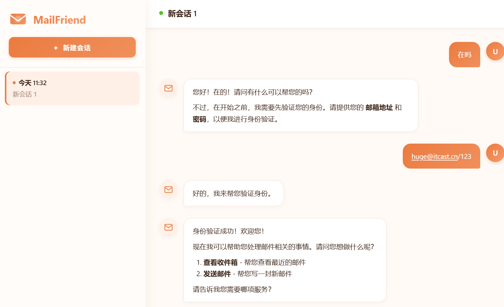


读取邮件：

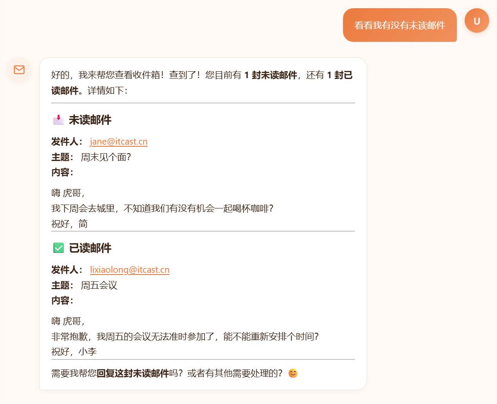


帮忙回复邮件：

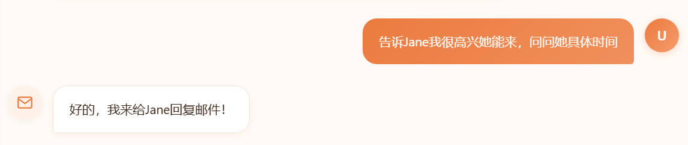

但需要经过人工确认：

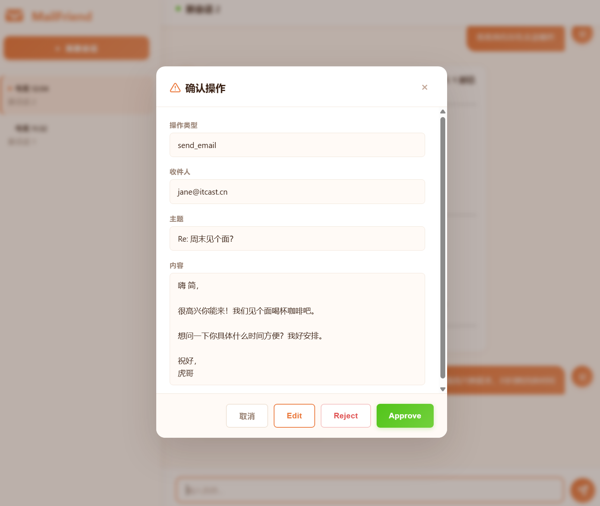

确认之后，邮件发送成功：

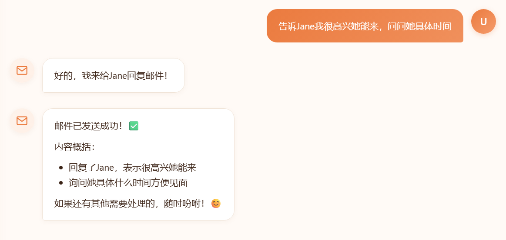


## 实现思路分析

之前说过，定义Agent的关键有三部分：

- 模型

- 工具

- 记忆


这个案例不包含多模态内容，我们可以直接使用文本模型。


工具需要定义3个：

- 邮箱鉴权工具

- 查看邮件工具

- 发送邮件工具


记忆，这里我们只需要短期记忆，也就是state，但不能仅仅是message信息，还应该包含用户的鉴权状态。所以我们应该自定义state，包含两个信息：

- messages：会话历史

- authenticated：鉴权状态


另外，为了保证Agent在完成用户鉴权之前不做邮箱等其它操作，我们需要两个不同的系统提示词

- 鉴权提示词：authenticated为False时使用，告知AI核心工作是完成鉴权，否则不能做其它事情

- 邮箱助手提示词：authenticated为True时使用，告知AI核心工作是操作邮箱

然后，我们需要通过中间件实现动态提示词。


与之类似，虽然工具有3个，但为了减少发送给AI的参数信息，我们也分为两种情况：

- 当authenticated为False时：仅提供邮箱鉴权工具

- 当authenticated为True时：仅提供查看邮件、发送邮件工具


# 功能模拟

接下来，我们依然先使用Jupyter来模拟调试功能。


我们先导入各种所需的依赖：

```Python
from langchain.agents import create_agent
from langchain.messages import AIMessage, HumanMessage, ToolMessage
from langgraph.checkpoint.memory import InMemorySaver
from langchain.tools import tool, ToolRuntime
from langchain.agents import AgentState
*# 加载环境变量*
from dotenv import load_dotenv

load_dotenv()
```


## state

首先，我们要定义一个state，记录用户邮箱授权状态：

```Python
*# state信息，记录用户是否授权邮箱操作*
class AuthenticatedState(AgentState):
    authenticated: bool
```


## tool

接着，我们定义3个工具：

- authenticate : 用来模拟用户邮箱鉴权

- check\_inbox : 模拟收取邮件

- send\_email : 模拟发送邮件


邮箱鉴权工具：

```Python
*# 定义工具，用于用户邮箱鉴权
@tool
def authenticate(email: str, password: str, runtime: ToolRuntime) -> Command:
    """Authenticate the user with the given email and password"""
    
    # 定义变量，记录校验结果
    authenticated = False
    message = "Authentication failed"
    
    # 校验邮箱和密码
    if email == "huge@itcast.cn" and password == "123":
        authenticated = True
        message = "Successfully authenticated"
    
    # 返回校验结果
    return Command(
            update={
                "authenticated": authenticated,
                "messages": [
                    ToolMessage(message, tool_call_id=runtime.tool_call_id)
                ],
            }
**        )*
```

邮箱操作工具：

```Python
*# 定义工具，收取和发送邮件*
@tool
def check_inbox() -> str:
    *"""Read an email from the given address."""*
*    # 模拟收件箱邮件*
*    *return [
        {
            "subject": "周末见个面？",
            "content": """
                嗨 虎哥，
                我下周会去城里，不知道我们有没有机会一起喝杯咖啡？

                祝好，简
            """,
            "from": "jane@itcast.cn",
            "status": "unread"
        },
        {
            "subject": "周五会议",
            "content": """
                嗨 虎哥，
                非常抱歉，我周五的会议无法准时参加了，能不能重新安排个时间？

                祝好，小李
            """,
            "from": "lixiaolong@itcast.cn",
            "status": "checked"
        }
    ]


@tool
def send_email(to: str, subject: str, body: str) -> str:
    *"""Send an response email"""*
*    *return f"邮件已发送至 {to} , 主题： {subject} , 内容： {body}"
```


## 动态工具中间件

为了减少调用模型时传递的参数，我们通过自定义中间件实现动态工具：

- 在用户邮箱授权之前，只能看到authenticate工具

- 在用户邮箱授权之后，只能看到send\_email和check\_inbox工具

```Python
@wrap_model_call
def dynamic_tool_call(
    request: ModelRequest, handler: Callable[[ModelRequest], ModelResponse]
) -> ModelResponse:
    *"""Allow read inbox and send email tools only if user provides correct email and password"""*

*    # 读取授权状态*
*    *authenticated = request.state.get("authenticated")

    if authenticated:
        tools = [check_inbox, send_email]
    else:
        tools = [authenticate]

    *# 重写工具列表*
*    *request = request.override(tools=tools)
    return handler(request)
```


## 动态提示词中间件

由于业务分为两个阶段，所以每个阶段的提示词也不一样：

- 鉴权阶段：告知AI的核心工作是鉴权

- 工作阶段：告知AI的核心工作是处理邮件


```Python
from langchain.agents.middleware import dynamic_prompt

*# 授权前，要求鉴定用户权限的系统提示词*
unauthenticated_prompt = """You are a helpful email assistant.
    For system security protocols, you must authenticate user before any other interaction.
    """

*# 授权后，邮件处理的系统提示词*
authenticated_prompt = "You are a helpful assistant that can check the inbox and send emails."


*# 在中间件中通过判断state的authenticated值来动态切换提示词*
@dynamic_prompt
def dynamic_prompt_func(request: ModelRequest) -> str:
    *"""Generate system prompt based on authentication status"""*
*    *authenticated = request.state.get("authenticated")
    final_prompt = authenticated_prompt if authenticated else unauthenticated_prompt
    return final_prompt
```


## Agent

最后，就是组织模型、工具、中间件，创建Agent：

```Python
*# 初始化checkpointer*
checkpointer = InMemorySaver()

agent = create_agent(
    "deepseek-chat",
    tools=[authenticate, check_inbox, send_email],
    state_schema=AuthenticatedState,
    checkpointer=checkpointer,
    middleware=[
        dynamic_tool_call,
        dynamic_prompt_func,
        HumanInTheLoopMiddleware(
            interrupt_on={
                "authenticate": False,
                "check_inbox": False,
                "send_email": True,
            }
        )
    ],
)
```


## HITL的stream模式

接下来我们测试下Agent效果，这里我们选择采用stream流式调用，在之前我们都采用`stream_mode`为`messages`。

但需要注意的是，由于HITL并不是模型的能力，而是LangChain利用wrap\_tool\_call在模型调用工具前后的一种拦截行为。因此采用`messages`模式只能看到模型返回的消息，无法看到interrupt中断信息。


在HITL存在时，stream采用的模式比较特殊，需要同时包含两种模式：

- messages : 以token方式返回AI生成的内容

- updates : 返回Agent调用时的每个步骤的完整信息，比如当出现interrupt时，完整展示interrupt信息

同时，当我们使用的**LangGraph版本大于1\.1时**，我们还可以设定stream的`version`为`v2`，这样返回的结果格式会以dict返回，而不是tuple，会更好处理。格式如下：

```Python
{
    "type": "interrupt", 
    "data": Interrupt(...),
    ... 
}
```


代码如下：

```Python
config = {"configurable" : {"thread_id": "2"}}

response = agent.stream(
    {"messages": [HumanMessage("帮我查看下邮件。")]},
    config = config,
    stream_mode= ["messages", "updates"],
    version="v2"
)

for chunk in response:
    print(f"---------------------{chunk["type"]}-----------------------")
    print(chunk["data"])
```

结果如下：

```SQL
---------------------messages-----------------------
(AIMessageChunk(content='', additional_kwargs={}, response_metadata={'model_provider': 'deepseek'}, id='lc_run--019e0c10-f203-7891-956a-388fc5bd1733', tool_calls=[], invalid_tool_calls=[], tool_call_chunks=[]), {'ls_integration': 'langchain_chat_model', 'thread_id': '1', 'langgraph_step': 3, 'langgraph_node': 'model', 'langgraph_triggers': ('branch:to:model',), 'langgraph_path': ('__pregel_pull', 'model'), 'langgraph_checkpoint_ns': 'model:bf14c4b8-513a-e109-9a79-05b53a3364b3', 'checkpoint_ns': 'model:bf14c4b8-513a-e109-9a79-05b53a3364b3', 'ls_provider': 'deepseek', 'ls_model_name': 'deepseek-chat', 'ls_model_type': 'chat', 'ls_temperature': None})
---------------------messages-----------------------
(AIMessageChunk(content='好的', additional_kwargs={}, response_metadata={'model_provider': 'deepseek'}, id='lc_run--019e0c10-f203-7891-956a-388fc5bd1733', tool_calls=[], invalid_tool_calls=[], tool_call_chunks=[]), {'ls_integration': 'langchain_chat_model', 'thread_id': '1', 'langgraph_step': 3, 'langgraph_node': 'model', 'langgraph_triggers': ('branch:to:model',), 'langgraph_path': ('__pregel_pull', 'model'), 'langgraph_checkpoint_ns': 'model:bf14c4b8-513a-e109-9a79-05b53a3364b3', 'checkpoint_ns': 'model:bf14c4b8-513a-e109-9a79-05b53a3364b3', 'ls_provider': 'deepseek', 'ls_model_name': 'deepseek-chat', 'ls_model_type': 'chat', 'ls_temperature': None})
---------------------messages-----------------------
(AIMessageChunk(content='！', additional_kwargs={}, response_metadata={'model_provider': 'deepseek'}, id='lc_run--019e0c10-f203-7891-956a-388fc5bd1733', tool_calls=[], invalid_tool_calls=[], tool_call_chunks=[]), {'ls_integration': 'langchain_chat_model', 'thread_id': '1', 'langgraph_step': 3, 'langgraph_node': 'model', 'langgraph_triggers': ('branch:to:model',), 'langgraph_path': ('__pregel_pull', 'model'), 'langgraph_checkpoint_ns': 'model:bf14c4b8-513a-e109-9a79-05b53a3364b3', 'checkpoint_ns': 'model:bf14c4b8-513a-e109-9a79-05b53a3364b3', 'ls_provider': 'deepseek', 'ls_model_name': 'deepseek-chat', 'ls_model_type': 'chat', 'ls_temperature': None})
---------------------messages-----------------------
(AIMessageChunk(content='为了', additional_kwargs={}, response_metadata={'model_provider': 'deepseek'}, id='lc_run--019e0c10-f203-7891-956a-388fc5bd1733', tool_calls=[], invalid_tool_calls=[], tool_call_chunks=[]), {'ls_integration': 'langchain_chat_model', 'thread_id': '1', 'langgraph_step': 3, 'langgraph_node': 'model', 'langgraph_triggers': ('branch:to:model',), 'langgraph_path': ('__pregel_pull', 'model'), 'langgraph_checkpoint_ns': 'model:bf14c4b8-513a-e109-9a79-05b53a3364b3', 'checkpoint_ns': 'model:bf14c4b8-513a-e109-9a79-05b53a3364b3', 'ls_provider': 'deepseek', 'ls_model_name': 'deepseek-chat', 'ls_model_type': 'chat', 'ls_temperature': None})
---------------------messages-----------------------
(AIMessageChunk(content='查看', additional_kwargs={}, response_metadata={'model_provider': 'deepseek'}, id='lc_run--019e0c10-f203-7891-956a-388fc5bd1733', tool_calls=[], invalid_tool_calls=[], tool_call_chunks=[]), {'ls_integration': 'langchain_chat_model', 'thread_id': '1', 'langgraph_step': 3, 'langgraph_node': 'model', 'langgraph_triggers': ('branch:to:model',), 'langgraph_path': ('__pregel_pull', 'model'), 'langgraph_checkpoint_ns': 'model:bf14c4b8-513a-e109-9a79-05b53a3364b3', 'checkpoint_ns': 'model:bf14c4b8-513a-e109-9a79-05b53a3364b3', 'ls_provider': 'deepseek', 'ls_model_name': 'deepseek-chat', 'ls_model_type': 'chat', 'ls_temperature': None})
---------------------messages-----------------------
(AIMessageChunk(content='您的', additional_kwargs={}, response_metadata={'model_provider': 'deepseek'}, id='lc_run--019e0c10-f203-7891-956a-388fc5bd1733', tool_calls=[], invalid_tool_calls=[], tool_call_chunks=[]), {'ls_integration': 'langchain_chat_model', 'thread_id': '1', 'langgraph_step': 3, 'langgraph_node': 'model', 'langgraph_triggers': ('branch:to:model',), 'langgraph_path': ('__pregel_pull', 'model'), 'langgraph_checkpoint_ns': 'model:bf14c4b8-513a-e109-9a79-05b53a3364b3', 'checkpoint_ns': 'model:bf14c4b8-513a-e109-9a79-05b53a3364b3', 'ls_provider': 'deepseek', 'ls_model_name': 'deepseek-chat', 'ls_model_type': 'chat', 'ls_temperature': None})
---------------------messages-----------------------
(AIMessageChunk(content='邮件', additional_kwargs={}, response_metadata={'model_provider': 'deepseek'}, id='lc_run--019e0c10-f203-7891-956a-388fc5bd1733', tool_calls=[], invalid_tool_calls=[], tool_call_chunks=[]), {'ls_integration': 'langchain_chat_model', 'thread_id': '1', 'langgraph_step': 3, 'langgraph_node': 'model', 'langgraph_triggers': ('branch:to:model',), 'langgraph_path': ('__pregel_pull', 'model'), 'langgraph_checkpoint_ns': 'model:bf14c4b8-513a-e109-9a79-05b53a3364b3', 'checkpoint_ns': 'model:bf14c4b8-513a-e109-9a79-05b53a3364b3', 'ls_provider': 'deepseek', 'ls_model_name': 'deepseek-chat', 'ls_model_type': 'chat', 'ls_temperature': None})
---------------------messages-----------------------
(AIMessageChunk(content='，', additional_kwargs={}, response_metadata={'model_provider': 'deepseek'}, id='lc_run--019e0c10-f203-7891-956a-388fc5bd1733', tool_calls=[], invalid_tool_calls=[], tool_call_chunks=[]), {'ls_integration': 'langchain_chat_model', 'thread_id': '1', 'langgraph_step': 3, 'langgraph_node': 'model', 'langgraph_triggers': ('branch:to:model',), 'langgraph_path': ('__pregel_pull', 'model'), 'langgraph_checkpoint_ns': 'model:bf14c4b8-513a-e109-9a79-05b53a3364b3', 'checkpoint_ns': 'model:bf14c4b8-513a-e109-9a79-05b53a3364b3', 'ls_provider': 'deepseek', 'ls_model_name': 'deepseek-chat', 'ls_model_type': 'chat', 'ls_temperature': None})
---------------------messages-----------------------
(AIMessageChunk(content='我需要', additional_kwargs={}, response_metadata={'model_provider': 'deepseek'}, id='lc_run--019e0c10-f203-7891-956a-388fc5bd1733', tool_calls=[], invalid_tool_calls=[], tool_call_chunks=[]), {'ls_integration': 'langchain_chat_model', 'thread_id': '1', 'langgraph_step': 3, 'langgraph_node': 'model', 'langgraph_triggers': ('branch:to:model',), 'langgraph_path': ('__pregel_pull', 'model'), 'langgraph_checkpoint_ns': 'model:bf14c4b8-513a-e109-9a79-05b53a3364b3', 'checkpoint_ns': 'model:bf14c4b8-513a-e109-9a79-05b53a3364b3', 'ls_provider': 'deepseek', 'ls_model_name': 'deepseek-chat', 'ls_model_type': 'chat', 'ls_temperature': None})
---------------------messages-----------------------
(AIMessageChunk(content='先', additional_kwargs={}, response_metadata={'model_provider': 'deepseek'}, id='lc_run--019e0c10-f203-7891-956a-388fc5bd1733', tool_calls=[], invalid_tool_calls=[], tool_call_chunks=[]), {'ls_integration': 'langchain_chat_model', 'thread_id': '1', 'langgraph_step': 3, 'langgraph_node': 'model', 'langgraph_triggers': ('branch:to:model',), 'langgraph_path': ('__pregel_pull', 'model'), 'langgraph_checkpoint_ns': 'model:bf14c4b8-513a-e109-9a79-05b53a3364b3', 'checkpoint_ns': 'model:bf14c4b8-513a-e109-9a79-05b53a3364b3', 'ls_provider': 'deepseek', 'ls_model_name': 'deepseek-chat', 'ls_model_type': 'chat', 'ls_temperature': None})
---------------------messages-----------------------
(AIMessageChunk(content='验证', additional_kwargs={}, response_metadata={'model_provider': 'deepseek'}, id='lc_run--019e0c10-f203-7891-956a-388fc5bd1733', tool_calls=[], invalid_tool_calls=[], tool_call_chunks=[]), {'ls_integration': 'langchain_chat_model', 'thread_id': '1', 'langgraph_step': 3, 'langgraph_node': 'model', 'langgraph_triggers': ('branch:to:model',), 'langgraph_path': ('__pregel_pull', 'model'), 'langgraph_checkpoint_ns': 'model:bf14c4b8-513a-e109-9a79-05b53a3364b3', 'checkpoint_ns': 'model:bf14c4b8-513a-e109-9a79-05b53a3364b3', 'ls_provider': 'deepseek', 'ls_model_name': 'deepseek-chat', 'ls_model_type': 'chat', 'ls_temperature': None})
---------------------messages-----------------------
(AIMessageChunk(content='您的', additional_kwargs={}, response_metadata={'model_provider': 'deepseek'}, id='lc_run--019e0c10-f203-7891-956a-388fc5bd1733', tool_calls=[], invalid_tool_calls=[], tool_call_chunks=[]), {'ls_integration': 'langchain_chat_model', 'thread_id': '1', 'langgraph_step': 3, 'langgraph_node': 'model', 'langgraph_triggers': ('branch:to:model',), 'langgraph_path': ('__pregel_pull', 'model'), 'langgraph_checkpoint_ns': 'model:bf14c4b8-513a-e109-9a79-05b53a3364b3', 'checkpoint_ns': 'model:bf14c4b8-513a-e109-9a79-05b53a3364b3', 'ls_provider': 'deepseek', 'ls_model_name': 'deepseek-chat', 'ls_model_type': 'chat', 'ls_temperature': None})
---------------------messages-----------------------
(AIMessageChunk(content='身份', additional_kwargs={}, response_metadata={'model_provider': 'deepseek'}, id='lc_run--019e0c10-f203-7891-956a-388fc5bd1733', tool_calls=[], invalid_tool_calls=[], tool_call_chunks=[]), {'ls_integration': 'langchain_chat_model', 'thread_id': '1', 'langgraph_step': 3, 'langgraph_node': 'model', 'langgraph_triggers': ('branch:to:model',), 'langgraph_path': ('__pregel_pull', 'model'), 'langgraph_checkpoint_ns': 'model:bf14c4b8-513a-e109-9a79-05b53a3364b3', 'checkpoint_ns': 'model:bf14c4b8-513a-e109-9a79-05b53a3364b3', 'ls_provider': 'deepseek', 'ls_model_name': 'deepseek-chat', 'ls_model_type': 'chat', 'ls_temperature': None})
---------------------messages-----------------------
(AIMessageChunk(content='。', additional_kwargs={}, response_metadata={'model_provider': 'deepseek'}, id='lc_run--019e0c10-f203-7891-956a-388fc5bd1733', tool_calls=[], invalid_tool_calls=[], tool_call_chunks=[]), {'ls_integration': 'langchain_chat_model', 'thread_id': '1', 'langgraph_step': 3, 'langgraph_node': 'model', 'langgraph_triggers': ('branch:to:model',), 'langgraph_path': ('__pregel_pull', 'model'), 'langgraph_checkpoint_ns': 'model:bf14c4b8-513a-e109-9a79-05b53a3364b3', 'checkpoint_ns': 'model:bf14c4b8-513a-e109-9a79-05b53a3364b3', 'ls_provider': 'deepseek', 'ls_model_name': 'deepseek-chat', 'ls_model_type': 'chat', 'ls_temperature': None})
---------------------messages-----------------------
(AIMessageChunk(content='请问', additional_kwargs={}, response_metadata={'model_provider': 'deepseek'}, id='lc_run--019e0c10-f203-7891-956a-388fc5bd1733', tool_calls=[], invalid_tool_calls=[], tool_call_chunks=[]), {'ls_integration': 'langchain_chat_model', 'thread_id': '1', 'langgraph_step': 3, 'langgraph_node': 'model', 'langgraph_triggers': ('branch:to:model',), 'langgraph_path': ('__pregel_pull', 'model'), 'langgraph_checkpoint_ns': 'model:bf14c4b8-513a-e109-9a79-05b53a3364b3', 'checkpoint_ns': 'model:bf14c4b8-513a-e109-9a79-05b53a3364b3', 'ls_provider': 'deepseek', 'ls_model_name': 'deepseek-chat', 'ls_model_type': 'chat', 'ls_temperature': None})
---------------------messages-----------------------
(AIMessageChunk(content='您', additional_kwargs={}, response_metadata={'model_provider': 'deepseek'}, id='lc_run--019e0c10-f203-7891-956a-388fc5bd1733', tool_calls=[], invalid_tool_calls=[], tool_call_chunks=[]), {'ls_integration': 'langchain_chat_model', 'thread_id': '1', 'langgraph_step': 3, 'langgraph_node': 'model', 'langgraph_triggers': ('branch:to:model',), 'langgraph_path': ('__pregel_pull', 'model'), 'langgraph_checkpoint_ns': 'model:bf14c4b8-513a-e109-9a79-05b53a3364b3', 'checkpoint_ns': 'model:bf14c4b8-513a-e109-9a79-05b53a3364b3', 'ls_provider': 'deepseek', 'ls_model_name': 'deepseek-chat', 'ls_model_type': 'chat', 'ls_temperature': None})
---------------------messages-----------------------
(AIMessageChunk(content='能', additional_kwargs={}, response_metadata={'model_provider': 'deepseek'}, id='lc_run--019e0c10-f203-7891-956a-388fc5bd1733', tool_calls=[], invalid_tool_calls=[], tool_call_chunks=[]), {'ls_integration': 'langchain_chat_model', 'thread_id': '1', 'langgraph_step': 3, 'langgraph_node': 'model', 'langgraph_triggers': ('branch:to:model',), 'langgraph_path': ('__pregel_pull', 'model'), 'langgraph_checkpoint_ns': 'model:bf14c4b8-513a-e109-9a79-05b53a3364b3', 'checkpoint_ns': 'model:bf14c4b8-513a-e109-9a79-05b53a3364b3', 'ls_provider': 'deepseek', 'ls_model_name': 'deepseek-chat', 'ls_model_type': 'chat', 'ls_temperature': None})
---------------------messages-----------------------
(AIMessageChunk(content='提供', additional_kwargs={}, response_metadata={'model_provider': 'deepseek'}, id='lc_run--019e0c10-f203-7891-956a-388fc5bd1733', tool_calls=[], invalid_tool_calls=[], tool_call_chunks=[]), {'ls_integration': 'langchain_chat_model', 'thread_id': '1', 'langgraph_step': 3, 'langgraph_node': 'model', 'langgraph_triggers': ('branch:to:model',), 'langgraph_path': ('__pregel_pull', 'model'), 'langgraph_checkpoint_ns': 'model:bf14c4b8-513a-e109-9a79-05b53a3364b3', 'checkpoint_ns': 'model:bf14c4b8-513a-e109-9a79-05b53a3364b3', 'ls_provider': 'deepseek', 'ls_model_name': 'deepseek-chat', 'ls_model_type': 'chat', 'ls_temperature': None})
---------------------messages-----------------------
(AIMessageChunk(content='您的', additional_kwargs={}, response_metadata={'model_provider': 'deepseek'}, id='lc_run--019e0c10-f203-7891-956a-388fc5bd1733', tool_calls=[], invalid_tool_calls=[], tool_call_chunks=[]), {'ls_integration': 'langchain_chat_model', 'thread_id': '1', 'langgraph_step': 3, 'langgraph_node': 'model', 'langgraph_triggers': ('branch:to:model',), 'langgraph_path': ('__pregel_pull', 'model'), 'langgraph_checkpoint_ns': 'model:bf14c4b8-513a-e109-9a79-05b53a3364b3', 'checkpoint_ns': 'model:bf14c4b8-513a-e109-9a79-05b53a3364b3', 'ls_provider': 'deepseek', 'ls_model_name': 'deepseek-chat', 'ls_model_type': 'chat', 'ls_temperature': None})
---------------------messages-----------------------
(AIMessageChunk(content='邮箱', additional_kwargs={}, response_metadata={'model_provider': 'deepseek'}, id='lc_run--019e0c10-f203-7891-956a-388fc5bd1733', tool_calls=[], invalid_tool_calls=[], tool_call_chunks=[]), {'ls_integration': 'langchain_chat_model', 'thread_id': '1', 'langgraph_step': 3, 'langgraph_node': 'model', 'langgraph_triggers': ('branch:to:model',), 'langgraph_path': ('__pregel_pull', 'model'), 'langgraph_checkpoint_ns': 'model:bf14c4b8-513a-e109-9a79-05b53a3364b3', 'checkpoint_ns': 'model:bf14c4b8-513a-e109-9a79-05b53a3364b3', 'ls_provider': 'deepseek', 'ls_model_name': 'deepseek-chat', 'ls_model_type': 'chat', 'ls_temperature': None})
---------------------messages-----------------------
(AIMessageChunk(content='地址', additional_kwargs={}, response_metadata={'model_provider': 'deepseek'}, id='lc_run--019e0c10-f203-7891-956a-388fc5bd1733', tool_calls=[], invalid_tool_calls=[], tool_call_chunks=[]), {'ls_integration': 'langchain_chat_model', 'thread_id': '1', 'langgraph_step': 3, 'langgraph_node': 'model', 'langgraph_triggers': ('branch:to:model',), 'langgraph_path': ('__pregel_pull', 'model'), 'langgraph_checkpoint_ns': 'model:bf14c4b8-513a-e109-9a79-05b53a3364b3', 'checkpoint_ns': 'model:bf14c4b8-513a-e109-9a79-05b53a3364b3', 'ls_provider': 'deepseek', 'ls_model_name': 'deepseek-chat', 'ls_model_type': 'chat', 'ls_temperature': None})
---------------------messages-----------------------
(AIMessageChunk(content='和', additional_kwargs={}, response_metadata={'model_provider': 'deepseek'}, id='lc_run--019e0c10-f203-7891-956a-388fc5bd1733', tool_calls=[], invalid_tool_calls=[], tool_call_chunks=[]), {'ls_integration': 'langchain_chat_model', 'thread_id': '1', 'langgraph_step': 3, 'langgraph_node': 'model', 'langgraph_triggers': ('branch:to:model',), 'langgraph_path': ('__pregel_pull', 'model'), 'langgraph_checkpoint_ns': 'model:bf14c4b8-513a-e109-9a79-05b53a3364b3', 'checkpoint_ns': 'model:bf14c4b8-513a-e109-9a79-05b53a3364b3', 'ls_provider': 'deepseek', 'ls_model_name': 'deepseek-chat', 'ls_model_type': 'chat', 'ls_temperature': None})
---------------------messages-----------------------
(AIMessageChunk(content='密码', additional_kwargs={}, response_metadata={'model_provider': 'deepseek'}, id='lc_run--019e0c10-f203-7891-956a-388fc5bd1733', tool_calls=[], invalid_tool_calls=[], tool_call_chunks=[]), {'ls_integration': 'langchain_chat_model', 'thread_id': '1', 'langgraph_step': 3, 'langgraph_node': 'model', 'langgraph_triggers': ('branch:to:model',), 'langgraph_path': ('__pregel_pull', 'model'), 'langgraph_checkpoint_ns': 'model:bf14c4b8-513a-e109-9a79-05b53a3364b3', 'checkpoint_ns': 'model:bf14c4b8-513a-e109-9a79-05b53a3364b3', 'ls_provider': 'deepseek', 'ls_model_name': 'deepseek-chat', 'ls_model_type': 'chat', 'ls_temperature': None})
---------------------messages-----------------------
(AIMessageChunk(content='吗', additional_kwargs={}, response_metadata={'model_provider': 'deepseek'}, id='lc_run--019e0c10-f203-7891-956a-388fc5bd1733', tool_calls=[], invalid_tool_calls=[], tool_call_chunks=[]), {'ls_integration': 'langchain_chat_model', 'thread_id': '1', 'langgraph_step': 3, 'langgraph_node': 'model', 'langgraph_triggers': ('branch:to:model',), 'langgraph_path': ('__pregel_pull', 'model'), 'langgraph_checkpoint_ns': 'model:bf14c4b8-513a-e109-9a79-05b53a3364b3', 'checkpoint_ns': 'model:bf14c4b8-513a-e109-9a79-05b53a3364b3', 'ls_provider': 'deepseek', 'ls_model_name': 'deepseek-chat', 'ls_model_type': 'chat', 'ls_temperature': None})
---------------------messages-----------------------
(AIMessageChunk(content='？', additional_kwargs={}, response_metadata={'model_provider': 'deepseek'}, id='lc_run--019e0c10-f203-7891-956a-388fc5bd1733', tool_calls=[], invalid_tool_calls=[], tool_call_chunks=[]), {'ls_integration': 'langchain_chat_model', 'thread_id': '1', 'langgraph_step': 3, 'langgraph_node': 'model', 'langgraph_triggers': ('branch:to:model',), 'langgraph_path': ('__pregel_pull', 'model'), 'langgraph_checkpoint_ns': 'model:bf14c4b8-513a-e109-9a79-05b53a3364b3', 'checkpoint_ns': 'model:bf14c4b8-513a-e109-9a79-05b53a3364b3', 'ls_provider': 'deepseek', 'ls_model_name': 'deepseek-chat', 'ls_model_type': 'chat', 'ls_temperature': None})
---------------------messages-----------------------
(AIMessageChunk(content='', additional_kwargs={}, response_metadata={'finish_reason': 'stop', 'model_name': 'deepseek-v4-flash', 'system_fingerprint': 'fp_058df29938_prod0820_fp8_kvcache_20260402', 'model_provider': 'deepseek'}, id='lc_run--019e0c10-f203-7891-956a-388fc5bd1733', tool_calls=[], invalid_tool_calls=[], usage_metadata={'input_tokens': 321, 'output_tokens': 25, 'total_tokens': 346, 'input_token_details': {'cache_read': 256}, 'output_token_details': {}}, tool_call_chunks=[]), {'ls_integration': 'langchain_chat_model', 'thread_id': '1', 'langgraph_step': 3, 'langgraph_node': 'model', 'langgraph_triggers': ('branch:to:model',), 'langgraph_path': ('__pregel_pull', 'model'), 'langgraph_checkpoint_ns': 'model:bf14c4b8-513a-e109-9a79-05b53a3364b3', 'checkpoint_ns': 'model:bf14c4b8-513a-e109-9a79-05b53a3364b3', 'ls_provider': 'deepseek', 'ls_model_name': 'deepseek-chat', 'ls_model_type': 'chat', 'ls_temperature': None})
---------------------messages-----------------------
(AIMessageChunk(content='', additional_kwargs={}, response_metadata={}, id='lc_run--019e0c10-f203-7891-956a-388fc5bd1733', tool_calls=[], invalid_tool_calls=[], tool_call_chunks=[], chunk_position='last'), {'ls_integration': 'langchain_chat_model', 'thread_id': '1', 'langgraph_step': 3, 'langgraph_node': 'model', 'langgraph_triggers': ('branch:to:model',), 'langgraph_path': ('__pregel_pull', 'model'), 'langgraph_checkpoint_ns': 'model:bf14c4b8-513a-e109-9a79-05b53a3364b3', 'checkpoint_ns': 'model:bf14c4b8-513a-e109-9a79-05b53a3364b3', 'ls_provider': 'deepseek', 'ls_model_name': 'deepseek-chat', 'ls_model_type': 'chat', 'ls_temperature': None})
---------------------updates-----------------------
{'model': {'messages': [AIMessage(content='好的！为了查看您的邮件，我需要先验证您的身份。请问您能提供您的邮箱地址和密码吗？', additional_kwargs={}, response_metadata={'finish_reason': 'stop', 'model_name': 'deepseek-v4-flash', 'system_fingerprint': 'fp_058df29938_prod0820_fp8_kvcache_20260402', 'model_provider': 'deepseek'}, id='lc_run--019e0c10-f203-7891-956a-388fc5bd1733', tool_calls=[], invalid_tool_calls=[], usage_metadata={'input_tokens': 321, 'output_tokens': 25, 'total_tokens': 346, 'input_token_details': {'cache_read': 256}, 'output_token_details': {}})]}}
---------------------updates-----------------------
{'HumanInTheLoopMiddleware.after_model': None}
```


可以看到，我要求查看邮件，但AI并不会这么做，而是会询问我的邮箱地址和密码，要求完成授权。


## 测试

接下来，我们继续测试hitl过程

### 邮箱授权

我们继续调用Agent，传递用户邮箱和密码。不过接下来打印的时候我们就可以把message类型和updates类型分开打印了：

```Python
*# 用户授权
response = agent.stream(
    {"messages": [HumanMessage("huge@itcast.cn/123")]},
    config = config,
    stream_mode= ["messages", "updates"],
    version="v2"
)
*
def print_chunk(chunk: dict[str, Any]):
    type = chunk["type"]
    data = chunk["data"]
    if type == "messages":
        token, metadata = data
        if isinstance(token, AIMessage) and token.content:
            print(token.content, end="", flush=True)
    elif type == "updates":
        print("")
        print("=================updates=====================")
        print(data)*

for chunk in response:
**    print_chunk(chunk)*
```


运行结果太长，我们截取一部分：

```Python
好的，我来帮您验证身份。
=================updates=====================
{'model': {'messages': [AIMessage(content='好的，我来帮您验证身份。', additional_kwargs={}, response_metadata={'finish_reason': 'tool_calls', 'model_name': 'deepseek-v4-flash', 'system_fingerprint': 'fp_058df29938_prod0820_fp8_kvcache_20260402', 'model_provider': 'deepseek'}, id='lc_run--019e0c0a-e121-7f52-b764-f15acb5d46dd', tool_calls=[{'name': 'authenticate', 'args': {'email': 'huge@itcast.cn', 'password': '123'}, 'id': 'call_00_S48AaYVcrXdbEGN4oor17885', 'type': 'tool_call'}], invalid_tool_calls=[], usage_metadata={'input_tokens': 345, 'output_tokens': 72, 'total_tokens': 417, 'input_token_details': {'cache_read': 256}, 'output_token_details': {}})]}}

=================updates=====================
{'HumanInTheLoopMiddleware.after_model': None}

=================updates=====================
{'tools': {'authenticated': True, 'messages': [ToolMessage(content='Successfully authenticated', name='authenticate', id='5d04f995-ddfc-44a6-b92e-180cb00b55b3', tool_call_id='call_00_S48AaYVcrXdbEGN4oor17885')]}}
验证成功！现在我来帮您查看邮件。
=================updates=====================
{'model': {'messages': [AIMessage(content='验证成功！现在我来帮您查看邮件。', additional_kwargs={}, response_metadata={'finish_reason': 'tool_calls', 'model_name': 'deepseek-v4-flash', 'system_fingerprint': 'fp_058df29938_prod0820_fp8_kvcache_20260402', 'model_provider': 'deepseek'}, id='lc_run--019e0c0a-e7b5-7903-b1fc-196f6e3ade16', tool_calls=[{'name': 'check_inbox', 'args': {}, 'id': 'call_00_nAsNhsFbZ8raGbHPQcJ14602', 'type': 'tool_call'}], invalid_tool_calls=[], usage_metadata={'input_tokens': 462, 'output_tokens': 37, 'total_tokens': 499, 'input_token_details': {'cache_read': 128}, 'output_token_details': {}})]}}

=================updates=====================
{'HumanInTheLoopMiddleware.after_model': None}

=================updates=====================
{'tools': {'messages': [ToolMessage(content='[{"subject": "周末见个面？", "content": "\\n                嗨 虎哥，\\n                我下周会去城里，不知道我们有没有机会一起喝杯咖啡？\\n\\n                祝好，简\\n            ", "from": "jane@itcast.cn", "status": "unread"}, {"subject": "周五会议", "content": "\\n                嗨 虎哥，\\n                非常抱歉，我周五的会议无法准时参加了，能不能重新安排个时间？\\n\\n                祝好，小李\\n            ", "from": "lixiaolong@itcast.cn", "status": "checked"}]', name='check_inbox', id='0b2e75ef-1260-4ae2-8b92-5e29c542a970', tool_call_id='call_00_nAsNhsFbZ8raGbHPQcJ14602')]}}
您有 **2 封邮件**：

---

📩 **第1封（未读）**
- **发件人：** jane@itcast.cn
- **主题：** 周末见个面？
- **内容：** 简说下周会去城里，想问问有没有机会一起喝杯咖啡。

📩 **第2封（已读）**
- **发件人：** lixiaolong@itcast.cn
- **主题：** 周五会议
- **内容：** 小李说周五的会议无法准时参加，想重新安排时间。

---

请问您需要回复哪封邮件吗？
=================updates=====================
{'model': {'messages': [AIMessage(content='您有 **2 封邮件**：\n\n---\n\n📩 **第1封（未读）**\n- **发件人：** jane@itcast.cn\n- **主题：** 周末见个面？\n- **内容：** 简说下周会去城里，想问问有没有机会一起喝杯咖啡。\n\n📩 **第2封（已读）**\n- **发件人：** lixiaolong@itcast.cn\n- **主题：** 周五会议\n- **内容：** 小李说周五的会议无法准时参加，想重新安排时间。\n\n---\n\n请问您需要回复哪封邮件吗？', additional_kwargs={}, response_metadata={'finish_reason': 'stop', 'model_name': 'deepseek-v4-flash', 'system_fingerprint': 'fp_058df29938_prod0820_fp8_kvcache_20260402', 'model_provider': 'deepseek'}, id='lc_run--019e0c0a-ed81-7641-9233-a088a6af7ac5', tool_calls=[], invalid_tool_calls=[], usage_metadata={'input_tokens': 648, 'output_tokens': 134, 'total_tokens': 782, 'input_token_details': {'cache_read': 384}, 'output_token_details': {}})]}}

=================updates=====================
{'HumanInTheLoopMiddleware.after_model': None}
```


可以看到，Agent在鉴权成功后，帮我查看了邮件内容，并且询问我是否要回复邮件。


### 触发Interrupt

我们继续调用Agent，让它帮我回复邮件，不过接下来打印的时候我们就可以把message类型和updates类型分开打印了：

```Python
*# 用户授权
response = agent.stream(
**    {"messages": [**HumanMessage**("帮我回复Jane，告诉她很期待她能来，问问具体时间")]},
    config = config,
    stream_mode= ["messages", "updates"],
    version="v2"
)

for chunk in response:
**    print_chunk(chunk)*
```

运行结果如下：

```Python
好的，我来帮您回复简的邮件。
=================updates=====================
{'model': {'messages': [AIMessage(content='好的，我来帮您回复简的邮件。', additional_kwargs={}, response_metadata={'finish_reason': 'tool_calls', 'model_name': 'deepseek-v4-flash', 'system_fingerprint': 'fp_058df29938_prod0820_fp8_kvcache_20260402', 'model_provider': 'deepseek'}, id='lc_run--019e0c12-dfbd-7531-98f0-3553a5a606e7', tool_calls=[{'name': 'send_email', 'args': {'to': 'jane@itcast.cn', 'subject': 'Re: 周末见个面？', 'body': '嗨 简，\n\n很高兴你能来！我很期待和你一起喝杯咖啡。\n\n请问你具体什么时间方便呢？我们可以一起定个合适的时间。\n\n祝好，\n虎哥'}, 'id': 'call_00_DL1oBpIe7Rqb26eT9A1o6403', 'type': 'tool_call'}], invalid_tool_calls=[], usage_metadata={'input_tokens': 874, 'output_tokens': 131, 'total_tokens': 1005, 'input_token_details': {'cache_read': 768}, 'output_token_details': {}})]}}

=================updates=====================
{'__interrupt__': (Interrupt(value={'action_requests': [{'name': 'send_email', 'args': {'to': 'jane@itcast.cn', 'subject': 'Re: 周末见个面？', 'body': '嗨 简，\n\n很高兴你能来！我很期待和你一起喝杯咖啡。\n\n请问你具体什么时间方便呢？我们可以一起定个合适的时间。\n\n祝好，\n虎哥'}, 'description': "Tool execution requires approval\n\nTool: send_email\nArgs: {'to': 'jane@itcast.cn', 'subject': 'Re: 周末见个面？', 'body': '嗨 简，\\n\\n很高兴你能来！我很期待和你一起喝杯咖啡。\\n\\n请问你具体什么时间方便呢？我们可以一起定个合适的时间。\\n\\n祝好，\\n虎哥'}"}], 'review_configs': [{'action_name': 'send_email', 'allowed_decisions': ['approve', 'edit', 'reject', 'respond']}]}, id='befc16a002eee54b0e0d44123c64a0f5'),)}
```

可以看到，虽然AI已经帮我们写了邮件，但是并没有发送，而是在调用send\_email这个Tool时被拦截了，同时在updates中可以看到interrupt信息。

接下来，就可以发送到前端，让用户来做决定了。


### 用户介入

接下来，用户就可以根据自己的需求来处理interrupt了，可以选择：

- Approve

- Reject

- Edit


例如，我们选择reject拒绝发送，同时告诉AI邮件内容有问题，让它改一改：

```Python
*# 用户处理interrupt，比如reject*
response = agent.stream(
    Command(
        resume={
            "decisions": [
                {
                    "type": "reject",
                    *# 告知AI拒绝的原因*
*                    *"message": "语气太书面了，这不是工作邮件，Jane是我的好朋友，回复自然一点。"
                }
            ]
        }
    ),
    config = config,
    stream_mode= ["messages", "updates"],
    version="v2"
)

for chunk in response:
    print_chunk(chunk)
```

运行结果：

```Python
=================updates=====================
{'HumanInTheLoopMiddleware.after_model': {'messages': [AIMessage(content='好的，我来帮您回复简的邮件。', additional_kwargs={}, response_metadata={'finish_reason': 'tool_calls', 'model_name': 'deepseek-v4-flash', 'system_fingerprint': 'fp_058df29938_prod0820_fp8_kvcache_20260402', 'model_provider': 'deepseek'}, id='lc_run--019e0c12-dfbd-7531-98f0-3553a5a606e7', tool_calls=[{'name': 'send_email', 'args': {'to': 'jane@itcast.cn', 'subject': 'Re: 周末见个面？', 'body': '嗨 简，\n\n很高兴你能来！我很期待和你一起喝杯咖啡。\n\n请问你具体什么时间方便呢？我们可以一起定个合适的时间。\n\n祝好，\n虎哥'}, 'id': 'call_00_DL1oBpIe7Rqb26eT9A1o6403', 'type': 'tool_call'}], invalid_tool_calls=[], usage_metadata={'input_tokens': 874, 'output_tokens': 131, 'total_tokens': 1005, 'input_token_details': {'cache_read': 768}, 'output_token_details': {}}), ToolMessage(content='语气太书面了，这不是工作邮件，Jane是我的好朋友，回复自然一点。', name='send_email', id='ee72e747-1120-4f7c-ba7c-9628321a7a39', tool_call_id='call_00_DL1oBpIe7Rqb26eT9A1o6403', status='error')]}}
好的，我换一种更轻松自然的语气重新发送。
=================updates=====================
{'model': {'messages': [AIMessage(content='好的，我换一种更轻松自然的语气重新发送。', additional_kwargs={}, response_metadata={'finish_reason': 'tool_calls', 'model_name': 'deepseek-v4-flash', 'system_fingerprint': 'fp_058df29938_prod0820_fp8_kvcache_20260402', 'model_provider': 'deepseek'}, id='lc_run--019e0c17-a8a5-7a52-9c60-73511c5b41ab', tool_calls=[{'name': 'send_email', 'args': {'to': 'jane@itcast.cn', 'subject': 'Re: 周末见个面？', 'body': '嗨 Jane，\n\n太好了！好久不见，必须约起来！☕\n\n你具体啥时候方便？跟我说说时间，我来安排！\n\n等你消息哈～\n\n虎哥'}, 'id': 'call_00_6mCcTtLNUOG1yUoMDcMf5621', 'type': 'tool_call'}], invalid_tool_calls=[], usage_metadata={'input_tokens': 1033, 'output_tokens': 131, 'total_tokens': 1164, 'input_token_details': {'cache_read': 896}, 'output_token_details': {}})]}}

=================updates=====================
{'__interrupt__': (Interrupt(value={'action_requests': [{'name': 'send_email', 'args': {'to': 'jane@itcast.cn', 'subject': 'Re: 周末见个面？', 'body': '嗨 Jane，\n\n太好了！好久不见，必须约起来！☕\n\n你具体啥时候方便？跟我说说时间，我来安排！\n\n等你消息哈～\n\n虎哥'}, 'description': "Tool execution requires approval\n\nTool: send_email\nArgs: {'to': 'jane@itcast.cn', 'subject': 'Re: 周末见个面？', 'body': '嗨 Jane，\\n\\n太好了！好久不见，必须约起来！☕\\n\\n你具体啥时候方便？跟我说说时间，我来安排！\\n\\n等你消息哈～\\n\\n虎哥'}"}], 'review_configs': [{'action_name': 'send_email', 'allowed_decisions': ['approve', 'edit', 'reject', 'respond']}]}, id='838dbb7f8c6b33cbab150adb1e2bc645'),)}
```


可以看到，我们reject的理由会作为ToolMessage返回给AI，AI看到后重写了一封邮件，再次尝试发送，再次触发了Interrupt


接下来，就可以再次让人工介入了。


## 会话历史

带有hitl的Agent会话历史也比较特殊，与之前的纯对话历史不同。


### checkpointer获取历史

之前我们通过checkpointer获取会话历史，但是存在一个问题，checkpointer中直接获取拿不到interrupt信息，只能拿到Message信息：

```Python
checkpointer.get(config)
```

结果：

```Python
{'v': 4,
 'ts': '2026-05-09T09:41:36.374100+00:00',
 'id': '1f14b8b4-57fd-6d94-8011-d3cf9dd664b9',
 'channel_versions': {'__start__': '00000000000000000000000000000016.0.8655555881670611',
  'messages': '00000000000000000000000000000019.0.7544398364008247',
  'branch:to:model': '00000000000000000000000000000019.0.7544398364008247',
  'branch:to:HumanInTheLoopMiddleware.after_model': '00000000000000000000000000000019.0.7544398364008247',
  '__pregel_tasks': '00000000000000000000000000000012.0.2455949578797224',
  'authenticated': '00000000000000000000000000000009.0.4573035367639653'},
 'versions_seen': {'__input__': {},
  '__start__': {'__start__': '00000000000000000000000000000015.0.15918202817556004'},
  'model': {'branch:to:model': '00000000000000000000000000000018.0.38132983800910747'},
  'HumanInTheLoopMiddleware.after_model': {'branch:to:HumanInTheLoopMiddleware.after_model': '00000000000000000000000000000017.0.31280029323537684'},
  'tools': {},
  '__interrupt__': {'messages': '00000000000000000000000000000017.0.31280029323537684',
   'authenticated': '00000000000000000000000000000009.0.4573035367639653',
   '__start__': '00000000000000000000000000000016.0.8655555881670611',
   '__pregel_tasks': '00000000000000000000000000000012.0.2455949578797224',
   'branch:to:model': '00000000000000000000000000000017.0.31280029323537684',
   'branch:to:HumanInTheLoopMiddleware.after_model': '00000000000000000000000000000017.0.31280029323537684'}},
 'updated_channels': ['branch:to:HumanInTheLoopMiddleware.after_model',
  'messages'],
 'channel_values': {'messages': [HumanMessage(content='帮我查看下邮件。', additional_kwargs={}, response_metadata={}, id='da4973b9-154e-4dfa-afb7-b54927f46e85'),
   AIMessage(content='我需要先验证您的身份才能帮您查看邮件。请提供您的邮箱地址和密码以便进行身份验证。', additional_kwargs={}, response_metadata={'finish_reason': 'stop', 'model_name': 'deepseek-v4-flash', 'system_fingerprint': 'fp_058df29938_prod0820_fp8_kvcache_20260402', 'model_provider': 'deepseek'}, id='lc_run--019e0c1c-71b0-7ca3-a262-f8b6278a48da', tool_calls=[], invalid_tool_calls=[], usage_metadata={'input_tokens': 316, 'output_tokens': 24, 'total_tokens': 340, 'input_token_details': {'cache_read': 256}, 'output_token_details': {}}),
   HumanMessage(content='huge@itcast.cn/123', additional_kwargs={}, response_metadata={}, id='758a2126-9ec9-44de-abdf-f24acc6dd85d'),
   AIMessage(content='好的，让我验证您的身份。', additional_kwargs={}, response_metadata={'finish_reason': 'tool_calls', 'model_name': 'deepseek-v4-flash', 'system_fingerprint': 'fp_058df29938_prod0820_fp8_kvcache_20260402', 'model_provider': 'deepseek'}, id='lc_run--019e0c1c-aa00-7711-a2f0-0f7e09199e4f', tool_calls=[{'name': 'authenticate', 'args': {'email': 'huge@itcast.cn', 'password': '123'}, 'id': 'call_00_cwKozzKxNBY7FTSDn8XU7337', 'type': 'tool_call'}], invalid_tool_calls=[], usage_metadata={'input_tokens': 351, 'output_tokens': 71, 'total_tokens': 422, 'input_token_details': {'cache_read': 256}, 'output_token_details': {}}),
   ToolMessage(content='Successfully authenticated', name='authenticate', id='a37f35bc-b8fb-4264-b4b5-369e5b55a942', tool_call_id='call_00_cwKozzKxNBY7FTSDn8XU7337'),
   AIMessage(content='身份验证成功！现在让我查看您的收件箱。', additional_kwargs={}, response_metadata={'finish_reason': 'tool_calls', 'model_name': 'deepseek-v4-flash', 'system_fingerprint': 'fp_058df29938_prod0820_fp8_kvcache_20260402', 'model_provider': 'deepseek'}, id='lc_run--019e0c1c-b1e8-7ce0-a72e-3a11880cad1d', tool_calls=[{'name': 'check_inbox', 'args': {}, 'id': 'call_00_T0Hqh8wGpGWmGSFQcxae5068', 'type': 'tool_call'}], invalid_tool_calls=[], usage_metadata={'input_tokens': 467, 'output_tokens': 39, 'total_tokens': 506, 'input_token_details': {'cache_read': 128}, 'output_token_details': {}}),
   ToolMessage(content='[{"subject": "周末见个面？", "content": "\\n                嗨 虎哥，\\n                我下周会去城里，不知道我们有没有机会一起喝杯咖啡？\\n\\n                祝好，简\\n            ", "from": "jane@itcast.cn", "status": "unread"}, {"subject": "周五会议", "content": "\\n                嗨 虎哥，\\n                非常抱歉，我周五的会议无法准时参加了，能不能重新安排个时间？\\n\\n                祝好，小李\\n            ", "from": "lixiaolong@itcast.cn", "status": "checked"}]', name='check_inbox', id='efde42b2-d17c-4782-af35-bece76382a86', tool_call_id='call_00_T0Hqh8wGpGWmGSFQcxae5068'),
   AIMessage(content='好的，您的收件箱中有以下邮件：\n\n---\n\n### 📧 邮件列表\n\n**1. 来自：** `jane@itcast.cn`（简）\n**主题：** 周末见个面？\n**状态：** 🔴 未读\n**内容：**\n> 嗨 虎哥，\n> 我下周会去城里，不知道我们有没有机会一起喝杯咖啡？\n>\n> 祝好，简\n\n---\n\n**2. 来自：** `lixiaolong@itcast.cn`（小李）\n**主题：** 周五会议\n**状态：** ✅ 已读\n**内容：**\n> 嗨 虎哥，\n> 非常抱歉，我周五的会议无法准时参加了，能不能重新安排个时间？\n>\n> 祝好，小李\n\n---\n\n您有一封来自 **简 (jane@itcast.cn)** 的未读邮件，她想约您喝咖啡。您需要我回复哪封邮件吗？', additional_kwargs={}, response_metadata={'finish_reason': 'stop', 'model_name': 'deepseek-v4-flash', 'system_fingerprint': 'fp_058df29938_prod0820_fp8_kvcache_20260402', 'model_provider': 'deepseek'}, id='lc_run--019e0c1c-b6e8-7980-a1b7-2a5ee112693b', tool_calls=[], invalid_tool_calls=[], usage_metadata={'input_tokens': 655, 'output_tokens': 204, 'total_tokens': 859, 'input_token_details': {'cache_read': 384}, 'output_token_details': {}}),
   HumanMessage(content='帮我回复Jane，很高兴她能来，问问她具体见面时间', additional_kwargs={}, response_metadata={}, id='34d17f0c-a7bd-43a1-ab48-6c240ce14f1a'),
   AIMessage(content='好的，我来回复Jane的邮件。', additional_kwargs={}, response_metadata={'finish_reason': 'tool_calls', 'model_name': 'deepseek-v4-flash', 'system_fingerprint': 'fp_058df29938_prod0820_fp8_kvcache_20260402', 'model_provider': 'deepseek'}, id='lc_run--019e0c1c-ea90-72d2-8d23-b0a843d6c6c1', tool_calls=[{'name': 'send_email', 'args': {'to': 'jane@itcast.cn', 'subject': 'Re: 周末见个面？', 'body': '嗨 简，\n\n很高兴你要来城里！我们当然可以一起喝杯咖啡。\n\n请问你具体什么时间方便见面呢？\n\n期待见面！\n\n祝好，\n虎哥'}, 'id': 'call_00_2WAI8S2tKU5FHdJW7PNL3802', 'type': 'tool_call'}], invalid_tool_calls=[], usage_metadata={'input_tokens': 876, 'output_tokens': 128, 'total_tokens': 1004, 'input_token_details': {'cache_read': 768}, 'output_token_details': {}}),
   ToolMessage(content='语气太书面了，这不是工作邮件，Jane是我的好朋友，回复自然一点。', name='send_email', id='b32acef4-fa75-45e5-892e-68ae067e16e1', tool_call_id='call_00_2WAI8S2tKU5FHdJW7PNL3802', status='error'),
   AIMessage(content='明白了，这是好朋友之间的邮件，我重新给您写一封更自然的。', additional_kwargs={}, response_metadata={'finish_reason': 'tool_calls', 'model_name': 'deepseek-v4-flash', 'system_fingerprint': 'fp_058df29938_prod0820_fp8_kvcache_20260402', 'model_provider': 'deepseek'}, id='lc_run--019e0c1d-176d-7113-a5aa-b3327e431392', tool_calls=[{'name': 'send_email', 'args': {'subject': 'Re: 周末见个面？', 'body': '嗨 简，\n\n太好了！你要来城里啦，必须约起来喝杯咖啡！\n\n你具体啥时候方便呀？跟我说个时间呗~\n\n回头见！\n虎哥', 'to': 'jane@itcast.cn'}, 'id': 'call_00_wDU2A4kFNKRvYng4rnxo8221', 'type': 'tool_call'}], invalid_tool_calls=[], usage_metadata={'input_tokens': 1031, 'output_tokens': 135, 'total_tokens': 1166, 'input_token_details': {'cache_read': 768}, 'output_token_details': {}})],
  'branch:to:HumanInTheLoopMiddleware.after_model': None,
  '__pregel_tasks': [],
  'authenticated': True}}
```


### state获取历史

如果要同时获取到历史消息、interrupt等信息，必须通过AgentState：

```Python
agent.get_state(config)
```

结果：

```Python
StateSnapshot(values={'messages': [HumanMessage(content='帮我查看下邮件。', additional_kwargs={}, response_metadata={}, id='9d0e51c5-f322-4c9e-88fb-5a5b43115374'), AIMessage(content='好的，我先帮您进行身份验证。请问您的邮箱地址和密码是什么？', additional_kwargs={}, response_metadata={'finish_reason': 'stop', 'model_name': 'deepseek-v4-flash', 'system_fingerprint': 'fp_058df29938_prod0820_fp8_kvcache_20260402', 'model_provider': 'deepseek'}, id='lc_run--019e0186-8a2c-74a0-9704-f14ab790d49b', tool_calls=[], invalid_tool_calls=[], usage_metadata={'input_tokens': 316, 'output_tokens': 18, 'total_tokens': 334, 'input_token_details': {'cache_read': 256}, 'output_token_details': {}}), HumanMessage(content='huge@itcast.cn/123', additional_kwargs={}, response_metadata={}, id='30ce13f3-fb3b-4595-a459-c1c8a858ac57'), AIMessage(content='好的，我来帮您进行身份验证。', additional_kwargs={}, response_metadata={'finish_reason': 'tool_calls', 'model_name': 'deepseek-v4-flash', 'system_fingerprint': 'fp_058df29938_prod0820_fp8_kvcache_20260402', 'model_provider': 'deepseek'}, id='lc_run--019e0186-b8ea-7cd3-aa3e-5854bc67f515', tool_calls=[{'name': 'authenticate', 'args': {'email': 'huge@itcast.cn', 'password': '123'}, 'id': 'call_00_i3hMccq6yJ7VN3zWV4WY5449', 'type': 'tool_call'}], invalid_tool_calls=[], usage_metadata={'input_tokens': 345, 'output_tokens': 73, 'total_tokens': 418, 'input_token_details': {'cache_read': 256}, 'output_token_details': {}}), ToolMessage(content='Successfully authenticated', name='authenticate', id='e615a53e-9d57-4441-8833-f339370ef9ab', tool_call_id='call_00_i3hMccq6yJ7VN3zWV4WY5449'), AIMessage(content='太好了，身份验证成功！我来帮您查看邮件。', additional_kwargs={}, response_metadata={'finish_reason': 'tool_calls', 'model_name': 'deepseek-v4-flash', 'system_fingerprint': 'fp_058df29938_prod0820_fp8_kvcache_20260402', 'model_provider': 'deepseek'}, id='lc_run--019e0186-bfec-7050-8a99-f8cfeec6e3e0', tool_calls=[{'name': 'check_inbox', 'args': {}, 'id': 'call_00_ol2PU4erxIj6Sko9Gxen6317', 'type': 'tool_call'}], invalid_tool_calls=[], usage_metadata={'input_tokens': 463, 'output_tokens': 39, 'total_tokens': 502, 'input_token_details': {'cache_read': 128}, 'output_token_details': {}}), ToolMessage(content='[{"subject": "周末见个面？", "content": "\\n                嗨 虎哥，\\n                我下周会去城里，不知道我们有没有机会一起喝杯咖啡？\\n\\n                祝好，简\\n            ", "from": "jane@itcast.cn", "status": "unread"}, {"subject": "周五会议", "content": "\\n                嗨 虎哥，\\n                非常抱歉，我周五的会议无法准时参加了，能不能重新安排个时间？\\n\\n                祝好，小李\\n            ", "from": "lixiaolong@itcast.cn", "status": "checked"}]', name='check_inbox', id='a7a99501-f953-4042-b6ee-12242b1559ff', tool_call_id='call_00_ol2PU4erxIj6Sko9Gxen6317'), AIMessage(content='以下是您的收件箱内容，共有 **2封邮件**：\n\n---\n\n### 📧 第1封邮件（未读）\n- **发件人：** jane@itcast.cn（简）\n- **主题：** 周末见个面？\n- **内容：**\n  > 嗨 虎哥，\n  > 我下周会去城里，不知道我们有没有机会一起喝杯咖啡？\n  > \n  > 祝好，简\n\n### 📧 第2封邮件（已读）\n- **发件人：** lixiaolong@itcast.cn（小李）\n- **主题：** 周五会议\n- **内容：**\n  > 嗨 虎哥，\n  > 非常抱歉，我周五的会议无法准时参加了，能不能重新安排个时间？\n  > \n  > 祝好，小李\n\n---\n\n请问您需要回复哪一封邮件？', additional_kwargs={}, response_metadata={'finish_reason': 'stop', 'model_name': 'deepseek-v4-flash', 'system_fingerprint': 'fp_058df29938_prod0820_fp8_kvcache_20260402', 'model_provider': 'deepseek'}, id='lc_run--019e0186-c56e-7803-8e3d-1cf4f10dff3b', tool_calls=[], invalid_tool_calls=[], usage_metadata={'input_tokens': 651, 'output_tokens': 188, 'total_tokens': 839, 'input_token_details': {'cache_read': 384}, 'output_token_details': {}}), HumanMessage(content='帮我回复Jane，很高兴她能来，问问她具体见面时间', additional_kwargs={}, response_metadata={}, id='8b29113d-397d-48e8-b949-ae5272c8e68b'), AIMessage(content='好的，我来给Jane回复邮件。', additional_kwargs={}, response_metadata={'finish_reason': 'tool_calls', 'model_name': 'deepseek-v4-flash', 'system_fingerprint': 'fp_058df29938_prod0820_fp8_kvcache_20260402', 'model_provider': 'deepseek'}, id='lc_run--019e0186-f998-76b1-b3a4-2b10107ce0f7', tool_calls=[{'name': 'send_email', 'args': {'to': 'jane@itcast.cn', 'subject': 'Re: 周末见个面？', 'body': '嗨 简，\n\n很高兴听说你要来城里！我们当然可以一起喝杯咖啡聊聊。\n\n请问你具体什么时间方便呢？我们可以约个时间见面。\n\n期待见到你！\n\n祝好，\n虎哥'}, 'id': 'call_00_joBsSVVaI3XCElJPou4L6453', 'type': 'tool_call'}], invalid_tool_calls=[], usage_metadata={'input_tokens': 856, 'output_tokens': 136, 'total_tokens': 992, 'input_token_details': {'cache_read': 768}, 'output_token_details': {}}), ToolMessage(content='语气太书面了，这不是工作邮件，Jane是我的好朋友，回复自然一点。', name='send_email', id='92520d05-3494-47b2-8e4a-369038a49bd4', tool_call_id='call_00_joBsSVVaI3XCElJPou4L6453', status='error'), AIMessage(content='好的，我来重新发一封更自然、更口语化的回复！', additional_kwargs={}, response_metadata={'finish_reason': 'tool_calls', 'model_name': 'deepseek-v4-flash', 'system_fingerprint': 'fp_058df29938_prod0820_fp8_kvcache_20260402', 'model_provider': 'deepseek'}, id='lc_run--019e0187-2575-7f80-a5a2-3877bc425e92', tool_calls=[{'name': 'send_email', 'args': {'subject': 'Re: 周末见个面？', 'to': 'jane@itcast.cn', 'body': '嘿 Jane！\n\n当然好啊，好久不见！你什么时候到？具体哪天有空，咱们约个时间喝咖啡！\n\n等你消息哈～\n\n虎哥'}, 'id': 'call_00_pz3xlFS5s1Af5vjqTPgh9771', 'type': 'tool_call'}], invalid_tool_calls=[], usage_metadata={'input_tokens': 1019, 'output_tokens': 129, 'total_tokens': 1148, 'input_token_details': {'cache_read': 768}, 'output_token_details': {}})], 'authenticated': True}, next=('HumanInTheLoopMiddleware.after_model',), config={'configurable': {'thread_id': '2', 'checkpoint_ns': '', 'checkpoint_id': '1f149edc-4374-63d5-8011-44f075bb470a'}}, metadata={'source': 'loop', 'step': 17, 'parents': {}, 'ls_integration': 'langchain_create_agent'}, created_at='2026-05-07T08:21:37.322889+00:00', parent_config={'configurable': {'thread_id': '2', 'checkpoint_ns': '', 'checkpoint_id': '1f149edc-2a81-6141-8010-5e7f6ce70e4e'}}, tasks=(PregelTask(id='3d2c8cf9-4d91-f0f0-a06e-db17304d5edb', name='HumanInTheLoopMiddleware.after_model', path=('__pregel_pull', 'HumanInTheLoopMiddleware.after_model'), error=None, interrupts=(Interrupt(value={'action_requests': [{'name': 'send_email', 'args': {'subject': 'Re: 周末见个面？', 'to': 'jane@itcast.cn', 'body': '嘿 Jane！\n\n当然好啊，好久不见！你什么时候到？具体哪天有空，咱们约个时间喝咖啡！\n\n等你消息哈～\n\n虎哥'}, 'description': "Tool execution requires approval\n\nTool: send_email\nArgs: {'subject': 'Re: 周末见个面？', 'to': 'jane@itcast.cn', 'body': '嘿 Jane！\\n\\n当然好啊，好久不见！你什么时候到？具体哪天有空，咱们约个时间喝咖啡！\\n\\n等你消息哈～\\n\\n虎哥'}"}], 'review_configs': [{'action_name': 'send_email', 'allowed_decisions': ['approve', 'edit', 'reject', 'respond']}]}, id='fa58254d10e4de0106b56d0ed096063a'),), state=None, result=None),), interrupts=(Interrupt(value={'action_requests': [{'name': 'send_email', 'args': {'subject': 'Re: 周末见个面？', 'to': 'jane@itcast.cn', 'body': '嘿 Jane！\n\n当然好啊，好久不见！你什么时候到？具体哪天有空，咱们约个时间喝咖啡！\n\n等你消息哈～\n\n虎哥'}, 'description': "Tool execution requires approval\n\nTool: send_email\nArgs: {'subject': 'Re: 周末见个面？', 'to': 'jane@itcast.cn', 'body': '嘿 Jane！\\n\\n当然好啊，好久不见！你什么时候到？具体哪天有空，咱们约个时间喝咖啡！\\n\\n等你消息哈～\\n\\n虎哥'}"}], 'review_configs': [{'action_name': 'send_email', 'allowed_decisions': ['approve', 'edit', 'reject', 'respond']}]}, id='fa58254d10e4de0106b56d0ed096063a'),))
```


### 历史消息处理

我们可以定义一个方法，专门从state中获取历史消息和Interrupt信息：

```Python
def get_messages(thread_id: str) -> dict:
    *"""获取会话历史，如果存在中断则返回中断信息"""*

*    *config = {"configurable": {"thread_id": thread_id}}
    state = agent.get_state(config)
    if state is None or not state.values:
        return {"messages": []}

    messages = state.values.get("messages", [])

    *# 转换消息格式*
*    *result = []
    for msg in messages:
        if not msg.content:
            continue
        if isinstance(msg, HumanMessage):
            result.append({"role": "user", "content": msg.content})
        elif isinstance(msg, AIMessage):
            result.append({"role": "assistant", "content": msg.content})

    response = {"messages": result}

    *# 检查是否存在中断*
*    *interrupts = None
    if hasattr(state, 'interrupts') and state.interrupts:
        interrupts = state.interrupts
    elif hasattr(state, 'tasks') and state.tasks:
        for task in state.tasks:
            if hasattr(task, 'interrupts') and task.interrupts:
                interrupts = task.interrupts
                break

    if interrupts:
        response["has_interrupt"] = True
        response["interrupt"] = {
            "reason": "需要人工确认",
            "details": _serialize(interrupts)
        }

    return response

def _serialize(obj):
    *"""递归转换对象为可 JSON 序列化的格式"""*
*    *if hasattr(obj, 'value'):
        return _serialize(obj.value)
    elif hasattr(obj, 'model_dump'):
        return obj.model_dump()
    elif isinstance(obj, (list, tuple)):
        return [_serialize(item) for item in obj]
    elif isinstance(obj, dict):
        return {k: _serialize(v) for k, v in obj.items()}
    return obj
```


测试：

```Python
get_messages("1")
```

结果：

```JSON
{
        "messages": [
                {
                        "role": "user",
                        "content": "帮我查看下邮件。"
                },
                {
                        "role": "assistant",
                        "content": "我需要先验证您的身份才能帮您查看邮件。请提供您的邮箱地址和密码以便进行身份验证。"
                },
                {
                        "role": "user",
                        "content": "huge@itcast.cn/123"
                },
                {
                        "role": "assistant",
                        "content": "好的，让我验证您的身份。"
                },
                {
                        "role": "assistant",
                        "content": "身份验证成功！现在让我查看您的收件箱。"
                },
                {
                        "role": "assistant",
                        "content": "好的，您的收件箱中有以下邮件：\n\n---\n\n### 📧 邮件列表\n\n**1. 来自：** `jane@itcast.cn`（简）\n**主题：** 周末见个面？\n**状态：** 🔴 未读\n**内容：**\n> 嗨 虎哥，\n> 我下周会去城里，不知道我们有没有机会一起喝杯咖啡？\n>\n> 祝好，简\n\n---\n\n**2. 来自：** `lixiaolong@itcast.cn`（小李）\n**主题：** 周五会议\n**状态：** ✅ 已读\n**内容：**\n> 嗨 虎哥，\n> 非常抱歉，我周五的会议无法准时参加了，能不能重新安排个时间？\n>\n> 祝好，小李\n\n---\n\n您有一封来自 **简 (jane@itcast.cn)** 的未读邮件，她想约您喝咖啡。您需要我回复哪封邮件吗？"
                },
                {
                        "role": "user",
                        "content": "帮我回复Jane，很高兴她能来，问问她具体见面时间"
                },
                {
                        "role": "assistant",
                        "content": "好的，我来回复Jane的邮件。"
                },
                {
                        "role": "assistant",
                        "content": "明白了，这是好朋友之间的邮件，我重新给您写一封更自然的。"
                }
        ],
        "has_interrupt": true,
        "interrupt": {
                "reason": "需要人工确认",
                "details": [
                        {
                                "action_requests": [
                                        {
                                                "name": "send_email",
                                                "args": {
                                                        "subject": "Re: 周末见个面？",
                                                        "body": "嗨 简，\n\n太好了！你要来城里啦，必须约起来喝杯咖啡！\n\n你具体啥时候方便呀？跟我说个时间呗~\n\n回头见！\n虎哥",
                                                        "to": "jane@itcast.cn"
                                                }
                                        }
                                ],
                                "review_configs": [
                                        {
                                                "action_name": "send_email",
                                                "allowed_decisions": [
                                                        "approve",
                                                        "edit",
                                                        "reject",
                                                        "respond"
                                                ]
                                        }
                                ]
                        }
                ]
        }
}
```


# 实战开发

OK，完成了基本的功能调试，接下来就是实战开发了。


与之前类似，我们还是基于FastAPI开发服务端接口，然后与提供好的前端对接。但有一点不同的是，我们之前都是调用LangChain的同步API，而本次实战中我们将采用异步API。


## 同步与异步

那么，同步与异步有什么区别呢？

- 同步API：Agent每次只能处理一个请求，如果有多个请求就会阻塞等待

- 异步API：Agent可以并行处理多个请求，并发能力更强


在LangChain中就同时提供了同步和异步两套API，以流式调用为例，同步与异步调用的API对比：

| 特性     | agent\.stream                                                | agent\.astream                                               |
| -------- | ------------------------------------------------------------ | ------------------------------------------------------------ |
| 编程范式 | 同步 \(Synchronous\)，使用 `for...in` 循环                   | 异步 \(Asynchronous\)，需要在 `async for...in` 循环中调用    |
| 返回类型 | 一个标准的生成器 \(Generator\)                               | 一个异步可迭代对象 \(AsyncIterator\)                         |
| 核心用途 | 用于同步的、简单的脚本环境，如 Jupyter Notebook 或简单的命令行工具。 | 用于高性能的 Web 应用（如 FastAPI、Sanic），需要并发处理多个请求或事件循环的场景。 |


尽管方法名不同，但使用方式没有太大差别：

```Python
# 适用于同步环境
for chunk in agent.stream(
    {"messages": [{"role": "user", "content": "讲解一下量子纠缠"}]},
    stream_mode="messages",
):
    # 处理每一个 chunk
    token, metadata = chunk
    print(token.text, end="", flush=True)
```

```Python
# 适用于 FastAPI 等异步环境
async for chunk in agent.astream(
    {"messages": [{"role": "user", "content": "讲解一下量子纠缠"}]},
    stream_mode="messages",
):
    # 处理每一个 chunk
    token, metadata = chunk
    print(token.text, end="", flush=True)
```


## 异步Checkpointer

一旦使用了异步API，Agent的Checkpointer也必须使用异步版本。LangChain中同时提供了同步和异步版本的Checkpointer实现，完整列表参考官网文档：

[https://docs.langchain.com/oss/python/langgraph/persistence#checkpointer-libraries]()

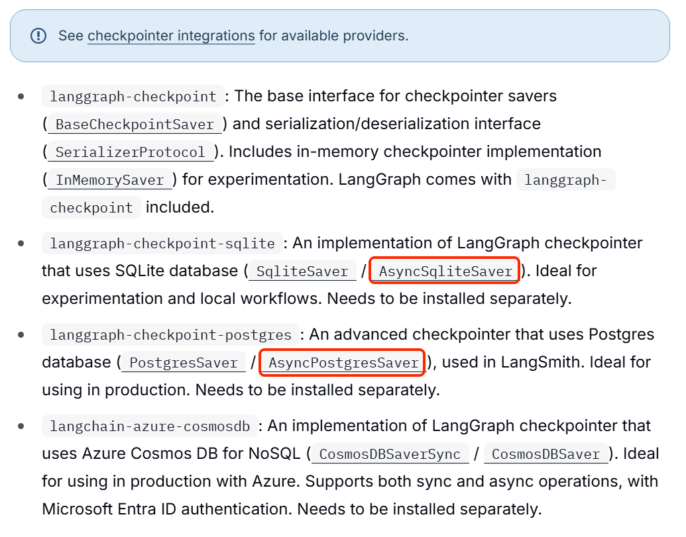


以SqliteSaver为例，LangChain提供了异步的AsyncSqliteSaver，官方的API文档如下：

[https://reference.langchain.com/python/langgraph.checkpoint.sqlite/aio/AsyncSqliteSaver]()


对于异步的数据库连接，虽然可以用`async with`来管理连接资源，但通常在生产中我们更多会使用连接池，所以就不建议用`async with`来处理了，而是建议手动管理连接。


示例代码：

```Python
async def test():
    # 创建连接
    conn = await aiosqlite.connect("agent.db")
    # 创建checkpointer
    checkpointer = AsyncSqliteSaver(conn=conn)
    
    # 创建Agent
    # 略..
    
    # 关闭连接
    await conn.close()
```


## 开发Agent

接下来，我们就可以正式开发Agent了，简单来说就是把之前jupyter中的代码拷贝过来。我们会把Agent代码封装到`app.agents`包下的`email_agent`文件：


不过，由于现在我们决定采用异步调用方式，并且还要支持HITL，隐藏其中有3个注意事项：

- 前端提交的信息不仅有message，可能还会包含用户对interrupt的决策

- 异步返回前端数据不仅有消息，还有Interrupt中断信息，不能仅返回data，而是要采用sse格式

- aiosqlite的初始化和使用必须在异步环境


### 重构ChatRequest

之前我们是纯对话的Agent，而这次包含了HITL，也就需要人工确认工具操作。因此前端不仅包含用户输入的message，还会出现interrupt的确认操作信息。

所以，我们必须重构ChatRequest类，添加新字段。


HITL人工确认的格式是这样的：

- approve

```Python
Command(
    resume={"decisions": [{"type": "approve"}]}
)
```

- reject

```Python
Command(
    resume={
        "decisions": [
            {
                "type": "reject",
                *# An explanation of why the request was rejected*
*                *"message": "算了，暂时不转了。"
            }
        
```

- edit

```Python
Command(
    resume={
        "decisions": [
            {
                "type": "edit",
                *# Edited action with tool name and args*
*                *"edited_action": {
                    *# Tool name to call.*
*                    # Will usually be the same as the original action.*
*                    *"name": "transfer_money",
                    *# Arguments to pass to the tool.*
*                    *"args": {"amount": 1000, "to": "王小明"},
                }
            }
        ]
    }
```

可以看到关键的`decisions`信息就是一个数组，其中的内容虽然不同，但都是Dict，在前端就是对象。所以我们可以让前端直接提交Dict格式即可。

另外，当用户提交的是interrupt\_decision时，message就没有了，所以要变为可选参数。


因此，我们重构`app.model.schemas.py`中的`ChatRequest`，内容如下：

```Python
from typing import Optional, Dict, Any, List

from pydantic import BaseModel

*# --- 1. 数据模型 ---*
class ChatRequest(BaseModel):
    message: Optional[str] = None
    image_url: Optional[str] = None
    thread_id: str
    *# 用户确认的interrupt操作*
*    *interrupt_decision: Optional[Dict[str, Any]] = None
```


### SSE

SSE（Server\-Sent Events）是一种让服务器主动向浏览器推送数据的通信协议。


它基于 HTTP，使用 `text/event-stream` 格式，前端可以通过 `EventSource` API 方便地接收。其核心特点就是：服务器一次连接，多次推送，且前端可以自动重连，非常适合像大模型输出、Agent 逐步推理这类流式场景。


简单来说，就是**前端发起一次请求，服务端以stream方式不断推送新的数据给前端**，前端完成渲染，从而实现大模型的流式输出效果。


在标准的SSE中，服务端返回的数据格式是纯文本格式，可以包含event、data、id、retry字段，每个字段后跟冒号和空格，并以\\n结束，不同消息之间则以两个\\n结束

```Python
[field]: [value]\n
[field]: [value]\n
\n\n
```


支持的字段：

| 字段    | 说明                                           | 示例             |
| ------- | ---------------------------------------------- | ---------------- |
| `event` | 指定事件类型（前端可监听特定事件）             | `event: message` |
| `data`  | 实际数据内容（可以是多行，多行会拼接）         | `data: Hello`    |
| `id`    | 消息ID，客户端可用于断线重连                   | `id: 1`          |
| `retry` | 重连时间（毫秒），客户端断线后等待多久重新连接 | `retry: 3000`    |


示例：

- 纯数据消息

```Python
data: 你好\n\n
```

- 带事件类型的消息

```Python
event: message \n
data: {"content": "你好"}\n\n
```


在之前的Personal Chief案例中，我们采用了简化版本的SSE，直接返回数据：

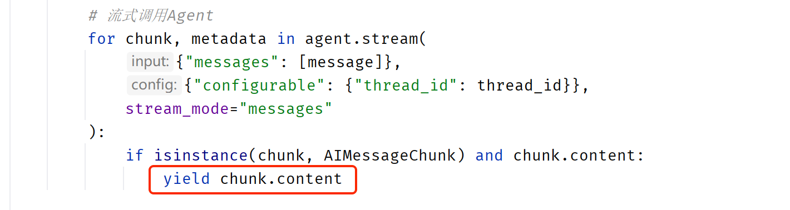

但现在我们不仅有消息，还需要返回interrupt信息，所以必须指定类型，也就是event，然后是数据data，因此stream流处理代码是这样的：

```Python
async def generate_sse(self, thread_id: str, message: str, interrupt_decision: dict):
    *"""生成 SSE 事件流"""*
*    *config = {
        "configurable": {
            "thread_id": thread_id
        }
    }

    *# 使用 HumanMessage 封装用户消息*
*    *messages = {"messages": [HumanMessage(content=message)]}
    *# 判断是消息还是 command*
*    *_input = messages
    if interrupt_decision:
        _input = Command(resume={
            "decisions": [interrupt_decision]
        })

    logger.info(f"调用agent，Input：{_input}")
    try:
        *# 使用 astream_events 流式获取事件*
*        *async for chunk in self.agent.astream(
            _input,
            config=config,
            stream_mode=["messages", "updates"],
            version="v2"
        ):
            event_type = chunk["type"]
            data = chunk["data"]

            *# 1. messages - LLM 流式输出（token 级别）*
*            *if event_type == "messages":
                token, metadata = data
                content = None
                if isinstance(token, AIMessage) and hasattr(token, "content"):
                    content = token.content

                if content:
                    yield {
                        "event": "message",
                        "data": json.dumps(
                            {"type": "message", "content": content},
                            ensure_ascii=False
                        )
                    }

            *# 2. updates - 节点完成的 state 更新*
*            *elif event_type == "updates":
                *# 2a. 中断事件*
*                *if "__interrupt__" in data:
                    interrupt_data = data['__interrupt__']
                    details = _serialize(interrupt_data)
                    yield {
                        "event": "interrupt",
                        "data": json.dumps(
                            {
                                "type": "interrupt",
                                "interrupt": {
                                    "reason": "需要人工确认",
                                    "details": details
                                }
                            },
                            ensure_ascii=False, default=str
                        )
                    }

        *# 流正常结束*
*        *yield {
            "event": "done",
            "data": json.dumps({"type": "done", "content": "处理完成"}, ensure_ascii=False)
        }

    except Exception as e:
        logger.error(f"SSE 流中断: {e}", exc_info=True)
        yield {
            "event": "error",
            "data": json.dumps({"type": "error", "error": str(e)}, ensure_ascii=False)
        }
```


### aiosqlite的初始化

首先，我们需要安装异步Sqlite依赖：

```JSON
uv add aiosqlite
```

然后，需要注意的是，由于aiosqlite需要运行在异步环境中，因此我们不能像之前那样直接把代码写在模块中，而是要封装一个类，定义异步方法完成初始化。


由于我们是基于FastAPI开发，因此最好让Sqlite的生命周期与FastAPI生命周期一致。


为了方便在FastAPI的生命周期开始与结束时与Sqlite建立连接、销毁连接，我们需要将初始化aiosqlite、checkpointer、关闭Sqlite的代码封装为异步方法。

像这样：

```Python
class EmailAgent:

    def __init__(self):
        self.conn: aiosqlite.Connection = None
        self.checkpointer: BaseCheckpointSaver = None
        self.agent = None

    async def init(self):
        await self.init_checkpointer()
        logger.info("checkpointer 初始化完成 ....")
        await self.init_agent()
        logger.info("email agent 初始化完成 ....")

    async def init_checkpointer(self):
        *# 建立连接*
*        *os.makedirs("./db", exist_ok=True)
        self.conn = await aiosqlite.connect("./db/mail_fiend.db")
        logger.info("sqlite connection 完成 ....")
        *# 初始化checkpointer*
*        *self.checkpointer = AsyncSqliteSaver(conn = self.conn)
        *# 自动建表*
*        *await self.checkpointer.setup()

    async def close(self):
        # 关闭连接
        await self.conn.close()
        logger.info("sqlite connection 关闭 ....")
        
    async def init_agent(self):
        # 略
        pass
        
    # 略
```


### 完整Agent代码


所以Agent代码是这样的：

```Python
import json
from langchain.agents import AgentState, create_agent
from langchain.tools import tool, ToolRuntime
from langchain_core.messages import HumanMessage, AIMessage
from langgraph.checkpoint.base import BaseCheckpointSaver
from langgraph.checkpoint.sqlite.aio import AsyncSqliteSaver
from langgraph.types import Command
from langchain.messages import ToolMessage
from langchain.agents.middleware import wrap_model_call, dynamic_prompt, HumanInTheLoopMiddleware
from langchain.agents.middleware import ModelRequest, ModelResponse
from typing import Callable
from app.common.logger import logger
import aiosqlite
import os

AUTHENTICATED_KEY = "authenticated"

*# state信息，记录用户是否授权邮箱操作*
class AuthenticatedState(AgentState):
    authenticated: bool

*# ==================== 1. 定义工具 ====================*
*# 定义工具，用于用户邮箱鉴权*
@tool
def authenticate(email: str, password: str, runtime: ToolRuntime) -> Command:
    *"""Authenticate the user with the given email and password"""*

*    # 定义变量，记录校验结果*
*    *authenticated = False
    message = "Authentication failed"

    *# 校验邮箱和密码*
*    *if email == "huge@itcast.cn" and password == "123":
        authenticated = True
        message = "Successfully authenticated"

    *# 返回校验结果*
*    *return Command(
            update={
                "authenticated": authenticated,
                "messages": [
                    ToolMessage(message, tool_call_id=runtime.tool_call_id)
                ],
            }
        )
*# 定义工具，用于操作邮箱*
@tool
def check_inbox() -> str:
    *"""Read an email from the given address."""*
*    # 模拟收件箱邮件*
*    *return [
        {
            "subject": "周末见个面？",
            "content": """
                嗨 虎哥，
                我下周会去城里，不知道我们有没有机会一起喝杯咖啡？

                祝好，简
            """,
            "from": "jane@itcast.cn",
            "status": "unread"
        },
        {
            "subject": "周五会议",
            "content": """
                嗨 虎哥，
                非常抱歉，我周五的会议无法准时参加了，能不能重新安排个时间？

                祝好，小李
            """,
            "from": "lixiaolong@itcast.cn",
            "status": "checked"
        }
    ]

@tool
def send_email(to: str, subject: str, body: str) -> str:
    *"""Send an response email"""*
*    *return f"邮件已发送至 {to} , 主题： {subject} , 内容： {body}"


*# 定义中间件，实现动态工具*
@wrap_model_call
async def dynamic_tool_call(
    request: ModelRequest, handler: Callable[[ModelRequest], ModelResponse]
) -> ModelResponse:
    *"""Allow read inbox and send email tools only if user provides correct email and password"""*

*    *authenticated = request.state.get(AUTHENTICATED_KEY)

    if authenticated:
        tools = [check_inbox, send_email]
    else:
        tools = [authenticate]

    request = request.override(tools=tools)
    return await handler(request)


*# 定义提示词*
authenticated_prompt = "You are a helpful assistant that can check the inbox and send emails."
unauthenticated_prompt = """You are a helpful email assistant.
    For system security protocols, you must authenticate user before any other interaction.
    """
*# 定义动态提示词中间件*
@dynamic_prompt
def dynamic_prompt_func(request: ModelRequest) -> str:
    *"""Generate system prompt based on authentication status"""*
*    *authenticated = request.state.get(AUTHENTICATED_KEY)
    final_prompt = authenticated_prompt if authenticated else unauthenticated_prompt
    return final_prompt

*# ==================== 辅助函数 ====================*
def _serialize(obj):
    *"""递归转换对象为可 JSON 序列化的格式"""*
*    *if hasattr(obj, 'value'):
        return _serialize(obj.value)
    elif hasattr(obj, 'model_dump'):
        return obj.model_dump()
    elif isinstance(obj, (list, tuple)):
        return [_serialize(item) for item in obj]
    elif isinstance(obj, dict):
        return {k: _serialize(v) for k, v in obj.items()}
    return obj


class EmailAgent:

    def __init__(self):
        self.conn: aiosqlite.Connection = None
        self.checkpointer: BaseCheckpointSaver = None
        self.agent = None

    async def init(self):
        await self.init_checkpointer()
        logger.info("checkpointer 初始化完成 ....")
        await self.init_agent()
        logger.info("email agent 初始化完成 ....")

    async def init_checkpointer(self):
        *# 建立连接*
*        *os.makedirs("./db", exist_ok=True)
        self.conn = await aiosqlite.connect("./db/mail_fiend.db")
        logger.info("sqlite connection 完成 ....")
        *# 初始化checkpointer*
*        *self.checkpointer = AsyncSqliteSaver(conn = self.conn)
        *# 自动建表*
*        *await self.checkpointer.setup()

    async def close(self):
        await self.conn.close()
        logger.info("sqlite connection 关闭 ....")

    async def init_agent(self):
        self.agent = create_agent(
            "deepseek-chat",
            tools=[authenticate, check_inbox, send_email],
            state_schema=AuthenticatedState,
            checkpointer=self.checkpointer,
            middleware=[
                dynamic_tool_call,
                dynamic_prompt_func,
                HumanInTheLoopMiddleware(
                    interrupt_on={
                        "authenticate": False,
                        "check_inbox": False,
                        "send_email": True,
                    }
                )
            ],
        )


    *# ==================== SSE 流式响应 ====================*
*    *async def generate_sse(self, thread_id: str, message: str, interrupt_decision: dict):
        *"""生成 SSE 事件流"""*
*        *config = {
            "configurable": {
                "thread_id": thread_id
            }
        }

        *# 使用 HumanMessage 封装用户消息*
*        *messages = {"messages": [HumanMessage(content=message)]}
        *# 判断是消息还是 command*
*        *_input = messages
        if interrupt_decision:
            _input = Command(resume={
                "decisions": [interrupt_decision]
            })

        logger.info(f"调用agent，Input：{_input}")
        try:
            *# 使用 astream_events 流式获取事件*
*            *async for chunk in self.agent.astream(
                _input,
                config=config,
                stream_mode=["messages", "updates"],
                version="v2"
            ):
                event_type = chunk["type"]
                data = chunk["data"]

                *# 1. messages - LLM 流式输出（token 级别）*
*                *if event_type == "messages":
                    token, metadata = data
                    content = None
                    if isinstance(token, AIMessage) and hasattr(token, "content"):
                        content = token.content

                    if content:
                        yield {
                            "event": "message",
                            "data": json.dumps(
                                {"type": "message", "content": content},
                                ensure_ascii=False
                            )
                        }

                *# 2. updates - 节点完成的 state 更新*
*                *elif event_type == "updates":
                    *# 2a. 中断事件*
*                    *if "__interrupt__" in data:
                        interrupt_data = data['__interrupt__']
                        details = _serialize(interrupt_data)
                        yield {
                            "event": "interrupt",
                            "data": json.dumps(
                                {
                                    "type": "interrupt",
                                    "interrupt": {
                                        "reason": "需要人工确认",
                                        "details": details
                                    }
                                },
                                ensure_ascii=False, default=str
                            )
                        }

            *# 无中断 → 流正常结束*
*            *yield {
                "event": "done",
                "data": json.dumps({"type": "done", "content": "处理完成"}, ensure_ascii=False)
            }

        except Exception as e:
            logger.error(f"SSE 流中断: {e}", exc_info=True)
            yield {
                "event": "error",
                "data": json.dumps({"type": "error", "error": str(e)}, ensure_ascii=False)
            }

    async def get_messages(self, thread_id: str) -> dict:
        *"""获取会话历史，如果存在中断则返回中断信息"""*
*        *logger.info(f"获取历史消息，thread_id: {thread_id}")

        config = {"configurable": {"thread_id": thread_id}}
        state = await self.agent.aget_state(config)
        if state is None or not state.values:
            return {"messages": []}

        messages = state.values.get("messages", [])

        *# 转换消息格式*
*        *result = []
        for msg in messages:
            if not msg.content:
                continue
            if isinstance(msg, HumanMessage):
                result.append({"role": "user", "content": msg.content})
            elif isinstance(msg, AIMessage):
                result.append({"role": "assistant", "content": msg.content})

        response = {"messages": result}

        *# 检查是否存在中断*
*        *interrupts = None
        if hasattr(state, 'interrupts') and state.interrupts:
            interrupts = state.interrupts
        elif hasattr(state, 'tasks') and state.tasks:
            for task in state.tasks:
                if hasattr(task, 'interrupts') and task.interrupts:
                    interrupts = task.interrupts
                    break

        if interrupts:
            response["has_interrupt"] = True
            response["interrupt"] = {
                "reason": "需要人工确认",
                "details": _serialize(interrupts)
            }

        return response

email_agent = EmailAgent()

__all__ = ["email_agent"]
```


### 生命周期管理

现在，Agent中包含了两个异步的初始化和关闭方法：

- init：初始化Sqlite连接、checkpointer、agent

- close：关闭Sqlite连接

这两个方法应该分别在FastAPI启动时、关闭时调用。


所以，我们需要在`main.py`中通过lifespan来实现生命周期管理：

```Python
*# 使用 lifespan 管理 checkpointer 生命周期*
@asynccontextmanager
async def lifespan(app: FastAPI):
    *# 启动时初始化 checkpointer 和 agent*
*    *await email_agent.init()
    yield
    *# 停机时，关闭连接*
*    *await email_agent.close()

app = FastAPI(
    title="Heima Agent API",
    description="黑马智能体API",
    version="0.1.0",
    lifespan=lifespan
)
```


## 对话接口

我们在`app.v1.chat.py`中添加一个新的接口，实现email\_agent的对话功能：

```Python
from fastapi import APIRouter
from fastapi.responses import StreamingResponse
from sse_starlette.sse import EventSourceResponse
from app.agents.personal_chief import search_recipes, get_messages, clear_messages
from app.models.schemas import ChatRequest
from app.agents.email_agent import email_agent

router = APIRouter()


@router.post("/chat/stream")
async def chat_endpoint(request: ChatRequest):
    return StreamingResponse(
        search_recipes(request.message, request.image_url, request.thread_id),
        media_type="text/event-stream"
    )


@router.get("/chat/messages")
async def get_chat_messages(thread_id: str):
    *"""获取历史消息"""*
*    *messages = get_messages(thread_id)
    return {"messages": messages}


@router.delete("/chat/messages")
async def clear_chat_messages(thread_id: str):
    *"""清空历史消息"""*
*    *clear_messages(thread_id)
    return {"success": True}


@router.post("/chat/send", tags=["聊天"])
async def send_chat(request: ChatRequest):
    *"""发送聊天消息，使用 SSE 流式返回 Agent 响应。同时处理 HITL 中断决策。"""*
*    *return EventSourceResponse(email_agent.generate_sse(request.thread_id, request.message or "", request.interrupt_decision))
```


## 会话管理接口

由于EmailFriend这个Agent的需求中包含会话管理的功能：

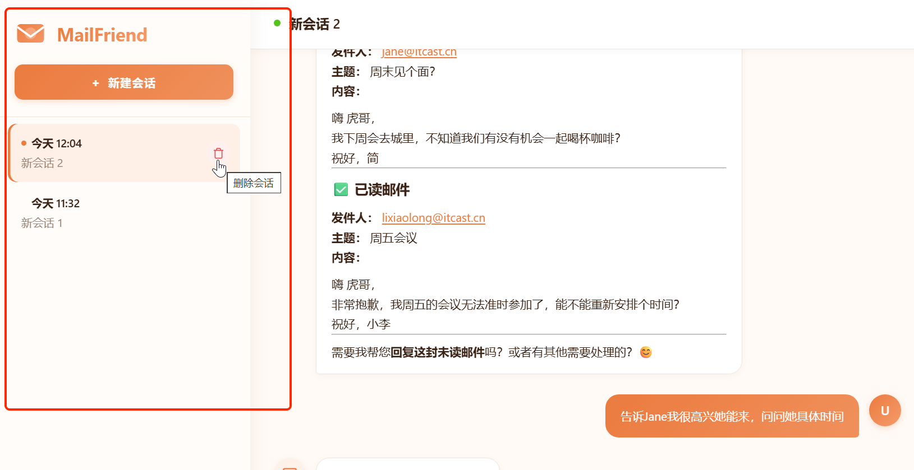

在LangChain中，会话是以`thread_id`来区分，所以会话管理功能都与thread\_id有关：

- **新建会话：**需要给当前用户创建一个新会话，生成新的`thread_id`

- **删除会话**：需要根据`thread_id`删除指定会话，并删除所有历史消息

- **查询会话列表**：查询所有会话，包含每个会话的thread\_id、会话创建时间等信息


这些会话信息都需要保存到数据库中，我们同样是基于Sqlite来实现。


### 会话管理Model

首先，我们创建一个新的会话管理Model，在其中实现数据库的相关操作，包括：

- 创建表

- 新建会话

- 删除会话

- 查询会话列表


在`app.models`包含新建一个`session.py`文件：

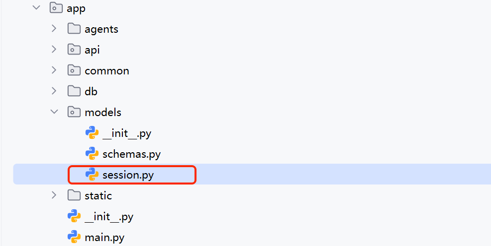

内容如下：

```Python
import sqlite3
import uuid
from datetime import datetime
from typing import List, Optional
from pathlib import Path

from pydantic import BaseModel


*# Pydantic 模型*
class SessionCreate(BaseModel):
    *"""创建会话的请求模型"""*
*    *user_id: str
    biz_type: str
    name: str


class SessionResponse(BaseModel):
    *"""会话响应模型"""*
*    *thread_id: str
    user_id: str
    biz_type: str
    name: str
    created_at: str
    updated_at: str


*# 数据库配置*
DB_PATH = Path(__file__).parent.parent / "db/sessions.db"


def get_db_connection():
    *"""获取数据库连接"""*
*    *conn = sqlite3.connect(str(DB_PATH))
    conn.row_factory = sqlite3.Row
    return conn


def init_db():
    *"""初始化数据库，创建 sessions 表"""*
*    *conn = get_db_connection()
    cursor = conn.cursor()
    cursor.execute("""
        CREATE TABLE IF NOT EXISTS sessions (
            thread_id TEXT PRIMARY KEY,
            user_id TEXT NOT NULL,
            biz_type TEXT NOT NULL,
            name TEXT NOT NULL,
            created_at TEXT NOT NULL,
            updated_at TEXT NOT NULL
        )
    """)
    conn.commit()
    conn.close()


def create_session(session: SessionCreate) -> SessionResponse:
    *"""创建新会话"""*
*    *conn = get_db_connection()
    cursor = conn.cursor()

    thread_id = str(uuid.uuid4())
    now = datetime.now().isoformat()

    cursor.execute(
        """
        INSERT INTO sessions (thread_id, user_id, biz_type, name, created_at, updated_at)
        VALUES (?, ?, ?, ?, ?, ?)
        """,
        (thread_id, session.user_id, session.biz_type, session.name, now, now)
    )
    conn.commit()
    conn.close()

    return SessionResponse(
        thread_id=thread_id,
        user_id=session.user_id,
        biz_type=session.biz_type,
        name=session.name,
        created_at=now,
        updated_at=now
    )


def get_sessions(user_id: Optional[str] = None, biz_type: Optional[str] = None) -> List[SessionResponse]:
    *"""查询会话列表，支持按 user_id 和 biz_type 筛选"""*
*    *conn = get_db_connection()
    cursor = conn.cursor()

    query = "SELECT thread_id, user_id, biz_type, name, created_at, updated_at FROM sessions"
    params = []

    if user_id or biz_type:
        conditions = []
        if user_id:
            conditions.append("user_id = ?")
            params.append(user_id)
        if biz_type:
            conditions.append("biz_type = ?")
            params.append(biz_type)
        query += " WHERE " + " AND ".join(conditions)

    query += " ORDER BY updated_at DESC"

    cursor.execute(query, params)
    rows = cursor.fetchall()
    conn.close()

    return [
        SessionResponse(
            thread_id=row["thread_id"],
            user_id=row["user_id"],
            biz_type=row["biz_type"],
            name=row["name"],
            created_at=row["created_at"],
            updated_at=row["updated_at"]
        )
        for row in rows
    ]


def delete_session(thread_id: str) -> bool:
    *"""删除会话"""*
*    *conn = get_db_connection()
    cursor = conn.cursor()

    cursor.execute("DELETE FROM sessions WHERE thread_id = ?", (thread_id,))
    deleted = cursor.rowcount > 0
    conn.commit()
    conn.close()

    return deleted


*# 初始化数据库*
init_db()
```


### 会话管理接口

接下来，我们还要开发基于FastAPI的接口，供前端使用。


在`app.api.v1`包下新建一个`sessions.py`文件，

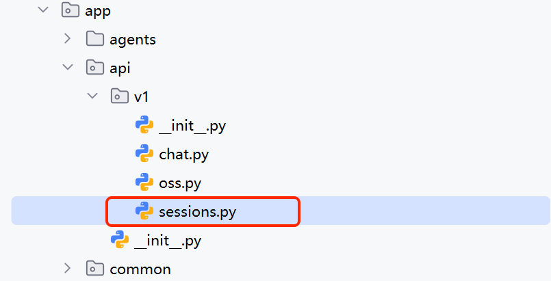

内容如下：

```Python
from typing import List, Optional

from fastapi import APIRouter, HTTPException, Query

from app.models.session import (
    SessionCreate,
    SessionResponse,
    get_sessions,
    create_session,
    delete_session
)
from app.agents.email_agent import email_agent

router = APIRouter()


@router.post("/sessions", response_model=SessionResponse, tags=["会话"])
def create_new_session(session: SessionCreate):
    *"""创建新会话"""*
*    *return create_session(session)


@router.get("/sessions", response_model=List[SessionResponse], tags=["会话"])
def list_sessions(
    user_id: Optional[str] = Query(None, description="用户ID"),
    biz_type: Optional[str] = Query(None, description="业务类型")
):
    *"""查询会话列表，支持按 user_id 和 biz_type 筛选"""*
*    *return get_sessions(user_id=user_id, biz_type=biz_type)


@router.delete("/sessions/{thread_id}", tags=["会话"])
async def remove_session(thread_id: str):
    *"""删除会话及其checkpoint"""*
*    *deleted = delete_session(thread_id)
    if not deleted:
        raise HTTPException(status_code=404, detail="Session not found")
    *# 同步删除 LangGraph checkpoint 中的会话状态*
*    *await email_agent.clear_messages(thread_id)
    return {"message": "Session deleted successfully"}


@router.get("/sessions/{thread_id}/messages", tags=["会话"])
async def get_session_messages(thread_id: str):
    *"""获取会话的历史消息"""*
*    *try:
        result = await email_agent.get_messages(thread_id)
        return result
    except Exception as e:
        return {"messages": [], "error": str(e)}
```


### 挂载router

最后，在`main.py`中挂载我们刚刚写的`sessions.py`：

```Python
from app.api.v1 import sessions

# 略

app.include_router(sessions.router, prefix="/api/v1", tags=["会话管理"])
```


main\.py的完整代码：

```Python
import os
from fastapi import FastAPI
from fastapi.responses import FileResponse
from fastapi.staticfiles import StaticFiles
from fastapi.middleware.cors import CORSMiddleware
from app.api.v1 import chat
from app.api.v1 import oss
from app.api.v1 import sessions
from app.common.logger import setup_logging
from contextlib import asynccontextmanager
from app.agents.email_agent import email_agent
*# 初始化日志配置*
setup_logging()

from dotenv import load_dotenv
load_dotenv()

*# 使用 lifespan 管理 checkpointer 生命周期*
@asynccontextmanager
async def lifespan(_app: FastAPI):
    *# 启动时初始化 checkpointer 和 agent*
*    *await email_agent.init()
    yield
    *# 停机时，关闭连接*
*    *await email_agent.close()

app = FastAPI(
    title="Personal Chief API",
    description="私厨",
    version="0.1.0",
    lifespan=lifespan
)

*# 1. 配置跨域资源共享 (CORS)*
*# 插件开发中，由于请求来自浏览器扩展环境，必须正确配置 CORS*
app.add_middleware(
    CORSMiddleware,
    allow_origins=["*"],  *# 生产环境建议指定插件的 ID 或具体域名*
*    *allow_credentials=True,
    allow_methods=["*"],
    allow_headers=["*"],
)

*# 2.挂载路由*
app.include_router(chat.router, prefix="/api/v1", tags=["对话"])
app.include_router(oss.router, prefix="/api/v1", tags=["申请上传签名url"])
app.include_router(sessions.router, prefix="/api/v1", tags=["会话管理"])

*# 3.挂载前端资源*
static_dir = os.path.join(os.path.dirname(__file__), "static")
if os.path.exists(static_dir):
    app.mount("/", StaticFiles(directory=static_dir, html=True), name="static")

*# 前端 fallback 路由 - 只处理非 API 请求*
@app.get("/{path:path}", include_in_schema=False)
async def serve_frontend(path: str):
    *# 排除 API 路径*
*    *if path.startswith("api/"):
        from fastapi.responses import JSONResponse
        return JSONResponse({"error": "Not Found"}, status_code=404)
    *# 如果请求的是静态文件，直接返回*
*    *file_path = os.path.join(static_dir, path)
    if os.path.isfile(file_path):
        return FileResponse(file_path)
    *# 否则返回 index.html（SPA fallback）*
*    *index_path = os.path.join(static_dir, "index.html")
    if os.path.exists(index_path):
        return FileResponse(index_path)
    return {"message": "你的独家私厨上线了~", "status": "ok"}

if __name__ == "__main__":
    import uvicorn
    *# 启动命令：python -m app.main*
*    *uvicorn.run("app.main:app", host="127.0.0.1", port=8001, reload=True)
```


## 前端

在课前资料中提供好了MailFriend的前端代码：

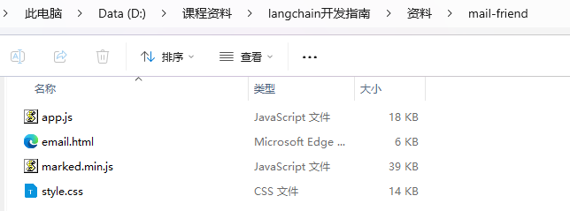

复制代码，直接粘贴到项目的`app/static`目录即可：

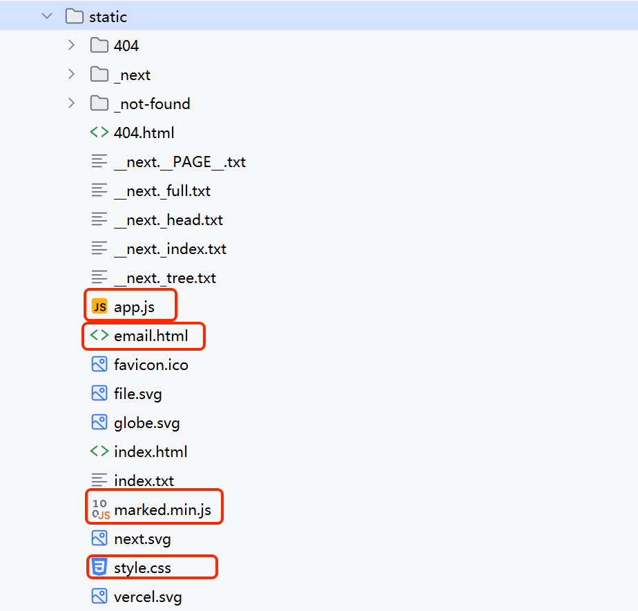


## 测试

启动服务，访问：http://127\.0\.0\.1:8001/email\.html，即可看到MailFriend的页面：

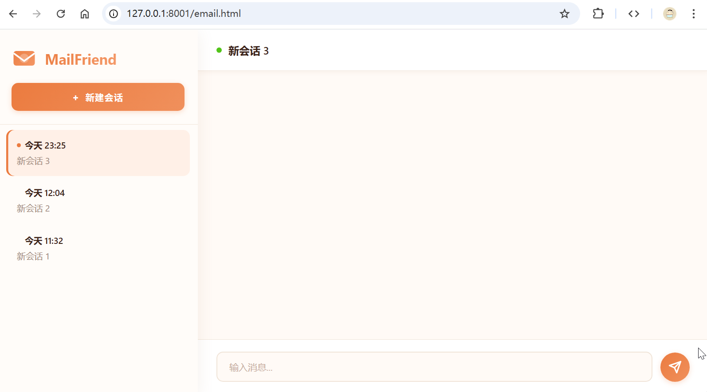


