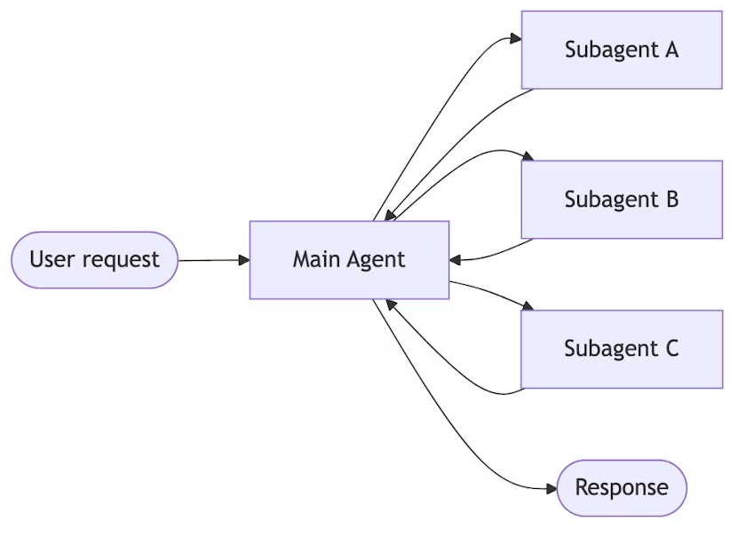
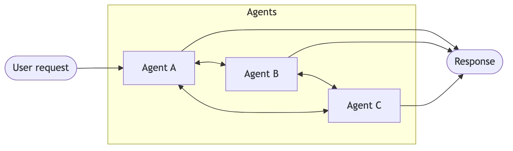
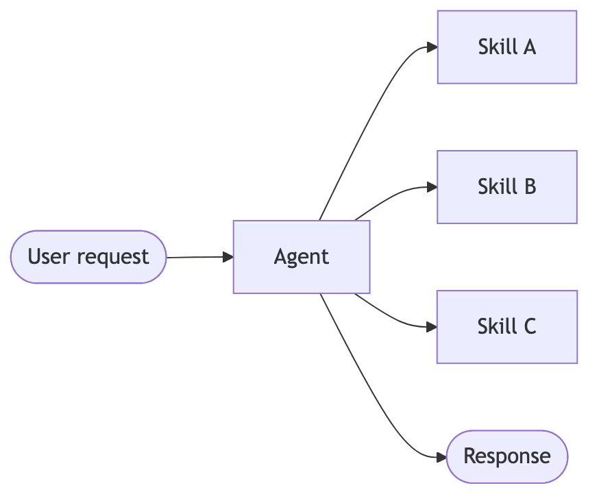
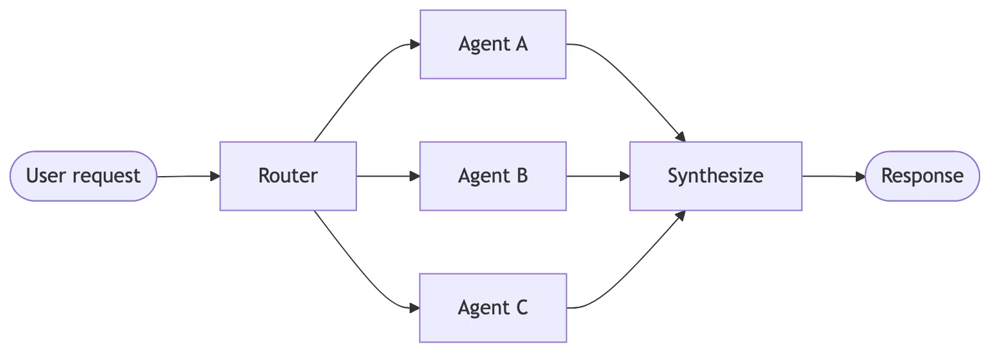
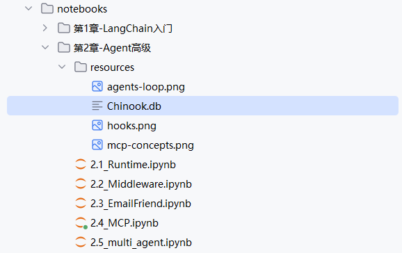

# 第5节\. 多Agent


Multi Agent，既多智能体协作系统，专门用来处理复杂的任务流程。


# 概述

大多数情况下，使用合适的Tool、合适的提示词和模型，单智能体就能完成任务。我们也推荐大家优先使用单智能体，只有在一些特殊情况下才推荐使用多智能体系统。


## 使用场景

通常在以下几种情况下我们会使用Multi Agent：

- **上下文管理\(Context Management\)**：如果同时需要调用的工具很多，或者上下文内容很多，我们可以将任务拆分，交给不同的Agent处理

- **分布式开发\(Distributed development\)**：不同的团队独立开发和维护自己的Agent，并将他们组合成一个更大的Agent

- **并行\(Parallelization\)**：将任务拆分为多个子任务，并交给专门的Agent处理，并同时执行它们以加快处理速度


## 常见模式

多智能体协作的模式有很多种，比较常见的有：

- **Subagents**：**子代理模式**，一个主Agent将多个子Agent作为Tool来协调使用。所有请求都由主Agent处理，决定何时以及如何调用每个子Agent



- **Handoffs**：**传递模型**，随着任务的执行改变state中的任务状态，从而触发路由变更或者触发Agent的配置变更，从而切换到其它Agent或者改变Agent的工具或系统提示（类似与一个新agent）。因此每个Agent都可以与用户交互，处理用户请求并返回响应。



- **Skills**：**技能模式**，只有1个Agent，根据任务按需加载Skill或知识



- **Router**：**路由模式**，1个负责路由的Agent对用户请求进行分类，将请求导向给一个或多个专门的Agent。最后再由一个Agent负责总结结果。



我们从四个方面来对比这几种模式：

- Distributed development：是否支持不同团队独立开发维护

- Parallelization：是否支持并行运行多个subagent

- Multi\-hop：是否支持按照特定顺序依次执行多个subagent

- Direct user interaction：是否支持subagent直接与用户对话


对比如下：

| Pattern 模式                                                 | Distributed development | Parallelization | Multi\-hop | Direct user interaction |
| ------------------------------------------------------------ | ----------------------- | --------------- | ---------- | ----------------------- |
| [Subagents](https://docs.langchain.com/oss/python/langchain/multi-agent/subagents) | ⭐⭐⭐⭐⭐                   | ⭐⭐⭐⭐⭐           | ⭐⭐⭐⭐⭐      | ⭐                       |
| [Handoffs](https://docs.langchain.com/oss/python/langchain/multi-agent/handoffs) | \-                      | \-              | ⭐⭐⭐⭐⭐      | ⭐⭐⭐⭐⭐                   |
| [Skills](https://docs.langchain.com/oss/python/langchain/multi-agent/skills) | ⭐⭐⭐⭐⭐                   | ⭐⭐⭐             | ⭐⭐⭐⭐⭐      | ⭐⭐⭐⭐⭐                   |
| [Router](https://docs.langchain.com/oss/python/langchain/multi-agent/router) | ⭐⭐⭐                     | ⭐⭐⭐⭐⭐           | \-         | ⭐⭐⭐                     |


当然，在实际开发中不局限与这四种模式，事实上我们可以把这些模式任意的混合使用，创造出无限的可能性。


# 案例

接下来，我们就做一个多Agent案例。


现在，我们计划开发一个婚礼策划智能体，它包含以下三个核心功能：

- 旅行规划：负责为你和宾客前往婚礼目的地寻找合适的机票，制定旅行计划

- 场地规划：负责根据宾客人数在目的地寻找合适的婚礼场地

- 音乐规划：负责根据用户需求筛选合适的婚礼歌单，并计算出预算


## 需求分析

理论上说，我们只要准备好以上每一步所需的**工具**，写好包含完整流程的**系统提示词**，用一个Agent就能实现这个功能。


但是，考虑到以下几个原因：

- 要使用的工具实在是太多，航班、场地、音乐等要查询的信息非常多，这会导致单Agent的上下文非常大，有可能超出模型上下文限制。把任务拆解可以减少上下文需求，因此适合分布式开发。

- 旅行、场地、音乐的三个任务没有关联，为了提高效率，可以并行执行


综上，建议采用多Agent开发，模式可以选择Subagents模式。我们可以开发三个Subagent：

- travel agent：负责为你前往婚礼目的地寻找往返机票

- venue agent：负责根据宾客人数在网上搜索合适的婚礼场地

- playlist agent：负责在音乐数据库筛选符合用户需求的歌单，并计算出预算

最后，我们还会定义一个主Agent，负责协调（*Coordinator*）工作，以及生成最终的婚礼计划方案。


当然，我们还是在jupyter中开发测试。


首先，需要解决mcp在Windows平台运行的问题：

```Python
import sys
import asyncio

*# Fix for Windows issues in Jupyter notebooks*
if sys.platform == "win32":
    *# 1. Use ProactorEventLoop for subprocess support*
*    *if not isinstance(asyncio.get_event_loop_policy(), asyncio.WindowsProactorEventLoopPolicy):
        asyncio.set_event_loop_policy(asyncio.WindowsProactorEventLoopPolicy())

    *# 2. Redirect stderr to avoid fileno() error when launching MCP servers*
*    *if "ipykernel" in sys.modules:
        sys.stderr = sys.__stderr__
```


然后是完整的依赖：

```Python
from langchain_mcp_adapters.client import MultiServerMCPClient
from langchain_community.utilities import SQLDatabase
from langchain.agents import AgentState
from typing import Dict, Any
from tavily import TavilyClient
from langchain.tools import tool
from langchain.tools import ToolRuntime
from langchain.messages import HumanMessage, ToolMessage, AIMessage
from langgraph.types import Command
from langchain.agents import create_agent
from dotenv import load_dotenv

load_dotenv()
```


接下来，就是agent开发了。


## travel agent

旅行agent要查询机票信息，需要Time和Kiwi两个MCP服务。


我们先定义工具：

```Python
*# MCP客户端，包含Time、Kiwi两个MCP*
client = MultiServerMCPClient(
    {
        "travel_server": {
                "transport": "http",
                "url": "https://mcp.kiwi.com"
        },
        "time": {
            "transport": "stdio",
            "command": "uvx",
            "args": [
                "mcp-server-time",
                "--local-timezone=Asia/Shanghai"
            ]
        }
    }
)

tools = await client.get_tools()
```

然后是agent：

```Python
*# Travel agent*
travel_agent = create_agent(
    model="deepseek-chat",
    tools=tools,
    system_prompt="""
    You are a travel agent. Search for flights to the desired destination wedding location, you must call tool to get current time.
    You are not allowed to ask any more follow up questions, you must find the best flight options based on the following criteria:
    - Price (lowest, economy class)
    - Duration (shortest)
    - Date (time of year which you believe is best for a wedding at this location)
    To make things easy, only look for one ticket, one way.
    You may need to make multiple searches to iteratively find the best options.
    You will be given no extra information, only the origin and destination. It is your job to think critically about the best options.
    Once you have found the best options, let the user know your shortlist of options.
    Remember call tool to get current time when you need.
    """
)
```


## venue agent

接着是负责婚礼场地的agent，这里我们简化实现方案，直接基于tavily搜索场地。


因此，首先是定义Tavily的web\_search工具：

```Python
*# 定义Tavily web_search工具*
tavily_client = TavilyClient()

@tool
def web_search(query: str) -> Dict[str, Any]:

    *"""Search the web for information"""*

*    *return tavily_client.search(query)
```

然后是agent：

```Python
*# 创建 Venue agent*
venue_agent = create_agent(
    model="deepseek-chat",
    tools=[web_search],
    system_prompt="""
    You are a venue specialist. Search for venues in the desired location, and with the desired capacity.
    You are not allowed to ask any more follow up questions, you must find the best venue options based on the following criteria:
    - Price (lowest)
    - Capacity (exact match)
    - Reviews (highest)
    You may need to make multiple searches to iteratively find the best options.
    """
)
```


## playlist agent

最后，是负责婚礼歌单的agent，为了方便查询，我提供好了一些模拟数据，保存在Sqlite中。db文件在notebooks的resources目录可以找到：



我们直接定义一个用于执行SQL语句的Tool：

```Python
db = SQLDatabase.from_uri("sqlite:///resources/Chinook.db")

@tool
def query_playlist_db(query: str) -> str:

    *"""Query the database for playlist information"""*

*    *try:
        return db.run(query)
    except Exception as e:
        return f"Error querying database: {e}"
```

测试一下：

```Python
*# 测试，查询歌单数据*
query_playlist_db.invoke({"query":"SELECT * FROM Playlist"})
```

如果能查询出下面数据，说明没问题：

```Python
"[(1, 'Music'), (2, 'Movies'), (3, 'TV Shows'), (4, 'Audiobooks'), (5, '90’s Music'), (6, 'Audiobooks'), (7, 'Movies'), (8, 'Music'), (9, 'Music Videos'), (10, 'TV Shows'), (11, 'Brazilian Music'), (12, 'Classical'), (13, 'Classical 101 - Deep Cuts'), (14, 'Classical 101 - Next Steps'), (15, 'Classical 101 - The Basics'), (16, 'Grunge'), (17, 'Heavy Metal Classic'), (18, 'On-The-Go 1')]"
```

接下来就是agent：

```Python
*# Playlist agent*
playlist_agent = create_agent(
    model="deepseek-chat",
    tools=[query_playlist_db],
    system_prompt="""
    You are a playlist specialist. Query the sql database and curate the perfect playlist for a wedding given a genre.
    Once you have your playlist, calculate the total duration and cost of the playlist, each song has an associated price.
    If you run into errors when querying the database, try to fix them by making changes to the query.
    Do not come back empty handed, keep trying to query the db until you find a list of songs.
    You may need to make multiple queries to iteratively find the best options.
    """
)
```


## 主Agent

最后，就是主Agent了，也是整个Agent的核心协调者。它负责与用户交互，收集婚礼信息，调用各个Subagent，筹备婚礼计划。


### 定义state

首先，我们需要定义一个state，记录婚礼风格有关的信息，包括：

- 婚礼人数

- 音乐风格

- 出发地

- 婚礼举办地


```Python
class WeddingState(AgentState):
    origin: str
    destination: str
    guest_count: str
    genre: str
```


### Tools

首先，要执行婚礼规划任务必须知道婚礼信息，也就是state中要记录的数据。AI通过与用户沟通可以获得这些信息，但是必须有一个tool负责更新state信息，当AI通过与用户聊天获取这些信息后，调用该tool更新到state中。

```Python
@tool
def update_state(origin: str, destination: str, guest_count: str, genre: str, runtime: ToolRuntime) -> str:
    *"""Update the state when you know all of the values: origin, destination, guest_count, genre"""*
*    *return Command(update={
        "origin": origin,
        "destination": destination,
        "guest_count": guest_count,
        "genre": genre,
        "messages": [ToolMessage("Successfully updated state", tool_call_id=runtime.tool_call_id)]}
        )
```


接下来，按照Subagent模式，主Agent需要把Subagents当做一个个Tool来协调使用。所以，我们接下来就先定义3个Tool，分别对应3个Subagent\.

这些tool读取state中的婚礼信息，然后调用对应的subagent，分别完成自己的任务。

```Python
@tool
async def search_flights(runtime: ToolRuntime) -> str:
    *"""Travel agent searches for flights to the desired destination wedding location."""*
*    *origin = runtime.state["origin"]
    destination = runtime.state["destination"]
    response = await travel_agent.ainvoke({"messages": [HumanMessage(content=f"Find flights from {origin} to {destination}")]})
    return response['messages'][-1].content

@tool
def search_venues(runtime: ToolRuntime) -> str:
    *"""Venue agent chooses the best venue for the given location and capacity."""*
*    *destination = runtime.state["destination"]
    capacity = runtime.state["guest_count"]
    query = f"Find wedding venues in {destination} for {capacity} guests"
    response = venue_agent.invoke({"messages": [HumanMessage(content=query)]})
    return response['messages'][-1].content

@tool
def suggest_playlist(runtime: ToolRuntime) -> str:
    *"""Playlist agent curates the perfect playlist for the given genre."""*
*    *genre = runtime.state["genre"]
    query = f"Find {genre} tracks for wedding playlist"
    response = playlist_agent.invoke({"messages": [HumanMessage(content=query)]})
    return response['messages'][-1].content
```


### Agent

接下来，就是创建主Agent了，把刚刚的4个Tools都注册给它，并给它设定核心协调者的任务。

```Python
from langchain.agents import create_agent

coordinator = create_agent(
    model="deepseek-chat",
    tools=[search_flights, search_venues, suggest_playlist, update_state],
    state_schema=WeddingState,
    system_prompt="""
    You are a wedding coordinator. Delegate tasks to your specialists for flights, venues and playlists.
    First find all the information you need to update the state. Once that is done you can delegate the tasks.
    Once you have received their answers, coordinate the perfect wedding for me.
    """
)
```


测试：

```Python
response = await coordinator.ainvoke(
    {
        "messages": [HumanMessage(content="我来自伦敦，我想在巴黎举办一场100人的婚礼，爵士风格的")],
    }
)

for message in response["messages"]:
    message.pretty_print()
```


运行结果如下：

```Markdown
================================ Human Message =================================

我来自伦敦，我想在巴黎举办一场100人的婚礼，爵士风格的
================================== Ai Message ==================================

我先来更新状态，记录下已知的信息。
Tool Calls:
  update_state (call_00_l4dY1PAZArpZziQOLGKN3697)
 Call ID: call_00_l4dY1PAZArpZziQOLGKN3697
  Args:
    origin: 伦敦
    destination: 巴黎
    guest_count: 100
    genre: 爵士
================================= Tool Message =================================
Name: update_state

Successfully updated state
================================== Ai Message ==================================

太好了，状态已更新！现在我来同时委托三位专家为您服务：航班、场地和歌单。
Tool Calls:
  search_flights (call_00_jQ0y5LBOnnW9NB4vWoUr4316)
 Call ID: call_00_jQ0y5LBOnnW9NB4vWoUr4316
  Args:
  search_venues (call_01_3vfWLduq8GNy0akX5ff82089)
 Call ID: call_01_3vfWLduq8GNy0akX5ff82089
  Args:
  suggest_playlist (call_02_qoJANKkLAf4ymsrrx6Et2946)
 Call ID: call_02_qoJANKkLAf4ymsrrx6Et2946
  Args:
================================= Tool Message =================================
Name: search_flights

Now I have the correct results for flights from London (LHR) to Paris (CDG). Let me present the best options for you.

Since it's currently May 2026, the best time for a wedding in Paris would be **June** (peak romantic season with lovely weather) or **September** (mild autumn, less crowded, still beautiful). Let me summarize the best options.

---

## ✈️ Flights from 伦敦 (London) to 巴黎 (Paris) - Economy Class, One Way

### 🏆 Best Time: June 2026 (Late Spring/Early Summer - Perfect for a Paris Wedding!)

#### ✅ **Best Price Options (Direct Flights - Cheapest & Shortest Duration)**

| Route | Date & Time | Cabin | Price | Link |
|-------|-------------|-------|-------|------|
| London LHR → Paris CDG | **Sat 30 May** 19:45→22:00 (**1h 15min**) | Economy | **€92** | [Book](https://on.kiwi.com/3CxnWF) |
| London LHR → Paris CDG | **Sun 31 May** 19:45→22:00 (**1h 15min**) | Economy | **€92** | [Book](https://on.kiwi.com/4YgCWL) |
| London LHR → Paris CDG | **Sun 31 May** 14:45→17:05 (**1h 20min**) | Economy | **€92** | [Book](https://on.kiwi.com/50jGJE) |
| London LHR → Paris CDG | **Sat 30 May** 17:35→19:55 (**1h 20min**) | Economy | **€92** | [Book](https://on.kiwi.com/Zm1ujp) |
| London LHR → Paris CDG | **Sun 31 May** 17:35→19:55 (**1h 20min**) | Economy | **€92** | [Book](https://on.kiwi.com/uCgiSh) |
| London LHR → Paris CDG | **Sun 31 May** 06:15→08:40 (**1h 25min**) | Economy | **€92** | [Book](https://on.kiwi.com/TIUB7z) |

#### Other Great Options:
| London LHR → Paris CDG | **Mon 1 Jun** 20:50→next day 22:45 (via Barcelona) | Economy | **€99** | [Book](https://on.kiwi.com/KDsI8u) |
| London LHR → Paris CDG | **Sun 31 May** 08:55→11:15 (**1h 20min**) | Economy | **€102** | [Book](https://on.kiwi.com/Ruc4K5) |

### 🏆 Best Time: September 2026 (Early Autumn - Also Gorgeous for a Wedding!)

| Route | Date & Time | Cabin | Price | Link |
|-------|-------------|-------|-------|------|
| London LHR → Paris CDG | **Fri 4 Sep** 19:45→22:00 (**1h 15min**) | Economy | **€92** | [Book](https://on.kiwi.com/YnGLjU) |
| London LHR → Paris CDG | **Sun 6 Sep** 19:45→22:00 (**1h 15min**) | Economy | **€92** | [Book](https://on.kiwi.com/FZOs7G) |
| London LHR → Paris CDG | **Mon 7 Sep** 19:45→22:00 (**1h 15min**) | Economy | **€92** | [Book](https://on.kiwi.com/QNZ1Sa) |
| London LHR → Paris CDG | **Tue 8 Sep** 19:45→22:00 (**1h 15min**) | Economy | **€92** | [Book](https://on.kiwi.com/aCZNZ3) |
| London LHR → Paris CDG | **Wed 9 Sep** 19:45→22:00 (**1h 15min**) | Economy | **€92** | [Book](https://on.kiwi.com/Vi2Xgj) |
| London LHR → Paris CDG | **Thu 10 Sep** 15:00→17:20 (**1h 20min**) | Economy | **€92** | [Book](https://on.kiwi.com/Jbye96) |

---

### 🌟 Recommendation

For a **Paris wedding**, I'd recommend **June** as the absolute best time! The weather is warm, flowers are in bloom, and the city radiates romance!

**My top picks:**
1. **🔥 Best Value**: **Saturday 30 May** LHR→CDG, 19:45→22:00 - **€92** - Direct, only 1h 15min!
2. **🔥 Best Value**: **Sunday 31 May** LHR→CDG, 14:45→17:05 - **€92** - Direct, only 1h 20min!
3. **🔥 Best Value**: **Sunday 31 May** LHR→CDG, 06:15→08:40 - **€92** - Direct, arrive early to start wedding prep!

All direct flights from London Heathrow to Paris Charles de Gaulle take only about **1 hour 15 minutes** - it's practically a hop across the Channel!

**Fun fact about Paris:** The Eiffel Tower was originally built as a temporary structure for the 1889 World's Fair and was meant to be demolished after 20 years! It was saved because it proved useful as a radio antenna. Also, Paris has only one stop sign in the entire city - and it was installed as an experiment!

Wishing you a magical Paris wedding! 💕🗼🥂
================================= Tool Message =================================
Name: search_venues

Now I have gathered comprehensive information. Let me compile the best venue options for you.

Here are the best wedding venues in Paris that can accommodate **100 guests**, organized by price and quality:

---

## 🏆 Top Paris Wedding Venues for 100 Guests

### 1️⃣ Les Salons de l'Hôtel des Arts et Métiers ⭐ BEST VALUE
| Details | Info |
|---|---|
| **Location** | 9 bis, avenue d'Iéna, Paris 16th (near Eiffel Tower 🗼) |
| **Capacity** | ✅ Perfect for **80+ guests** (ideal for 100) |
| **Pricing** | Medium range - 3 wedding packages available (room rental + aperitif + meal + drinks + staff included) |
| **Reviews** | ⭐ Excellent reviews - "very beautiful wedding evening in a magnificent location" |
| **Why book?** | Stunning 19th-century private mansion, Eiffel Tower views, private garden, Napoleon III chandeliers, bridal boudoir included |

### 2️⃣ Renaissance Paris Arc de Triomphe Hotel ⭐ BEST AFFORDABLE OPTION
| Details | Info |
|---|---|
| **Location** | Near Arc de Triomphe & Champs-Élysées |
| **Capacity** | ✅ Up to **90 seated / 150 cocktail** |
| **Pricing** | Most affordable - rooms from ~$207/night |
| **Reviews** | ⭐ 4.1/5 (71 reviews on Yelp) - "guests treated like royalty" |
| **Why book?** | Modern luxury, Eiffel Tower views from balconies, great value for money |

### 3️⃣ Maison de l'Amérique Latine ⭐ ELEGANT GARDEN VENUE
| Details | Info |
|---|---|
| **Location** | Saint-Germain, Paris 7th |
| **Capacity** | ✅ **Min. 80 guests** - perfect for 100 |
| **Pricing** | Mid-to-high range (exclusive use weekends, 7pm-3am) |
| **Reviews** | ⭐ Excellent reviews - "gorgeous gardens, classic French look" |
| **Why book?** | Versailles-style gardens in central Paris, neoclassical facade, elegant salons |

### 4️⃣ Hotel Alfred Sommier ⭐ HISTORIC LUXURY
| Details | Info |
|---|---|
| **Location** | Central Paris (near Opéra Garnier) |
| **Capacity** | ✅ Perfect for 100 guests in 6 historic salons |
| **Pricing** | Mid-range - luxury boutique hotel pricing |
| **Reviews** | ⭐ Excellent - booking score 9.5/10 for location |
| **Why book?** | 6 historic reception salons (3 classified monuments), 100m² garden, rooftop 360° views |

### 5️⃣ The Westin Paris - Vendôme ⭐ CENTRAL LOCATION
| Details | Info |
|---|---|
| **Location** | Place Vendôme (heart of Paris) |
| **Capacity** | ✅ Suitable for 100 guests (Salon Aiglon) |
| **Pricing** | Mid-to-high range |
| **Reviews** | ⭐ 3.4/5 (192 Yelp reviews) - "WOW venue" for weddings |
| **Why book?** | Prime location near Louvre & Tuileries, elegant ballrooms |

---

### 💰 Price Guide Summary

| Venue | Price Level | Capacity Match | Reviews |
|---|---|---|---|
| **Les Salons de l'Hôtel des Arts et Métiers** | $$ Medium | ✅ Exact match | ⭐⭐⭐⭐⭐ |
| **Renaissance Paris Arc de Triomphe** | $ Affordable | ✅ Good match | ⭐⭐⭐⭐ |
| **Maison de l'Amérique Latine** | $$$ | ✅ Exact match | ⭐⭐⭐⭐⭐ |
| **Hotel Alfred Sommier** | $$-$$$ | ✅ Exact match | ⭐⭐⭐⭐⭐ |
| **The Westin Paris - Vendôme** | $$$ | ✅ Good match | ⭐⭐⭐½ |

### 🥇 My Top Recommendation

**Les Salons de l'Hôtel des Arts et Métiers** offers the best balance of:
- ✅ **Exact capacity** for 100 guests (min. 80, ideal for your needs)
- ✅ **Competitive pricing** (all-inclusive wedding packages)
- ✅ **Excellent reviews**
- ✅ **Prime location** near Eiffel Tower with garden views
- ✅ **Elegant 19th-century Parisian mansion** atmosphere

For the **most affordable** option, I recommend **Renaissance Paris Arc de Triomphe Hotel** (4.1/5 stars, modern, great views).

Would you like me to search for more specific pricing details for any of these venues?
================================= Tool Message =================================
Name: suggest_playlist

Here is your curated **Wedding Jazz Playlist**! 🎵💒

---

## 💍 Wedding Jazz Playlist - "A Night of Romance"

### Track Listing (18 songs)

| # | Track | Artist | Duration | Price |
|---|-------|--------|----------|-------|
| 1 | **'Round Midnight** | Miles Davis | 5:57 | $0.99 |
| 2 | **Bye Bye Blackbird** | Miles Davis | 7:56 | $0.99 |
| 3 | **Corcovado (Quiet Nights Of Quiet Stars)** | Bossa Nova | 3:26 | $0.99 |
| 4 | **Desafinado** | Bossa Nova | 3:05 | $0.99 |
| 5 | **Garota De Ipanema (The Girl from Ipanema)** | Bossa Nova | 4:45 | $0.99 |
| 6 | **Heart of the Night** | Smooth Jazz | 4:34 | $0.99 |
| 7 | **Love Is The Colour** | R. Carless | 4:11 | $0.99 |
| 8 | **Miles Ahead** | Miles Davis & Gil Evans | 3:30 | $0.99 |
| 9 | **Morning Dance** | Jay Beckenstein | 3:59 | $0.99 |
| 10 | **My Funny Valentine (Live)** 🎯 | Miles Davis | 15:08 | $0.99 |
| 11 | **Samba De Uma Nota Só (One Note Samba)** | Bossa Nova | 2:17 | $0.99 |
| 12 | **So What** | Miles Davis | 9:24 | $0.99 |
| 13 | **Someday My Prince Will Come** 🎯 | Miles Davis | 9:04 | $0.99 |
| 14 | **Song For Lorraine** | Jay Beckenstein | 4:00 | $0.99 |
| 15 | **Starburst** | Jeremy Wall | 4:51 | $0.99 |
| 16 | **Summertime** | Miles Davis | 3:20 | $0.99 |
| 17 | **The Duke** | Dave Brubeck | 3:35 | $0.99 |
| 18 | **When Evening Falls** | Smooth Jazz | 4:58 | $0.99 |

---

### 📊 Playlist Summary

| Metric | Value |
|--------|-------|
| **Total Duration** | **~98 minutes (1 hour 38 min)** |
| **Total Cost** | **$17.82** |
| **Number of Tracks** | **18 songs** |
| **Average Price Per Song** | **$0.99** |

### 🎯 Perfect for:
- **Cocktail hour** / welcome reception
- **First dance inspiration** (especially "Someday My Prince Will Come" & "My Funny Valentine")
- **Background dinner music** - smooth bossa nova and classic jazz
- **Romantic atmosphere** with Miles Davis classics and Brazilian bossa nova vibes

The playlist blends **classic Miles Davis jazz standards** with **softer Brazilian bossa nova tunes** (Garota De Ipanema, Corcovado, Desafinado) for that perfect wedding ambiance — elegant, romantic, and sophisticated! 💕
================================== Ai Message ==================================

各位专家已经给出了完美的方案！以下是您的巴黎婚礼全攻略 💍

---

## 🌟 伦敦→巴黎 梦幻婚礼策划方案

### ✈️ 航班推荐
**伦敦希思罗 (LHR) → 巴黎戴高乐 (CDG)**
- **最佳推荐**：5月31日（周日）或6月初，直飞仅需 **1小时15分钟**
- **价格**：仅 **€92/人** 起（经济舱，单程）
- 建议选择傍晚航班，宾客抵达后直接入住，第二天美美地参加婚礼 ✨

### 🏛️ 场地推荐 — 🥇 最佳选择
**Les Salons de l'Hôtel des Arts et Métiers** 
- 📍 巴黎16区，靠近埃菲尔铁塔
- 👥 可容纳 **80-100人**，完美匹配您的需求
- 💰 中等价位，含婚宴套餐（场地+餐前酒+正餐+酒水+服务人员）
- 🌿 拥有私人花园和拿破仑三世风格的水晶吊灯
- ⭐ 评价极佳！19世纪巴黎豪宅，尽显浪漫优雅

### 🎵 婚礼爵士歌单 — "浪漫之夜"
**18首精选曲目，总长~98分钟，仅需$17.82**

| 亮点歌曲 | 艺术家 | 适合场景 |
|---------|-------|---------|
| 🎯 **My Funny Valentine** | Miles Davis | **第一支舞** 💃 |
| 🎯 **Someday My Prince Will Come** | Miles Davis | **婚礼进行曲** 🎶 |
| **Corcovado / Desafinado** | Bossa Nova | 鸡尾酒会背景乐 |
| **Summertime** | Miles Davis | 晚宴氛围音乐 |

---

### 💍 我的整体建议

> **5月底或6月初**，宾客从伦敦直飞巴黎仅1小时15分，**€92/人**。
> 在 **Hôtel des Arts et Métiers**（19世纪巴黎公馆，可观埃菲尔铁塔）举办婚礼，配以 **Miles Davis爵士经典** 与 **巴西Bossa Nova** 的浪漫歌单——这将是一场完美融合英伦优雅与法式浪漫的婚礼！🎉

需要我进一步为您预订具体日期、场地或调整歌单吗？😊
```

