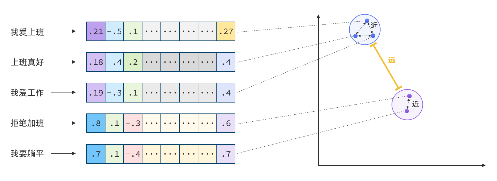
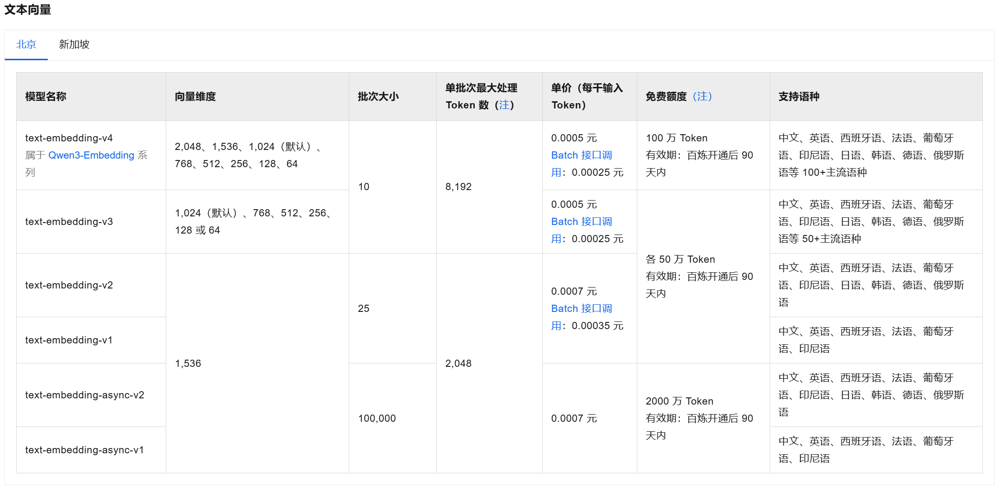

# 第4章\. Agentic RAG

大型语言模型（LLMs）功能强大，但存在几个关键局限性：

- 知识局限性：模型的回答都来自于训练数据，对于完全未接触过的专业领域，无法给出正确的答案

- 时间局限性：模型训练数据都来自于历史数据，比如DeepSeek的训练数据截止于2025年，无法回答实时问题


而要解决这些问题，就需要用到RAG技术了。


本章，我们就学习RAG技术，以及LangChain中如何实现RAG\.


# 认识RAG

**RAG**，**R**etrieval\-**A**ugmented **G**eneration，就是**检索增强生成**的意思。既，通过检索加载额外的知识作为上下文信息来增强LLM的回答。


具体是什么意思呢？


## LLM的幻觉

举例来说，某保险公司开发了一个自己的智能客服，希望智能客服可以7\*24小时在线，回答用户与自家的保险产品、条款、理赔有关的问题。


但是，受限于知识局限性，LLM对这家保险公司的产品、理赔条款完全不知道，是没办法回答的。如果强行回答，只能说一本正经的胡说八道，也就是所谓的**幻觉**。

那么，怎么解决这个问题呢？


## 外挂知识库

按照RAG的思想，我们可以把LLM不知道的知识作为提示词的一部分发送给他，这样LLM就可以根据提示词中的知识来回答用户问题了。


例如：AI保险客服不知道保险合同条款，当用户提问时，我们可以把保险公司的所有保险条款和用户问题都作为提示词，一起给模型：

模型拿到了公司完整的保险条款文档，然后根据文档就可以回答用户问题了。


怎么样，听起来是不是还不错？


可惜，理想很丰满，现实很骨感。


要知道，模型的上下文窗口是有限制的（AI通识篇有介绍过，可以回看视频），目前最大的上下文窗口也就1M token\. 

而作为一家保险商城，保险数量众多，其保险条款文档总数据量可能达到GB级别！！远远超过了模型的上下文窗口！

而且，即便上下文没有超出，每次用户提问都输入1M的token的上下午，这也是非常浪费的，毕竟token越多，收费越贵！


那该怎么办呢？


## 知识切分

要想让模型回答超出其训练数据以外的问题，就必须在请求模型时**携带额外知识数据**（**知识库**）。但是如果知识库书量太大，就存在两个问题：

- 可能超出模型上下文限制

- 浪费大量Token，成本高


该怎么办呢？


聪明的你应该能想到了：

> 知识库虽然很大，但回答用户问题并不需要整个知识库啊，**与用户问题相关的知识其实只是一小部分**。我们可以**把知识库切分成一个个的知识片段**，当用户提问时，**只携带与问题相关的知识片段**不就可以了！
>
> 


没错！


还是以保险商城智能客服为例。商城的保险条款非常多，但我们可以按照一定的规则切分：

- 按保险产品切分，每个产品一个条款文档

- 按条款内容切分，例如：投保范围、保险责任、受益人、保费缴纳、免赔策略、\.\.\.\.

- \.\.\.


按照上述规则将庞大保险知识库切分为小知识块，然后，当用户提问时，我们找到与之相关的知识块，拼入提示词即可：


好了，基于文档切分，只携带知识片段的思路，我们解决了之前的两个问题：

- 知识片段体积小，不会超出上下文限制

- 知识片段Token少，成本低


但是，新的问题来了：

> 切分后知识片段那么多，我怎么知道哪一个片段是与用户问题有关的呢？
>
> 


## 知识检索

知识库切分成无数的知识片段后，面临一个难题：

> 如何从海量的知识片段中找到与用户问题相关的那一个呢？
>
> 


可能有同学会想：

> 这很简单啊，把知识片段存入elasticsearch，拿着用户问题，基于全文检索算法搜索就行了。
>
> 


没错，这是一个办法，也能解决用户的一些问题。但并不能保证每次都能检索到正确的答案。


例如，用户问：我得过肝炎，能买这款产品呢？


这个问题的语义是想问**承保范围**问题，但是如果你用关键字全文检索，是很难找到对应条款的。所以，针对这类问题我们必须从**语义分析**来检索，找到语义上与用户问题最接近的知识片段。


用户问题、知识片段都是文字，也就是说我们需要找到一种办法判断两端文字语义是否接近。


那么，我们该如何基于语义判断两段文字是否接近呢？


### 向量相似度

在[AI通识与基础篇](https://my.feishu.cn/wiki/PAb6wSNnziRrlEk1PtNcH38LnJZ)，我们介绍Transformer时提到过，模型理解人类语言的方式就是Word Embedding，也就是把词转为多维向量，这些向量映射到多维空间时，不同方向、大小就具备不同的语义。


当然，在知识检索时我们不是要把每个词转为向量，而是把用户的问题（一句话）转为向量，把知识片段（一段话）转为向量，然后就可以通过比较**向量相似度**来**判断两者的含义是否接近**了。


那么，如何衡量向量相似度呢？


向量既然是在空间中，两个向量之间就一定能计算距离。


多维空间不好理解，我们以二维向量为例，向量之间的距离常见的计算方法有：

- **余弦相似度**（Cosine similarity）：两个向量之间的夹角。

- **欧氏距离**（Euclidean distance ）：两点之间的直线距离。

- **点积**（Dot product）：一个向量在另一个向量上的投影量


通常，两个向量之间**距离越近**，我们认为两个向量的**相似度越高**（距离值越小，相似度越高）


所以，当我们**把文本转为向量**，就可以**通过向量距离来判断文本的相似度**了。


现在，有不少的专门的**向量模型**，就可以实现将文本向量化。一个好的向量模型，就是要**尽可能让文本含义相似的向量，在空间中距离更近**：




例如，阿里云百炼平台就提供了很多用于知识检索的向量模型：

[https://bailian.console.aliyun.com/cn-beijing?tab=doc#/doc/?type=model&url=2842587]()




仅仅有向量模型还不够，假如知识切分后有成千上万的知识块（chunk），每一块都有自己的向量值，要在这么多知识块中找出与用户问题相关的向量，需要大量的计算，很麻烦。


那么，我们该如何简单、高效的检索知识片段呢？


### 向量数据库

向量数据库的主要作用有两个：

- 存储向量数据（知识片段）

- 基于相似度检索向量数据（知识片段）


LangChain中支持市面上常见的各种向量数据库，具体可查看官方文档：

[https://docs.langchain.com/oss/python/integrations/vectorstores]()


目前，企业常用向量数据库可以分为三类：

- **专用的向量数据库**：这些产品从底层专为向量检索设计，在高并发、低延迟、海量数据场景下表现最佳。

- **传统数据库集成向量功能**：通过插件或新增模块支持向量检索，优点是复用现有运维能力和生态

- **云原生向量数据库**：运维成本较低


新兴专用向量数据库：

| 数据库名称 | 核心特点                                                     | 典型企业场景                                           |
| ---------- | ------------------------------------------------------------ | ------------------------------------------------------ |
| Pinecone   | 全托管、无需运维、索引优化强                                 | 适合不希望管理基础设施的SaaS公司、初创企业。           |
| Milvus     | 最流行的开源向量数据库，功能全面（支持多种索引、混合查询）。 | 适合有数据安全要求、需要自建或私有化部署的中大型企业。 |
| Qdrant     | 用Rust编写，性能极高，支持丰富的过滤条件（Payload）。        | 适合需要复杂元数据过滤的场景（如电商、社交推荐）。     |
| Weaviate   | 内置ML模型（可直接向量化数据），支持GraphQL接口。            | 适合希望简化数据预处理流程、使用GraphQL的团队。        |
| Chroma     | 轻量级、嵌入式使用（类似SQLite），与LangChain集成最紧密。    | 适合原型验证、AI应用快速开发、个人/小团队项目。        |


传统数据库新增向量功能：

| 产品名称                    | 向量功能特点                                                | 常见用途                                       |
| --------------------------- | ----------------------------------------------------------- | ---------------------------------------------- |
| Elasticsearch               | 通过 `dense_vector` 字段和 `knn` 查询支持向量搜索。         | 已有ES集群的企业、日志\+向量混合搜索场景。     |
| Pgvector \(PostgreSQL扩展\) | 最流行的关系型数据库向量扩展，简单稳定，支持精确/近似搜索。 | 技术栈以PostgreSQL为主、不想引入新组件的企业。 |
| Redis                       | 通过 RediSearch 模块提供向量相似度搜索。                    | 需要超低延迟（缓存级）、实时推荐场景。         |
| ClickHouse                  | 通过余弦/欧氏距离函数支持向量检索                           | 大规模数据分析\+向量检索结合的OLAP场景。       |


企业开发，首推Milvus数据库，性能最好，而且开源免费

个人测试，用Milvus lite或Chroma都可以，都支持本地嵌入（类似Sqlite）


有了向量数据库，我们就无需自己检索向量了，全部交给向量数据库即可。


## 最终蓝图

到这里为止，RAG所需要的核心技术和原理就清楚了，这个时候你也能理解RAG名字的由来了。


**RAG，R**etrieval\-**A**ugmented **G**eneration，关键词：

- 检索：就是利用向量相似度检索知识片段

- 增强：用检索到的知识片段增强模型，减少幻觉

- 生成：模型基于知识片段生成答案


### RAG核心流程

综上所述，RAG分为两大阶段：

- **离线阶段**：负责构建知识库

  1. **知识加载**：读取各种来源的知识库数据，解析、清洗数据，形成文档（Documents）。

  2. **知识切分**：把清洗后的知识文档切分成一个个的知识片段（Chunks）

  3. **向量化**：利用向量模型将知识片段转为向量，使得语义相近的文本在该向量空间中彼此邻近

  4. **存储向量**：像处理好的向量及对应的知识片段存入向量数据库

- **在线阶段**：负责检索知识，生成回答

  1. **问题向量化**：利用向量模型（必须与离线阶段同一个模型）将用户问题转为向量

  2. **知识召回**：在向量数据库中检索与问题向量最相似的文档的TopN

  3. **生成回答**：把检索到的知识片段与用户提问组织为新提示词，发给大模型，生成回答


### LangChain的RAG组件

LangChain为了简化RAG的开发，为我们提供了大量组件，满足RAG每一个流程的实现。


主要的组件包括：

- **离线阶段**

  1. **知识加载：**LangChain提供了**Document Loader**组件

  2. **知识切分**：LangChain提供了**Text Splitter**组件

  3. **向量化**：LangChain提供了**Embeddings**接口，兼容各类向量模型

  4. **存储向量**：LangChain提供了**VectorStore**接口，兼容各类向量数据库

- **在线阶段**：负责检索知识，生成回答

  1. **问题向量化**：同样基于Embeddings模型接口

  2. **知识召回**：LangChain提供了**Retrievers**组件，简化知识片段的检索操作

  3. **生成回答**：直接调用模型即可


### RAG代码预览

最后，我们一起先看看LangChain实现RAG的代码流程，有一个整体的认知。


完整代码如下：

```Python
from langchain_community.document_loaders import PyPDFLoader
from langchain_text_splitters import CharacterTextSplitter
from langchain_community.embeddings import DashScopeEmbeddings
from langchain_core.vectorstores import InMemoryVectorStore
from langchain.tools import tool
from langchain.chat_models import init_chat_model
from langchain.agents import create_agent

import os
from dotenv import load_dotenv
load_dotenv()
# ===============一、构建知识库阶段====================
*# =============1.加载文档===============*
loader = PyPDFLoader(
    "resources/贵州茅台研报.pdf",
    mode="single", *# single \ page*
)
docs = loader.load()
print(f"文档数量:{len(docs)}")

*# =============2.切分文档===============*
*# 创建递归切分器*
splitter = CharacterTextSplitter(separator="\n", chunk_size=1000, chunk_overlap=150)
*# 切分文档*
chunks = splitter.split_documents(docs)
print(f"分块数量：{len(chunks)}")

*# =============3.向量化===============*
*# 向量模型，这里用阿里云的向量模型*
embeddings = DashScopeEmbeddings(
    model="text-embedding-v3",
    dashscope_api_key=os.getenv("DASHSCOPE_API_KEY")
)

*# 创建向量库，需要指定向量模型，存储文档时会自动调用向量模型完成向量化
vectorstore = InMemoryVectorStore(embedding=embeddings)
# 添加文档
**vectorstore.add_documents(chunks)*


# ==============二、在线问答阶段================
*llm = init_chat_model("deepseek-chat")

def try_rag(query: str):
    # 1.检索文档（VectorStore会自动把问题向量化，召回相关知识片段）
    retrieved_docs = vectorstore.similarity_search(query, k=2)
    # 2.拼接上下文提示词
    content = "\n\n".join(doc.page_content for doc in retrieved_docs)
    prompt = f"""你基于我提供的报告回答用户问题，报告中没提及的就说不知道，不要自己编造答案.
    report: ```{content}```
    query: {query}"""
    # 3.调用模型，生成答案
    response = llm.invoke(prompt)
**    return response.content*
```


测试：

```C++
print(try_rag("茅台收盘价多少"))
```

回答：

```Python
根据您提供的报告，贵州茅台的收盘价为1458.49元。
```


可以发现，一些简单问题RAG Agent可以正常回答。但如果问题复杂一些，就会出问题：

```C++
print(try_rag("茅台2025年的市盈率和市净率是多少"))
```

回答：

```Python
根据您提供的报告，其中提及了贵州茅台2025年的市盈率（PE）为22.2倍（见表格2“2025A/E”列），但报告中未提及2025年的市净率（PB）数据。因此，无法回答市净率的问题。
```

文档中明明有相关信息，但是回答却没有，这就是说现在这个RAG系统在知识检索上存在问题。


可见，LangChain尽管提供了组件能帮助我们快速搭建RAG系统，但要想开发出一个稳定、可靠的RAG系统，还有很多需要优化的地方。


接下来我们就分为两个阶段逐一学习这些RAG组件的用法，以及其中的优化细节：

- **第1节\. 构建知识库**：核心关注**离线阶段**的每个组件用法及企业优化方案

- **第2节\. RAG Agent**: 核心关注如何利用LangChain构建RAG Agent，实现**在线阶段**的知识检索和问答，并通过优化手段提高回答的准确度

- **第3节\. RAG评估**: 核心是RAG系统的健康指标，如何利用工具去**评估**RAG系统的能力


