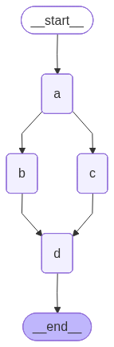
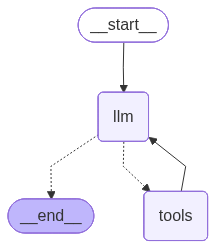

# 第1节\. 基本概念和入门

正如前面所述，LangGraph中包含的核心组件有：

- **节点（Node）**：工作流中的关键工作代码，可以是工具调用、知识检索、LLM调用，用函数来定义

- **边（Edge）**：也可以理解为线，就是把各个节点连接起来的路径，是控制工作流走向的关键，连接方式有：

  - 串行

  - 并行

  - 条件

- **状态（State）**：整个工作流中流转的数据

由Node和Edge组成的工作流就被称为**图（Graph）**：

接下来，我们就逐个学习LangGraph中的这些概念，以及如何利用这些组件构成**图（Graph）**，并自定义Agent\.

以下是本节课要用到的所有依赖：

```Python
from typing import Annotated, TypedDict, Literal
from langgraph.graph import StateGraph, START, END
from langgraph.graph.message import add_messages, MessagesState
from langgraph.checkpoint.memory import InMemorySaver
from langgraph.types import Command, CachePolicy, interrupt
from langgraph.runtime import Runtime
from langgraph.types import RetryPolicy, TimeoutPolicy
from langgraph.errors import NodeError

from langchain_core.messages import (
    BaseMessage, SystemMessage, HumanMessage, ToolMessage
)
from langchain.chat_models import init_chat_model
from langchain.tools import tool
from IPython.display import Image, display
from operator import add
from dotenv import load_dotenv
from pydantic.dataclasses import dataclass
load_dotenv()
```

# 基本概念

LangGraph的核心概念有3个：Node、Edge、State

## 节点（Node）

节点（Node）是图（Graph）的执行单元，每个Node是一个Python函数。


格式如下：

```Python
def my_node(state: State) -> dict:
    # 从state读取数据
    # 执行计算逻辑（可以调用LLM、工具、数据库等）
    # 返回state的更新部分（dict）
    return {"some_key": new_value}
```

- **输入**：完整的State对象

- **输出**：一个字典，只包含要更新的字段（部分更新）

- **可以做什么**：调用LLM、执行工具、读数据库、文件操作，最终把结果更新到State中\.\.\.

需要注意的是，LangGraph有两个默认的Node是无需定义的，可以直接使用：

- **START**：开始节点，也是入口

- **END**：结束节点，也是出口

例如，我们要做一个简单的Graph：

start\(用户输入name\) \-\-\> 节点1（生成问候语）\-\-\> 节点2（把问候语转大写）\-\-\> end

```Python
*# 最简单的三要素示例*

*# 1. State: 定义共享数据结构*
class SimpleState(TypedDict):
    name: str       *# 记录用户name*
*    *greeting: str   *# 记录生成的问候语*

*# 2. Node: 定义处理逻辑*
*# node 1: 生成问候语的节点*
def greet_node(state: SimpleState):
    *"""接收name，生成greeting"""*
*    *print(f"greet_node is receiving name: {state['name']}")
    return {"greeting": f"Hello, {state['name']}!"}
*# node 2: 转大写*
def uppercase_node(state: SimpleState):
    *"""将greeting转为大写"""*
*    *print(f"uppercase_node is receiving greeting: {state['greeting']}")
    return {"greeting": state["greeting"].upper()}

*# 3. Edge: 编排执行顺序*
graph_builder = StateGraph(SimpleState)             *# 1.用State创建图*
*                                                    # 2.注册节点*
graph_builder.add_node("greet", greet_node)             *# greet节点*
graph_builder.add_node("uppercase", uppercase_node)     *# uppercase节点*
*                                                    # 3.创建edge，连接各个节点*
graph_builder.add_edge(START, "greet")                  *# START -> greet*
graph_builder.add_edge("greet", "uppercase")            *# greet -> uppercase*
graph_builder.add_edge("uppercase", END)                *# uppercase -> END*

graph = graph_builder.compile()                     *# 4.编译成可执行图*

display(Image(graph.get_graph().draw_mermaid_png()))
```

生成的图结构：

测试一下（**注意：调用Graph必须传入初始化的State**）：

```Python
*# 执行*
result = graph.invoke({"name": "World"})
print(f"结果: {result['greeting']}")
```

结果：

```Python
greet_node is receiving name: World
uppercase_node is receiving greeting: Hello, World!
结果: HELLO, WORLD!
```

## State（状态）

State是图的共享内存，贯穿整个执行过程。

- State定义Graph中的数据字段

- 每个Node都可以获取State数据、更新的State数据（返回要更新的字段值即可）


而Node返回数据后State的更新处理方式取决于**Reducers**，而且State中的每个字段都有自己的Reducer。

### 默认Reducer

需要注意的是：如果字段没有指定Reducer，那**默认的Reducer行为就是覆盖**。

也就是说：如果多个Node都更新了State中的同一个字段，默认情况下后执行的Node将覆盖前面Node的更新结果。例如：

```Python
*# 1. State: 定义共享数据结构，这里采用默认Reducer*
class DefaultReducerState(TypedDict):
    val: str

*# 2. Node: 定义处理逻辑*
def node_1(state: DefaultReducerState):
    print(f"node_1 is receiving val: {state['val']}")
    return {"val": "node_1"}

def node_2(state: DefaultReducerState):
    print(f"node_2 is receiving val: {state['val']}")
    return {"val": "node_2"}

*# 3. Edge: 编排执行顺序*
default_reducer_graph = (
    StateGraph(DefaultReducerState)             *# 1.用State创建图*
*    *.add_node("node_1", node_1)      *# 2.注册节点*
*    *.add_node("node_2", node_2)
                                        *# 3.创建edge，连接各个节点*
*    *.add_edge(START, "node_1")               *# START -> greet*
*    *.add_edge("node_1", "node_2")         *# greet -> uppercase*
*    *.add_edge("node_2", END)             *# uppercase -> END*
*    *.compile()                          *# 4.编译成可执行图*
)

result = default_reducer_graph.invoke(DefaultReducerState(val="default"))
print(result)
```

上案例中每个Node都在修改State的`val`字段，但最终`val`只记录了最后一次的值。这就是默认的Reducer行为。

结果：

```Python
node_1 is receiving val: default
node_2 is receiving val: node_1
{'val': 'node_2'}
```

### 自定义Reducer

通过前面的例子我们就能看到默认的Reducer效果了。

如果我们不希望覆盖，则需要自定义Reducer，需要用到Annotated来定义：

- `Annotated[type, reducer]`

```Python
from operator import add
from typing import Annotated, TypedDict

class CustomReducerState(TypedDict):
    count: int                       *# 这个字段没有定义Reducer，也就是默认会覆盖旧值*
*    *nodes: Annotated[list[str], add] *# 这里使用add作为Reducer，也就是会拼接结果*


*# 2. Node: 定义处理逻辑*
def node_1(state: CustomReducerState):
    print(f"node_1 is receiving count: {state['count']}")
    return {"count": 1, "nodes": ["node_1"]} # 直接修改nodes值，不用自己拼接

def node_2(state: CustomReducerState):
    print(f"node_2 is receiving count: {state['count']}")
    return {"count": 2, "nodes": ["node_2"]} # 直接修改nodes值，不用自己拼接

*# 3. Edge: 编排执行顺序*
custom_reducer_graph = (
    StateGraph(CustomReducerState)             *# 1.用State创建图*
*    *.add_node("node_1", node_1)      *# 2.注册节点*
*    *.add_node("node_2", node_2)
                                        *# 3.创建edge，连接各个节点*
*    *.add_edge(START, "node_1")               *# START -> greet*
*    *.add_edge("node_1", "node_2")         *# greet -> uppercase*
*    *.add_edge("node_2", END)             *# uppercase -> END*
*    *.compile()                          *# 4.编译成可执行图*
)

result = custom_reducer_graph.invoke(CustomReducerState(count=0, nodes=[]))
print(result)
```

结果：

```Python
node_1 is receiving count: 0
node_2 is receiving count: 1
{'count': 2, 'nodes': ['node_1', 'node_2']}
```

可以看到，尽管Node中每次都是直接修改State的nodes字段，但最终由于使用了add这个Reducer，它会把nodes的初始值与新值拼接，类似于：

```Python
nodes = []
nodes = nodes + ['node1'] + ['node2']
```

## Edge（边）

Edge定义节点的执行顺序。LangGraph提供两种Edge：

| 边类型                     | 方法                                             | 说明                       |
| -------------------------- | ------------------------------------------------ | -------------------------- |
| 普通边（Normal Edge）      | `add_edge(node_a, node_b)`                       | 固定流向：A执行完一定到B   |
| 条件边（Conditional Edge） | `add_conditional_edges(node_a, router, mapping)` | router的返回值决定下一节点 |

示意图：

### Normal Edge

普通边连接的两个节点流向是固定的，前一个节点执行完一定会执行后一个节点。不同之处在于节点之间是串行还是并行：

- 串行: 整个工作流只有一条路径，路径中的节点按照顺序依次执行

- 并行: 整个工作流由多条路径，不同路径可以同时执行


上节我们演示的就是串行方式，本节课我们再来看看并行方式，结构如图：

```Python
┌──>  b ───┐
a ────┤          ├────> d
      └──>  c ───┘
```

代码：

```Python
class ParallelState(TypedDict):
    nodes: Annotated[list[str], add]

def node_a(state: ParallelState):
    print(f"node_a is running, nodes: {state['nodes']}")
    return {"nodes": ["a"]}


def node_b(state: ParallelState):
    print(f"node_b is running, nodes: {state['nodes']}")
    return {"nodes": ["b"]}

def node_c(state: ParallelState):
    print(f"node_c is running, nodes: {state['nodes']}")
    return {"nodes": ["c"]}

def node_d(state: ParallelState):
    print(f"node_d is running, nodes: {state['nodes']}")
    return {"nodes": ["d"]}

parallel_graph = (
    StateGraph(ParallelState)
        .add_node("a", node_a)
        .add_node("b", node_b)
        .add_node("c", node_c)
        .add_node("d", node_d)
        .add_edge(START, "a") *# start -> a*
*        *.add_edge("a", "b")   *# a -> b*
*        *.add_edge("a", "c")   *# a -> c*
*        *.add_edge("b", "d")   *# b -> d*
*        *.add_edge("c", "d")   *# c -> d*
*        *.add_edge("d", END)   *# d -> end*
*        *.compile()
)

display(Image(parallel_graph.get_graph().draw_mermaid_png()))
```

最终生成的Graph如图：



测试运行：

```Python
result = parallel_graph.invoke(ParallelState(nodes=[]))
print(result)
```

结果：

```SQL
node_a is running, nodes: []
node_b is running, nodes: ['a']
node_c is running, nodes: ['a']
node_d is running, nodes: ['a', 'b', 'c']
{'nodes': ['a', 'b', 'c', 'd']}
```

能发现，b和c确实是并行运行，因为node\_b和node\_c接收到了相同的参数。

### Conditional Edge

条件边的添加方式如下：

```Python
add_conditional_edges(node_a, router, mapping)
```

接收三个参数：

- `node_a`：是当前节点

- `router`：路由函数，逻辑自定义，它的返回值默认就是下个节点的名字。

- `mapping`：如果`router`返回值与下个节点名不一样，可以用mapping定义返回值与下个节点名字的映射关系

router可以根据情况返回不同的结果，但一次只能有一个结果。也就是说Conditional Edge连接的多个节点有且只有1个会成为next\_node。

例如，我们实现一个成绩判定的Graph，用户输入一个分数，我们根据分数判断走哪个节点：

- 大于60，走**成功**节点

- 小于60，走**失败**节点

代码：

```Python
*# 条件边示例：根据state决定走哪条路*
class RouteState(TypedDict):
    score: int
    result: str

def scorer(state: RouteState):
    score = int(input("请输入分数:"))
    print(score)
    return {"score": score}  *# 模拟评分*

def pass_node(state: RouteState):
    return {"result": "通过！"}

def fail_node(state: RouteState):
    return {"result": "不通过"}

def router(state: RouteState) -> Literal["pass", "fail"]:
    *"""根据score决定下一节点"""*
*    *if state["score"] >= 60:
        return "pass"
    return "fail"

condition_graph = (
    StateGraph(RouteState)          *# 1.创建Graph*
*                                    # 2.添加节点*
*    *.add_node("scorer", scorer)         *# 打分节点*
*    *.add_node("pass", pass_node)        *# 失败节点*
*    *.add_node("fail", fail_node)        *# 成功节点*
*                                    # 3.添加Edge*
*    *.add_edge(START, "scorer")               *# start -> scorer*
*    *.add_conditional_edges("scorer", router) *# scorer -> conditional_edge(router)*
*    *.add_edge("pass", END)                   *# pass -> end*
*    *.add_edge("fail", END)                   *# fail -> end*
*    *.compile()
)
result = condition_graph.invoke({"score": 0, "result": ""})
print(f"score={result['score']} -> {result['result']}")
```

结果：

```Python
95
score=95 -> 通过！
```


### Command实现条件分支

如果不想编写Conditional Edge，也可以在Node中直接返回下个节点信息。

但是，由于Node必须返回对State的更新，而没有条件边就需要返回下个节点的名字。函数返回值只能有一个。所以LangGraph就提供了Command API，用`Command`来指定下个节点以及要更新的字段。

示例：

```Python
def node_a(state: State) -> Command[Literal['node_b', 'node_c']]:
    # ...
    return Command(
        update={"k":"v"},
        goto="node_b"
    )
```

其中：

- `update `: 用来指定要更新的State字段

- `goto `: 用来指定下个节点


还是刚才的例子，我们用Command来实现：

```Python
*# 在Node中基于Command实现条件分支*

class RouteState(TypedDict):
    score: int
    result: str

def scorer(state: RouteState) -> Command[Literal["fail", "pass"]]:
    score = int(input("请输入分数:"))

    next_node = "pass" if score >= 60 else "fail"

    return Command(
        update=RouteState(score = score), *# 通过update更新State字段*
*        *goto=next_node                    *# 通过goto指定下个Node*
*    *)

def pass_node(state: RouteState):
    return {"result": "通过！"}

def fail_node(state: RouteState):
    return {"result": "不通过"}

command_condition_graph = (
    StateGraph(RouteState)          *# 1.创建Graph*
*                                    # 2.添加节点*
*    *.add_node("scorer", scorer)         *# 打分节点*
*    *.add_node("pass", pass_node)        *# 失败节点*
*    *.add_node("fail", fail_node)        *# 成功节点*
*                                    # 3.添加Edge*
*    *.add_edge(START, "scorer")               *# start -> scorer*
*    *.add_edge("pass", END)                   *# pass -> end*
*    *.add_edge("fail", END)                   *# fail -> end*
*    *.compile()
)

result = command_condition_graph.invoke({"score": 0, "result": ""})
print(f"score={result['score']} -> {result['result']}")
```


# LangGraph构建Agent

学会了用LangGraph的基本概念，以及如何创建Graph，接下来我们就可以用LangGraph从零构建一个Agent了。

## 基础LLM调用工作流

让我们先从最基本的LLM调用开始，先不要工具。

工作流是这样的：

代码：

```Python
*# 1.先初始化一个模型*
llm = init_chat_model("deepseek-chat")

*# 2.定义State，记录用户输入和LLM返回的结果*
class SimpleAgentState(TypedDict):
    user_input: str
    result: str

*# 3.定义LLM调用Node*
def call_llm(state: SimpleAgentState):
    *# 调用llm，得到结果*
*    *response = llm.invoke(state['user_input'])
    *# 更新state*
*    *return {"result": response.content}

*# 4.创建Graph*
llm_graph = (
    StateGraph(SimpleAgentState)
    .add_node("llm", call_llm)
    .add_edge(START, "llm")
    .add_edge("llm", END)
    .compile()
)
result = llm_graph.invoke(SimpleAgentState(user_input="你好", result=""))
print(result)
```

输出：

```Python
{'user_input': '你好', 'result': '你好！很高兴见到你，有什么我可以帮你的吗？'}
```

## 消息历史

目前的Graph中，State比较简单，只记录了两个值：

- `user_input`: 一次用户输入

- `result`: 一次LLM结果

然后实际在复杂的Agent中，用户会多次与LLM交互，还有工具调用，产生大量的历史消息，这些消息都需要记录下来。因此，我们的State需要重新设计。

### 自定义消息历史State

在之前学习LangChain时我们知道，Agent交互时的消息类型有很多：`SystemMessage`、`AIMessage`、`HumanMessage`、`ToolMessage`等。而这些消息都有一个共同的父类：`BaseMessage`。

因此，我们可以在State中定义一个字段，类型为**`list[BaseMessage]`**。但这还不够，由于要不断添加新的消息到这个list，所以还需要一个Reducer，而LangChain正好提供了这样的一个Reducer：**`add_message`**

示例：

```Python
from langgraph.graph.message import add_messages
from langchain_core.messages import (
    BaseMessage, SystemMessage, HumanMessage, ToolMessage
)

class MessageAgentState(TypedDict):
    messages: Annotated[list[BaseMessage], add_messages]
```

add\_message这个Reducer的效果就是不断累积消息，形成Message列表：

```Python
messages = [SystemMessage(content="你是一个热心助人的AI助手，你的名字叫武藏")]
messages = add_messages(messages, HumanMessage(content="你好，你是谁？"))
print(messages)
```

输出结果：

```Python
[SystemMessage(content='你是一个热心助人的AI助手，你的名字叫武藏', additional_kwargs={}, response_metadata={}, id='8ce1bc2c-3675-4bc6-aa46-83e43ac6e5d8'), HumanMessage(content='你好，你是谁？', additional_kwargs={}, response_metadata={}, id='89db75c5-1081-4e64-8c41-4e1930d81baa')]
```


来看一个完整示例：

```Python
from langgraph.graph.message import add_messages

class MessageAgentState(TypedDict):
    messages: Annotated[list[BaseMessage], add_messages]

*# 1.先初始化一个模型*
llm = init_chat_model("deepseek-chat")

*# 2.定义LLM调用Node*
def call_llm(state: MessageAgentState):
    *# 调用llm，得到结果*
*    *response = llm.invoke(state['messages'])
    *# 更新state*
*    *return {"messages": [response]}

*# 3.创建Graph*
llm_graph = (
    StateGraph(MessageAgentState)
    .add_node("llm", call_llm)
    .add_edge(START, "llm")
    .add_edge("llm", END)
    .compile()
)

result = llm_graph.invoke({"messages": messages})
print(result)
```

运行结果：

```Python
{'messages': [SystemMessage(content='你是一个热心助人的AI助手，你的名字叫武藏', additional_kwargs={}, response_metadata={}, id='8ce1bc2c-3675-4bc6-aa46-83e43ac6e5d8'), HumanMessage(content='你好，你是谁？', additional_kwargs={}, response_metadata={}, id='89db75c5-1081-4e64-8c41-4e1930d81baa'), AIMessage(content='嘿，你好呀！我是武藏，一个热心助人的AI助手。有什么需要我帮忙的吗？无论是解答问题、提供建议，还是陪你聊聊天，我都很乐意效劳！😊', additional_kwargs={'refusal': None}, response_metadata={'token_usage': {'completion_tokens': 42, 'prompt_tokens': 21, 'total_tokens': 63, 'completion_tokens_details': None, 'prompt_tokens_details': {'audio_tokens': None, 'cached_tokens': 0}, 'prompt_cache_hit_tokens': 0, 'prompt_cache_miss_tokens': 21}, 'model_provider': 'deepseek', 'model_name': 'deepseek-v4-flash', 'system_fingerprint': 'fp_8b330d02d0_prod0820_fp8_kvcache_20260402', 'id': '724c2179-64d3-4360-a0d6-988263ca5c8a', 'finish_reason': 'stop', 'logprobs': None}, id='lc_run--019e88e8-923d-70f0-801f-1b3aced22508-0', tool_calls=[], invalid_tool_calls=[], usage_metadata={'input_tokens': 21, 'output_tokens': 42, 'total_tokens': 63, 'input_token_details': {'cache_read': 0}, 'output_token_details': {}})]}
```


怎么样，熟悉的味道又回来了，这个返回值是不是跟LangChain的Agent返回值一模一样呢？


没错，因为LangChain的`create_agent`正是基于LangGraph实现的\~


### 默认的MessageState

事实上，记录Agent消息的场景非常常见，所以LangGraph中还提供了一个默认的State，专门用来记录消息历史，叫做`MessageState`：

```Python
class MessagesState(TypedDict):
    messages: Annotated[list[AnyMessage], add_messages]
```

可以看到其结构与我们自定义的非常相似，只是消息类型改成了`AnyMessage`，它可以看做是所有消息的统一类型。


所以，如果只是为了记录消息历史，我们可以不用定义State了，直接用`MessageState`：

```Python
from langgraph.graph.message import add_messages, MessagesState

*# 1.先初始化一个模型*
llm = init_chat_model("deepseek-chat")

*# 2.定义LLM调用Node*
def call_llm(state: MessagesState):
    *# 调用llm，得到结果*
*    *response = llm.invoke(state['messages'])
    *# 更新state*
*    *return {"messages": [response]}

*# 3.创建Graph*
llm_graph = (
    StateGraph(MessagesState)
    .add_node("llm", call_llm)
    .add_edge(START, "llm")
    .add_edge("llm", END)
    .compile()
)
result = llm_graph.invoke({})
print(result)
```


## 会话记忆

有了历史并不等于有记忆，记忆必须基于**会话id**\(`thread_id`\)来分别管理会话历史。这就要靠LangGraph中的`Checkpointer`来实现了。


之前在LangChain中我们就是导入的LangGraph提供的`Checkpointer`来实现记忆的，这里也一样。我们用默认的`InMemorySaver`来演示。


```Python
from langgraph.checkpoint.memory import InMemorySaver

*# 1.先初始化一个模型*
llm = init_chat_model("deepseek-chat")

*# 2.定义LLM调用Node*
def call_llm(state: MessagesState):
    *# 调用llm，得到结果*
*    *response = llm.invoke(state['messages'])
    *# 更新state*
*    *return {"messages": [response]}

*# 3.创建Graph*
memory_graph = (
    StateGraph(MessagesState)
    .add_node("llm", call_llm)
    .add_edge(START, "llm")
    .add_edge("llm", END)
    .compile(checkpointer=InMemorySaver()) *# 注意，在compile时指定Checkpointer*
)

*# 4.测试*
*# 依然要通过config中的thread_id来区分不同会话
config = {"configurable": {"thread_id": "1"}}
result = memory_graph.invoke(
    {"messages": [HumanMessage("你好，我是虎哥")]},
    config
)
result = memory_graph.invoke(
    {"messages": [HumanMessage("我是谁?")]},
    config
)
**print(result)*
```

结果：

```Python
{'messages': [HumanMessage(content='你好，我是虎哥', additional_kwargs={}, response_metadata={}, id='2c3a3e0e-bc10-40b8-b087-d642df279d2b'), AIMessage(content='哈哈，虎哥你好！👋 我是你的人工智能小助手，有啥需要帮忙的尽管说——查资料、聊闲天、解决难题，甚至脑洞大开的话题都能陪你唠！今天想聊点啥？😎（突然有种“大哥带小弟”的气势怎么回事……🤣）', additional_kwargs={'refusal': None}, response_metadata={'token_usage': {'completion_tokens': 64, 'prompt_tokens': 9, 'total_tokens': 73, 'completion_tokens_details': None, 'prompt_tokens_details': {'audio_tokens': None, 'cached_tokens': 0}, 'prompt_cache_hit_tokens': 0, 'prompt_cache_miss_tokens': 9}, 'model_provider': 'deepseek', 'model_name': 'deepseek-v4-flash', 'system_fingerprint': 'fp_8b330d02d0_prod0820_fp8_kvcache_20260402', 'id': '7174425d-48d6-4579-b6db-0bd413d3ed83', 'finish_reason': 'stop', 'logprobs': None}, id='lc_run--019e9219-708c-7441-b286-d51888736d95-0', tool_calls=[], invalid_tool_calls=[], usage_metadata={'input_tokens': 9, 'output_tokens': 64, 'total_tokens': 73, 'input_token_details': {'cache_read': 0}, 'output_token_details': {}}), HumanMessage(content='我是谁?', additional_kwargs={}, response_metadata={}, id='eaedacd4-2858-4f7b-890a-1e6f63cba8c6'), AIMessage(content='哈哈，这个问题有点哲学啊！🤔  \n从对话记录来看，你自称“虎哥”，可能是一位性格豪爽、爱开玩笑的朋友，或者单纯喜欢这个称呼带来的“大佬”气场。  \n不过严格来说，我无法知道你的真实身份——毕竟AI没有读心术，也不会偷偷翻你朋友圈（笑）。  \n所以，你想让我怎么称呼你？虎哥？还是另有隐藏身份？😎', additional_kwargs={'refusal': None}, response_metadata={'token_usage': {'completion_tokens': 88, 'prompt_tokens': 80, 'total_tokens': 168, 'completion_tokens_details': None, 'prompt_tokens_details': {'audio_tokens': None, 'cached_tokens': 0}, 'prompt_cache_hit_tokens': 0, 'prompt_cache_miss_tokens': 80}, 'model_provider': 'deepseek', 'model_name': 'deepseek-v4-flash', 'system_fingerprint': 'fp_8b330d02d0_prod0820_fp8_kvcache_20260402', 'id': 'ba15a4ed-519c-4ead-863c-b89be01f89c3', 'finish_reason': 'stop', 'logprobs': None}, id='lc_run--019e9219-f6b6-7562-9274-e7e2e80aa756-0', tool_calls=[], invalid_tool_calls=[], usage_metadata={'input_tokens': 80, 'output_tokens': 88, 'total_tokens': 168, 'input_token_details': {'cache_read': 0}, 'output_token_details': {}})]}
```


## 带工具调用的LLM工作流

Agent通常是绑定了工具的LLM。它没有固定的工作流，而是采用ReAct行为模式：

1. 把问题交给LLM处理（Reasoning）

   1. 判断是否需要调用工具

   2. 要调用哪个工具

2. 调用工具（Action）

3. 拿到工具结果，返回结果给LLM，判断是否能回答问题（回到1）

4. 生成响应，结束


如果我们把"调用LLM"、"工具执行"，都看做是Node，那节点的流转就是由LLM控制的，动态循环的过程。


### 定义Tool

```Python
from langchain.tools import tool
*# ====== Step 1: 准备工具和模型 ======*
*# 工具*
@tool
def get_weather(city: str) -> str:
    *"""获取城市天气"""*
*    *weather_data = {
        "北京": "晴天 25度",
        "上海": "多云 28度",
        "杭州": "小雨 22度",
    }
    return weather_data.get(city, f"未找到{city}的天气信息")

@tool
def square_root(x: float) -> str:
    *"""Calculate the square root of a number"""*
*    *return x ** 0.5

*# 组成工具数组*
tools = [get_weather, square_root]
*# 组成工具名和工具的映射，方便查找工具*
tools_by_name = {t.name: t for t in tools}
*# 定义模型*
model = init_chat_model("deepseek-chat")
*# 绑定工具到模型*
model_with_tools = model.bind_tools(tools)

```


需要注意的，手动调用带工具的模型，模型会返回要执行的工具的信息，我们需要解析这些信息，拿到要调用的工具名称和参数，自己去调用。

所以，我们才在上面建立了工具name与工具的映射。

另外，等一下定义Node的时候就需要自己调用Tool\.


### 定义Node

```Python
*# ====== Step 2: 定义Node函数 ======*
def llm_node(state: MessagesState):
    *"""LLM节点：调用模型，可以选择调用工具"""*
*    *response = model_with_tools.invoke(state["messages"])
    return {"messages": [response]}

def tool_node(state: MessagesState):
    *"""工具节点：执行LLM要求的工具调用"""*
*    *last_message = state["messages"][-1]
    results = []
    *# AI可能一次返回多个工具调用，所以需要循环处理，再收集结果*
*    *for tool_call in last_message.tool_calls:
        tool = tools_by_name[tool_call["name"]]
        result = tool.invoke(tool_call["args"])
        results.append(ToolMessage(
            content=result,
            tool_call_id=tool_call["id"]
        ))
    return {"messages": results}

def should_continue(state: MessagesState) -> Literal["tools", END]:
    *"""路由函数：判断下一步是继续调工具还是结束"""*
*    *last_message = state["messages"][-1]
    *# 如果包含tool_calls，则跳转到tools节点，没有则跳转到END节点*
*    *if hasattr(last_message, 'tool_calls') and last_message.tool_calls:
        return "tools"  *# 有工具调用 -> 去工具节点*
*    *return END           *# 没工具调用 -> 结束*

print("Step 2 完成: Node函数已定义")
```


### 构建Graph

```Python
*# ====== Step 3: 构建图 ======*
agent_graph = (
    StateGraph(MessagesState)
    .add_node("llm", llm_node)
    .add_node("tools", tool_node)
    .add_edge(START, "llm")
    .add_conditional_edges("llm", should_continue)
    .add_edge("tools", "llm")  *# 工具执行后回到LLM，形成循环*
*    *.compile()
)

display(Image(agent_graph.get_graph().draw_mermaid_png()))
```

最终构成的Graph结构：



测试：

```Python
*# ====== Step 4: 测试 ======*
print("测试1: 不需要工具调用\n")
result = agent_graph.invoke({
    "messages": [HumanMessage(content="你好")]
})
for m in result['messages']:
    m.pretty_print()
```

结果：

```Python
测试1: 不需要工具调用

================================ Human Message =================================

你好
================================== Ai Message ==================================

你好！有什么可以帮你的吗？😊
```


测试2：

```Python
print("测试2: 需要工具调用\n")
result = agent_graph.invoke({
    "messages": [HumanMessage(content="北京今天天气怎么样？")]
})
for m in result['messages']:
    m.pretty_print()
```

结果：

```Python
测试2: 需要工具调用

  执行了 1 个工具调用
================================ Human Message =================================

北京今天天气怎么样？
================================== Ai Message ==================================

让我查一下北京的天气情况。
Tool Calls:
  get_weather (call_00_1SBsFOZ2seeffAjJbPBZ2715)
 Call ID: call_00_1SBsFOZ2seeffAjJbPBZ2715
  Args:
    city: 北京
================================= Tool Message =================================

晴天 25度
================================== Ai Message ==================================

北京今天天气是**晴天**，气温**25度**，天气不错，适合外出活动哦！☀️
```


## Runtime Context

在LangGraph中同样支持Runtime Context功能，方式也完全一样：

- 定义ContextSchema

- 创建Graph时指定state、context\_schema、store等Runtime


示例：

```Python
from pydantic.dataclasses import dataclass

@dataclass
class ContextSchema:
    reasoning: str = "enable" *# 是否开启思考模式*

*# 1.先初始化一个模型，比如DeepSeek*
llm = init_chat_model("deepseek-v4-flash")

*# 2.定义LLM调用Node*
def call_llm(state: MessagesState, runtime: Runtime[ContextSchema]):
    *# 调用llm，得到结果*
*    *response = llm.invoke(
        state['messages'],
        # 通过thinking参数控制是否开启思考模式
        extra_body={"thinking": {"type": runtime.context.reasoning}}
    )
    print("调用llm")
    *# 更新state*
*    *return {"messages": [response]}

*# 3.创建Graph*
context_graph = (
    StateGraph(MessagesState, context_schema=ContextSchema)
    .add_node("llm", call_llm)
    .add_edge(START, "llm")
    .add_edge("llm", END)
    .compile()
)

# 4.调用Graph，传递context信息
result = context_graph.invoke(
    {"messages": [HumanMessage(content="你是谁？")]},
    context = {"reasoning": "disabled"}
)
print(result)
```


## 节点缓存\(Node Cache\)

LangGraph还提供了节点级别的缓存功能。当请求进入节点时，会根据节点输入的参数生成key，以key和节点的输出建立缓存。如果下次key命中，则直接返回结果而不用再执行该节点的逻辑。


要使用节点缓存需要两步：

- 在编译Graph时指定缓存实现方式，LangGraph提供了`InMemoryCache`、`RedisCache`、`SqliteCache`

- 为节点指定缓存策略。每个缓存策略支持：

  - `Key_func`：函数，用于根据节点的输入生成缓存键，默认为带有pickle的输入参数的hash值。

  - `ttl`：缓存的有效时间，以秒为单位。如果没有指定，缓存将永远不会过期。


```Python
from typing import Any
from langgraph.cache.memory import InMemoryCache

*# 1.先初始化一个模型*
llm = init_chat_model("deepseek-chat")

*# 2.定义LLM调用Node*
def call_llm(state: MessagesState):
    *# 调用llm，得到结果*
*    *response = llm.invoke(state['messages'])
    print("调用llm")
    *# 更新state*
*    *return {"messages": [response]}

def my_cache_key(*args: Any, **kwargs: Any) -> str | bytes:
    *"""把用户的消息作为key，消息一样则缓存命中"""*
*    *msgs = args[0]['messages']
    return msgs[0].content if msgs and len(msgs) > 0 else "0"

*# 3.创建Graph*
cache_graph = (
    StateGraph(MessagesState)
    .add_node("llm", call_llm, cache_policy=CachePolicy(key_func=my_cache_key))
    .add_edge(START, "llm")
    .add_edge("llm", END)
    .compile(cache = InMemoryCache())
)
```

测试：

```Python
# 4.测试
result = cache_graph.invoke(
    {"messages": [HumanMessage(content="你好")]}
)
print(result)
```

再次调用：

```Python
result = cache_graph.invoke(
    {"messages": [HumanMessage(content="你好")]},
)
print(result)
```

会发现第二次调用几乎是一瞬间就结束了，而且没有打印"调用LLM"，说明缓存命中了。


## 失败容错

当一个节点发生故障时，比如：外部API超时、临时网络异常、其它未处理的异常时，langgraph提供了三种可组合的失败容错机制：


- **重试（Retries）**\-根据异常类型和回退设置自动重新运行失败的尝试

- **超时（Timeouts）**\-限制单个尝试可能运行的时间

- **错误处理（Error handling）**\-在所有重试用尽后的降级处理策略

你可以使用set\_node\_defaults可以为所有Node统一配置这些机制，也可以每次调用add\_node时单独配置。


它们以固定的顺序组合：当节点尝试运行引发任何异常（包括超时的NodeTimeoutError）时，Retries策略决定是否重试。只有在重试失败后才运行Error handling。


注意：要设置timout参数必须保证Node的函数是异步（aysnc）的，否则会报错。


```Python
*# 1.先初始化一个模型*
llm = init_chat_model("gpt-3.5-turbo")

async def llm_node(state: dict, runtime):
    print(f"调用llm ... 第 {runtime.execution_info.node_attempt} 次")
    *# timeout要求一定要使用异步调用*
*    *response = await llm.ainvoke(state['messages'])
    return {"messages": [response]}

async def default_error_handler(state: MessagesState, error: NodeError) -> Command:
    print(f"运行异常，{error}")
    print("执行fallback逻辑...")
    return Command(goto=END)

builder = StateGraph(dict)
builder.add_node(
    "llm",
    llm_node,
    timeout=TimeoutPolicy(idle_timeout=3),
    retry_policy=RetryPolicy(max_attempts=3),
    error_handler=default_error_handler
)
builder.add_edge(START, "llm")
builder.add_edge("llm", END)
fail_tolerance_graph = builder.compile()

*# 运行测试*
result = await fail_tolerance_graph.ainvoke({"messages": [HumanMessage("你好")]})
print(result)
```


## Streaming

LangGraph中的streaming方式与LangChain的Agent一样：

```SQL
for chunk, metadata in agent_graph.stream(
    {"messages": [{"role": "user", "content": "429和517的平方根是多少?"}]},
    stream_mode="messages"
):
    content = chunk.content
    if content:
        print(content, end="", flush=True)
```

不过，LangGraph \> 1\.2\.0版本后提供了Stream的3\.0版本，推荐使用stream\_events方式实现streaming：

- 使用graph\.stream\_events方法实现stream调用

- 需要在参数中指定version="v3"

与LangChain中的v2版本不同，调用stream\_events不会返回Iterator，而是返回一个GraphRunStream类，你可以自己选择想要通过stream获取的内容：

- **stream** :  Iterate every protocol event\.

- **stream\.messages** : Stream chat model messages and token deltas\.

- **stream\.values** :   Iterate state snapshots and await the final value\.

- **stream\.output** :   Await the final output\.

- **stream\.subgraphs** :    Discover and observe nested graph executions\.

- **stream\.interrupts** : Inspect human\-in\-the\-loop interrupt payloads\.

- **stream\.interrupted** :  Check whether the run paused for human input\.

- **stream\.extensions** : Consume custom stream transformer projections\.


```Python
*# 先拿到stream*
stream = agent_graph.stream_events({
    "messages": [{"role": "user", "content": "429和517的平方根是多少?"}],
}, version="v3")

*# 再通过stream.messages拿到一个messages片段的Iterator*
for message in stream.messages:
    for token in message.text:
        print(token, end="", flush=True)
```


不过，需要注意的是这种方式并不是真正的流式输出，而是模拟的。真正的流式输出必须遍历stream的所有Event，然后自己获取其中的message信息：

```Python
*# 先拿到stream*
stream = agent_graph.stream_events({
    "messages": [{"role": "user", "content": "429和517的平方根是多少?"}],
}, version="v3")

for event in  stream:
    method = event['method']
    *# 判断事件类型，可以是messages、interrupts等等*
*    *if method == 'messages':
        delta = event['params']['data'][0].get('delta')
        if delta and delta.get('text'):
            print(delta.get('text'), end="", flush=True)
```


当然，在遍历stream结束后，我们还可以继续通过output拿最终完整结果：

```Python
*# 直接获取最终的完整结果*
final_state = stream.output
for m in final_state['messages']:
    m.pretty_print()
```


## Interrupts

**中断\(Interrupts\)**允许您在特定Node暂停Graph执行，并在继续之前等待外部输入。利用这个特性，就能实现“**Human In The Loop**”模式，把一些重要决断交给人工来做。


当中断被触发时，LangGraph使用它的`Checkpointer`保存Graph的`State`，并无限期地等待，直到恢复执行。


你可以在Graph的任何Node调用`interrupt()`函数来中断工作。该函数接受**向调用者显示的**任何json可序列化的值。

当您准备好继续时，您可以通过使用`Command(resume={})`重新调用Graph来恢复执行，而`resume`值将成为节点内部`interrupt()`调用的返回值。


一定要注意：断点恢复必须指定`thread_id`，它是找到不同会话Checkpointer的关键。


我们还是用之前讲过的邮件助手为例：

```Python
*# ====== Step 1: 定义各种工具 ======*
@tool
def check_inbox() -> str:
    *"""Read an email from the given address."""*
*    # 模拟收件箱邮件*
*    *return [
        {
            "subject": "周末见个面？",
            "content": """
                嗨 虎哥，
                我下周会去城里，不知道我们有没有机会一起喝杯咖啡？

                祝好，简
            """,
            "from": "jane@itcast.cn",
            "status": "unread"
        },
        {
            "subject": "周五会议",
            "content": """
                嗨 虎哥，
                非常抱歉，我周五的会议无法准时参加了，能不能重新安排个时间？

                祝好，小李
            """,
            "from": "lixiaolong@itcast.cn",
            "status": "checked"
        }
    ]


@tool
def send_email(to: str, subject: str, body: str) -> str:
    *"""Send an response email"""*
*    *human_decision = interrupt({
        "args": {
            "to": to,
            "subject": subject,
            "body": body,
        },
        "confirm": "这是我帮你写的邮件，你觉得如何？",
        "actions": ["reject", "approve", "edit"]
    })
    decision = human_decision.get("action")
    if decision == "approve":
        return f"邮件已发送至 {to} , 主题： {subject} , 内容： {body}"
    elif decision == "reject":
        return f"用户拒绝发送：{human_decision.get("reason")}"
    else: *# 修改邮件了，需要读取邮件内容*
*        *body = human_decision['args']['body']
        return f"邮件已发送至 {to} , 主题： {subject} , 内容： {body}"

*# 组成工具数组*
tools = [check_inbox, send_email]
*# 组成工具名和工具的映射，方便查找工具*
tools_by_name = {t.name: t for t in tools}

*# ====== Step 2: 定义模型，绑定工具 ======*
*# 定义模型*
model = init_chat_model("deepseek-chat")
*# 绑定工具到模型*
model_with_tools = model.bind_tools(tools)

*# ====== Step 3: 构建图 ======*
hitl_graph = (
    StateGraph(MessagesState)
    .add_node("llm", llm_node)
    .add_node("tools", tool_node)
    .add_edge(START, "llm")
    .add_conditional_edges("llm", should_continue)
    .add_edge("tools", "llm")  *# 工具执行后回到LLM，形成循环*
*    *.compile(checkpointer=InMemorySaver())
)

```

接下来测试一下：

```Python
*# ====== Step 4: 测试 ======*
config = {"configurable": {"thread_id": "1"}}
stream = hitl_graph.stream_events(
    {"messages": [HumanMessage("帮我查看下邮件")]},
    config = config,
    version="v3"
)

def handle_stream_message(stream):
    for event in stream:
        method = event['method']
        *# 判断事件类型，可以是messages、interrupts等等*
*        *if method == 'messages':
            delta = event['params']['data'][0].get('delta')
            if delta and delta.get('text'):
                print(delta.get('text'), end="", flush=True)

handle_stream_message(stream)
```

运行效果：

```YAML
你有两封邮件，我来帮你整理一下：

---

### 📬 收件箱

**1️⃣ 来自 Jane（jane@itcast.cn）—— 未读**
> **主题：** 周末见个面？
> **内容：**
> 嗨 虎哥，
> 我下周会去城里，不知道我们有没有机会一起喝杯咖啡？
>
> 祝好，简

**2️⃣ 来自 小李（lixiaolong@itcast.cn）—— 已查看**
> **主题：** 周五会议
> **内容：**
> 嗨 虎哥，
> 非常抱歉，我周五的会议无法准时参加了，能不能重新安排个时间？
>
> 祝好，小李

---

你想回复哪一封邮件？我可以帮你撰写和发送回复。
```

继续：

```SQL
stream = hitl_graph.stream_events(
    {"messages": [HumanMessage("帮我回复Jane，告诉她很高兴她能来，问问具体时间")]},
    config = config,
    version="v3"
)

handle_stream_message(stream)
```

会发现运行后没有任何输出，这是因为调用发邮件工具时被interrupt中止了。


我们可以通过`stream.interrupts`来获取中断信息：

```Python
interrupt_info = None
if stream.interrupted:
    interrupt_info = stream.interrupts[0].value
    print(interrupt_info)
```

结果：

```SQL
{'args': {'to': 'jane@itcast.cn', 'subject': 'RE: 周末见个面？', 'body': '嗨 简，\n\n很高兴你能来城里！我也很期待能一起喝杯咖啡。\n\n不知道你具体周几方便？什么时间合适？我们可以找个地方坐坐聊聊天。\n\n期待见到你！\n\n祝好，\n虎哥'}, 'confirm': '这是我帮你写的邮件，你觉得如何？', 'actions': ['reject', 'approve', 'edit']}
```

果然，这个输出信息就是`send_email`节点内部调用`interrupt`时传入的信息。


理论上接下来就是人机交互，让用户选择接下来的操作：approve/reject/edit了。


我们定义一个方法，用键盘录入模拟人机交互：

```Python
*# 定义收集用户指令的方法*
def get_human_decision(interrupt_info: dict):
    *# 这里模拟前端交互，让用户确认接下来的操作*
*    *action = input(f"""
    subject: {interrupt_info['args']['subject']}\n
    to: {interrupt_info['args']['to']}\n
    body: {interrupt_info['args']['body']}\n
    {interrupt_info['confirm']}\n
    可选操作：{interrupt_info['actions']}
    """)
    *# 判断操作是什么，返回不同的响应*
*    *resume = {"action": action, "args":{}}
    if action == "approve":
        return Command(resume=resume)
    elif action == "reject":
        *# 拒绝了，让用户说下修改建议*
*        *reason = input("好的，请说明拒绝原因。")
        resume['reason'] = reason
        return Command(resume=resume)
    else:
        *# 用户要修改邮件，让用户输入邮件内容：*
*        *body = input("请输入新的邮件内容")
        resume['args']['body'] = body
        return Command(resume=resume)

# 测试，获取人工确认信息
decision = get_human_decision(interrupt_info)

# 把人的确认信息发送回Graph，回复Graph运行
stream = hitl_graph.stream_events(
    decision,
    config = config,
    version="v3"
)

for message in stream.messages:
    for token in message.text:
        print(token, end="", flush=True)
```

运行后，如果我们输入approve，确认发送，会得到以下结果：

```Python
邮件已成功发送给 Jane！我用亲切的语气回复了她，表达了很高兴她能来城里，并询问了具体的到达时间，方便安排见面。希望你们能顺利约上咖啡 ☕😊
```


可以发现，整个处理过程其实就是一个循环。我们可以将上面的代码组装起来，形成一个对话的邮件助手Agent

```Python
config = {"configurable": {"thread_id": "3"}}
stream_input: dict | Command = {"messages": [HumanMessage("你好")]}

while True:
    stream = hitl_graph.stream_events(stream_input,config = config,version="v3")
    print("================🤖==================")
    for event in stream:
        method = event['method']
        *# 判断事件类型，可以是messages、interrupts等等*
*        *if method == 'messages':
            delta = event['params']['data'][0].get('delta')
            if delta and delta.get('text'):
                print(delta.get('text'), end="", flush=True)
    print("")
    *# 判断是否有Interrupt需要*
*    *if not stream.interrupted:
        *# 没有hitl信息，让用户接着输入*
*        *message = input("请输入：")
        if message == "quit":
            final_state = stream.output
            break
        print("================👤==================")
        print(message)
        stream_input = {"messages": [HumanMessage(message)]}
        *# 继续下次循环，调用Graph*
*        *continue

    *# 有Interrupt要处理*
*    *interrupt_info = stream.interrupts[0].value
    *# 人工介入，然后继续下次循环，就会把human_decision传给Graph*
*    *stream_input = get_human_decision(interrupt_info)
```

完整的模拟流程结果：

```Markdown
================🤖==================
你好！我是你的 AI 助手。请问有什么可以帮你的吗？😊
================👤==================
帮我看看我有没有未读邮件
================🤖==================
好的，我来帮你查看一下邮箱。你有 **2 封邮件**，其中：

### 📬 未读邮件（1封）

**发件人：** Jane（jane@itcast.cn）
**主题：** 周末见个面？
**内容：**
> 嗨 虎哥，
> 我下周会去城里，不知道我们有没有机会一起喝杯咖啡？
>
> 祝好，简

### ✅ 已读邮件（1封）

**发件人：** 小李（lixiaolong@itcast.cn）
**主题：** 周五会议
**内容：**
> 非常抱歉，我周五的会议无法准时参加了，能不能重新安排个时间？

---

需要我帮你回复哪一封邮件吗？😊
================👤==================
回复Jane，跟她说很高兴她能来，问问具体时间
================🤖==================

================🤖==================
明白了，不好意思！我重新用更亲切的语气回复她。
================🤖==================
已经帮你回复 Jane 啦！😊

邮件写得比较亲切，表示很高兴她能来，并询问了具体时间，让她告知抵达时间，你来安排地点。简应该很快就会回复你的～祝你们周末约会愉快！❤️
================👤==================
```


## create\_agent揭秘

至此你可能会发现：手动构建的图和 `create_agent` 行为几乎一样。这不是巧合——**`create_agent`**** 底层就是用 StateGraph 构建的**。


> **代码对比**
>
> 

```Python
# 你写的代码：
agent = create_agent(
    model="deepseek-chat",
    tools=[get_weather, calculate],
    system_prompt="你是一个有用的助手。",
    checkpointer=InMemorySaver(),
)

# 等同于底层手写的：
agent_graph = (
    StateGraph(MessagesState)
    .add_node("llm", llm_node)
    .add_node("tools", tool_node)
    .add_edge(START, "llm")
    .add_conditional_edges("llm", should_continue, ...)
    .add_edge("tools", "llm")
    .compile(checkpointer=InMemorySaver())
)
```


> **create\_agent 做了什么？**
>
> 

| 你的参数        | 底层转化                                          |
| --------------- | ------------------------------------------------- |
| `model`         | 绑定到llm\_node中                                 |
| `tools`         | 注册到tool\_node中，同时传给 llm\.bind\_tools\(\) |
| `system_prompt` | 注入到llm\_node的SystemMessage                    |
| `middleware`    | 在llm\_node前后插入before\_model/after\_model钩子 |
| `checkpointer`  | 传给 graph\.compile\(checkpointer=\.\.\.\)        |
| `state_schema`  | 传给 StateGraph\(YourState\)                      |


> **什么时候用哪种？**
>
> 

| 场景                              | 推荐方式                     |
| --------------------------------- | ---------------------------- |
| 标准工具调用Agent                 | `create_agent`               |
| 需要自定义Middleware              | `create_agent` \+ Middleware |
| RAG、简单检索问答                 | `create_agent` \+ Middleware |
| 多步骤流水线（检索→分析→总结）    | 手动StateGraph               |
| 条件分支（审批→执行/驳回）        | 手动StateGraph               |
| 并行执行（同时调用多个工具/模型） | 手动StateGraph               |
| 复杂循环（多轮推理直到满足条件）  | 手动StateGraph               |
| 子流程嵌套                        | 手动StateGraph               |


**原则**：能用 `create_agent` 解决的先用它，需要自定义控制流时再用手动Graph。两者不是互斥的——你可以在Graph中嵌套 `create_agent` 作为子节点。


