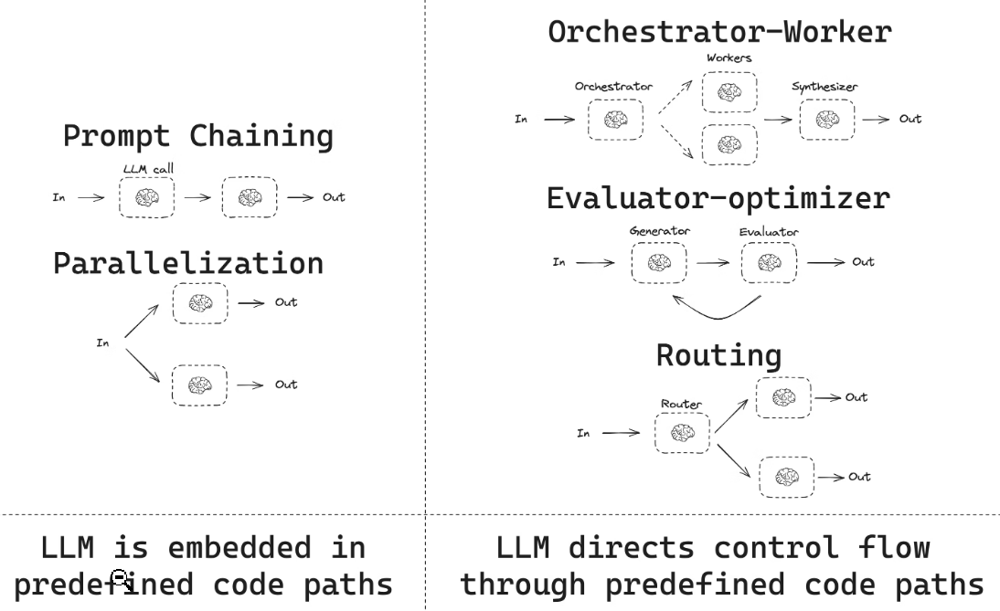
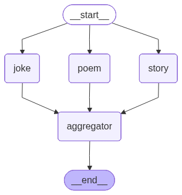
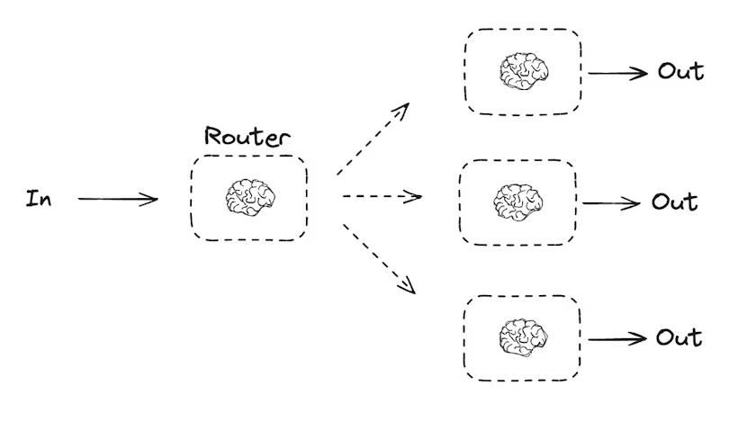
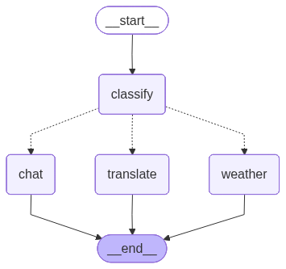
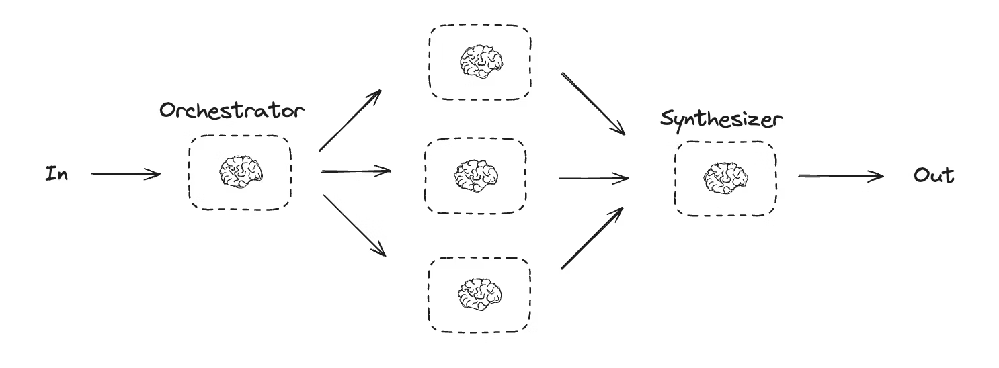
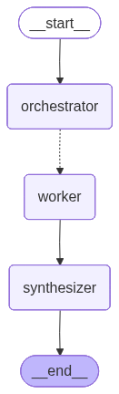
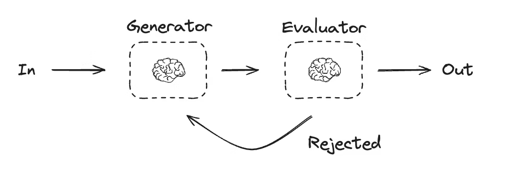
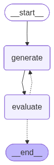
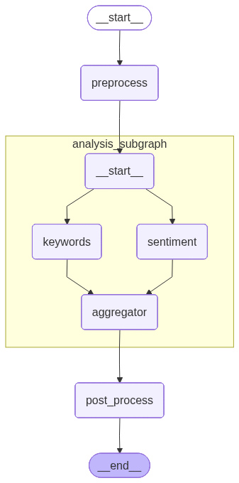
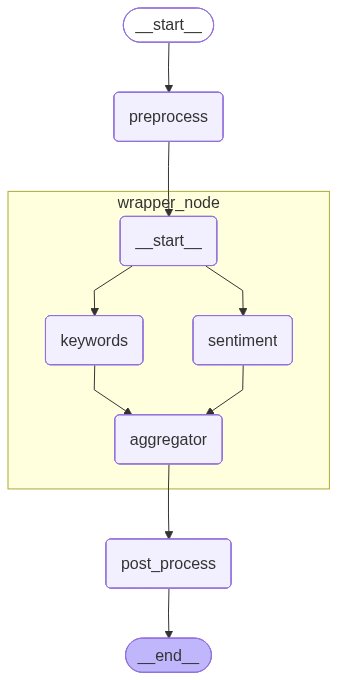

# 第2节\. 常见WorkFlow

上一节学习了LangGraph的Node、Edge、State三要素，知道了如何构建Agent，但LangGraph的能力并不在于构建简单的Agent，而是用图的方式灵活编排任意复杂的工作流。


本节深入学习各种常见的**流程编排模式。**


本节将学习七种核心编排模式：




左侧的两个：LLM嵌入到了预定义的工作流当中，用于你明确知道工作流程的场景。

右侧的三个：由LLM来控制工作流，更智能化。


本章会用到的依赖和工具：

```Python
from typing import Annotated, TypedDict, Literal, List
from langgraph.graph import StateGraph, START, END
from langgraph.graph.message import add_messages, MessagesState
from langgraph.checkpoint.memory import InMemorySaver
from langgraph.types import Command, CachePolicy, interrupt, Send
from langgraph.runtime import Runtime
from langgraph.types import RetryPolicy, TimeoutPolicy
from langgraph.errors import NodeError
from langchain_core.messages import (
    BaseMessage, SystemMessage, HumanMessage, ToolMessage
)
from langchain.chat_models import init_chat_model
from langchain.tools import tool
from IPython.display import Image, display
from operator import add
from dotenv import load_dotenv
from pydantic.dataclasses import dataclass
from pydantic import BaseModel, Field

load_dotenv()

def display_graph(graph, xray=False):
    *"""显示图结构，xray=True 可展开子图内部结构"""*
*    *display(Image(graph.get_graph(xray=xray).draw_mermaid_png()))
    
llm = init_chat_model("deepseek-chat")
```


# 顺序执行（Prompt Chaining）


Prompt Chaining 是最基础的编排模式：**前一个LLM的输出作为后一个LLM的输入**，像流水线一样串联起来。


**典型场景**: 写作流程（大纲→初稿→润色）、翻译\+校对、分步推理。


**与直接 LLM 调用的区别**: 顺序链可以在步骤之间加入**验证门控（Gate）**——如果某步质量不达标就退回重做，而不是一路到底。

比如，一个写笑话的工作流。

示意图：


代码示例：

```Python
*# Prompt Chaining: 生成笑话 → 检查质量 → 润色 → 加梗*
from typing import TypedDict
from langgraph.graph import StateGraph, START, END
from pydantic import BaseModel, Field

class JokeState(TypedDict):
    topic: str
    joke: str
    improved_joke: str
    final_joke: str

def generate_joke(state: JokeState):
    *"""步骤1: 生成初稿"""*
*    *msg = llm.invoke(f"Write a short joke about {state['topic']}")
    return {"joke": msg.content, "final_joke": msg.content}

def check_punchline(state: JokeState):
    *"""门控函数：检查笑话是否有笑点"""*
*    *msg = llm.invoke(f"Check if the joke has punchline and wordplay, return 'Pass' or 'Fail' for the joke: ```{state['joke']}```")

    result = msg.content
    if "Pass" == result:
        print(f"  [检查] 通过 ✓")
        return "Pass"
    print(f"  [检查] 不通过 ✗")
    return "Fail"

def improve_joke(state: JokeState):
    *"""步骤2: 改进——增加双关语"""*
*    *print(f"  [润色] 添加双关语...")
    msg = llm.invoke(f"Make this joke funnier by adding wordplay: {state['joke']}")
    return {"improved_joke": msg.content}


def polish_joke(state: JokeState):
    *"""步骤3: 润色——加一个反转"""*
*    *print(f"  [润色] 添加反转...")
    msg = llm.invoke(f"Add a surprising twist to this joke: {state['improved_joke']}")
    return {"final_joke": msg.content}

*# 构建图*
chaining_graph = (
    StateGraph(JokeState)
    .add_node("generate_joke", generate_joke)
    .add_node("improve_joke", improve_joke)
    .add_node("polish_joke", polish_joke)
    .add_edge(START, "generate_joke")
    *# 条件边：通过则直接结束，不通过则进入改进流程*
*    *.add_conditional_edges(
        "generate_joke",
        check_punchline,
        {"Pass": END, "Fail": "improve_joke"}
    )
    .add_edge("improve_joke", "polish_joke")
    .add_edge("polish_joke", END)
    .compile()
)

print("=== 测试1: 话题「大树」 ===\n")
r = chaining_graph.invoke({"topic": "大树", "joke": "", "improved_joke": "", "final_joke": ""})
print(f"\n最终笑话:\n{r['final_joke']}")
```

效果：

```Python
=== 测试1: 话题「大树」 ===

  [检查] 不通过 ✗
  [润色] 添加双关语...
  [润色] 添加反转...

最终笑话:
小树问大树：“你怎么越长越粗？根都扎这么深了。”  
大树低头看了看自己，又叹了口气：“因为……我其实是一棵萝卜，一直以为自己是树，怕露馅，才拼命往下长。”
```


# 并行执行（Parallelization）


通过并行化，可以让多个LLM同时处理一个任务，有两种不同的实现方式和作用：

- 提高效率: 将任务拆分为子任务，让多个LLM同时运行独立的子任务来完成，再汇总结果

- 提高准确度: 多个LLM运行相同的任务产生不同的输出，再合并优化结果

比如，我需要同时基于某个话题写三种题材：

- 笑话

- 故事

- 诗歌

并行执行的话效率会更高，示例代码：

```Python
*# Graph state*
class State(TypedDict):
    topic: str
    joke: str
    story: str
    poem: str
    combined_output: str

*# Nodes*
def joke_node(state: State):
    *"""First LLM call to generate initial joke"""*

*    *msg = llm.invoke(f"Write a joke about {state['topic']}")
    return {"joke": msg.content}

def story_node(state: State):
    *"""Second LLM call to generate story"""*

*    *msg = llm.invoke(f"Write a short story about {state['topic']}")
    return {"story": msg.content}

def poem_node(state: State):
    *"""Third LLM call to generate poem"""*

*    *msg = llm.invoke(f"Write a short poem about {state['topic']}")
    return {"poem": msg.content}


def aggregator(state: State):
    *"""Combine the joke, story and poem into a single output"""*

*    *combined = f"Here's a story, joke, and poem about {state['topic']}!\n\n"
    combined += f"STORY:\n{state['story']}\n\n"
    combined += f"JOKE:\n{state['joke']}\n\n"
    combined += f"POEM:\n{state['poem']}"
    return {"combined_output": combined}


*# Build workflow*
parallel_builder = StateGraph(State)

*# Add nodes*
parallel_builder.add_node("joke", joke_node)
parallel_builder.add_node("story", story_node)
parallel_builder.add_node("poem", poem_node)
parallel_builder.add_node("aggregator", aggregator)

*# Add edges to connect nodes*
parallel_builder.add_edge(START, "joke")
parallel_builder.add_edge(START, "story")
parallel_builder.add_edge(START, "poem")
parallel_builder.add_edge("joke", "aggregator")
parallel_builder.add_edge("story", "aggregator")
parallel_builder.add_edge("poem", "aggregator")
parallel_builder.add_edge("aggregator", END)
parallel_workflow = parallel_builder.compile()

*# Show workflow*
display_graph(parallel_workflow)
```

结构图：



测试：

```Python
*# Invoke*
state = parallel_workflow.invoke({"topic": "程序员"})
print(state["combined_output"])
```

结果：

```SQL
Here's a story, joke, and poem about 程序员!

STORY:
三小时前煮的最后一杯咖啡早已凉透，陈未却浑然不觉。显示器在昏暗的房间里亮着，冷白的光映在他那张两天没见太阳的脸上。

“再修一个就好。”他喃喃自语，指尖划过无尽头的Python代码。凌晨三点，一个老旧的支付模块抛出了空指针异常，生产服务器正在尖啸。

手机震动。又是经理。他没理会。

代码沉默地回望着他。几十万行——有些出自早已离职的同事，有些来自初出茅庐的实习生，还有一些是年轻时的自己写的，那时的他认为写注释是弱者的行为。

他找到了。第3847行。一个忘记写的`elif`子句，永远没有返回值。

“漂亮。”他低声说，手指在键盘上飞快敲击。打补丁、提交、推送。Slack上瞬间冒出一片绿色对勾。错误停止了。

陈未靠向椅背，廉价办公椅发出吱呀的呻吟。窗外，天幕从漆黑褪成灰白。鸟儿开始啁啾。又是新的一天。这样的场景他经历过无数次——在所有人沉睡时，一个分号一个分号地拯救世界。

他想起了女友。她一个月前离开了。“你嫁给你的代码了。”她说。他当时反驳过，可现在，在空荡荡的办公室里，在死寂之中，他无言以对。

手机又震了。这次不是经理。是母亲。

“吃了吗？”消息写着。发送时间——凌晨两点。

他瞥了一眼桌上的方便面。吃了一碗，还有两碗没动。他打字回复：“吃了，妈。马上睡。”

他并非每句话都在说谎。

晨光渐渐漫进办公室，陈未又一次打开了IDE。这次不是为了修bug。他打开了一个个人项目——一个他断断续续写了好几年的小诗生成器。没有用户，没有截止日期，没有经理。只有文字和代码，彼此共舞。

他写下一行注释：

`# 给那些忘了抬头看屏幕之外的日子。`

然后合上电脑，回了家。

JOKE:
一个程序员去面试，面试官问：“你最大的缺点是什么？”  
程序员答：“我有时候会太沉迷于代码，连女朋友都忘了。”  
面试官点头：“这倒是个诚实的回答。那你的优点呢？”  
程序员答：“我会写完美无缺的代码，没有bug。”  
面试官皱眉：“这不可能，代码总会有bug。”  
程序员淡定地说：“所以我的缺点是撒谎。”

POEM:
键盘敲落满天星，代码织成不夜城。  
逻辑为骨梦为魂，一屏光耀万重门。  
纵有千行皆过客，指针轻点破迷阵。  
夜深人静谁独坐？明月清风是故人。
```


# 路由（Routing\)

Routing工作流处理用户输入，然后将它们引导到上下文相关的任务Node。这允许您为复杂的任务定义专门的流。例如：

- 智能电商客服，首先识别问题的类型，然后将请求路由到 售前咨询、退款、退货等对应的Node。

- 知识问答机器人，首先识别问题知识领域，然后将请求路由到不同领域对应的专业Node上。


所以路由本质上也是条件分支，让Graph根据问题动态选择下一节点。这是Agent智能决策的核心机制。



例如，我们写三个**工作节点**：

- 天气节点：可以查询天气

- 新闻节点：可以查询新闻

- 翻译节点：可以翻译


然后写一个**意图识别节点**，根据用户意图路由到对应的工作节点，执行对应任务：

```Python
from typing import Literal, TypedDict
from langgraph.graph import StateGraph, START, END
from langchain.messages import HumanMessage, SystemMessage


*# 定义作为路由逻辑的结构化输出模型*
class Route(BaseModel):
    step: Literal["weather", "translate", "chat"] = Field(
        None, description="The next step in the routing process"
    )
*# 把路由结构化输出绑定到模型，形成一个用于路由的llm*
router = llm.with_structured_output(Route)

class IntentState(TypedDict):
    query: str
    intent: str
    result: str

def classify_intent(state: IntentState):
    *"""分类用户意图"""*
*    # Run the augmented LLM with structured output to serve as routing logic*
*    *decision = router.invoke(
        [
            SystemMessage(
                content="Route the input to weather, translate, or chat based on the user's request."
            ),
            HumanMessage(content=state["query"]),
        ]
    )

    return {"intent": decision.step}

def handle_weather(state: IntentState):
    return {"result": f"天气查询: {state['query']} -> 晴 25度"}

def handle_translate(state: IntentState):
    return {"result": f"翻译: {state['query']} -> Hello World"}

def handle_chat(state: IntentState):
    return {"result": f"闲聊: {state['query']} -> 你好呀！"}

def intent_router(state: IntentState) -> Literal["weather", "translate", "chat"]:
    *"""根据意图路由到不同处理器"""*
*    *return state["intent"]

routing_graph = (
    StateGraph(IntentState)
    .add_node("classify", classify_intent)
    .add_node("weather", handle_weather)
    .add_node("translate", handle_translate)
    .add_node("chat", handle_chat)
    .add_edge(START, "classify")
    .add_conditional_edges("classify", intent_router, {
        "weather": "weather",
        "translate": "translate",
        "chat": "chat"
    })
    .add_edge("weather", END)
    .add_edge("translate", END)
    .add_edge("chat", END)
    .compile()
)

display_graph(routing_graph)
```

结构图：



测试：

```Python
*# 测试三种意图*
for q in ["今天北京天气如何？", "翻译hello", "你好吗？"]:
    r = routing_graph.invoke({"query": q, "intent": "", "result": ""})
    print(f"'{q}' -> intent={r['intent']} -> {r['result']}")
```

运行结果：

```Python
'今天北京天气如何？' -> intent=weather -> 天气查询: 今天北京天气如何？ -> 晴 25度
'翻译hello' -> intent=translate -> 翻译: 翻译hello -> Hello World
'你好吗？' -> intent=chat -> 闲聊: 你好吗？ -> 你好呀！
```


# Orchestrator\-Worker \+ Send API

**Orchestrator\-Worker**，顾名思义，**编排器—工作者**模型。分为三个步骤：

- **编排器（Orchestrator）**：将任务分解为子任务，将子任务分配给worker

- **工作节点（Worker）**：并行执行任务

- **合成器（Synthesizer）**：将worker的输出汇总为最终结果




这听起来似乎与之前讲的并行模式很像，没错这确实也属于并行模式。但不同之处在于：

- 普通并行工作流：任务是需要手动拆分的，且子任务数量是固定的

- Orchestrator\-Worker：是用模型**动态的将复杂任务拆分为多个并行子任务**，子任务数量不确定


## Send API

Orchestrator\-Worker模式提供了更高的灵活性，通常用于无法像并行化那样预先定义子任务的场景。例如：AI编程助手、深度研究助手


我们以深度研究助手（DeepResearcher）为例，它可以根据你指定的话题写出专业报告：

- 首先，需要根据话题生成报告大纲，细分出多个章节，定好每个章节主题

- 然后，把每个章节作为一个子任务，交给多个工作进程并行执行

- 最后，汇总所有子任务生成的章节，得到完整的研究报告


但是，这里有一个很严重的问题：

> 子任务的数量是不确定的，因此Node没办法提前定义好，那该如何设计Graph？
>
> 


不用担心，LangGraph 对此提供了内置支持。通过 **Send** API，你可以动态创建工作节点并向它们发送特定的输入。每个工作节点都有自己的State，而且所有工作节点的输出都会被写入一个共享的State 字段中，编排器图可以访问该字段。这使得编排器能够获取所有工作节点的输出，并将其整合成最终输出。


在深度研究助手案例中，我们可以遍历计划好的章节列表，并使用 Send API 将每个章节发送给对应的工作节点。


## DeepResearcher示例

接下来就开发一个用于生成报告的深度研究助手：DeepResearcher


### 结构化输出模型

**首先**，我们定义模型类，作为结构化输出的约束，让LLM按照固定格式生成拆分的章节列表：

```Python
from typing import Annotated, List
import operator


*# 用于记录子任务信息的 结构化输出模型*
class Section(BaseModel):
    name: str = Field(
        description="Name for this section of the report.",
    )
    description: str = Field(
        description="Brief overview of the main topics and concepts to be covered in this section.",
    )


class Sections(BaseModel):
    sections: List[Section] = Field(
        description="Sections of the report.",
    )


*# 将模型与structured output模型绑定，这个模型就用来拆分任务*
planner = llm.with_structured_output(Sections)
```


### State

接着，是State，工作过程中产生的章节信息和报告信息：

```Python
*# 编排者的 State ，记录完整信息*
class State(TypedDict):
    topic: str  *# 报告主题*
*    *sections: list[Section]  *# 报告的章节列表*
*    *completed_sections: Annotated[
        list, operator.add
    ]  *# 所有工作线程并行地把报告写入这个字段*
*    *final_report: str  *# 最终报告*


*# Worker的State，记录自己的任务进度*
class WorkerState(TypedDict):
    section: Section
    completed_sections: Annotated[list, operator.add]

```


### Normal Node

然后，是Node，包括

- 编排者节点：Orchestrator

- 工作节点：Worker

- 合成器节点：Synthesizer

```Python
*# 编排者节点*
def orchestrator(state: State):
    *"""Orchestrator that generates a plan for the report"""*

*    # 通过SystemPrompt设定和结构化输出绑定，让LLM作为orchestrator*
*    *report_sections = planner.invoke(
        [
            SystemMessage(content="Generate a plan for the report."),
            HumanMessage(content=f"Here is the report topic: {state['topic']}"),
        ]
    )

    return {"sections": report_sections.sections}

*# 工作节点，工作节点只能有1个，原因如下：*
*#  1.工作的代码逻辑是一样的，只是子任务不同*
*#  2.子任务数量不确定，无法提前给每个子任务写一个Node*
*# 我们会利用Send API来分发子任务给这个节点，让它产生“分身”效果，可以并行处理多个任务*
def worker(state: WorkerState):
    *"""Worker writes a section of the report"""*

*    # 通过Prompt的设定，让llm根据子任务编写报告的部分章节*
*    *section = llm.invoke(
        [
            SystemMessage(
                content="Write a report section following the provided name and description. Include no preamble for each section. Use markdown formatting."
            ),
            HumanMessage(
                content=f"Here is the section name: {state['section'].name} and description: {state['section'].description}"
            ),
        ]
    )

    *# Write the updated section to completed sections*
*    *return {"completed_sections": [section.content]}

*# 合成器节点，用于合并最终结果*
def synthesizer(state: State):
    *"""Synthesize full report from sections"""*

*    # 拿到Worker返回的结果*
*    *completed_sections = state["completed_sections"]

    *# 将完成的部分格式化为str，用作最后部分的上下文*
*    *completed_report_sections = "\n\n---\n\n".join(completed_sections)

    return {"final_report": completed_report_sections}
```


### 派发任务的Node

接下来是关键的**任务派发**节点，我们需要遍历由Orchestrator计划好的章节列表，并使用 Send API 将每个章节发送给对应的工作节点。

```Python
from langgraph.types import Send

*# Conditional edge Node，根据编排者安排的子任务创建llm_call工作者，每个工作者编写报告的一个部分*
def assign_workers(state: State):
    *"""Assign a worker to each section in the plan"""*

*    # 通过Send() API分发任务给Worker，让Worker并行写报告的不同章节*
*    *return [Send("worker", {"section": s}) for s in state["sections"]]
```

注意Send接收的两个参数：

- `worker`：工作节点的名字

- `{"section": s}`: 是传入的State，这里是章节信息


### 创建Graph

最后，就是组织Graph了：

```Python
*# Build workflow*
orchestrator_worker_builder = StateGraph(State)

*# Add the nodes*
orchestrator_worker_builder.add_node("orchestrator", orchestrator)
orchestrator_worker_builder.add_node("worker", worker)
orchestrator_worker_builder.add_node("synthesizer", synthesizer)

*# Add edges to connect nodes*
orchestrator_worker_builder.add_edge(START, "orchestrator")
orchestrator_worker_builder.add_conditional_edges(
    "orchestrator", assign_workers, ["worker"]
)
orchestrator_worker_builder.add_edge("worker", "synthesizer")
orchestrator_worker_builder.add_edge("synthesizer", END)

*# Compile the workflow*
orchestrator_worker_graph = orchestrator_worker_builder.compile()

*# Show the workflow*
display_graph(orchestrator_worker_graph)
```

结构图：



这个结构图看起来很奇怪，只有一个worker，但其实worker的数量是动态的，由报告规划的章节数量决定。


### 测试

```Python
*# Invoke*
state = orchestrator_worker_graph.invoke({"topic": "创建一份关于LLM scaling laws的报告"})

from IPython.display import Markdown
Markdown(state["final_report"])
```

最后的结果：

```Markdown
# 引言
在人工智能的快速发展浪潮中，大型语言模型（LLM）已成为最具变革性的技术之一。从早期的统计语言模型到基于深度神经网络的预训练模型，LLM通过在海量文本数据上的自监督学习，掌握了丰富的语言知识和推理能力。支撑这一进步的核心原则之一便是**缩放定律（Scaling Laws）**。该定律揭示了模型性能与模型规模（参数数量）、数据规模（训练令牌数）以及计算资源之间的幂律关系，表明在合理范围内，增加模型大小和数据量能够带来可预见的性能提升。

理解缩放定律对于开发和优化LLM至关重要。首先，它为资源分配提供了理论指导——研究者可以根据计算预算预测模型的最佳规模与训练数据量，避免资源浪费。其次，缩放定律揭示了模型能力的涌现现象，解释为何某些能力（如复杂推理）仅在模型达到一定阈值后才出现。最后，它为评估模型发展趋势提供了基准，帮助领域在“越大越好”与效率约束之间找到平衡。

本报告旨在系统性地阐述LLM缩放定律的理论基础、实证发现及应用前景。结构如下：第二章将回顾缩放定律的核心概念与关键公式；第三章分析其背后的机制，包括数据、模型和计算三个维度；第四章探讨缩放定律在实践中的影响，如模型设计、训练策略和性能预测；第五章总结当前挑战和未来方向。通过本报告，读者将深入理解缩放定律如何塑造现代LLM的开发范式。

---

# 缩放定律的基本概念

## 核心思想
缩放定律（Scaling Laws）揭示了深度学习模型性能与三个关键资源维度之间的幂律关系：模型性能随模型参数数量、训练数据量和计算资源的增加而系统性地提升。这一规律最早由OpenAI等研究机构在2020年左右通过大规模实验验证，其核心发现是：在合理范围内，增加这些资源能可预测地降低模型损失（loss），且三者之间遵循特定的权衡关系。缩放定律为模型设计和资源分配提供了理论基础，使得研究者能够在不进行完整训练的情况下预测模型性能。

## 三种主要缩放维度
1. 模型大小（参数数量）
模型大小指神经网络中可训练参数的总数（通常以亿或十亿计）。实验表明，当训练数据量和计算资源固定时，模型性能（以交叉熵损失衡量）与参数数量呈幂律衰减关系——参数越多，损失越低，但边际收益递减。例如，在固定数据量下，过度增加参数会导致过拟合，因此参数数量需与其他维度协同增长。

2. 数据量（训练数据规模）
数据量指训练过程中使用的独立样本总数（如Token或图像数量）。缩放定律显示，模型性能与数据量也呈幂律关系：数据越多，模型泛化能力越强。关键发现是，同时等比例增大模型大小和数据量（即保持参数与数据比例恒定）时，损失下降最为高效。例如，对于语言模型，常用规则是“每增加1倍参数，应增加约1.8倍训练数据”以维持最优性能。

3. 计算量（计算资源预算）
计算量通常以浮点运算次数（FLOPs）衡量，表示训练过程中消耗的总计算资源。缩放定律揭示，最优性能提升路径是同时增加模型大小、数据量和计算量，且三者之间存在近似线性关系：总计算预算C、模型参数N、训练数据D满足C ≈ 6ND（对于标准Transformer）。在此约束下，给定固定计算预算，存在最佳参数-数据分配比例，使得损失最小化。

## 关键启示
缩放定律的普适性已被多个模态（语言、视觉、多模态）验证，其核心工程意义在于：性能提升主要依赖扩展资源总量，而非单一维度。例如，若计算资源翻倍，最优策略是将模型大小和数据量均增加约1.26倍（而非仅增加某一项）。这一规律驱动了当前大模型领域“越大越好”的实践趋势，但也揭示了单纯扩大规模的物理极限——当三个维度均达到当前数据或计算瓶颈时，需依赖算法改进来突破现有缩放边界。

---

# OpenAI的Scaling Laws研究
2020年，OpenAI发表了具有里程碑意义的论文《Scaling Laws for Neural Language Models》，系统性地揭示了神经语言模型性能与模型规模、数据量及计算资源之间的幂律关系。该研究基于大量实验，通过控制变量法训练不同规模的自回归语言模型，得出了以下几点关键发现：

- **模型性能与模型大小呈幂律关系**：在固定数据量和计算量下，模型性能（以交叉熵损失衡量）随着参数量（从小规模到数十亿参数）的增加而持续提升，且改进幅度遵循幂律衰减，即性能提升不会因模型增大而迅速饱和。
- **性能与数据量呈幂律关系**：在固定模型大小和计算资源下，增加训练数据量同样能带来性能的幂律提升。这意味着模型对更多数据的有效利用存在上限，但提升趋势稳定，与模型大小独立。
- **性能与计算量呈幂律关系**：模型性能与用于训练的总计算量（以FLOPs计）也遵循幂律分布。计算量的增加（通过扩大模型大小或数据量）会带来性能的稳定改进，但存在最优分配策略。
- **计算最优分配原则**：研究发现，在有限计算预算下，模型大小和数据量应以特定比例同步扩展才能最大化性能。这一比例表明，传统上倾向于仅扩大模型大小而忽视数据量缩放的做法，在计算效率上是次优的。
- **过参数化现象**：即使模型参数远超数据量，继续扩大模型仍能提升性能（尽管边际效应递减），这与经典统计学习理论中的“欠拟合”假设相反。

这些发现为后续大语言模型的发展提供了关键指导：通过合理缩放模型、数据和计算资源，可以预测性地提升语言模型性能，从而催生了GPT-3、GPT-4等超大规模模型的成功。

----

# Chinchilla缩放定律
Chinchilla缩放定律由DeepMind在2022年提出，旨在重新定义大规模语言模型训练中的资源分配策略。传统缩放定律认为，模型性能主要依赖于模型参数量，但Chinchilla研究通过大量实验发现，**数据量和模型参数之间需要达到平衡**才能实现最优的计算效率。具体而言，当模型参数量增加时，所需训练数据量也应成比例增加；反之，若数据量不足，模型会陷入“欠训练”状态，无法充分发挥参数容量的优势。DeepMind提出一个关键结论：**对于给定的计算预算，同时增大模型规模和训练数据量比仅关注单方面扩展更有效。**

## Chinchilla最优训练策略
基于Chinchilla定律，最优训练策略要求**模型参数量与训练数据量（Token数）保持近似线性关系**。例如，训练一个70亿参数的模型，所需数据量应约为当前常用规模的数倍（如1.4万亿Tokens），而非仅匹配参数扩展的常规做法。这一策略的核心是：

- **数据优先原则**：在固定计算预算下，优先保证数据量充足，而非盲目堆叠参数。
**- 计算效率最大化**：通过平衡模型大小和数据量，使得梯度更新次数与参数复杂度匹配，避免冗余计算。

## 对计算效率的影响
Chinchilla定律对计算效率的改进体现在：

1. **消除资源浪费**：传统模型（如GPT-3）在参数过大而数据不足时，投入的计算资源（FLOPs）无法转化为同等的性能提升。Chinchilla策略通过优化参数-数据比例，使相同计算量下模型性能显著提升。
2. **模型压缩与扩展**：在有限算力场景中，可训练更小但数据更充足的模型（如Chinchilla 70B），其表现优于更大但欠训练的模型（如GPT-3 175B）。
3. **降低训练成本**：按照Chinchilla建议，DeepMind在训练模型中节省了高达70%的计算资源，同时保持或提升下游任务表现。这一发现促使业界重新调整模型设计，推动“小模型+大数据”范式的兴起。

总之，Chinchilla缩放定律强调了数据与参数的协同优化，为高效利用计算资源提供了理论依据，并深刻影响了后续大规模模型的训练策略（如Llama、Falcon等模型的数据规模设计）。

---

# 缩放定律的实际应用与影响
缩放定律揭示了模型性能与模型参数量、数据量、计算量之间的幂律关系，为大规模语言模型的训练提供了定量指导。其核心结论是：在资源有限的情况下，模型性能的提升存在“近似最优”的缩放分配策略，即模型参数和数据量应按照特定比例同步增长。

## 指导模型设计与资源分配
缩放定律最先应用于模型规模的决策。例如，OpenAI 在训练 GPT-3 时，依据缩放定律推断出在固定计算预算下，增大模型参数比单纯增加训练步数更有效，最终选择了 175B 参数量的巨大模型，并辅以 300B tokens 的训练数据。而后续的 Chinchilla 研究发现，早期缩放定律对数据量的要求被低估，提出“对于给定的计算预算，模型参数与训练数据量应大致等比例缩放”的修正结论。这一发现直接指导了 LLaMA 系列的设计：LLaMA 系列并未追求极大参数量，而是选择在相对较小的模型（如 7B、13B、65B）上使用远超常规比例的 tokens（如 1.0T~1.4T），从而在相同计算预算下获得更优的性能曲线。

## 性能预测与训练规划
缩放定律使团队能在训练全规模模型之前，通过小规模实验（例如 1B、3B 参数的模型）拟合出性能损失函数与计算量的关系曲线，从而预测大模型在更大规模下的损失值。这种“外推能力”被广泛用于选择训练终止点、决定是否继续预训练或提前停止。例如，Meta 在训练 LLaMA 时，就通过小参数量模型拟合的缩放曲线确定了最终数据量需求，避免了对更大模型进行无意义的长周期训练。同时，在资源分配方面，缩放定律指导了数据并行、模型并行以及流水线并行等策略，使得不同规模集群能最大化利用 GPU 计算时间。

## 对 GPT 系列的影响
GPT-3 验证了缩放定律的有效性并展示了涌现能力——某些复杂任务（如翻译、代码生成）在模型超过一定规模后性能出现跳跃式提升。但后续研究也发现，过度追求参数量可能导致训练效率下降，尤其在数据质量薄弱时，缩放定律的拟合度会降低。GPT-4 则更强调数据清洗和质量控制，实质上是在缩放定律的框架下引入了数据质量的维度。

## 对 LLaMA 系列的影响
LLaMA 系列反向验证了 Chinchilla 缩放定律的正确性，即更小模型配上更多数据可以超越更大模型在相同计算预算下的表现。LLaMA 2 和 LLaMA 3 进一步扩展了这一策略，将数据量提升至 2T 甚至更多，并调整了学习率和批次大小的缩放关系。这推动了行业从“盲目增大模型”向“数据-模型协同缩放”的转变，同时也降低了硬件门槛——中等规模的组织可以用更少的 GPU 训练出具有竞争力的模型。

## 总结
缩放定律从经验科学走向工程实践，为大规模语言模型的训练提供了可量化的决策依据。它指导了模型架构的设计（如深度/宽度比例）、数据需求量的预估、最优训练步长的选择，以及计算集群的资源配置。然而，缩放定律假设数据质量、架构类型等因素不变，实际应用中需结合数据质量提升、多任务调整等手段，才能避免“单纯堆料”导致的边际效益递减。未来，缩放定律将更多与多模态、长上下文等新维度结合，持续塑造语言模型的发展方向。

----

# 缩放定律的局限性与挑战
随着模型规模的持续增长，缩放定律（Scaling Laws）的边界条件逐渐显现，其普适性面临多重挑战。以下从数据瓶颈、训练稳定性、收益递减及学术争议四个维度展开分析。

## 数据瓶颈：高质量数据的稀缺性
缩放定律假设模型性能随数据量增加而持续提升，但现实中高质量、多样化的训练数据并非无限供给。当前互联网文本、图像等数据中噪声比例高、长尾分布明显，当模型规模突破千亿参数后，原始数据的边际收益显著下降。例如，GPT-4等模型已消耗近乎公开的英文语料库，数据重复与信息冗余导致模型在能力扩展上出现“天花板”。此外，领域特定数据（如罕见语言、专业文献）的获取成本高昂，进一步制约了缩放定律的下限。

## 训练稳定性：极端规模下的系统性风险
在参数量超过百亿、训练步数达百万量级时，模型容易遭遇梯度爆炸、损失震荡甚至训练崩溃。尽管采用混合精度训练、梯度裁剪等技术，但极端规模下的优化不稳定性仍可能使缩放曲线偏离理论预期。例如，某些超大模型在训练后期出现“损失尖峰”（loss spikes），需频繁重启或调整学习率，这导致实际算力消耗远超缩放公式的预测。此外，分布式训练中的通信延迟、显存限制等工程问题，也使纯理论缩放率难以复现。

## 收益递减：计算资源的边际效率下降
缩放定律中“性能随计算量指数提升”的假设，在超大规模场景下出现明显的收益递减现象。研究表明，当模型参数量超过语言建模能力的关键阈值（如GPT-3的1750亿参数），继续扩大规模带来的性能增益逐渐趋近于零，尤其在常识推理、数学解题等复杂任务上，参数翻倍对应的准确率提升可能不足1%。这种非线性衰减使“暴力缩放”策略的经济效益存疑，转而需要更高效的架构设计（如MoE、稀疏注意力）或训练策略（如课程学习、动态数据配比）。

## 学术争议：缩放定律的适用边界
当前研究对缩放定律的普适性存在根本性质疑。部分学者指出，缩放定律仅对自回归语言模型在预训练阶段有效，而在微调、对齐（如RLHF）、跨模态任务或非Transformer架构（如状态空间模型Mamba）中可能不成立。例如，DeepMind的Chinchilla缩放律强调“数据量应与模型参数同比例增长”，但该结论在计算最优场景下仍依赖任务类型。此外，涌现能力（emergent abilities）的研究表明，某些能力（如多步推理、代码生成）仅在模型达到特定规模后突然出现，而非平滑遵循缩放曲线，这暗示缩放定律可能忽略了性能跃迁的临界点。

综上，缩放定律并非放之四海而皆准的万能法则。未来的研究需在数据高效利用、训练稳定性保障以及任务特异化缩放机制上寻找突破，以弥合其与真实场景之间的鸿沟。

---

# 未来方向与新兴研究
缩放定律领域正从单一的语言模型预训练范式，向更复杂、多元的方向演进，催生出若干前沿研究热点与未来趋势。

1. 多模态缩放定律
传统缩放定律主要基于文本数据，而新一代研究正在探索视觉、语音、视频等多模态联合训练中的规模效应。初步发现表明，多模态数据的混合比例、不同模态的编码器容量、以及跨模态对齐的损失权重，都会影响缩放曲线的形态。关键问题在于：是否存在统一的多模态缩放定律？当模型规模、数据量和计算预算同步增长时，不同模态的性能提升是否存在“木桶效应”（即短板模态限制整体表现）？未来研究需要构建多模态性能预测模型，以指导海量多模态训练的资源分配。

2. 推理时缩放定律：思考链与o1模型
以OpenAI o1为代表的模型引入了“推理时缩放”——即通过增加推理阶段的思考链长度来提升复杂问题（如数学、编程、科学推理）的准确率。这构成了与传统“训练时缩放”平行的新维度：

- **思考链长度 vs. 准确率**：初步现象显示，随着推理步骤的增加，准确率呈S型增长曲线，最终趋于饱和。这一规律提示存在最优推理预算。
- **计算效率权衡**：推理时缩放为小模型通过“慢思考”达到大模型水平提供了可能，但需平衡延迟与性能。未来方向包括：动态推理预算分配（自适应选择思考深度）、知识蒸馏与思考链压缩（将长链推理浓缩为高效一步推理）。
3. 高效缩放方法的探索
为突破算力与数据瓶颈，研究者正从多个角度优化缩放效率：

- **数据质量驱动的缩放**：不再简单增加数据量，而是通过数据筛选、课程学习、合成数据生成来提升“有效数据”。实验表明，高质量数据可显著改善缩放曲线的斜率，使小规模数据获得接近大规模随机数据的性能。
- **混合专家模型与稀疏化**：通过条件计算（如MoE架构）实现“参数量大但激活量小”，改变传统缩放定律中参数量与计算量的线性关系。这促使研究者重新定义“有效参数”和“计算预算”的度量方式。
- **算法与硬件协同设计**：针对缩放定律的计算瓶颈，探索低精度训练、切分并行策略优化、以及专用硬件（如存算一体芯片）对缩放效率的增益。

这些新兴方向共同指向一个核心展望：未来的缩放定律将不再仅仅是“更大模型、更多数据、更长训练”的单调故事，而是涉及多模态、推理时动态、以及资源效率优化的复合科学。

---

# 结论
缩放定律揭示了模型性能与模型参数量、数据量、计算量之间存在的幂律关系，其核心见解在于：**在模型规模、数据规模与计算预算三者之间，存在系统性的权衡与协同**。这一发现表明，单纯扩大模型参数而不相应增加高质量训练数据，会导致收益递减；反之，充足的训练数据配合合理的模型容量，才能在有限算力下实现最优性能。缩放定律还提示，模型能力并非由单一因素决定，而是三者协同作用的结果，为LLM的发展奠定了可预测、可量化的扩展路径。

**对LLM未来的深远影响主**要体现在三个层面：一是推动了“规模化”策略成为行业共识，促使业界竞相训练千亿乃至万亿参数模型；二是引发了数据质量与规模并重的思考，高质量、多样化、低冗余的数据集成为关键瓶颈；三是促使计算效率优化成为研究热点，如知识蒸馏、模型剪枝、混合专家模型（MoE）等，旨在突破算力天花板，实现“更少资源、更强能力”。

**未来研究方向**应聚焦于以下方面：

1. **数据效率与数据合成**：探索在数据受限条件下，如何通过合成数据、自生成数据、课程学习等方法，持续提升模型性能，打破对自然标注数据的依赖。
2. **超越幂律的架构创新**：研究稀疏化、动态路由、记忆增强等新架构，期望在一定规模下实现性能的“超线性”提升，或找到更优的缩放因子。
3. **多模态与具身智能的缩放**：将缩放定律推广至视觉、语音、物理世界交互等多模态场景，探索不同模态间的协同缩放规律。
4. **对齐与可控性**：规模增大带来的涌现能力虽强，但同时也可能放大偏见、幻觉与安全风险，需发展可扩展的对齐方法（如基于反馈的微调、可逆可解释模型），使模型能力始终服务于人类意图。

**对LLM开发者和研究者的建议**：

- **理性务实**：不盲目追求参数量，而是基于具体任务、可用数据与算力，依据缩放定律做出最优资源分配决策。优先确保数据规模与质量，再考虑模型扩大。
- **重视数据工程**：投入与模型训练同等的精力建设数据处理、清洗、去重、标注管线，并探索数据自生、主动学习等低成本数据获取策略。
- **拥抱开源协作**：在预训练等资源密集环节，通过开源共享基础模型、评测基准与训练日志，降低重复投入，加速集体探索。
- **坚持伦理先行**：在追求能力极限的同时，保持对可解释性、公平性、安全性的持续关注，将对齐研究嵌入模型开发全流程，确保技术向善。
```


# Evaluator\-Optimizer（评估\-优化循环）

Evaluator\-Optimizer 是提升Agent响应质量的重要模式



两个核心组件：

- **生成器（Generator）：**产出内容 

- **评估器（Evaluator）：**打分/给出反馈 \-\-\> 如果不达标就带着反馈重新生成


形成一个质量提升的闭环。


与普通循环的区别：循环自带"质量门"，只在质量不达标时才重复，避免了无谓的循环。


**典型场景**: 文案优化（生成→评分→改写）、代码审查（生成→检查→修复）、翻译质量提升。


示例，我们写一个生成广告语的工作流：

```Python
*# Evaluator-Optimizer: 生成广告语 → 评估 → 不达标则带着反馈重写*
from typing import Literal

class AdState(TypedDict):
    product: str        *# 产品名称*
*    *slogan: str         *# 当前广告语*
*    *feedback: str       *# 评估反馈*
*    *grade: str          *# 评分: "good" 或 "bad"*
*    *iteration: int      *# 当前迭代次数*

*# 模拟评估器（实际使用时用 llm.with_structured_output）*
def evaluator_node(state: AdState):
    *"""评估广告语质量"""*
*    *slogan = state["slogan"]
    iteration = state.get("iteration", 0)
    
    *# 模拟评估逻辑：检查是否包含关键要素*
*    *checks = []
    if len(slogan) < 10:
        checks.append("太短了，不够吸引人")
    if state["product"] not in slogan:
        checks.append(f"没有提到产品名'{state['product']}'")
    if "！" not in slogan and "!" not in slogan and "？" not in slogan:
        checks.append("缺少情感标点，不够有感染力")
    
    if not checks:
        return {"grade": "good", "feedback": ""}
    return {"grade": "bad", "feedback": "；".join(checks)}

def generate_slogan(state: AdState):
    *"""生成/改进广告语"""*
*    *feedback = state.get("feedback", "")
    iteration = state.get("iteration", 0) + 1
    
    if feedback:
        print(f"  [第{iteration}轮] 根据反馈改进: {feedback}")
        *# 模拟改进：根据反馈加长、加产品名、加感叹号*
*        *new_slogan = f"🔥 {state['product']} 好啊！真滴棒！{state['product']} 好啊！顶呱呱！"
    else:
        new_slogan = f"{state['product']}真好"  *# 故意生成一个不合格的*
*        *print(f"  [第{iteration}轮] 初版生成: {new_slogan}")
    
    return {"slogan": new_slogan, "iteration": iteration}

def route_after_eval(state: AdState) -> Literal["generate", "__end__"]:
    *"""评估后路由：good→结束，bad→重新生成，超过3轮强制终止"""*
*    *if state["grade"] == "good":
        print(f"  ✓ 评估通过！最终版本: {state['slogan']}")
        return END
    if state.get("iteration", 0) >= 3:
        print(f"  ⚠ 达到最大迭代次数，强制终止")
        return END
    return "generate"

eval_opt_graph = (
    StateGraph(AdState)
    .add_node("generate", generate_slogan)
    .add_node("evaluate", evaluator_node)
    .add_edge(START, "generate")
    .add_edge("generate", "evaluate")
    .add_conditional_edges("evaluate", route_after_eval, {
        "generate": "generate",  *# 不达标→回generate重写*
*        *END: END
    })
    .compile()
)

display_graph(eval_opt_graph)
```

结构图：



测试：

```Python
print("=== Evaluator-Optimizer: 广告语生成 ===\n")
r = eval_opt_graph.invoke({
    "product": "黑马程序员", "slogan": "", "feedback": "", "grade": "", "iteration": 0
})
print(f"\n最终广告语: {r['slogan']}")
print(f"总共迭代: {r['iteration']} 轮")
```

运行结果：

```Markdown
=== Evaluator-Optimizer: 广告语生成 ===

  [第1轮] 初版生成: 黑马程序员真好
  [第2轮] 根据反馈改进: 太短了，不够吸引人；缺少情感标点，不够有感染力
  ✓ 评估通过！最终版本: 🔥 黑马程序员 好啊！真滴棒！黑马程序员 好啊！顶呱呱！

最终广告语: 🔥 黑马程序员 好啊！真滴棒！黑马程序员 好啊！顶呱呱！
总共迭代: 2 轮
```


# 子图嵌套（Subgraphs）


复杂的工作流太过庞大不利于维护，此时可以拆分为多层子图。LangGraph 支持将 **已编译的子图作为父图的一个Node** 直接使用。


包括两种使用方式：

| 方式         | API                                   | 特点                                                        |
| ------------ | ------------------------------------- | ----------------------------------------------------------- |
| **直接嵌入** | `add_node("name", compiled_subgraph)` | 子图作为图节点，checkpoint与父图集成，interrupt自动向上冒泡 |
| **包装调用** | 在普通node函数内 `subgraph.invoke()`  | 灵活的状态映射，需手动传递数据                              |


若采用嵌入模式，且父图的State与子图的State共享某些key时：

- **父→子**: 父图自动将共享key的值传给子图（input projection）

- **子→父**: 子图返回的key如果父图也有，则按**父图的reducer**写回


如果父子图State完全不同，需要用包装调用方式手动映射。


## 直接嵌入

我们做一个舆情检测类的工作流

- 父图：负责收集数据、汇总结果

- 子图：负责情感分析、关键词提取


以下是示例代码：


首先State：

```Python
*# ========== 方式1: 直接嵌入 compiled subgraph ==========
# 子图和父图共享 State key，父图自动完成状态映射

# ----- 父图: 将来直接把子图嵌入作为节点 -----
class ParentState(TypedDict):
    input_text: str     # 可共享，父调用子时直接会传递给子图
    result: str         # 子返回结果时，会直接返回给父图
    preprocessed: str
    final_output: str

# ----- 子图: 情感分析子流程（独立编译）-----
class AnalysisSubState(TypedDict):
    """子图State——除了共享key，还可以有自己的key"""
    input_text: str     # 父调用子时直接传递给子图
    result: str         # 子返回结果时，直接返回给父图
    sentiment: str      # 子图私有key
**    keywords: str       # 子图私有key*
```

然后是子图（Subgraph）：

```Python
*# ========== 方式1: 直接嵌入 compiled subgraph ==========*

def detect_sentiment(state: AnalysisSubState):
    *"""节点1: 检测情感"""*
*    *text = state["input_text"]
    positive_words = ["好", "棒", "喜欢", "赞", "优秀", "nice"]
    score = sum(1 for w in positive_words if w in text)
    sentiment = "正面 😊" if score > 0 else "负面/中性 😐"
    print(f"    [子图-情感分析] sentiment={sentiment}")
    return {"sentiment": sentiment}


def extract_keywords(state: AnalysisSubState):
    *"""节点2: 提取关键词"""*
*    # 模拟实现*
*    *text = state["input_text"]
    kw = text[:30] + ("..." if len(text) > 30 else "")
    print(f"    [子图-关键词] keywords={kw}")
    return {"keywords": kw}

def aggregator(state: AnalysisSubState):
    *"""节点3: 合并结果"""*
*    *print(f"    [子图-合并结果] result=..")
    return {"result": f"情感:{state['sentiment']}, 关键词:{state['keywords']}"}

*# 编译子图*
analysis_subgraph = (
    StateGraph(AnalysisSubState)
    .add_node("sentiment", detect_sentiment)
    .add_node("keywords", extract_keywords)
    .add_node("aggregator", aggregator)
    .add_edge(START, "sentiment")
    .add_edge(START, "keywords")
    .add_edge("sentiment", "aggregator")
    .add_edge("keywords", "aggregator")
    .add_edge("aggregator", END)
    .compile()
)
```

接着是父图：

```Python
*# ----- 父图: 直接嵌入子图作为节点 -----
def preprocess(state: ParentState):
    print(f"  [父图-预处理] 收到: {state['input_text'][:40]}...")
    return {"preprocessed": state["input_text"]}

def post_process(state: ParentState):
    print(f"  [父图-后处理] 子图结果: {state['result']}")
    return {"final_output": f"✅ 处理完成: {state['result']}"}

# 🔑 关键：直接把编译好的子图传给 add_node
parent_graph = (
    StateGraph(ParentState)
    .add_node("preprocess", preprocess)
    .add_node("analysis_subgraph", analysis_subgraph)  # 子图作为节点！
    .add_node("post_process", post_process)
    .add_edge(START, "preprocess")
    .add_edge("preprocess", "analysis_subgraph")
    .add_edge("analysis_subgraph", "post_process")
    .add_edge("post_process", END)
    .compile()
)
# 用 xray 模式可以看到子图内部结构
print("\n=== XRay模式（展开子图内部）===")
**display_graph(parent_graph, xray=True)*
```

结构：



可以看到，子图的名字是：`analysis_subgraph`，子图成为了父的节点

测试：

```Python
*# 测试：直接嵌入子图的父图*
print("=== 测试直接嵌入子图 ===\n")
r = parent_graph.invoke({
    "input_text": "这个产品真好用，我很喜欢！",
    "preprocessed": "",
    "result": "",
    "final_output": ""
})
print(f"\n最终输出: {r['final_output']}")
```

输出：

```Markdown
=== 测试直接嵌入子图 ===

  [父图-预处理] 收到: 这个产品真好用，我很喜欢！...
    [子图-关键词] keywords=这个产品真好用，我很喜欢！
    [子图-情感分析] sentiment=正面 😊
    [子图-合并结果] result=..
  [父图-后处理] 子图结果: 情感:正面 😊, 关键词:这个产品真好用，我很喜欢！

最终输出: ✅ 处理完成: 情感:正面 😊, 关键词:这个产品真好用，我很喜欢！
```


## 包装调用

还是刚才的案例，但我们采用包装调用的方式，这样一来，不管State字段是否一样，父子图之间就无法共享数据，必须手动调用，手动传递。


子图保持不变，此处略。


接着是父图，这一次我们故意将父图的State字段改成与子图不一致：

```Python
*# ----- 父图: 直接把子图嵌入作为节点 -----
class ParentStateV2(TypedDict):
    query: str     # 无法共享，父调用子时直接会传递给子图的input_text
    answer: str         # 无法共享，子返回result结果时，需手动传给父图
    preprocessed: str
    final_output: str

def wrapper_node(state: ParentStateV2):
    """在包装函数内手动做 State 映射"""
    # 父→子：手动映射
    sub_result = analysis_subgraph.invoke({"input_text": state["query"]})
    # 子→父：手动映射
    return {"answer": f"包装调用结果: {sub_result['result']}"}


def preprocess(state: ParentStateV2):
    print(f"  [父图-预处理] 收到: {state['query'][:40]}...")
    return {"preprocessed": state["query"]}

def post_process(state: ParentStateV2):
    print(f"  [父图-后处理] 子图结果: {state['answer']}")
    return {"final_output": f"✅ 处理完成: {state['answer']}"}

# 🔑 关键：直接把编译好的子图传给 add_node
parent_graph_v2 = (
    StateGraph(ParentStateV2)
    .add_node("preprocess", preprocess)
    #.add_node("analysis_subgraph", analysis_subgraph)
    .add_node("wrapper_node", wrapper_node)
    .add_node("post_process", post_process)
    .add_edge(START, "preprocess")
    .add_edge("preprocess", "wrapper_node")
    .add_edge("wrapper_node", "post_process")
    .add_edge("post_process", END)
    .compile()
)
# 用 xray 模式可以看到子图内部结构
print("\n=== XRay模式（展开子图内部）===")
**display_graph(parent_graph_v2, xray=True)*
```

结构：



可以看到，子图的名字已经是`wrapper_node`了，不是子图原本的名字，这就是包装调用。

测试：

```Python
*# 测试：直接嵌入子图的父图
print("=== 测试包装调用子图 ===\n")
r = parent_graph_v2.invoke({
    "query": "这个产品真好用，我很喜欢！",
    "answer": "",
    "preprocessed": "",
    "final_output": ""
})
**print(f"\n最终输出: {r['final_output']}")*
```

输出：

```Markdown
=== 测试包装调用子图 ===

  [父图-预处理] 收到: 这个产品真好用，我很喜欢！...
    [子图-关键词] keywords=这个产品真好用，我很喜欢！
    [子图-情感分析] sentiment=正面 😊
    [子图-合并结果] result=..
  [父图-后处理] 子图结果: 包装调用结果: 情感:正面 😊, 关键词:这个产品真好用，我很喜欢！

最终输出: ✅ 处理完成: 包装调用结果: 情感:正面 😊, 关键词:这个产品真好用，我很喜欢！
```


# 总结


### 七种编排模式速查


| 模式                     | API                                               | 原理                                            | 典型场景                            |
| ------------------------ | ------------------------------------------------- | ----------------------------------------------- | ----------------------------------- |
| **Prompt Chaining**      | `add_edge` 串联 \+ `add_conditional_edges` 做门控 | 每个LLM输出作下一个LLM输入，中间可插入质检      | 写作流程、翻译\+校对、分步推理      |
| **Routing**              | `add_conditional_edges(node, router, mapping)`    | router函数返回节点名，mapping映射到实际节点     | 意图路由、权限分流、LLM工具调用判断 |
| **Parallelization**      | 多条`add_edge`指向不同目标                        | 节点间无依赖即可并行，需要reducer合并结果       | 同时查多个数据源、并行LLM调用       |
| **Orchestrator\-Worker** | `add_conditional_edges` \+ `Send` API             | 动态生成Send列表，并行分发到同一节点不同State   | 批量处理、子问题分解、分布式搜索    |
| **Evaluator\-Optimizer** | 条件边回环 \+ 评估器门控                          | 生成→评估→不达标带反馈重写，达标则退出          | 文案优化、代码审查、翻译质量提升    |
| **子图嵌套**             | `add_node("name", compiled_subgraph)` 或包装调用  | 子图独立管理内部State和控制流，父图复用完整流程 | 复杂流程分层、可复用流程组件        |

### 核心要点


1. **Prompt Chaining 是最简单的编排** — 串联LLM调用，中间加入门控检查，形成可验证的流水线

2. **路由是智能的基础** — Agent通过`add_conditional_edges`根据State动态选择路径

3. **并行提升性能** — 无依赖的节点可并行执行，用`operator.add`等reducer合并结果

4. **Orchestrator\-Worker** — 动态任务拆分与并行执行，是智能与效率的结合，需要Send API

5. **Evaluator\-Optimizer保障质量** — 生成→评估→反馈→重写循环，直到达标

6. **子图实现分层设计** — 复杂流程拆为独立子图，`add_node(graph)`直接嵌入，共享State自动映射


### 模式选择指南


- 确定步骤顺序 → Prompt Chaining

- 存在不同领域的Node → 智能路由\(Routing\)

- 多个独立任务加速 → 并行执行\(Parallelization\)

- 复杂任务动态拆分和性能提升 → Orchestrator\-Worker\(Send\)

- 需要迭代优化质量 → Evaluator\-Optimizer

- 流程太长需要拆解 → 子图嵌套


