基本原理：

通过获取实体类的字节码获取实体类的属性信息，从而构造出具体的sql语句

MybatisPlus就是根据PO实体的信息来推断出表的信息，从而生成SQL的。默认情况下：

- MybatisPlus会把PO实体的类名驼峰转下划线作为表名
- MybatisPlus会把PO实体的所有变量名驼峰转下划线作为表的字段名，并根据变量类型推断字段类型
- MybatisPlus会把名为id的字段作为主键

但很多情况下，默认的实现与实际场景不符，因此MybatisPlus提供了一些注解便于我们声明表信息。


# 常用注解

@TableName  指定表名

@TableId  指定表的主键字段信息

@TableField 用来指定表的普通字段信息

## **@TableName**

说明：

- 描述：表名注解，标识实体类对应的表
- 使用位置：实体类

TableName注解除了指定表名以外，还可以指定很多其它属性：

| **属性**         | **类型** | **必须指定** | **默认值** | **描述**                                                     |
| ---------------- | -------- | ------------ | ---------- | ------------------------------------------------------------ |
| value            | String   | 否           | ""         | 表名                                                         |
| schema           | String   | 否           | ""         | schema                                                       |
| keepGlobalPrefix | boolean  | 否           | false      | 是否保持使用全局的 tablePrefix 的值（当全局 tablePrefix 生效时） |
| resultMap        | String   | 否           | ""         | xml 中 resultMap 的 id（用于满足特定类型的实体类对象绑定）   |
| autoResultMap    | boolean  | 否           | false      | 是否自动构建 resultMap 并使用（如果设置 resultMap 则不会进行 resultMap 的自动构建与注入） |
| excludeProperty  | String[] | 否           | {}         | 需要排除的属性名 @since 3.3.1                                |

## **@TableId**

说明：

- 描述：主键注解，标识实体类中的主键字段
- 使用位置：实体类的主键字段

`TableId`注解支持两个属性：

| **属性** | **类型** | **必须指定** | **默认值**  | **描述**     |
| :------- | :------- | :----------- | :---------- | :----------- |
| value    | String   | 否           | ""          | 表名         |
| type     | Enum     | 否           | IdType.NONE | 指定主键类型 |

`IdType`支持的类型有：

| **值**        | **描述**                                                     |
| :------------ | :----------------------------------------------------------- |
| AUTO          | 数据库 ID 自增                                               |
| NONE          | 无状态，该类型为未设置主键类型（注解里等于跟随全局，全局里约等于 INPUT） |
| INPUT         | insert 前自行 set 主键值                                     |
| ASSIGN_ID     | 分配 ID(主键类型为 Number(Long 和 Integer)或 String)(since 3.3.0),使用接口IdentifierGenerator的方法nextId(默认实现类为DefaultIdentifierGenerator雪花算法) |
| ASSIGN_UUID   | 分配 UUID,主键类型为 String(since 3.3.0),使用接口IdentifierGenerator的方法nextUUID(默认 default 方法) |
| ID_WORKER     | 分布式全局唯一 ID 长整型类型(please use ASSIGN_ID)           |
| UUID          | 32 位 UUID 字符串(please use ASSIGN_UUID)                    |
| ID_WORKER_STR | 分布式全局唯一 ID 字符串类型(please use ASSIGN_ID)           |

这里比较常见的有三种：

- `AUTO`：利用数据库的id自增长
- `INPUT`：手动生成id
- `ASSIGN_ID`：雪花算法生成`Long`类型的全局唯一id，这是默认的ID策略


## **@TableField**

说明：

> 描述：普通字段注解

一般情况下我们并不需要给字段添加`@TableField`注解，一些特殊情况除外：

- 成员变量名与数据库字段名不一致
- 成员变量是以`isXXX`命名，按照`JavaBean`的规范，`MybatisPlus`识别字段时会把`is`去除，这就导致与数据库不符。
- 成员变量名与数据库一致，但是与数据库的关键字冲突。使用`@TableField`注解给字段名添加转义字符

支持的其它属性如下：

| **属性**         | **类型**   | **必填** | **默认值**            | **描述**                                                     |
| ---------------- | ---------- | -------- | --------------------- | ------------------------------------------------------------ |
| value            | String     | 否       | ""                    | 数据库字段名                                                 |
| exist            | boolean    | 否       | true                  | 是否为数据库表字段                                           |
| condition        | String     | 否       | ""                    | 字段 where 实体查询比较条件，有值设置则按设置的值为准，没有则为默认全局的 %s=#{%s}，[参考(opens new window)](https://github.com/baomidou/mybatis-plus/blob/3.0/mybatis-plus-annotation/src/main/java/com/baomidou/mybatisplus/annotation/SqlCondition.java) |
| update           | String     | 否       | ""                    | 字段 update set 部分注入，例如：当在version字段上注解update="%s+1" 表示更新时会 set version=version+1 （该属性优先级高于 el 属性） |
| insertStrategy   | Enum       | 否       | FieldStrategy.DEFAULT | 举例：NOT_NULL insert into table_a(<if test="columnProperty != null">column</if>) values (<if test="columnProperty != null">#{columnProperty}</if>) |
| updateStrategy   | Enum       | 否       | FieldStrategy.DEFAULT | 举例：IGNORED update table_a set column=#{columnProperty}    |
| whereStrategy    | Enum       | 否       | FieldStrategy.DEFAULT | 举例：NOT_EMPTY where <if test="columnProperty != null and columnProperty!=''">column=#{columnProperty}</if> |
| fill             | Enum       | 否       | FieldFill.DEFAULT     | 字段自动填充策略                                             |
| select           | boolean    | 否       | true                  | 是否进行 select 查询                                         |
| keepGlobalFormat | boolean    | 否       | false                 | 是否保持使用全局的 format 进行处理                           |
| jdbcType         | JdbcType   | 否       | JdbcType.UNDEFINED    | JDBC 类型 (该默认值不代表会按照该值生效)                     |
| typeHandler      | TypeHander | 否       |                       | 类型处理器 (该默认值不代表会按照该值生效)                    |
| numericScale     | String     | 否       | ""                    | 指定小数点后保留的位数                                       |

# **常见配置**

MybatisPlus也支持基于yaml文件的自定义配置，详见官方文档：

https://www.baomidou.com/pages/56bac0/#%E5%9F%BA%E6%9C%AC%E9%85%8D%E7%BD%AE

大多数的配置都有默认值，因此我们都无需配置。但还有一些是没有默认值的，例如:

- 实体类的别名扫描包
- 全局id类型

```YAML
mybatis-plus:
  type-aliases-package: com.itheima.mp.domain.po
  global-config:
    db-config:
      id-type: auto # 全局id类型为自增长
```

需要注意的是，MyBatisPlus也支持手写SQL的，而mapper文件的读取地址可以自己配置：

```YAML
mybatis-plus:
  mapper-locations: "classpath*:/mapper/**/*.xml" # Mapper.xml文件地址，当前这个是默认值。
```

可以看到默认值是`classpath*:/mapper/**/*.xml`，也就是说我们只要把mapper.xml文件放置这个目录下就一定会被加载。

例如，我们新建一个`UserMapper.xml`文件：

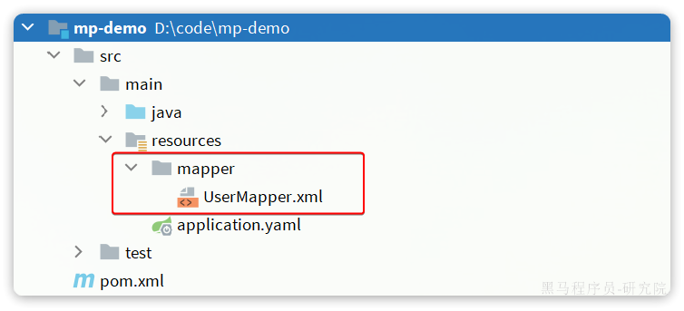

然后在其中定义一个方法：

```XML
<?xml version="1.0" encoding="UTF-8"?>
<!DOCTYPE mapper PUBLIC "-//mybatis.org//DTD Mapper 3.0//EN" "http://mybatis.org/dtd/mybatis-3-mapper.dtd">
<mapper namespace="com.itheima.mp.mapper.UserMapper">

    <select id="queryById" resultType="User">
        SELECT * FROM user WHERE id = #{id}
    </select>
</mapper>
```

然后在测试类`UserMapperTest`中测试该方法：

```Java
@Test
void testQuery() {
    User user = userMapper.queryById(1L);
    System.out.println("user = " + user);
}
```

# **核心功能**

刚才的案例中都是以id为条件的简单CRUD，一些复杂条件的SQL语句就要用到一些更高级的功能了。

## 条件构造器

除了新增以外，修改、删除、查询的SQL语句都需要指定where条件。因此BaseMapper中提供的相关方法除了以`id`作为`where`条件以外，还支持更加复杂的`where`条件。

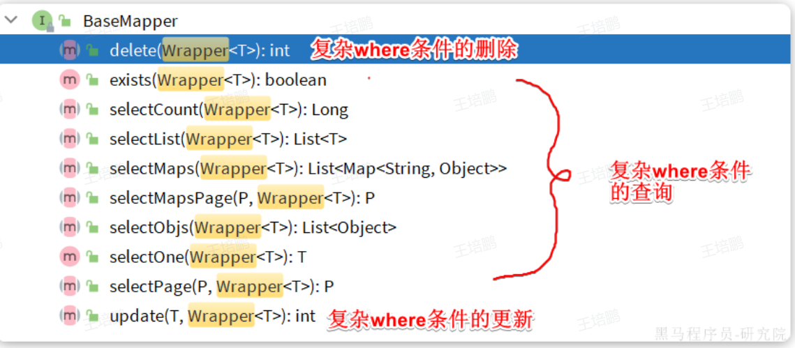

参数中的`Wrapper`就是条件构造的抽象类，其下有很多默认实现，继承关系如图：

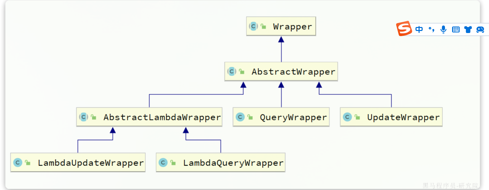

`Wrapper`的子类`AbstractWrapper`提供了where中包含的所有条件构造方法：


而QueryWrapper在AbstractWrapper的基础上拓展了一个select方法，允许指定查询字段：

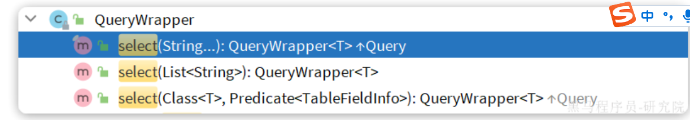

而UpdateWrapper在AbstractWrapper的基础上拓展了一个set方法，允许指定SQL中的SET部分：

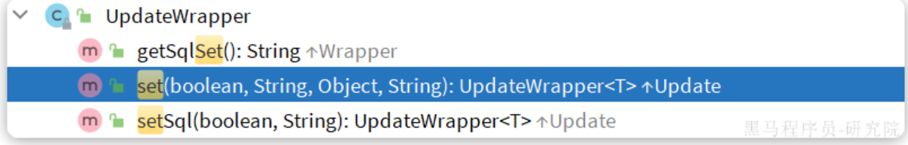

接下来，我们就来看看如何利用`Wrapper`实现复杂查询。

### **QueryWrapper**

无论是修改、删除、查询，都可以使用QueryWrapper来构建查询条件。接下来看一些例子： **查询**：查询出名字中带`o`的，存款大于等于1000元的人。代码如下：

```Java
@Test
void testQueryWrapper() {
    // 1.构建查询条件 where name like "%o%" AND balance >= 1000
    QueryWrapper<User> wrapper = new QueryWrapper<User>()
            .select("id", "username", "info", "balance")
            .like("username", "o")
            .ge("balance", 1000);
    // 2.查询数据
    List<User> users = userMapper.selectList(wrapper);
    users.forEach(System.out::println);
}
```

**更新**：更新用户名为jack的用户的余额为2000，代码如下：

```Java
@Test
void testUpdateByQueryWrapper() {
    // 1.构建查询条件 where name = "Jack"
    QueryWrapper<User> wrapper = new QueryWrapper<User>().eq("username", "Jack");
    // 2.更新数据，user中非null字段都会作为set语句
    User user = new User();
    user.setBalance(2000);
    userMapper.update(user, wrapper);
}
```

### **UpdateWrapper**

基于BaseMapper中的update方法更新时只能直接赋值，对于一些复杂的需求就难以实现。 例如：更新id为`1,2,4`的用户的余额，扣200，对应的SQL应该是：

```Java
UPDATE user SET balance = balance - 200 WHERE id in (1, 2, 4)
```

SET的赋值结果是基于字段现有值的，这个时候就要利用UpdateWrapper中的setSql功能了：

```Java
@Test
void testUpdateWrapper() {
    List<Long> ids = List.of(1L, 2L, 4L);
    // 1.生成SQL
    UpdateWrapper<User> wrapper = new UpdateWrapper<User>()
            .setSql("balance = balance - 200") // SET balance = balance - 200
            .in("id", ids); // WHERE id in (1, 2, 4)
        // 2.更新，注意第一个参数可以给null，也就是不填更新字段和数据，
    // 而是基于UpdateWrapper中的setSQL来更新
    userMapper.update(null, wrapper);
}
```

### **LambdaQueryWrapper**

无论是QueryWrapper还是UpdateWrapper在构造条件的时候都需要写死字段名称，会出现字符串`魔法值`。这在编程规范中显然是不推荐的。 那怎么样才能不写字段名，又能知道字段名呢？

其中一种办法是基于变量的`gettter`方法结合反射技术。因此我们只要将条件对应的字段的`getter`方法传递给MybatisPlus，它就能计算出对应的变量名了。而传递方法可以使用JDK8中的`方法引用`和`Lambda`表达式。 因此MybatisPlus又提供了一套基于Lambda的Wrapper，包含两个：

- LambdaQueryWrapper
- LambdaUpdateWrapper

分别对应QueryWrapper和UpdateWrapper

其使用方式如下：

```Java
@Test
void testLambdaQueryWrapper() {
    // 1.构建条件 WHERE username LIKE "%o%" AND balance >= 1000
    QueryWrapper<User> wrapper = new QueryWrapper<>();
    wrapper.lambda()
            .select(User::getId, User::getUsername, User::getInfo, User::getBalance)
            .like(User::getUsername, "o")
            .ge(User::getBalance, 1000);
    // 2.查询
    List<User> users = userMapper.selectList(wrapper);
    users.forEach(System.out::println);
}
```

## 自定义SQL

在演示UpdateWrapper的案例中，我们在代码中编写了更新的SQL语句：

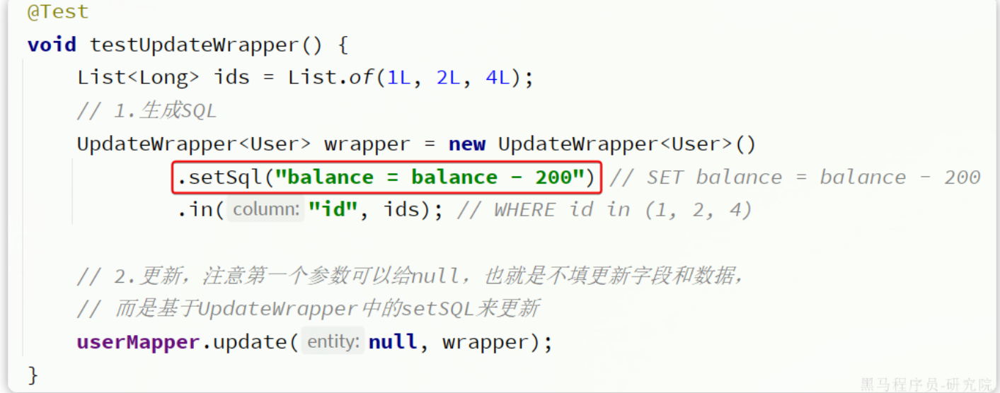

这种写法在某些企业也是不允许的，因为SQL语句最好都维护在持久层，而不是业务层。就当前案例来说，由于条件是in语句，只能将SQL写在Mapper.xml文件，利用foreach来生成动态SQL。 这实在是太麻烦了。假如查询条件更复杂，动态SQL的编写也会更加复杂。

所以，MybatisPlus提供了自定义SQL功能，可以让我们利用Wrapper生成查询条件，再结合Mapper.xml编写SQL

### **基本用法**

以当前案例来说，我们可以这样写：

```Java
@Test
void testCustomWrapper() {
    // 1.准备自定义查询条件
    List<Long> ids = List.of(1L, 2L, 4L);
    QueryWrapper<User> wrapper = new QueryWrapper<User>().in("id", ids);

    // 2.调用mapper的自定义方法，直接传递Wrapper
    userMapper.deductBalanceByIds(200, wrapper);
}
```

然后在UserMapper中自定义SQL：

```Java
package com.itheima.mp.mapper;

import com.baomidou.mybatisplus.core.mapper.BaseMapper;
import com.itheima.mp.domain.po.User;
import org.apache.ibatis.annotations.Param;
import org.apache.ibatis.annotations.Update;
import org.apache.ibatis.annotations.Param;

public interface UserMapper extends BaseMapper<User> {
    @Select("UPDATE user SET balance = balance - #{money} ${ew.customSqlSegment}")
    void deductBalanceByIds(@Param("money") int money, @Param("ew") QueryWrapper<User> wrapper);
}
```

这样就省去了编写复杂查询条件的烦恼了。

### **多表关联**

理论上来讲MyBatisPlus是不支持多表查询的，不过我们可以利用Wrapper中自定义条件结合自定义SQL来实现多表查询的效果。 例如，我们要查询出所有收货地址在北京的并且用户id在1、2、4之中的用户 要是自己基于mybatis实现SQL，大概是这样的：

```XML
<select id="queryUserByIdAndAddr" resultType="com.itheima.mp.domain.po.User">
      SELECT *
      FROM user u
      INNER JOIN address a ON u.id = a.user_id
      WHERE u.id
      <foreach collection="ids" separator="," item="id" open="IN (" close=")">
          #{id}
      </foreach>
      AND a.city = #{city}
  </select>
```

可以看出其中最复杂的就是WHERE条件的编写，如果业务复杂一些，这里的SQL会更变态。

但是基于自定义SQL结合Wrapper的玩法，我们就可以利用Wrapper来构建查询条件，然后手写SELECT及FROM部分，实现多表查询。

查询条件这样来构建：

```Java
@Test
void testCustomJoinWrapper() {
    // 1.准备自定义查询条件
    QueryWrapper<User> wrapper = new QueryWrapper<User>()
            .in("u.id", List.of(1L, 2L, 4L))
            .eq("a.city", "北京");

    // 2.调用mapper的自定义方法
    List<User> users = userMapper.queryUserByWrapper(wrapper);

    users.forEach(System.out::println);
}
```

然后在UserMapper中自定义方法：

```Java
@Select("SELECT u.* FROM user u INNER JOIN address a ON u.id = a.user_id ${ew.customSqlSegment}")
List<User> queryUserByWrapper(@Param("ew")QueryWrapper<User> wrapper);
```

当然，也可以在`UserMapper.xml`中写SQL：

```XML
<select id="queryUserByIdAndAddr" resultType="com.itheima.mp.domain.po.User">
    SELECT * FROM user u INNER JOIN address a ON u.id = a.user_id ${ew.customSqlSegment}
</select>
```

# **Service接口**

MybatisPlus不仅提供了BaseMapper，还提供了通用的Service接口及默认实现，封装了一些常用的service模板方法。 通用接口为`IService`，默认实现为`ServiceImpl`，其中封装的方法可以分为以下几类：

- `save`：新增
- `remove`：删除
- `update`：更新
- `get`：查询单个结果
- `list`：查询集合结果
- `count`：计数
- `page`：分页查询

## CRUD

我们先俩看下基本的CRUD接口。 **新增**：

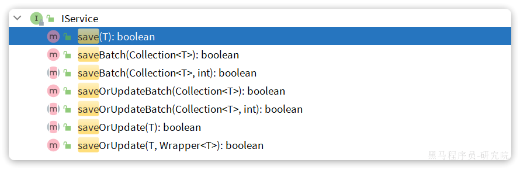

- `save`是新增单个元素
- `saveBatch`是批量新增
- `saveOrUpdate`是根据id判断，如果数据存在就更新，不存在则新增
- `saveOrUpdateBatch`是批量的新增或修改

**删除：**

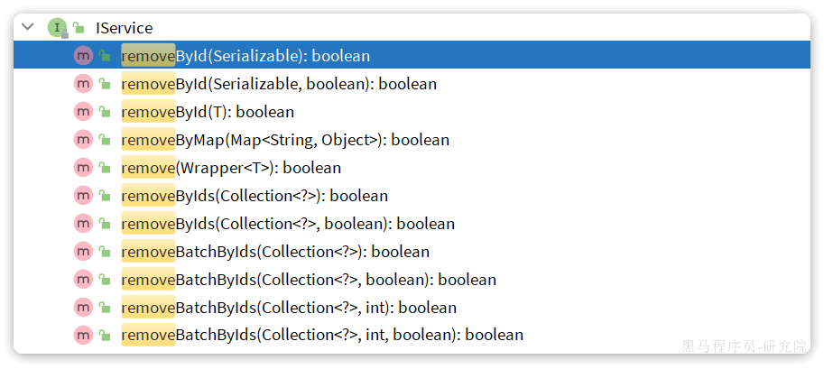

- `removeById`：根据id删除
- `removeByIds`：根据id批量删除
- `removeByMap`：根据Map中的键值对为条件删除
- `remove(Wrapper<T>)`：根据Wrapper条件删除
- `~~removeBatchByIds~~`：暂不支持

**修改：**


- `updateById`：根据id修改
- `update(Wrapper<T>)`：根据`UpdateWrapper`修改，`Wrapper`中包含`set`和`where`部分
- `update(T，Wrapper<T>)`：按照`T`内的数据修改与`Wrapper`匹配到的数据
- `updateBatchById`：根据id批量修改

**Get：**


- `getById`：根据id查询1条数据
- `getOne(Wrapper<T>)`：根据`Wrapper`查询1条数据
- `getBaseMapper`：获取`Service`内的`BaseMapper`实现，某些时候需要直接调用`Mapper`内的自定义`SQL`时可以用这个方法获取到`Mapper`

**List：**

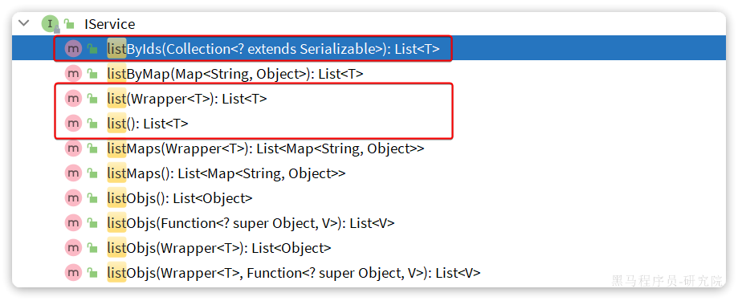

- `listByIds`：根据id批量查询
- `list(Wrapper<T>)`：根据Wrapper条件查询多条数据
- `list()`：查询所有

**Count**：


- `count()`：统计所有数量
- `count(Wrapper<T>)`：统计符合`Wrapper`条件的数据数量

**getBaseMapper**： 当我们在service中要调用Mapper中自定义SQL时，就必须获取service对应的Mapper，就可以通过这个方法：


## **基本用法**

由于`Service`中经常需要定义与业务有关的自定义方法，因此我们不能直接使用`IService`，而是自定义`Service`接口，然后继承`IService`以拓展方法。同时，让自定义的`Service实现类`继承`ServiceImpl`，这样就不用自己实现`IService`中的接口了。

首先，定义`IUserService`，继承`IService`：

```Java
package com.itheima.mp.service;

import com.baomidou.mybatisplus.extension.service.IService;
import com.itheima.mp.domain.po.User;

public interface IUserService extends IService<User> {
    // 拓展自定义方法
}
```

然后，编写`UserServiceImpl`类，继承`ServiceImpl`，实现`UserService`：

```Java
package com.itheima.mp.service.impl;

import com.baomidou.mybatisplus.extension.service.impl.ServiceImpl;
import com.itheima.mp.domain.po.User;
import com.itheima.mp.domain.po.service.IUserService;
import com.itheima.mp.mapper.UserMapper;
import org.springframework.stereotype.Service;

@Service
public class UserServiceImpl extends ServiceImpl<UserMapper, User>
                                                                                                        implements IUserService {
}
```

项目结构如下：

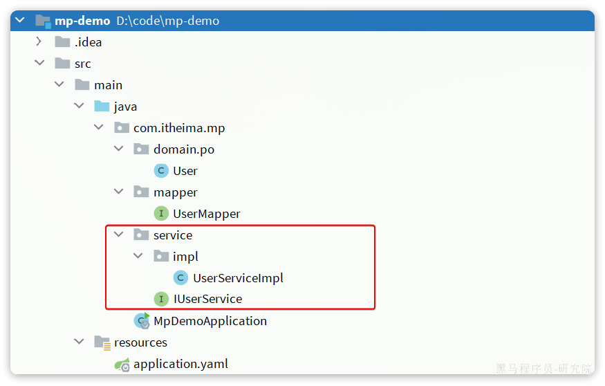

接下来，我们快速实现下面4个接口：

| **编号** | **接口**       | **请求方式** | **请求路径** | **请求参数** | **返回值** |
| :------- | :------------- | :----------- | :----------- | :----------- | :--------- |
| 1        | 新增用户       | POST         | /users       | 用户表单实体 | 无         |
| 2        | 删除用户       | DELETE       | /users/{id}  | 用户id       | 无         |
| 3        | 根据id查询用户 | GET          | /users/{id}  | 用户id       | 用户VO     |
| 4        | 根据id批量查询 | GET          | /users       | 用户id集合   | 用户VO集合 |

首先，我们在项目中引入几个依赖：

```XML
<!--swagger-->
<dependency>
    <groupId>com.github.xiaoymin</groupId>
    <artifactId>knife4j-openapi2-spring-boot-starter</artifactId>
    <version>4.1.0</version>
</dependency>
<!--web-->
<dependency>
    <groupId>org.springframework.boot</groupId>
    <artifactId>spring-boot-starter-web</artifactId>
</dependency>
```

然后需要配置swagger信息：

```YAML
knife4j:
  enable: true
  openapi:
    title: 用户管理接口文档
    description: "用户管理接口文档"
    email: zhanghuyi@itcast.cn
    concat: 虎哥
    url: https://www.itcast.cn
    version: v1.0.0
    group:
      default:
        group-name: default
        api-rule: package
        api-rule-resources:
          - com.itheima.mp.controller
```

然后，接口需要两个实体：

- UserFormDTO：代表新增时的用户表单
- UserVO：代表查询的返回结果

首先是UserFormDTO：

```Java
package com.itheima.mp.domain.dto;

import com.baomidou.mybatisplus.annotation.TableField;
import com.baomidou.mybatisplus.extension.handlers.JacksonTypeHandler;
import io.swagger.annotations.ApiModel;
import io.swagger.annotations.ApiModelProperty;
import lombok.Data;

@Data
@ApiModel(description = "用户表单实体")
public class UserFormDTO {

    @ApiModelProperty("id")
    private Long id;

    @ApiModelProperty("用户名")
    private String username;

    @ApiModelProperty("密码")
    private String password;

    @ApiModelProperty("注册手机号")
    private String phone;

    @ApiModelProperty("详细信息，JSON风格")
    private String info;

    @ApiModelProperty("账户余额")
    private Integer balance;
}
```

然后是UserVO：

```Java
package com.itheima.mp.domain.vo;

import io.swagger.annotations.ApiModel;
import io.swagger.annotations.ApiModelProperty;
import lombok.Data;

@Data
@ApiModel(description = "用户VO实体")
public class UserVO {
    
    @ApiModelProperty("用户id")
    private Long id;
    
    @ApiModelProperty("用户名")
    private String username;
    
    @ApiModelProperty("详细信息")
    private String info;

    @ApiModelProperty("使用状态（1正常 2冻结）")
    private Integer status;
    
    @ApiModelProperty("账户余额")
    private Integer balance;
}
```

最后，按照Restful风格编写Controller接口方法：

```Java
package com.itheima.mp.controller;

import cn.hutool.core.bean.BeanUtil;
import com.itheima.mp.domain.dto.UserFormDTO;
import com.itheima.mp.domain.po.User;
import com.itheima.mp.domain.vo.UserVO;
import com.itheima.mp.service.IUserService;
import io.swagger.annotations.Api;
import io.swagger.annotations.ApiOperation;
import lombok.RequiredArgsConstructor;
import org.springframework.web.bind.annotation.*;

import java.util.List;

@Api(tags = "用户管理接口")
@RequiredArgsConstructor
@RestController
@RequestMapping("users")
public class UserController {

    private final IUserService userService;

    @PostMapping
    @ApiOperation("新增用户")
    public void saveUser(@RequestBody UserFormDTO userFormDTO){
        // 1.转换DTO为PO
        User user = BeanUtil.copyProperties(userFormDTO, User.class);
        // 2.新增
        userService.save(user);
    }

    @DeleteMapping("/{id}")
    @ApiOperation("删除用户")
    public void removeUserById(@PathVariable("id") Long userId){
        userService.removeById(userId);
    }

    @GetMapping("/{id}")
    @ApiOperation("根据id查询用户")
    public UserVO queryUserById(@PathVariable("id") Long userId){
        // 1.查询用户
        User user = userService.getById(userId);
        // 2.处理vo
        return BeanUtil.copyProperties(user, UserVO.class);
    }

    @GetMapping
    @ApiOperation("根据id集合查询用户")
    public List<UserVO> queryUserByIds(@RequestParam("ids") List<Long> ids){
        // 1.查询用户
        List<User> users = userService.listByIds(ids);
        // 2.处理vo
        return BeanUtil.copyToList(users, UserVO.class);
    }
}
```

可以看到上述接口都直接在controller即可实现，无需编写任何service代码，非常方便。

不过，一些带有业务逻辑的接口则需要在service中自定义实现了。例如下面的需求：

- 根据id扣减用户余额

这看起来是个简单修改功能，只要修改用户余额即可。但这个业务包含一些业务逻辑处理：

- 判断用户状态是否正常
- 判断用户余额是否充足

这些业务逻辑都要在service层来做，另外更新余额需要自定义SQL，要在mapper中来实现。因此，我们除了要编写controller以外，具体的业务还要在service和mapper中编写。

首先在UserController中定义一个方法：

```Java
@PutMapping("{id}/deduction/{money}")
@ApiOperation("扣减用户余额")
public void deductBalance(@PathVariable("id") Long id, @PathVariable("money")Integer money){
    userService.deductBalance(id, money);
}
```

然后是UserService接口：

```Java
package com.itheima.mp.service;

import com.baomidou.mybatisplus.extension.service.IService;
import com.itheima.mp.domain.po.User;

public interface IUserService extends IService<User> {
    void deductBalance(Long id, Integer money);
}
```

最后是UserServiceImpl实现类：

```Java
package com.itheima.mp.service.impl;

import com.baomidou.mybatisplus.extension.service.impl.ServiceImpl;
import com.itheima.mp.domain.po.User;
import com.itheima.mp.mapper.UserMapper;
import com.itheima.mp.service.IUserService;
import org.springframework.stereotype.Service;

@Service
public class UserServiceImpl extends ServiceImpl<UserMapper, User> implements IUserService {
    @Override
    public void deductBalance(Long id, Integer money) {
        // 1.查询用户
        User user = getById(id);
        // 2.判断用户状态
        if (user == null || user.getStatus() == 2) {
            throw new RuntimeException("用户状态异常");
        }
        // 3.判断用户余额
        if (user.getBalance() < money) {
            throw new RuntimeException("用户余额不足");
        }
        // 4.扣减余额
        baseMapper.deductMoneyById(id, money);
    }
}
```

最后是mapper：

```Java
@Update("UPDATE user SET balance = balance - #{money} WHERE id = #{id}")
void deductMoneyById(@Param("id") Long id, @Param("money") Integer money);
```

## **Lambda**

IService中还提供了Lambda功能来简化我们的复杂查询及更新功能。我们通过两个案例来学习一下。

案例一：实现一个根据复杂条件查询用户的接口，查询条件如下：

- name：用户名关键字，可以为空
- status：用户状态，可以为空
- minBalance：最小余额，可以为空
- maxBalance：最大余额，可以为空

可以理解成一个用户的后台管理界面，管理员可以自己选择条件来筛选用户，因此上述条件不一定存在，需要做判断。

我们首先需要定义一个查询条件实体，UserQuery实体：

```Java
package com.itheima.mp.domain.query;

import io.swagger.annotations.ApiModel;
import io.swagger.annotations.ApiModelProperty;
import lombok.Data;

@Data
@ApiModel(description = "用户查询条件实体")
public class UserQuery {
    @ApiModelProperty("用户名关键字")
    private String name;
    @ApiModelProperty("用户状态：1-正常，2-冻结")
    private Integer status;
    @ApiModelProperty("余额最小值")
    private Integer minBalance;
    @ApiModelProperty("余额最大值")
    private Integer maxBalance;
}
```

接下来我们在UserController中定义一个controller方法：

```Java
@GetMapping("/list")
@ApiOperation("根据id集合查询用户")
public List<UserVO> queryUsers(UserQuery query){
    // 1.组织条件
    String username = query.getName();
    Integer status = query.getStatus();
    Integer minBalance = query.getMinBalance();
    Integer maxBalance = query.getMaxBalance();
    LambdaQueryWrapper<User> wrapper = new QueryWrapper<User>().lambda()
            .like(username != null, User::getUsername, username)
            .eq(status != null, User::getStatus, status)
            .ge(minBalance != null, User::getBalance, minBalance)
            .le(maxBalance != null, User::getBalance, maxBalance);
    // 2.查询用户
    List<User> users = userService.list(wrapper);
    // 3.处理vo
    return BeanUtil.copyToList(users, UserVO.class);
}
```

在组织查询条件的时候，我们加入了 `username != null` 这样的参数，意思就是当条件成立时才会添加这个查询条件，类似Mybatis的mapper.xml文件中的`<if>`标签。这样就实现了动态查询条件效果了。

不过，上述条件构建的代码太麻烦了。 因此Service中对`LambdaQueryWrapper`和`LambdaUpdateWrapper`的用法进一步做了简化。我们无需自己通过`new`的方式来创建`Wrapper`，而是直接调用`lambdaQuery`和`lambdaUpdate`方法：

基于Lambda查询：

```Java
@GetMapping("/list")
@ApiOperation("根据id集合查询用户")
public List<UserVO> queryUsers(UserQuery query){
    // 1.组织条件
    String username = query.getName();
    Integer status = query.getStatus();
    Integer minBalance = query.getMinBalance();
    Integer maxBalance = query.getMaxBalance();
    // 2.查询用户
    List<User> users = userService.lambdaQuery()
            .like(username != null, User::getUsername, username)
            .eq(status != null, User::getStatus, status)
            .ge(minBalance != null, User::getBalance, minBalance)
            .le(maxBalance != null, User::getBalance, maxBalance)
            .list();
    // 3.处理vo
    return BeanUtil.copyToList(users, UserVO.class);
}
```

可以发现lambdaQuery方法中除了可以构建条件，还需要在链式编程的最后添加一个`list()`，这是在告诉MP我们的调用结果需要是一个list集合。这里不仅可以用`list()`，可选的方法有：

- `.one()`：最多1个结果
- `.list()`：返回集合结果
- `.count()`：返回计数结果

MybatisPlus会根据链式编程的最后一个方法来判断最终的返回结果。

与lambdaQuery方法类似，IService中的lambdaUpdate方法可以非常方便的实现复杂更新业务。

例如下面的需求：

> 需求：改造根据id修改用户余额的接口，要求如下
>
> - 如果扣减后余额为0，则将用户status修改为冻结状态（2）

也就是说我们在扣减用户余额时，需要对用户剩余余额做出判断，如果发现剩余余额为0，则应该将status修改为2，这就是说update语句的set部分是动态的。

实现如下：

```Java
@Override
@Transactional
public void deductBalance(Long id, Integer money) {
    // 1.查询用户
    User user = getById(id);
    // 2.校验用户状态
    if (user == null || user.getStatus() == 2) {
        throw new RuntimeException("用户状态异常！");
    }
    // 3.校验余额是否充足
    if (user.getBalance() < money) {
        throw new RuntimeException("用户余额不足！");
    }
    // 4.扣减余额 update tb_user set balance = balance - ?
    int remainBalance = user.getBalance() - money;
    lambdaUpdate()
            .set(User::getBalance, remainBalance) // 更新余额
            .set(remainBalance == 0, User::getStatus, 2) // 动态判断，是否更新status
            .eq(User::getId, id)
            .eq(User::getBalance, user.getBalance()) // 乐观锁
            .update();
}
```

## **批量新增**

IService中的批量新增功能使用起来非常方便，但有一点注意事项，我们先来测试一下。 首先我们测试逐条插入数据：

```Java
@Test
void testSaveOneByOne() {
    long b = System.currentTimeMillis();
    for (int i = 1; i <= 100000; i++) {
        userService.save(buildUser(i));
    }
    long e = System.currentTimeMillis();
    System.out.println("耗时：" + (e - b));
}

private User buildUser(int i) {
    User user = new User();
    user.setUsername("user_" + i);
    user.setPassword("123");
    user.setPhone("" + (18688190000L + i));
    user.setBalance(2000);
    user.setInfo("{\"age\": 24, \"intro\": \"英文老师\", \"gender\": \"female\"}");
    user.setCreateTime(LocalDateTime.now());
    user.setUpdateTime(user.getCreateTime());
    return user;
}
```

执行结果如下：

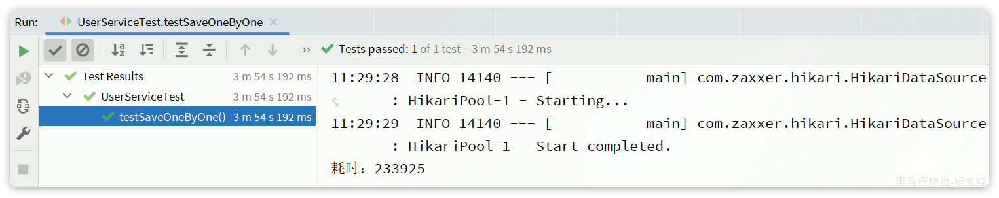

可以看到速度非常慢。

然后再试试MybatisPlus的批处理：

```Java
@Test
void testSaveBatch() {
    // 准备10万条数据
    List<User> list = new ArrayList<>(1000);
    long b = System.currentTimeMillis();
    for (int i = 1; i <= 100000; i++) {
        list.add(buildUser(i));
        // 每1000条批量插入一次
        if (i % 1000 == 0) {
            userService.saveBatch(list);
            list.clear();
        }
    }
    long e = System.currentTimeMillis();
    System.out.println("耗时：" + (e - b));
}
```

执行最终耗时如下：


可以看到使用了批处理以后，比逐条新增效率提高了10倍左右，性能还是不错的。

不过，我们简单查看一下`MybatisPlus`源码：

```Java
@Transactional(rollbackFor = Exception.class)
@Override
public boolean saveBatch(Collection<T> entityList, int batchSize) {
    String sqlStatement = getSqlStatement(SqlMethod.INSERT_ONE);
    return executeBatch(entityList, batchSize, (sqlSession, entity) -> sqlSession.insert(sqlStatement, entity));
}
// ...SqlHelper
public static <E> boolean executeBatch(Class<?> entityClass, Log log, Collection<E> list, int batchSize, BiConsumer<SqlSession, E> consumer) {
    Assert.isFalse(batchSize < 1, "batchSize must not be less than one");
    return !CollectionUtils.isEmpty(list) && executeBatch(entityClass, log, sqlSession -> {
        int size = list.size();
        int idxLimit = Math.min(batchSize, size);
        int i = 1;
        for (E element : list) {
            consumer.accept(sqlSession, element);
            if (i == idxLimit) {
                sqlSession.flushStatements();
                idxLimit = Math.min(idxLimit + batchSize, size);
            }
            i++;
        }
    });
}
```

可以发现其实`MybatisPlus`的批处理是基于`PrepareStatement`的预编译模式，然后批量提交，最终在数据库执行时还是会有多条insert语句，逐条插入数据。SQL类似这样：

```SQL
Preparing: INSERT INTO user ( username, password, phone, info, balance, create_time, update_time ) VALUES ( ?, ?, ?, ?, ?, ?, ? )
Parameters: user_1, 123, 18688190001, "", 2000, 2023-07-01, 2023-07-01
Parameters: user_2, 123, 18688190002, "", 2000, 2023-07-01, 2023-07-01
Parameters: user_3, 123, 18688190003, "", 2000, 2023-07-01, 2023-07-01
```

而如果想要得到最佳性能，最好是将多条SQL合并为一条，像这样：

```SQL
INSERT INTO user ( username, password, phone, info, balance, create_time, update_time )
VALUES 
(user_1, 123, 18688190001, "", 2000, 2023-07-01, 2023-07-01),
(user_2, 123, 18688190002, "", 2000, 2023-07-01, 2023-07-01),
(user_3, 123, 18688190003, "", 2000, 2023-07-01, 2023-07-01),
(user_4, 123, 18688190004, "", 2000, 2023-07-01, 2023-07-01);
```

该怎么做呢？

MySQL的客户端连接参数中有这样的一个参数：`rewriteBatchedStatements`。顾名思义，就是重写批处理的`statement`语句。参考文档：

https://dev.mysql.com/doc/connector-j/8.0/en/connector-j-connp-props-performance-extensions.html#cj-conn-prop_rewriteBatchedStatements

这个参数的默认值是false，我们需要修改连接参数，将其配置为true

修改项目中的application.yml文件，在jdbc的url后面添加参数`&rewriteBatchedStatements=true`:

```YAML
spring:
  datasource:
    url: jdbc:mysql://127.0.0.1:3306/mp?useUnicode=true&characterEncoding=UTF-8&autoReconnect=true&serverTimezone=Asia/Shanghai&rewriteBatchedStatements=true
    driver-class-name: com.mysql.cj.jdbc.Driver
    username: root
    password: MySQL123
```

再次测试插入10万条数据，可以发现速度有非常明显的提升：


在`ClientPreparedStatement`的`executeBatchInternal`中，有判断`rewriteBatchedStatements`值是否为true并重写SQL的功能：

最终，SQL被重写了：

