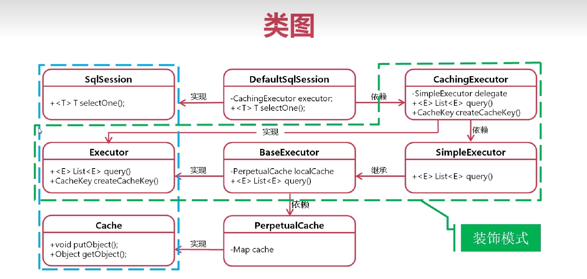
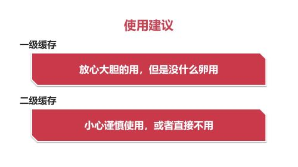

# Mybatis一级缓存原理

## 一级缓存特点
自动启用
通过在setting中设置localCacheScope= STATEMENT（默认为SESSION）全局禁用一级缓存
在Dao接口方法上添加注解：@Options(flushCache=Options.FlushCachePolicy.True),禁用这个方法的一级缓存

## 命中原则
同一SqlSession内，以下5个条件组成key，放入缓存中：
条件一：statementId相同
条件二：sql上用到的参数要一样
条件三：分页参数要一样 
条件四：sql语句的文本要一样
条件五：数据库连接的environment要一样
## 生命周期
产生：sqlSession执行查询方法，而不是update等
销毁：sqlSession关闭、sqlSession提交、sqlSession回滚、sqlSession执行update（新增、删除、更新）后底层会执行清除、主动清除
辟谣：Mybatis 一级缓存脏读（数据被另外事务修改并提交后，仍会从缓存中读到旧数据（错误），实际是避免了事务不可重复读问题）， Mybatis 一级缓存是在事务的生命周期之内的，在关闭session、执行commit、执行rollback都会清空Mybatis一级缓存。 实际上Mybatis 一级缓存反而避免了数据库事务中的脏读（读未提交）、不可重复读（读提交）问题。
## 源码解读
代理模式与装饰模式的区别：代理模式在无参构造方法中确定地new了一个被代理的对象，编译时已经可以确定；而装饰模式是通过有参构造方法将被装饰对象传入装饰 类中，能够在运行时递归地被构造。
## 设计理念
在一个session内，不过期、不更新、不限制；
与spring整合时，如果开启了事务，事务内，Spring通过ThreadLocal始终使用同一个sqlSession，一级缓存生效； 如果没有开启事务，每次查询前会创建一个sqlSession，查询结束后会关闭sqlSession,所以一级缓存无效； 
## Spring集成

