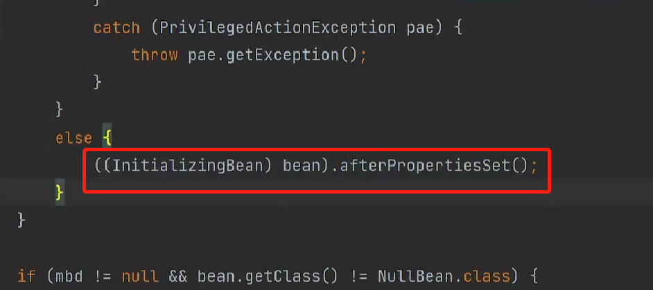
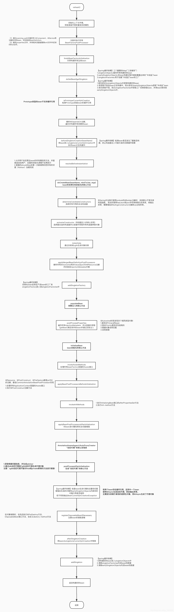

# SpringBean
## Bean的生命周期
1、首先需要明确bean对象与普通对象的区别:  
  对于普通的 Java 对象，当 new 的时候创建对象，然后该对象就能够使用了。一旦该对象不再被使用，则由 Java 自动进行垃圾回收。  
而 Spring 中的对象是 bean，bean 和普通的 Java 对象没啥大的区别，只不过 Spring 不再自己去 new 对象了，而是由 IoC 容器去帮助我们实例化对象并且管理它，我们需要哪个对象，去问 IoC 容器要即可。IoC 其实就是解决对象之间的耦合问题，Spring Bean 的生命周期完全由容器控制。  
这里必须要提一下，这里我们说的 Spring Bean 的生命周期主要指的是 singleton bean，对于 prototype 的 bean ，Spring 在创建好交给使用者之后则不会再管理后续的生命周期。
2、Spring 中的 bean 的作用域有哪些?  
  singleton : 唯一 bean 实例，Spring 中的 bean 默认都是单例的。  
  prototype : 每次请求都会创建一个新的 bean 实例。  
  request : 每一次 HTTP 请求都会产生一个新的 bean，该 bean 仅在当前 HTTP request 内有效。  
  session : 每一次 HTTP 请求都会产生一个新的 bean，该 bean 仅在当前 HTTP session 内有效。  
我们知道对于普通的 Java 对象来说，它们的生命周期就是：  
**实例化该对象不再被使用时通过垃圾回收机制进行回收**  
而对于 Spring Bean 的生命周期来说：  
  **实例化 -> 属性赋值 -> 初始化 -> 销毁**  
  每个流程都有自己的前后处理器，可以对每个过程进行增强  
  其中：  
    属性赋值实际就是依赖赋值的过程，主要解析@Autowired、@Resource、@Value等注解  
    初始化实际时解析@PostConstruct，初始化一些数据，这个过程主要时在描述了这个注解被用于需要在依赖注入完成后执行的方法上。其他注释描述了一些该注解的必要条件；  
    销毁，不多说了吧。  
  在这个过程中用到了**模板方法**  
    模板方法模式 在一个方法中定义一个算法的骨架，而将一些步骤延迟到子类中。模板方法使得子类可以在不改变算法结构的情况下，重新定义算法中的某些步骤。  
    对于spring来说，这个骨架就是上述的四个流程，而几个后置处理器就是骨架中塞入的一些动态方法，这是一种动态结合的方式，很有用。  

3、Bean 自身的方法
  比如构造函数、getter/setter 以及 init-method 和 destory-method 所指定的方法等，也就对应着上文说的实例化 -> 属性赋值 -> 初始化 -> 销毁四个阶段。  
4、bean对象的构造方法（bean的实例化）  
  默认有一个无参构造方法  
  通过无参构造方法构造出一个普通对象，我们可以通过getBean方式通过一个Map里获取一个单例对象(默认配置的时sigleton)，当然多例不会需要这个Map
5、bean的初始化
依赖注入后执行的方法：

这个方法时在依赖注入之后要做的事情
  容器初始化--》bean初始化--》bean实例化
[bean的初始化与实例化](https://blog.csdn.net/qq_15037231/article/details/105938673)
  实例化：是对象创建的过程。比如使用构造方法new对象，为对象在内存中分配空间。
  初始化：是为对象中的属性赋值的过程。

  大家总是会错误的理解Bean的“实例化”和“初始化”过程，总会以为初始化就是对象执行构造函数生成对象实例的过程，其实不然，在初始化阶段实际对象已经实例化出来了，初始化阶段进行的是依赖的注入和执行一些用户自定义的初始化逻辑。对于Bean的构建过程，网上有个非常经典的流程图如下：

