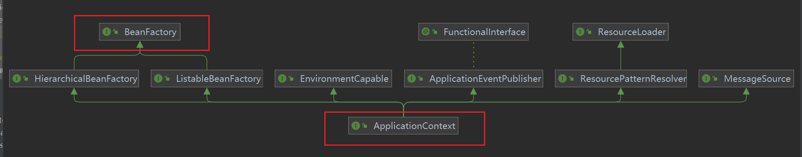

# Spring源码解析
## BeanFactory实现
到底什么是BeanFactory？
它是ApplicationContext的父接口

它才是 Spring 的核心容器，主要的 ApplicationContext 实现都 [组合]了他的功能。
通过反射的方式来构造BeanFactory来进一步解析
这里通过反射的方法来获取该成员变量，进行分析

先补充一下反射获取某个类的成员变量的步骤：
获取成员变量，步骤如下：
```
获取Class对象
获取构造方法
通过构造方法，创建对象
获取指定的成员变量（私有成员变量，通过setAccessible(boolean flag)方法暴力访问）
通过方法，给指定对象的指定成员变量赋值或者获取值
public void set(Object obj, Object value)
​ 在指定对象obj中，将此 Field 对象表示的成员变量设置为指定的新值
​ public Object get(Object obj)
​ 返回指定对象obj中，此 Field 对象表示的成员变量的值
```
代码如下
```java
        Class<DefaultSingletonBeanRegistry> clazz = DefaultSingletonBeanRegistry.class;
        // DefaultSingletonBeanRegistry defaultSingletonBeanRegistry = clazz.getConstructor(null).newInstance(null);
        Field singletonObjects = (Field) clazz.getDeclaredField("singletonObjects");
        // 设置私有变量可以被访问
        singletonObjects.setAccessible(true);
        ConfigurableListableBeanFactory beanFactory = context.getBeanFactory();
        // 查看实际类型
        System.out.println(beanFactory.getClass());
        Map<String, Object> map = (Map<String, Object>) singletonObjects.get(beanFactory);
        // Map<String, Object> map = (Map<String, Object>) singletonObjects.get(defaultSingletonBeanRegistry);
        map.entrySet().stream().filter(entry -> entry.getKey().startsWith("component")).forEach(System.out::println);


```
打印所有的bean
```
        DefaultListableBeanFactory beanFactory = new DefaultListableBeanFactory();
        // bean 的定义（即bean的一些描述信息，包含class：bean是哪个类，scope：单例还是多例，初始化、销毁方法等）
        AbstractBeanDefinition beanDefinition = BeanDefinitionBuilder.genericBeanDefinition(Config.class).setScope("singleton").getBeanDefinition();
        beanFactory.registerBeanDefinition("config", beanDefinition);
        // 给 BeanFactory添加一些常用的后处理器，让它具备解析@Configuration、@Bean等注解的能力
        AnnotationConfigUtils.registerAnnotationConfigProcessors(beanFactory);
        // 从bean工厂中取出BeanFactory的后处理器，并且执行这些后处理器
        // BeanFactory 后处理器主要功能，补充了一些 bean 的定义
        beanFactory.getBeansOfType(BeanFactoryPostProcessor.class).values().forEach(beanFactoryPostProcessor -> {
            System.out.println(beanFactoryPostProcessor);
            beanFactoryPostProcessor.postProcessBeanFactory(beanFactory);
        });
        // 打印BeanFactory中Bean
        for (String name : beanFactory.getBeanDefinitionNames()) {
            System.out.println(name);
        }
```
 a. beanFactory 不会做的事
1. 不会主动调用BeanFactory的后处理器
2. 不会主动添加Bean的后处理器
3. 不会主动初始化单例
4. 不会解析BeanFactory，还不会解析 ${}, #{}
b. Bean后处理器会有排序的逻辑
## Application
### ApplicationContext 比 BeanFactory 多点啥？

多实现了四个接口：

MessageSource: 国际化功能，支持多种语言
ResourcePatternResolver: 通配符匹配资源路径
EnvironmentCapable: 环境信息，系统环境变量，*.properties、*.application.yml等配置文件中的值
ApplicationEventPublisher: 发布事件对象
ApplicationContext 比 BeanFactory 多点啥？

多实现了四个接口：
MessageSource: 国际化功能，支持多种语言
ResourcePatternResolver: 通配符匹配资源路径
EnvironmentCapable: 环境信息，系统环境变量，*.properties、*.application.yml等配置文件中的值
ApplicationEventPublisher: 发布事件对象
### MessageSource
使用方法：
在resources目录下创建四个文件messages.propertes、messages_en.properties、messages_ja.properties、messages_zh.properties，然后分别在四个文件里面定义同名的key，比如在message_en.properties中定义hi=hello，在messages_ja.propertes中定义hi=こんにちは，在messages_zh中定义hi=你好，这样在代码中就可以根据这个**key hi和不同的语言类型**获取不同的value了。
```
System.out.println(context.getMessage("hi", null, Locale.CHINA));
System.out.println(context.getMessage("hi", null, Locale.ENGLISH));
System.out.println(context.getMessage("hi", null, Locale.JAPANESE));
```
### ResourcePatternResolver
ResourcePatternResolver是Spring框架中的一个接口，它是ResourceLoader的子接口，用于解析资源的模式匹配。通过ResourcePatternResolver，我们可以根据一个资源路径匹配多个资源，而不需要手动去遍历文件或者目录。

该接口提供了多种方法来获取Resource对象，例如：

getResource(String location)：根据资源路径获取Resource对象；
getResources(String locationPattern)：根据资源路径模式获取Resource数组；
getClassLoader()：获取当前类加载器；
getPackageResource(String basePackage, String pattern)：获取指定包下指定模式的资源。
1、例1：获取类路径下的messages开头的配置文件

```
Resource[] resources = context.getResources("classpath:messages*.properties");
for (Resource resource : resources) {
    System.out.println(resource);
}
```
2、获取spring相关jar包中的spring.factories配置文件

```
resources = context.getResources("classpath*:META-INF/spring.factories");
for (Resource resource : resources) {
    System.out.println(resource);
}
```
### EnvironmentCapable
它定义了一个方法：getEnvironment()，该方法返回与当前应用程序环境相关的Environment对象。

EnvironmentCapable接口的主要作用是允许应用程序获取与其环境相关的配置信息，如属性文件、JNDI参数等。通过实现这个接口，应用程序可以获取到适当的Environment对象，然后使用它来检索属性、配置、配置文件等环境相关的信息。
EnvironmentCapable接口在Spring Framework的许多地方都有使用，例如在应用程序上下文的创建和配置过程中，以及在测试和集成测试中。此接口是Spring应用程序环境管理的重要组成部分，因为它允许应用程序在运行时获取环境信息，以便对应用程序进行适当的配置和调整。
```
System.out.println(context.getEnvironment().getProperty("java_home"));
System.out.println(context.getEnvironment().getProperty("server.port"));
```
### ApplicationEventPublisher
它提供了一种发布应用程序事件的机制。在Spring应用程序中，当某些事件发生时，可以使用ApplicationEventPublisher将事件发布到应用程序中的其他组件中，以便它们可以处理这些事件。

通过实现ApplicationEventPublisher接口，应用程序可以将自定义事件发布到应用程序上下文中，这些自定义事件可能是由应用程序中的其他组件触发的。应用程序上下文将拥有一个ApplicationEventMulticaster，它负责将事件分发给应用程序中所有的监听器。这些监听器可以是在应用程序上下文中声明的bean，也可以是在运行时动态注册的bean。

例如，在一个电子商务应用程序中，当用户下订单时，可以使用ApplicationEventPublisher发布一个订单事件。其他组件，如订单处理器、库存管理器等，可以订阅此事件并相应地更新订单状态、库存等。

ApplicationEventPublisher接口通常由Spring Framework中的ApplicationContext实现，因此在使用ApplicationContext时，可以直接使用ApplicationEventPublisher来发布事件。除了应用程序事件外，Spring Framework本身也发布一些事件，如ContextRefreshedEvent、ContextStartedEvent、ContextStoppedEvent等。这些事件可以用于实现一些应用程序级别的逻辑，例如在应用程序启动时执行某些操作或在应用程序停止时清理资源等。

实例：
定义一个用户注册事件类，继承自ApplicationEvent类

```
public class UserRegisteredEvent extends ApplicationEvent {
    public UserRegisteredEvent(Object source) {
        super(source);
    }
}
```
再定义一个监听器类，用于监听用户注册事件，类头上需要加@Component注解，将该类交给spring管理，定义一个处理事件的方法，参数类型为用户注册事件类的对象，方法头上需要加上@EventListener注解
```
@Component
@Slf4j
public class UserRegisteredListener {
    @EventListener
    public void userRegist(UserRegisteredEvent event) {
        System.out.println("UserRegisteredEvent...");
        log.debug("{}", event);
    }
}
```
接着再定义一个用户服务类，里面有个register(String username, String password)方法可以完成用户的注册，注册完毕后发布一下用户注册完毕事件。
```
@Component
@Slf4j
public class UserService {
    @Autowired
    private ApplicationEventPublisher context;
    public void register(String username, String password) {
        log.debug("新用户注册，账号：" + username + "，密码：" + password);
        context.publishEvent(new UserRegisteredEvent(this));
    }
}
```
最后在Springboot启动类中调用一下UserService里面的register()方法注册一个新用户，UserRegisteredListener中就能处理这个用户注册完毕的事件，实现了UserService类和UserRegisteredListener类的解耦。
```
UserService userService = context.getBean(UserService.class);
userService.register("张三", "123456");
```
### 4种重要的ApplicationContext实现类
1、最为经典的容器，基于classpath 下 xml 格式的配置文件来创建
```
    public void testClassPathXmlApplicationContext() {
        ClassPathXmlApplicationContext context = new ClassPathXmlApplicationContext("spring_bean.xml");
        for (String name : context.getBeanDefinitionNames()) {
            System.out.println(name);
        }
    }
```
2、基于磁盘路径下 xml 格式的配置文件来创建
```
    public void testFileSystemXmlApplicationContext() {
        FileSystemXmlApplicationContext context = new FileSystemXmlApplicationContext("src\\main\\resources\\spring_bean.xml");
        for (String name : context.getBeanDefinitionNames()) {
            System.out.println(name);
        }
        System.out.println(context.getBean(Bean2.class).getBean1());
    }
```
3、较为经典的容器，基于java配置类来创建
```
    public void testAnnotationConfigApplicationContext() {
        // 会自动加上5个后处理器
        // org.springframework.context.annotation.internalConfigurationAnnotationProcessor
        // org.springframework.context.annotation.internalAutowiredAnnotationProcessor
        // org.springframework.context.annotation.internalCommonAnnotationProcessor
        // org.springframework.context.event.internalEventListenerProcessor
        // org.springframework.context.event.internalEventListenerFactory
        AnnotationConfigApplicationContext context = new AnnotationConfigApplicationContext(Config.class);
        for (String name : context.getBeanDefinitionNames()) {
            System.out.println(name);
        }
        System.out.println(context.getBean(Bean2.class).getBean1());
    }
```
 4、较为经典的容器，基于java配置类来创建，并且还可以用于web环境
    // 模拟了 springboot web项目内嵌Tomcat的工作原理
```
    public void testAnnotationConfigServletWebServerApplicationContext() throws IOException {
        AnnotationConfigServletWebServerApplicationContext context = new AnnotationConfigServletWebServerApplicationContext(WebConfig.class);
        // 防止程序终止
        System.in.read();
    }
}
```
## bean的生命周期

