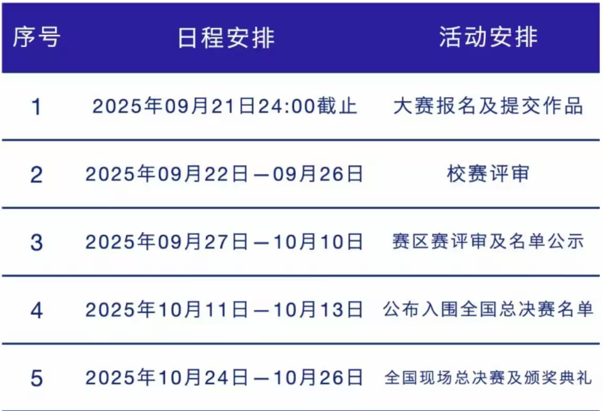

## 全球校园人工智能算法精英大赛 智青春·算未来

[全球校园人工智能算法精英大赛 智青春·算未来](https://www.aicomp.cn/notice/notice-3/3979.html)

截止时间为10月15日20:00

**（二）初赛**

1.初赛作品提交截止时间为10月15日20:00。截止日期后则无法对作品进行修改。逾期未提交视为自动放弃参赛资格；

2.组委会对上传的初审作品进行形式审查，包括材料完整性进行审核、主题符合性审查（作品是否符合赛题主题）、科技伦理审核等，最终推荐审核通过的作品进入复赛。

**（三）复赛（10月底前完成）**

1.复赛评审：大赛组委会组织专家对进入复赛的作品进行线上评审，评审过程中专家若对作品有疑问，则会提前通知参赛团队进行在线答疑；

2.复赛评奖：组委会根据复赛成绩，按照不超过复赛设奖比例评选出复赛一、二、三等奖并在大赛官网上公示。公示结束后颁发省级证书。复赛一、二等奖获奖作品晋级全国总决赛。

**（四）全国总决赛（11月底前完成）**

1.作品完善：晋级全国总决赛的作品在总决赛之前可以继续完善作品，并提交作品和答辩PPT；

2.总决赛：总决赛采取线下答辩形式进行评审，组委会根据总决赛成绩，按照不超过国赛设奖比例评选出国赛获奖作品。具体赛程安排另行通知。

## **第十四届全国大学生数字媒体科技作品及创意竞赛**

未开始需要关注

往年时间

## 全国高校计算机能力挑战赛程序设计挑战赛-第八届没开

去年

 Excel 12 月6日 09:30—11:00 90分钟

 国赛/ 决赛 Word 12 月6日 14:00—15:30 90分钟 

PowerPoint 12 月 6日 16:30—18:00 90分钟 

国赛/决赛获奖公示：2025年12月17日16点后

## 一带一路暨金砖国家技能发展与技术创新大赛

[一带一路暨金砖国家技能发展与技术创新大赛](http://inwsa.org/#/index)很多

[一带一路暨金砖国家技能发展与技术创新大赛](http://inwsa.org/#/Contests/100914)

非常多的方向，多看看

## 第十八届山东省大学生科技节赛事活动——山东省大学生文化创意科创大赛

[2026第十八届山东省大学生科技节赛事活动——山东省大学生文化创意科创大赛 - 设计竞赛网](https://www.shejijingsai.com/2026/04/1535134.html)

（一）时间安排

1.**作品征集时间：2026年5月6日—10月9日。**

2.评选结果公布时间：2026年11月初。

（二）参赛人员

全国各类普通、职业等各类高、中等院校的在校学生。

（一）省科协网站报名

参赛选手在山东省科协网站服务大厅页面

（https://smart.sdast.org.cn/portal/fwdt）——

大学生科技赛事专栏（赛事序号第41号）报名，准确填写报名信息、提交，在显示审核通过后即为报名成功。报名结果以省科协网站报名信息为准，未在省科协网站报名视为参赛无效，不予评审评奖。

（二）报送作品材料及要求

1.参赛选手在山东省科协网站报名成功之后，把参赛作品、《参赛报名表》《参赛承诺书》一起放入一个文件夹，在大赛报名截止日前，报送到大赛指定的相应赛道的邮箱。

2.报送作品的文件夹：

①把一件（或一个系列）作品的电子文件、《参赛报名表》《参赛承诺书》的电子文件，共三项材料，放入一个文件夹；

②文件夹命名：作品类别+姓名+手机号+作品名；

③压缩文件夹，按照参赛赛道发送至以下邮箱：

（1）视觉传达类[A类]:jnwhcysjxh001@163.com。

（2）产品设计类[B类]:jnwhcysjxh002@163.com。

（3）空间设计类[C类]:jnwhcysjxh003@163.com。

（4）数智媒体类[D类]:jnwhcysjxh004@163.com。

## **2026 年第八届码蹄杯全国大学生程序设计大赛通知**-过去

时间安排：即日起启动报名。

职业院校赛道 & 青少年挑战赛道入门组：

初赛第一场 2026 年 3 月 21 日；

初赛第二场 2026 年 4 月 25 日；

初赛第三场 2026 年 5 月 23 日。

本科院校赛道 & 青少年挑战赛道提高组：

初赛第一场 2026 年 3 月 22 日；

初赛第二场 2026 年 4 月 26 日；

初赛第三场 2026 年 5 月 24 日。

初赛时间均为 14:00-17:00。

决赛具体安排另行通知。

## 全国大学生数字技能应用大赛-重点关注word excel等

59一个人

考生报名后可自行预约其中一场考试场次参赛即可，考试时间如下：
第一场：2026年6月6日—6月7日
第二场：2026年6月27日—6月28日
说明：若预约第一场但未参赛，系统会自动顺延到第二场，若二场仍未参赛则视为弃赛。
3、考生可报名多个科目，同一科目只能参赛一次。各参赛科目分开比赛分别排名和评奖，根据各科成绩取排名前30%的晋级决赛。
4、计算机技能应用赛道决赛将于2026年7月初举行，视各高校自身情况再定线下机房统考或线上视频监考。请入围考生按照指定时间参加考试。计算机技能应用赛道决赛时长为90分钟，题型为选择题与操作题。

## 其他 比赛

[山东省人工智能学会](https://www.sdaai.org.cn/)