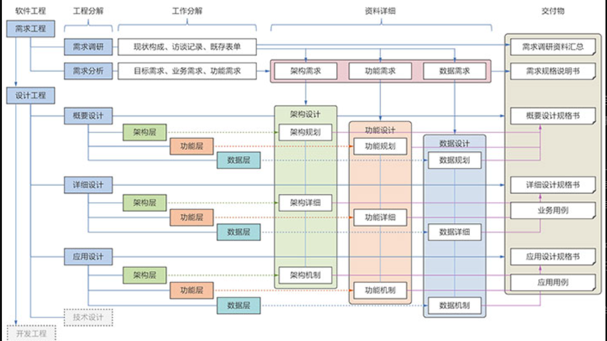
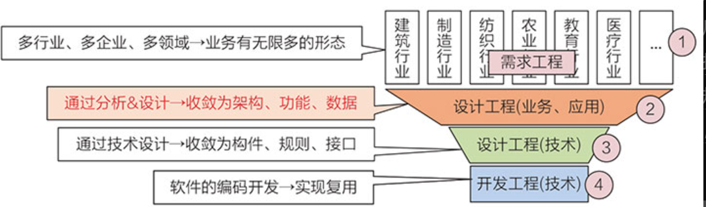

“工程”是一个过程，这个过程你不去实践一遍是没有感性认知的，大学毕业进了企业后直接做了开发工作（程序员），由于不知道分析与设计的过程，因此对自己所开发的功能是“知其然而不知其所以然”，所以程序员长期都是做“小工”的。因此老师给新学员提了一个建议：大学毕业进入软件公司后做的第一件事不是做程序员，而是去做“学徒”，体验一次从需求调研到设计的全过程，这个过程可以帮助你理解什么是“工程”。这个过程可能要花费2～3个月或更多一些的时间，但这将会大大缩短你从“程序员→工程师”的距离和时间。如果开始没有花费这个时间，很有可能过了5年甚至是10年之后，你会发现自己还站在“程序员”的原处，没有走向“工程师”的位置。

