## 安全架构概述

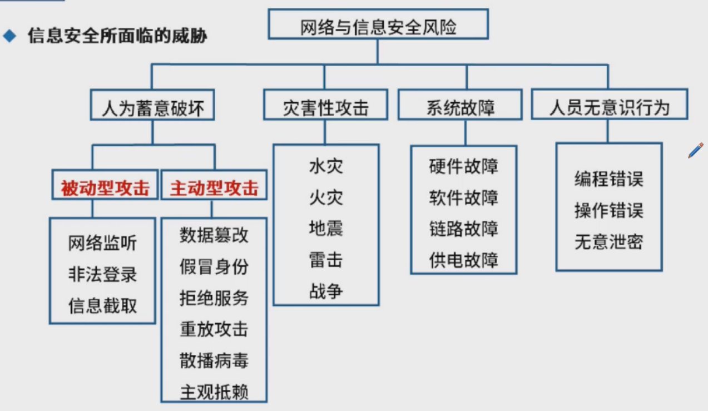

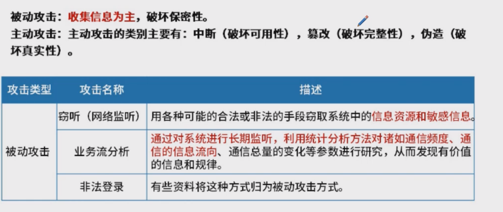

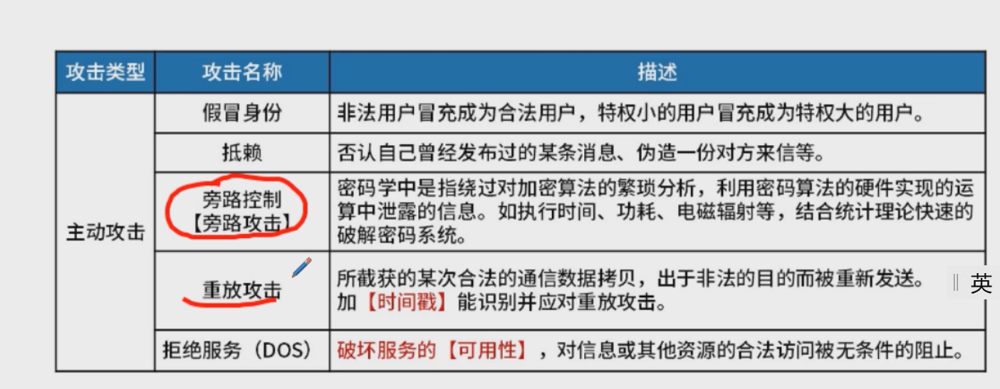

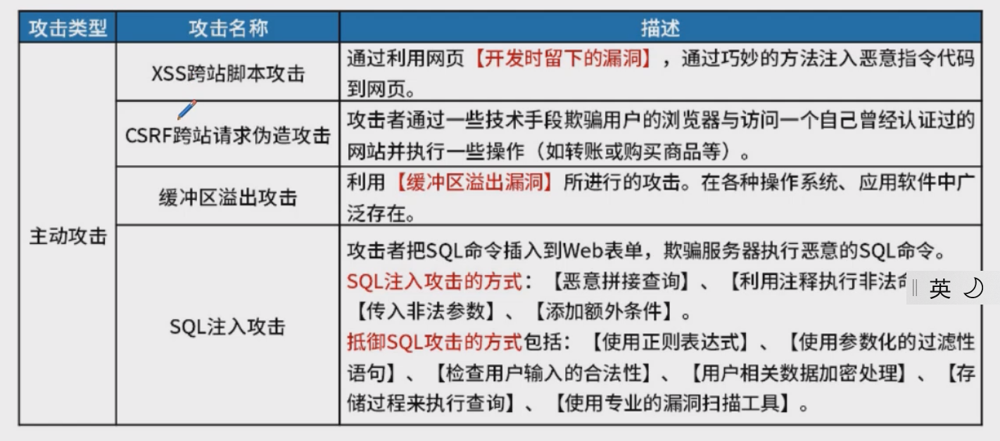

## 安全模型

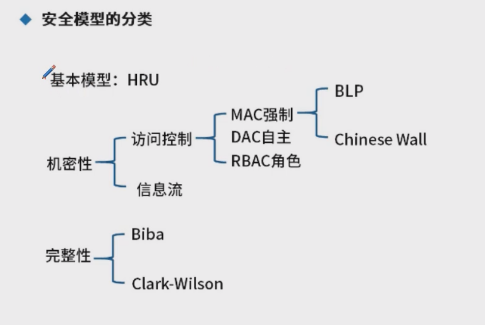

### BLP模型  下读上写

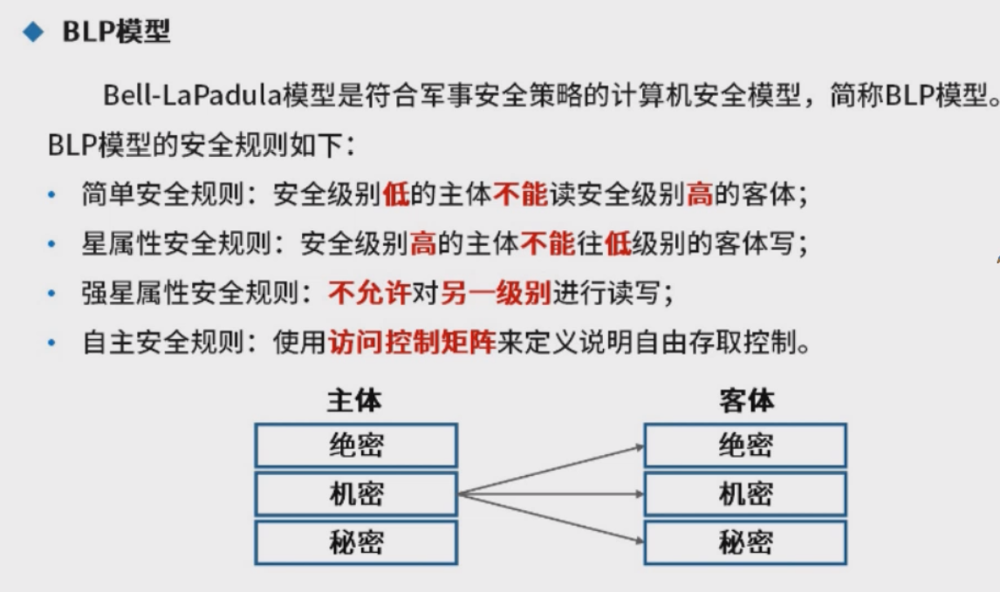

### Biba模型  上写下读

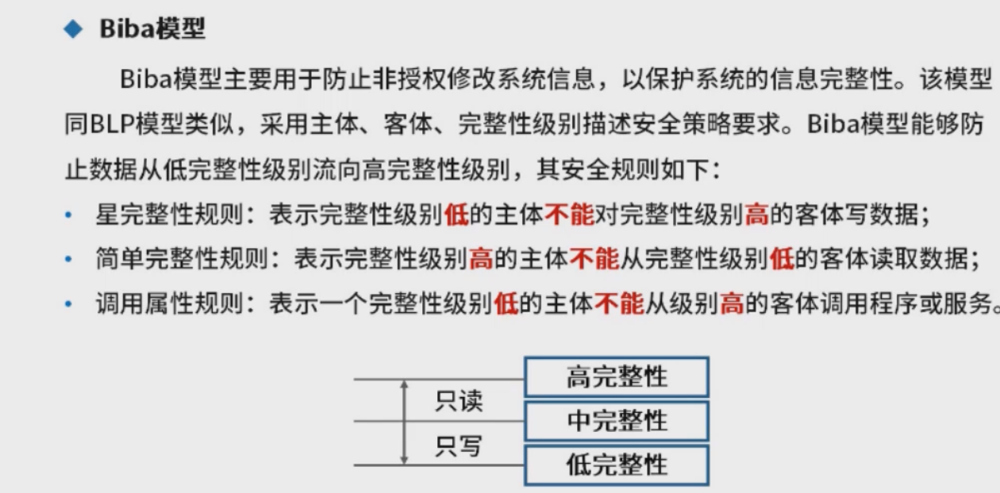

### Chinese Wall模型

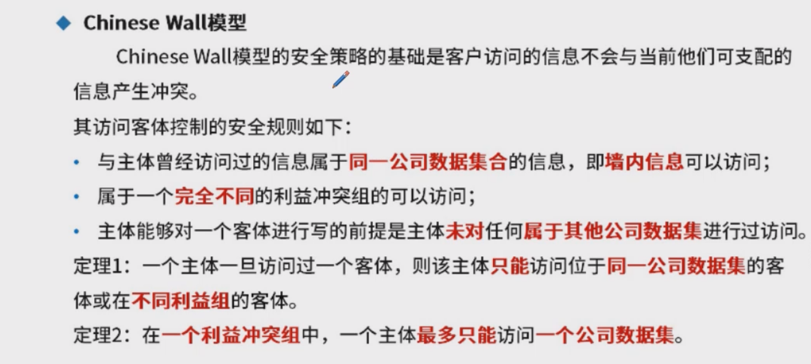

### WPDRRC模型

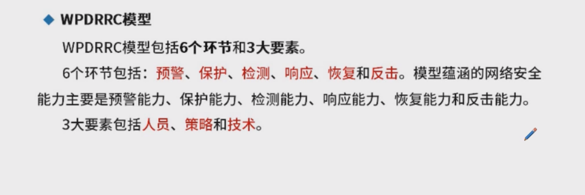

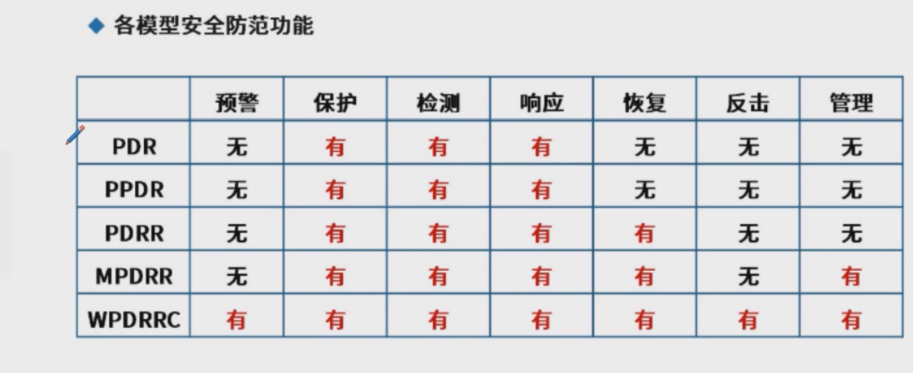

## 信息安全整体架构设计

## 网络安全架构体系设计

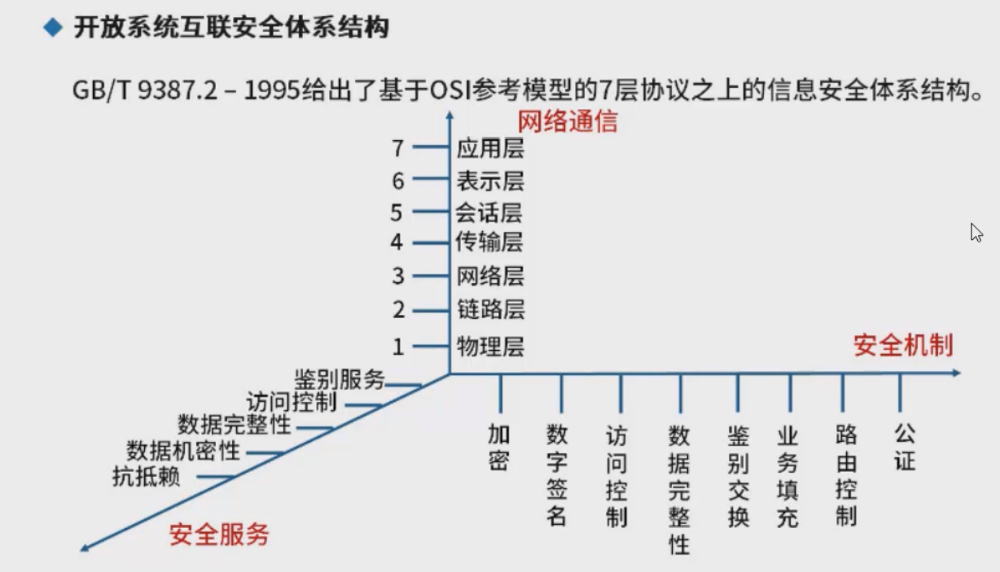

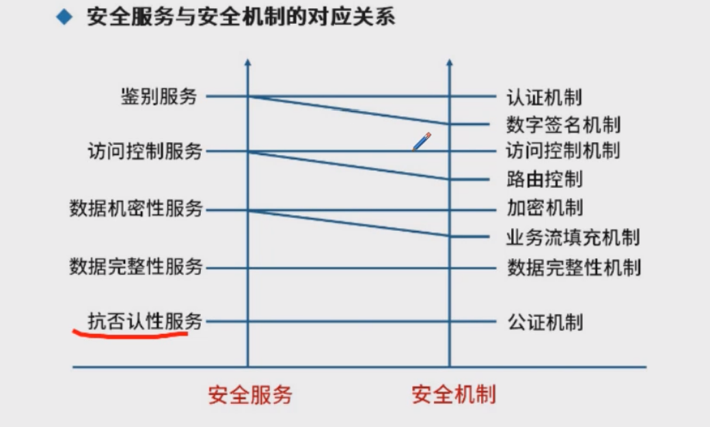

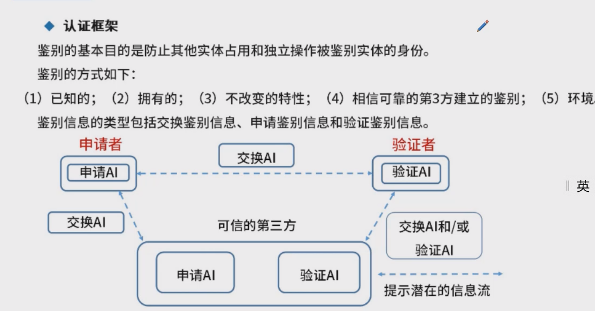

AEF: Access Controller Enforcement Function 访问控制能力，是个传达者，提交给AEF

ADF：判别是否允许

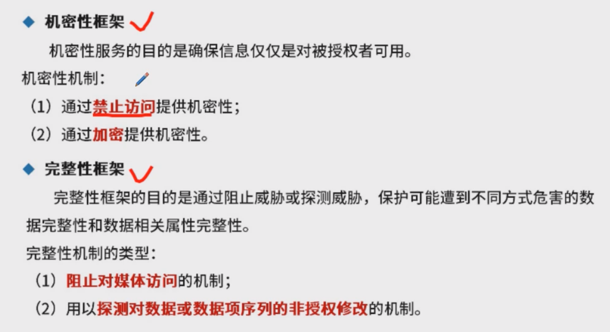

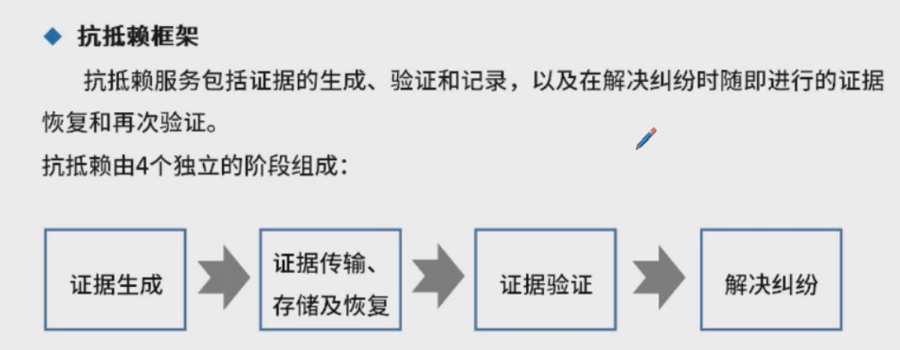

## 区块链技术

比特币用到了区块链，但不是区块链

​	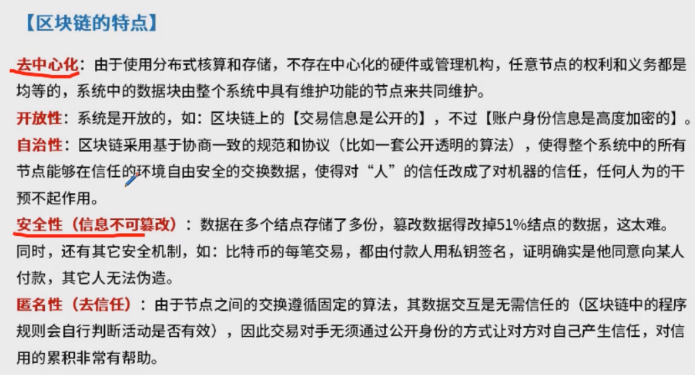

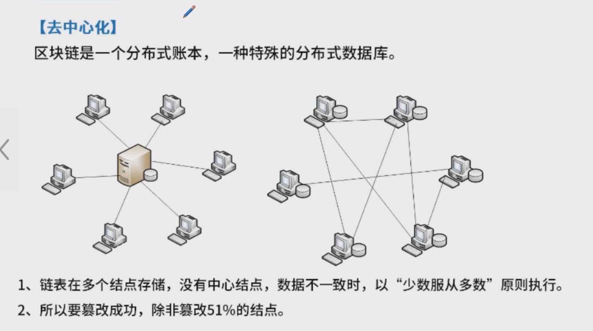

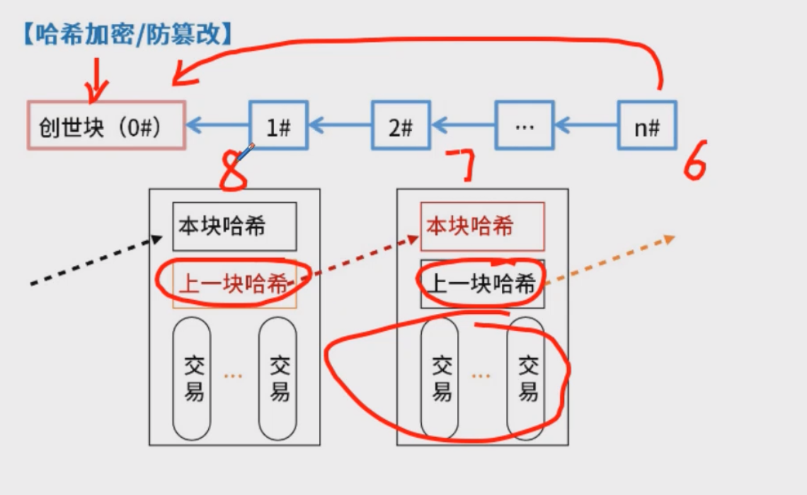

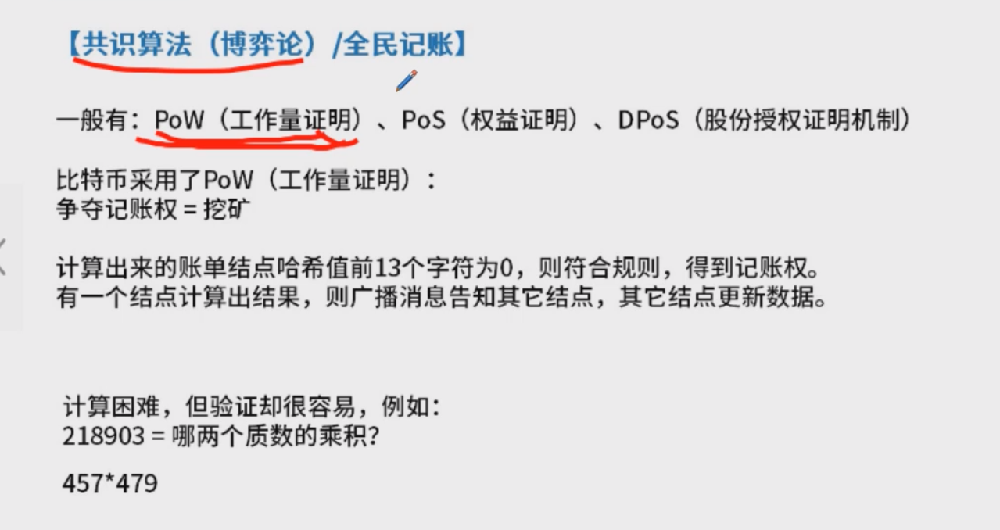