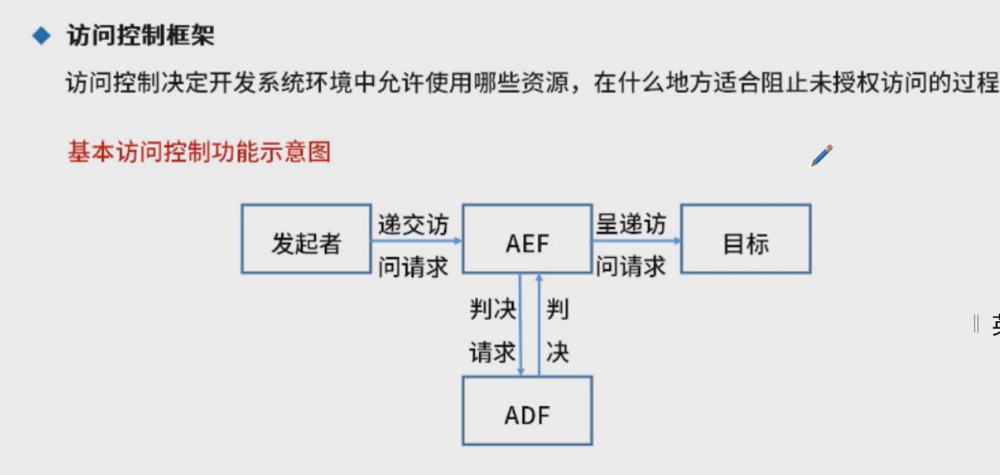

## 安全架构概述

## 安全模型

### BLP模型  下读上写

### Biba模型  上写下读

### Chinese Wall模型

### WPDRRC模型

## 信息安全整体架构设计

## 网络安全架构体系设计

AEF: Access Controller Enforcement Function 访问控制能力，是个传达者，提交给AEF

ADF：判别是否允许

## 区块链技术

比特币用到了区块链，但不是区块链

​	

