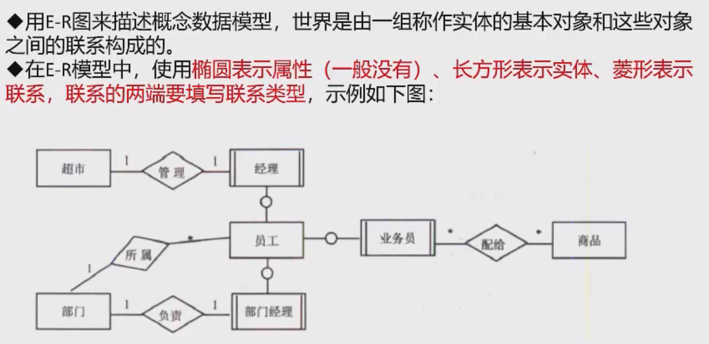
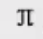
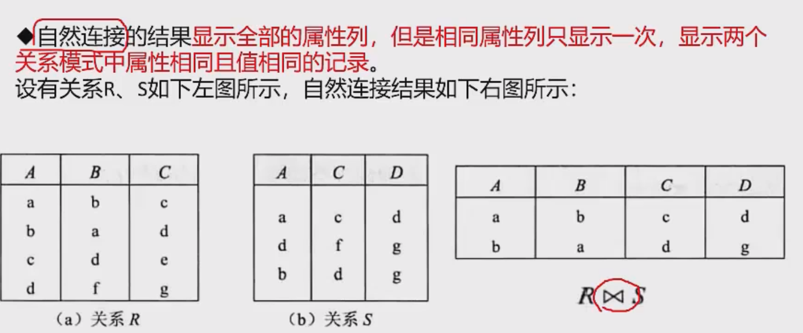
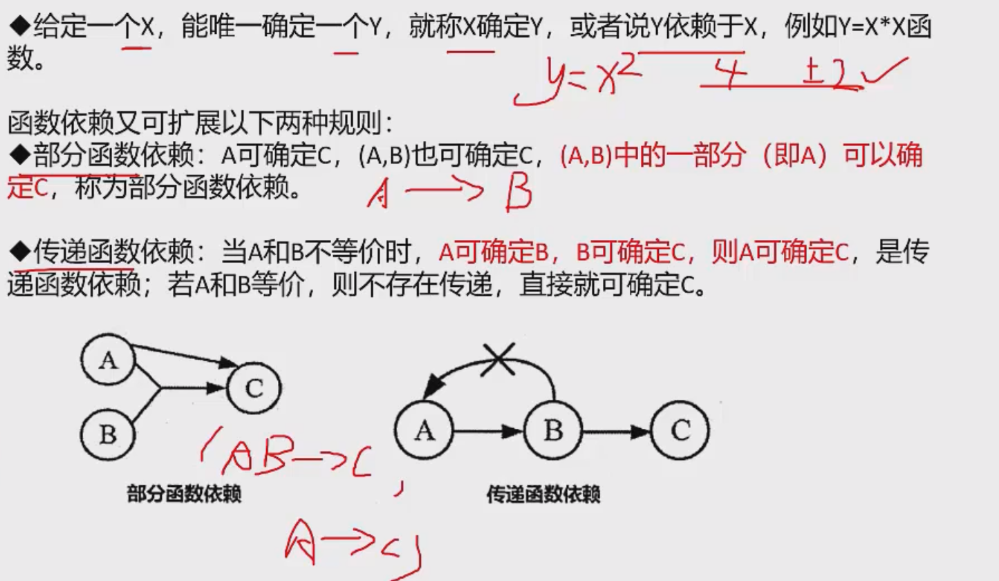
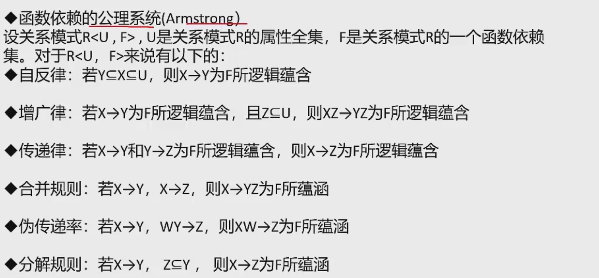
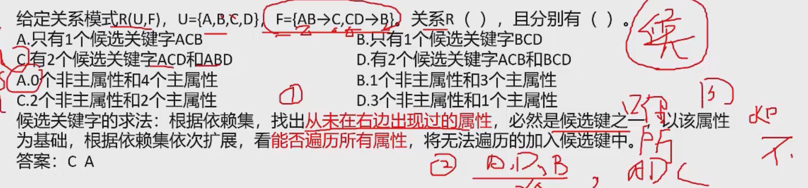

# 数据库技术基础

## 数据库的基本概念

### 数据库系统

### 三级模型-两级映射

内模式：物理文件

模式：表空间

外模式：视图

### 数据库设计

### E-R模型

### 关系模型

### 关系代数

投影是选择某一列 用表示

选择是选择某一行  用表示

上面只有A和C的值都相同的数据才会显示出来

### 数据模型

## 规范和并发控制

### 函数和依赖

### 键与约束

超键：主键+其他属性的组合

主键和候选键：候选键可以有多个

外键也可以为空，因为有时候其他表可能还没有建立

### 范式

#### 第一范式

这里薪资可以拆除多个属性，就不符合第一范式，或者说每一个属性只能代表一个意思吗，不能是符合的

#### 第二范式（2NF）的定义

- **前提条件**：表必须符合第一范式。
- **要求**：每个非主属性（即不属于候选键的字段）都必须完全依赖于候选键，不能存在对候选键的部分依赖。

解释

如果一个表的主键是复合键（由多个列组成），则表中的某些列可能只依赖于主键的一部分而不是整个主键。第二范式要求消除这种部分依赖，使得每个非主键字段都依赖于整个主键。

**举例说明**

**不符合2NF的例子**

假设我们有一个订单表 `OrderDetails`，记录了商品订单的信息：

| OrderID | ProductID | ProductName | Quantity | UnitPrice |
| ------- | --------- | ----------- | -------- | --------- |
| 1       | 1001      | Apple       | 10       | 2         |
| 1       | 1002      | Banana      | 5        | 1         |
| 2       | 1001      | Apple       | 8        | 2         |

- **主键**：`OrderID` 和 `ProductID` 组成复合主键。
- **部分依赖**：`ProductName` 和 `UnitPrice` 只依赖于 `ProductID`，而不依赖于整个主键 `OrderID` 和 `ProductID` 的组合。因此，这个表不符合第二范式。

**符合2NF的表**

为了解决这个问题，我们可以将表拆分成两个表：

1. **OrderDetails 表**（存储订单相关的信息）：

| OrderID | ProductID | Quantity |
| ------- | --------- | -------- |
| 1       | 1001      | 10       |
| 1       | 1002      | 5        |
| 2       | 1001      | 8        |

1. **Product 表**（存储产品相关的信息）：

| ProductID | ProductName | UnitPrice |
| --------- | ----------- | --------- |
| 1001      | Apple       | 2         |
| 1002      | Banana      | 1         |

现在，`OrderDetails` 表中的非主键字段（`Quantity`）完全依赖于整个主键 `OrderID` 和 `ProductID`，而 `ProductName` 和 `UnitPrice` 则被放入了 `Product` 表中，依赖于 `ProductID`，这样消除了部分依赖，使得数据库设计符合第二范式。

**总结**

第二范式的关键是消除部分依赖，确保非主键字段完全依赖于整个主键。通过拆分表的方式可以消除不必要的冗余，避免数据异常，提升数据的完整性。

**数据库第三范式（3NF）**是在第二范式（2NF）的基础上进一步规范化的数据库设计标准。其核心目标是消除**传递依赖**，即确保非主键字段只依赖于候选键（主键），而不依赖于其他非主键字段。

#### 第三范式
- **前提条件**：表必须符合第二范式。
- **要求**：非主属性（非主键字段）不能依赖于其他非主属性，即消除传递依赖。

**解释**

第三范式的要求是，表中的非主键字段只依赖于主键，而不能依赖于其他非主键字段。如果存在非主键字段依赖于另一个非主键字段的情况，则会引发冗余和更新异常，这违反了第三范式的设计原则。

**举例说明**

**不符合3NF的例子**

假设我们有一个表 `Students`，存储学生的信息：

| StudentID | StudentName | MajorID | MajorName        |
| --------- | ----------- | ------- | ---------------- |
| 1         | Alice       | 101     | Computer Science |
| 2         | Bob         | 102     | Mathematics      |
| 3         | Charlie     | 101     | Computer Science |

- **主键**：`StudentID`。
- **非主键字段的传递依赖**：`MajorName` 依赖于 `MajorID`，而 `MajorID` 依赖于 `StudentID`。因此，`MajorName` 是通过 `MajorID` 间接依赖于 `StudentID` 的，这就导致了传递依赖，表不符合第三范式。

**符合3NF的表**

为了消除这种传递依赖，我们可以将表拆分成两个表：

1. **Students 表**（存储学生信息）：

| StudentID | StudentName | MajorID |
| --------- | ----------- | ------- |
| 1         | Alice       | 101     |
| 2         | Bob         | 102     |
| 3         | Charlie     | 101     |

2. **Majors 表**（存储专业信息）：

| MajorID | MajorName        |
| ------- | ---------------- |
| 101     | Computer Science |
| 102     | Mathematics      |

现在，`Students` 表中的非主键字段（`StudentName` 和 `MajorID`）只依赖于主键 `StudentID`，而 `MajorName` 依赖于 `MajorID`，避免了传递依赖，使得表符合第三范式。

**总结**

第三范式的关键是消除传递依赖，确保非主键字段只依赖于主键，而不依赖于其他非主键字段。通过拆分表结构，可以避免数据冗余和更新异常，保持数据的一致性和完整性。

**BCNF（Boyce-Codd Normal Form）**是第三范式（3NF）的强化形式，用于处理在第三范式下仍可能存在的某些依赖异常情况。BCNF范式的要求比第三范式更加严格，主要用来解决某些特殊情况下候选键中的**部分依赖**或**重叠候选键**引发的问题。

#### BCNF的定义
- **前提条件**：表必须符合第三范式。
- **要求**：在每一个非平凡的函数依赖（X -> Y）中，X 必须是表的一个**超键**（即能够唯一标识记录的键，包括主键或候选键）。

**解释**

BCNF更严格地要求，如果一个表中的字段集合 X 能够确定另一个字段集合 Y，那么 X 必须是超键。换句话说，所有的函数依赖必须要由超键来决定。

**举例说明**

**不符合BCNF的例子**

假设我们有一个表 `Classroom`，存储课程安排的信息：

| Room | Time | Instructor | Course    |
| ---- | ---- | ---------- | --------- |
| 101  | 9am  | Dr. Smith  | Math      |
| 101  | 10am | Dr. Smith  | Physics   |
| 102  | 9am  | Dr. Brown  | Chemistry |

- **主键**：`Room` 和 `Time` 组成复合主键。
- **依赖关系**：`Instructor` 和 `Course` 依赖于 `Room` 和 `Time` 的组合，符合第三范式。然而，在现实情况下，`Instructor` 决定了 `Course`，即 `Instructor -> Course`。这不是基于超键的依赖，因为 `Instructor` 不是表的主键或超键。
  

因此，这个表虽然符合第三范式，但不符合BCNF，因为存在非主键的函数依赖（`Instructor -> Course`），导致数据冗余和潜在的异常。

**符合BCNF的表**

为了解决这个问题，我们需要对表进行拆分：

1. **Classroom 表**（存储房间和时间安排信息）：

| Room | Time | Instructor |
| ---- | ---- | ---------- |
| 101  | 9am  | Dr. Smith  |
| 101  | 10am | Dr. Smith  |
| 102  | 9am  | Dr. Brown  |

2. **InstructorCourse 表**（存储讲师和课程信息）：

| Instructor | Course    |
| ---------- | --------- |
| Dr. Smith  | Math      |
| Dr. Smith  | Physics   |
| Dr. Brown  | Chemistry |

现在，每个表中的依赖关系都由超键来决定，消除了不符合BCNF的情况。

**总结**

BCNF比第三范式更严格，确保每一个函数依赖的左边必须是超键，防止某些特殊情况下的依赖异常和数据冗余。BCNF主要用于处理候选键的复杂依赖关系，特别是当表中有多个候选键时。

#### 实例

需要注意的是**可能出现的**候选键都是主属性

主键是EM  存在部分依赖 E->N 和 M->L，因此是1NF

### 模式分解

### 并发控制

### 封锁协议

## 数据库新技术

### 数据库安全

### 分布式数据库

### 数据仓库

### 反范式技术

### 大数据

### sql语言

