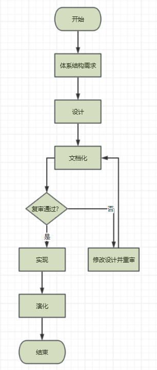
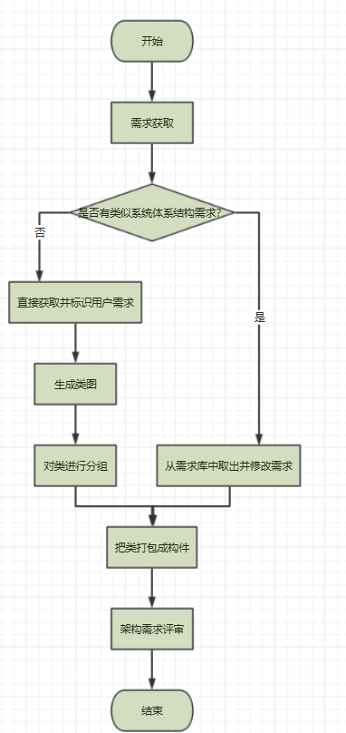
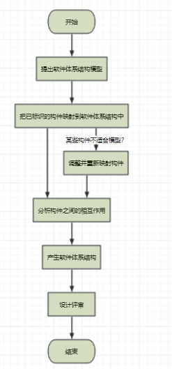

## 基于体系结构的软件设计 (Architecture-Based Software Design,ABSD) 方法

​	ABSD方法有3个基础。第1个基础是功能的分解。在功能分解中， ABSD方法使用已有的基于模块的内聚和耦合技术。第2个基础是通过选择体系结构风格来实现质量和商业需求。第3个基础是软件模板的使用，软件模板利用了一些软件系统的结构。

​	ABSD 方法是一个自顶向下，递归细化的方法，软件系统的体系结构通过该方法得到细化，直到能产生软件构件和类。

## 流程

 ABSD模型把整个基于体系结构的软件过程划分为体系结构需求、设计、文档化、复审、实现和演化6个子过程

## 体系结构需求

​	体系结构演化需求是指用户对目标软件系统在功能、行为、性能、设计约束等方面的期望。体系结构需求受技术环境和体系结构设计师的经验影响。需求过程主要是获取用户需求，标识系统中所要用到的构件。如果以前有类似的系统体系结构的需求，我们可以从需求库中取出，加以利用和修改，以节省需求获取的时间，减少重复劳动，提高开发效率。

### 1.需求获取

体系结构需求一般来自3个方面，分别是系统的质量目标、系统的商业目标和系统开发人员的商业目标

### 2.标识构件

该过程为系统生成初始逻辑结构，包含大致的构件。这一过程又可分为3步来实现。

第1步：生成类图。生成类图的 CASE 工具有很多，例如 Rational Rose 2000能自动生成类图。

第2步：对类进行分组。在生成的类图基础上，使用一些标准对类进行分组可以大大简化类图结构，使之更清晰。一般地，与其他类隔离的类形成一个组，由概括关联的类组成一个附加组，由聚合或合成关联的类也形成一个附加组。
第3步：把类打包成构件。把在第2步得到的类簇打包成构件，这些构件可以分组合并成更大的构件。

### 3.架构需求评审

组织一个由不同代表(如分析人员、客户、设计人员和测试人员)组成的小组，对体系结构需求及相关构件进行仔细地审查。审查的主要内容包括所获取的需求是否真实地反映了用户的要求；类的分组是否合理，构件合并是否合理等。必要时，可以在“需求获取一标识构件一需求评审”之间进行迭代。

## 体系结构设计

### 1.提出软件体系结构模型

在建立体系结构的初期，选择一个合适的体系结构风格是首要的。在这个风格的基础上，开发人员通过体系结构模型，可以获得关于体系结构属性的理解。此时，虽然这个模型是理想化的(其中的某些部分可能错误地表示了应用的特征),但是，该模型为将来的实现和演化过程建立了目标。

### 2.把已标识的构件映射到软件体系结构中

把在体系结构需求阶段已标识的构件映射到体系结构中，将产生一个中间结构，这个中间结构只包含那些能明确适合体系结构模型的构件。

### 3.分析构件之间的相互作用

为了把所有已标识的构件集成到体系结构中，必须认真分析这些构件的相互作用和关系。

### 4.产生软件体系结构

一旦决定了关键构件之间的关系和相互作用，就可以在第2阶段得到的中间结构的基础上
进行精化。

### 5.设计评审

一旦设计了软件体系结构，必须邀请独立于系统开发的外部人员对体系结构进行评审。

## 体系结构文档化

​	体系结构文档化过程的主要输出结果是两个文档：体系结构规格说明和测试体系结构需求的质量设计说明书。生成需求模型构件的精确的形式化的描述，作为用户和开发者之间的一个协约。软件体系结构的文档要求与软件开发项目中的其他文档是类似的。文档的完整性和质量是软件体系结构成功的关键因素。文档要从使用者的角度进行编写，必须分发给所有与系统有关的开发人员，且必须保证开发者手上的文档是最新的。

## 体系结构复审

​	体系结构设计、文档化和复审是一个迭代过程。从这个方面来说，在一个主版本的软件体系结构分析之后，要安排一次由外部人员(用户代表和领域专家)参加的复审。

 	鉴于体系结构文档标准化以及风险识别的现实情况，通常人们根据架构设计，搭建一个可运行的最小化系统用于评估和测试体系架构是否满足需要。是否存在可识别的技术和协作风险。

## 体系结构实现

## 体系结构的演化

体系结构演化是使用系统演化步骤去修改应用，以满足新的需求。主要包括以下6个步骤。

### 1.需求变化归类

首先必须对用户需求的变化进行归类，使变化的需求与已有构件对应。对找不到对应构件的变动，也要做好标记，在后续工作中，将创建新的构件，以对应这部分变化的需求。

### 2.制订体系结构演化计划

在改变原有结构之前，开发组织必须制订一个周密的体系结构演化计划，作为后续演化开发工作的指南。

### 3.修改、增加或删除构件

在演化计划的基础上，开发人员可根据在第1步得到的需求变动的归类情况，决定是否修
改或删除存在的构件、增加新构件。最后，对修改和增加的构件进行功能性测试。

### 4.更新构件的相互作用

随着构件的增加、删除和修改，构件之间的控制流必须得到更新。

### 5.构件组装与测试

通过组装支持工具把这些构件的实现体组装起来，完成整个软件系统的连接与合成，形成
新的体系结构。然后对组装后的系统整体功能和性能进行测试。

### 6.技术评审

对以上步骤进行确认，进行技术评审。评审组装后的体系结构是否反映需求变动、符合用户需求。如果不符合，则需要在第2到第6步之间进行迭代。在原来系统上所做的所有修改必须集成到原来的体系结构中，完成一次演化过程。

