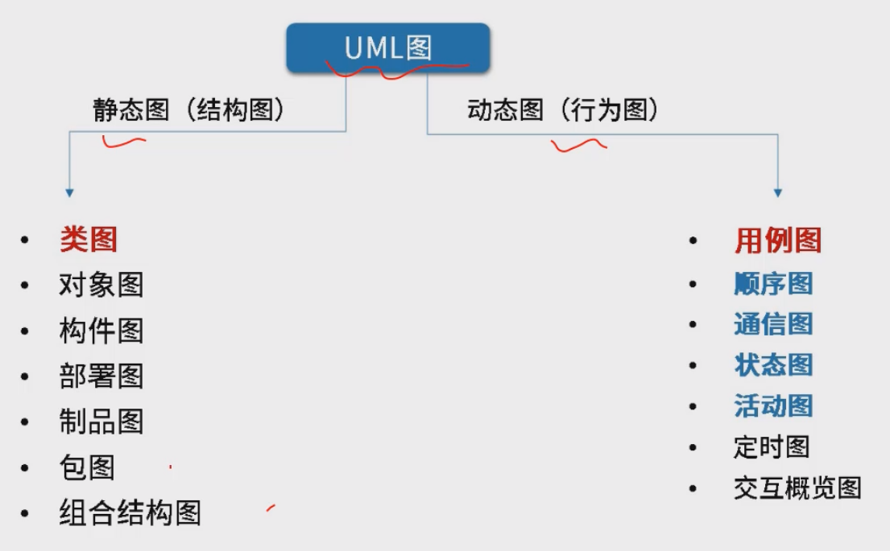

# 主要方面

需求分析

面向对象设计

# 需求分析

## 结构化需求分析

## 数据流图

结构化开发，自顶向下逐步分解求精--顶层图、0层图和2层图

### 四大元素

### 基本题型

### 数据流图的平衡

## UML图

### 静态图与动态图

### 用例图

流程：

1、识别参与者（用户、系统、组织、外部系统、时间）

2、合并需求得到用例

3、细化用例描述

4、调整用例模型关系（包含关系、扩展关系、泛化关系）

包含关系是抽象出一个方法，由多个用例调用，共性抽取，必须得流程

扩展关系是不一定一定要执行的情况，可能有多个分支，有些方法在某种路径中才需要执行，因此有些路径可能不需要执行

泛化关系实际上是封装-继承的关系

### 类图与对象图

关系

### 顺序图

### 通信图

### 状态图

### 活动图

### 定时图

### 构件与包图

### 部署图

