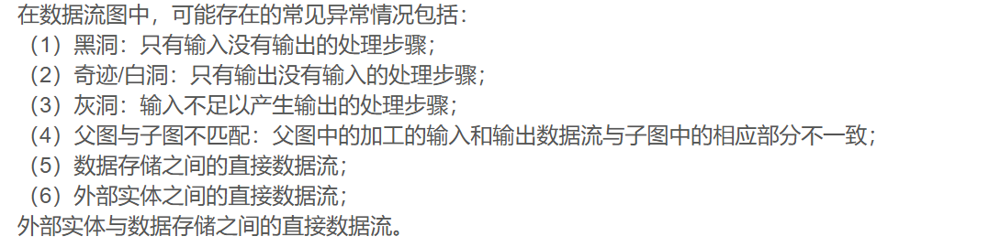

数据流图和数据字典在软件需求分析和设计阶段作用重大。数据流图以图形化方式展示系统中数据的流动和处理过程，能清晰呈现系统的功能结构及各部分间的关系，帮助分析人员理解业务流程，发现需求漏洞。数据字典则对数据流图中涉及的所有数据元素进行详细定义和描述，包括数据的名称、类型、取值范围等，为系统设计提供准确的数据规范，确保开发人员对数据的理解一致，保证数据的准确性和一致性，是软件系统开发的重要依据

数据流图是描述数据处理过程的工具，从数据传递和加工的角度，以图形的方式刻画数据流从输入到输出的移动变换过程。数据流在分析阶段的作用是建立系统的功能模型。在设计阶段的作用是为模块划分与模块之间接口设计提供依据。数据字典是对于数据流图中出现的所以被命名的图形元素在数据字典中作为一个词条加以定义，使得每一个图形元素的名字都有一个确切的解释。数据字典是所有人员工作的依据，统一的标准。它可以确保数据在系统中的完整性和一致性。

