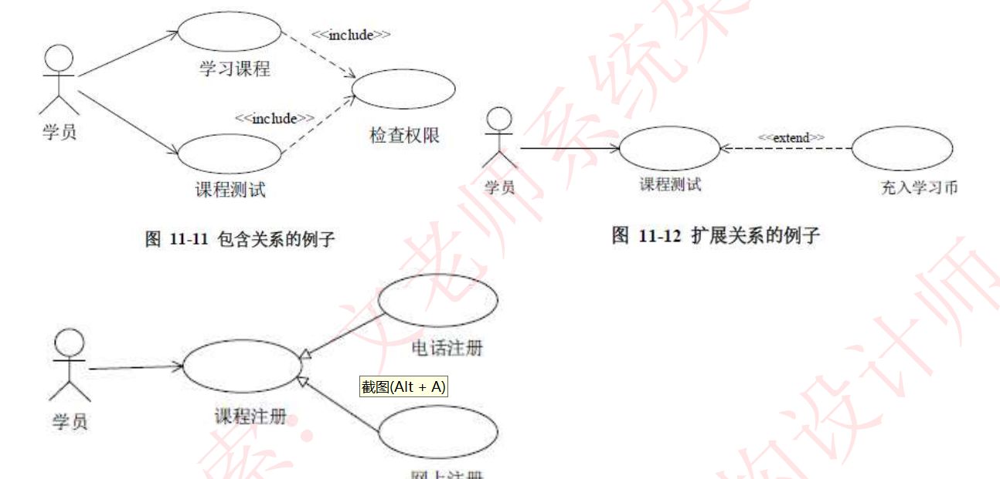
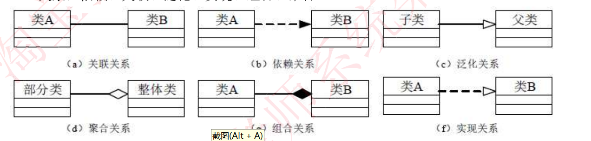
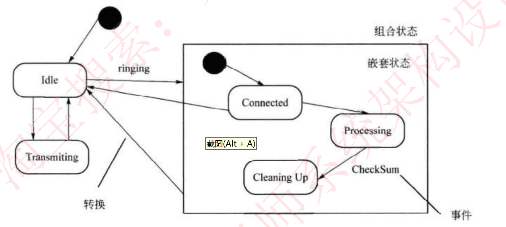
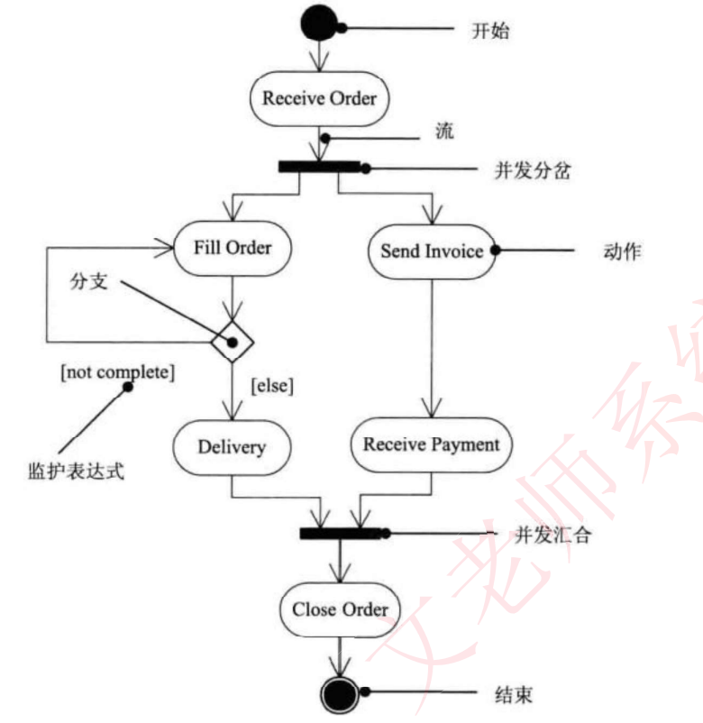
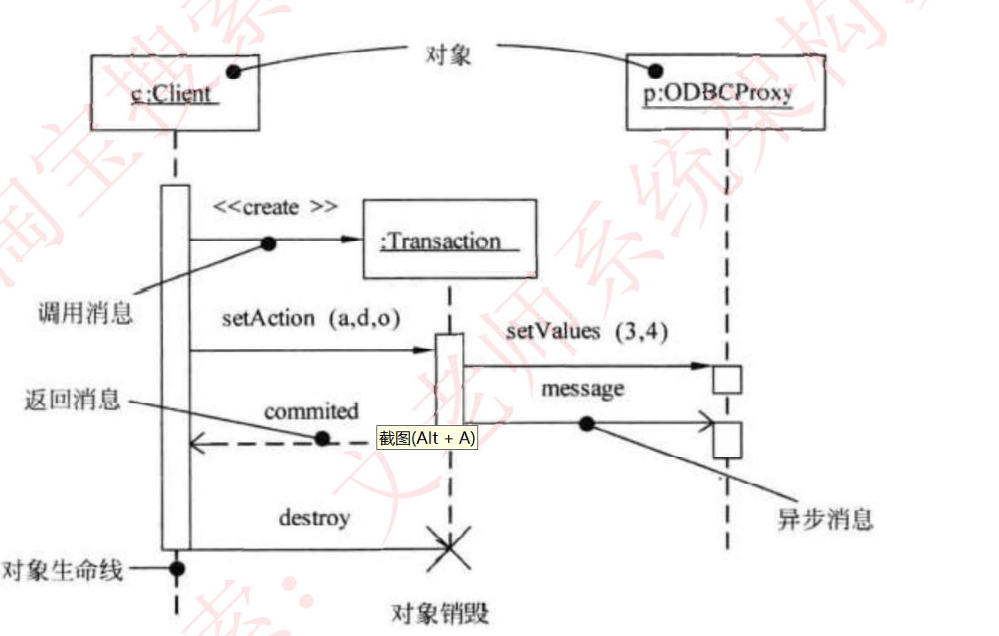
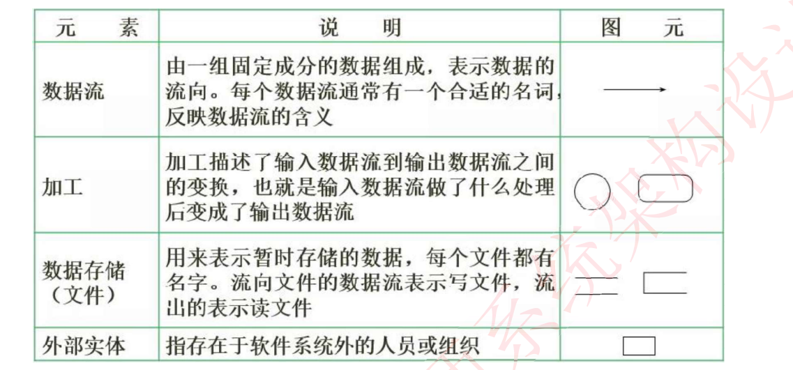
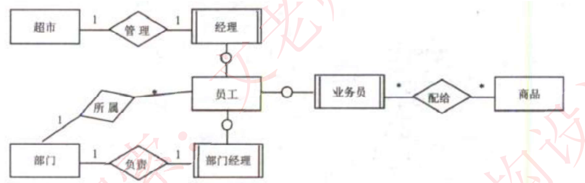

**用例图：**

用例是参与者完成一系列操作，考察用例关系的识别、用例之间的关系（包含include，扩展extend，泛化）

包含关系：完成动作必须要进行，例如登录检查权限

扩展关系：完成操作可能进行的操作，例如冲入学习币学习

区分包含于扩展的区别在于**完成某个操作是否是必须得动作**

**类图：静态图**

组合：两个类具有相同的生命周期  大雁翅膀与大雁

聚合：两个类不需要具有相同的生命周期  大雁与雁群

**泛化**通常用在类与类之间，表示继承或“是一个”关系，或者可以说是继承。

**实现**用在类与接口之间，表示“提供接口的实现”。

**关联关系（Association）**表示类之间的长期结构性关系，通常是双向的，表示两个对象之间的“拥有”或“包含”关系 例如学生-课程

**依赖关系（Dependency）**表示类之间的临时关系，通常是单向的，表示一个类对另一个类的短期使用或依赖 例如订单---》商品

**状态图**

活动图，展现了一个状态机，描述了单个对象在多个用例的行为，包括多个状态和组合状态转换后可以通过事件触发

**活动图**

展现了系统从一个活动到另一个活动的流程，用来描述操作的行为，也用来描述用例和对象内部的工作过程

**序列图**

以时间顺序组织对象之间的交互活动

**数据流图**

**数据流图（Data Flow Diagram, DFD）**是一种图形化的工具，用于表示信息在系统中的流动和处理过程。它通过描述数据的输入、输出、存储和处理路径，帮助分析系统如何运作。DFD常用于需求分析阶段，用于展示系统或子系统的功能，并帮助识别流程、数据和存储之间的交互。

DFD通常有不同的层次，从高层次（抽象）到低层次（详细）。不同层次的DFD会进一步细化和描述系统的各个部分。

**上下游视图（Context Diagram）**：

- 上下游视图是DFD的顶层视图，表示系统的外部实体、数据流以及与外部实体的交互。它显示系统与外部环境之间的主要数据交互，通常仅有一个过程（表示整个系统）。
- 这是整个数据流图的最高层级，通常用于表示整个系统的边界。

**层次化数据流图（Level-0 DFD）**：

- Level-0 DFD是对上下游视图的进一步分解，展示了系统的主要功能或子系统。它会将系统的主要过程分解为若干个子过程，并显示数据流入各个子过程的路径。
- 每个过程是对系统或子系统功能的抽象表示。

**子层次数据流图（Level-1、Level-2 DFD等）**：

- 子层次数据流图用于更详细地描述系统中的各个过程和功能。这些图通过细化每个过程，进一步展示内部的数据流和数据存储的细节。
- 每个子层次DFD深入到更加具体的操作，通常是对一个具体模块或操作的表示。

**ER图**

