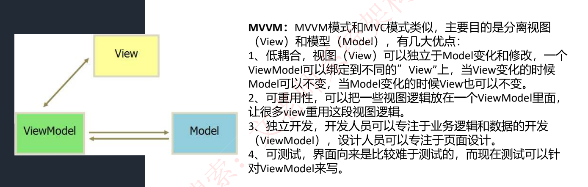
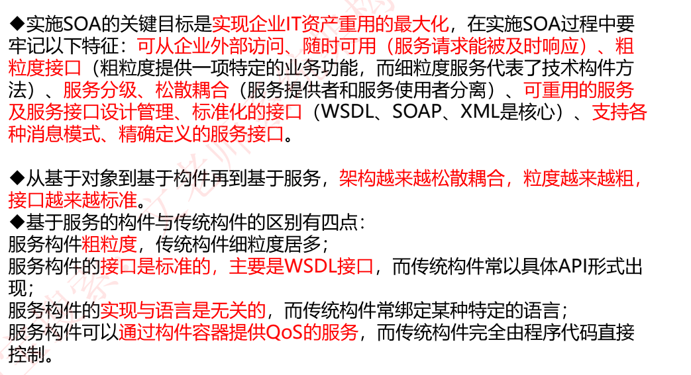
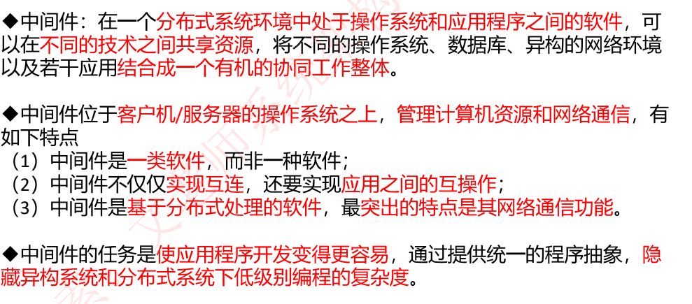

# 系统架构（一轮pdf学习）

## 概念定义

## 架构设计与生命周期

## 构件

## 软件架构风格

### 数据流风格

### 调用返回风格

### 独立架构风格

### 虚拟机风格

### 仓库（数据共享）风格

### 闭环系统

### C2体系架构

### 总结

## 层次架构风格

### 两层C/S架构

### 三层C/S架构

### 三层B/S架构

### 富互联网RIA

### MVC架构

### MVP架构

### MVVM架构

### SOA架构

#### 概述

#### 关键技术

#### ESB

## 软件架构复用

## 特定领域的软件架构

### DSSA

## 基于架构的软件开发

### ABSD方法

#### 概念

#### 步骤

## 软件的质量属性

#### 分类

#### 运行质量属性

#### 质量属性场景

## 软件架构评估

#### 评估点定义

#### 三种评估方式

#### 基于场景的架构分析方法（SAAM）

#### 成本效益分析法

#### 其他评估方法

## 中间件技术

## 典型应用架构

