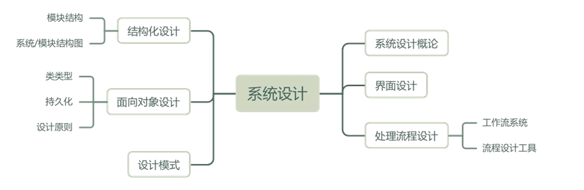

**设计模式（还不懂）**

**桥接模式（Bridge）** 的核心思想是将抽象部分与它的实现部分分离，使它们可以独立地变化

**Facade模式**用于简化接口，通常用于提供一个统一的接口，而不是解决多维度变化的问题。

 **Prototype**：原型模式，通过克隆创建对象，不是保证唯一实例的模式

 **Builder**：构建器模式，将对象构建过程与表示分离

**Abstract Factory**：提供一个接口，用于创建一系列相关或相互依赖的对象，而无需指定它们的具体类

面向对象设计的原则

 **Memento（备忘录模式）**

**需求模型向架构模型转换过程**

面向对象的分析模型

软件概要设计--**模块结构图、层次图和HIPO图**

**结构化软件设计阶段的基本任务**，这是软件工程考试中的高频知识点。
结构化设计包括**数据设计、软件结构设计、人机界面设计、过程设计**四个既独立又相互关联的活动，它们共同保证了软件结构的合理性、模块划分的清晰性以及交互体验的良好性

**软件结构化设计的主要任务**。
软件结构化设计阶段通常包含以下四个核心任务：**体系结构设计（架构设计）、接口设计、数据设计和过程设计**。

**结构化设计中模块独立性的衡量标准——耦合与内聚的定义和分类**。
耦合是指模块之间相互依赖的程度，耦合程度从低到高依次为：**非直接耦合、数据耦合、标记耦合、控制耦合、外部耦合、公共耦合、内容耦合**。

内聚是指模块内部各元素之间的关联紧密程度，从高到低依次为：**功能内聚、顺序内聚、通信内聚、过程内聚、时间内聚、逻辑内聚、偶然内聚**

**信息建模方法在系统分析中的应用及其基本工具**

**（ER图）**它是信息建模方法的核心工具，用于从数据角度建模现实世界，将现实世界中的实体、属性及它们之间的联系抽象为图形模型，是构建数据库模型的重要基础

SysML新增了需求图（Requirement Diagram），这是UML中没有的图种，用于捕获和描绘系统的需求。它使得需求与其他模型元素之间的关系更加明确，可以帮助跟踪需求的实现和验证。

**业务流程建模工具**

业务流程分析的核心是了解业务运作的过程、部门间的关系以及每个业务处理环节的意义，从而为流程优化和系统设计提供依据。

**DEMO**：DEMO（Design & Engineering Methodology for Organizations）是一种用于组织建模的方法，更侧重于企业沟通与协作建模，不是主要用于复杂流程的数学化建模。
**Petri网**：Petri网是一种重要的数学化建模工具，它能从流程的角度描述和分析复杂系统。Petri网由位置（Place）、变迁（Transition）和弧（Arc）构成，既有图形化表示，又有严谨的数学定义，适用于并发、同步、冲突等复杂业务流程的建模和分析，因此是本题正确答案。
**BPM**：BPM（Business Process Management，业务流程管理）是一种管理理念和方法，旨在优化企业业务流程。它可以使用多种建模工具，但BPM本身并不是一种具体的数学化建模工具。
**IDEF**：IDEF（Integration DEFinition）是一系列建模方法，尤其是IDEF0用于功能建模，IDEF3用于过程描述，主要适合业务流程的描述和分析，但缺乏Petri网那种严格的数学分析能力

**McCabe 环形复杂度（Cyclomatic Complexity）计算方法**。
McCabe 复杂度计算常用公式之一为：
**V(G) = P + 1**
其中 P 表示流图中的判定节点数量（即条件判断节点，通常用菱形表示）。
题中流程图中共有 3 个判定节点，因此：
V(G) = 3 + 1 = 4

**COM 对象重用的两种形式：包含（Containment）与聚集（Aggregation）**

**聚集**：聚集是将内部对象的接口直接暴露给客户，不需要外部对象转发请求。

**包含**：包含模式下，外部对象保存对内部对象的引用，并在接到客户请求时将请求转发给内部对象

**软件系统结构设计中模块耦合与内聚的度量指标**。
在模块化设计中，模块之间的调用关系反映了系统结构的层次性与复杂性，其中“扇入”和“扇出”是常用的两个度量指标。

**扇入**：指有多少个上层模块调用该模块。扇入值大，说明该模块被多个模块复用，具有较高的通用性和独立性。
**扇出**：指一个模块直接调用下层模块的数量。扇出值反映了模块对下层模块的依赖程度，扇出过大表示模块过度依赖下层模块，可能导致系统结构复杂、维护性差。

