# 案例分析

1、三个题

第一题必做，后面题目四选二

第一题大概率是架构风格和质量属性

每隔一年考一次质量属性 奇数年考

几种软件架构风格

其他四个题：

系统开发

数据库

web应用

嵌入式

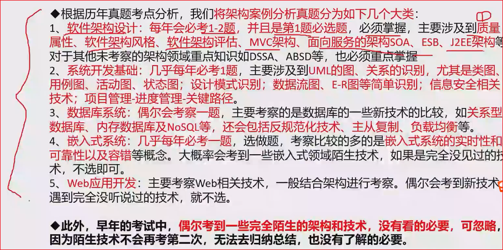

选题的时候不要看题目描述，直接看问题，根据问题来选

新技术问题一般蕴含的题目 描述中，从题目描述中总结答案

很难所有问题都回答上来

精简的去写出自己的点，不要写太多了

按点给分，要把自己知道的点都写出来

# 质量属性

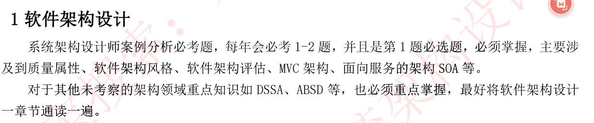

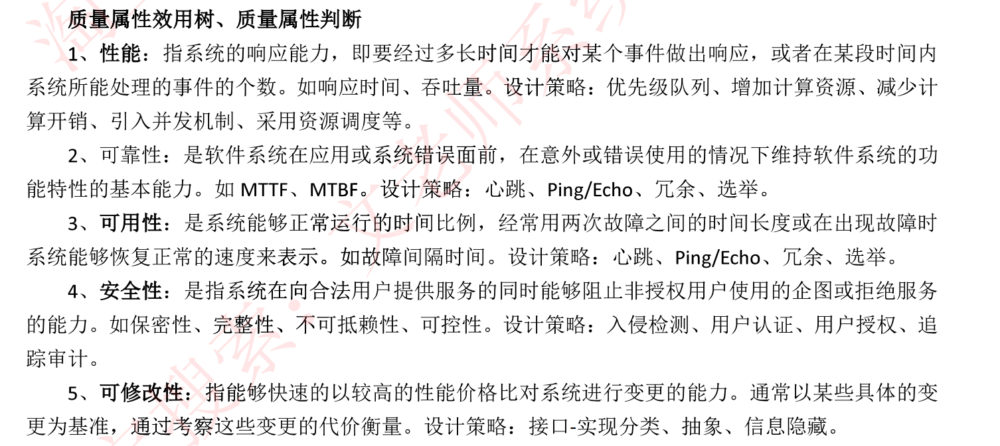

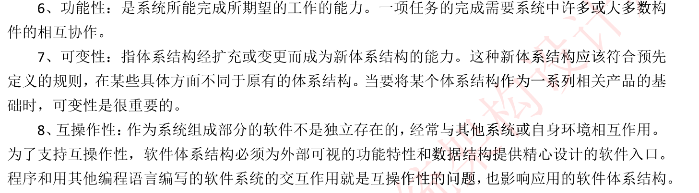

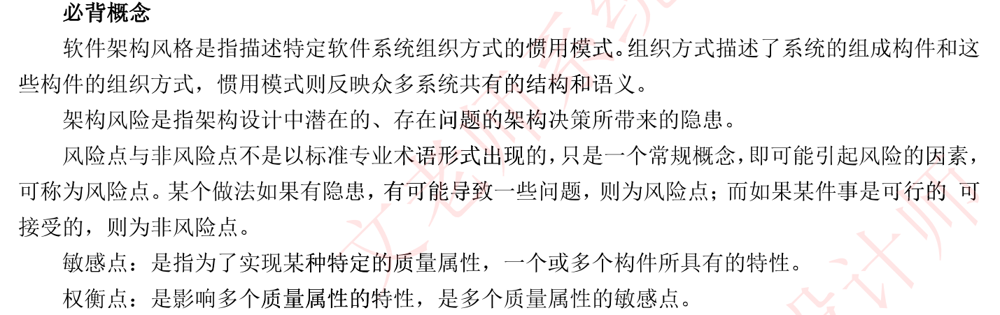

权衡点：有好处也有坏处

风险点：带来问题,多个质量属性

敏感点：只会影响一个质量属性

可修改性：在规定的时间内完成一个修改

可测试性：远程调试

安全性：例如授权之列的都为安全性	

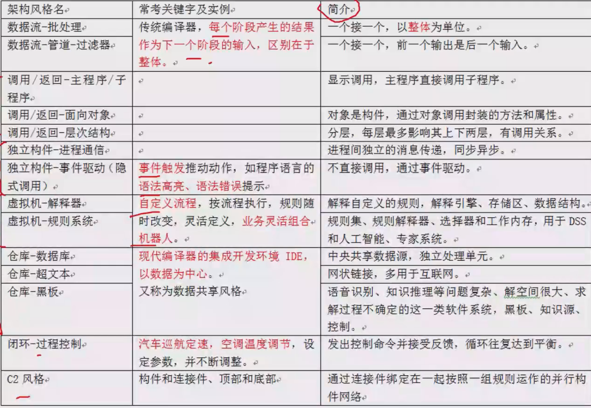

数据流：一个接一个

管道：例如 ps | grep  中的 | 就是管道

调用返回：调用程序，对象和层次

独立构件：进行进程间的通信和事件驱动

虚拟机：解释器--自定义规则  虚拟机--规则集合，例如人工智能、专家系统

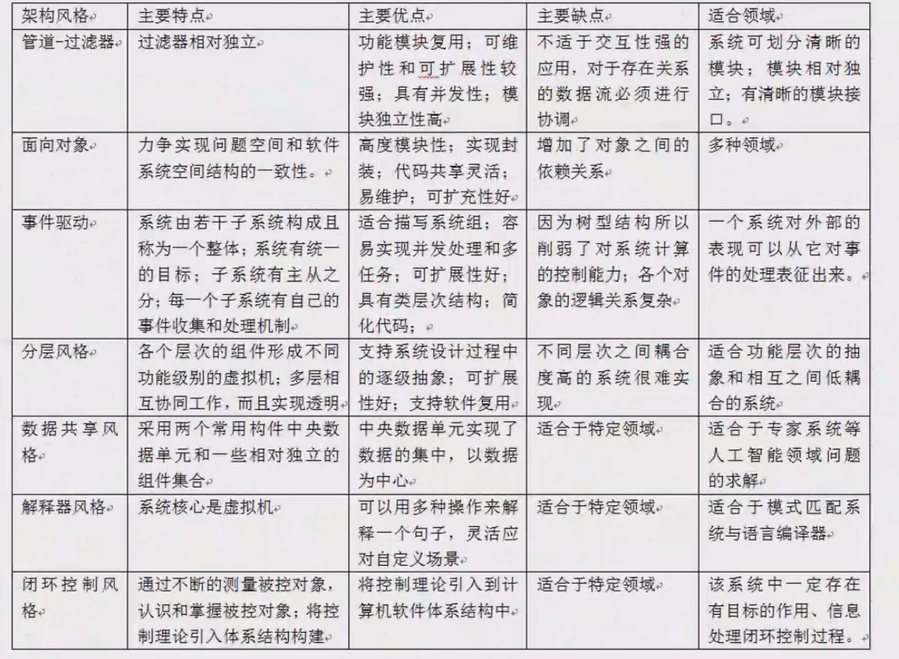

MVC架构：重要

J2EE架构：不用深入

SOA：一种设计理念，其中包含多个服务，粗粒度、低耦合

ESB企业服务总线：用一个管道来连接各个服务节点，集成不同协议、不同服务，进行消息转换

总线、服务注册与服务发现、消息转换、发现、路由、匹配等

# 题目1：架构设计例题

## 质量属性题

1、质量属性效用树

2、瘦客户端  前后端分离

胖客户端  服务器只有数据库，业务逻辑都在客户端

## 架构风格

## web开发

EJB的三种bean：消息驱动bean 在实体bean之间传递消息，实体bean 建立实体，会话bean 建立客户端会话

有状态：会存储数据

无状态：不会产生数据存储

# 系统开发基础

结构化特点：自顶向下、逐步分解、面向数据

三大模型：功能模型（数据流图）、行为模型（状态转换图）、数据模型（ER图）以及数据字典

UML

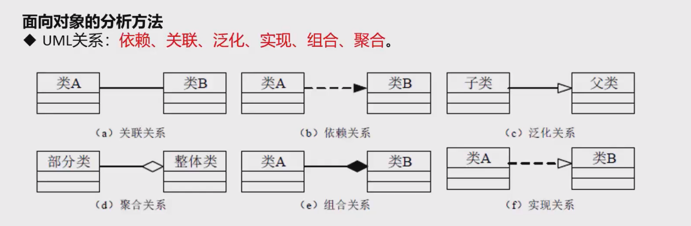

组合：两个类具有相同的生命周期  大雁翅膀与大雁

聚合：两个类不需要具有相同的生命周期  大雁与雁群

用例图

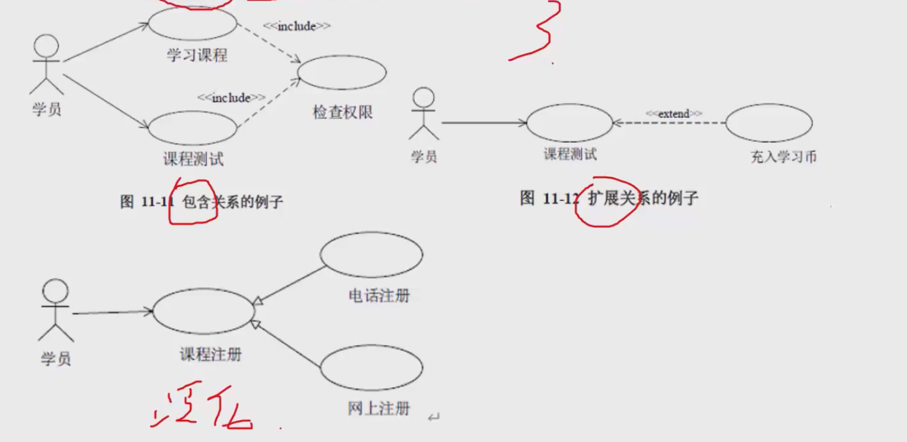

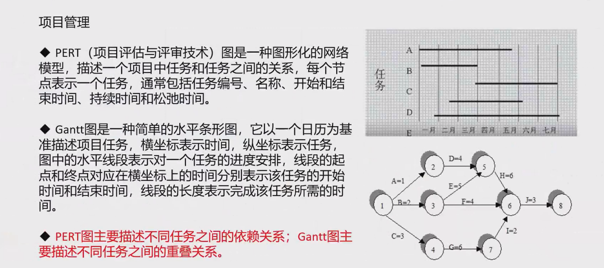

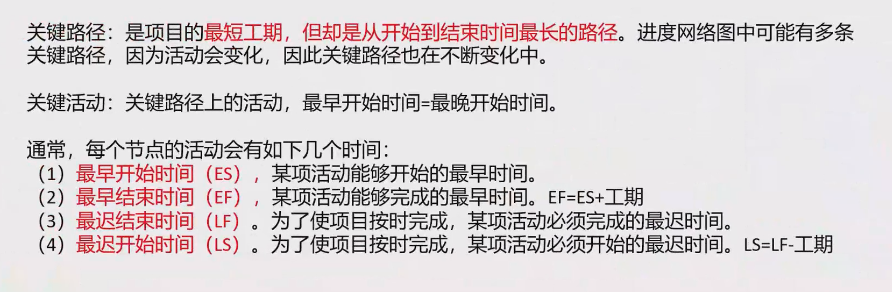

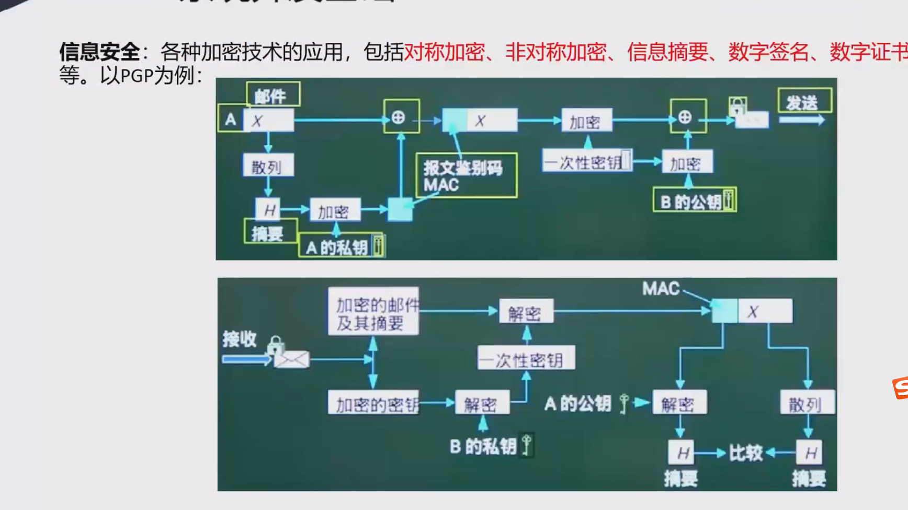

## DFD图

P：动作服务

D:持久化文件   某某文件

E:实体，个体

