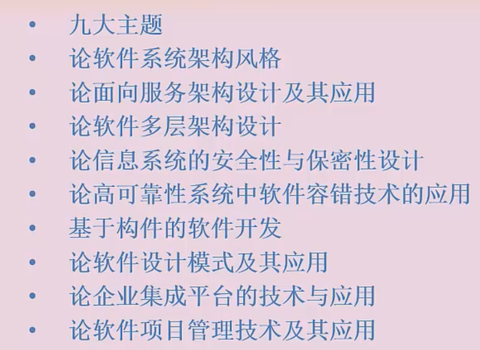

# 论文

## 选定自己的项目

架构设计

系统建模

系统设计与分析

系统可靠性分析与设计

系统安全性与保密性设计

论文：字数、多架构，少技术细节

## 论文结构

## 摘要

少于330字

 项目名称、项目金额、项目历时、项目金额、我的责任

想

## 项目背景

500-600字

项目开发原因、岗位职责、项目开发周期、规模、项目功能介绍、项目技术

## 正文

1200字左右

## 正文论文框架

 

## 结尾

## 九大主题

