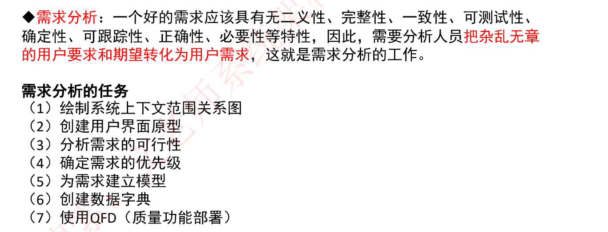

# 一轮（阅读PDF）

## 概念

## 能力成熟度模型

## 软件模型

瀑布模型

螺旋模型

原型化模型

增量模型

喷泉模型

基于构件的开发模型CBSD

形式化方法模型

敏捷模型

统一过程模型

## 逆向工程

重构

设计恢复

再工程

正向工程

## 软件需求

### 需求开发

业务需求

用户需求

系统需求

### 需求获取

### 需求分析

#### 概述

#### 数据流图DFD

#### 数据字典DD

### 需求定义

### 需求验证

### 需求管理

## 处理流程设计

流程图表示工具：程序流程图，IPO图，N-S图，问题分析图（PAD）

业务流程重组BPR

业务流程管理BPM

## 系统设计

## 人机界面设计

## 测试

### 测试原则

### 测试方法

### 测试阶段

### 测试用例的设计

## 调试

## 软件度量

## 系统转换

## 系统维护

## 净室软件工程

## 基于构件的软件工程

