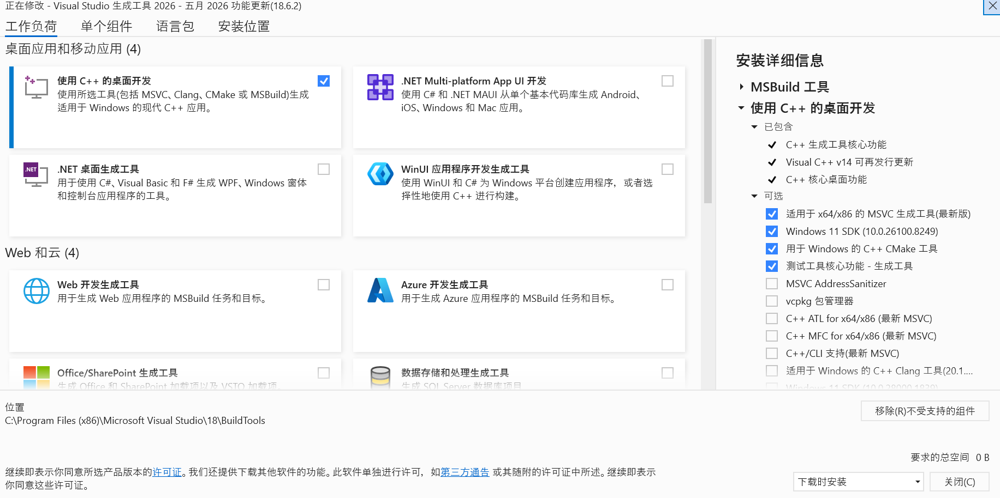

[pip install hnswlib安装不成功_building wheel for chroma-hnswlib (pyproject.toml)-CSDN博客](https://blog.csdn.net/weixin_44750594/article/details/145146444)

[python - ERROR: Could not build wheels for hnswlib, which is required to install pyproject.toml-based projects - Stack Overflow](https://stackoverflow.com/questions/73969269/error-could-not-build-wheels-for-hnswlib-which-is-required-to-install-pyprojec)

[Microsoft C++ 生成工具 - Visual Studio](https://visualstudio.microsoft.com/zh-hans/visual-cpp-build-tools/)

